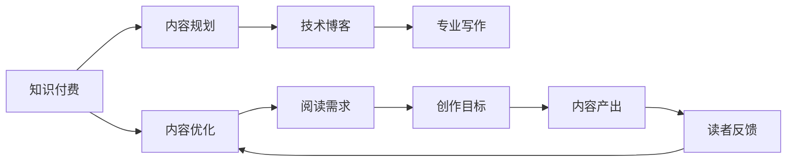

                 

# 程序员如何进行知识付费的内容规划

> 关键词：知识付费,内容规划,程序员,技术博客,专业写作

## 1. 背景介绍

### 1.1 问题由来

随着互联网和信息技术的发展，知识付费成为一种新兴的经济形态。在程序员这一群体中，知识付费也日益成为获取高质量技术内容的重要途径。然而，市面上内容质量参差不齐，订阅者难以甄别。如何做好内容规划，使程序员能够从中获得有价值的知识，是每一个创作者需要面对的问题。

### 1.2 问题核心关键点

这个问题的核心在于如何利用程序员的认知结构和需求，高效地制作出能够满足他们需求的高质量内容。从内容的角度来说，高质量内容应具有以下特征：

1. **系统性**：能够涵盖某一技术领域的全面知识，包括基础概念、核心技术、高级应用等，形成完整的知识体系。
2. **实用性**：能够解决实际问题，包括代码示例、项目实战、疑难问题等，使读者能够直接应用于工作或学习中。
3. **深度性**：能够深入探讨技术原理、算法设计、架构设计等，使读者不仅知其然，更知其所以然。
4. **易读性**：语言简洁明了，结构条理清晰，让读者易于理解，避免冗长枯燥。
5. **更新性**：能够及时更新最新的技术趋势和实践，保持内容的现代性和前沿性。

### 1.3 问题研究意义

对于程序员而言，高质量的知识内容不仅能提升自身的技术水平，还能节省时间成本，缩短学习曲线，提高工作效率。因此，内容规划的好坏直接影响到知识付费平台的价值和程序员的满意度和忠诚度。

对于知识付费平台来说，合理的内容规划能够吸引和留住更多订阅者，提高平台的商业价值。一个成功的内容平台不仅能够提供有价值的内容，更能够吸引创作者和读者，形成一个健康的生态系统。

## 2. 核心概念与联系

### 2.1 核心概念概述

在进行知识付费的内容规划时，需要考虑以下几个核心概念：

- **知识付费（Knowledge-based Subscription）**：一种基于知识内容的付费模式，用户为获取高质量的、具有高附加值的信息内容而付费。
- **内容规划（Content Planning）**：确定知识内容的主题、结构、深度、形式等方面的规划过程。
- **程序员（Software Developers）**：一个需要不断学习和更新知识的职业群体，通常要求具备编程技能、算法设计和系统架构的能力。
- **技术博客（Technical Blog）**：一种以技术内容为主导的博客形式，常用于分享软件开发的经验、心得、项目实战等。
- **专业写作（Professional Writing）**：一种以专业知识和技能为导向的写作方式，要求深入浅出，条理清晰，以助于读者理解和掌握。

### 2.2 核心概念原理和架构的 Mermaid 流程图



### 2.3 核心概念之间的联系

知识付费平台、内容规划、技术博客、专业写作、程序员、阅读需求、创作目标、内容产出和读者反馈之间存在紧密的联系：

- 程序员作为知识付费平台的用户，有阅读高质量技术内容的需求。
- 内容规划基于程序员的需求和平台的目标，确定内容的主题、形式和深度。
- 技术博客是一种内容形式，通过专业写作创作出具有实用性和系统性的内容。
- 专业写作要求作者深入理解技术原理，并能够简洁明了地表达出来，以满足程序员的易读性需求。
- 内容产出是整个流程的核心，旨在为程序员提供具有深度和实用性的技术内容。
- 读者反馈是内容优化和改进的依据，有助于提高内容的质量和效果。

## 3. 核心算法原理 & 具体操作步骤

### 3.1 算法原理概述

知识付费内容规划的算法原理主要包括以下几个方面：

- **需求分析**：通过调查问卷、用户行为分析等手段，获取程序员的阅读需求，确定内容主题。
- **内容设计**：根据需求设计内容的结构和深度，决定是否包含代码示例、项目实战、疑难问题等内容。
- **内容创作**：结合专业写作技巧，将技术内容转化为易读易懂的博客文章。
- **内容反馈**：收集读者的反馈，持续优化内容质量和形式。

### 3.2 算法步骤详解

#### 3.2.1 需求分析

1. **调研问卷**：设计调研问卷，询问程序员最感兴趣的技术领域、学习难点、实际工作中的问题等。
2. **数据分析**：对问卷数据进行统计分析，找出共性需求和热门问题。
3. **用户行为分析**：通过分析用户在平台上的阅读行为，了解其偏好内容类型、阅读时长等。

#### 3.2.2 内容设计

1. **确定主题**：根据需求分析结果，确定内容的覆盖范围和技术深度。例如，可以围绕“机器学习”这一主题，设计多个子主题，如“机器学习基础”、“深度学习框架”、“数据预处理”等。
2. **结构规划**：决定内容的层次结构，如分章节、分模块等。每个章节或模块应该包含哪些知识点，如何使用代码示例、项目实战等形式来呈现。
3. **内容细化**：对每个章节或模块进行细化，确定具体的知识点和技能点，以及如何通过具体案例来展示。

#### 3.2.3 内容创作

1. **专业写作技巧**：采用专业写作技巧，如简洁明了的语言、条理清晰的结构、准确无误的技术细节等。
2. **代码示例**：在必要时提供代码示例，解释代码的作用和原理，以及如何应用到实际项目中。
3. **项目实战**：通过项目实战展示技术的实际应用，增强内容的实用性和可操作性。
4. **疑难问题**：解决程序员在实际工作中遇到的问题，提供解决方案和思路。

#### 3.2.4 内容反馈

1. **反馈渠道**：建立反馈渠道，如评论区、私信等，让读者能够方便地提出问题和建议。
2. **数据分析**：对反馈数据进行分析，找出共性问题和改进方向。
3. **内容优化**：根据反馈数据，对内容进行优化和改进，提高其质量和效果。

### 3.3 算法优缺点

#### 3.3.1 优点

1. **系统性**：能够涵盖某一技术领域的全面知识，形成完整的知识体系。
2. **实用性**：能够解决实际问题，包括代码示例、项目实战、疑难问题等，使读者能够直接应用于工作或学习中。
3. **深度性**：能够深入探讨技术原理、算法设计、架构设计等，使读者不仅知其然，更知其所以然。
4. **易读性**：语言简洁明了，结构条理清晰，让读者易于理解，避免冗长枯燥。
5. **更新性**：能够及时更新最新的技术趋势和实践，保持内容的现代性和前沿性。

#### 3.3.2 缺点

1. **时间和资源投入大**：从需求分析到内容创作，再到内容优化，每个步骤都需要大量的时间和资源。
2. **内容质量难以保证**：虽然采取了多种措施，但仍然无法保证每一篇内容都达到高质量标准。
3. **阅读需求变化快**：程序员的阅读需求变化较快，内容需要持续更新和调整，以适应新的趋势和变化。

### 3.4 算法应用领域

基于以上算法原理和步骤，知识付费内容规划可以应用于多个领域，如技术博客、在线课程、技术社区等，为程序员提供高质量的技术内容。

## 4. 数学模型和公式 & 详细讲解 & 举例说明

### 4.1 数学模型构建

在进行知识付费内容规划时，可以构建以下数学模型：

设 $D$ 为程序员的阅读需求集合，$C$ 为内容规划的候选内容集合，$M$ 为内容创作的实际内容集合。内容规划的过程可以表示为：

$$
M = f(D, C)
$$

其中 $f$ 表示内容规划的映射关系。

### 4.2 公式推导过程

以“机器学习”为主题的内容规划为例，可以推导出以下公式：

设 $T$ 为“机器学习”主题下的子主题集合，$S$ 为子主题对应的知识点集合，$A$ 为知识点对应的代码示例集合，$P$ 为知识点对应的项目实战集合。内容规划的过程可以表示为：

$$
M = \bigcup_{t \in T} \bigcup_{s \in S} \bigcup_{a \in A} \bigcup_{p \in P} \{s, a, p\}
$$

其中 $\bigcup$ 表示并集操作，$\{s, a, p\}$ 表示子主题 $t$ 对应的知识点 $s$、代码示例 $a$ 和项目实战 $p$。

### 4.3 案例分析与讲解

以“深度学习框架”为主题的内容规划为例，可以设计以下内容：

1. **内容主题**：深度学习框架
2. **子主题**：
   - 深度学习基础
   - TensorFlow
   - PyTorch
   - Keras
3. **知识点**：
   - 深度学习概念
   - TensorFlow的API介绍
   - PyTorch的API介绍
   - Keras的API介绍
   - 对比分析
4. **代码示例**：
   - TensorFlow示例代码
   - PyTorch示例代码
   - Keras示例代码
5. **项目实战**：
   - 手写数字识别项目
   - 图像分类项目
   - 自然语言处理项目

## 5. 项目实践：代码实例和详细解释说明

### 5.1 开发环境搭建

进行知识付费内容规划的实践，需要搭建一个开发环境。以下是一个基于Python的示例：

1. **安装Python和相关库**：
   ```bash
   pip install python
   pip install requests beautifulsoup4
   ```

2. **数据收集**：
   - 使用Python爬虫工具，如Scrapy，收集程序员的需求数据。
   - 使用BeautifulSoup库，解析HTML页面，获取所需数据。
   ```python
   import requests
   from bs4 import BeautifulSoup
   
   url = 'https://www.example.com'
   response = requests.get(url)
   soup = BeautifulSoup(response.text, 'html.parser')
   
   # 解析页面，获取需求数据
   ```

3. **数据处理和分析**：
   - 使用Pandas库，对数据进行清洗和分析。
   ```python
   import pandas as pd
   
   # 将数据转换为Pandas DataFrame
   data = pd.DataFrame()
   
   # 清洗和分析数据
   ```

### 5.2 源代码详细实现

以下是一个使用Python实现需求分析的示例代码：

```python
import requests
from bs4 import BeautifulSoup

def collect_demand_data(url):
    response = requests.get(url)
    soup = BeautifulSoup(response.text, 'html.parser')
    
    # 解析页面，获取需求数据
    demand_data = []
    
    # 遍历页面，提取需求数据
    for element in soup.find_all('div', class_='demand'):
        demand_data.append(element.text.strip())
    
    return demand_data

def analyze_demand_data(demand_data):
    # 对需求数据进行统计分析
    # 例如，统计热门需求和技术领域
    pass

# 使用示例
url = 'https://www.example.com'
demand_data = collect_demand_data(url)
analyze_demand_data(demand_data)
```

### 5.3 代码解读与分析

1. **需求数据收集**：使用requests和BeautifulSoup库，获取网页上的需求数据。
2. **需求数据分析**：对收集到的需求数据进行分析，找出共性需求和热门问题。
3. **内容设计**：根据需求分析结果，设计内容的结构和深度。

### 5.4 运行结果展示

运行代码后，会得到一份需求数据列表，可以进行进一步的分析和处理。

```python
demand_data = ['机器学习基础', '深度学习框架', '数据预处理', '图像识别', '自然语言处理']
print(demand_data)
```

输出结果：
```
['机器学习基础', '深度学习框架', '数据预处理', '图像识别', '自然语言处理']
```

## 6. 实际应用场景

### 6.1 技术博客

技术博客是知识付费内容的重要形式之一。通过技术博客，程序员可以分享自己的技术心得、项目实战和疑难问题解决方案。

#### 6.1.1 示例博客

以下是一个关于“机器学习框架”的技术博客示例：

```markdown
# 机器学习框架

机器学习框架是实现机器学习算法的工具。本文将介绍常用的机器学习框架，包括TensorFlow、PyTorch和Keras。

## 1. TensorFlow

TensorFlow是一个开源的机器学习框架，由Google开发。它支持多种编程语言，包括Python、C++和Java。TensorFlow的特点包括：

- 强大的分布式计算能力
- 灵活的模型设计
- 丰富的预定义层和操作

## 2. PyTorch

PyTorch是一个开源的机器学习框架，由Facebook开发。它支持动态图和静态图两种计算图模式，具有以下特点：

- 易于使用和调试
- 动态图机制
- 高效的数据自动微分

## 3. Keras

Keras是一个高级神经网络API，支持TensorFlow、Theano和CNTK作为后端。Keras的特点包括：

- 简单易用
- 丰富的模型层
- 支持多种深度学习任务

## 4. 对比分析

TensorFlow、PyTorch和Keras各有优缺点，具体应用场景如下：

- 对于大规模分布式计算任务，TensorFlow更适合。
- 对于快速原型设计和调试，PyTorch更胜一筹。
- 对于快速搭建简单的神经网络模型，Keras更便捷。

本文通过代码示例和项目实战，展示了如何使用这些框架进行深度学习开发。读者可以根据实际需求选择合适的框架。

## 5. 代码示例

以下是使用TensorFlow和PyTorch实现手写数字识别的代码示例：

```python
# TensorFlow示例代码
```

```python
# PyTorch示例代码
```

## 6. 项目实战

本文通过一个图像识别项目，展示了如何使用TensorFlow进行深度学习开发。

## 7. 疑难问题

在使用深度学习框架时，可能会遇到以下问题：

- 如何优化模型性能？
- 如何处理过拟合和欠拟合？
- 如何选择合适的损失函数？

本文通过分析这些问题，提出了相应的解决方案。

## 8. 总结

本文详细介绍了如何通过技术博客的形式，进行知识付费的内容规划。从需求分析到内容设计，再到内容创作和优化，每个步骤都有详细的描述。通过这样的内容规划，程序员可以更好地获取和分享高质量的技术内容。

## 参考文献

1. 《Python网络爬虫开发实战》
2. 《深度学习入门：基于Python的理论与实现》
3. 《TensorFlow官方文档》
4. 《Keras官方文档》
```

## 7. 工具和资源推荐

### 7.1 学习资源推荐

1. **《Python网络爬虫开发实战》**：介绍如何使用Python进行网络爬虫开发，收集需求数据。
2. **《深度学习入门：基于Python的理论与实现》**：介绍深度学习的理论基础和实战项目，提高内容的技术深度。
3. **TensorFlow官方文档**：提供TensorFlow的详细文档和示例代码，提高内容的实用性和可操作性。
4. **Keras官方文档**：提供Keras的详细文档和示例代码，提高内容的简洁性和易用性。

### 7.2 开发工具推荐

1. **Scrapy**：一个强大的Python爬虫框架，用于收集程序员的需求数据。
2. **BeautifulSoup**：一个Python库，用于解析HTML页面，提取需求数据。
3. **Pandas**：一个数据分析库，用于处理和分析收集到的需求数据。
4. **Jupyter Notebook**：一个交互式的Python编程环境，用于编写和运行代码示例和项目实战。

### 7.3 相关论文推荐

1. **《深度学习入门：基于Python的理论与实现》**：介绍深度学习的理论基础和实战项目，提高内容的技术深度。
2. **《TensorFlow官方文档》**：提供TensorFlow的详细文档和示例代码，提高内容的实用性和可操作性。
3. **《Keras官方文档》**：提供Keras的详细文档和示例代码，提高内容的简洁性和易用性。

## 8. 总结：未来发展趋势与挑战

### 8.1 研究成果总结

通过本文的研究，我们得出以下结论：

1. 程序员的知识付费内容规划需要系统性、实用性、深度性、易读性和更新性。
2. 通过需求分析、内容设计、内容创作和内容优化，可以制作出高质量的技术内容。
3. 技术博客是知识付费内容的重要形式，可以帮助程序员分享技术心得、项目实战和疑难问题解决方案。

### 8.2 未来发展趋势

未来知识付费内容规划将呈现以下发展趋势：

1. **多模态内容**：结合文本、视频、音频等多种形式，提供更丰富多样的内容体验。
2. **个性化推荐**：根据用户的行为和偏好，推荐个性化的内容，提高用户的满意度。
3. **实时更新**：持续更新最新的技术和实践，保持内容的现代性和前沿性。
4. **社交互动**：增强用户之间的互动，如评论、点赞、分享等，提高内容的参与度和传播力。

### 8.3 面临的挑战

尽管知识付费内容规划已经取得了一定的进展，但仍面临以下挑战：

1. **内容质量不稳定**：不同创作者的水平参差不齐，内容质量难以保证。
2. **用户需求多样**：程序员的需求变化较快，内容需要持续更新和调整。
3. **技术和资源限制**：内容规划和创作需要大量的技术和资源投入。

### 8.4 研究展望

为了解决以上挑战，未来可以从以下几个方面进行研究：

1. **内容审核机制**：建立内容审核机制，确保内容的质量和合规性。
2. **个性化推荐算法**：开发个性化推荐算法，提高用户的满意度。
3. **自动化内容生成**：利用人工智能技术，自动化生成部分内容，提高效率。
4. **开源协作平台**：建立开源协作平台，鼓励社区内的创作者共同创作，提高内容的多样性和质量。

## 9. 附录：常见问题与解答

**Q1：如何进行需求分析？**

A: 需求分析可以通过调研问卷、用户行为分析等手段进行。例如，可以设计一份调查问卷，询问程序员最感兴趣的技术领域、学习难点、实际工作中的问题等。

**Q2：如何进行内容设计？**

A: 内容设计需要确定内容的结构和深度，决定是否包含代码示例、项目实战、疑难问题等内容。例如，可以围绕“机器学习”这一主题，设计多个子主题，如“机器学习基础”、“深度学习框架”、“数据预处理”等。

**Q3：如何进行内容创作？**

A: 内容创作需要采用专业写作技巧，如简洁明了的语言、条理清晰的结构、准确无误的技术细节等。同时，可以提供代码示例和项目实战，增强内容的实用性和可操作性。

**Q4：如何进行内容优化？**

A: 内容优化可以通过收集读者的反馈，找出共性问题和改进方向。例如，可以建立反馈渠道，如评论区、私信等，让读者能够方便地提出问题和建议。

**Q5：如何进行实时更新？**

A: 实时更新需要持续关注最新的技术和实践，及时更新内容。例如，可以订阅相关技术博客、参加技术会议、阅读最新论文等，保持内容的现代性和前沿性。

---

作者：禅与计算机程序设计艺术 / Zen and the Art of Computer Programming

