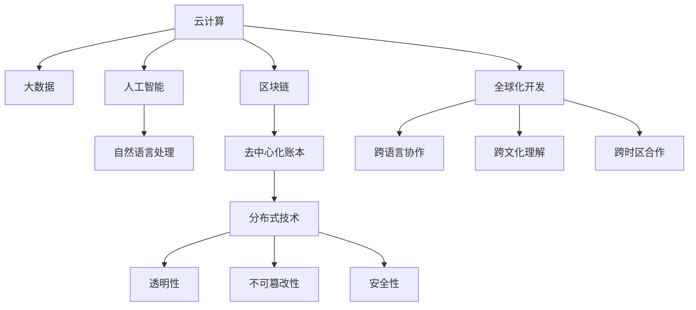
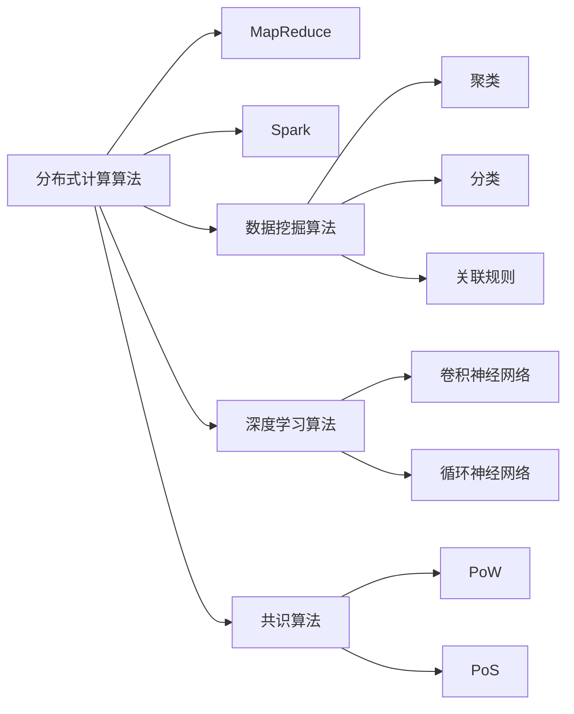

                 

# 程序员的全球化视野：机遇与挑战

## 1. 背景介绍

### 1.1 全球化背景
随着互联网的普及和通信技术的飞速发展，全球化已经成为当今社会的一个显著特征。全球化不仅改变了人们的生产、生活方式，也为程序员提供了前所未有的机遇和挑战。在全球化的背景下，程序员需要具备更广阔的视野，更全面的技能，以及更强的跨文化沟通能力，才能在快速变化的环境中保持竞争力。

### 1.2 技术背景
全球化时代，技术领域也正在发生深刻的变革。云计算、大数据、人工智能、区块链等新兴技术的兴起，使得全球范围内的技术交流更加频繁，程序员可以更容易地获取和学习最新的技术知识。同时，全球化也带来了更高的技术要求和更严峻的技术挑战，如数据安全、隐私保护、跨语言开发等问题。

## 2. 核心概念与联系

### 2.1 核心概念概述

为更好地理解全球化背景下的技术发展趋势，本节将介绍几个密切相关的核心概念：

- **云计算(Cloud Computing)**：一种基于互联网的计算模式，用户通过网络访问云计算平台，获取所需的计算资源。云计算提供了弹性的计算能力和按需计费的服务，极大地降低了技术门槛和开发成本。

- **大数据(Big Data)**：指通过互联网技术收集、存储和分析的超大规模数据集。大数据技术能够挖掘和利用数据中的价值，支持决策和业务优化，是全球化数据驱动技术的重要组成部分。

- **人工智能(Artificial Intelligence, AI)**：一种模拟人类智能的技术，包括机器学习、深度学习、自然语言处理等。AI技术在处理复杂问题、优化决策和提升用户体验方面展现出强大的能力，是全球化技术创新的核心动力。

- **区块链(Blockchain)**：一种去中心化的分布式账本技术，具有透明性、不可篡改性和安全性。区块链技术在金融、供应链、医疗等领域有着广泛的应用前景，是全球化技术创新的新方向。

- **全球化开发(Global Development)**：指在跨国团队中协作开发软件，包括跨语言、跨文化、跨时区等合作模式。全球化开发需要团队具备良好的沟通协调能力、跨文化理解和灵活的工作方式。

这些核心概念之间的逻辑关系可以通过以下Mermaid流程图来展示：



这个流程图展示了几类核心概念及其之间的关系：

1. 云计算是数据存储和处理的基础设施，大数据技术依托于云计算技术。
2. 人工智能是利用大数据进行智能分析和决策的核心技术。
3. 区块链是一种新兴的技术创新，在安全性、透明性等方面具有独特优势。
4. 全球化开发是跨国团队协作开发的实践，涉及跨语言、跨文化、跨时区的多个维度。

这些核心概念共同构成了全球化技术发展的框架，程序员需要理解并掌握这些概念，才能在全球化背景下保持竞争力。

## 3. 核心算法原理 & 具体操作步骤

### 3.1 算法原理概述

全球化技术的发展，尤其是云计算、大数据、人工智能等领域的突破，带来了许多全新的算法和模型。以下是对其中几个核心算法的简要概述：

- **云计算中的分布式计算算法**：云计算平台通过分布式计算算法，将大规模任务分解为多个子任务，并行处理，以提高计算效率。常见的分布式计算算法包括MapReduce、Spark等。

- **大数据中的数据挖掘算法**：大数据技术通过数据挖掘算法，从海量数据中提取有价值的信息。常见的数据挖掘算法包括聚类、分类、关联规则等。

- **人工智能中的深度学习算法**：深度学习算法通过多层神经网络，模拟人类大脑的神经元工作方式，能够处理复杂的数据和任务。常见的深度学习算法包括卷积神经网络、循环神经网络等。

- **区块链中的共识算法**：区块链通过共识算法，保证网络中所有节点的数据一致性。常见的共识算法包括PoW、PoS等。

这些算法之间的联系可以通过以下Mermaid流程图来展示：



这个流程图展示了几个核心算法及其相互关系：

1. 分布式计算算法是云计算和大数据技术的基石。
2. 数据挖掘算法能够从大数据中提取有用信息，是人工智能的必备工具。
3. 深度学习算法是人工智能的核心技术，可以处理复杂的数据和任务。
4. 共识算法是区块链技术的核心，保证网络数据一致性。

### 3.2 算法步骤详解

#### 3.2.1 分布式计算算法步骤详解

分布式计算算法通常包括以下几个步骤：

1. **任务分解**：将大规模任务分解为多个子任务，分配到不同的计算节点处理。
2. **并行处理**：各计算节点独立执行子任务，并行计算。
3. **合并结果**：各节点处理完毕后，将结果合并，得到最终输出。

以MapReduce算法为例，其具体步骤如下：

- **Map阶段**：将输入数据分成多个小块，并行执行映射操作，生成中间结果。
- **Shuffle阶段**：将中间结果按照某一规则合并，排序，并重新分配到不同的计算节点。
- **Reduce阶段**：各节点执行归约操作，最终生成输出结果。

#### 3.2.2 数据挖掘算法步骤详解

数据挖掘算法通常包括以下几个步骤：

1. **数据预处理**：清洗、归一化、采样等处理数据。
2. **特征提取**：从原始数据中提取有用的特征。
3. **模型训练**：使用特征训练数据挖掘模型，如聚类、分类、关联规则等。
4. **结果评估**：对模型结果进行评估和优化，确保模型性能。

以K-Means聚类算法为例，其具体步骤如下：

- **初始化**：随机选择K个样本作为聚类中心。
- **迭代计算**：对每个样本计算其到各聚类中心的距离，分配到最近的聚类中心。
- **更新聚类中心**：计算每个聚类中所有样本的均值，更新聚类中心。
- **重复迭代**：重复上述步骤，直到聚类结果收敛。

#### 3.2.3 深度学习算法步骤详解

深度学习算法通常包括以下几个步骤：

1. **数据预处理**：对原始数据进行清洗、归一化、采样等处理。
2. **构建模型**：设计多层神经网络结构，初始化权重。
3. **前向传播**：将输入数据传递到网络中，计算输出结果。
4. **损失计算**：计算输出结果与真实标签之间的损失。
5. **反向传播**：根据损失函数计算各层参数的梯度。
6. **参数更新**：使用优化算法更新模型参数，优化损失函数。
7. **模型评估**：使用测试数据集评估模型性能，确定模型是否过拟合。

以卷积神经网络(CNN)为例，其具体步骤如下：

- **卷积层**：对输入数据进行卷积操作，提取局部特征。
- **池化层**：对卷积结果进行池化操作，降低维度。
- **全连接层**：将池化结果传递到全连接层，进行特征整合和分类。
- **softmax层**：对输出结果进行softmax操作，得到概率分布。

#### 3.2.4 共识算法步骤详解

共识算法通常包括以下几个步骤：

1. **节点同步**：各节点下载完整的区块链数据，保持一致。
2. **新区块验证**：新节点向网络广播新区块，其他节点验证区块是否合法。
3. **共识达成**：通过共识算法，网络中达成一致，决定是否接受新区块。
4. **区块添加**：将合法的新区块添加到区块链中，更新区块链数据。

以PoW共识算法为例，其具体步骤如下：

- **挖矿**：节点尝试解出新区块的哈希值，生成挖矿结果。
- **验证**：节点验证挖矿结果的正确性，确保新区块符合规则。
- **奖励**：节点获得挖矿奖励，以激励继续挖矿。
- **更新区块**：将挖矿结果添加到区块链中，更新区块链数据。

### 3.3 算法优缺点

#### 3.3.1 分布式计算算法的优缺点

**优点**：

- 能够处理大规模数据和任务，提高计算效率。
- 能够充分利用计算资源，降低单个节点的负载压力。

**缺点**：

- 分布式系统的设计和维护复杂，需要具备较高的技术水平。
- 数据传输和通信开销较大，可能会影响系统性能。

#### 3.3.2 数据挖掘算法的优缺点

**优点**：

- 能够从海量数据中提取有价值的信息，支持决策和优化。
- 能够发现数据中的模式和规律，提高模型的可解释性。

**缺点**：

- 数据挖掘算法对数据质量要求较高，处理复杂数据时需要额外的预处理步骤。
- 算法复杂度高，计算量大，需要较长的训练时间。

#### 3.3.3 深度学习算法的优缺点

**优点**：

- 能够处理复杂的数据和任务，具有很强的泛化能力。
- 能够自适应地学习特征，不需要手动设计特征。

**缺点**：

- 深度学习模型结构复杂，难以理解和调试。
- 训练数据需求量大，需要大量计算资源。

#### 3.3.4 共识算法的优缺点

**优点**：

- 能够保证网络数据的一致性，避免单点故障。
- 能够实现去中心化的数据存储，提高系统的安全性。

**缺点**：

- 共识算法复杂度高，需要高网络延迟和带宽。
- 网络中需要大量节点参与，可能会影响系统性能。

### 3.4 算法应用领域

全球化技术的发展，使得许多算法在多个领域得到了广泛应用：

- **云计算**：云计算技术广泛应用于企业级应用、SaaS软件、大数据处理等。
- **大数据**：大数据技术广泛应用于金融、医疗、零售、社交媒体等领域，支持决策和优化。
- **人工智能**：人工智能技术广泛应用于智能客服、自动驾驶、智能家居、医疗诊断等领域。
- **区块链**：区块链技术广泛应用于金融、供应链、版权保护、物联网等领域，提供安全可靠的数据存储和传输机制。
- **全球化开发**：全球化开发技术广泛应用于跨国团队协作、跨语言开发、跨文化沟通等场景。

这些算法和技术的应用，为程序员提供了更多的选择和可能性，同时也带来了更高的要求和挑战。

## 4. 数学模型和公式 & 详细讲解  
### 4.1 数学模型构建

以下是几个核心算法的数学模型和公式的简要介绍：

#### 4.1.1 分布式计算算法

- **MapReduce算法**：

$$
\text{Map}(x) = \{(k, v)\} \quad \text{其中} \quad k = \text{key}(x), v = \text{value}(x)
$$

$$
\text{Reduce}(\{(k, v)\}) = \{(k, v_1, v_2, ..., v_n)\}
$$

其中，$x$为输入数据，$k$为键，$v$为值。

#### 4.1.2 数据挖掘算法

- **K-Means聚类算法**：

$$
\text{初始化} \quad O_{i_0} = X_i
$$

$$
\text{迭代计算} \quad O_i = \arg\min_{O_{i_k}} \sum_{x \in O_{i_k}} ||x - O_{i_k}||^2
$$

其中，$O_{i_k}$为聚类中心，$X_i$为样本点，$||.||$为欧式距离。

#### 4.1.3 深度学习算法

- **卷积神经网络**：

$$
h_1 = f(W_1 * x + b_1)
$$

$$
h_2 = f(W_2 * h_1 + b_2)
$$

其中，$f$为激活函数，$W$为权重矩阵，$b$为偏置向量。

#### 4.1.4 共识算法

- **PoW共识算法**：

$$
\text{挖矿结果} = \text{哈希值}
$$

$$
\text{验证结果} = \text{哈希值} \in \text{合法新区块}
$$

其中，哈希值由矿工计算生成，验证结果由网络节点验证。

### 4.2 公式推导过程

以下是对几个核心算法的公式推导过程的简要介绍：

#### 4.2.1 MapReduce算法

MapReduce算法主要通过分治的思想，将大规模任务分解为多个子任务，并行处理。具体推导过程如下：

1. **Map阶段**：

$$
M(x) = \{(k, v)\} \quad \text{其中} \quad k = \text{key}(x), v = \text{value}(x)
$$

2. **Shuffle阶段**：

$$
\text{合并结果} = \{(k_i, v_i)\}
$$

3. **Reduce阶段**：

$$
R(\{(k_i, v_i)\}) = \{(k_i, v_1, v_2, ..., v_n)\}
$$

其中，$x$为输入数据，$k$为键，$v$为值，$i$为迭代次数。

#### 4.2.2 K-Means聚类算法

K-Means聚类算法主要通过迭代计算，逐步优化聚类中心。具体推导过程如下：

1. **初始化**：

$$
O_{i_0} = X_i
$$

2. **迭代计算**：

$$
O_i = \arg\min_{O_{i_k}} \sum_{x \in O_{i_k}} ||x - O_{i_k}||^2
$$

其中，$O_{i_k}$为聚类中心，$X_i$为样本点，$||.||$为欧式距离，$i$为迭代次数。

#### 4.2.3 卷积神经网络

卷积神经网络主要通过卷积层、池化层和全连接层，实现特征提取和分类。具体推导过程如下：

1. **卷积层**：

$$
h_1 = f(W_1 * x + b_1)
$$

其中，$W$为权重矩阵，$b$为偏置向量，$*$为卷积操作，$f$为激活函数。

2. **池化层**：

$$
h_2 = f(W_2 * h_1 + b_2)
$$

其中，$W$为权重矩阵，$b$为偏置向量，$*$为池化操作，$f$为激活函数。

3. **全连接层**：

$$
h_3 = f(W_3 * h_2 + b_3)
$$

其中，$W$为权重矩阵，$b$为偏置向量，$f$为激活函数。

#### 4.2.4 PoW共识算法

PoW共识算法主要通过挖矿和验证，保证网络数据的一致性。具体推导过程如下：

1. **挖矿**：

$$
\text{挖矿结果} = \text{哈希值}
$$

2. **验证**：

$$
\text{验证结果} = \text{哈希值} \in \text{合法新区块}
$$

其中，哈希值由矿工计算生成，验证结果由网络节点验证。

### 4.3 案例分析与讲解

#### 4.3.1 云计算案例分析

以Google Cloud Platform为例，其核心技术包括分布式计算、大数据处理和人工智能。通过分布式计算技术，Google能够处理大规模任务，提高计算效率。例如，在机器学习领域，Google利用MapReduce算法，将大规模数据集分成多个子集，并行处理，显著提高了模型的训练速度。

#### 4.3.2 大数据案例分析

以IBM Watson为例，其核心技术包括数据挖掘和大数据处理。通过数据挖掘技术，Watson能够从海量数据中提取有价值的信息，支持决策和优化。例如，在医疗领域，Watson能够从电子病历、医学文献等数据中提取有用的知识，辅助医生诊断和治疗。

#### 4.3.3 深度学习案例分析

以OpenAI GPT为例，其核心技术包括深度学习和自然语言处理。通过深度学习技术，GPT能够处理复杂的数据和任务，具有很强的泛化能力。例如，在自然语言生成领域，GPT能够生成自然流畅的文本，进行对话和摘要等任务。

#### 4.3.4 共识算法案例分析

以Bitcoin为例，其核心技术包括区块链和共识算法。通过共识算法，Bitcoin能够保证网络数据的一致性，避免单点故障。例如，在金融领域，Bitcoin能够提供安全可靠的数据存储和传输机制，保障交易的安全性和透明性。

## 5. 项目实践：代码实例和详细解释说明
### 5.1 开发环境搭建

在进行项目实践前，我们需要准备好开发环境。以下是使用Python进行云计算和大数据开发的简单环境配置流程：

1. 安装Anaconda：从官网下载并安装Anaconda，用于创建独立的Python环境。

2. 创建并激活虚拟环境：
```bash
conda create -n cloud-env python=3.8 
conda activate cloud-env
```

3. 安装PyTorch和Pandas：
```bash
conda install pytorch pandas
```

4. 安装Hadoop和Spark：
```bash
conda install hadoop hdfs-spark
```

5. 安装Apache Kafka：
```bash
conda install confluent-kafka
```

完成上述步骤后，即可在`cloud-env`环境中开始云计算和大数据项目开发。

### 5.2 源代码详细实现

以下是一个简单的Hadoop MapReduce算法示例代码，用于计算每个单词的出现次数。

```python
from mrjob.job import MRJob
from mrjob.step import MRStep

class WordCount(MRJob):

    def mapper(self, _, line):
        for word in line.split():
            yield word, 1

    def reducer(self, word, counts):
        yield word, sum(counts)

    def steps(self):
        return [MRStep(mapper=self.mapper, reducer=self.reducer)]

if __name__ == '__main__':
    WordCount.run()
```

在PySpark中，可以使用SparkRDD的map和reduceByKey函数实现相同的功能。以下是一个简单的Python SparkRDD示例代码：

```python
from pyspark import SparkContext, SparkConf

conf = SparkConf().setAppName("WordCount").setMaster("local")
sc = SparkContext(conf=conf)

data = sc.textFile("input.txt")

counts = data.flatMap(lambda line: line.split()).map(lambda word: (word, 1)).reduceByKey(lambda a, b: a + b)

for (word, count) in counts.collect():
    print("{}: {}".format(word, count))
```

在Hadoop中，可以使用Hadoop Streaming来实现相同的功能。以下是一个简单的Python Hadoop Streaming示例代码：

```python
from subprocess import Popen, PIPE

if __name__ == '__main__':
    p = Popen(["hadoop", "jar", "hadoop-streaming-2.7.0.jar", "-file", "mapper.py", "-mapper", "mapper.py", "-file", "reducer.py", "-reducer", "reducer.py", "-input", "input.txt", "-output", "output.txt"])
    stdout, stderr = p.communicate()
    print(stdout)
```

### 5.3 代码解读与分析

以上三个示例代码分别展示了Hadoop、Spark和Hadoop Streaming的MapReduce算法实现。其中，Hadoop和Hadoop Streaming使用了MapReduce的核心思想，而Spark则提供了更为便捷的RDD API，能够更加灵活地处理数据。

在Hadoop中，需要编写map和reduce函数，使用Hadoop Streaming工具进行作业的提交和执行。在Spark中，使用RDD API进行数据处理，可以通过链式操作进行简洁的代码实现。

在实际开发中，需要根据具体需求选择合适的框架和工具，进行灵活的定制和优化。

### 5.4 运行结果展示

在Hadoop中，可以使用Hadoop分布式文件系统(HDFS)来存储和访问数据，通过Hadoop Streaming工具进行作业的提交和执行。在Spark中，可以使用Spark分布式文件系统(S3、HDFS等)来存储和访问数据，通过Spark RDD API进行数据处理。

## 6. 实际应用场景

### 6.1 云计算应用场景

#### 6.1.1 企业级应用

云计算技术广泛应用于企业级应用，如ERP系统、CRM系统、BI分析等。通过云计算平台，企业能够实现数据存储、计算、处理和分析等功能，提高生产效率和决策能力。例如，在ERP系统中，企业可以利用云计算技术，实现供应链管理、库存管理、人力资源管理等功能。

#### 6.1.2 开发者平台

云计算技术也广泛应用于开发者平台，如AWS、Google Cloud、Azure等。通过云计算平台，开发者可以方便地进行代码托管、版本控制、测试和部署等操作。例如，在GitHub上，开发者可以创建代码仓库，进行版本控制，协作开发，提高开发效率。

### 6.2 大数据应用场景

#### 6.2.1 金融领域

大数据技术广泛应用于金融领域，如信用评估、风险控制、客户分析等。通过大数据技术，金融机构能够实时监控市场数据，分析客户行为，进行风险评估和优化。例如，在信用评估领域，大数据技术能够分析客户的信用记录、消费习惯等数据，进行信用评分和风险控制。

#### 6.2.2 医疗领域

大数据技术也广泛应用于医疗领域，如疾病预测、患者分析、医学研究等。通过大数据技术，医疗机构能够分析大量的医疗数据，进行疾病预测、患者分析，提高诊疗水平。例如，在疾病预测领域，大数据技术能够分析患者的基因数据、病历数据等，预测患病风险和疾病发展趋势。

### 6.3 人工智能应用场景

#### 6.3.1 自然语言处理

人工智能技术广泛应用于自然语言处理领域，如智能客服、机器翻译、情感分析等。通过人工智能技术，可以实现自动化处理自然语言数据，提供自然流畅的语音和文本交互。例如，在智能客服领域，人工智能技术能够处理大量的客户咨询，提供准确的答案，提高客户满意度。

#### 6.3.2 图像识别

人工智能技术也广泛应用于图像识别领域，如图像分类、物体检测等。通过人工智能技术，可以实现自动化处理图像数据，提供精准的图像分析和识别。例如，在物体检测领域，人工智能技术能够识别和定位图像中的物体，进行分类和识别。

### 6.4 区块链应用场景

#### 6.4.1 金融领域

区块链技术广泛应用于金融领域，如智能合约、资产管理、跨境支付等。通过区块链技术，可以实现去中心化的交易和结算，保障交易的安全性和透明性。例如，在智能合约领域，区块链技术能够自动化执行合同条款，减少人工干预，提高合同执行效率。

#### 6.4.2 供应链管理

区块链技术也广泛应用于供应链管理领域，如溯源管理、供应链金融等。通过区块链技术，可以实现供应链的透明化和追溯，提高供应链的效率和可信度。例如，在溯源管理领域，区块链技术能够记录产品的生产、运输、销售等全过程，保障产品的安全和品质。

## 7. 工具和资源推荐

### 7.1 学习资源推荐

为了帮助程序员掌握云计算、大数据、人工智能和区块链技术，这里推荐一些优质的学习资源：

1. 《云计算原理与实践》（Principles of Distributed Systems）：由Amazon Web Services（AWS）提供的在线课程，涵盖云计算基础、分布式系统设计、云安全等内容。

2. 《大数据技术与应用》（Big Data Techniques and Applications）：由Google Cloud提供的在线课程，涵盖大数据处理、数据挖掘、机器学习等内容。

3. 《深度学习》（Deep Learning）：由DeepLearning.AI提供的在线课程，涵盖深度学习基础、卷积神经网络、循环神经网络等内容。

4. 《区块链技术入门》（Blockchain Technology Basics）：由Blockchain Academy提供的在线课程，涵盖区块链基础、比特币原理、智能合约等内容。

5. 《自然语言处理》（Natural Language Processing）：由Stanford University提供的在线课程，涵盖自然语言处理基础、序列模型、神经网络等内容。

通过对这些资源的学习实践，相信你一定能够全面掌握云计算、大数据、人工智能和区块链技术，为全球化背景下的技术开发打下坚实基础。

### 7.2 开发工具推荐

为了提高全球化背景下的技术开发效率，这里推荐几款常用的开发工具：

1. PyTorch：由Facebook开发的深度学习框架，支持动态计算图和GPU加速，适合灵活的深度学习模型开发。

2. TensorFlow：由Google开发的深度学习框架，支持静态计算图和分布式训练，适合大规模深度学习模型开发。

3. Apache Spark：由Apache基金会开发的分布式计算框架，支持大数据处理和机器学习，适合大规模数据计算和分析。

4. Apache Hadoop：由Apache基金会开发的分布式计算框架，支持大数据存储和处理，适合大规模数据存储和计算。

5. AWS EC2：由Amazon Web Services提供的云服务，支持弹性计算和分布式计算，适合大规模云应用开发。

6. Google Cloud Platform（GCP）：由Google提供的云服务，支持弹性计算、分布式计算和人工智能，适合大规模云应用开发。

7. Microsoft Azure：由Microsoft提供的云服务，支持弹性计算、分布式计算和人工智能，适合大规模云应用开发。

合理利用这些工具，可以显著提升全球化背景下的技术开发效率，缩短产品开发周期，提高开发质量。

### 7.3 相关论文推荐

为了深入了解云计算、大数据、人工智能和区块链技术的发展，这里推荐几篇经典的研究论文：

1. "MapReduce: Simplified Data Processing on Large Clusters"：Andrew Ng等人在2008年发表的论文，提出了MapReduce算法，是云计算和分布式计算的里程碑。

2. "A Framework for Building Large-Scale Parallel Machine Learning Systems"：Andrew Ng等人在2012年发表的论文，提出了分布式机器学习框架，支持大规模深度学习模型的训练。

3. "A Neural Probabilistic Language Model"：Geoffrey Hinton等人在2006年发表的论文，提出了深度学习模型，奠定了人工智能的发展基础。

4. "Bitcoin: A Peer-to-Peer Electronic Cash System"：Satoshi Nakamoto在2009年发表的论文，提出了区块链技术，开创了去中心化金融的新纪元。

5. "Blockchain 3.0: Securing the Financial System"：David Golemon在2016年发表的论文，探讨了区块链技术在金融领域的应用，提供了全球化金融的新思路。

通过学习这些前沿研究成果，可以帮助程序员深入了解云计算、大数据、人工智能和区块链技术的核心原理和应用场景，为全球化背景下的技术开发提供指导。

## 8. 总结：未来发展趋势与挑战

### 8.1 研究成果总结

全球化背景下的技术发展，带来了许多新的机遇和挑战。以下是几个主要的研究成果：

1. 云计算技术：云计算技术能够处理大规模数据和任务，提高计算效率，降低开发成本，广泛应用于企业级应用和开发者平台。

2. 大数据技术：大数据技术能够从海量数据中提取有价值的信息，支持决策和优化，广泛应用于金融、医疗、零售等场景。

3. 人工智能技术：人工智能技术能够处理复杂的数据和任务，具有很强的泛化能力，广泛应用于自然语言处理、图像识别等场景。

4. 区块链技术：区块链技术能够保证网络数据的一致性，实现去中心化的交易和结算，广泛应用于金融、供应链管理等场景。

### 8.2 未来发展趋势

展望未来，全球化技术的发展将呈现以下几个趋势：

1. **云计算的普及**：云计算技术将更加普及，提供更加弹性、便捷、安全的计算资源，支持更多应用场景。

2. **大数据的处理能力提升**：大数据技术将进一步提升数据处理能力，支持更复杂的分析任务，提供更多商业价值。

3. **人工智能的创新应用**：人工智能技术将不断创新应用，提升智能客服、智能家居、自动驾驶等领域的技术水平。

4. **区块链的广泛应用**：区块链技术将广泛应用于金融、供应链、版权保护等领域，提供安全可靠的数据存储和传输机制。

5. **全球化开发的深入发展**：全球化开发技术将更加成熟，支持跨国团队协作，提高开发效率和质量。

### 8.3 面临的挑战

尽管全球化技术带来了许多机遇，但在迈向更加智能化、普适化应用的过程中，仍然面临诸多挑战：

1. **数据安全问题**：云计算和大数据技术的应用，带来了数据安全问题，需要制定严格的数据安全措施，保障数据隐私和安全性。

2. **算法公平性问题**：人工智能和区块链技术的应用，可能会产生算法偏见，需要引入伦理导向的评估指标，避免歧视和偏见。

3. **技术协同问题**：不同技术之间的协同问题，需要制定统一的技术标准，确保各技术之间的兼容性和协同效率。

4. **全球化沟通问题**：全球化开发和技术合作，需要加强跨文化沟通和协作，提高团队合作效率。

### 8.4 研究展望

未来，全球化技术的研究将在以下几个方面展开：

1. **数据安全技术**：研究数据加密、隐私保护、安全认证等技术，保障数据安全。

2. **算法公平性技术**：研究算法公平性、可解释性等技术，避免算法偏见，提高模型可信度。

3. **跨技术协同技术**：研究云计算、大数据、人工智能、区块链等技术之间的协同，提供统一的技术标准。

4. **全球化协作技术**：研究跨文化沟通、协作管理等技术，提高团队合作效率。

## 9. 附录：常见问题与解答

**Q1：如何在全球化背景下提高软件开发效率？**

A: 在全球化背景下，提高软件开发效率需要从多个方面入手：

1. **使用云计算平台**：云计算平台提供弹性的计算和存储资源，支持分布式开发，提高开发效率。

2. **采用敏捷开发方法**：采用敏捷开发方法，快速迭代开发和交付，提高开发效率和质量。

3. **引入自动化测试**：引入自动化测试工具，提高测试效率和覆盖率，保证软件质量。

4. **进行代码复用**：采用代码复用技术，避免重复开发，提高开发效率。

5. **使用协作工具**：使用协作工具，支持跨时区、跨文化协作，提高团队合作效率。

通过以上措施，可以在全球化背景下提高软件开发效率，提升开发质量和速度。

**Q2：如何应对全球化背景下的数据安全问题？**

A: 在全球化背景下，数据安全问题需要引起高度重视，可以采取以下措施：

1. **数据加密**：采用数据加密技术，保护数据在传输和存储过程中的安全。

2. **访问控制**：采用访问控制技术，限制数据的访问权限，防止未经授权的访问。

3. **数据脱敏**：对敏感数据进行脱敏处理，减少数据泄露风险。

4. **审计和监控**：建立数据审计和监控机制，及时发现和处理数据安全问题。

5. **合规性管理**：遵守数据保护法律法规，确保数据处理符合法规要求。

通过以上措施，可以有效应对全球化背景下的数据安全问题，保障数据隐私和安全性。

**Q3：如何提升全球化背景下的技术协同能力？**

A: 在全球化背景下，技术协同能力是提高团队效率和质量的关键，可以采取以下措施：

1. **制定统一标准**：制定统一的技术标准和规范，确保各技术之间的兼容性和协同效率。

2. **采用分布式系统**：采用分布式系统架构，支持跨地域、跨时区的协同开发和部署。

3. **使用协作工具**：使用协作工具，如GitHub、Slack、Zoom等，支持跨文化、跨时区的沟通和协作。

4. **建立知识库**：建立知识库，共享技术知识和经验，提高团队的技术水平和协同效率。

5. **定期交流和培训**：定期组织技术交流和培训，提升团队的技术能力和协同能力。

通过以上措施，可以有效提升全球化背景下的技术协同能力，提高团队效率和质量。

**Q4：如何应对全球化背景下的技术挑战？**

A: 在全球化背景下，技术挑战需要从多个方面进行应对：

1. **提升技术水平**：加强技术学习和发展，提升团队的技术水平和能力。

2. **引入跨文化沟通**：加强跨文化沟通和交流，提高团队的理解和协作能力。

3. **采用敏捷开发方法**：采用敏捷开发方法，快速迭代和交付，提高开发效率和质量。

4. **引入自动化测试**：引入自动化测试工具，提高测试效率和覆盖率，保证软件质量。

5. **建立协作机制**：建立协作机制，支持跨时区、跨文化的协作和沟通，提高团队合作效率。

通过以上措施，可以有效应对全球化背景下的技术挑战，提升团队的技术能力和合作效率。

**Q5：如何在全球化背景下应用区块链技术？**

A: 在全球化背景下，区块链技术的应用需要从多个方面进行考虑：

1. **选择合适的区块链平台**：根据业务需求，选择合适的区块链平台，如Hyperledger Fabric、Ethereum等。

2. **设计合理的智能合约**：设计合理的智能合约，确保业务逻辑的自动化和透明性。

3. **建立信任机制**：建立信任机制，确保各参与方之间的信任和协作。

4. **进行隐私保护**：进行隐私保护，确保数据的安全性和匿名性。

5. **进行性能优化**：进行性能优化，提高区块链的效率和可靠性。

通过以上措施，可以在全球化背景下有效应用区块链技术，提高业务效率和安全性。

---

作者：禅与计算机程序设计艺术 / Zen and the Art of Computer Programming

