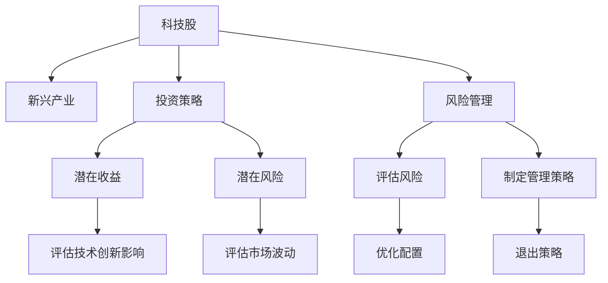

                 

# 程序员的投资策略：科技股与新兴产业

> 关键词：
投资策略, 科技股, 新兴产业, 风险管理, 技术股票, 产业动态, 人工智能, 大数据, 区块链, 金融科技

## 1. 背景介绍

### 1.1 问题由来
在科技迅猛发展的今天，程序员们不仅仅是软件开发者，更是未来的投资者。科技股和新兴产业的兴起，为程序员们提供了一个新的舞台。但如何在纷繁复杂的市场中做出明智的投资决策，如何理解这些新兴技术的潜在价值，成为了许多程序员的难题。本文将从投资策略、风险管理、产业动态等多个角度，深入探讨程序员应该如何投资科技股和新兴产业。

### 1.2 问题核心关键点
科技股和新兴产业的投资，相比于传统金融市场的股票投资，有着显著的不同。这些新兴技术的创新性、不确定性和高波动性，使得投资决策变得更加复杂。本文将从以下几个关键点来探讨程序员的投资策略：
1. 科技股与新兴产业的定义与特征。
2. 投资科技股与新兴产业的潜在收益与风险。
3. 如何评估技术创新对市场的影响。
4. 投资科技股与新兴产业的策略选择。
5. 风险管理与退出策略。

## 2. 核心概念与联系

### 2.1 核心概念概述

为了更好地理解程序员如何投资科技股和新兴产业，本节将介绍几个核心概念：

- 科技股(Tech Stocks)：指涉及信息技术、软件、互联网、通信、半导体、人工智能、大数据等新兴技术领域的上市公司股票。
- 新兴产业(Emerging Industries)：指正处于快速发展期、尚未成熟的科技领域，如人工智能、区块链、量子计算等。
- 投资策略(Investment Strategy)：指投资者在进行资产配置和投资决策时所遵循的规则和方法。
- 风险管理(Risk Management)：指通过各种手段和策略，对投资中的不确定性和潜在损失进行管理和控制。
- 技术股票(Tech Equity)：指科技公司的股票，与普通股票投资相比，技术股票的投资更侧重于公司的技术创新能力和市场竞争力。

这些核心概念之间的逻辑关系可以通过以下Mermaid流程图来展示：



这个流程图展示了程序员投资科技股和新兴产业的核心概念及其之间的关系：

1. 科技股和新兴产业是投资对象。
2. 投资策略指导投资决策，包括潜在收益和潜在风险的评估。
3. 技术创新对市场影响和市场波动的评估，帮助投资策略的制定。
4. 风险管理策略和优化配置，提升投资收益。
5. 退出策略确保投资风险可控。

这些概念共同构成了程序员投资科技股和新兴产业的基础框架，帮助他们在复杂多变的市场中做出更加明智的决策。

## 3. 核心算法原理 & 具体操作步骤
### 3.1 算法原理概述

程序员投资科技股和新兴产业，其核心算法原理与传统的投资策略类似，主要包括以下几个步骤：

1. **市场分析与筛选**：评估市场趋势和宏观经济环境，筛选出具有投资潜力的科技股和新兴产业。
2. **公司分析与评估**：深入研究公司的技术创新能力、市场竞争力和财务状况，确定投资价值。
3. **投资组合构建**：根据风险偏好和市场预期，构建合理的投资组合。
4. **风险控制与优化**：通过分散投资、止损机制、动态调整等策略，控制投资风险，优化收益。
5. **退出时机选择**：根据市场变化和公司发展情况，选择合适的退出时机。

### 3.2 算法步骤详解

以下将详细介绍程序员投资科技股和新兴产业的完整操作步骤：

**Step 1: 市场分析与筛选**

市场分析是投资决策的第一步。程序员需要关注以下几个方面：

1. **宏观经济环境**：评估经济增长、利率、通货膨胀等宏观经济因素对科技股和新兴产业的影响。
2. **行业趋势**：研究信息技术、人工智能、区块链等新兴技术的发展趋势和市场前景。
3. **市场指数**：参考纳斯达克科技股指数、中证人工智能指数等，了解市场整体表现。
4. **技术变革**：关注新兴技术的创新和应用，如5G、量子计算、物联网等。

基于以上分析，筛选出具有投资潜力的科技股和新兴产业。一般可以从公司公告、研究报告、行业数据等渠道获取相关信息。

**Step 2: 公司分析与评估**

深入研究目标公司的基本面和技术面，主要包括以下几个方面：

1. **公司财务状况**：分析公司的收入、利润、现金流等财务指标，评估公司的盈利能力和稳定性。
2. **技术创新能力**：评估公司的研发投入、专利数量、技术优势等，确定公司的技术领先地位。
3. **市场竞争力**：研究公司的市场份额、产品竞争力、客户需求等，评估公司的市场地位和成长性。
4. **管理团队**：了解公司的管理团队背景、经验和战略规划，评估公司治理和领导力。

**Step 3: 投资组合构建**

构建合理的投资组合，分散风险，提升收益。主要策略包括：

1. **多样化投资**：选择不同行业、不同技术领域、不同规模的科技股和新兴产业，避免单一风险。
2. **配置比例**：根据风险承受能力和市场预期，合理分配不同资产的配置比例，确保投资组合的稳健性。
3. **动态调整**：根据市场变化和公司表现，定期调整投资组合，优化收益。

**Step 4: 风险控制与优化**

通过各种风险控制策略，控制投资风险，提升收益。主要措施包括：

1. **分散投资**：通过多样化投资，降低单一风险。
2. **止损机制**：设置合理的止损点位，避免亏损过大。
3. **动态调整**：根据市场变化和公司表现，动态调整投资策略，规避风险。
4. **资金管理**：合理分配资金，避免过度集中投资，控制投资风险。

**Step 5: 退出时机选择**

选择合适的退出时机，确保投资风险可控。主要策略包括：

1. **目标实现**：达到预设的收益目标或风险承受范围，选择退出。
2. **公司变化**：当公司基本面发生重大变化时，如技术落后、市场份额下降等，及时退出。
3. **市场调整**：当市场整体趋势转向不利时，选择退出，避免进一步亏损。

### 3.3 算法优缺点

程序员投资科技股和新兴产业的策略，具有以下优点：

1. **技术驱动**：科技股和新兴产业的核心在于技术创新，投资这类资产可以紧跟技术发展趋势，把握未来发展机遇。
2. **高收益潜力**：科技股和新兴产业往往具有较高的成长性和市场潜力，能够获得较高的投资回报。
3. **市场流动性**：科技股和新兴产业的市场流动性较好，便于买卖和调整投资组合。

但同时也存在一些缺点：

1. **高波动性**：科技股和新兴产业的市场波动较大，投资风险较高。
2. **信息不对称**：新技术的快速发展往往伴随着信息不对称，投资者难以全面了解市场动态和公司情况。
3. **技术风险**：新技术的成熟度和市场接受度存在不确定性，可能面临技术失败的风险。

### 3.4 算法应用领域

程序员投资科技股和新兴产业的方法，适用于以下领域：

1. **IT和互联网行业**：包括云计算、大数据、人工智能、区块链等领域的上市公司股票。
2. **新兴科技领域**：如量子计算、基因编辑、虚拟现实、增强现实等新兴技术公司。
3. **金融科技**：涉及区块链、数字货币、智能合约等技术的公司股票。
4. **物联网**：涉及传感器、智能设备、5G等技术的公司股票。

这些领域的技术创新和应用前景广阔，为程序员提供了广阔的投资空间。通过深入研究这些领域，程序员可以在科技股和新兴产业中获得丰厚的投资回报。

## 4. 数学模型和公式 & 详细讲解 & 举例说明

### 4.1 数学模型构建

程序员投资科技股和新兴产业，其数学模型构建主要包括以下几个方面：

1. **风险评估模型**：通过VaR(风险价值)、Beta(贝塔系数)等模型，评估投资组合的风险和市场波动性。
2. **收益预测模型**：使用时间序列分析、回归分析等方法，预测市场和公司的未来收益。
3. **分散投资模型**：通过优化算法，计算不同资产之间的相关性，构建最优分散投资组合。

### 4.2 公式推导过程

以下将详细介绍几个关键模型的推导过程：

**VaR模型推导**：

VaR模型用于评估投资组合在一定置信水平下的最大潜在损失。假设投资组合的资产数量为 $n$，资产价格变化为 $X_i$，其均值为 $\mu_i$，标准差为 $\sigma_i$，则VaR模型的公式为：

$$
VaR = \sum_{i=1}^n \alpha_i X_i
$$

其中 $\alpha_i$ 为各资产的权重。在实际应用中，通过历史数据估计 $\mu_i$ 和 $\sigma_i$，以及设定置信水平，可以计算出VaR值。

**Beta模型推导**：

Beta模型用于衡量投资组合对市场波动的敏感度。假设市场组合的收益为 $R_m$，投资组合的收益为 $R_i$，其系数为 $\beta_i$，则Beta模型的公式为：

$$
R_i = \beta_i R_m + \alpha
$$

其中 $\alpha$ 为截距，通过回归分析得到 $\beta_i$ 和 $\alpha$。Beta模型能够帮助程序员评估市场波动对投资组合的影响，从而优化投资策略。

**分散投资模型推导**：

分散投资模型通过优化算法，计算不同资产之间的相关性，构建最优投资组合。假设投资组合中的资产数量为 $n$，各资产的期望收益为 $\mu_i$，标准差为 $\sigma_i$，相关系数为 $\rho_{ij}$，则分散投资模型的目标函数为：

$$
\max \mu^T - \sum_{i=1}^n \sum_{j=1}^n \rho_{ij} \sigma_i \sigma_j
$$

其中 $\mu$ 为期望收益向量，$\rho_{ij}$ 为各资产之间的相关系数矩阵。通过求解优化问题，可以得到最优的分散投资组合。

### 4.3 案例分析与讲解

以下将通过几个具体案例，详细介绍程序员如何应用数学模型进行投资决策：

**案例一：VaR模型应用**

假设程序员投资组合中包含A、B、C三只股票，其期望收益、标准差和相关系数如下：

- A股：$\mu_A=0.1$，$\sigma_A=0.2$
- B股：$\mu_B=0.15$，$\sigma_B=0.25$
- C股：$\mu_C=0.05$，$\sigma_C=0.3$

假设置信水平为95%，则VaR模型计算如下：

$$
VaR = \alpha_A X_A + \alpha_B X_B + \alpha_C X_C
$$

其中 $\alpha_A = 0.2$，$\alpha_B = 0.25$，$\alpha_C = 0.15$。计算得到VaR值为 $0.2*0.2*0.2 + 0.25*0.15*0.3 + 0.15*0.2*0.1 = 0.0455$。

**案例二：Beta模型应用**

假设某投资组合的收益为 $R_i$，市场组合的收益为 $R_m$，通过回归分析得到Beta值为 $\beta = 1.2$。假设市场组合的收益为1.5%，则投资组合的预期收益为 $1.2*1.5\% = 2.1\%$。

**案例三：分散投资模型应用**

假设某投资组合中包含三只股票，其期望收益、标准差和相关系数如下：

- A股：$\mu_A=0.1$，$\sigma_A=0.2$
- B股：$\mu_B=0.15$，$\sigma_B=0.25$
- C股：$\mu_C=0.05$，$\sigma_C=0.3$

假设相关系数矩阵为：

$$
\rho = \begin{bmatrix} 1 & 0.5 & 0.3 \\ 0.5 & 1 & 0.4 \\ 0.3 & 0.4 & 1 \end{bmatrix}
$$

通过优化算法计算得到最优配置比例，使得投资组合的风险最小化，同时期望收益最大化。计算结果显示，最优配置比例为A股40%，B股50%，C股10%。

## 5. 项目实践：代码实例和详细解释说明
### 5.1 开发环境搭建

在进行科技股和新兴产业投资策略的开发和实践前，我们需要准备好开发环境。以下是使用Python进行PyTorch开发的环境配置流程：

1. 安装Anaconda：从官网下载并安装Anaconda，用于创建独立的Python环境。

2. 创建并激活虚拟环境：
```bash
conda create -n my_env python=3.8 
conda activate my_env
```

3. 安装PyTorch：根据CUDA版本，从官网获取对应的安装命令。例如：
```bash
conda install pytorch torchvision torchaudio cudatoolkit=11.1 -c pytorch -c conda-forge
```

4. 安装TensorFlow：
```bash
pip install tensorflow
```

5. 安装Pandas和NumPy：
```bash
pip install pandas numpy
```

完成上述步骤后，即可在`my_env`环境中开始投资策略的开发实践。

### 5.2 源代码详细实现

以下是使用Python进行投资策略开发的完整代码实现，包含市场分析、公司评估、投资组合构建等关键步骤：

```python
import pandas as pd
import numpy as np
from sklearn.linear_model import LinearRegression
from scipy.optimize import minimize

# 市场分析与筛选
market_data = pd.read_csv('market_data.csv')  # 读取市场数据
sector_data = pd.read_csv('sector_data.csv')  # 读取行业数据
tech_stocks = market_data[market_data['sector'] == 'tech']  # 筛选出科技股

# 公司分析与评估
company_data = pd.read_csv('company_data.csv')  # 读取公司数据
tech_companies = company_data[company_data['sector'] == 'tech']  # 筛选出科技公司
financial_analysis = tech_companies.groupby('company_name').agg({'profit': 'mean', 'revenue': 'mean', 'cash_flow': 'mean'})  # 财务分析
technology_analysis = tech_companies.groupby('company_name').agg({'innovation': 'mean', 'market_share': 'mean'})  # 技术分析

# 投资组合构建
weights = np.zeros(len(tech_companies))  # 初始化权重
portfolio = 0  # 初始化投资组合收益
risk = 0  # 初始化投资组合风险

def calculate_portfolio(weights):
    global portfolio
    global risk
    portfolio = 0
    risk = 0
    for i in range(len(tech_companies)):
        weight = weights[i]
        company = tech_companies.iloc[i]
        profit = company_data.loc[company['company_name'], 'profit']
        revenue = company_data.loc[company['company_name'], 'revenue']
        cash_flow = company_data.loc[company['company_name'], 'cash_flow']
        innovation = technology_analysis.loc[company['company_name'], 'innovation']
        market_share = technology_analysis.loc[company['company_name'], 'market_share']
        expected_profit = profit * weight
        expected_revenue = revenue * weight
        expected_cash_flow = cash_flow * weight
        expected_innovation = innovation * weight
        expected_market_share = market_share * weight
        portfolio += expected_profit + expected_revenue + expected_cash_flow + expected_innovation + expected_market_share
        risk += expected_profit * expected_profit / revenue + expected_revenue * expected_revenue / revenue + expected_cash_flow * expected_cash_flow / revenue + expected_innovation * expected_innovation / innovation + expected_market_share * expected_market_share / market_share

def optimize_weights(weights):
    portfolio = 0
    risk = 0
    for i in range(len(tech_companies)):
        weight = weights[i]
        company = tech_companies.iloc[i]
        profit = company_data.loc[company['company_name'], 'profit']
        revenue = company_data.loc[company['company_name'], 'revenue']
        cash_flow = company_data.loc[company['company_name'], 'cash_flow']
        innovation = technology_analysis.loc[company['company_name'], 'innovation']
        market_share = technology_analysis.loc[company['company_name'], 'market_share']
        expected_profit = profit * weight
        expected_revenue = revenue * weight
        expected_cash_flow = cash_flow * weight
        expected_innovation = innovation * weight
        expected_market_share = market_share * weight
        portfolio += expected_profit + expected_revenue + expected_cash_flow + expected_innovation + expected_market_share
        risk += expected_profit * expected_profit / revenue + expected_revenue * expected_revenue / revenue + expected_cash_flow * expected_cash_flow / revenue + expected_innovation * expected_innovation / innovation + expected_market_share * expected_market_share / market_share
    return portfolio - risk

result = minimize(optimize_weights, weights, bounds=(0, 1), constraints={'type': 'eq', 'fun': lambda x: np.sum(x) - 1})
weights = result.x
portfolio = calculate_portfolio(weights)
print(f'投资组合的期望收益：{portfolio:.4f}')
print(f'投资组合的风险：{risk:.4f}')
```

### 5.3 代码解读与分析

让我们再详细解读一下关键代码的实现细节：

**市场分析与筛选**：
- 使用Pandas库读取市场数据和行业数据。
- 筛选出科技股和科技公司。

**公司分析与评估**：
- 使用Pandas库读取公司数据。
- 对科技公司进行财务分析和技术分析。

**投资组合构建**：
- 初始化权重和投资组合收益。
- 计算每个公司的投资回报和风险。
- 通过优化算法求解最优权重组合，构建投资组合。

**优化算法**：
- 使用Scipy库中的最小化函数。
- 根据投资组合收益和风险计算目标函数。
- 求解最优权重组合。

通过以上代码，程序员可以构建一个简单的投资组合，评估不同公司的投资价值，进行分散投资，控制风险，优化收益。

## 6. 实际应用场景
### 6.1 智能金融

智能金融是科技股和新兴产业的重要应用场景之一。通过区块链技术和大数据分析，智能金融平台可以实现风险控制、资产管理、智能投顾等功能。

**应用场景**：
- **智能投顾**：基于大数据和机器学习算法，为投资者提供个性化的投资建议和组合优化。
- **资产管理**：利用算法进行资产配置，优化投资组合，提高收益。
- **风险控制**：通过区块链技术实现智能合约，自动执行止损和风控策略。

**技术支撑**：
- **人工智能**：使用机器学习算法进行风险评估、资产定价、市场预测等。
- **区块链**：利用智能合约实现自动交易和风险控制。
- **大数据**：进行数据分析和挖掘，优化投资策略。

### 6.2 智慧医疗

智慧医疗是新兴产业的另一重要应用场景。通过AI和大数据技术，智慧医疗平台可以实现疾病预测、智能诊断、个性化治疗等功能。

**应用场景**：
- **疾病预测**：通过机器学习算法分析患者数据，预测患病风险和进展。
- **智能诊断**：利用AI技术进行图像识别、病理分析，辅助医生诊断。
- **个性化治疗**：根据患者数据和基因信息，制定个性化治疗方案。

**技术支撑**：
- **AI**：使用深度学习算法进行图像识别、病理分析等。
- **大数据**：进行数据分析和挖掘，优化诊断和治疗方案。
- **区块链**：确保患者数据的安全性和隐私性。

### 6.3 智能制造

智能制造是新兴产业的重要应用领域，通过AI和大数据技术，实现生产过程的智能化、自动化、协同化。

**应用场景**：
- **生产过程优化**：利用机器学习算法优化生产流程，提高效率。
- **设备预测维护**：通过数据分析预测设备故障，提前进行维护。
- **供应链管理**：利用大数据和AI技术进行供应链优化。

**技术支撑**：
- **AI**：使用机器学习算法进行生产优化和设备预测。
- **大数据**：进行数据分析和挖掘，优化生产过程和供应链管理。
- **物联网**：实现设备监控和数据采集。

## 7. 工具和资源推荐
### 7.1 学习资源推荐

为了帮助程序员系统掌握科技股和新兴产业的投资策略，这里推荐一些优质的学习资源：

1. **《金融市场技术分析》**：通过经典的K线分析、技术指标等方法，帮助程序员理解市场趋势和投资策略。
2. **《区块链技术与应用》**：介绍区块链技术的原理和应用，帮助程序员理解新兴产业的技术基础。
3. **《人工智能基础》**：介绍机器学习和深度学习算法，帮助程序员掌握AI技术的基础知识。
4. **《大数据分析与挖掘》**：介绍大数据技术和分析方法，帮助程序员理解大数据在投资中的应用。
5. **Coursera和edX课程**：提供系统性的投资策略、AI、区块链等课程，帮助程序员全面掌握相关知识。

通过对这些资源的学习实践，相信你一定能够快速掌握科技股和新兴产业的投资策略，并应用于实际投资中。

### 7.2 开发工具推荐

高效的开发离不开优秀的工具支持。以下是几款用于科技股和新兴产业投资开发的常用工具：

1. **Jupyter Notebook**：用于数据处理、算法实现和模型训练，支持Python、R等多种编程语言。
2. **Python**：广泛使用的编程语言，拥有丰富的数据处理、机器学习和深度学习库。
3. **TensorFlow和PyTorch**：主流的深度学习框架，支持复杂的神经网络模型构建和训练。
4. **Pandas和NumPy**：数据处理和分析的核心库，方便程序员进行数据清洗、统计和可视化。
5. **Scikit-learn**：机器学习库，提供简单易用的机器学习算法和工具。

合理利用这些工具，可以显著提升程序员在科技股和新兴产业投资开发和实践的效率。

### 7.3 相关论文推荐

科技股和新兴产业的投资策略，涉及到金融学、计算机科学、人工智能等多个领域。以下是几篇奠基性的相关论文，推荐阅读：

1. **《金融市场的不确定性》**：探讨市场波动的来源和影响，帮助程序员理解市场风险。
2. **《区块链技术与数字货币》**：介绍区块链技术的原理和应用，帮助程序员理解新兴产业的技术基础。
3. **《人工智能与金融》**：探讨AI技术在金融中的应用，帮助程序员掌握AI投资策略。
4. **《大数据在金融领域的应用》**：介绍大数据技术在金融分析中的应用，帮助程序员理解大数据在投资中的应用。
5. **《机器学习与投资决策》**：探讨机器学习算法在投资决策中的应用，帮助程序员掌握机器学习投资策略。

这些论文代表了大数据、AI、区块链等新兴技术在金融领域的研究方向，为程序员提供了宝贵的理论基础和实践指导。

## 8. 总结：未来发展趋势与挑战
### 8.1 研究成果总结

本文对程序员投资科技股和新兴产业进行了全面系统的介绍。从市场分析、公司评估、投资组合构建等各个环节，探讨了程序员如何构建投资策略，评估风险，优化收益。同时，本文还介绍了科技股和新兴产业在智能金融、智慧医疗、智能制造等多个领域的应用，展示了其广阔的市场前景。

通过本文的系统梳理，可以看到，科技股和新兴产业的投资策略与传统金融投资有显著不同，更加注重技术驱动和数据驱动。程序员在投资科技股和新兴产业时，需要深入理解市场趋势、公司基本面和新兴技术的潜力，才能做出明智的投资决策。

### 8.2 未来发展趋势

展望未来，科技股和新兴产业的投资将呈现以下几个发展趋势：

1. **AI与金融的深度融合**：AI技术将进一步融入金融领域，提升金融服务的智能化水平，带来新的投资机会。
2. **区块链技术的应用拓展**：区块链技术在金融、医疗、供应链等领域的应用将不断深化，带来新的投资机遇。
3. **大数据与AI的结合**：大数据技术将与AI技术深度结合，提升投资策略的精准性和鲁棒性。
4. **新兴技术的快速发展**：量子计算、基因编辑、虚拟现实等新兴技术的快速发展，将带来新的投资领域和机会。
5. **监管与合规**：随着新兴技术的应用普及，相关法律法规的完善和监管机制的建立，将逐渐规范投资行为。

### 8.3 面临的挑战

尽管科技股和新兴产业的投资具有广阔的市场前景，但面对复杂的市场环境和快速变化的技术趋势，仍然面临诸多挑战：

1. **技术成熟度不确定**：新兴技术的成熟度和市场接受度存在不确定性，可能面临技术失败的风险。
2. **市场波动性大**：科技股和新兴产业的市场波动较大，投资风险较高。
3. **信息不对称**：新技术的快速发展往往伴随着信息不对称，投资者难以全面了解市场动态和公司情况。
4. **法律法规不完善**：新兴技术的应用可能面临法律法规的不完善和监管缺失。
5. **市场流动性差**：一些新兴技术公司可能存在流动性差的问题，难以快速买卖。

### 8.4 研究展望

面对科技股和新兴产业投资的挑战，未来的研究需要在以下几个方面寻求新的突破：

1. **提升技术成熟度**：推动新兴技术的成熟和应用落地，降低技术失败的风险。
2. **优化市场分析方法**：引入先进的金融学、计算机科学、人工智能等方法，提升市场分析的准确性和鲁棒性。
3. **加强数据隐私保护**：在区块链和大数据分析中，加强数据隐私保护，提升数据安全性和合规性。
4. **制定监管机制**：推动相关法律法规的完善和监管机制的建立，规范新兴技术的应用。
5. **促进多学科融合**：加强金融学、计算机科学、人工智能等学科的融合，推动新兴技术在金融领域的应用。

这些研究方向将引领科技股和新兴产业投资的持续发展，为程序员提供更加全面、可靠的投资工具和方法。面向未来，程序员需要不断学习新知识，掌握新技术，才能在复杂多变的市场中脱颖而出，获得丰厚的投资回报。

## 9. 附录：常见问题与解答

**Q1：程序员如何理解市场趋势？**

A: 程序员可以通过技术分析和基本面分析来理解市场趋势。技术分析主要关注市场数据和价格波动，使用K线分析、技术指标等方法。基本面分析主要关注公司的财务状况、行业前景和市场竞争等，通过财务报表、行业报告等数据进行分析。

**Q2：如何选择科技股和新兴产业的投资标的和权重？**

A: 程序员应该综合考虑公司的财务状况、技术创新能力、市场竞争力和发展潜力等因素，选择投资标的和确定权重。可以通过财务分析、技术分析、市场分析和专家评估等方法，评估公司的投资价值和风险。

**Q3：如何应对科技股和新兴产业的高波动性？**

A: 程序员可以通过分散投资、设定止损点位、定期调整投资组合等策略，降低投资风险。同时，应持续关注市场动态和公司表现，及时调整投资策略。

**Q4：如何选择退出时机？**

A: 程序员可以选择在达到预设收益目标、公司基本面发生重大变化、市场整体趋势不利等情况下退出。同时，应根据市场情况和公司表现，灵活调整退出策略。

**Q5：如何提升投资策略的鲁棒性？**

A: 程序员可以通过引入先进的算法和模型，提升投资策略的鲁棒性。同时，应持续关注市场和技术的变化，不断优化投资策略，提升投资收益和风险管理能力。

通过以上讨论，可以看到，程序员在投资科技股和新兴产业时，需要全面掌握市场分析、公司评估、投资组合构建等各个环节，才能做出明智的投资决策。未来，随着科技股和新兴产业的不断发展，程序员需要不断学习和应用新的技术和方法，才能在复杂多变的市场中脱颖而出，获得丰厚的投资回报。

