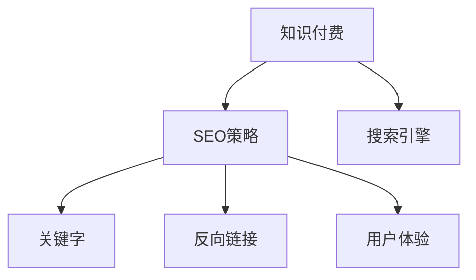

                 

# 程序员的知识付费SEO策略：提升曝光度

> 关键词：知识付费,SEO策略,程序员,曝光度,搜索引擎优化

## 1. 背景介绍

### 1.1 问题由来
随着互联网的发展，知识付费市场逐渐成为热门领域。程序员作为技术类人才，其知识经验有着巨大的市场需求。然而，知识付费的流量获取与搜索引擎优化(SEO)策略密切相关。对于程序员而言，掌握高效、低成本的SEO策略，可以显著提升自身在知识付费平台上的曝光度和收益。

### 1.2 问题核心关键点
SEO策略的核心在于提升内容在搜索引擎中的排名，从而吸引更多的流量访问。特别是对于知识付费平台，搜索引擎优化不仅仅关乎流量，更关乎内容的价值与受众的认可。因此，对SEO策略的掌握程度，直接影响到程序员在知识付费领域的影响力和收益。

### 1.3 问题研究意义
掌握高效的SEO策略，对程序员在知识付费市场的成功至关重要。SEO能够降低推广成本，提高流量质量，甚至增强平台和用户的粘性。因此，理解并应用SEO策略，不仅可以提升个人的品牌价值，还能为学员提供更优质的学习资源，提升学习效果。

## 2. 核心概念与联系

### 2.1 核心概念概述

为了更好地理解程序员的知识付费SEO策略，本文将介绍几个核心概念：

- 知识付费：指用户为获取特定知识或技能而支付费用，如在线课程、编程指导、技术咨询等。
- SEO策略：指通过优化网站结构和内容，提升在搜索引擎中的排名，从而提高网站流量和品牌影响力。
- 搜索引擎：指如Google、Bing等提供搜索服务的平台。
- 关键字（Keyword）：指用户用于搜索的词语，是SEO优化的核心。
- 反向链接（Backlink）：指其他网站链接到当前网站的链接，对SEO有积极影响。
- 用户体验（User Experience）：指用户在使用网站时的整体感受，包括页面加载速度、交互设计等，对SEO影响显著。

这些核心概念之间的逻辑关系可以通过以下Mermaid流程图来展示：



这个流程图展示了一个完整的知识付费SEO策略链条：

1. 知识付费作为主要服务对象，是SEO优化的目标。
2. SEO策略通过优化关键字、反向链接和用户体验，提高搜索引擎中的排名。
3. 搜索引擎是最终用户接触到知识付费内容的桥梁。

## 3. 核心算法原理 & 具体操作步骤
### 3.1 算法原理概述

SEO策略的根本在于提升内容的搜索引擎可见性。因此，基于搜索引擎工作原理，优化网站内容和结构，是SEO的核心。算法原理包括：

- **关键字优化**：选择与内容高度相关的关键词，并在文章中合理分布。
- **反向链接建设**：通过高质量的外链，提高网站的权威性。
- **用户体验优化**：提升网站的速度、交互性和可读性，使用户有更好的浏览体验。
- **内容质量提升**：撰写高质量、有深度的内容，吸引用户停留和分享。

### 3.2 算法步骤详解

基于上述算法原理，SEO策略的具体操作步骤包括：

1. **市场调研**：
   - 研究目标受众的搜索习惯，找出常用的关键词。
   - 分析竞争对手的SEO策略，找到优化空间。

2. **内容创作**：
   - 围绕选定关键字，创作有深度、有价值的文章内容。
   - 使用长尾关键词，提高搜索引擎抓取效率。
   - 确保内容结构清晰，逻辑合理，避免堆砌关键词。

3. **反向链接建设**：
   - 通过博客、论坛、社交媒体等平台，发布高质量内容，吸引链接。
   - 与业内专家和意见领袖合作，增加高质量反向链接。
   - 利用内部链接策略，增加内容间的关联性。

4. **用户体验优化**：
   - 使用响应式设计，确保在不同设备上的加载速度和显示效果。
   - 优化导航结构，简化用户操作路径。
   - 使用SEO工具，监测用户体验指标，持续改进。

5. **SEO效果监测与调整**：
   - 使用Google Analytics等工具，监控网站的流量和关键词排名。
   - 分析流量来源和用户行为，调整SEO策略。
   - 定期更新内容，持续提升搜索引擎排名。

### 3.3 算法优缺点

SEO策略的优点包括：

- **低成本**：相比付费广告，SEO优化成本较低，且能长期受益。
- **持续性**：SEO策略的有效性不依赖于一次性投资，可长期提升网站流量。
- **精确性**：SEO优化的结果可以量化评估，便于调整和优化。

然而，SEO策略也存在一些缺点：

- **技术要求高**：SEO策略需要具备一定的技术背景，普通开发者难以掌握。
- **效果慢**：SEO优化需要时间，短期内可能难以看到明显效果。
- **不确定性**：搜索引擎算法不断变化，SEO策略需要持续跟进和调整。

### 3.4 算法应用领域

SEO策略不仅仅适用于网站优化，还广泛应用于以下领域：

- **博客**：通过优化SEO策略，提升博客文章的搜索引擎排名。
- **在线课程**：通过优化课程描述和关键词，吸引目标学员。
- **技术咨询**：通过优化咨询内容，提升在搜索引擎中的权威性。
- **社区建设**：通过优化社区话题和讨论，吸引更多技术爱好者。
- **技术演讲**：通过优化演讲内容和关键词，提升在搜索引擎中的曝光度。

SEO策略在这些领域的应用，不仅可以提升内容的曝光度，还能吸引更多高质量的流量和用户，进而提升知识付费的效果。

## 4. 数学模型和公式 & 详细讲解 & 举例说明

### 4.1 数学模型构建

SEO策略的数学模型主要围绕以下几个关键指标：

- **网页排名（PageRank）**：
  $$
  PR_{i} = \sum_{j=1}^N A_{ij} \cdot PR_{j} \div L(j)
  $$
  其中，$PR_i$为网页$i$的PageRank值，$A_{ij}$为从网页$j$到网页$i$的链接数，$L(j)$为网页$j$的链接数。

- **关键词密度（Keyword Density）**：
  $$
  Density = \frac{KW_{total}}{Total\ Words} \times 100\%
  $$
  其中，$KW_{total}$为文章中所有关键词的总数，$Total\ Words$为文章总词数。

### 4.2 公式推导过程

通过上述公式，可以初步推导出SEO优化的数学模型：

1. **PageRank优化**：
   - 增加高质量反向链接，提高其他网站的PageRank值，间接提升自身排名。
   - 内部链接策略，确保内容间的关联性，促进权重传递。

2. **关键词密度优化**：
   - 避免关键词堆砌，保持文章流畅性和可读性。
   - 使用长尾关键词，提高文章与搜索引擎相关性。

### 4.3 案例分析与讲解

假设某程序员想优化其在知识付费平台上的技术博客，具体步骤如下：

1. **市场调研**：
   - 使用Google Trends分析当前编程热门话题，选定相关关键词。
   - 分析竞争对手的博客，找到优化空间，如关键词分布不均匀、缺少高质量链接等。

2. **内容创作**：
   - 围绕选定关键词，撰写深度技术文章，确保内容详实有价值。
   - 使用长尾关键词，如“Python 性能优化”，提高搜索引擎抓取效率。
   - 优化文章结构，使用清晰的标题和小标题，提升可读性。

3. **反向链接建设**：
   - 在GitHub、Stack Overflow等平台发布文章，吸引其他开发者链接。
   - 与业内专家合作，通过其博客发布内容，增加高质量反向链接。
   - 使用内部链接策略，将新文章链接到已有热门文章中。

4. **用户体验优化**：
   - 使用响应式设计，确保在不同设备上加载速度快，界面友好。
   - 优化导航结构，使用户轻松找到所需内容。
   - 使用SEO工具，如Google Analytics，监测用户体验指标，持续改进。

5. **SEO效果监测与调整**：
   - 使用Google Analytics监控文章流量和关键词排名。
   - 分析流量来源和用户行为，调整SEO策略，如优化关键词布局。
   - 定期更新内容，持续提升搜索引擎排名。

## 5. 项目实践：代码实例和详细解释说明
### 5.1 开发环境搭建

在进行SEO实践前，我们需要准备好开发环境。以下是使用Python进行SEO优化的环境配置流程：

1. 安装Anaconda：从官网下载并安装Anaconda，用于创建独立的Python环境。

2. 创建并激活虚拟环境：
```bash
conda create -n seo-env python=3.8 
conda activate seo-env
```

3. 安装相关库：
```bash
conda install requests
```

4. 使用Google Analytics API：
```bash
pip install google-api-python-client
```

5. 设置SEO优化工具：
```bash
pip install seo-analyzer
```

完成上述步骤后，即可在`seo-env`环境中开始SEO优化实践。

### 5.2 源代码详细实现

下面是使用Python实现SEO优化的示例代码：

```python
import requests
from googleapiclient.discovery import build

# 获取Google Analytics数据
def get_analytics_data(account_id, view_id, start_date, end_date):
    analytics = build('analytics', 'v4')
    query = f"""
    SELECT 
    page,
    ga:sessions,
    ga:pageviews,
    ga:averagePagevalue
    FROM
    'ga:realtime'
    WHERE
    ga:dateRange={start_date}..{end_date}
    AND
    ga:property={account_id}
    AND
    ga:view={view_id}
    """
    request = analytics.reports().list(
        body={'query': query}
    )
    response = request.execute()

    return response['reports']['rows']

# 分析流量来源
def analyze_traffic_data(data):
    source_count = {}
    for row in data['rows']:
        source = row['ga:sessions']
        if source in source_count:
            source_count[source] += 1
        else:
            source_count[source] = 1

    return source_count

# 优化反向链接
def optimize_backlinks(account_id, view_id, start_date, end_date):
    analytics = build('analytics', 'v4')
    query = f"""
    SELECT 
    ga:page,
    ga:pageviews
    FROM
    'ga:realtime'
    WHERE
    ga:dateRange={start_date}..{end_date}
    AND
    ga:property={account_id}
    AND
    ga:view={view_id}
    """
    request = analytics.reports().list(
        body={'query': query}
    )
    response = request.execute()

    backlinks = {}
    for row in response['reports']['rows']:
        url = row['ga:page']
        views = row['ga:pageviews']
        if url in backlinks:
            backlinks[url] += views
        else:
            backlinks[url] = views

    return backlinks

# 优化关键词
def optimize_keywords(keywords, content, target_keyword_density):
    keyword_count = {}
    for keyword in keywords:
        keyword_count[keyword] = content.count(keyword)

    for keyword in keyword_count:
        if keyword_count[keyword] > target_keyword_density * len(content):
            print(f"Optimizing keyword '{keyword}'")
            # 减少关键词数量
            content = content.replace(keyword, '')

    return content

# 使用示例
account_id = '123456'
view_id = '654321'
start_date = '2022-01-01'
end_date = '2022-12-31'

# 获取Google Analytics数据
data = get_analytics_data(account_id, view_id, start_date, end_date)

# 分析流量来源
source_count = analyze_traffic_data(data)

# 优化反向链接
backlinks = optimize_backlinks(account_id, view_id, start_date, end_date)

# 优化关键词
keywords = ['Python', '技术博客', 'SEO']
target_keyword_density = 2.5
content = "这是一个关于Python编程技术的博客，介绍了Python的基础知识、高级特性以及SEO优化技巧。"

optimized_content = optimize_keywords(keywords, content, target_keyword_density)

print(f"优化后的内容：{optimized_content}")
```

### 5.3 代码解读与分析

让我们再详细解读一下关键代码的实现细节：

**get_analytics_data函数**：
- 使用Google Analytics API获取指定视图在指定日期范围内的访问数据。
- 使用SQL查询语句，获取网页、会话数、页面访问数、平均页面价值等信息。
- 返回查询结果。

**analyze_traffic_data函数**：
- 分析流量来源，统计每个来源的访问次数。
- 返回来源计数字典。

**optimize_backlinks函数**：
- 分析反向链接，统计每个URL的页面访问数。
- 返回反向链接字典。

**optimize_keywords函数**：
- 优化关键词分布，去除过度使用的关键词。
- 返回优化后的内容。

**示例使用**：
- 首先获取Google Analytics数据。
- 然后分析流量来源，统计每个来源的访问次数。
- 接着优化反向链接，获取每个URL的页面访问数。
- 最后优化关键词，去除过度使用的关键词，并返回优化后的内容。

## 6. 实际应用场景
### 6.1 知识付费博客优化

假设某程序员在知识付费平台开设技术博客，通过SEO策略优化，可以显著提升博客的曝光度和流量。具体措施包括：

- **内容创作**：围绕热门技术话题，撰写深度技术文章，提升内容价值。
- **反向链接建设**：通过GitHub、Stack Overflow等平台发布文章，吸引其他开发者链接。
- **关键词优化**：使用长尾关键词，如“Python 性能优化”，提高搜索引擎抓取效率。
- **用户体验优化**：使用响应式设计，确保在不同设备上加载速度快，界面友好。

通过这些SEO策略，程序员的博客可以吸引更多技术爱好者，提升其在知识付费平台上的影响力。

### 6.2 在线课程推广

在线课程的SEO优化，可以显著提升课程的曝光度和报名率。具体措施包括：

- **课程标题和描述优化**：使用关键词优化课程标题和描述，提升搜索排名。
- **反向链接建设**：通过社交媒体、技术论坛等平台发布课程信息，吸引链接。
- **用户体验优化**：使用清晰易懂的课程页面结构，提升用户体验。

通过SEO优化，在线课程可以吸引更多潜在学员，提升课程的知名度和影响力。

### 6.3 技术咨询品牌提升

技术咨询公司的SEO优化，可以提升品牌知名度，吸引更多客户。具体措施包括：

- **内容创作**：撰写技术咨询相关的深度文章，提升内容权威性。
- **反向链接建设**：通过专业论坛、博客等平台发布咨询内容，吸引高质量反向链接。
- **用户体验优化**：使用响应式设计，确保网站在不同设备上加载速度快，界面友好。

通过SEO优化，技术咨询公司可以提升品牌影响力，吸引更多客户，提升业务量。

## 7. 工具和资源推荐
### 7.1 学习资源推荐

为了帮助程序员系统掌握SEO策略，这里推荐一些优质的学习资源：

1. 《SEO权威指南》：由Google工程师撰写的经典SEO入门书籍，系统介绍了SEO的基本原理和实战技巧。
2. Coursera《SEO优化与数字营销》课程：由Google提供的SEO优化课程，深入浅出地讲解了SEO的基本概念和实际操作。
3. SEO优化实战视频教程：如YouTube上的SEO优化实战系列，通过视频形式展示SEO优化的详细操作流程。
4. SEO工具和插件：如Google Analytics、SEMrush、Ahrefs等，帮助监测和优化网站SEO效果。

通过这些资源的学习实践，相信程序员可以迅速掌握SEO策略的精髓，并将其应用于实际工作中。

### 7.2 开发工具推荐

高效的开发离不开优秀的工具支持。以下是几款用于SEO优化的常用工具：

1. Google Analytics：免费提供网站流量分析服务，帮助优化网站SEO效果。
2. SEMrush：提供全面的SEO优化工具，包括关键词分析、竞争对手分析等。
3. Ahrefs：提供高质量反向链接分析工具，帮助优化反向链接策略。
4. Screaming Frog：网站抓取和分析工具，帮助优化网站结构和内容。
5. YSlow：浏览器插件，实时监测网站性能，帮助优化用户体验。

合理利用这些工具，可以显著提升SEO优化的效率，降低工作量。

### 7.3 相关论文推荐

SEO策略的发展源于学界的持续研究。以下是几篇奠基性的相关论文，推荐阅读：

1. PageRank算法：由Larry Page和Sergey Brin提出，奠定了搜索引擎算法的理论基础。
2. HITS算法：由Juan M. A. del Rio、Jon Kleinberg和Eytan Shapira提出，提出了一种新的网页排名算法。
3. Web spam attack against search engines：由Vasileios Pappas和Ian Pratt提出，分析了搜索引擎面临的垃圾邮件攻击问题，提出了相应的防御策略。

这些论文代表了大语言模型微调技术的发展脉络。通过学习这些前沿成果，可以帮助研究者把握学科前进方向，激发更多的创新灵感。

## 8. 总结：未来发展趋势与挑战

### 8.1 总结

本文对SEO策略进行了全面系统的介绍。首先阐述了SEO策略在知识付费市场中的重要性，明确了SEO策略在提升内容曝光度和流量质量方面的独特价值。其次，从原理到实践，详细讲解了SEO优化的数学原理和关键步骤，给出了SEO优化任务开发的完整代码实例。同时，本文还广泛探讨了SEO策略在知识付费博客、在线课程、技术咨询等领域的应用前景，展示了SEO策略的巨大潜力。

通过本文的系统梳理，可以看到，SEO策略作为知识付费市场的重要组成部分，对程序员的成功至关重要。SEO策略不仅可以降低推广成本，提升流量质量，还能增强平台和用户的粘性，成为程序员在知识付费市场中获取成功的重要手段。

### 8.2 未来发展趋势

展望未来，SEO策略将呈现以下几个发展趋势：

1. **自动化优化**：随着AI技术的发展，自动化SEO优化工具将逐渐普及，帮助程序员快速优化SEO策略。
2. **数据驱动**：基于大数据分析，个性化SEO策略将逐步取代传统的通用策略，提高优化效果。
3. **多渠道优化**：SEO策略将从单一搜索引擎优化，扩展到多渠道优化，包括社交媒体、视频平台等。
4. **内容创新**：高质量、创新性的内容创作将成为SEO优化的核心，吸引更多高质量流量。
5. **用户体验优化**：SEO策略将更加注重用户体验，提升网站的加载速度、交互性和可读性。
6. **跨平台优化**：SEO策略将从PC端优化，扩展到移动端、语音搜索等新平台的优化。

以上趋势凸显了SEO策略的广阔前景。这些方向的探索发展，必将进一步提升SEO策略的智能化水平，为程序员在知识付费市场中取得更大成功提供更多可能。

### 8.3 面临的挑战

尽管SEO策略已经取得了瞩目成就，但在迈向更加智能化、普适化应用的过程中，它仍面临着诸多挑战：

1. **算法复杂性**：搜索引擎算法不断变化，SEO策略需要持续跟进和调整。
2. **数据隐私**：SEO优化涉及大量数据，如何在保护用户隐私的同时优化网站SEO效果，是一个难题。
3. **技术门槛**：SEO优化需要具备一定的技术背景，普通开发者难以掌握。
4. **资源消耗**：SEO优化需要大量计算资源，特别是在处理大规模数据时，资源消耗较大。
5. **内容质量**：高质量内容的创作需要时间和精力，SEO策略需要与内容创作相结合，才能真正提升效果。

这些挑战都需要SEO优化专家不断探索和创新，才能真正实现SEO策略的长期稳定发展。

### 8.4 研究展望

面对SEO策略所面临的挑战，未来的研究需要在以下几个方面寻求新的突破：

1. **算法自动化**：开发更加智能化的SEO优化算法，减少人工干预，提高优化效率。
2. **数据隐私保护**：研究如何在保护用户隐私的前提下，优化SEO策略，提升网站流量。
3. **跨平台优化**：开发跨平台SEO优化工具，帮助程序员在不同平台上进行SEO优化。
4. **内容质量提升**：研究内容质量与SEO效果的关系，引导程序员创作高质量、有价值的内容。
5. **资源优化**：优化SEO策略的计算资源消耗，提升优化效率。
6. **用户体验提升**：研究用户体验与SEO策略的关系，提升网站的用户体验。

这些研究方向将为SEO策略带来新的突破，帮助程序员在知识付费市场中取得更大成功。相信随着技术的发展和创新，SEO策略将更加智能化、普适化，成为程序员在知识付费市场中获得成功的重要手段。

## 9. 附录：常见问题与解答

**Q1：SEO策略是否适用于所有知识付费平台？**

A: SEO策略适用于大多数知识付费平台，特别是那些注重搜索引擎流量的平台。然而，一些平台可能更注重社交媒体推广或其他渠道，SEO策略的效果可能不如预期。

**Q2：SEO优化是否需要持续进行？**

A: 是的。搜索引擎算法不断变化，SEO优化需要持续跟进和调整。定期监测SEO效果，并根据变化进行调整，是SEO优化的关键。

**Q3：SEO策略是否会影响用户体验？**

A: 可能会。SEO优化需要平衡搜索引擎优化的目标和用户体验，避免过度优化导致网站结构混乱、加载速度慢等问题。

**Q4：SEO策略是否需要专业团队支持？**

A: 一般来说，SEO策略需要专业的SEO团队支持。尤其是在大型网站或复杂的SEO问题上，专业的SEO团队可以提供更为系统化的解决方案。

**Q5：SEO策略是否需要考虑移动端优化？**

A: 是的。随着移动设备的普及，SEO策略需要考虑移动端的优化，确保网站在移动设备上也有良好的用户体验。

---

作者：禅与计算机程序设计艺术 / Zen and the Art of Computer Programming

