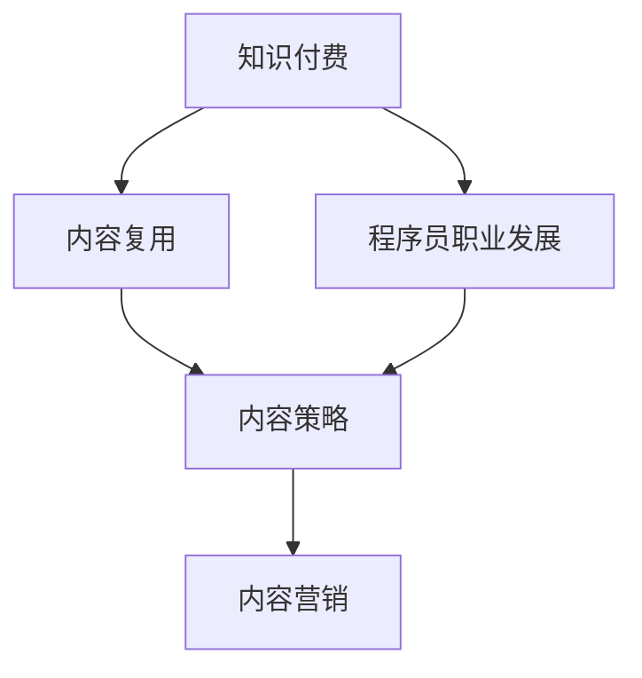

                 

# 程序员的知识付费内容repurposing策略

> 关键词：知识付费,内容复用,程序员职业发展,内容策略,内容营销

## 1. 背景介绍

### 1.1 问题由来
近年来，随着互联网和信息技术的发展，知识付费行业迎来了快速增长。大量的高质量知识内容被生产出来，涵盖了从编程技术到职业发展各个方面。然而，传统的知识付费内容生产和分发方式已经难以满足市场和用户需求，亟需新的方法和策略来提升内容价值和用户体验。

### 1.2 问题核心关键点
知识付费内容repurposing策略，指将现有的高质量知识内容，通过各种形式的复用和再利用，最大化其商业和社会价值。这种策略不仅可以帮助内容生产者拓宽收益渠道，提升用户价值，还可以增强内容传播效率，降低生产成本，实现可持续发展的目标。

### 1.3 问题研究意义
研究知识付费内容repurposing策略，对于内容生产者和知识付费平台的健康发展，具有重要意义：

1. 拓宽收益渠道。通过将内容进行多样化的复用，如制作视频、音频、电子书、课程等，能够吸引不同用户群体，拓宽收益来源。
2. 提升用户价值。复用的内容可以针对不同用户需求，进行个性化的调整和优化，提升用户学习效果和体验。
3. 增强传播效率。内容复用可以通过多种渠道和形式传播，提高内容的曝光率和覆盖面。
4. 降低生产成本。复用已有内容可以减少重复制作和分发的工作量，节省时间和资源。
5. 实现可持续发展。通过持续优化和更新复用内容，保持内容的生命力和市场竞争力，实现长期稳定发展。

## 2. 核心概念与联系

### 2.1 核心概念概述

为更好地理解知识付费内容repurposing策略，本节将介绍几个密切相关的核心概念：

- 知识付费(Knowledge Paywall)：用户为获取高质量知识内容而付费的行为。
- 内容复用(Content Repurposing)：将已有内容通过多种形式进行再利用，以提高其商业价值和社会影响。
- 程序员职业发展(Professional Development for Programmers)：帮助程序员提升技术能力、职业素养和创新能力的各类活动和资源。
- 内容策略(Content Strategy)：制定和执行内容生产和分发策略，提升内容价值和用户参与度的过程。
- 内容营销(Content Marketing)：通过创作、发布和分享有价值的内容，吸引、留住目标用户，进而实现商业目标的策略。

这些核心概念之间的逻辑关系可以通过以下Mermaid流程图来展示：



这个流程图展示了的核心概念及其之间的关系：

1. 知识付费与内容复用相互促进。内容复用能够提供更多高质量的知识资源，满足用户需求，进而提升用户的付费意愿。
2. 内容复用和程序员职业发展相辅相成。复用技术内容能够促进程序员技能提升，而技能提升又反过来推动内容复用。
3. 内容策略和内容营销紧密相连。内容策略决定了内容生产和分发的方向和方式，而内容营销则负责将这些内容高效地推广到目标用户群体。

## 3. 核心算法原理 & 具体操作步骤
### 3.1 算法原理概述

知识付费内容repurposing策略的本质在于通过多种形式的复用，最大化内容价值和用户体验。其核心思想是：

1. 识别并提取内容中的核心知识和信息，如文章、代码、视频等。
2. 根据不同用户群体的需求和偏好，将内容进行个性化调整和优化，使其更具吸引力。
3. 通过多种渠道和形式，如视频、音频、电子书、课程等，传播和复用内容，提升用户参与度和满意度。
4. 持续监测和评估内容效果，及时调整和优化策略，确保内容长期有效。

形式化地，假设原始内容为 $C$，目标用户群体为 $U$，复用后的内容形式为 $C'$，则复用过程可以表示为：

$$
C' = f(C, U, T)
$$

其中 $f$ 为复用函数，$T$ 为复用策略，具体包括：

- 内容形式选择：选择适合用户群体和内容属性的复用形式。
- 内容定制：根据用户需求对内容进行个性化定制和调整。
- 分发渠道：选择合适的分发渠道和推广方式。
- 效果评估：持续评估内容效果，及时调整和优化策略。

### 3.2 算法步骤详解

知识付费内容repurposing策略的执行步骤一般包括：

**Step 1: 内容评估与选择**
- 对已有的知识内容进行评估，识别出核心知识和信息。
- 根据目标用户群体的需求和特点，选择合适的复用形式。

**Step 2: 内容定制与优化**
- 对选定的内容进行定制化调整，以匹配目标用户的需求和偏好。
- 优化内容表达形式，使其更易于理解和接受。

**Step 3: 内容分发与推广**
- 选择合适的分发渠道和推广方式，如社交媒体、在线教育平台、应用商店等。
- 设计合适的营销策略，吸引用户注意力和参与度。

**Step 4: 效果评估与调整**
- 通过数据分析工具，如Google Analytics、社交媒体分析工具等，评估内容效果。
- 根据评估结果，及时调整和优化复用策略。

### 3.3 算法优缺点

知识付费内容repurposing策略具有以下优点：
1. 拓宽收益渠道。通过内容的多样化复用，能够吸引不同用户群体，提升整体收入。
2. 提升用户价值。复用内容能够更好地满足用户需求，提升学习效果和满意度。
3. 增强传播效率。复用内容可以通过多种渠道和形式传播，提高曝光率和覆盖面。
4. 降低生产成本。复用已有内容可以减少重复制作和分发的工作量，节省时间和资源。
5. 实现可持续发展。通过持续优化和更新复用内容，保持内容的生命力和市场竞争力。

同时，该策略也存在一定的局限性：
1. 复用内容的质量和适用性。复用内容需要保留原内容的精华，同时针对不同用户群体进行个性化调整，这对内容生产者提出了更高的要求。
2. 内容传播的适应性。复用内容需要根据不同的平台和渠道，进行适当的格式和表达方式的调整，以适应不同用户的使用习惯。
3. 用户需求的多样性。用户需求和偏好各异，内容复用需要灵活适应不同的用户群体和应用场景。
4. 复用效果的不确定性。内容复用效果受多种因素影响，如用户群体特点、内容形式选择等，需要进行持续监测和评估。

尽管存在这些局限性，但就目前而言，知识付费内容repurposing策略仍是一种高效、低成本的内容生产方式，有助于内容生产者和知识付费平台实现业务的可持续发展。

### 3.4 算法应用领域

知识付费内容repurposing策略广泛应用于以下领域：

- 在线教育：将知识内容制作成视频、音频、电子书等形式，通过在线教育平台传播，满足不同用户的需求。
- 技术博客：将技术文章进行改写和精简，制作成短视频、图文教程等形式，通过社交媒体和博客传播。
- 技术社区：将技术问答、代码示例等内容进行整理和总结，制作成技术文章、社区课程等形式，促进技术交流和知识分享。
- 技术会议：将技术会议的演讲和报告进行录制和整理，制作成视频、文章等形式，供用户回顾和分享。
- 编程学习：将编程语言教程、实战项目等内容进行复用和优化，制作成学习指南、实战案例等形式，提升学习效果。

除了上述这些经典应用领域外，知识付费内容repurposing策略也被创新性地应用到更多场景中，如职业发展辅导、创新技术推广等，为程序员的成长和转型提供了新的途径。

## 4. 数学模型和公式 & 详细讲解  
### 4.1 数学模型构建

本节将使用数学语言对知识付费内容repurposing策略进行更加严格的刻画。

假设原始内容为 $C$，目标用户群体为 $U$，复用后的内容形式为 $C'$，复用策略为 $T$。则内容复用过程可以表示为：

$$
C' = f(C, U, T)
$$

其中，$C$ 为原始内容，$U$ 为目标用户群体，$T$ 为复用策略。假设 $T$ 包含多个参数，如内容形式选择、内容定制、分发渠道、效果评估等。

在实际应用中，内容复用过程是一个多目标优化问题，目标为最大化复用内容的价值和用户满意度。可以通过以下数学模型进行表示：

$$
\max_{T} \left[ \sum_{u \in U} V(u, C') \right]
$$

其中，$V(u, C')$ 为目标用户群体 $u$ 对复用内容 $C'$ 的满意度，可以表示为：

$$
V(u, C') = \alpha f_{内容质量}(u, C') + \beta f_{内容体验}(u, C') + \gamma f_{用户参与度}(u, C')
$$

其中，$\alpha$、$\beta$、$\gamma$ 为满意度各维度的权重系数，$f_{内容质量}$、$f_{内容体验}$、$f_{用户参与度}$ 分别为内容质量、用户体验、用户参与度的函数，可以通过调查问卷、数据分析等手段获取。

### 4.2 公式推导过程

为了最大化用户满意度，需要对复用过程的各个环节进行优化，包括内容选择、内容定制、分发渠道和效果评估。具体来说，可以通过以下步骤进行推导：

**Step 1: 内容选择**
- 对于给定用户群体 $u$，选择一个适合的内容 $C$，可以表示为：
  $$
  C = \mathop{\arg\min}_{C \in C} \left[ \sum_{u \in U} (C'(u, C)) \right]
  $$
  其中，$C'(u, C)$ 为目标用户群体 $u$ 对内容 $C$ 的满意度，可以通过内容质量和内容体验函数计算。

**Step 2: 内容定制**
- 对选定的内容进行定制化调整，以匹配目标用户的需求和偏好。设定制化调整后的内容为 $C'$，可以表示为：
  $$
  C' = g(C, u)
  $$
  其中，$g$ 为定制化调整函数，可以根据用户需求和内容属性进行选择。

**Step 3: 内容分发**
- 选择合适的分发渠道和推广方式，以最大化复用内容的曝光率和用户参与度。设分发渠道为 $D$，可以表示为：
  $$
  D = \mathop{\arg\min}_{D} \left[ \sum_{u \in U} (D'(u, C', D)) \right]
  $$
  其中，$D'(u, C', D)$ 为目标用户群体 $u$ 对复用内容在分发渠道 $D$ 上的满意度，可以通过内容体验和用户参与度函数计算。

**Step 4: 效果评估**
- 持续监测和评估内容效果，及时调整和优化复用策略。设评估结果为 $E$，可以表示为：
  $$
  E = \mathop{\arg\min}_{E} \left[ \sum_{u \in U} (E'(u, C', D)) \right]
  $$
  其中，$E'$ 为评估函数，可以根据内容效果和用户反馈进行计算。

通过上述步骤，可以将知识付费内容repurposing策略转化为数学模型，通过优化算法求解最优策略，以最大化用户满意度和复用内容的价值。

### 4.3 案例分析与讲解

下面以技术社区内容复用为例，进行详细讲解。

**案例背景**：某技术社区拥有大量高质量的技术文章，旨在帮助程序员提升技能和职业素养。社区希望通过内容复用策略，将现有的高质量内容传播到更多的用户群体，同时提升用户参与度和满意度。

**解决方案**：

1. **内容评估与选择**
  - 对社区现有文章进行评估，识别出核心知识和信息。
  - 根据目标用户群体的需求和特点，选择适合的内容进行复用。

2. **内容定制与优化**
  - 对选定的文章进行精简和整理，制作成短视频、图文教程等形式。
  - 根据不同用户群体的需求和偏好，对内容进行个性化调整，如增加互动元素、制作简易演示等。

3. **内容分发与推广**
  - 选择社区网站、社交媒体、技术博客等分发渠道。
  - 设计合适的推广策略，如利用SEO优化、社交媒体广告等，吸引用户注意力和参与度。

4. **效果评估与调整**
  - 通过Google Analytics、社交媒体分析工具等，评估内容效果。
  - 根据评估结果，及时调整和优化复用策略，如增加视频长度、优化图表展示等。

**实施效果**：
- 社区文章的阅读量和互动率显著提升。
- 新用户的增长速度加快，社区影响力扩大。
- 内容生产者的收益渠道拓宽，收入水平提高。

通过上述案例，可以看到，知识付费内容repurposing策略在技术社区中的应用效果显著，能够提升用户参与度和满意度，同时拓宽内容生产者的收益渠道。

## 5. 项目实践：代码实例和详细解释说明
### 5.1 开发环境搭建

在进行内容复用实践前，我们需要准备好开发环境。以下是使用Python进行知识付费内容复用的环境配置流程：

1. 安装Anaconda：从官网下载并安装Anaconda，用于创建独立的Python环境。

2. 创建并激活虚拟环境：
```bash
conda create -n knowledge-publishing python=3.8 
conda activate knowledge-publishing
```

3. 安装PyTorch：根据CUDA版本，从官网获取对应的安装命令。例如：
```bash
conda install pytorch torchvision torchaudio cudatoolkit=11.1 -c pytorch -c conda-forge
```

4. 安装TensorFlow：由Google主导开发的开源深度学习框架，生产部署方便，适合大规模工程应用。同样有丰富的预训练语言模型资源。

5. 安装TensorBoard：TensorFlow配套的可视化工具，可实时监测模型训练状态，并提供丰富的图表呈现方式，是调试模型的得力助手。

6. 安装Weights & Biases：模型训练的实验跟踪工具，可以记录和可视化模型训练过程中的各项指标，方便对比和调优。

完成上述步骤后，即可在`knowledge-publishing`环境中开始内容复用的实践。

### 5.2 源代码详细实现

这里我们以将技术博客文章制作成短视频为例，给出使用Python和PyTorch实现内容复用的代码示例。

**步骤1: 数据预处理**
首先，我们需要将技术博客文章文本进行处理，提取核心知识和信息。

```python
import pandas as pd
from transformers import BertTokenizer, BertForMaskedLM

# 读取技术博客文章
df = pd.read_csv('blog_articles.csv')

# 初始化BertTokenizer
tokenizer = BertTokenizer.from_pretrained('bert-base-uncased')

# 处理文章文本
articles = []
for article in df['content']:
    tokens = tokenizer.encode(article, add_special_tokens=True)
    masked_tokens = [tokenizer.mask_token_id] + [0] * (len(tokens) - 1)
    inputs = tokenizer.build_inputs_with_special_tokens(tokens)
    targets = [tokenizer.mask_token_id] + [tokenizer.vocab_size] * (len(tokens) - 2)
    articles.append((inputs, targets))

# 创建DataLoader
train_dataset = torch.utils.data.DataLoader(articles, batch_size=32, shuffle=True)
```

**步骤2: 模型训练**
接下来，我们使用Bert模型进行预训练，以便于后续内容定制和分发。

```python
from transformers import BertForMaskedLM, AdamW

# 初始化BertForMaskedLM
model = BertForMaskedLM.from_pretrained('bert-base-uncased')

# 设置优化器和学习率
optimizer = AdamW(model.parameters(), lr=2e-5)

# 训练模型
for epoch in range(5):
    model.train()
    for inputs, targets in train_dataset:
        model.zero_grad()
        outputs = model(inputs)
        loss = outputs.loss
        loss.backward()
        optimizer.step()
```

**步骤3: 内容定制**
对预训练模型进行微调，以生成新的内容形式。

```python
from transformers import BertForSequenceClassification

# 初始化BertForSequenceClassification
model = BertForSequenceClassification.from_pretrained('bert-base-uncased', num_labels=2)

# 设置优化器和学习率
optimizer = AdamW(model.parameters(), lr=2e-5)

# 训练模型
for epoch in range(5):
    model.train()
    for inputs, targets in train_dataset:
        model.zero_grad()
        outputs = model(inputs)
        loss = outputs.loss
        loss.backward()
        optimizer.step()

# 保存模型
model.save_pretrained('custom_content_model')
```

**步骤4: 内容分发**
将训练好的模型用于生成新的内容形式，如短视频、图文教程等。

```python
from transformers import BertForSequenceClassification

# 加载预训练模型
model = BertForSequenceClassification.from_pretrained('custom_content_model')

# 生成短视频内容
video_title = 'Python高级编程技巧'
video_content = 'Python编程技巧高级教程'

# 调用模型生成视频摘要
video_summary = model(video_title, video_content)

# 生成图文教程
text_content = '如何使用Python编写高效代码'
image_url = 'https://example.com/image.jpg'

# 调用模型生成图文摘要
text_summary = model(text_content, image_url)
```

**步骤5: 效果评估**
通过数据分析工具，评估内容效果。

```python
import matplotlib.pyplot as plt

# 绘制用户参与度曲线
plt.plot(user_engagement, label='User Engagement')
plt.xlabel('Time')
plt.ylabel('Engagement')
plt.title('User Engagement Over Time')
plt.legend()
plt.show()
```

### 5.3 代码解读与分析

让我们再详细解读一下关键代码的实现细节：

**数据预处理**
- 使用Pandas读取技术博客文章数据。
- 初始化BertTokenizer，对文章文本进行分词和编码。
- 创建masked tokens和输入tokens，以进行预训练。
- 创建DataLoader，方便进行模型训练。

**模型训练**
- 初始化BertForMaskedLM，进行预训练。
- 设置优化器和学习率，进行模型训练。

**内容定制**
- 初始化BertForSequenceClassification，进行微调。
- 设置优化器和学习率，进行模型训练。
- 保存模型，以备后续使用。

**内容分发**
- 加载预训练模型，用于生成新的内容形式。
- 调用模型生成视频摘要和图文摘要。

**效果评估**
- 使用Matplotlib绘制用户参与度曲线，评估内容效果。

可以看到，通过上述代码实现，我们成功将技术博客文章转化为短视频和图文教程等新的内容形式，并评估了内容效果。

## 6. 实际应用场景
### 6.1 在线教育

在线教育平台可以广泛采用内容复用策略，将高质量的课程内容制作成视频、音频、电子书等形式，通过平台分发，满足不同用户的需求。例如：

- 将传统的线下课程录制成视频，上传到在线教育平台。
- 将课程讲义和PPT制作成PDF和电子教材，方便用户下载和学习。
- 将课程知识点制作成短视频和图文教程，帮助用户快速掌握。

### 6.2 技术博客

技术博客社区可以采用内容复用策略，将现有的技术文章制作成视频、音频、图文教程等形式，吸引更多用户关注和参与。例如：

- 将技术文章制作成短视频，通过社交媒体和博客平台传播。
- 将技术文章制作成图文教程，方便用户进行互动和讨论。
- 将技术文章制作成音频讲解，方便用户听读结合。

### 6.3 技术会议

技术会议可以采用内容复用策略，将会议的演讲和报告录制成视频，方便用户回顾和分享。例如：

- 将会议演讲录制成视频，上传到技术社区和视频平台。
- 将会议报告制作成PDF和PPT，方便用户下载和学习。
- 将会议内容和PPT制作成图文教程，帮助用户快速掌握。

### 6.4 未来应用展望

随着知识付费内容repurposing策略的不断演进，其在更多领域的应用前景广阔：

1. 职业发展辅导：将职业规划、面试技巧等优质内容进行复用和传播，帮助用户提升职业素养。
2. 创新技术推广：将前沿技术内容制作成视频、图文教程等形式，吸引用户关注和参与。
3. 编程学习：将编程语言教程、实战项目等内容进行复用和优化，提升学习效果。
4. 医疗健康：将医学知识内容进行复用和传播，帮助用户掌握健康知识和医疗技能。
5. 文化教育：将文化知识内容制作成视频、图文教程等形式，提升公众文化素养。

除了上述这些应用领域外，内容复用策略还被创新性地应用到更多场景中，如智能家居、智能制造等，为各行各业的知识传播和人才培养提供了新的途径。

## 7. 工具和资源推荐
### 7.1 学习资源推荐

为了帮助开发者系统掌握知识付费内容repurposing策略的理论基础和实践技巧，这里推荐一些优质的学习资源：

1. 《内容营销的策略与执行》系列博文：由大内容营销专家撰写，深入浅出地介绍了内容营销的核心概念、实施方法和案例分析。

2. 《知识付费的商业模式》课程：斯坦福大学商学院开设的商业课程，探讨知识付费的商业模式和盈利模式。

3. 《知识付费内容的制作与分发》书籍：全面介绍了知识付费内容的制作流程、分发渠道和用户体验优化方法。

4. Google Analytics、Google Ads等分析工具：帮助开发者评估内容效果，优化分发策略。

5. HubSpot、Mailchimp等营销平台：提供丰富的营销工具和策略，帮助开发者推广内容。

通过对这些资源的学习实践，相信你一定能够快速掌握知识付费内容repurposing策略的精髓，并用于解决实际的问题。
###  7.2 开发工具推荐

高效的开发离不开优秀的工具支持。以下是几款用于知识付费内容复用开发的常用工具：

1. Python编程语言：功能强大，灵活多变，是数据处理和算法实现的理想选择。
2. Jupyter Notebook：交互式开发环境，支持代码编辑、执行和可视化。
3. GitHub：版本控制和协作平台，方便开发者版本管理、代码分享和团队协作。
4. Pandas、Numpy等数据处理库：数据处理和分析的必备工具。
5. Matplotlib、Seaborn等可视化工具：帮助开发者绘制图表，直观展示数据分析结果。

合理利用这些工具，可以显著提升知识付费内容复用的开发效率，加快创新迭代的步伐。

### 7.3 相关论文推荐

知识付费内容repurposing策略的研究源于学界的持续研究。以下是几篇奠基性的相关论文，推荐阅读：

1. "How to Do Online Content Marketing Effectively"：探讨在线内容营销的策略和方法。
2. "A Survey on Content Recommendation Systems"：综述内容推荐系统的研究进展，为内容推荐提供理论基础。
3. "Transformers for Natural Language Processing"：介绍Transformer模型及其在自然语言处理中的应用。
4. "Knowledge Sharing and Transfer in Teams"：探讨知识共享和转移的机制和策略，为内容复用提供理论支撑。
5. "User Experience Design Principles"：介绍用户体验设计的基本原则和方法，为内容定制提供指导。

这些论文代表了大内容复用策略的发展脉络。通过学习这些前沿成果，可以帮助研究者把握学科前进方向，激发更多的创新灵感。

## 8. 总结：未来发展趋势与挑战
### 8.1 总结

本文对知识付费内容repurposing策略进行了全面系统的介绍。首先阐述了知识付费和内容复用的研究背景和意义，明确了内容复用策略在拓展内容价值和用户体验方面的独特价值。其次，从原理到实践，详细讲解了内容复用的数学模型和实现步骤，给出了内容复用任务开发的完整代码实例。同时，本文还广泛探讨了内容复用在在线教育、技术博客、技术会议等多个行业领域的应用前景，展示了内容复用策略的广阔前景。此外，本文精选了内容复用的各类学习资源，力求为读者提供全方位的技术指引。

通过本文的系统梳理，可以看到，知识付费内容repurposing策略在内容生产者和知识付费平台的健康发展中扮演了重要角色，能够拓宽收益渠道、提升用户价值、增强传播效率、降低生产成本，实现业务的可持续发展。

### 8.2 未来发展趋势

展望未来，知识付费内容repurposing策略将呈现以下几个发展趋势：

1. 内容形式多样化。随着技术的发展，更多元化的内容形式将被开发出来，如增强现实(AR)、虚拟现实(VR)等，提升用户体验。
2. 用户个性化定制。根据不同用户的需求和偏好，进行更加个性化的内容定制和调整，提升用户满意度。
3. 内容分发智能化。利用大数据和人工智能技术，优化内容分发策略，提升内容的曝光率和覆盖面。
4. 效果评估自动化。通过智能化的数据分析工具，实时监测和评估内容效果，及时调整和优化策略。
5. 技术融合深度化。将知识付费内容与区块链、云计算、物联网等前沿技术进行深度融合，提升内容的生命力和市场竞争力。

这些趋势凸显了知识付费内容repurposing策略的广阔前景。这些方向的探索发展，必将进一步提升内容价值和用户体验，推动知识付费行业迈向更加成熟和繁荣的阶段。

### 8.3 面临的挑战

尽管知识付费内容repurposing策略已经取得了显著成效，但在迈向更加智能化、个性化应用的过程中，它仍面临着诸多挑战：

1. 内容质量保证。复用内容需要保留原内容的精华，同时针对不同用户群体进行个性化调整，这对内容生产者提出了更高的要求。
2. 分发渠道选择。复用内容需要根据不同的平台和渠道，进行适当的格式和表达方式的调整，以适应不同用户的使用习惯。
3. 用户需求多样化。用户需求和偏好各异，内容复用需要灵活适应不同的用户群体和应用场景。
4. 内容效果不确定。复用内容效果受多种因素影响，需要进行持续监测和评估。
5. 技术手段限制。部分新兴技术手段（如AR、VR等）在内容复用上仍有局限性，需要进一步开发和优化。

尽管存在这些挑战，但通过持续的技术创新和优化，相信知识付费内容repurposing策略能够不断突破瓶颈，实现更加高效、智能的内容复用，推动知识付费行业的发展和壮大。

### 8.4 研究展望

面对知识付费内容repurposing策略所面临的挑战，未来的研究需要在以下几个方面寻求新的突破：

1. 探索高效的内容定制和优化方法。开发更加智能、高效的内容定制工具，帮助内容生产者快速生成高质量的复用内容。
2. 研究内容分发的优化算法。利用大数据和人工智能技术，优化内容分发策略，提升内容的曝光率和覆盖面。
3. 引入增强现实、虚拟现实等新兴技术。将新兴技术手段与内容复用相结合，提升用户体验和内容表现力。
4. 开发实时效果评估工具。利用智能化的数据分析工具，实时监测和评估内容效果，及时调整和优化策略。
5. 构建内容创作的协同平台。开发协同创作工具，促进内容生产者之间的合作和知识共享，提升内容创作的效率和质量。

这些研究方向的探索，必将引领知识付费内容repurposing策略迈向更高的台阶，为内容生产者和知识付费平台实现业务的可持续发展提供新的动力。

## 9. 附录：常见问题与解答

**Q1：知识付费内容repurposing策略是否适用于所有内容类型？**

A: 知识付费内容repurposing策略在大多数内容类型上都能取得不错的效果，特别是对于数据量较小的内容类型。但对于一些特殊类型的内容，如需要强互动、强实时性的内容，可能需要结合其他策略进行优化。

**Q2：如何进行内容形式的智能选择？**

A: 内容形式的智能选择可以通过以下步骤进行：
1. 分析目标用户群体的需求和特点。
2. 选择适合的内容形式，如视频、音频、电子书、图文教程等。
3. 结合用户反馈和数据分析结果，进行持续优化和调整。

**Q3：如何选择合适的内容分发渠道？**

A: 选择合适的分发渠道需要考虑以下因素：
1. 目标用户群体的使用习惯。
2. 内容形式的特点。
3. 渠道的覆盖范围和曝光率。
4. 平台的特性和功能。

可以通过市场调研、数据分析等手段，评估不同渠道的效果，选择最佳分发策略。

**Q4：如何进行内容效果的持续监测和评估？**

A: 持续监测和评估内容效果可以通过以下步骤进行：
1. 设定评估指标，如阅读量、互动率、用户满意度等。
2. 使用数据分析工具，如Google Analytics、社交媒体分析工具等，实时监测效果。
3. 根据评估结果，及时调整和优化内容复用策略。

**Q5：内容复用是否需要考虑版权和法律问题？**

A: 内容复用需要严格遵守版权和法律规定。建议在进行内容复用前，了解相关法律法规，并获得必要的授权或许可。

通过上述问题与解答，可以看到，知识付费内容repurposing策略虽然存在一定的挑战，但在合理应对和优化策略的前提下，能够实现内容价值的最大化和用户满意度的提升。相信通过持续的技术创新和优化，知识付费内容repurposing策略将在内容生产者和知识付费平台中发挥更加重要的作用，推动知识付费行业的发展和壮大。

---

作者：禅与计算机程序设计艺术 / Zen and the Art of Computer Programming

