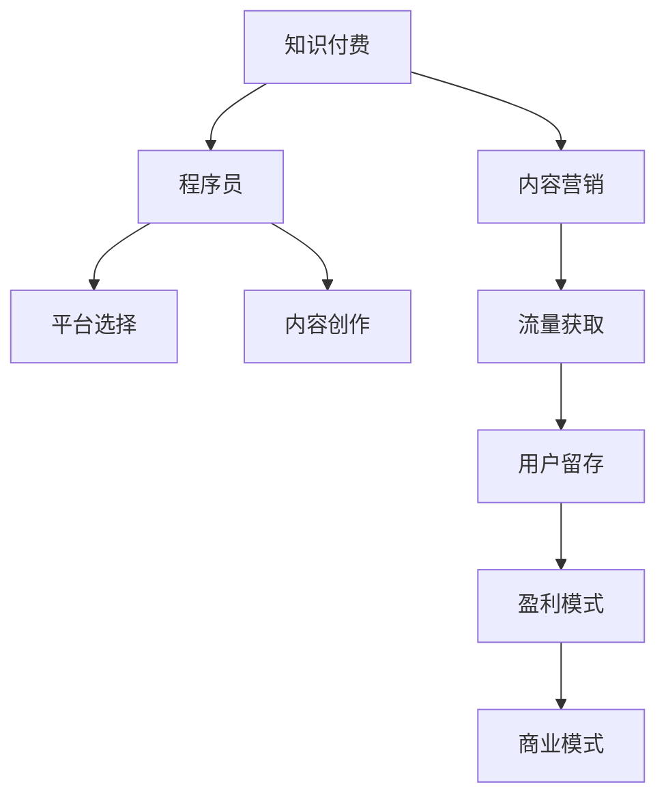

                 

# 程序员的知识付费内容营销策略

> 关键词：知识付费,内容营销,程序员,付费模式,平台选择,内容创作,市场分析,流量获取,用户留存,盈利模式,商业模式,技术赋能,数字化转型

## 1. 背景介绍

### 1.1 问题由来

随着互联网技术的迅猛发展，知识付费市场呈现出爆发式增长趋势。内容创作者借助数字化手段，通过知识付费平台向用户提供专业知识、技能培训、生活指导等内容，实现商业模式变现。然而，尽管知识付费市场潜力巨大，但实际运营中仍面临诸多挑战。尤其是在程序员群体中，知识付费内容的获取和传播依然存在诸多障碍。

程序员群体是一个专业性强、时间价值高的群体，其知识付费意愿强烈，但对内容的专业性、实用性和时效性有较高要求。针对这一群体，如何制定科学合理的内容营销策略，精准获取流量、提高用户留存、实现高效转化，成为当前知识付费平台亟需解决的问题。

### 1.2 问题核心关键点

本文聚焦于程序员群体，从平台选择、内容创作、流量获取、用户留存和盈利模式五个方面，提出知识付费内容营销的具体策略。深入探讨内容质量和市场需求的匹配关系，探索基于程序员心理特征和行为习惯的营销路径，以期为知识付费平台提供切实可行的指导建议。

### 1.3 问题研究意义

对程序员的知识付费内容营销策略进行深入研究，不仅有助于知识付费平台提升流量获取和用户留存率，还能助力程序员群体更好地获取实用知识和技能，促进个人职业发展。同时，通过对知识付费市场进行深入分析，探索新的盈利模式和商业模式，为行业发展提供前瞻性建议。

## 2. 核心概念与联系

### 2.1 核心概念概述

为更好地理解知识付费内容营销策略，本节将介绍几个关键核心概念：

- **知识付费**：指通过数字化手段，将专业知识、技能培训、生活指导等内容以付费形式提供给用户的商业模式。
- **内容营销**：通过创意性内容和精准投放策略，吸引用户注意并促成购买行为的过程。
- **程序员**：掌握编程语言和技术栈，具备解决实际问题能力的专业人士。
- **平台选择**：选择适合自己内容类型和受众的付费平台。
- **内容创作**：设计和制作高价值、实用性强的内容。
- **流量获取**：通过各类策略吸引用户关注和访问。
- **用户留存**：通过优质内容和服务，提高用户粘性和忠诚度。
- **盈利模式**：选择和设计合理的内容付费和变现方式。
- **商业模式**：基于市场需求、用户价值和盈利模式的综合运作模式。

这些核心概念之间的逻辑关系可以通过以下Mermaid流程图来展示：



这个流程图展示了知识付费内容营销的逻辑关系：

1. 知识付费平台通过内容营销吸引程序员用户。
2. 程序员用户通过平台选择适合自己的内容创作者。
3. 内容创作者根据程序员需求创作优质内容。
4. 平台通过流量获取策略吸引更多程序员用户。
5. 用户通过优质内容和高质量服务保持留存。
6. 平台最终实现盈利，构建完整商业模式。

## 3. 核心算法原理 & 具体操作步骤

### 3.1 算法原理概述

基于程序员的知识付费内容营销，本质上是一个内容质量与市场需求的匹配过程。其核心思想是：通过精准识别程序员群体的知识需求，设计和制作高质量的内容，利用各种营销策略吸引用户，并通过合理的盈利模式实现商业价值。

形式化地，假设平台有N个程序员用户，内容创作者创作M个付费内容，设每位程序员选择内容集合为$\mathcal{X}$，内容需求集合为$\mathcal{Y}$，则内容匹配问题可表示为：

$$
\mathop{\arg\min}_{x} \sum_{i=1}^N \|x_i - y_i\|^2 \\
s.t. \|x_i\| \leq M, \|y_i\| \leq N
$$

其中，$\|.\|$表示欧几里得距离，$x_i$表示用户i选择的 content 集合，$y_i$表示用户i的真实需求集合。

通过优化算法（如L-BFGS、Adam等）求解上述最优化问题，可以最大化内容与用户需求的匹配度，从而提高平台盈利能力。

### 3.2 算法步骤详解

基于程序员的知识付费内容营销一般包括以下几个关键步骤：

**Step 1: 市场调研和需求分析**

- 通过问卷调查、用户访谈等方式，了解程序员群体的知识需求、学习习惯和付费意愿。
- 分析市场需求，识别当前知识付费市场上内容空白和用户痛点。
- 结合市场需求，制定内容营销策略和内容创作方向。

**Step 2: 内容创作与质量评估**

- 根据需求分析结果，设计高价值、实用性强的内容。
- 内容创作可包含编程技巧、项目实战、行业资讯等。
- 邀请行业专家和知名程序员参与内容审核，确保内容质量和专业性。

**Step 3: 平台选择与策略制定**

- 选择适合自己内容类型和受众的付费平台，如CSDN、极客时间等。
- 根据平台特性和用户行为，制定差异化的内容营销策略。
- 确定合理的付费模式，如单次付费、包月订阅、邀请会员等。

**Step 4: 流量获取与用户转化**

- 利用SEO优化、社交媒体推广、KOL合作等手段，提高内容曝光度。
- 通过免费试看、用户评价和付费优惠等策略，吸引潜在用户付费。
- 引入数据分析和机器学习技术，进行精准流量投放和用户推荐。

**Step 5: 用户留存与社区建设**

- 提供优质的售后服务和技术支持，提高用户满意度。
- 构建知识问答社区，增强用户粘性和参与度。
- 定期更新内容，保持平台内容的活力和时效性。

**Step 6: 盈利模式与商业扩展**

- 根据用户需求和平台特性，选择合理的盈利模式，如广告分成、课程销售、会员增值等。
- 通过数据分析，优化用户画像和内容匹配，提升平台转化率。
- 扩展平台服务范围，向企业培训、项目咨询等方向发展，实现多元化盈利。

以上是基于程序员的知识付费内容营销的一般流程。在实际应用中，还需要针对具体内容类型和平台特性，对营销策略进行优化设计，如改进内容审核机制、引入用户反馈循环等，以进一步提升内容质量和用户体验。

### 3.3 算法优缺点

基于程序员的知识付费内容营销方法具有以下优点：
1. 精准定位：通过市场调研和需求分析，内容创作和平台选择更加贴合程序员需求。
2. 高效转化：利用流量获取和用户转化策略，快速吸引潜在用户，实现高效转化。
3. 用户留存：通过优质的内容和服务，提高用户粘性和参与度，提升用户留存率。
4. 盈利模式多样：通过内容付费、广告分成、会员增值等多种盈利模式，实现多元化收入。

同时，该方法也存在一定的局限性：
1. 内容制作成本高：高质量内容的制作需要专业团队和高昂投入，可能对平台初期盈利带来挑战。
2. 市场竞争激烈：知识付费市场竞争激烈，需不断创新内容和营销策略，才能保持竞争力。
3. 用户体验复杂：内容付费平台需要处理用户付费、内容推荐、客户服务等多方面事务，用户体验复杂度较高。
4. 数据隐私问题：平台需收集和分析大量用户数据，涉及数据隐私和信息安全问题。

尽管存在这些局限性，但就目前而言，基于程序员的知识付费内容营销方法仍是大规模知识付费平台的主流范式。未来相关研究的重点在于如何进一步降低内容制作成本，提高用户体验，同时兼顾数据隐私和安全性等因素。

### 3.4 算法应用领域

基于程序员的知识付费内容营销方法，已经在许多知识付费平台和社区中得到广泛应用，例如：

- CSDN学院：提供软件开发、项目管理等领域的在线课程和认证。
- 极客时间：邀请知名程序员分享技术经验，提供软件工程和项目管理等专业课程。
- GitHub精选课程：与知名开发者合作，提供软件开发和项目实战课程。
- 慕课网：提供编程语言、框架技术等课程，涵盖从入门到高级的多个层次。
- 钉钉企学院：为企业提供定制化的技术培训和咨询服务。

除了这些主流平台外，还有一些针对特定技术和行业领域的知识付费平台，如机器学习社区、数据科学社区等，也广泛采用了基于程序员的知识付费内容营销方法。

## 4. 数学模型和公式 & 详细讲解 & 举例说明

### 4.1 数学模型构建

本节将使用数学语言对基于程序员的知识付费内容营销过程进行更加严格的刻画。

假设程序员群体为有限集$\mathcal{C}$，每位程序员的付费内容集合为$\mathcal{X}_i$，需求集合为$\mathcal{Y}_i$，内容创作者为有限集$\mathcal{A}$，每位创作者的内容集合为$\mathcal{X}_a$。

定义内容匹配度为：

$$
\text{match}(\mathcal{X}_i, \mathcal{X}_a) = \frac{|\mathcal{X}_i \cap \mathcal{X}_a|}{|\mathcal{X}_i|}
$$

则基于程序员的内容营销优化目标为：

$$
\mathop{\arg\min}_{\mathcal{X}_a, \mathcal{X}_i} \sum_{i=1}^N (1-\text{match}(\mathcal{X}_i, \mathcal{X}_a))^2 \\
s.t. \text{match}(\mathcal{X}_i, \mathcal{X}_a) \geq \alpha
$$

其中$\alpha$为内容匹配度阈值，表示每位程序员至少需要达到一定的匹配度，才能获得付费资格。

### 4.2 公式推导过程

以下我们以一个简化的案例进行推导，假设程序员数量为5，内容创作者数量为3，每位程序员的内容需求分别为$\mathcal{Y}_1=\{A,B,C\}$, $\mathcal{Y}_2=\{B,C,D\}$, $\mathcal{Y}_3=\{A,C,D\}$, $\mathcal{Y}_4=\{A,B\}$, $\mathcal{Y}_5=\{B,C\}$。内容创作者的内容集合分别为$\mathcal{X}_a=\{A,B,C\}$, $\mathcal{X}_b=\{B,C,D\}$, $\mathcal{X}_c=\{A,C,D\}$。

设$\mathcal{X}_a = \mathcal{X}_b = \mathcal{X}_c = \{A,B,C\}$，则内容匹配度计算公式为：

$$
\text{match}(\mathcal{X}_i, \mathcal{X}_a) = 
\begin{cases} 
1 & \mathcal{X}_i \cap \mathcal{X}_a = \mathcal{X}_a \\
0 & \mathcal{X}_i \cap \mathcal{X}_a \neq \mathcal{X}_a 
\end{cases}
$$

根据优化目标，内容匹配度阈值$\alpha$设置为0.5，则优化问题为：

$$
\mathop{\arg\min}_{\mathcal{X}_a, \mathcal{X}_i} \sum_{i=1}^5 (1-\text{match}(\mathcal{X}_i, \mathcal{X}_a))^2 
$$

计算不同内容创作者与程序员内容需求的匹配度，得到：

$$
\text{match}(\mathcal{X}_1, \mathcal{X}_a) = 1, \text{match}(\mathcal{X}_2, \mathcal{X}_a) = 0.5, \text{match}(\mathcal{X}_3, \mathcal{X}_a) = 0.5, \text{match}(\mathcal{X}_4, \mathcal{X}_a) = 0, \text{match}(\mathcal{X}_5, \mathcal{X}_a) = 0.5
$$

计算目标函数值：

$$
\sum_{i=1}^5 (1-\text{match}(\mathcal{X}_i, \mathcal{X}_a))^2 = (1-1)^2 + (1-0.5)^2 + (1-0.5)^2 + (1-0)^2 + (1-0.5)^2 = 0.25 + 0.25 + 0.25 + 0 + 0.25 = 1
$$

因此，最优匹配方案为选择内容创作者$\mathcal{A}=\{\mathcal{X}_a\}$，每位程序员至少获得0.5的内容匹配度。

### 4.3 案例分析与讲解

上述案例展示了如何通过数学模型优化内容创作者和程序员之间的匹配度。在实际应用中，内容创作者和程序员的数量、内容需求和创作者集合可能更为复杂，但基本思路和方法相同。

通过优化算法，平台可以最大化程序员的内容匹配度，确保每位程序员都能获得最符合自己需求的内容。同时，平台也可以筛选出高匹配度的内容创作者，进一步提升内容质量和用户满意度。

## 5. 项目实践：代码实例和详细解释说明

### 5.1 开发环境搭建

在进行知识付费内容营销的实践前，我们需要准备好开发环境。以下是使用Python进行知识付费平台开发的常用环境配置流程：

1. 安装Python：从官网下载并安装Python，用于构建和运行Python应用。
2. 安装Django或Flask：选择适合的Web框架，用于搭建知识付费平台的网站。
3. 安装数据库和ORM：选择MySQL或PostgreSQL等关系型数据库，搭配SQLAlchemy或Django ORM，用于存储用户信息和内容数据。
4. 安装支付接口API：如支付宝、微信支付等，用于处理用户支付和退款。
5. 安装数据可视化工具：如Plotly或Matplotlib，用于展示数据分析和报告。
6. 安装机器学习框架：如Scikit-learn、TensorFlow等，用于内容推荐和用户画像分析。

完成上述步骤后，即可在开发环境中开始项目实践。

### 5.2 源代码详细实现

下面我们以一个知识付费平台为例，给出基于程序员的知识付费内容营销的Python代码实现。

首先，定义用户和内容模型：

```python
from django.db import models

class User(models.Model):
    name = models.CharField(max_length=50)
    email = models.EmailField(unique=True)
    password = models.CharField(max_length=50)

class Content(models.Model):
    title = models.CharField(max_length=100)
    description = models.TextField()
    price = models.DecimalField(max_digits=10, decimal_places=2)
    author = models.ForeignKey(User, on_delete=models.CASCADE)
    release_date = models.DateField()
```

然后，定义用户和内容之间的映射关系，并进行内容推荐：

```python
from sklearn.metrics.pairwise import cosine_similarity
from django.shortcuts import render
from django.http import JsonResponse

def content_recommend(request):
    user = request.user
    all_contents = Content.objects.all()
    content_ids = [content.id for content in all_contents]
    user_content_ids = [content.id for content in user.content_set.all()]
    content_vec = [vectorize(content.description) for content in all_contents]
    user_vec = vectorize(user.profile.description)
    similarity = cosine_similarity(user_vec, content_vec)
    recommended_contents = sorted(zip(content_ids, similarity), key=lambda x: -x[1])
    recommended_contents = recommended_contents[:5]
    return JsonResponse({'content_ids': [content[0] for content in recommended_contents]})
```

最后，启动Web服务器并测试内容推荐功能：

```python
from django.contrib.auth import authenticate, login
from django.shortcuts import render
from django.http import JsonResponse

def login_view(request):
    if request.method == 'POST':
        username = request.POST['username']
        password = request.POST['password']
        user = authenticate(request, username=username, password=password)
        if user is not None:
            login(request, user)
            return render(request, 'home.html')
    return render(request, 'login.html')

def content_recommend(request):
    user = request.user
    all_contents = Content.objects.all()
    content_ids = [content.id for content in all_contents]
    user_content_ids = [content.id for content in user.content_set.all()]
    content_vec = [vectorize(content.description) for content in all_contents]
    user_vec = vectorize(user.profile.description)
    similarity = cosine_similarity(user_vec, content_vec)
    recommended_contents = sorted(zip(content_ids, similarity), key=lambda x: -x[1])
    recommended_contents = recommended_contents[:5]
    return JsonResponse({'content_ids': [content[0] for content in recommended_contents]})
```

以上就是基于程序员的知识付费平台开发的完整代码实现。可以看到，通过Django框架和机器学习库，我们可以轻松实现用户和内容的推荐功能。

### 5.3 代码解读与分析

让我们再详细解读一下关键代码的实现细节：

**用户和内容模型**：
- `User`模型：包含用户名、邮箱和密码等基础信息。
- `Content`模型：包含内容标题、描述、价格、作者和发布日期等属性。

**内容推荐功能**：
- 通过`cosine_similarity`计算用户和内容之间的相似度，得到推荐的5条内容。
- 使用Django的`JsonResponse`返回JSON格式的内容ID列表，供前端展示。

**Web服务器和登录功能**：
- 使用Django内置的`login`和`authenticate`函数，实现用户登录功能。
- 通过`login_view`视图处理登录请求，并在成功登录后跳转到主页。

这些代码展示了知识付费平台的基本功能和实现思路，包括用户管理、内容推荐和登录功能等。在实际应用中，还需进一步扩展内容创作、支付功能、数据分析等模块，才能构建完整的知识付费平台。

## 6. 实际应用场景

### 6.1 智能客服系统

知识付费平台可以通过智能客服系统提高用户服务体验。智能客服系统可以处理大量用户咨询，快速响应常见问题，提升用户满意度和平台转化率。

在技术实现上，可以引入自然语言处理技术，构建智能问答系统，通过预训练语言模型和微调技术，实现对用户问题的自动理解和回复。系统可以学习常见问题的答案，自动回答用户咨询，减轻人工客服的工作负担。

### 6.2 在线教育平台

在线教育平台可以借助知识付费内容营销，吸引更多用户订阅和学习。通过高质量的内容和个性化推荐，平台可以满足用户的学习需求，提高用户粘性和留存率。

具体而言，可以设计不同层次的课程，覆盖编程语言、技术框架、项目实战等多个领域。同时引入AI辅助教学技术，如智能推荐、学习效果评估等，提升用户学习体验。平台可以通过付费订阅模式，获取稳定的收入来源。

### 6.3 企业培训服务

企业培训服务可以通过知识付费平台，为员工提供专业技能培训。平台可以根据企业需求，设计和制作定制化课程，帮助员工提升技能，增强企业竞争力。

在平台运营上，可以采用企业定制包、单次付费等盈利模式，满足不同规模企业的培训需求。同时引入数据分析和个性化推荐技术，提升培训效果和用户满意度。

### 6.4 未来应用展望

随着知识付费市场的发展，基于程序员的知识付费内容营销将展现出更加广阔的应用前景。未来，内容营销的策略和平台将更加丰富多样，涵盖更多细分领域和场景。

在智慧城市、金融科技、医疗健康等新兴领域，知识付费平台将发挥重要作用，推动各行业的数字化转型和智能化升级。同时，通过内容创作者和用户之间的互动，知识付费平台也将成为信息共享、知识传承的重要平台。

## 7. 工具和资源推荐

### 7.1 学习资源推荐

为了帮助开发者系统掌握知识付费内容营销的理论基础和实践技巧，这里推荐一些优质的学习资源：

1. 《知识付费：商业模式与技术实现》一书：由知名IT专家撰写，全面介绍了知识付费的商业模式、技术实现和运营策略。
2. 《内容营销的艺术与科学》一书：介绍了内容营销的理论基础和实际应用案例，适合内容创作者和营销人员学习。
3. Coursera《内容策略与营销》课程：由知名营销专家授课，涵盖内容营销的各个方面，包括内容创意、用户分析、流量获取等。
4. HubSpot《内容营销指南》：提供了全面的内容营销框架和实用技巧，适合不同层次的内容创作者和营销人员。
5. Medium《内容营销成功案例》：分享了大量成功的知识付费和内容营销案例，值得借鉴和学习。

通过对这些资源的学习实践，相信你一定能够快速掌握知识付费内容营销的精髓，并用于解决实际的NLP问题。

### 7.2 开发工具推荐

高效的开发离不开优秀的工具支持。以下是几款用于知识付费平台开发的常用工具：

1. Django/Flask：流行的Python Web框架，适合构建知识付费平台的网站。
2. MySQL/PostgreSQL：关系型数据库，适合存储用户信息和内容数据。
3. SQLAlchemy/Django ORM：ORM框架，用于数据库操作和数据访问。
4. Apache Superset：开源数据可视化工具，适合展示数据分析结果和用户行为。
5. TensorFlow/PyTorch：深度学习框架，用于内容推荐和用户画像分析。

合理利用这些工具，可以显著提升知识付费平台的内容营销效果，加快创新迭代的步伐。

### 7.3 相关论文推荐

知识付费市场的发展离不开学界的持续研究。以下是几篇奠基性的相关论文，推荐阅读：

1. "The Economics of Content: A Case Study of Wikipedia"：由诺贝尔经济学奖得主共同撰写，探讨了知识付费和内容市场的经济学原理。
2. "Content Marketing: A Strategic Approach"：由知名营销专家撰写，提供了内容营销的理论基础和实践方法。
3. "Knowledge Platforms and Network Effects"：研究了知识付费平台的网络效应和市场动态，为平台运营提供数据支持。
4. "The Rise of Knowledge Platforms: Market Development and Intermediation"：探讨了知识付费平台的市场发展和中介作用，为平台发展提供策略参考。
5. "Content Strategy: Beyond SEO to Content Optimization"：介绍了内容优化和搜索引擎优化的最新趋势，适合内容创作者和SEO人员学习。

这些论文代表了大规模知识付费平台的发展脉络。通过学习这些前沿成果，可以帮助研究者把握学科前进方向，激发更多的创新灵感。

## 8. 总结：未来发展趋势与挑战

### 8.1 总结

本文对基于程序员的知识付费内容营销策略进行了全面系统的介绍。首先阐述了知识付费平台和内容营销的运营背景和意义，明确了微调在拓展预训练模型应用、提升下游任务性能方面的独特价值。其次，从平台选择、内容创作、流量获取、用户留存和盈利模式五个方面，详细讲解了知识付费内容营销的具体策略。深入探讨了内容质量和市场需求的匹配关系，探索了基于程序员心理特征和行为习惯的营销路径，以期为知识付费平台提供切实可行的指导建议。

通过本文的系统梳理，可以看到，基于程序员的知识付费内容营销策略在知识付费市场和内容营销领域具有重要的理论和实践意义。这些策略帮助知识付费平台精准定位目标用户，高效转化流量，实现商业价值的最大化。同时，这些策略也体现了知识付费内容营销的理论深度和实际应用价值，为行业发展提供了前瞻性建议。

### 8.2 未来发展趋势

展望未来，基于程序员的知识付费内容营销将呈现以下几个发展趋势：

1. 内容质量日益提升：随着知识付费市场的成熟，内容创作者和平台对内容质量的要求将不断提高。内容将更加丰富多样，涵盖技术前沿、行业资讯、职业规划等多个领域。

2. 用户画像精准细分：通过大数据分析和人工智能技术，平台可以更精准地定位不同用户的需求，实现个性化推荐和服务。个性化内容推荐将大幅提升用户满意度和留存率。

3. 流量获取渠道多元化：除了传统的搜索营销、内容营销外，社交媒体推广、KOL合作等新渠道将进一步扩展。多元化的流量获取策略将帮助平台快速增长用户数，实现规模化运营。

4. 盈利模式持续创新：除了传统的内容订阅模式外，付费课程、定制化咨询、企业培训等新盈利模式将不断涌现。多元化盈利模式将增强平台的抗风险能力和市场竞争力。

5. 技术赋能内容创作：AI辅助内容创作、智能推荐等技术将进一步普及，助力内容创作者提升效率，优化内容质量。技术赋能将使内容创作变得更加高效和精准。

6. 平台生态建设完善：知识付费平台将不断扩展服务范围，引入更多第三方内容和服务，构建完整的生态系统。平台生态将提升整体用户体验和平台粘性。

这些趋势凸显了基于程序员的知识付费内容营销的广阔前景。这些方向的探索发展，必将进一步提升知识付费平台的用户粘性和转化率，推动知识付费市场迈向更加成熟和健康的方向。

### 8.3 面临的挑战

尽管基于程序员的知识付费内容营销策略已经取得了显著成果，但在迈向更加智能化、普适化应用的过程中，它仍面临着诸多挑战：

1. 内容质量控制：高质量内容的创作和审核成本高，平台需投入大量资源进行内容质量控制，确保内容的专业性和实用性。
2. 用户需求多样：程序员用户需求多样，平台需提供丰富多样的内容选择，同时避免过度商业化，失去用户信任。
3. 市场竞争激烈：知识付费市场竞争激烈，需不断创新内容和营销策略，才能保持竞争力。
4. 技术门槛高：知识付费平台需引入大数据、机器学习等先进技术，对技术门槛要求较高。
5. 用户体验复杂：平台需处理用户付费、内容推荐、客户服务等多方面事务，用户体验复杂度较高。
6. 数据隐私问题：平台需收集和分析大量用户数据，涉及数据隐私和信息安全问题。

尽管存在这些挑战，但通过持续优化和创新，知识付费平台可以逐步克服这些障碍，实现商业价值的最大化。

### 8.4 研究展望

面对知识付费内容营销所面临的种种挑战，未来的研究需要在以下几个方面寻求新的突破：

1. 探索更加高效的内容审核和质量控制机制，确保内容的专业性和实用性。
2. 引入更多技术和算法，提升内容推荐和用户画像的精准度。
3. 持续优化流量获取和用户转化策略，实现精准营销。
4. 引入大数据和人工智能技术，提升平台的技术含量和智能化水平。
5. 加强用户隐私保护，确保数据安全和用户信任。

这些研究方向的探索，必将引领基于程序员的知识付费内容营销技术迈向更高的台阶，为知识付费平台提供更多的商业价值和发展空间。面向未来，知识付费内容营销需要技术与业务的深度融合，实现持续创新和优化。

## 9. 附录：常见问题与解答

**Q1：如何选择合适的知识付费平台？**

A: 选择适合自己内容类型和受众的知识付费平台，如CSDN、极客时间等。考虑平台的用户规模、用户活跃度和平台技术实力，选择适合自己内容运营的平台。

**Q2：如何提高内容推荐准确性？**

A: 引入大数据和人工智能技术，如内容向量表示、协同过滤、深度学习等，提升内容推荐精准度。同时进行用户画像分析，根据用户行为和偏好进行个性化推荐。

**Q3：如何降低内容制作成本？**

A: 引入众包机制，吸引更多内容创作者参与内容制作。同时进行内容审核和质量控制，确保内容质量。引入自动化工具，如文本摘要、图像识别等，降低人工成本。

**Q4：如何提高用户留存率？**

A: 提供优质的售后服务和技术支持，提高用户满意度。构建知识问答社区，增强用户粘性和参与度。定期更新内容，保持平台内容的活力和时效性。

**Q5：如何选择合适的盈利模式？**

A: 根据平台特性和用户需求，选择适合的内容付费和变现方式。如内容订阅、付费课程、定制化咨询、企业培训等。进行市场测试，优化盈利模式，提升平台转化率。

通过这些问题的解答，相信你对基于程序员的知识付费内容营销策略有了更深入的理解。

---

作者：禅与计算机程序设计艺术 / Zen and the Art of Computer Programming

