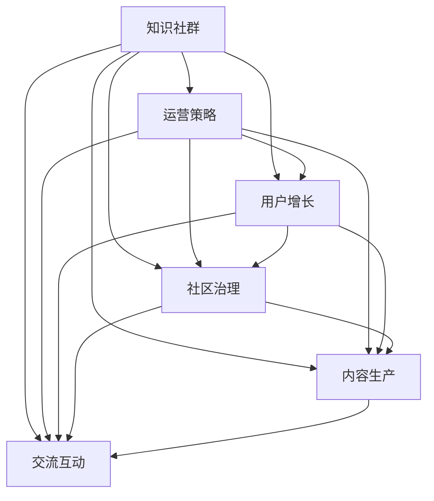

                 

# 程序员的知识社群运营：从0到10000用户

## 1. 背景介绍

### 1.1 问题由来
随着技术快速迭代和互联网的普及，越来越多的技术爱好者和开发者开始寻找知识共享和交流的渠道。知识社群（Knowledge Community）应运而生，提供了一个平等、开放的平台，供程序员相互学习和成长。然而，建立一个活跃、有影响力的知识社群并非易事，不仅需要投入大量时间和资源，还需要遵循一套系统性的运营策略。本文旨在探讨程序员知识社群从0到10000用户的运营过程，涵盖关键运营要素、策略和工具，帮助更多技术爱好者建立和运营成功的知识社群。

## 2. 核心概念与联系

### 2.1 核心概念概述

在讨论知识社群运营之前，首先需要理解一些核心概念：

- **知识社群（Knowledge Community）**：一个平台，旨在聚集技术爱好者和开发者，分享技术知识，进行交流和协作。
- **运营策略（Operational Strategies）**：为实现社群目标，通过一系列有策略的行动和决策，推动社群发展。
- **用户增长（User Growth）**：知识社群用户数量的增长，以及用户活跃度的提升。
- **社区治理（Community Governance）**：确保社群有序运作，管理规则、成员行为、内容质量等。
- **内容生产（Content Production）**：组织和激励社群成员生成高质量的技术内容，如文章、教程、项目分享等。
- **交流互动（Interactive Engagement）**：通过讨论组、问答、代码评审等方式，促进社群成员之间的互动和合作。

这些概念通过以下Mermaid流程图连接起来，展示了知识社群运营的关键环节：



这个流程图展示了知识社群从创建到运营的各个关键环节，以及这些环节之间的相互关系。

## 3. 核心算法原理 & 具体操作步骤
### 3.1 算法原理概述

知识社群运营的本质是通过一系列有策略的行动，吸引和留住高质量的用户，并促进知识的生产与交流。以下从算法和操作的角度，概述了知识社群运营的原理和步骤。

**Step 1: 选择合适的平台和工具**

选择一个适合知识共享的平台，如Discourse、Slack、Github等，并选择合适的开发和维护工具，如Jira、Trello、Git等。平台和工具的选择直接影响运营效率和用户体验。

**Step 2: 设定明确的运营目标**

明确知识社群的运营目标，如用户增长、内容质量、社区氛围等。目标设定应具有可衡量性和可实现性，确保运营策略的有效性。

**Step 3: 设计合理的社区规则**

制定清晰的社区规则，包括用户行为规范、内容审核标准等。规则应公平透明，既能维护社区秩序，又能激发用户参与。

**Step 4: 实施有效的用户增长策略**

通过SEO、社交媒体推广、邮件营销等手段，吸引新用户加入知识社群。同时，优化用户体验，提高用户留存率，建立社群忠诚度。

**Step 5: 持续激励和反馈**

定期组织技术沙龙、线上直播、编程竞赛等活动，激励用户积极参与。通过用户反馈和数据分析，不断调整运营策略，提升社群价值。

### 3.2 算法步骤详解

在实际运营中，以下步骤可以帮助我们从0到10000用户，有效提升知识社群的活跃度和影响力：

**Step 1: 平台和工具选择**

1. **平台选择**：
   - **Discourse**：一个功能强大的开源社区平台，适合技术交流和知识共享。
   - **Slack**：即时通讯工具，适合建立高效的团队沟通和协作。
   - **Github**：代码托管平台，适合技术项目的协作和版本控制。

2. **工具选择**：
   - **Jira**：项目管理工具，适合任务分配和进度跟踪。
   - **Trello**：看板式项目管理工具，适合流程管理和任务协调。
   - **Git**：版本控制系统，适合代码协作和版本管理。

**Step 2: 目标设定**

1. **明确目标**：
   - 用户增长目标：第一年内吸引1000名新用户。
   - 内容质量目标：每月发布20篇高质量技术文章。
   - 社区氛围目标：建立积极、活跃、友好的交流环境。

2. **可衡量性**：
   - 用户增长：新用户注册数量、活跃用户数量。
   - 内容质量：文章阅读量、点赞数、评论数。
   - 社区氛围：活跃度、满意度、参与度。

**Step 3: 规则设计**

1. **行为规范**：
   - 尊重他人，不发表攻击性言论。
   - 原创内容，不抄袭他人作品。
   - 合理使用资源，不滥用社群资源。

2. **内容审核标准**：
   - 高质量：内容准确、详细、实用。
   - 原创性：避免抄袭，鼓励创新。
   - 相关性：主题应与社群目标一致。

**Step 4: 用户增长策略**

1. **SEO优化**：
   - 优化网站和文章标题、关键词、描述。
   - 提高搜索引擎排名，增加自然流量。

2. **社交媒体推广**：
   - 在Twitter、GitHub、LinkedIn等平台分享社群内容。
   - 利用社交媒体的力量，吸引新用户。

3. **邮件营销**：
   - 定期发送社群动态、技术文章和活动通知。
   - 提高邮件打开率和点击率，增加用户粘性。

**Step 5: 持续激励和反馈**

1. **活动组织**：
   - 技术沙龙：邀请知名开发者分享技术经验。
   - 线上直播：组织编程竞赛、技术讨论等。

2. **用户反馈**：
   - 定期收集用户反馈，了解用户需求。
   - 调整运营策略，优化用户体验。

### 3.3 算法优缺点

**优点**：

1. **灵活性高**：知识社群运营可以根据实际情况灵活调整策略，适应不同环境和需求。
2. **用户参与度强**：通过多样化的活动和互动，激发用户参与和贡献。
3. **社区粘性高**：建立积极的社区氛围，增加用户粘性和忠诚度。

**缺点**：

1. **资源消耗大**：社群运营需要大量时间和资源，特别是在初期用户增长阶段。
2. **运营难度高**：需要持续监控和优化，确保社群健康有序发展。
3. **用户质量参差不齐**：如何筛选和管理高质量用户，是社群运营的一大挑战。

### 3.4 算法应用领域

知识社群运营方法不仅适用于技术爱好者和开发者，还可以应用于其他领域，如学术研究、兴趣爱好等。以下是几个典型的应用场景：

- **学术研究**：通过知识社群，汇聚学术资源和研究人员，促进学术交流和合作。
- **兴趣爱好**：围绕特定的兴趣爱好，建立一个交流平台，分享经验和资源。
- **职业发展**：为专业人士提供交流和学习的平台，提升职业技能和职业素养。

## 4. 数学模型和公式 & 详细讲解

### 4.1 数学模型构建

知识社群运营的效果可以通过一系列指标来衡量，包括用户增长率、内容质量评分、社区活跃度等。以下是一个简化的数学模型，用于量化社群运营效果：

1. **用户增长率**：
   - 新用户增长率（n）：每月新用户的数量与上个月总用户数的比率。
   - 活跃用户增长率（a）：每月活跃用户数量与上个月活跃用户数的比率。

2. **内容质量评分**：
   - 文章质量评分（c）：每篇文章的阅读量、点赞数、评论数的平均值。
   - 内容创新评分（i）：每篇文章的原创性和新颖性的评分。

3. **社区活跃度**：
   - 讨论活跃度（d）：每月讨论的数量与社群总用户数的比率。
   - 贡献活跃度（e）：每月新贡献内容的数量与社群总用户数的比率。

### 4.2 公式推导过程

1. **用户增长率计算**：
   - $n = \frac{N_{新用户}}{N_{上个月总用户}}$
   - $a = \frac{N_{活跃用户}}{N_{上个月活跃用户}}$

2. **内容质量评分计算**：
   - $c = \frac{R + Z + C}{3}$
   - $i = c_{原创} + c_{新颖}$

3. **社区活跃度计算**：
   - $d = \frac{T}{N_{总用户}}$
   - $e = \frac{C_{新贡献}}{N_{总用户}}$

其中，$N_{新用户}$、$N_{上个月总用户}$、$N_{活跃用户}$、$N_{上个月活跃用户}$、$N_{总用户}$、$T$、$C$、$C_{新贡献}$分别表示新用户数、上个月总用户数、活跃用户数、上个月活跃用户数、总用户数、讨论数量、点赞数量、评论数量、新贡献内容数量。

### 4.3 案例分析与讲解

**案例分析：**

假设某知识社群一个月新增用户100人，其中20人活跃，原有用户1000人，其中200人活跃。该月新增了30篇技术文章，每篇文章的平均阅读量为1000次，点赞数为50次，评论数为20次。平均每篇文章的原创性评分为0.8，新颖性评分为0.7。

1. **用户增长率计算**：
   - 新用户增长率 $n = \frac{100}{1000} = 0.1$
   - 活跃用户增长率 $a = \frac{220}{1200} = 0.183$

2. **内容质量评分计算**：
   - 文章质量评分 $c = \frac{1000+50+20}{3} = 366.67$
   - 内容创新评分 $i = 0.8 + 0.7 = 1.5$

3. **社区活跃度计算**：
   - 讨论活跃度 $d = \frac{50}{1000} = 0.05$
   - 贡献活跃度 $e = \frac{30}{1000} = 0.03$

通过以上分析，可以初步了解社群的用户增长、内容质量和活跃度情况，为后续的优化和调整提供依据。

## 5. 项目实践：代码实例和详细解释说明

### 5.1 开发环境搭建

1. **安装平台和工具**：
   - **Discourse**：通过Docker安装，安装命令：`docker run discourse/discourse:2.59`。
   - **Slack**：通过Slack官网下载和安装，配置API密钥。
   - **Github**：通过GitHub官网下载和安装，配置SSH密钥。
   - **Jira**：通过Jira官网下载和安装，配置邮箱和用户名。
   - **Trello**：通过Trello官网下载和安装，创建看板和列表。
   - **Git**：通过Git官网下载和安装，配置远程仓库和SSH密钥。

2. **配置环境变量**：
   - 配置Discourse、Slack、Github、Jira、Trello、Git的API密钥和环境变量。

3. **搭建开发环境**：
   - 使用Docker容器运行Discourse，确保平台稳定运行。
   - 配置Slack和Github集成，方便实时同步和通知。
   - 使用Jira和Trello进行任务管理和进度跟踪。
   - 使用Git进行代码协作和版本控制。

### 5.2 源代码详细实现

以下是一个简单的知识社群管理后台的代码实现，使用Python和Flask框架，实现了用户管理、文章管理和讨论管理等功能。

```python
from flask import Flask, render_template, request, redirect, url_for

app = Flask(__name__)

# 用户管理
@app.route('/user', methods=['GET', 'POST'])
def user():
    if request.method == 'POST':
        # 添加新用户
        # ...
        return redirect(url_for('user'))
    else:
        # 列出所有用户
        # ...
        return render_template('user.html')

# 文章管理
@app.route('/article', methods=['GET', 'POST'])
def article():
    if request.method == 'POST':
        # 发布新文章
        # ...
        return redirect(url_for('article'))
    else:
        # 列出所有文章
        # ...
        return render_template('article.html')

# 讨论管理
@app.route('/discussion', methods=['GET', 'POST'])
def discussion():
    if request.method == 'POST':
        # 发布新讨论
        # ...
        return redirect(url_for('discussion'))
    else:
        # 列出所有讨论
        # ...
        return render_template('discussion.html')

if __name__ == '__main__':
    app.run(debug=True)
```

### 5.3 代码解读与分析

1. **Flask框架**：
   - Flask是一个轻量级的Web框架，适合快速开发小型应用。
   - 通过路由装饰器实现功能模块的划分，方便维护和扩展。

2. **用户管理**：
   - 使用POST方法提交新用户信息，通过数据库保存用户数据。
   - 使用GET方法查询用户列表，通过模板展示用户信息。

3. **文章管理**：
   - 使用POST方法提交新文章内容，通过数据库保存文章数据。
   - 使用GET方法查询文章列表，通过模板展示文章信息。

4. **讨论管理**：
   - 使用POST方法提交新讨论内容，通过数据库保存讨论数据。
   - 使用GET方法查询讨论列表，通过模板展示讨论信息。

### 5.4 运行结果展示

运行以上代码，启动Flask应用，通过访问`http://localhost:5000/user`、`http://localhost:5000/article`、`http://localhost:5000/discussion`，即可访问用户管理、文章管理和讨论管理页面。

## 6. 实际应用场景

### 6.1 技术社区

技术社区是知识社群运营的重要应用场景，通过技术社区，开发者可以分享经验、解决问题、交流心得，形成一个积极的社区氛围。

**实际案例**：
- **Stack Overflow**：全球最大的程序员社区，通过问答模式，帮助开发者解决编程问题。
- **Github**：代码托管平台，通过开源项目和代码评审，促进技术交流和协作。

**运营策略**：
- **用户增长**：通过SEO优化、社交媒体推广、邮件营销等手段，吸引新用户加入社区。
- **社区治理**：制定详细的社区规则，严格执行用户行为规范。
- **内容生产**：组织编程竞赛、技术沙龙、线上直播等活动，激励用户贡献内容。

### 6.2 学术研究

学术研究社群通过分享学术论文、项目成果、研究进展，促进学术交流和合作。

**实际案例**：
- **ResearchGate**：全球最大的学术社交网络，通过论文分享、评论和引用，促进学术交流。
- **arXiv**：开放访问的预印本库，通过论文提交和访问，推动学术研究的发展。

**运营策略**：
- **用户增长**：通过学术机构合作、学术会议推广、学术媒体报道等手段，吸引新用户加入社群。
- **社区治理**：制定学术诚信规则，严格执行论文审核标准。
- **内容生产**：组织学术研讨会、在线讲座、学术期刊等活动，激励用户提交学术论文。

### 6.3 兴趣爱好

兴趣爱好社群通过分享兴趣爱好、项目作品、学习资源，形成一个有共同话题的交流平台。

**实际案例**：
- **Dev.to**：开发者社区，通过技术文章、编程项目、学习资源分享，促进开发者交流。
- **Codidact**：编程讨论社区，通过代码评审、技术讨论、项目合作，促进编程学习。

**运营策略**：
- **用户增长**：通过兴趣话题推广、社区活动宣传、用户口碑传播等手段，吸引新用户加入社群。
- **社区治理**：制定社区行为规范，严格执行内容审核标准。
- **内容生产**：组织编程挑战、技术沙龙、学习小组等活动，激励用户分享项目和心得。

## 7. 工具和资源推荐

### 7.1 学习资源推荐

为了帮助开发者掌握知识社群运营技巧，以下是一些优质的学习资源：

1. **《社区运营的艺术》**：一本系统讲解社区运营策略的书籍，涵盖用户增长、社区治理、内容管理等多个方面。
2. **《社区管理和运营》**：Coursera上的社区管理课程，提供社区运营的实践案例和实用技巧。
3. **《社区运营与增长》**：社区运营专家的在线讲座和博客，分享运营经验和方法。

### 7.2 开发工具推荐

以下是几款常用的知识社群开发和运营工具：

1. **Discourse**：开源社区平台，功能丰富，适合技术交流和知识共享。
2. **Slack**：即时通讯工具，适合团队协作和实时沟通。
3. **Github**：代码托管平台，适合代码协作和版本控制。
4. **Jira**：项目管理工具，适合任务分配和进度跟踪。
5. **Trello**：看板式项目管理工具，适合流程管理和任务协调。
6. **Git**：版本控制系统，适合代码协作和版本管理。

### 7.3 相关论文推荐

以下是几篇有代表性的知识社群运营论文，推荐阅读：

1. **《社区运营策略的有效性分析》**：分析社区运营策略对用户增长和社区氛围的影响。
2. **《社区内容管理的系统化研究》**：探讨社区内容管理的理论和方法，提供实用工具和模型。
3. **《技术社群的用户行为分析》**：通过数据挖掘和行为分析，发现用户行为规律，优化运营策略。

## 8. 总结：未来发展趋势与挑战

### 8.1 总结

本文对程序员知识社群运营的过程进行了全面系统的介绍。从平台选择、目标设定、规则设计到用户增长、社区治理、内容生产，详细阐述了知识社群运营的关键环节和策略。通过实际案例和代码实现，帮助读者深入理解知识社群运营的实现方法和效果评估。

### 8.2 未来发展趋势

展望未来，知识社群运营将呈现以下几个发展趋势：

1. **多平台融合**：知识社群将突破单一平台的限制，实现跨平台整合和信息共享。
2. **用户个性化**：通过数据分析和推荐算法，实现用户个性化内容和推荐，提升用户体验。
3. **社区自治化**：用户参与社区管理，提升社区自治水平，实现自我发展和自我规范。
4. **技术智能化**：引入AI和大数据技术，优化社区运营效率和用户参与度。
5. **内容多样化**：拓展社区内容形式，如视频、直播、虚拟现实等，提升社区互动性和沉浸感。

### 8.3 面临的挑战

尽管知识社群运营已经取得了诸多成功，但仍面临以下挑战：

1. **用户流失率高**：用户流失是知识社群运营的一大难题，如何提升用户粘性和忠诚度，是运营团队需要持续关注的问题。
2. **内容质量不一**：高质量内容的生产和审核，需要大量的时间和资源投入，如何保证内容质量的一致性，是运营团队的一大挑战。
3. **社区管理复杂**：社区管理涉及多方面的协调和执行，如何高效管理和监督社区行为，需要运营团队的智慧和耐心。
4. **技术成本高**：知识社群运营需要投入大量技术和人力成本，如何平衡成本和效果，是运营团队需要优化的问题。

### 8.4 研究展望

未来的知识社群运营研究需要在以下几个方面寻求突破：

1. **用户行为分析**：通过数据挖掘和机器学习，深入了解用户行为和需求，优化运营策略。
2. **内容推荐算法**：开发个性化内容推荐算法，提升用户满意度和社区活跃度。
3. **社区自治机制**：建立社区自治机制，提升用户参与度和社区自治水平。
4. **技术自动化**：引入AI和大数据技术，实现社区运营的自动化和智能化。
5. **跨平台融合**：实现跨平台的信息整合和协同，提升用户流动性和信息共享效率。

通过持续创新和优化，知识社群运营必将迎来更大的发展机遇，为技术爱好者和开发者提供一个更高效、更友好的交流平台。

## 9. 附录：常见问题与解答

**Q1：知识社群运营需要哪些关键资源？**

A: 知识社群运营需要以下关键资源：
1. **平台和工具**：选择适合的社区平台和开发工具，如Discourse、Slack、Github等。
2. **数据和用户**：收集和分析用户数据，吸引和维护高质量用户。
3. **运营团队**：组建专业的运营团队，负责社区管理和内容生产。

**Q2：知识社群运营中如何避免用户流失？**

A: 用户流失是知识社群运营的一大挑战，以下是一些有效的策略：
1. **提供价值**：提供有价值的内容和互动，满足用户需求。
2. **定期互动**：定期组织线上线下活动，保持用户活跃度。
3. **社区关怀**：关注用户反馈，及时解决问题，提升用户满意度。
4. **激励机制**：设立激励机制，如积分系统、奖励计划，鼓励用户参与。

**Q3：如何提高知识社群的内容质量？**

A: 提高知识社群的内容质量，需要从以下几个方面入手：
1. **内容审核**：制定严格的内容审核标准，确保内容质量和原创性。
2. **用户激励**：激励用户提交高质量内容，如奖励计划、认证机制等。
3. **社区规范**：制定社区行为规范，严格执行，保证内容质量一致性。
4. **用户反馈**：收集用户反馈，及时调整内容策略，提升内容质量。

**Q4：知识社群运营需要哪些技术支持？**

A: 知识社群运营需要以下技术支持：
1. **网站开发**：使用Flask等Web框架，搭建知识社群后台管理系统。
2. **用户管理**：使用数据库存储和管理用户信息，实现用户注册和登录。
3. **内容管理**：使用数据库存储和管理文章和讨论信息，实现内容发布和审核。
4. **互动功能**：使用Websocket技术，实现实时互动和消息推送。
5. **数据分析**：使用数据分析工具，如Google Analytics，监测用户行为和社区运营效果。

通过合理利用以上资源和技术，知识社群运营必将迎来更大的成功，为技术爱好者和开发者提供一个更高效、更友好的交流平台。

---

作者：禅与计算机程序设计艺术 / Zen and the Art of Computer Programming

