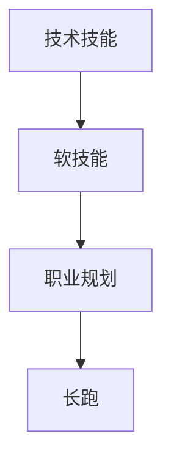

                 

# 程序员的职业生涯规划：长跑与长跑

## 1. 背景介绍

随着信息技术行业的快速发展和技术的不断迭代，程序员这一职业已经成为了众多年轻人向往的职业选择。然而，成为一名优秀的程序员并非易事，其职业生涯规划需要清晰的策略和持续的努力。本文将探讨程序员的职业发展路径，着重讨论技术技能、软技能和职业规划三个方面的成长，以及如何通过不断学习和持续优化，实现长期成功。

## 2. 核心概念与联系

### 2.1 核心概念概述

为了更好地理解程序员的职业发展，我们先介绍几个核心概念：

- **技术技能（Technical Skills）**：包括编程语言、数据结构与算法、软件架构、数据库、网络和云计算等知识。这些技能是程序员进行软件开发、测试、维护和优化所必需的。

- **软技能（Soft Skills）**：包括沟通能力、团队协作、时间管理、问题解决、项目管理等。软技能是提升工作效率和团队合作效率的重要因素。

- **职业规划（Career Planning）**：包括职业目标设定、路径规划、技能提升、求职技巧、职业发展策略等。职业规划帮助程序员在职业道路上做出明智的决策，实现职业目标。

- **长跑（Long-term Running）**：指程序员在职业生涯中持续的学习、成长和进步，不断提升自身竞争力，实现长期职业成功。

### 2.2 核心概念原理和架构的 Mermaid 流程图



这个流程图展示了技术技能、软技能和职业规划三者之间的关系：技术技能是程序员的基础，软技能是技术应用的关键，职业规划则是实现个人目标和成长的策略。而长跑则贯穿整个职业路径，是实现职业成功和持续成长的关键。

## 3. 核心算法原理 & 具体操作步骤

### 3.1 算法原理概述

在程序员的职业发展中，算法原理和具体操作步骤涉及以下几个关键点：

- **持续学习（Continuous Learning）**：技术不断进步，程序员需要不断学习新技术、新工具，以及新的编程范式，以保持竞争力。
- **技能平衡（Skill Balance）**：技术技能和软技能需要平衡发展，避免偏科。
- **职业目标设定（Career Goal Setting）**：明确短期和长期职业目标，有助于制定合理的学习和职业发展计划。
- **持续优化（Continuous Optimization）**：定期回顾和调整职业发展路径，适应行业变化。

### 3.2 算法步骤详解

1. **技术技能学习**：选择适合自己的编程语言、框架和技术栈，深入学习相关的基础知识和应用实践。
2. **软技能培养**：通过团队合作、项目管理等实际项目积累经验，提高沟通和协作能力。
3. **职业目标设定**：根据自身兴趣和行业趋势，设定短期和长期职业目标，如成为高级工程师、项目经理或技术专家等。
4. **技能评估与提升**：定期评估自己的技能水平，并通过课程、项目、书籍和研讨会等方式进行提升。
5. **职业路径调整**：根据行业发展趋势和个人兴趣，适时调整职业发展路径，如转向数据科学、人工智能等新兴领域。

### 3.3 算法优缺点

**优点**：
- **技术领先**：持续学习和技能提升使程序员始终保持行业领先水平。
- **软技能提升**：通过软技能培养，提升团队协作和工作效率。
- **职业目标实现**：明确的职业目标和路径规划使职业发展更有方向性。

**缺点**：
- **学习压力**：持续学习带来巨大的时间和精力压力。
- **技能失衡**：过度注重某项技能可能导致其他技能落后。
- **职业路径依赖**：固定的职业目标和路径可能导致适应性不足。

### 3.4 算法应用领域

这些核心算法原理适用于各种职业规划和持续成长的场景，包括软件开发、数据科学、人工智能、系统架构等。无论是新手还是资深开发者，都能从中受益。

## 4. 数学模型和公式 & 详细讲解 & 举例说明

### 4.1 数学模型构建

假设程序员的技术技能提升速度为 $S$，软技能提升速度为 $P$，职业目标实现度为 $G$，则其职业生涯发展的总进度可以用数学模型表示为：

$$
\text{总进度} = S + P + G
$$

其中，$S$、$P$、$G$ 分别代表技术技能、软技能和职业目标的提升度量。

### 4.2 公式推导过程

根据上述模型，我们可以推导出职业发展的最优路径。假设 $S$、$P$、$G$ 的比例关系为 $k_1:k_2:k_3$，则总进度可以表示为：

$$
\text{总进度} = k_1S + k_2P + k_3G
$$

进一步，如果 $k_1=k_2=k_3$，则：

$$
\text{总进度} = S + P + G
$$

这表示在技术技能、软技能和职业目标之间平衡发展，能够最大化职业发展的总进度。

### 4.3 案例分析与讲解

假设某程序员在技术技能、软技能和职业目标上的提升度分别为 $S=2$、$P=1$、$G=1$，则：

$$
\text{总进度} = 2S + P + G = 2 \times 2 + 1 + 1 = 5
$$

这意味着该程序员在两年内通过技术技能、软技能和职业目标的平衡发展，获得了显著的职业进步。

## 5. 项目实践：代码实例和详细解释说明

### 5.1 开发环境搭建

为了更好地进行项目实践，我们可以搭建一个基于开源技术的开发环境。以下是一个简单的配置过程：

1. **安装开发工具**：如 VSCode、Eclipse 或 IntelliJ IDEA。
2. **选择语言和框架**：如 Python、Java、Ruby 等，以及相应的 Web 框架和数据库工具。
3. **搭建代码仓库**：如 GitHub、GitLab 等平台，创建代码仓库并添加项目管理工具。

### 5.2 源代码详细实现

以下是一个简单的 Python 项目示例，包括项目结构、代码注释和单元测试：

```python
# main.py
import logging
from flask import Flask

app = Flask(__name__)

@app.route('/')
def index():
    return 'Hello, World!'

if __name__ == '__main__':
    app.run(debug=True)

# test_main.py
import unittest
from main import app

class TestMain(unittest.TestCase):
    def setUp(self):
        app.config['TESTING'] = True
        self.client = app.test_client()
    
    def test_index(self):
        response = self.client.get('/')
        self.assertEqual(response.status_code, 200)
        self.assertIn(b'Hello, World!', response.data)

if __name__ == '__main__':
    unittest.main()
```

### 5.3 代码解读与分析

1. **项目结构**：`main.py` 是主入口文件，包含 Flask 应用的初始化，`index` 函数定义了应用的默认路由。`test_main.py` 是单元测试文件，包含测试用例和断言。
2. **代码注释**：代码中包含详细的注释，帮助理解代码的功能和逻辑。
3. **单元测试**：通过编写单元测试，确保代码的正确性和稳定性。

### 5.4 运行结果展示

通过运行 `main.py`，在浏览器中访问 `http://127.0.0.1:5000/`，可以看到 `Hello, World!` 的响应。通过单元测试 `test_main.py`，可以验证代码的正确性。

## 6. 实际应用场景

### 6.1 技术开发

程序员在技术开发领域需要不断学习新的编程语言、框架和工具，以保持竞争力和工作效率。例如，从 Java 转 Python 的开发者可以通过学习 Flask、Django 等 Web 框架，快速上手 Web 开发。

### 6.2 系统架构

系统架构师需要不断学习新的设计和部署工具，如 Kubernetes、Docker、云平台等。例如，学习云平台架构的程序员可以通过学习 AWS、Azure 等云服务，提升系统部署和运维能力。

### 6.3 人工智能

在人工智能领域，程序员需要不断学习深度学习、机器学习、自然语言处理等技术。例如，通过学习 TensorFlow、PyTorch 等框架，掌握神经网络模型和算法，提升在数据科学和机器学习方面的能力。

## 7. 工具和资源推荐

### 7.1 学习资源推荐

1. **在线课程**：如 Coursera、edX、Udacity 等平台提供丰富的编程、数据科学和人工智能课程。
2. **书籍**：如《Clean Code》、《Design Patterns》、《Artificial Intelligence: A Modern Approach》等经典书籍，可以帮助程序员系统学习相关知识。
3. **社区和论坛**：如 Stack Overflow、GitHub、Stack Exchange 等社区，提供问题解决和交流平台。

### 7.2 开发工具推荐

1. **IDE**：如 IntelliJ IDEA、Eclipse、PyCharm 等，提供高效开发环境和插件支持。
2. **版本控制**：如 Git、GitHub、GitLab 等，提供代码管理和版本控制服务。
3. **项目管理**：如 JIRA、Trello、Asana 等，帮助团队协作和管理项目进度。

### 7.3 相关论文推荐

1. **技术论文**：如《Scalable Machine Learning》、《Deep Learning》等，提供最新的技术发展和前沿研究。
2. **软技能论文**：如《The Five Dysfunctions of a Team》、《Leaders Eat Last》等，帮助提升管理和领导能力。

## 8. 总结：未来发展趋势与挑战

### 8.1 研究成果总结

本文介绍了程序员职业发展的核心概念和技术原理，通过构建数学模型和公式推导，给出了具体的操作实践。此外，还通过实际项目和应用场景，展示了如何利用这些概念和原理进行职业规划和发展。

### 8.2 未来发展趋势

未来程序员的职业发展将更加注重以下几个趋势：

- **跨学科融合**：程序员需要具备更广泛的知识背景，如数据科学、人工智能、系统架构等。
- **团队协作**：团队合作和项目管理将成为重要能力，促进项目高效推进。
- **持续学习**：技术更新迅速，持续学习和技能提升成为职业发展的关键。
- **职业多样性**：程序员职业路径将更加多样化，包括技术专家、项目经理、数据科学家等。

### 8.3 面临的挑战

程序员职业发展面临以下挑战：

- **技术更新快**：技术不断迭代，学习和适应新技术的压力较大。
- **技能平衡**：不同技能之间的平衡发展需要更多时间和精力。
- **职业路径选择**：选择职业路径时需要考虑个人兴趣和行业需求。

### 8.4 研究展望

未来研究可以关注以下几个方面：

- **个性化学习路径**：根据个人兴趣和能力，设计个性化的学习路径。
- **技能和能力评估**：开发有效的技能和能力评估工具，帮助识别提升方向。
- **职业规划工具**：开发职业规划辅助工具，帮助程序员制定职业目标和路径。

## 9. 附录：常见问题与解答

**Q1: 如何平衡技术技能和软技能？**

A: 技术技能和软技能应相互促进，通过实际项目提升软技能，同时通过软技能提升提高技术应用的效率和质量。

**Q2: 如何提升编程效率？**

A: 学习高效编程技巧，如代码重构、单元测试、代码审查等，同时使用代码模板和开发工具，提升编程效率。

**Q3: 如何应对技术压力？**

A: 设定合理的职业目标和路径，定期进行技能和知识评估，不断调整职业规划，避免过度压力。

**Q4: 如何保持职业兴趣？**

A: 选择感兴趣的项目和技术领域，与行业专家交流，定期参加技术会议和培训，保持持续学习的动力。

**Q5: 如何应对职业瓶颈？**

A: 提升技能和知识，拓展职业路径，寻找新的发展机会，保持职业发展的活力和灵活性。

---

作者：禅与计算机程序设计艺术 / Zen and the Art of Computer Programming

