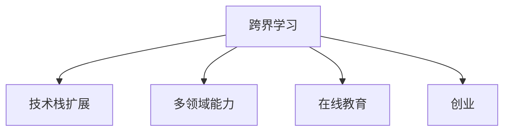

                 

# 程序员的跨界学习：拓宽收入渠道

> 关键词：跨界学习, 收入渠道, 技术创新, 创业, 终身学习, 多领域能力, 在线教育

## 1. 背景介绍

### 1.1 问题由来
在当今快速变化的技术环境中，技术工作者需要不断学习和更新知识，才能保持竞争力。然而，传统的IT教育和培训往往局限于单一技术领域，难以满足跨领域、跨行业的技术需求。程序员如果只掌握一种技术，可能在职业发展的道路上遭遇瓶颈。因此，程序员有必要进行跨界学习，拓宽自己的收入渠道。

### 1.2 问题核心关键点
跨界学习旨在打破技术壁垒，拓宽技术工作者在多个领域的知识和技能，从而提升职业发展和收入潜力。核心在于以下几点：
- **多领域知识**：掌握多个技术领域的核心知识和技能。
- **持续学习**：保持学习热情，不断更新知识体系。
- **多渠道收入**：结合多种技能和知识，开拓不同的收入来源。

## 2. 核心概念与联系

### 2.1 核心概念概述

为更好地理解跨界学习的概念，本节将介绍几个核心概念：

- **跨界学习**：指通过学习不同领域的技术知识，提升个人在多个领域的综合能力和竞争力。
- **技术栈扩展**：程序员通过学习新技能，扩展自己的技术栈，适应更多技术领域。
- **多领域能力**：程序员掌握多个领域的知识，如前端、后端、数据科学、人工智能等，形成全面的技术能力。
- **在线教育**：通过网络平台学习新知识，打破时间和空间的限制。
- **创业**：结合技术能力，探索新的商业模式，创建自己的技术公司。

这些核心概念之间的逻辑关系可以通过以下Mermaid流程图来展示：



这个流程图展示了跨界学习的核心概念及其之间的关系：

1. 跨界学习通过学习不同领域的技术知识，提升个人的综合能力。
2. 技术栈扩展指程序员通过学习新技能，扩展自己的技术能力，适应更多技术领域。
3. 多领域能力指程序员掌握多个领域的知识，形成全面的技术能力。
4. 在线教育提供便捷的学习渠道，打破时间和空间的限制。
5. 创业结合技术能力，探索新的商业模式，创建自己的技术公司。

## 3. 核心算法原理 & 具体操作步骤
### 3.1 算法原理概述

跨界学习的核心在于知识的整合和应用。假设一个程序员具备$A$领域的技术能力，希望学习并掌握$B$领域的技术，其基本原理如下：

1. **知识获取**：通过在线课程、书籍、项目实践等方式，获取$B$领域的基础知识和技能。
2. **知识融合**：将$A$领域的知识与$B$领域的学习成果进行整合，形成跨领域的能力。
3. **实践应用**：通过实际项目或案例，将跨领域能力应用于$A$和$B$领域的工作中，验证和提升能力。

### 3.2 算法步骤详解

跨界学习的算法步骤可以分为以下几个关键环节：

**Step 1: 设定学习目标**

- 明确自己希望学习的技术领域，如数据分析、人工智能、前端开发等。
- 确定需要掌握的具体技能，如Python编程、机器学习算法、前端框架等。

**Step 2: 选择合适的学习资源**

- 选择优质的在线教育平台，如Coursera、Udacity、edX等，获取相关的课程和资料。
- 确定合适的书籍、论文、视频等学习资源，深入理解核心概念和实现细节。

**Step 3: 制定学习计划**

- 根据学习目标和资源，制定详细的学习计划，包括学习时间、进度安排、评估标准等。
- 设定阶段性目标，确保学习进度和效果。

**Step 4: 实践应用**

- 通过实际项目或开源项目，实践应用所学的知识和技术。
- 参与社区讨论和代码贡献，提升实践能力和问题解决能力。

**Step 5: 持续改进**

- 定期回顾学习成果，总结经验教训，调整学习计划。
- 持续关注最新的技术和趋势，保持学习热情和动力。

### 3.3 算法优缺点

跨界学习的算法具有以下优点：
1. **拓宽职业发展**：跨界学习可以提升个人在多个领域的竞争力，拓宽职业发展渠道。
2. **提升综合能力**：跨界学习有助于形成全面的技术能力，适应不同技术环境。
3. **提升收入潜力**：掌握多种技能可以开拓更多的收入来源，如咨询、培训、创业等。

同时，该算法也存在一定的局限性：
1. **时间成本高**：跨界学习需要大量的时间和精力投入，可能影响原有工作的稳定性。
2. **资源需求高**：需要获取高质量的学习资源和实践机会，可能存在一定的门槛。
3. **技术壁垒高**：跨界学习需要跨越不同领域的知识边界，可能面临一定的理解和应用难度。
4. **效果因人而异**：不同人的学习能力和适应能力不同，跨界学习的效果可能存在显著差异。

### 3.4 算法应用领域

跨界学习的应用领域非常广泛，涵盖了多个技术和行业领域。以下是几个主要应用场景：

- **数据分析与人工智能**：结合统计学、机器学习等知识，提升数据驱动决策的能力。
- **前端开发与后端开发**：掌握前端框架和后端技术，构建全栈开发能力。
- **区块链与金融**：学习区块链技术，探索区块链在金融、供应链、医疗等领域的应用。
- **物联网与智能制造**：学习物联网和智能制造技术，推动产业升级和智能化转型。
- **游戏开发与虚拟现实**：掌握游戏开发和虚拟现实技术，创建交互式体验的创新应用。

## 4. 数学模型和公式 & 详细讲解  
### 4.1 数学模型构建

设$A$和$B$分别代表$A$领域和$B$领域的技术栈，$K_A$和$K_B$分别为$A$和$B$领域的知识库，则跨界学习的数学模型可以表示为：

$$
K_{A+B} = K_A \cup K_B
$$

其中$K_{A+B}$表示跨界学习后的知识库。

### 4.2 公式推导过程

根据上述公式，我们可以通过数学推导得到跨界学习的基本流程。

假设$A$和$B$领域的知识分别为$K_A$和$K_B$，则跨界学习后，知识库$K_{A+B}$中的元素可以通过并集运算得到，具体推导如下：

$$
K_{A+B} = K_A \cup K_B = (K_A \cap K_B) \cup (K_A - K_B) \cup (K_B - K_A)
$$

其中：
- $K_A \cap K_B$表示$A$和$B$领域共有的知识。
- $K_A - K_B$表示$A$领域独有的知识。
- $K_B - K_A$表示$B$领域独有的知识。

### 4.3 案例分析与讲解

以数据分析与人工智能为例，假设一个前端开发者希望学习数据分析与机器学习，其知识整合过程如下：

1. **共有的知识**：
   - 数据预处理、数据可视化等基础知识。
2. **独有的知识**：
   - 前端开发技能，如JavaScript、React等。
   - 数据分析与机器学习算法，如统计学、模型训练等。
   - 数据可视化工具，如Tableau、Matplotlib等。

通过将这三部分知识进行整合，前端开发者可以构建全栈数据科学家的能力。

## 5. 项目实践：代码实例和详细解释说明
### 5.1 开发环境搭建

在进行跨界学习实践前，我们需要准备好开发环境。以下是使用Python进行跨界学习环境配置的步骤：

1. 安装Anaconda：从官网下载并安装Anaconda，用于创建独立的Python环境。

2. 创建并激活虚拟环境：
```bash
conda create -n cross_skills python=3.8 
conda activate cross_skills
```

3. 安装Python包：
```bash
pip install pandas numpy scikit-learn statsmodels matplotlib seaborn jupyter notebook ipython
```

4. 安装Jupyter Notebook：
```bash
jupyter notebook --allow-root
```

5. 创建虚拟学习环境：
```bash
conda create -n learning_env python=3.8 
conda activate learning_env
```

### 5.2 源代码详细实现

下面以学习数据分析和机器学习为例，给出使用Python和Jupyter Notebook进行跨界学习的代码实现。

首先，定义学习目标和计划：

```python
# 学习目标
target_areas = ['数据分析', '机器学习']

# 学习计划
learning_plan = {
    '数据分析': ['数据预处理', '数据可视化', '统计学基础', '机器学习算法'],
    '机器学习': ['线性回归', '逻辑回归', '决策树', '随机森林']
}
```

然后，选择合适的学习资源：

```python
# 在线课程资源
courses = {
    '数据分析': ['Coursera数据分析课程', 'Udacity数据科学入门', 'edX数据分析基础'],
    '机器学习': ['Coursera机器学习课程', 'Udacity深度学习入门', 'edX机器学习基础']
}

# 书籍资源
books = {
    '数据分析': ['《Python数据分析基础》', '《R语言数据分析》', '《数据科学实战》'],
    '机器学习': ['《机器学习实战》', '《深度学习》', '《统计学习方法》']
}
```

接着，制定学习计划并执行：

```python
# 学习计划制定
def make_learning_plan(targets, courses, books):
    plan = {}
    for target in targets:
        plan[target] = courses[target] + books[target]
    return plan

learning_plan = make_learning_plan(target_areas, courses, books)
```

最后，通过实际项目实践所学知识：

```python
# 实际项目实践
import pandas as pd
import numpy as np
from sklearn.linear_model import LinearRegression
from sklearn.tree import DecisionTreeRegressor
from sklearn.ensemble import RandomForestRegressor
from sklearn.model_selection import train_test_split
from sklearn.metrics import mean_squared_error

# 数据预处理
data = pd.read_csv('data.csv')
X = data.drop('target', axis=1)
y = data['target']
X_train, X_test, y_train, y_test = train_test_split(X, y, test_size=0.2, random_state=42)

# 模型训练
reg = LinearRegression()
reg.fit(X_train, y_train)
pred = reg.predict(X_test)
print(mean_squared_error(y_test, pred))
```

### 5.3 代码解读与分析

让我们再详细解读一下关键代码的实现细节：

**make_learning_plan函数**：
- 接收学习目标、在线课程和书籍资源，构建详细的学习计划。
- 通过并集运算，将在线课程和书籍资源进行整合，形成跨界学习计划。

**实际项目实践**：
- 使用Pandas、NumPy、Scikit-learn等Python包，加载和处理数据。
- 进行数据预处理，使用线性回归模型进行训练和评估。

## 6. 实际应用场景
### 6.1 数据分析与机器学习结合

数据分析与机器学习结合的场景非常广泛，如市场分析、客户画像、产品推荐等。结合数据分析和机器学习技能，可以帮助企业快速分析数据，挖掘潜在商业价值。

在技术实现上，可以通过采集企业内部的历史数据，构建数据预处理和可视化流程，使用统计学和机器学习算法，进行数据建模和预测。最终将模型应用到实时数据，生成有价值的商业洞察，帮助企业做出数据驱动的决策。

### 6.2 前端开发与后端开发结合

前端和后端结合的场景包括全栈开发、微服务架构、Web应用开发等。掌握前端和后端开发技能，可以构建高效、稳定、功能丰富的Web应用系统。

在技术实现上，可以使用Node.js、React等前端技术，结合Python、Django等后端技术，构建全栈开发环境。通过设计良好的接口和数据模型，将前端和后端进行无缝集成，实现数据的实时渲染和处理。

### 6.3 区块链与金融结合

区块链与金融结合的场景包括数字货币、智能合约、供应链金融等。结合区块链和金融技术，可以实现去中心化的金融服务，提升交易效率和安全性。

在技术实现上，可以使用Python、Ethereum等区块链技术，结合金融算法和模型，构建智能合约和去中心化应用。通过智能合约和区块链的不可篡改特性，实现可信、透明、高效的金融服务。

### 6.4 物联网与智能制造结合

物联网与智能制造结合的场景包括工业互联网、智能设备、智慧城市等。结合物联网和智能制造技术，可以实现生产过程的智能化管理，提升生产效率和产品质量。

在技术实现上，可以使用Python、IoT框架等技术，结合智能制造设备和系统，构建物联网应用。通过物联网设备的实时数据采集和分析，优化生产流程，实现智能制造。

## 7. 工具和资源推荐
### 7.1 学习资源推荐

为了帮助程序员系统掌握跨界学习的核心知识，以下是几本推荐的书籍和在线课程：

1. 《Python数据分析基础》：详细讲解数据分析和Python编程的基础知识。
2. 《机器学习实战》：讲解机器学习算法的实现和应用。
3. Coursera《数据分析课程》：由斯坦福大学提供，涵盖数据分析的各个方面。
4. edX《机器学习基础》：由MIT提供，讲解机器学习的核心概念和算法。
5. Udacity《数据科学入门》：涵盖数据科学的基本知识和技能。

通过学习这些资源，程序员可以全面了解跨界学习的内容，掌握所需的技术和工具。

### 7.2 开发工具推荐

跨界学习需要多种工具的支持，以下是几款推荐的开发工具：

1. Python：简单易学、功能强大，广泛应用于数据分析、机器学习和Web开发。
2. Jupyter Notebook：支持多种语言，提供交互式编程环境，适合学习数据分析和机器学习。
3. GitHub：托管和分享代码，协作开发，适合团队学习与合作。
4. Anki：基于间隔重复算法，帮助程序员高效记忆和复习学习内容。
5. Google Colab：免费提供GPU和TPU资源，方便学习深度学习等计算密集型任务。

合理利用这些工具，可以显著提升跨界学习的效率，加速知识掌握和技能提升。

### 7.3 相关论文推荐

跨界学习的理论基础和实践应用已经得到广泛研究。以下是几篇代表性的论文，推荐阅读：

1. "Cross-Domain Transfer Learning in Natural Language Processing"：介绍自然语言处理领域的跨领域迁移学习。
2. "Learning to Learn by Cross-Domain Transfer"：研究如何通过跨领域学习提升机器学习模型的性能。
3. "Multi-Disciplinary Learning for Programmers"：探讨程序员如何通过跨界学习提升多领域技能。

通过阅读这些前沿研究，程序员可以了解最新的理论进展和实践案例，指导自己的跨界学习之路。

## 8. 总结：未来发展趋势与挑战
### 8.1 总结

本文对跨界学习进行了全面系统的介绍，涵盖了跨界学习的核心概念、算法原理、具体操作步骤和应用场景。通过本文的系统梳理，可以看到，跨界学习为程序员拓宽职业发展、提升收入潜力提供了新的路径。

通过跨界学习，程序员可以结合多种技术能力，构建全栈技术栈，适应更多技术环境和行业需求。同时，跨界学习还可以提升个人综合能力，拓展收入来源，增强职业竞争力。

### 8.2 未来发展趋势

展望未来，跨界学习将呈现以下几个发展趋势：

1. **技术融合加速**：不同技术领域的知识将更加紧密地结合，形成多维度的技术体系。
2. **终身学习常态化**：跨界学习将成为程序员职业生涯的重要组成部分，形成持续学习的习惯。
3. **交叉学科研究兴起**：跨界学习将推动跨学科研究的发展，形成新的学术热点。
4. **在线教育普及化**：在线教育平台将提供更加丰富和高效的学习资源，促进跨界学习的普及。
5. **技术社区活跃化**：技术社区将成为程序员跨界学习的重要支持平台，提供交流、协作的机会。

这些趋势凸显了跨界学习在技术和教育领域的广阔前景，预示着跨界学习将为程序员带来更多的机遇和挑战。

### 8.3 面临的挑战

尽管跨界学习提供了广阔的发展前景，但在实践中仍面临诸多挑战：

1. **时间和资源限制**：跨界学习需要大量时间和精力投入，可能影响原有工作。
2. **知识体系复杂**：跨界学习涉及多个技术领域，需要不断整合和应用不同知识。
3. **技能转化困难**：不同技术领域的技能可能存在差异，跨界学习者需要克服技能转化难题。
4. **学习效果评估**：跨界学习的评估标准难以量化，难以客观评估学习效果。

### 8.4 研究展望

面对跨界学习所面临的挑战，未来的研究需要在以下几个方面寻求新的突破：

1. **学习路径优化**：研究跨界学习的最佳路径和策略，提升学习效率和效果。
2. **知识迁移机制**：研究跨界学习的知识迁移机制，帮助学习者更好地整合和应用不同知识。
3. **多模态学习**：研究多模态学习的理论和方法，提升跨界学习的综合能力。
4. **技能评估方法**：研究跨界学习的评估方法，建立客观、公正的学习效果评估体系。

这些研究方向的探索，将推动跨界学习向更加科学和系统化的方向发展，为程序员提供更加高效、全面的跨界学习路径。

## 9. 附录：常见问题与解答

**Q1：跨界学习需要掌握哪些核心技能？**

A: 跨界学习需要掌握的核心技能包括：
- **数据分析与统计学**：理解数据预处理、数据可视化、统计分析等基础技术。
- **机器学习与人工智能**：掌握常见的机器学习算法，如线性回归、决策树、随机森林等。
- **前端与后端开发**：熟悉JavaScript、React、Django等前端和后端开发技术。
- **区块链与智能合约**：了解区块链基础和智能合约开发技术。
- **物联网与智能制造**：掌握物联网设备和系统的设计与开发。

**Q2：如何选择合适的跨界学习资源？**

A: 选择合适的跨界学习资源需要考虑以下几个因素：
- **质量与权威性**：选择知名平台和作者提供的资源，如Coursera、edX等。
- **适用性与实用性**：选择与自身学习目标和技术栈匹配的资源，如Python、Python数据分析等课程。
- **灵活性与互动性**：选择提供互动和反馈的资源，如在线课程中的作业、讨论、社区等。

**Q3：跨界学习需要投入多少时间？**

A: 跨界学习的时间投入取决于学习目标和个人能力，一般建议每周投入10-20小时进行系统学习。

**Q4：跨界学习过程中遇到问题如何解决？**

A: 遇到问题可以通过以下方式解决：
- **在线社区**：加入技术社区，如Stack Overflow、GitHub等，寻求帮助和解决方案。
- **导师指导**：请教有经验的技术导师，获取指导和建议。
- **持续学习**：不断学习和实践，提升解决问题的能力。

通过本文的系统梳理，程序员可以更好地理解和实践跨界学习，拓宽职业发展渠道，提升收入潜力。未来，跨界学习将继续推动技术领域的创新与发展，为程序员带来更多机遇和挑战。

