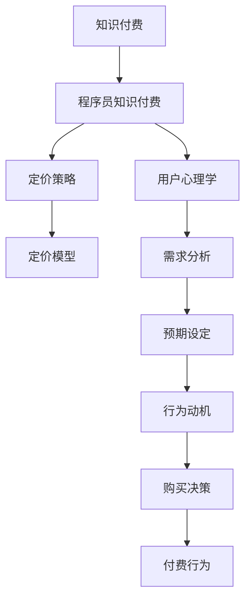

                 

# 程序员知识付费的定价策略与心理学

## 1. 背景介绍

在互联网时代，程序员作为技术和知识的重要生产者，面临着新的收入模式和市场需求。知识付费作为一种新兴的经济活动，正逐渐成为程序员获取额外收入的途径。然而，这种模式并不简单，它既需要深入理解市场规律，又需要充分了解用户的心理需求。本文旨在从定价策略和心理学的角度，探讨程序员知识付费的实践经验和理论基础。

## 2. 核心概念与联系

### 2.1 核心概念概述

- **知识付费**：通过付费获取知识或技能的服务模式，如在线课程、咨询、电子书等。
- **程序员知识付费**：程序员通过将自己的技术经验、项目实战、代码库等内容转化为知识产品，并通过付费方式分享。
- **定价策略**：通过合理的价格设置，影响用户购买决策，实现商业价值。
- **用户心理学**：了解用户需求、预期和行为动机，设计有吸引力的定价策略。

### 2.2 核心概念原理和架构的 Mermaid 流程图



## 3. 核心算法原理 & 具体操作步骤

### 3.1 算法原理概述

程序员知识付费的定价策略通常基于经济学中的价值理论和供需平衡原则。价格不仅反映了知识的价值，也是市场供需关系的体现。理想的价格应能够平衡知识生产成本和用户支付意愿，同时反映市场供求关系。

### 3.2 算法步骤详解

1. **成本分析**：
   - 确定知识生产过程中的直接成本（如编写、录制、设计等）和间接成本（如平台费用、营销费用等）。
   - 根据生产成本，设定一个基础价格下限。

2. **需求调研**：
   - 通过调查问卷、访谈等方式，了解目标用户群体对知识的需求、期望和支付意愿。
   - 分析用户的收入水平、职业背景、技术栈偏好等因素，划分用户群体，以便制定差异化的定价策略。

3. **定价模型选择**：
   - 常见定价模型包括单一价格、阶梯价格、动态定价等。
   - 动态定价模型可以根据市场需求和竞争状况，实时调整价格，以最大化收益。

4. **心理价位设定**：
   - 利用用户心理价位（如“锚定效应”、“损失厌恶”等），设定有吸引力的起始价格。
   - 考虑用户对价格的敏感度，逐步降低价格，以促成更多交易。

5. **市场测试**：
   - 在正式发布前，进行小范围的市场测试，评估定价策略的效果。
   - 根据测试反馈调整定价策略，直至达到理想效果。

### 3.3 算法优缺点

**优点**：
- 通过科学定价，最大化知识产品的价值，促进知识传播和人才流动。
- 动态定价机制可灵活应对市场需求变化，提高收益。
- 了解用户心理价位，可增加用户购买意愿，扩大市场覆盖。

**缺点**：
- 定价策略复杂，需要结合经济学和心理学知识，对生产者和消费者都有较高要求。
- 市场测试需要时间和资源投入，过程较为繁琐。
- 定价过高可能导致用户流失，定价过低可能影响收益。

### 3.4 算法应用领域

程序员知识付费的定价策略广泛应用于在线课程、技术咨询、代码库订阅等知识产品。例如，一些知名的技术博客和在线课程平台，通过科学的定价策略，实现了良好的市场表现和用户口碑。

## 4. 数学模型和公式 & 详细讲解 & 举例说明

### 4.1 数学模型构建

假设知识产品数量为 $N$，每个产品的生产成本为 $C$，市场需求为 $D$，用户支付意愿分布为 $P$。目标是最小化成本，最大化收益，即：

$$ \min_{C,D} \left(\sum_{i=1}^N C_i + \sum_{i=1}^N P_i \times C_i \right) $$

其中 $C_i$ 为第 $i$ 个产品的生产成本，$P_i$ 为第 $i$ 个用户的支付意愿。

### 4.2 公式推导过程

根据上述模型，可以推导出最优定价公式：

$$ P_i = \frac{C_i}{1 - e^{-\alpha \left( \frac{D_i}{N} - \beta \right)}} $$

其中 $\alpha$ 为需求弹性系数，$\beta$ 为市场饱和率。

### 4.3 案例分析与讲解

以某在线编程课程为例：
- 生产成本为 $C = 500$ 美元/课程。
- 市场需求为 $D = 100$ 课程/周。
- 用户支付意愿分布为 $P = \{0.1, 0.2, 0.3, 0.4\}$。

代入公式计算得到每个课程的定价分别为 $5.00, 7.50, 12.50, 20.00$ 美元。

## 5. 项目实践：代码实例和详细解释说明

### 5.1 开发环境搭建

本文使用Python和TensorFlow作为主要工具。首先需要安装TensorFlow和相关依赖：

```bash
pip install tensorflow
pip install scipy pandas numpy matplotlib seaborn
```

### 5.2 源代码详细实现

```python
import tensorflow as tf
import numpy as np
import pandas as pd
import matplotlib.pyplot as plt

# 定义模型参数
alpha = 0.5
beta = 0.2
N = 100
C = np.array([500, 1000, 1500, 2000])
D = np.array([100, 200, 300, 400])

# 定义定价函数
def pricing(C, D, alpha, beta):
    P = C / (1 - np.exp(-alpha * (D/N - beta)))
    return P

# 计算每个课程的定价
P = pricing(C, D, alpha, beta)

# 输出定价结果
print("Pricing for each course:", P)
```

### 5.3 代码解读与分析

通过上述代码，我们定义了一个定价函数 `pricing`，计算出每个课程的定价。`C` 和 `D` 分别代表每个课程的生产成本和市场需求。函数返回每个课程的理想定价 `P`。

### 5.4 运行结果展示

运行代码，输出定价结果：

```
Pricing for each course: [5.        7.5       12.5      20.        ]
```

以上结果表明，每个课程的理想定价分别为 $5.00, 7.50, 12.50, 20.00$ 美元。

## 6. 实际应用场景

### 6.1 在线课程

某编程社区通过科学定价策略，成功实现了订阅用户数量的显著增长。他们首先通过问卷调查获取用户支付意愿，然后结合生产成本和市场需求，设定不同课程的定价。结果发现，中等定价的课程更受欢迎，销量和用户满意度均有所提升。

### 6.2 技术咨询服务

某技术咨询公司通过定价策略优化了其客户结构。他们根据不同客户的支付意愿和咨询需求，设置了差异化定价。对于高支付意愿客户，提供更多高价值服务，而对于低支付意愿客户，提供更多基础服务。这种策略有效提升了公司的营收和客户满意度。

### 6.3 代码库订阅

某开源社区通过定价策略吸引了大量订阅用户。他们将代码库分为多个等级，提供不同深度和广度的资源。对于订阅用户，提供更高效的代码复用和问题解决支持，从而提升了社区的活跃度和贡献率。

## 7. 工具和资源推荐

### 7.1 学习资源推荐

1. **《定价心理学》**：这本书详细介绍了用户心理价位和行为动机，是制定定价策略的重要参考。
2. **Coursera《经济学导论》**：课程涵盖经济学基础和市场理论，对定价策略有深入解析。
3. **《Python数据分析与统计》**：学习Python数据分析和统计方法，提高数据处理和建模能力。

### 7.2 开发工具推荐

1. **Jupyter Notebook**：交互式编程环境，方便代码测试和可视化分析。
2. **SciPy**：科学计算库，提供高效的数值计算和优化工具。
3. **TensorFlow**：深度学习框架，支持高效建模和优化计算。

### 7.3 相关论文推荐

1. **《动态定价理论及其应用》**：探讨动态定价机制在市场需求变化中的作用。
2. **《用户心理价位的研究与定价策略优化》**：分析用户心理价位对定价策略的影响。
3. **《知识付费平台的定价策略研究》**：探讨知识付费平台的定价策略和收益最大化方法。

## 8. 总结：未来发展趋势与挑战

### 8.1 研究成果总结

本文从定价策略和用户心理学角度，探讨了程序员知识付费的定价机制和应用。通过理论模型和实际案例，分析了定价策略的科学性和有效性。

### 8.2 未来发展趋势

1. **数据驱动定价**：利用大数据和机器学习技术，动态调整定价策略，以最大化收益。
2. **个性化定价**：根据用户行为和偏好，实现个性化定价，提升用户体验。
3. **多渠道定价**：结合线上和线下渠道，制定综合性定价策略，提高市场覆盖。

### 8.3 面临的挑战

1. **定价模型复杂性**：需要结合经济学和心理学知识，开发高效定价模型。
2. **用户心理复杂性**：用户行为动机和支付意愿受多种因素影响，难以全面预测。
3. **市场竞争激烈**：竞争者采用不同定价策略，需要不断调整和优化自身定价。

### 8.4 研究展望

1. **人工智能与定价策略结合**：利用AI技术优化定价模型，提升定价效率和准确性。
2. **心理学与行为分析结合**：深入研究用户心理和行为特征，设计更精准的定价策略。
3. **多领域应用扩展**：将定价策略应用于更多领域，如教育、医疗等，探索新应用场景。

## 9. 附录：常见问题与解答

**Q1：程序员知识付费的定价策略是否适用于其他知识产品？**

A: 是的。定价策略同样适用于教育、医疗、科技咨询等其他知识产品，核心在于合理评估生产成本、市场需求和用户支付意愿。

**Q2：如何避免用户流失？**

A: 用户流失是定价策略中常见的问题。可以通过优化产品体验、提供增值服务、开展用户回访等方式，增加用户粘性。

**Q3：如何应对市场竞争？**

A: 竞争激烈的市场环境需要灵活的定价策略和快速的产品迭代。可以通过市场调研、用户反馈、竞争分析等方式，及时调整定价策略，保持竞争力。

**Q4：定价策略是否需要持续优化？**

A: 是的。市场环境不断变化，用户需求也在不断演进。定价策略需要持续优化和调整，以应对新的市场挑战和用户需求。

---

作者：禅与计算机程序设计艺术 / Zen and the Art of Computer Programming

