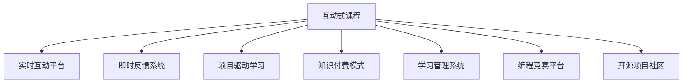

                 

# 程序员知识付费：打造互动式课程

> 关键词：知识付费, 互动式课程, 在线教育, 程序员培训, 技术社区, 人工智能教育, 学习管理系统, 编程竞赛, 开源项目, 教育技术创新

## 1. 背景介绍

### 1.1 问题由来
随着互联网技术的迅猛发展和数字化转型的加速，在线教育和知识付费市场迎来了爆发式增长。各类线上平台如雨后春笋般涌现，为人们提供便捷、高效的终身学习机会。然而，在知识付费的大潮中，传统的单向式内容交付模式逐渐显现出其局限性，难以满足学习者个性化、互动化的需求。因此，结合互动技术打造高质量、高效率的互动式课程，成为当前在线教育领域的一个重要方向。

在程序员培训这一细分领域，互动式课程也展现出巨大的市场潜力。计算机科学是一门高度实践性和交互性的学科，传统的视频课程和文本教程往往难以完全满足学习者的实践需求。互动式课程则能够通过实时互动、即时反馈等方式，帮助学习者更快地掌握编程技能，提升学习效果。此外，程序员社区如Stack Overflow、GitHub等也逐渐向知识付费转型，通过付费订阅和专属社区服务，进一步增强社区的凝聚力和活跃度。

### 1.2 问题核心关键点
互动式课程的核心关键点在于：

- **实时互动**：通过实时问答、代码评审、项目讨论等方式，增强学习者和讲师、同伴之间的互动，提升学习体验。
- **即时反馈**：及时对学习者的代码和答案进行评审和纠正，帮助其发现问题并加以改进。
- **实践导向**：课程设计以解决实际编程问题为核心，通过项目驱动、实战演练等方式，帮助学习者快速掌握编程技能。
- **社群协作**：构建学习者之间的社区和协作平台，促进知识共享、技能互鉴。
- **知识付费**：通过付费订阅、专属课程等方式，确保课程质量和社区成员的活跃参与度。

## 2. 核心概念与联系

### 2.1 核心概念概述

为更好地理解互动式课程的构建，本节将介绍几个密切相关的核心概念：

- **互动式课程**：结合视频讲解、实时问答、代码评审、项目讨论等互动元素，以提升学习效果和学生参与度的在线课程。
- **实时互动平台**：通过即时通讯工具、在线论坛、协作平台等技术手段，实现师生、同伴之间的实时交流和协作。
- **即时反馈系统**：利用自动评价、人工评审等方式，及时对学习者的作业、项目进行反馈和纠正，帮助其快速提升技能。
- **项目驱动学习**：通过设计具体的编程项目和任务，引导学习者通过实际操作解决问题，增强实战能力。
- **知识付费模式**：通过付费订阅、专属课程、会员服务等方式，确保课程内容的专业性和高质量，同时提高学习者的参与度。

- **学习管理系统(LMS)**：为课程设计、互动交流、作业评价提供支持的技术平台，常见的如Canvas、Moodle、Edmodo等。
- **编程竞赛平台**：为学习者提供实战演练和技能比拼的机会，常见的如Codeforces、LeetCode、TopCoder等。
- **开源项目社区**：通过参与开源项目，提升编程能力和团队协作能力，常见的如GitHub、SourceForge、Bitbucket等。

这些核心概念之间的逻辑关系可以通过以下Mermaid流程图来展示：



这个流程图展示了两大核心概念——互动式课程和互动技术平台之间的紧密联系。

## 3. 核心算法原理 & 具体操作步骤

### 3.1 算法原理概述

互动式课程的构建，本质上是一种基于算法驱动的教学模式，旨在通过互动技术增强学习效果。核心算法原理包括：

- **实时互动算法**：实现学习者与讲师、同伴之间的即时通讯、协作和讨论，如消息推送、语音视频会议等。
- **即时反馈算法**：利用自动化和人工化的方式，对学习者的作业、项目进行快速评价和纠正，如自动代码评审、人工评估等。
- **项目驱动算法**：设计具体的编程项目和任务，引导学习者通过实际操作解决问题，如敏捷开发、敏捷项目管理等。
- **知识付费算法**：通过付费订阅、专属课程等方式，确保课程内容的专业性和高质量，如会员制度、虚拟货币等。

这些算法共同构成了互动式课程的教学框架，通过互动技术提升学习效果，通过项目任务增强实战能力，通过付费模式保障课程质量。

### 3.2 算法步骤详解

基于算法原理的互动式课程构建步骤如下：

**Step 1: 设计课程内容和结构**

- 确定课程目标和预期成果，如掌握特定编程语言、解决特定类别的编程问题等。
- 将课程内容分为若干模块，每个模块设计具体的编程任务和项目。
- 确定每个任务所需的知识点和技能点，确保课程内容的系统性和连贯性。

**Step 2: 搭建实时互动平台**

- 选择合适的学习管理系统(LMS)，如Canvas、Moodle等，搭建课程平台。
- 设计并实施实时互动功能，如聊天室、讨论区、视频会议等，支持学习者与讲师、同伴之间的互动。
- 配置即时通讯工具，如Slack、Discord等，支持学习者之间的日常交流和协作。

**Step 3: 开发即时反馈系统**

- 根据课程内容，设计具体的编程任务和项目，确保每个任务都有明确的评价标准。
- 开发自动代码评审工具，如Github的Pull Request评审功能，支持学习者代码的自动评价和反馈。
- 配置人工评审流程，确保学习者的项目在提交后能够及时获得人工评审和反馈。

**Step 4: 实施项目驱动学习**

- 通过设计具体的编程项目和任务，引导学习者通过实际操作解决问题。
- 采用敏捷开发方法，如Scrum、Kanban等，确保项目进度和质量。
- 鼓励学习者参与开源项目，提升实战能力和团队协作能力。

**Step 5: 实现知识付费模式**

- 设计付费订阅和专属课程，确保课程内容的专业性和高质量。
- 实施会员制度，提供专属社区服务和技术支持，增强课程的吸引力。
- 采用虚拟货币等创新模式，激励学习者积极参与和贡献。

### 3.3 算法优缺点

互动式课程的构建，具有以下优点：

- **提升学习效果**：通过实时互动和即时反馈，增强学习者的参与感和动力，提升学习效果。
- **增强实战能力**：通过项目驱动学习，学习者能够通过实际操作解决实际问题，提升实战能力。
- **促进知识共享**：通过社区和开源项目，促进学习者之间的知识共享和技能互鉴。
- **保障课程质量**：通过知识付费模式，确保课程内容的专业性和高质量。

同时，互动式课程也存在一些缺点：

- **技术要求高**：搭建互动平台和即时反馈系统需要较高的技术投入，对开发团队的要求较高。
- **成本投入大**：互动平台和即时反馈系统的建设、维护需要较大的资金投入，课程开发成本较高。
- **灵活性不足**：固定的课程结构和项目设计，可能无法完全适应学习者的个性化需求。
- **学习自主性要求高**：互动式课程需要学习者具备较强的自我管理能力和自主学习能力，对学习者要求较高。

### 3.4 算法应用领域

互动式课程在多个领域得到了广泛应用，例如：

- **职业培训**：针对特定职业的技能培训，如软件开发、数据分析、人工智能等，通过互动课程提升职业技能。
- **在线教育**：各类在线平台提供的互动式课程，帮助学生提升学术成绩和实战能力。
- **企业培训**：通过互动式课程，提升企业员工的编程能力和协作能力。
- **编程竞赛**：结合互动式课程和编程竞赛平台，培养学习者的编程技能和竞赛心态。
- **开源社区**：通过参与开源项目和社区交流，提升学习者的实战能力和社区参与度。

## 4. 数学模型和公式 & 详细讲解 & 举例说明

### 4.1 数学模型构建

为更好地理解互动式课程的构建原理，本节将使用数学语言对互动式课程的教学框架进行更加严格的刻画。

假设课程内容包含 $N$ 个编程任务，每个任务 $i$ 对应的知识点为 $\mathcal{K}_i$，对应的难度为 $d_i \in [0, 1]$。学习者对每个任务的掌握程度为 $p_i \in [0, 1]$，其中 $p_i=1$ 表示完全掌握。

课程的总体目标是最大化学习者对所有任务的掌握程度，即最大化目标函数：

$$
\max_{p_1, p_2, \ldots, p_N} \sum_{i=1}^N w_i p_i
$$

其中 $w_i$ 为任务 $i$ 的权重，表示该任务在课程中的重要程度。

### 4.2 公式推导过程

根据目标函数，我们需要设计一系列的算法步骤，逐步提升学习者对每个任务的掌握程度。

**Step 1: 任务设计**

- 确定每个任务的知识点和难度，计算每个任务的目标权重 $w_i$。
- 根据学习者的实际情况，初始化每个任务的掌握程度 $p_i$。

**Step 2: 实时互动**

- 在学习过程中，通过实时互动平台，获取学习者的反馈和问题。
- 利用即时通讯工具和视频会议，支持学习者与讲师、同伴之间的互动交流。

**Step 3: 即时反馈**

- 对学习者的代码和项目进行自动评审和人工评审，生成即时反馈。
- 根据反馈结果，调整学习者的掌握程度 $p_i$。

**Step 4: 项目驱动**

- 设计具体的编程项目和任务，确保每个任务都有明确的评价标准。
- 采用敏捷开发方法，如Scrum、Kanban等，确保项目进度和质量。
- 鼓励学习者参与开源项目，提升实战能力和团队协作能力。

**Step 5: 知识付费**

- 设计付费订阅和专属课程，确保课程内容的专业性和高质量。
- 实施会员制度，提供专属社区服务和技术支持，增强课程的吸引力。
- 采用虚拟货币等创新模式，激励学习者积极参与和贡献。

通过上述步骤，可以逐步提升学习者对所有任务的掌握程度，实现课程目标。

### 4.3 案例分析与讲解

以下以一个简单的编程任务为例，展示互动式课程的设计和实施过程：

**任务描述**：设计一个简单的排序算法，对给定的数组进行升序排序。

**任务难度**：$w=0.8$

**知识点**：数组操作、排序算法

**Step 1: 任务设计**

- 确定任务的知识点和难度，计算任务的目标权重 $w=0.8$。
- 初始化学习者的掌握程度 $p=0.5$。

**Step 2: 实时互动**

- 在学习过程中，学习者可以在互动平台上提问，获得讲师的即时解答。
- 学习者之间可以讨论算法实现细节，进行代码评审，提升彼此的理解和协作能力。

**Step 3: 即时反馈**

- 学习者提交代码后，自动评审工具会自动检测代码正确性，给出评价和反馈。
- 学习者的项目在提交后，会获得人工评审和反馈，确保代码的质量和实现细节的准确性。

**Step 4: 项目驱动**

- 学习者需要设计一个排序算法，并实现具体的排序功能。
- 采用敏捷开发方法，逐步迭代和优化算法，确保排序的正确性和效率。
- 学习者可以将代码上传至GitHub，参与开源项目，获取社区反馈和支持。

**Step 5: 知识付费**

- 学习者可以通过付费订阅获得专属课程和社区服务，确保课程内容的专业性和高质量。
- 学习者通过完成项目和任务，积累虚拟货币，兑换专属权限和奖励，增强参与动力。

通过上述步骤，学习者能够逐步掌握排序算法的设计和实现，提升编程能力和实战能力。

## 5. 项目实践：代码实例和详细解释说明

### 5.1 开发环境搭建

在进行互动式课程的开发前，我们需要准备好开发环境。以下是使用Python进行Django开发的环境配置流程：

1. 安装Anaconda：从官网下载并安装Anaconda，用于创建独立的Python环境。

2. 创建并激活虚拟环境：
```bash
conda create -n django-env python=3.8 
conda activate django-env
```

3. 安装Django：使用pip安装Django框架：
```bash
pip install django
```

4. 安装必要的库：
```bash
pip install Pillow Django-crispy-forms django-rest-framework 
```

5. 安装数据库：
```bash
pip install psycopg2-binary
```

完成上述步骤后，即可在`django-env`环境中开始互动式课程的开发。

### 5.2 源代码详细实现

下面我们以一个简单的互动式课程为例，给出使用Django框架实现代码实现。

首先，创建Django项目和应用程序：

```bash
django-admin startproject interactivelogic
cd interactivelogic
python manage.py startapp courses
```

然后，定义课程模型和视图：

```python
# courses/models.py
from django.db import models

class Course(models.Model):
    name = models.CharField(max_length=255)
    description = models.TextField()
    tasks = models.ManyToManyField('Task')
    
class Task(models.Model):
    name = models.CharField(max_length=255)
    target = models.TextField()
    difficulty = models.DecimalField(max_digits=2, decimal_places=1)
    weight = models.DecimalField(max_digits=2, decimal_places=1)
    status = models.CharField(max_length=50, default='undone')
```

定义视图和表单：

```python
# courses/views.py
from django.shortcuts import render
from .models import Course, Task
from .forms import TaskForm
from django.contrib.auth.decorators import login_required

@login_required
def course_detail(request, pk):
    course = Course.objects.get(pk=pk)
    tasks = Task.objects.filter(course=course)
    return render(request, 'courses/course_detail.html', {'course': course, 'tasks': tasks})

@login_required
def task_create(request, pk):
    course = Course.objects.get(pk=pk)
    form = TaskForm(request.POST)
    if form.is_valid():
        task = form.save(commit=False)
        task.course = course
        task.save()
        return redirect('course_detail', pk=course.pk)
    return render(request, 'courses/task_create.html', {'form': form})
```

最后，定义表单和模板：

```python
# courses/forms.py
from django import forms
from .models import Task

class TaskForm(forms.ModelForm):
    class Meta:
        model = Task
        fields = ['name', 'target', 'difficulty', 'weight']
```

```python
# courses/templates/courses/course_detail.html



<h1>{{ course.name }}</h1>
<p>{{ course.description }}</p>
<h2>Tasks:</h2>
<ul>
    
        <li><a href="">{{ task.name }}</a></li>
    
</ul>
<form method="post">
    
    <input type="submit" value="Add Task">
</form>

```

```python
# courses/templates/courses/task_create.html



<h1>Add Task</h1>
<form method="post">
    
    {{ form.as_p }}
    <input type="submit" value="Save">
</form>

```

启动开发服务器，通过浏览器访问互动式课程页面：

```bash
python manage.py runserver
```

在`interactivelogic`目录下，访问`localhost:8000/courses/1`，即可看到课程详情和任务列表。点击“Add Task”，即可创建新任务。

通过上述步骤，我们可以使用Django框架构建一个简单的互动式课程系统。在实际开发中，还可以引入实时互动、即时反馈、项目驱动等更多功能，以提升课程的教学效果和学生体验。

### 5.3 代码解读与分析

让我们再详细解读一下关键代码的实现细节：

**Course和Task模型**：
- 定义了课程和任务两个模型，通过 ManyToManyField 关联。
- Course 模型包含课程名、描述、任务列表等信息。
- Task 模型包含任务名、目标、难度、权重、状态等信息。

**course_detail视图**：
- 获取指定课程和任务列表，渲染课程详情和任务列表。
- 支持用户创建新任务，跳转到任务详情页。

**task_create视图**：
- 显示表单，允许用户创建新任务。
- 表单包含任务名、目标、难度、权重等信息，保存后关联到指定课程。

**TaskForm表单**：
- 定义了任务的表单字段，如任务名、目标、难度、权重等。
- 使用 ModelForm 对任务模型进行封装，简化表单设计。

**course_detail模板**：
- 显示课程名、课程描述和任务列表。
- 支持用户添加新任务，跳转到任务创建页。

**task_create模板**：
- 显示任务创建表单，允许用户提交任务信息。
- 表单通过 as_p 方法渲染，方便用户填写和提交。

可以看到，通过Django框架和相应的Python代码，我们可以轻松构建一个互动式课程系统。开发者可以根据需求，灵活扩展和优化课程功能，实现更多的互动元素。

## 6. 实际应用场景

### 6.1 在线教育平台

互动式课程在在线教育平台中得到了广泛应用。传统的单向式课程往往难以满足学习者的互动需求，而互动式课程通过实时互动、即时反馈等方式，大大提升了学习效果和学生参与度。

例如，Coursera和Udacity等在线教育平台，已经引入了互动式课程，通过实时问答、代码评审、项目讨论等方式，增强学习者和讲师、同伴之间的互动，提升学习效果。

### 6.2 企业培训系统

在企业培训领域，互动式课程同样具有巨大的市场潜力。企业需要定期对员工进行技术培训，提升其编程能力和业务水平。传统的线下培训成本高、效率低，而互动式课程通过实时互动和即时反馈，能够显著提高培训效果和员工满意度。

例如，某大型科技公司开发了内部培训平台，通过互动式课程提升员工的技术能力和团队协作能力。平台支持实时问答、代码评审、项目讨论等功能，帮助员工快速掌握新技能。

### 6.3 开源社区

开源社区是互动式课程的重要应用场景之一。开源社区提供了丰富的技术交流和学习机会，通过参与互动式课程，学习者能够更快地掌握编程技能，提升实战能力。

例如，GitHub和Stack Overflow等社区，已经引入了互动式课程和编程竞赛，通过实时互动、即时反馈等方式，帮助学习者提升技术水平和社区参与度。

### 6.4 未来应用展望

随着互联网技术的持续发展和数字化转型的加速，互动式课程的应用前景将更加广阔。未来，互动式课程将在以下几个方面迎来新的突破：

- **跨平台应用**：通过Web、移动端等多种平台，实现跨设备、跨场景的互动式学习。
- **个性化推荐**：利用人工智能和大数据分析技术，实现个性化的课程推荐和学习路径规划。
- **实景融合**：将虚拟仿真和实际场景相结合，增强互动式课程的沉浸式体验。
- **多模态融合**：结合文本、音频、视频等多种模态信息，提升互动式课程的丰富度和互动效果。
- **全生命周期支持**：从课程设计、学习互动、项目实践、反馈评价等各个环节，提供全方位的支持和服务。

通过不断探索和创新，互动式课程必将在未来的在线教育领域大放异彩，成为推动教育技术创新的重要力量。

## 7. 工具和资源推荐

### 7.1 学习资源推荐

为了帮助开发者系统掌握互动式课程的构建原理和实践技巧，这里推荐一些优质的学习资源：

1. **《在线课程设计与开发》**：讲述在线课程设计的基本原则和具体实现方法，涵盖互动式课程的各个环节。

2. **Coursera和Udacity平台**：提供丰富的互动式课程资源，学习者可以通过平台学习实践，掌握编程技能和课程设计技巧。

3. **edX平台**：提供多种互动式课程，涵盖技术、医学、金融等多个领域，适合不同学习者的需求。

4. **《Python Web Development》**：讲解Web开发的基本原理和互动式课程的实现方法，适合有一定编程基础的学习者。

5. **《Django官方文档》**：详细介绍了Django框架的使用方法和互动式课程的开发流程，适合初学者和中级开发者。

通过对这些资源的学习实践，相信你一定能够快速掌握互动式课程的构建技巧，并用于解决实际的NLP问题。

### 7.2 开发工具推荐

高效的开发离不开优秀的工具支持。以下是几款用于互动式课程开发的常用工具：

1. **Django框架**：基于Python的Web开发框架，支持互动式课程的开发和部署，具有强大的社区支持和丰富的第三方库。

2. **TensorFlow和PyTorch**：深度学习框架，支持自动代码评审、即时反馈等互动元素，适合开发具有自动学习能力的互动式课程。

3. **Jupyter Notebook**：交互式计算环境，支持代码编写、数据处理、可视化等功能，适合进行互动式课程的设计和开发。

4. **Kaggle平台**：数据科学和机器学习竞赛平台，提供丰富的数据集和互动式课程，适合学习和实践数据科学算法。

5. **VS Code**：轻量级的代码编辑器，支持多种编程语言和开发工具，适合进行编程和互动式课程的开发。

合理利用这些工具，可以显著提升互动式课程的开发效率，加快创新迭代的步伐。

### 7.3 相关论文推荐

互动式课程的开发和应用，源于学界的持续研究。以下是几篇奠基性的相关论文，推荐阅读：

1. **《互动式学习：设计和评价》**：探讨互动式学习的理论基础和实践方法，提供互动式课程设计的系统性框架。

2. **《基于Web的互动式学习平台》**：介绍基于Web的互动式学习平台的开发流程和关键技术，提供互动式课程开发的实际案例。

3. **《编程教育中的互动式学习》**：分析互动式学习在编程教育中的应用效果，探讨互动式课程的设计和实施策略。

4. **《面向大数据的互动式学习研究》**：研究互动式学习在大数据环境下的应用，提供互动式课程设计的技术支持和实际案例。

5. **《虚拟仿真中的互动式学习》**：探讨虚拟仿真技术在互动式学习中的应用，提供实景融合和互动效果的改进方法。

这些论文代表了大语言模型微调技术的发展脉络。通过学习这些前沿成果，可以帮助研究者把握学科前进方向，激发更多的创新灵感。

## 8. 总结：未来发展趋势与挑战

### 8.1 总结

本文对互动式课程的构建原理和实现方法进行了全面系统的介绍。首先阐述了互动式课程的研究背景和意义，明确了互动式课程在在线教育和知识付费领域的独特价值。其次，从原理到实践，详细讲解了互动式课程的数学模型和算法步骤，给出了互动式课程开发的完整代码实例。同时，本文还广泛探讨了互动式课程在多个行业领域的应用前景，展示了互动式课程的广阔应用空间。

通过本文的系统梳理，可以看到，互动式课程的构建为NLP教育带来了新的可能，极大地提升了学习效果和学生参与度。面对未来，互动式课程的研究和应用还需要在多方面进行深入探索，不断提升课程的教学效果和用户体验。

### 8.2 未来发展趋势

展望未来，互动式课程的发展趋势包括：

- **技术创新**：通过引入新技术和新算法，不断提升互动式课程的教学效果和用户体验，如虚拟仿真、多模态融合、自适应学习等。
- **场景拓展**：拓展互动式课程的应用场景，从在线教育到企业培训、开源社区等，覆盖更多领域。
- **融合AI**：结合人工智能和大数据分析技术，实现个性化推荐、智能评估等功能，提升互动式课程的智能化水平。
- **生态建设**：构建互动式课程的生态系统，通过社区、平台、工具等资源，提供全方位的支持和服务。
- **标准化**：制定互动式课程的标准和规范，确保课程质量的一致性和可互操作性。

这些趋势凸显了互动式课程的研究和应用前景，预示着互动式课程将成为教育技术的重要组成部分，推动教育技术向更加智能化、个性化的方向发展。

### 8.3 面临的挑战

尽管互动式课程已经取得了一定的发展，但在迈向更加智能化、普适化应用的过程中，它仍面临着诸多挑战：

- **技术复杂性**：互动式课程的开发和维护需要较高的技术投入，对开发团队的要求较高。
- **数据依赖**：互动式课程的设计和评估依赖大量的数据，数据获取和处理需要较高的成本。
- **个性化不足**：固定的课程结构和任务设计，可能无法完全适应学习者的个性化需求。
- **用户接受度**：互动式课程需要学习者具备较强的自我管理能力和自主学习能力，部分用户可能难以适应。

### 8.4 研究展望

面对互动式课程面临的挑战，未来的研究需要在以下几个方面寻求新的突破：

- **技术简化**：开发更加用户友好的互动平台和工具，降低技术门槛，提升用户的接受度。
- **数据增强**：利用数据增强技术，提高互动式课程的数据质量和多样性，增强学习效果。
- **个性化提升**：采用自适应学习技术，根据学习者的实际情况，动态调整课程内容和难度，提升个性化学习体验。
- **生态融合**：构建互动式课程的生态系统，通过社区、平台、工具等资源，提供全方位的支持和服务。
- **标准化建设**：制定互动式课程的标准和规范，确保课程质量的一致性和可互操作性。

这些研究方向的探索，必将引领互动式课程技术迈向更高的台阶，为构建安全、可靠、可解释、可控的智能系统铺平道路。面向未来，互动式课程技术还需要与其他人工智能技术进行更深入的融合，如知识表示、因果推理、强化学习等，多路径协同发力，共同推动自然语言理解和智能交互系统的进步。只有勇于创新、敢于突破，才能不断拓展语言模型的边界，让智能技术更好地造福人类社会。

## 9. 附录：常见问题与解答

**Q1：互动式课程的优势是什么？**

A: 互动式课程的优势在于通过实时互动和即时反馈，增强学习者的参与感和动力，提升学习效果。通过项目驱动学习，学习者能够通过实际操作解决问题，提升实战能力。通过社区和开源项目，促进学习者之间的知识共享和技能互鉴。

**Q2：如何设计一个有效的互动式课程？**

A: 设计一个有效的互动式课程，需要考虑以下几个方面：
1. 明确课程目标和预期成果。
2. 将课程内容分为若干模块，每个模块设计具体的编程任务和项目。
3. 确定每个任务所需的知识点和技能点，确保课程内容的系统性和连贯性。
4. 通过实时互动平台，支持学习者与讲师、同伴之间的互动交流。
5. 利用即时反馈系统，对学习者的作业和项目进行快速评价和纠正。
6. 通过项目驱动学习，学习者能够通过实际操作解决问题，提升实战能力。
7. 引入知识付费模式，确保课程内容的专业性和高质量。

**Q3：互动式课程开发需要哪些技术支持？**

A: 互动式课程的开发需要以下技术支持：
1. Web开发框架，如Django、Flask等，支持课程的搭建和管理。
2. 实时互动平台，如聊天室、讨论区、视频会议等，支持学习者与讲师、同伴之间的互动交流。
3. 即时反馈系统，如自动代码评审、人工评审等，支持学习者的作业和项目快速评价和纠正。
4. 编程竞赛平台，如Codeforces、LeetCode等，支持学习者的实战演练和技能比拼。
5. 开源项目社区，如GitHub、SourceForge等，支持学习者的项目参与和技能互鉴。

**Q4：互动式课程的实际应用有哪些？**

A: 互动式课程在多个领域得到了广泛应用，例如：
1. 在线教育平台，如Coursera、Udacity等，提供丰富的互动式课程资源。
2. 企业培训系统，如某大型科技公司开发内部培训平台，提升员工的技术能力和团队协作能力。
3. 开源社区，如GitHub、Stack Overflow等，提供丰富的技术交流和学习机会。
4. 编程竞赛平台，如Codeforces、LeetCode等，提供实战演练和技能比拼的机会。

通过这些实际应用，互动式课程展示了其在不同领域的重要价值和广泛应用。

---

作者：禅与计算机程序设计艺术 / Zen and the Art of Computer Programming

