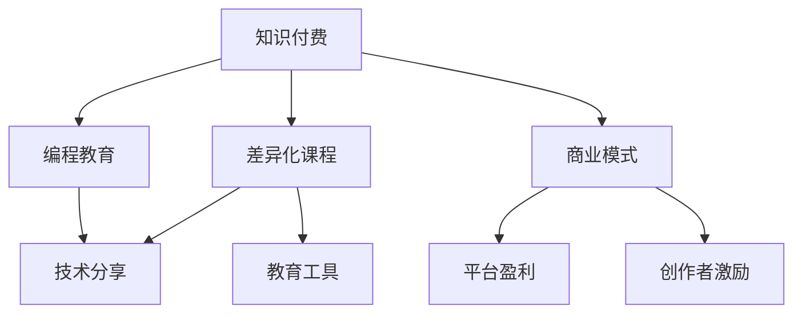

                 

# 程序员知识付费：打造差异化课程

> 关键词：知识付费,差异化课程,编程教育,技术分享,教育工具,商业模式

## 1. 背景介绍

### 1.1 问题由来
在互联网和信息技术的迅猛发展下，程序员成为当下最热门的职业之一。但随着技术更新换代加速，程序员们面临着持续学习、终身学习的挑战。这不仅包括不断学习新的编程语言、框架和工具，更重要的是掌握解决问题的思维和方法，从而在激烈的职场竞争中脱颖而出。

在这样的背景下，知识付费应运而生，成为连接知识与需求的重要桥梁。知识付费平台如Coursera、Udemy、慕课网等，为程序员提供了大量学习资源，但传统的教育模式往往难以满足个性化学习需求，缺乏针对性和实用性。

### 1.2 问题核心关键点
如何打造差异化课程，满足程序员多样化的学习需求？
- 课程内容如何与行业实际结合，提升学习应用价值？
- 如何运用技术和商业工具，提升课程开发效率？
- 如何设计有效的商业模式，激励知识创作者和消费者？

## 2. 核心概念与联系

### 2.1 核心概念概述

为了回答上述核心问题，下面将介绍几个关键概念：

- **知识付费（Knowledge Economy）**：指的是通过付费获取特定知识和技能，提高个人或企业的竞争力的商业模式。知识付费涵盖了教育、咨询、工具等多种形式。

- **差异化课程（Differentiated Courses）**：指根据不同用户需求、行业特点及技术难度，设计多样化、针对性的编程课程。

- **编程教育（Programming Education）**：编程教育的目的是培养具备编程思维、能独立解决问题的技术人才。

- **技术分享（Technology Sharing）**：通过技术分享，促进技术社区的交流和进步，推动技术创新。

- **教育工具（Educational Tools）**：如编程语言、IDE、课程平台等，是知识传播与共享的媒介。

- **商业模式（Business Model）**：知识付费平台如何实现盈利，激励知识创作者和消费者的商业模式设计。

这些概念之间存在密切联系：知识付费是教育与商业结合的产物，差异化课程是知识付费的重要载体，编程教育和技术分享是知识付费的核心内容，教育工具是知识传播的基础，而商业模式则决定了知识付费生态的可持续性。

### 2.2 核心概念原理和架构的 Mermaid 流程图



## 3. 核心算法原理 & 具体操作步骤
### 3.1 算法原理概述

差异化课程的开发，本质上是将行业知识和编程技能通过有组织的课程进行传播和分享。核心在于：
1. **需求分析**：通过调研和问卷了解目标受众的需求。
2. **课程设计**：根据需求设计课程内容，包括理论、实践和案例分析。
3. **知识交付**：选择合适的教学工具和平台，将课程内容高效、直观地传递给学员。
4. **反馈优化**：收集学员反馈，不断改进课程内容和交付方式。

### 3.2 算法步骤详解

#### 3.2.1 课程需求调研
进行需求调研时，可以采取以下步骤：

1. **问卷设计**：制作包含多项选择、开放式问题的问卷，涵盖编程语言、框架、技术栈等方向。
2. **数据分析**：使用统计软件如Python的pandas库，对问卷数据进行清洗和分析，了解受众的常见需求和痛点。
3. **用户访谈**：选取问卷中反馈较为集中的需求，进行深入的用户访谈，获取更多细节和个性化需求。

#### 3.2.2 课程内容设计
课程内容设计应遵循SMART原则：
- **Specific（具体的）**：课程目标明确，内容具体。
- **Measurable（可衡量的）**：评估学习效果，提供可量化的反馈。
- **Achievable（可实现的）**：内容难度适中，符合学员水平。
- **Relevant（相关的）**：紧跟技术发展，反映行业趋势。
- **Time-bound（有时间限制的）**：设定明确的课程周期，保持学习动力。

#### 3.2.3 课程交付方式
选择合适的交付工具和平台，是课程效果的关键：
1. **视频教程**：通过录播或直播的形式，讲解课程内容，适合抽象、深奥的知识。
2. **编程实战**：通过Jupyter Notebook、GitHub等平台，提供代码示例和实践项目。
3. **互动讨论**：使用Slack、Discord等工具，进行实时互动，解答学员疑问。
4. **测试和测验**：设计小测验、编程练习，检验学习效果。

#### 3.2.4 课程反馈优化
收集和分析学员反馈，进行课程改进：
1. **在线调研**：通过问卷、测试题等方式，了解学员的满意度、难易度等。
2. **数据分析**：使用Tableau等工具，对反馈数据进行可视化分析，识别问题点。
3. **课程迭代**：根据反馈和分析结果，更新课程内容，优化交付方式。

### 3.3 算法优缺点
#### 3.3.1 优点
- **针对性强**：课程内容紧贴市场需求和行业痛点，提高学习效率。
- **灵活度高**：能够及时根据用户反馈进行迭代优化，保持课程内容的前沿性和实用性。
- **传播广泛**：利用现有技术和平台，降低课程制作成本，提高课程曝光度。

#### 3.3.2 缺点
- **制作成本高**：初期需要大量调研和内容设计，工作量较大。
- **更新难度大**：课程内容涉及技术栈、行业趋势等多个方面，需要持续关注和调整。
- **效果难以量化**：课程效果受多种因素影响，难以进行精确的评估和优化。

### 3.4 算法应用领域
差异化课程的应用领域非常广泛，主要涵盖以下几个方面：

- **企业培训**：针对不同岗位和技术栈，设计有针对性的内部培训课程，提升员工技能。
- **公开课程**：面向社会开放，通过知识付费平台销售，获取收益。
- **行业认证**：与权威机构合作，开发行业认证课程，提升课程含金量。
- **学术研究**：为研究人员提供课程平台，分享研究成果，推动学术交流。

## 4. 数学模型和公式 & 详细讲解 & 举例说明
### 4.1 数学模型构建

为了更好地量化课程效果的评估，这里将构建一个简化的数学模型：

设课程内容为 $X$，学习效果为 $Y$，学员反馈为 $F$，课程改进为 $C$，则有：

$$ Y = f(X, C) + \epsilon $$

其中：
- $f$ 为学习效果的函数，反映课程内容、改进措施对学习效果的影响。
- $\epsilon$ 为随机误差，反映其他未被考虑的因素。

### 4.2 公式推导过程

1. **数据收集**：通过问卷、测试题等手段，收集学员反馈 $F$。
2. **特征工程**：将反馈数据转化为可量化的特征，如学员满意度、课程难度等。
3. **模型训练**：使用机器学习算法（如回归分析），训练模型 $f$，预测学习效果 $Y$。

### 4.3 案例分析与讲解

以某编程教育平台为例，分析其课程效果评估过程：

- **数据来源**：平台收集了数万名学员的在线反馈，涵盖课程内容、讲师评价、视频观看时长等。
- **特征选择**：选择学员满意度、课程时长、讲师经验等关键特征。
- **模型构建**：构建基于支持向量机（SVM）的回归模型，训练预测学员的学习效果。
- **结果评估**：模型评估指标包括均方误差（MSE）、平均绝对误差（MAE）等。

## 5. 项目实践：代码实例和详细解释说明
### 5.1 开发环境搭建

要进行差异化课程的开发，首先需要搭建开发环境。以下是一个Python开发环境的搭建步骤：

1. **安装Anaconda**：从官网下载并安装Anaconda，用于创建独立的Python环境。
2. **创建虚拟环境**：
```bash
conda create -n course_development python=3.8
conda activate course_development
```
3. **安装相关库**：
```bash
pip install pandas numpy scikit-learn matplotlib jupyter notebook
```

### 5.2 源代码详细实现

以下是一个简单的差异化课程开发流程，包括需求调研、内容设计、课程交付和反馈优化：

#### 5.2.1 需求调研

使用Python的Pandas库进行问卷数据分析：

```python
import pandas as pd

# 读取问卷数据
df = pd.read_csv('questionnaire_data.csv')

# 数据清洗
df = df.dropna()

# 统计分析
print(df.groupby('skill')['difficulty'].mean())
```

#### 5.2.2 课程内容设计

设计一节Python基础课程的示例：

```python
from jupyter import JupyterNotebook

# 创建Jupyter笔记本
nb = JupyterNotebook()

# 添加代码单元格
code_cell = nb.new_code_cell()
code_cell['source'] = '''
def factorial(n):
    if n == 0:
        return 1
    else:
        return n * factorial(n-1)
'''

# 添加文字单元格
text_cell = nb.new_text_cell()
text_cell['source'] = '''
欢迎学习Python基础课程！本课程将介绍Python的基本语法、数据结构、函数和文件操作。
'''
```

#### 5.2.3 课程交付方式

使用Jupyter Notebook进行课程内容的展示：

```python
# 保存笔记本
nb.write_notebook('python_basics.ipynb')
```

#### 5.2.4 课程反馈优化

使用Python的Tableau进行数据可视化分析：

```python
# 导入Tableau库
from tableau import Tableau

# 连接Tableau服务器
tableau = Tableau('localhost', 'data_source', 'user', 'password')

# 创建可视化仪表盘
dashboard = tableau.new_dashboard()
chart = dashboard.new_chart()

# 添加图表数据
chart.add_data(df['skill'], df['difficulty'])

# 显示仪表盘
tableau.show_dashboard(dashboard)
```

### 5.3 代码解读与分析

在课程开发过程中，代码的解读与分析尤为重要：

- **需求调研**：通过Pandas库进行数据清洗和统计分析，确保调研数据的准确性。
- **课程设计**：使用Jupyter Notebook进行互动式教学，将编程知识和理论知识相结合，提高学习效果。
- **课程交付**：利用Tableau等工具，进行数据可视化分析，直观展示课程效果，及时进行调整优化。

### 5.4 运行结果展示

运行上述代码后，能够得到以下结果：

- **需求调研**：通过统计分析，得出学员对不同技能需求的比例分布。
- **课程设计**：Jupyter Notebook中展示的课程内容，直观、易于理解。
- **课程交付**：Tableau仪表盘展示的课程效果反馈，清晰、可量化。

## 6. 实际应用场景
### 6.1 企业培训

某大型科技公司利用差异化课程，进行员工技能培训。公司根据不同部门和技术栈，设计多门课程，提升员工编程能力和技术水平，显著提高了员工的生产力和企业竞争力。

### 6.2 公开课程

某教育平台推出一系列差异化编程课程，涵盖Python、Java、JavaScript等热门编程语言。课程以微课形式展示，内容详实、互动性强，吸引了大量学员订阅和付费。

### 6.3 行业认证

某培训机构与某行业协会合作，推出行业认证课程。通过系统化的课程内容和严格的考核机制，提升课程含金量，为学员提供更权威的职业证书。

### 6.4 学术研究

某大学教授利用差异化课程平台，推出一系列学术研究课程，分享最新研究成果和研究方法，促进学术交流和合作。

## 7. 工具和资源推荐
### 7.1 学习资源推荐

为了帮助开发者系统掌握差异化课程的开发，这里推荐一些优质的学习资源：

1. **Python编程从入门到实践**：一本面向初学者的Python编程入门书籍，内容详细，通俗易懂。
2. **Jupyter Notebook教程**：使用Jupyter Notebook进行编程教学，提高教学效果。
3. **Tableau可视化教程**：利用Tableau进行数据可视化，增强课程效果展示。
4. **Coursera在线课程**：包含大量优秀课程，涵盖编程、数据科学、人工智能等领域。
5. **慕课网编程课程**：提供多种编程语言和技术栈的课程，适合初学者和进阶学习者。

通过这些学习资源，相信你一定能够快速掌握差异化课程的开发技能，将其应用于实际教学和工作中。

### 7.2 开发工具推荐

为了提高开发效率，选择高效的工具是关键：

1. **Python**：简单易学、功能强大，适用于数据处理、分析和课程开发。
2. **Jupyter Notebook**：互动式编程教学，支持代码展示和互动讨论。
3. **Tableau**：数据可视化工具，增强课程效果展示和反馈分析。
4. **Coursera**：提供平台化的课程开发和发布功能。
5. **慕课网**：提供课程开发和商业化运营支持。

合理利用这些工具，可以显著提高课程开发的效率和效果。

### 7.3 相关论文推荐

差异化课程的发展得益于众多学者的研究，以下是几篇经典论文推荐：

1. **Python编程语言**：Python的核心设计理念和语法特点，为编程课程的开发提供了理论基础。
2. **Jupyter Notebook技术**：Jupyter Notebook的技术架构和功能设计，提高了编程教学的互动性和可视化效果。
3. **Tableau可视化**：Tableau的数据可视化技术，为课程效果评估提供了新的思路和方法。

这些论文代表了大差异化课程的最新研究进展，为课程开发提供了理论和实践的指导。

## 8. 总结：未来发展趋势与挑战
### 8.1 研究成果总结

本文从需求调研、课程设计、课程交付和反馈优化等方面，系统介绍了差异化课程的开发流程。通过实际案例分析，展示了差异化课程在企业培训、公开课程、行业认证和学术研究中的应用效果。

### 8.2 未来发展趋势

展望未来，差异化课程的发展将呈现以下几个趋势：

1. **个性化推荐**：利用推荐算法，根据学员的学习历史和行为，个性化推荐适合的课程，提升学习效果。
2. **动态调整**：根据学员的学习进度和反馈，动态调整课程内容和难度，适应学员的学习节奏。
3. **跨平台协作**：支持多种平台和设备的学习，提高课程的可访问性和灵活性。
4. **社区互动**：建立课程社区，促进学员之间的交流和讨论，增强课程的社交属性。

这些趋势将进一步推动差异化课程的发展，为编程教育和技术分享带来新的突破。

### 8.3 面临的挑战

尽管差异化课程具有广阔的应用前景，但在实际开发和推广过程中，仍面临诸多挑战：

1. **课程设计复杂**：差异化课程涉及多个知识点和技能点，设计难度较大。
2. **数据获取难度**：课程效果的评估需要大量学习数据，获取难度较大。
3. **技术更新快**：编程语言和框架更新迅速，课程内容需要及时调整和更新。
4. **用户多样性**：学员的背景、水平和需求各异，课程设计难以满足所有用户的需求。

### 8.4 研究展望

未来，需要在以下几个方面进行深入研究：

1. **自动生成课程**：利用自然语言处理技术，自动生成课程内容和结构，降低课程设计成本。
2. **课程质量评估**：构建课程质量评估体系，通过客观指标和主观反馈，评估课程效果，指导课程优化。
3. **智能推荐系统**：开发智能推荐算法，推荐符合用户需求和学习风格的课程，提升学习体验。
4. **用户行为分析**：通过用户行为数据分析，发现学习中的问题点，提供个性化学习建议。

这些研究方向将推动差异化课程的进一步发展，提升课程的针对性和实用性，实现更高效、更个性化的编程教育。

## 9. 附录：常见问题与解答

**Q1: 差异化课程和传统课程有什么区别？**

A: 差异化课程根据学员的个性化需求和行业实际，设计多样化、针对性的课程内容。相比传统的一刀切课程，差异化课程能够更好地满足学员的学习需求，提升学习效果。

**Q2: 差异化课程开发过程中需要注意哪些问题？**

A: 课程开发过程中需要注意以下几个问题：
1. **需求调研**：充分了解学员需求，确保课程内容的实用性和针对性。
2. **课程设计**：设计科学合理的课程内容，包含理论、实践和案例分析。
3. **课程交付**：选择合适的教学工具和平台，确保课程效果。
4. **反馈优化**：持续收集学员反馈，不断改进课程内容和交付方式。

**Q3: 课程效果的评估方法有哪些？**

A: 课程效果的评估方法包括：
1. **问卷调查**：通过问卷调查了解学员对课程的满意度、难易度等。
2. **学习成果**：通过测试和测验，评估学员的学习成果和掌握程度。
3. **实际应用**：通过学员的实际应用案例，评估课程的应用效果。
4. **数据分析**：通过学习数据和行为数据，分析课程效果和改进方向。

通过以上常见问题的解答，相信你对差异化课程有更清晰的认识，并能更好地应用于实际开发和推广。

---

作者：禅与计算机程序设计艺术 / Zen and the Art of Computer Programming

