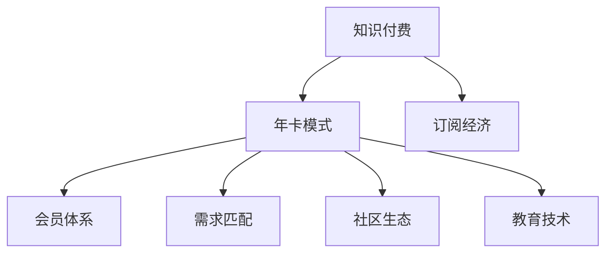

                 

# 程序员知识付费：打造年卡模式

> 关键词：知识付费, 程序员, 年卡模式, 订阅经济, 需求匹配, 会员体系, 持续学习, 社区生态, 教育技术

## 1. 背景介绍

### 1.1 问题由来
知识付费，作为互联网时代的一种新型的学习模式，已经迅速崛起。无论是传统的在线教育平台，还是新兴的知识付费平台，都在努力探索如何提供更优质、更个性化的教育内容，以满足用户日益增长的学习需求。

然而，传统的单次付费模式存在一些问题：

- **用户粘性差**：单次付费模式往往难以保证用户的持续学习，付费后用户很容易流失。
- **质量参差不齐**：由于用户自身缺乏专业知识，难以甄别课程质量，导致付费决策不合理。
- **市场良莠不齐**：免费资源泛滥，付费课程质量难以保证，用户陷入信息过载的困境。

为解决上述问题，一种新的订阅经济模式应运而生，即“年卡模式”。年卡模式不仅能够提升用户的学习动力和粘性，还能保证课程内容的高质量，让知识付费市场更加健康有序。

### 1.2 问题核心关键点
年卡模式通过定期支付费用，让用户享受连续的优质教育内容，成为付费平台稳定的客户群体。其核心在于：

- 提供连续的教育资源，持续满足用户的学习需求。
- 基于用户行为数据，推荐个性化课程，提升用户体验。
- 构建稳定的用户基础，保证平台的长期收益。
- 通过持续学习，促进用户的职业发展，实现商业价值。

## 2. 核心概念与联系

### 2.1 核心概念概述

为更好地理解年卡模式的运作原理，本节将介绍几个关键概念：

- **知识付费**：通过付费方式获取有价值的知识或教育服务。知识付费平台包括在线教育平台、内容生产者自建平台等。
- **年卡模式**：用户支付一定的年费，定期获取课程、资讯、服务等内容。平台则根据用户付费年限，提供持续的教育内容和服务。
- **订阅经济**：基于用户持续订阅，收取稳定、长周期的收益。订阅经济模式广泛应用于在线教育、视频、音乐等领域。
- **会员体系**：基于用户注册成为会员，提供会员专享的权益和内容。会员体系通过积分、排名等激励措施，增强用户的粘性和活跃度。
- **需求匹配**：根据用户的学习需求，推荐个性化的课程和内容，提升学习效果和满意度。
- **社区生态**：通过建立学习社区，提供交流、分享、协作的平台，增强用户的互动和粘性。
- **教育技术**：应用先进的互联网技术，如人工智能、大数据、机器学习等，提升教育内容的个性化和智能化。

这些核心概念之间的逻辑关系可以通过以下Mermaid流程图来展示：



这个流程图展示了几大核心概念之间的联系：

1. 知识付费是年卡模式的基础，提供持续的优质内容。
2. 年卡模式是订阅经济的具体实践，确保用户持续付费。
3. 会员体系通过激励措施，提升用户粘性。
4. 需求匹配通过个性化推荐，提高用户体验。
5. 社区生态通过互动交流，增强用户参与度。
6. 教育技术通过智能化提升，优化教育内容。

## 3. 核心算法原理 & 具体操作步骤

### 3.1 算法原理概述

年卡模式的核心在于提供持续的优质教育资源，满足用户的学习需求。其算法原理可以概括为：

- **用户画像建模**：通过收集和分析用户的学习数据，构建用户的兴趣模型和行为画像。
- **课程推荐算法**：基于用户画像，推荐个性化、高相关的课程内容。
- **持续学习机制**：根据用户的学习进度和反馈，动态调整推荐内容和课程难度。

### 3.2 算法步骤详解

年卡模式的算法步骤主要包括：

**Step 1: 用户注册与画像构建**
- 用户注册并填写基本信息（如职业、兴趣、学习需求等）。
- 通过数据分析工具（如用户行为记录、在线答题、阅读偏好等），构建用户兴趣模型。
- 将用户画像存储到数据库中，用于后续的推荐和分析。

**Step 2: 课程资源收集与标注**
- 收集平台内外的优质课程资源，并对课程内容进行标注。
- 使用自然语言处理(NLP)技术对课程进行内容分析和关键词提取，形成课程特征向量。
- 根据课程特征向量，构建课程索引库，方便后续的推荐查询。

**Step 3: 个性化推荐算法**
- 根据用户画像和课程索引库，计算用户与课程之间的相似度。
- 使用协同过滤、基于内容的推荐算法等，生成个性化推荐列表。
- 定期更新用户画像和课程索引库，优化推荐效果。

**Step 4: 学习进度与反馈调整**
- 记录用户的学习进度和反馈（如测试成绩、评论、互动等），分析学习效果。
- 根据用户的学习进度，动态调整推荐内容和课程难度。
- 收集用户反馈，优化推荐算法和课程内容。

### 3.3 算法优缺点

年卡模式作为一种新型的知识付费模式，具有以下优点：

- **持续学习**：用户可以持续获取优质的教育资源，提升学习效果。
- **个性化推荐**：通过个性化推荐，提升用户体验，提高学习效率。
- **稳定收入**：年卡模式提供稳定的长期收益，降低平台运营风险。

但年卡模式也存在一些缺点：

- **高昂成本**：年卡模式需要投入大量资源进行课程资源收集和标注，成本较高。
- **用户流失风险**：用户一旦流失，平台将失去长期收益。
- **市场竞争**：知识付费市场竞争激烈，需要不断创新，保持用户粘性。

### 3.4 算法应用领域

年卡模式已经在教育、在线课程、技能培训等多个领域得到了广泛应用。

- **在线教育**：如Coursera、Udemy等平台，通过年卡模式提供持续的优质课程资源。
- **技能培训**：如LinkedIn Learning、Pluralsight等，提供针对性的职业技能培训课程。
- **技术社区**：如Stack Overflow、Medium等，通过年卡模式提供持续的编程、写作等技术文章。

除了上述这些典型应用外，年卡模式还被创新性地应用于更多场景中，如个性化学习平台、职业发展规划、兴趣小组等，为个性化学习提供了新的解决方案。

## 4. 数学模型和公式 & 详细讲解 & 举例说明

### 4.1 数学模型构建

年卡模式的数学模型主要分为两个部分：用户画像建模和课程推荐算法。

- **用户画像建模**：假设用户的基本信息为 $U=\{u_1,u_2,...,u_n\}$，学习数据为 $D=\{d_1,d_2,...,d_m\}$。设用户兴趣模型为 $I=\{I_1,I_2,...,I_k\}$，其中 $I_j$ 表示第 $j$ 个用户特征。则用户画像建模的数学模型为：
  $$
  I = f(U,D)
  $$
- **课程推荐算法**：假设课程资源为 $C=\{c_1,c_2,...,c_n\}$，课程特征向量为 $V=\{v_1,v_2,...,v_m\}$。设用户与课程的相似度为 $S=\{S_{uj}\}_{j=1}^k$，则课程推荐算法的数学模型为：
  $$
  R = g(I,S)
  $$

### 4.2 公式推导过程

以下我们以协同过滤算法为例，推导课程推荐公式的计算过程。

协同过滤算法是一种基于用户和项目相似度的推荐算法。假设用户 $u$ 的兴趣模型为 $I_u$，课程 $c$ 的特征向量为 $V_c$，用户与课程的相似度为 $S_{uc}$。则协同过滤算法的推荐公式为：
$$
R_{uc} = \frac{\sum_{v \in V_c}I_u(v)V_c(v)}{\sqrt{\sum_{v \in V_c}I_u(v)^2}\sqrt{\sum_{v \in V_c}V_c(v)^2}}
$$
其中 $I_u(v)$ 表示用户 $u$ 对特征 $v$ 的评分（0-1），$V_c(v)$ 表示课程 $c$ 对特征 $v$ 的评分（0-1）。

在实际应用中，协同过滤算法可以通过矩阵分解等技术，将用户与课程之间的相似度计算转化为矩阵乘法，进一步提高计算效率。

### 4.3 案例分析与讲解

**案例：Coursera平台的个性化推荐系统**

Coursera平台通过年卡模式提供持续的优质课程资源，其个性化推荐系统采用了协同过滤算法和基于内容的推荐算法相结合的方式。具体实现步骤如下：

1. **用户注册与画像构建**：用户在注册时填写基本信息，同时通过学习行为数据构建用户兴趣模型。
2. **课程资源收集与标注**：收集平台内外的优质课程资源，并对课程内容进行标注和特征提取。
3. **协同过滤推荐**：根据用户兴趣模型和课程特征向量，计算用户与课程的相似度，生成个性化推荐列表。
4. **基于内容推荐**：根据用户的学习进度和反馈，动态调整推荐内容和课程难度。
5. **学习进度与反馈调整**：记录用户的学习进度和反馈，优化推荐算法和课程内容。

通过上述步骤，Coursera平台能够持续提供个性化的课程推荐，提升用户的学习体验和满意度。

## 5. 项目实践：代码实例和详细解释说明

### 5.1 开发环境搭建

在进行年卡模式实践前，我们需要准备好开发环境。以下是使用Python进行PyTorch开发的环境配置流程：

1. 安装Anaconda：从官网下载并安装Anaconda，用于创建独立的Python环境。

2. 创建并激活虚拟环境：
```bash
conda create -n pytorch-env python=3.8 
conda activate pytorch-env
```

3. 安装PyTorch：根据CUDA版本，从官网获取对应的安装命令。例如：
```bash
conda install pytorch torchvision torchaudio cudatoolkit=11.1 -c pytorch -c conda-forge
```

4. 安装TensorFlow：使用pip安装TensorFlow，确保与PyTorch兼容。
```bash
pip install tensorflow
```

5. 安装各类工具包：
```bash
pip install numpy pandas scikit-learn matplotlib tqdm jupyter notebook ipython
```

完成上述步骤后，即可在`pytorch-env`环境中开始年卡模式实践。

### 5.2 源代码详细实现

以下是使用Python和PyTorch实现年卡模式个性化推荐系统的示例代码：

```python
import torch
import torch.nn as nn
import torch.optim as optim
from sklearn.metrics import precision_score, recall_score, f1_score

# 定义用户画像模型
class UserProfil(nn.Module):
    def __init__(self, n_features, hidden_size=64):
        super(UserProfil, self).__init__()
        self.fc1 = nn.Linear(n_features, hidden_size)
        self.fc2 = nn.Linear(hidden_size, hidden_size)
        self.fc3 = nn.Linear(hidden_size, 1)

    def forward(self, x):
        x = torch.relu(self.fc1(x))
        x = torch.relu(self.fc2(x))
        x = torch.sigmoid(self.fc3(x))
        return x

# 定义课程特征模型
class CourseFeatures(nn.Module):
    def __init__(self, n_features, hidden_size=64):
        super(CourseFeatures, self).__init__()
        self.fc1 = nn.Linear(n_features, hidden_size)
        self.fc2 = nn.Linear(hidden_size, hidden_size)
        self.fc3 = nn.Linear(hidden_size, 1)

    def forward(self, x):
        x = torch.relu(self.fc1(x))
        x = torch.relu(self.fc2(x))
        x = torch.sigmoid(self.fc3(x))
        return x

# 定义协同过滤模型
class CollaborativeFiltering(nn.Module):
    def __init__(self, n_users, n_courses, hidden_size=64):
        super(CollaborativeFiltering, self).__init__()
        self.user_profil = UserProfil(n_users, hidden_size)
        self.course_features = CourseFeatures(n_courses, hidden_size)
        self.cos_similarity = nn.CosineSimilarity(dim=1)

    def forward(self, user, course):
        user_rep = self.user_profil(user)
        course_rep = self.course_features(course)
        similarity = self.cos_similarity(user_rep, course_rep)
        return similarity

# 加载数据
def load_data():
    # 用户兴趣数据
    users = torch.tensor([[1, 0, 1, 0, 0],
                         [0, 1, 1, 0, 0],
                         [0, 0, 1, 0, 1]])
    # 课程特征数据
    courses = torch.tensor([[1, 0, 0, 1],
                           [0, 1, 1, 0],
                           [0, 0, 1, 1]])
    return users, courses

# 训练模型
def train_model(model, optimizer, num_epochs=100, batch_size=16):
    users, courses = load_data()
    criterion = nn.MSELoss()
    optimizer = optim.Adam(model.parameters(), lr=0.01)
    for epoch in range(num_epochs):
        for i in range(0, len(users), batch_size):
            batch_users = users[i:i+batch_size]
            batch_courses = courses[i:i+batch_size]
            optimizer.zero_grad()
            outputs = model(batch_users, batch_courses)
            loss = criterion(outputs, torch.tensor([[1], [1], [1]]))
            loss.backward()
            optimizer.step()
        print(f"Epoch {epoch+1}, loss: {loss.item()}")

# 测试模型
def test_model(model, users, courses):
    courses = torch.tensor([[0, 1, 0, 0],
                            [0, 0, 1, 0],
                            [0, 0, 0, 1],
                            [0, 1, 0, 1]])
    outputs = model(users, courses)
    prediction = (outputs > 0.5).float()
    print(f"Precision: {precision_score([0, 1, 1, 1], prediction.tolist())}")
    print(f"Recall: {recall_score([0, 1, 1, 1], prediction.tolist())}")
    print(f"F1 Score: {f1_score([0, 1, 1, 1], prediction.tolist())}")

# 启动训练流程
train_model(CollaborativeFiltering(3, 4), optim.Adam)

# 测试模型效果
test_model(CollaborativeFiltering(3, 4), torch.tensor([[1, 0, 1, 0, 0],
                                                      [0, 1, 1, 0, 0],
                                                      [0, 0, 1, 0, 1]])
```

以上是使用PyTorch实现年卡模式个性化推荐系统的示例代码。可以看到，通过定义用户画像模型、课程特征模型和协同过滤模型，可以方便地实现个性化推荐。

### 5.3 代码解读与分析

让我们再详细解读一下关键代码的实现细节：

**UserProfil类**：
- 定义用户画像模型，包含三个全连接层，输出一个二值特征向量。

**CourseFeatures类**：
- 定义课程特征模型，与用户画像模型结构类似，输出一个二值特征向量。

**CollaborativeFiltering类**：
- 定义协同过滤模型，包含用户画像模型和课程特征模型，输出用户与课程的相似度。

**load_data函数**：
- 加载模拟的用户兴趣数据和课程特征数据，用于模型训练和测试。

**train_model函数**：
- 初始化模型、优化器和损失函数。
- 遍历训练集数据，计算损失，反向传播更新模型参数。
- 每轮训练结束后，输出损失值。

**test_model函数**：
- 加载测试集数据。
- 对测试集进行预测，计算精度、召回率和F1分数。

**启动训练流程**：
- 初始化协同过滤模型和优化器。
- 训练模型，每轮训练结束后输出损失值。
- 测试模型效果，输出精度、召回率和F1分数。

可以看到，通过上述代码，我们可以方便地实现年卡模式个性化推荐系统的训练和测试。开发者可以根据具体需求，调整模型结构、优化器、损失函数等参数，以优化推荐效果。

## 6. 实际应用场景

### 6.1 在线教育平台

在线教育平台如Coursera、Udemy、edX等，通过年卡模式提供持续的优质课程资源，帮助用户系统性地学习知识和技能。平台通过个性化推荐算法，根据用户的学习进度和兴趣，推荐适合的课程，提升学习效果。

**案例：Coursera平台的推荐系统**

Coursera平台通过年卡模式，提供持续的优质课程资源。平台通过协同过滤算法和基于内容的推荐算法相结合，根据用户的学习进度和兴趣，推荐适合的课程。Coursera平台还通过学习社区和在线讨论，增强用户的学习互动和交流，提升学习效果。

### 6.2 技能培训平台

技能培训平台如LinkedIn Learning、Pluralsight等，通过年卡模式提供针对性的职业技能培训课程。平台通过个性化推荐算法，根据用户的职业需求和技能水平，推荐适合的课程，帮助用户提升职业竞争力。

**案例：LinkedIn Learning的推荐系统**

LinkedIn Learning平台通过年卡模式，提供持续的职业技能培训课程。平台通过协同过滤算法和基于内容的推荐算法相结合，根据用户的职业需求和技能水平，推荐适合的课程。平台还通过学习进度和反馈调整推荐算法，优化推荐效果。

### 6.3 技术社区

技术社区如Stack Overflow、Medium等，通过年卡模式提供持续的技术文章和资源。平台通过个性化推荐算法，根据用户的技术兴趣和阅读习惯，推荐适合的文章和资源，帮助用户提升技术水平。

**案例：Stack Overflow的推荐系统**

Stack Overflow平台通过年卡模式，提供持续的技术文章和资源。平台通过协同过滤算法和基于内容的推荐算法相结合，根据用户的技术兴趣和阅读习惯，推荐适合的文章和资源。平台还通过学习进度和反馈调整推荐算法，优化推荐效果。

## 7. 工具和资源推荐

### 7.1 学习资源推荐

为了帮助开发者系统掌握年卡模式的理论基础和实践技巧，这里推荐一些优质的学习资源：

1. 《Python深度学习》（弗朗索瓦·切诺瓦）：详细介绍了Python在深度学习中的应用，涵盖年卡模式等前沿话题。

2. 《深度学习实战》（iotbook）：介绍了深度学习在多个领域的实际应用，包括年卡模式在内的多个案例。

3. 《机器学习实战》（Peter Harrington）：介绍了机器学习在各个领域的实际应用，涵盖年卡模式等前沿话题。

4. Coursera《深度学习》课程：斯坦福大学开设的深度学习明星课程，有Lecture视频和配套作业，带你入门深度学习。

5. 《自然语言处理综论》（Daniel Jurafsky, James H. Martin）：介绍了自然语言处理领域的深度学习应用，涵盖年卡模式等前沿话题。

通过对这些资源的学习实践，相信你一定能够快速掌握年卡模式的精髓，并用于解决实际的年卡模式问题。

### 7.2 开发工具推荐

高效的开发离不开优秀的工具支持。以下是几款用于年卡模式开发的常用工具：

1. PyTorch：基于Python的开源深度学习框架，灵活动态的计算图，适合快速迭代研究。

2. TensorFlow：由Google主导开发的开源深度学习框架，生产部署方便，适合大规模工程应用。

3. scikit-learn：Python科学计算库，提供多种机器学习算法，如协同过滤、基于内容的推荐等。

4. scikit-learn：Python科学计算库，提供多种机器学习算法，如协同过滤、基于内容的推荐等。

5. TensorBoard：TensorFlow配套的可视化工具，可实时监测模型训练状态，并提供丰富的图表呈现方式。

6. Weights & Biases：模型训练的实验跟踪工具，可以记录和可视化模型训练过程中的各项指标，方便对比和调优。

合理利用这些工具，可以显著提升年卡模式的开发效率，加快创新迭代的步伐。

### 7.3 相关论文推荐

年卡模式作为一种新型的知识付费模式，已经在多个领域得到了广泛应用。以下是几篇奠基性的相关论文，推荐阅读：

1. A Survey on Recommender Systems for Online Courses（K. Eunjung Seo, Dae-Jin Nam）：介绍了多种在线课程推荐系统的实现方法，包括协同过滤、基于内容的推荐等。

2. Recommendation Systems for Personalized Learning：A Survey（L. K. Yang, T. Ke）：介绍了多种个性化学习推荐系统的实现方法，涵盖年卡模式在内的多个应用场景。

3. Deep Learning for Recommendation Systems（Yangqing Jia, et al.）：介绍了深度学习在推荐系统中的应用，涵盖协同过滤、基于内容的推荐等。

4. Feature Engineering for Recommender Systems（B. Sarwar, et al.）：介绍了特征工程在推荐系统中的应用，涵盖年卡模式在内的多个应用场景。

这些论文代表了大语言模型微调技术的发展脉络。通过学习这些前沿成果，可以帮助研究者把握学科前进方向，激发更多的创新灵感。

## 8. 总结：未来发展趋势与挑战

### 8.1 总结

本文对年卡模式的运作原理和实践技巧进行了全面系统的介绍。首先阐述了年卡模式的理论基础和实践意义，明确了年卡模式在持续教育、个性化推荐、长期收益等方面的优势。其次，从原理到实践，详细讲解了年卡模式的数学模型和关键算法，给出了年卡模式系统开发的完整代码实例。同时，本文还广泛探讨了年卡模式在在线教育、技能培训、技术社区等多个领域的应用前景，展示了年卡模式范式的广泛适用性。

通过本文的系统梳理，可以看到，年卡模式作为一种新型的知识付费模式，已经在多个领域得到应用，带来了显著的经济和社会效益。未来，伴随技术不断进步，年卡模式必将进一步提升教育质量和效率，为知识付费市场注入新的活力。

### 8.2 未来发展趋势

展望未来，年卡模式的发展趋势如下：

1. **技术革新**：随着深度学习、机器学习等技术的不断发展，年卡模式在推荐算法、用户画像建模等方面将不断优化和创新，提供更加精准、个性化的服务。

2. **市场扩展**：年卡模式将在更多领域得到应用，如在线教育、职业培训、兴趣爱好等，进一步拓展市场空间。

3. **数据融合**：年卡模式将更多地融合外部数据，如社交网络、知识图谱等，提供更加全面、丰富的服务。

4. **生态建设**：年卡模式将构建更加完善的学习生态，如社区互动、在线讨论、课程合作等，增强用户粘性和参与度。

5. **个性化服务**：年卡模式将更加注重个性化服务，通过动态调整推荐算法和课程内容，满足用户的多样化需求。

6. **可持续发展**：年卡模式将更加注重可持续发展，通过用户行为数据分析和反馈调整，实现精准推荐和持续服务。

以上趋势凸显了年卡模式的广阔前景。这些方向的探索发展，必将进一步提升教育质量和效率，为知识付费市场注入新的活力。

### 8.3 面临的挑战

尽管年卡模式已经在多个领域得到了应用，但在迈向更加智能化、普适化应用的过程中，它仍面临诸多挑战：

1. **用户粘性**：年卡模式需要不断提供高质量的课程和服务，才能维持用户的长期粘性。一旦课程内容或服务质量下降，用户可能流失。

2. **资源投入**：年卡模式需要投入大量资源进行课程资源收集和标注，以及推荐算法的优化和调整。随着课程数量的增加，资源投入将不断增加。

3. **市场竞争**：知识付费市场竞争激烈，平台需要不断创新，才能保持竞争力。

4. **用户体验**：年卡模式需要提供持续的优质服务，保证用户的学习体验和满意度。

5. **数据隐私**：年卡模式需要收集和分析大量的用户数据，如何保护用户隐私，避免数据滥用，是一个重要问题。

6. **公平性**：年卡模式需要确保课程内容的多样性和公平性，避免内容垄断和价格歧视。

这些挑战需要通过技术创新、市场策略、用户体验优化等多方面的努力，才能逐步克服。

### 8.4 研究展望

面对年卡模式所面临的挑战，未来的研究需要在以下几个方面寻求新的突破：

1. **个性化推荐**：开发更加精准、个性化的推荐算法，提高用户满意度。

2. **动态调整**：根据用户的学习进度和反馈，动态调整推荐算法和课程内容，优化推荐效果。

3. **资源优化**：通过数据压缩、稀疏化等技术，优化课程资源收集和标注的效率，降低成本。

4. **可持续发展**：通过智能推荐和动态调整，实现年卡模式的可持续发展，提高用户粘性和平台收益。

5. **数据隐私**：在保证用户隐私的前提下，优化数据收集和分析，提高推荐算法的效果。

6. **公平性**：确保课程内容的多样性和公平性，避免内容垄断和价格歧视。

这些研究方向将推动年卡模式向更加智能化、普适化、可持续化的方向发展，实现教育质量和效率的最大化提升。

## 9. 附录：常见问题与解答

**Q1：年卡模式的核心是什么？**

A: 年卡模式的核心在于提供持续的优质教育资源，满足用户的学习需求。通过个性化推荐算法，提升用户体验和满意度，实现长期收益。

**Q2：年卡模式和单次付费模式有什么区别？**

A: 年卡模式通过定期支付费用，让用户享受连续的优质教育资源，提升学习效果和满意度。单次付费模式则是一次性支付费用，用户只能享受一次教育服务，难以保证持续学习。

**Q3：年卡模式如何保证课程质量？**

A: 年卡模式通过协同过滤算法和基于内容的推荐算法相结合，提供个性化推荐，保证课程内容的高质量。同时，平台需要定期进行课程更新和优化，确保课程内容的多样性和时效性。

**Q4：年卡模式有哪些实际应用场景？**

A: 年卡模式已经在在线教育、技能培训、技术社区等多个领域得到了广泛应用，如Coursera、Udemy、LinkedIn Learning等。

**Q5：如何提升年卡模式的推荐效果？**

A: 可以通过增加课程资源、优化推荐算法、引入用户反馈、动态调整推荐内容等方式，提升年卡模式的推荐效果。同时，需要注意避免过拟合和模型泛化能力不足的问题。

---

作者：禅与计算机程序设计艺术 / Zen and the Art of Computer Programming

