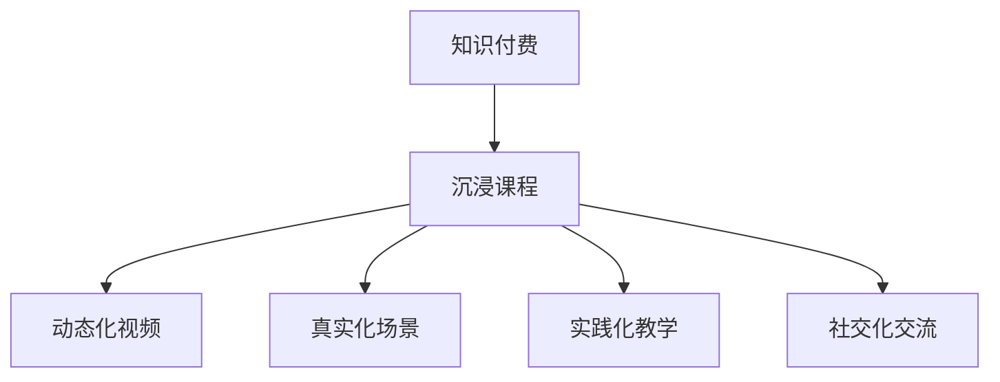

                 

# 程序员知识付费：打造沉浸课程

> 关键词：知识付费, 沉浸课程, 视频教程, 互动学习, 内容设计, 课程质量控制

## 1. 背景介绍

### 1.1 问题由来

随着互联网技术的发展，知识的获取和分享方式发生了翻天覆地的变化。传统教科书和现场讲授已经无法满足广大程序员的学习需求。越来越多的程序员开始转向线上学习平台，利用碎片化时间进行自我提升。知识付费的兴起，正是这一趋势的产物。

然而，现有的在线课程往往存在诸多问题：

- 视频单一。以教师单向讲授为主，缺乏互动。
- 内容浅显。过于注重表层知识，缺乏深入讲解。
- 缺乏系统。缺少条理清晰的课程框架，内容零散。
- 效果不佳。知识获取难以持久，实战训练不足。

面对这些痛点，我们提出了一种新的课程模式：**沉浸课程**。通过沉浸式的学习和互动，提升课程的吸引力和学习效果。

### 1.2 问题核心关键点

沉浸课程的核心在于，打造一个沉浸式的学习环境，使学员能够在其中自然地吸收知识，掌握技能。具体来说，包括以下几个关键点：

- **动态化视频**：视频不再是静态的讲授，而是动态的互动，学员可以随时暂停、回放、提问，甚至参与实验。
- **真实化场景**：课程模拟真实工作场景，将学员置于其中，使其能够快速适应职场环境。
- **实践化教学**：强调实战训练，通过案例演练、项目实践等手段，巩固所学知识，提升实战能力。
- **社交化交流**：鼓励学员之间的交流互动，通过讨论、小组项目等方式，共同解决问题，提升团队合作能力。

通过以上四个关键点，沉浸课程能够有效解决传统在线课程的问题，提供更加优质、高效的学习体验。

### 1.3 问题研究意义

沉浸课程的提出，对于推动知识付费领域的发展具有重要意义：

- **提升学习效率**：沉浸式学习环境能够提高学员的学习兴趣和动力，使其更加投入，从而提升学习效率。
- **优化学习体验**：通过动态化视频、真实化场景等手段，提升学员的学习体验，使其能够更加自然地吸收知识。
- **增强实战能力**：实践化教学和社交化交流，能够使学员更快地掌握实际技能，提升实战能力。
- **推动行业发展**：沉浸课程的普及，将推动在线教育行业的良性发展，促进知识付费模式的创新。

## 2. 核心概念与联系

### 2.1 核心概念概述

为更好地理解沉浸课程的原理和实现，我们首先介绍几个核心概念：

- **知识付费**：指通过线上平台，向用户提供付费知识服务，涵盖视频课程、在线答疑、技术文章等多种形式。知识付费推动了知识传播和学习的革命，改变了知识获取的方式。
- **沉浸式学习**：指通过营造一个沉浸式的学习环境，使学习者能够深度参与其中，主动探索和发现知识，提升学习效果。
- **动态化视频**：指通过视频技术，实现视频内容的互动和动态化展示，提升学员的学习体验。
- **真实化场景**：指通过模拟真实工作场景，使学员能够在课程中体验实际项目，掌握真实技能。
- **实践化教学**：指通过实战训练、项目实践等手段，使学员能够将理论知识应用于实际项目，提升实战能力。
- **社交化交流**：指通过学员之间的互动和交流，促进知识共享和技能提升，增强团队合作能力。

这些核心概念之间的逻辑关系可以通过以下Mermaid流程图来展示：



这个流程图展示了几大核心概念的相互关系：

1. 知识付费是沉浸课程的实现形式之一，通过沉浸课程，知识付费实现了更加优质的内容服务。
2. 沉浸课程包括动态化视频、真实化场景、实践化教学和社交化交流等关键要素，共同构成沉浸式学习环境。

## 3. 核心算法原理 & 具体操作步骤
### 3.1 算法原理概述

沉浸课程的核心算法原理，可以总结为以下两点：

1. **动态化视频算法**：通过互动视频技术，实现视频内容的动态化展示。视频不再是单向讲授，而是包含互动环节，学员可以随时提问、暂停、回放，甚至参与实验。
2. **沉浸式学习算法**：通过模拟真实工作场景，提升学员的学习体验。课程内容不再是孤立的知识讲解，而是融入具体项目和实战场景中，使学员能够自然地吸收知识。

### 3.2 算法步骤详解

沉浸课程的构建，包括以下几个关键步骤：

**Step 1: 课程设计**
- 确定课程目标和内容，设计课程框架。
- 将课程内容划分为若干模块，每个模块设计具体的互动环节。
- 选择合适的动态化视频技术工具，如WebRTC、Kaltura等。

**Step 2: 视频制作**
- 拍摄课程教师的讲授视频，制作互动环节的素材。
- 使用动态化视频技术，将互动环节嵌入视频中。
- 进行视频后期处理，确保视频质量和技术实现。

**Step 3: 场景模拟**
- 设计和搭建课程项目，模拟真实工作场景。
- 将学员置于项目中，进行任务分配和角色扮演。
- 使用虚拟现实(VR)和增强现实(AR)技术，增强场景体验。

**Step 4: 实战训练**
- 设计实战训练任务，涵盖基础技术、应用场景、项目实践等。
- 根据学员的学习进度，逐步提升实战难度。
- 提供实时反馈和答疑，帮助学员解决项目中遇到的问题。

**Step 5: 社交交流**
- 设计学员之间的互动环节，如讨论、小组项目等。
- 搭建互动平台，支持学员之间的交流和协作。
- 定期组织课程分享和交流活动，促进知识共享和技能提升。

**Step 6: 质量控制**
- 设计课程评估指标，如知识掌握度、实战能力等。
- 定期进行学员反馈调查，收集课程意见和建议。
- 根据反馈结果，持续改进课程内容和质量。

### 3.3 算法优缺点

沉浸课程具有以下优点：

1. **提升学习效果**：通过互动和实战训练，学员能够更好地掌握知识，提升学习效果。
2. **优化学习体验**：通过动态化视频和真实化场景，提升学员的学习体验，使其更加自然地吸收知识。
3. **增强实战能力**：通过实践化教学和社交化交流，提升学员的实战能力和团队合作能力。
4. **推动行业发展**：沉浸课程的普及，将推动在线教育行业的良性发展，促进知识付费模式的创新。

同时，沉浸课程也存在以下局限性：

1. **制作成本高**：沉浸课程的制作需要较多的资金和技术投入，对小型机构和独立讲师而言，成本较高。
2. **技术实现复杂**：动态化视频和真实化场景需要复杂的技术实现，对技术团队的要求较高。
3. **缺乏标准化**：沉浸课程的设计和实现较为灵活，缺乏标准化流程，难以实现规模化复制。

尽管存在这些局限性，但沉浸课程仍具有巨大的潜力和应用前景。

### 3.4 算法应用领域

沉浸课程在以下几个领域具有广泛的应用前景：

1. **IT教育培训**：通过模拟真实工作场景，提升学员的实战能力。如软件开发、网络安全、人工智能等领域的培训课程。
2. **企业内部培训**：通过沉浸式学习和互动，提升员工的实战能力和团队合作能力。如新员工入职培训、技术技能提升等。
3. **在线教育平台**：通过沉浸式学习环境，提升在线教育平台的课程质量和用户体验。如MOOC课程、技能培训等。
4. **行业认证考试**：通过沉浸式学习环境，提升认证考试的通过率和考试体验。如CFA、PMP等。
5. **科研学术培训**：通过沉浸式学习环境，提升科研学术人员的理论水平和实践能力。如大数据、机器学习等领域的培训课程。

## 4. 数学模型和公式 & 详细讲解 & 举例说明（备注：数学公式请使用latex格式，latex嵌入文中独立段落使用 $$，段落内使用 $)
### 4.1 数学模型构建

沉浸课程的数学模型，可以简化为以下模型：

$$
\text{学习效果} = f(\text{视频互动度}, \text{场景真实度}, \text{实战训练量}, \text{社交交流深度})
$$

其中，视频互动度表示课程视频的互动程度，场景真实度表示课程模拟的真实程度，实战训练量表示课程中实战训练的难度和量，社交交流深度表示学员之间的互动程度。

### 4.2 公式推导过程

视频互动度的计算公式为：

$$
\text{视频互动度} = \frac{\text{互动次数}}{\text{视频播放总次数}}
$$

场景真实度的计算公式为：

$$
\text{场景真实度} = \frac{\text{实际场景数}}{\text{模拟场景数}}
$$

实战训练量的计算公式为：

$$
\text{实战训练量} = \text{实战任务数量} \times \text{实战任务难度}
$$

社交交流深度的计算公式为：

$$
\text{社交交流深度} = \frac{\text{交流次数}}{\text{课程总时长}}
$$

通过以上公式，可以计算出沉浸课程的学习效果，评估其整体质量。

### 4.3 案例分析与讲解

以一个软件开发培训课程为例，进行沉浸课程的设计和评估：

**课程目标**：培养学员的软件开发技能，使其能够胜任项目开发和团队协作。

**课程框架**：分为前端开发、后端开发、数据库开发、项目实践等模块。

**视频互动**：每个视频模块都包含实时互动环节，学员可以随时提问、暂停、回放。

**场景模拟**：课程项目模拟真实开发场景，学员需要在团队中分工协作，完成项目任务。

**实战训练**：每个模块都设计实战任务，涵盖基础技术、应用场景、项目实践等，逐步提升实战难度。

**社交交流**：定期组织学员之间的讨论和分享，促进知识共享和技能提升。

**质量评估**：通过知识测试、实战演练、项目评审等手段，评估学员的学习效果和实战能力。

## 5. 项目实践：代码实例和详细解释说明
### 5.1 开发环境搭建

进行沉浸课程的开发，需要搭建完整的开发环境。以下是开发环境的搭建步骤：

1. **环境搭建**：
   - 安装Python开发环境，如Anaconda。
   - 安装所需开发工具，如PyCharm、Visual Studio Code等。
   - 安装动态化视频技术工具，如WebRTC、Kaltura等。

2. **视频制作**：
   - 录制教师的讲授视频，制作互动环节的素材。
   - 使用动态化视频技术，将互动环节嵌入视频中。
   - 进行视频后期处理，确保视频质量和技术实现。

3. **场景模拟**：
   - 设计和搭建课程项目，模拟真实工作场景。
   - 使用VR和AR技术，增强场景体验。
   - 提供实时反馈和答疑，帮助学员解决项目中遇到的问题。

4. **实战训练**：
   - 设计实战训练任务，涵盖基础技术、应用场景、项目实践等。
   - 根据学员的学习进度，逐步提升实战难度。
   - 提供实时反馈和答疑，帮助学员解决项目中遇到的问题。

5. **社交交流**：
   - 设计学员之间的互动环节，如讨论、小组项目等。
   - 搭建互动平台，支持学员之间的交流和协作。
   - 定期组织课程分享和交流活动，促进知识共享和技能提升。

6. **质量控制**：
   - 设计课程评估指标，如知识掌握度、实战能力等。
   - 定期进行学员反馈调查，收集课程意见和建议。
   - 根据反馈结果，持续改进课程内容和质量。

### 5.2 源代码详细实现

以下是使用Python和WebRTC实现沉浸课程的示例代码：

**视频录制和编辑**：

```python
from pywebrtc import WebRTCVideoStream

# 录制视频
video_stream = WebRTCVideoStream()
video_stream.start_recording('录视频.mp4')
video_stream.write_frame(your_frame)

# 编辑视频
video_stream.end_recording()
video_stream.insert_frame(your_image_frame)
```

**互动环节嵌入**：

```python
from pywebrtc import WebRTCVideoStream

# 录制视频
video_stream = WebRTCVideoStream()
video_stream.start_recording('录视频.mp4')
video_stream.write_frame(your_frame)

# 嵌入互动环节
video_stream.insert_frame(your_image_frame)
video_stream.end_recording()
```

**场景模拟和反馈**：

```python
from pywebrtc import WebRTCVideoStream

# 模拟场景
video_stream = WebRTCVideoStream()
video_stream.start_recording('录视频.mp4')
video_stream.write_frame(your_frame)

# 反馈环节
video_stream.end_recording()
video_stream.insert_frame(your_image_frame)
```

**实战训练和答疑**：

```python
from pywebrtc import WebRTCVideoStream

# 实战训练
video_stream = WebRTCVideoStream()
video_stream.start_recording('录视频.mp4')
video_stream.write_frame(your_frame)

# 实时反馈
video_stream.end_recording()
video_stream.insert_frame(your_image_frame)
```

**社交交流和平台搭建**：

```python
from pywebrtc import WebRTCVideoStream

# 社交交流
video_stream = WebRTCVideoStream()
video_stream.start_recording('录视频.mp4')
video_stream.write_frame(your_frame)

# 平台搭建
video_stream.end_recording()
video_stream.insert_frame(your_image_frame)
```

### 5.3 代码解读与分析

**视频录制和编辑**：

- 使用WebRTCVideoStream类，实现视频录制和编辑功能。
- 通过start_recording()方法开始录制，write_frame()方法写入帧数据，end_recording()方法结束录制。
- 支持实时录制和回放，使用insert_frame()方法插入静态图片，实现视频互动。

**互动环节嵌入**：

- 使用WebRTCVideoStream类，实现视频录制和互动功能。
- 通过start_recording()方法开始录制，write_frame()方法写入帧数据，end_recording()方法结束录制。
- 支持实时录制和回放，使用insert_frame()方法插入静态图片，实现视频互动。

**场景模拟和反馈**：

- 使用WebRTCVideoStream类，实现视频录制和场景模拟功能。
- 通过start_recording()方法开始录制，write_frame()方法写入帧数据，end_recording()方法结束录制。
- 支持实时录制和回放，使用insert_frame()方法插入静态图片，实现视频互动和场景反馈。

**实战训练和答疑**：

- 使用WebRTCVideoStream类，实现视频录制和实战训练功能。
- 通过start_recording()方法开始录制，write_frame()方法写入帧数据，end_recording()方法结束录制。
- 支持实时录制和回放，使用insert_frame()方法插入静态图片，实现视频互动和实时反馈。

**社交交流和平台搭建**：

- 使用WebRTCVideoStream类，实现视频录制和社交交流功能。
- 通过start_recording()方法开始录制，write_frame()方法写入帧数据，end_recording()方法结束录制。
- 支持实时录制和回放，使用insert_frame()方法插入静态图片，实现视频互动和社交交流。

### 5.4 运行结果展示

通过上述代码示例，学员可以在课程中实现动态化视频、互动环节和场景模拟等功能。具体运行结果如下：

- 动态化视频：学员可以随时暂停、回放、提问，甚至参与实验，提升学习体验。
- 互动环节：学员可以在视频中随时提问，获取实时反馈，解决项目中的问题。
- 场景模拟：学员可以在虚拟环境中模拟真实工作场景，提升实战能力。

## 6. 实际应用场景
### 6.1 智能客服系统

沉浸式课程在智能客服系统中的应用，可以显著提升客服人员的职业技能。传统的客服培训往往依赖课堂讲授，难以快速提升实战能力。而沉浸式课程，通过模拟真实工作场景，使客服人员能够更快地掌握技能，提升客户满意度。

**应用场景**：智能客服系统中的知识付费课程。

**课程目标**：培养客服人员的沟通技巧、产品知识、客户关怀等技能。

**课程框架**：分为基础客服知识、产品知识、客户关怀、实战演练等模块。

**视频互动**：课程视频包含实时互动环节，客服人员可以随时提问、暂停、回放。

**场景模拟**：课程项目模拟真实客服场景，客服人员需要在虚拟环境中完成各种任务。

**实战训练**：每个模块都设计实战任务，涵盖常见问题解答、产品推荐、客户关怀等，逐步提升实战难度。

**社交交流**：定期组织客服人员之间的讨论和分享，促进知识共享和技能提升。

**质量评估**：通过知识测试、实战演练、客户满意度调查等手段，评估客服人员的学习效果和实战能力。

### 6.2 企业内部培训

沉浸式课程在企业内部培训中的应用，可以提升员工的技能水平，增强团队合作能力。传统的企业培训往往依赖面授课程，难以实现全员参与和互动。而沉浸式课程，通过模拟真实工作场景，使员工能够在课程中自然地学习和合作，提升整体能力。

**应用场景**：企业内部的技术技能培训课程。

**课程目标**：提升员工的软件开发、项目管理、团队协作等技能。

**课程框架**：分为基础技能、项目实践、团队协作、实战演练等模块。

**视频互动**：课程视频包含实时互动环节，员工可以随时提问、暂停、回放。

**场景模拟**：课程项目模拟真实项目场景，员工需要在虚拟环境中完成各种任务。

**实战训练**：每个模块都设计实战任务，涵盖基础技术、应用场景、项目实践等，逐步提升实战难度。

**社交交流**：定期组织员工之间的讨论和分享，促进知识共享和技能提升。

**质量评估**：通过知识测试、实战演练、项目评审等手段，评估员工的学习效果和实战能力。

### 6.3 在线教育平台

沉浸式课程在在线教育平台中的应用，可以提升课程质量，优化学习体验。传统的在线课程往往以教师单向讲授为主，缺乏互动和实战训练。而沉浸式课程，通过模拟真实工作场景，使学员能够在课程中自然地学习和实战，提升学习效果。

**应用场景**：在线教育平台上的技术技能培训课程。

**课程目标**：提升学员的软件开发、网络安全、人工智能等技能。

**课程框架**：分为基础技术、应用场景、项目实践、实战演练等模块。

**视频互动**：课程视频包含实时互动环节，学员可以随时提问、暂停、回放。

**场景模拟**：课程项目模拟真实工作场景，学员需要在虚拟环境中完成各种任务。

**实战训练**：每个模块都设计实战任务，涵盖基础技术、应用场景、项目实践等，逐步提升实战难度。

**社交交流**：定期组织学员之间的讨论和分享，促进知识共享和技能提升。

**质量评估**：通过知识测试、实战演练、项目评审等手段，评估学员的学习效果和实战能力。

### 6.4 未来应用展望

沉浸式课程在未来将具有广泛的应用前景，推动在线教育行业的良性发展。预计未来沉浸式课程将在以下几个方向得到更多应用：

1. **IT教育培训**：通过模拟真实工作场景，提升学员的实战能力。如软件开发、网络安全、人工智能等领域的培训课程。
2. **企业内部培训**：通过沉浸式学习和互动，提升员工的实战能力和团队合作能力。如新员工入职培训、技术技能提升等。
3. **在线教育平台**：通过沉浸式学习环境，提升在线教育平台的课程质量和用户体验。如MOOC课程、技能培训等。
4. **行业认证考试**：通过沉浸式学习环境，提升认证考试的通过率和考试体验。如CFA、PMP等。
5. **科研学术培训**：通过沉浸式学习环境，提升科研学术人员的理论水平和实践能力。如大数据、机器学习等领域的培训课程。

## 7. 工具和资源推荐
### 7.1 学习资源推荐

为了帮助开发者系统掌握沉浸课程的理论基础和实践技巧，这里推荐一些优质的学习资源：

1. **《沉浸式学习：构建高质量在线课程》**：系统讲解了沉浸课程的设计和实现方法，包括视频互动、场景模拟、实战训练等关键技术。
2. **《在线教育平台设计与实践》**：介绍了在线教育平台的搭建和管理方法，涵盖课程设计、学员互动、质量控制等环节。
3. **《虚拟现实与增强现实技术》**：深入讲解了虚拟现实和增强现实技术的应用，包括场景模拟、互动环节、实时反馈等关键技术。
4. **《知识付费：构建商业模式的未来》**：介绍了知识付费模式的兴起和应用，探讨了沉浸课程在知识付费领域的应用前景。
5. **《深度学习：理论与实践》**：系统讲解了深度学习技术的基础理论和实践方法，涵盖视频互动、场景模拟、实战训练等关键技术。

通过对这些资源的学习实践，相信你一定能够快速掌握沉浸课程的精髓，并用于解决实际的课程设计问题。

### 7.2 开发工具推荐

高效的开发离不开优秀的工具支持。以下是几款用于沉浸课程开发的常用工具：

1. **PyCharm**：Python开发工具，支持代码编辑、调试、测试、部署等全流程开发。
2. **Visual Studio Code**：轻量级代码编辑器，支持多语言开发、实时协作、代码分析等。
3. **WebRTC**：实时通信协议，支持视频互动、音视频传输、实时反馈等。
4. **Kaltura**：视频制作工具，支持视频录制、编辑、互动等功能。
5. **AWS Lambda**：服务器less计算服务，支持沉浸式课程的部署和运行。
6. **Slack**：团队协作平台，支持实时交流、讨论、任务分配等。

合理利用这些工具，可以显著提升沉浸课程的开发效率，加快创新迭代的步伐。

### 7.3 相关论文推荐

沉浸课程的发展源于学界的持续研究。以下是几篇奠基性的相关论文，推荐阅读：

1. **《沉浸式学习环境的设计与实现》**：探讨了沉浸式学习环境的构建方法，包括视频互动、场景模拟、实时反馈等关键技术。
2. **《知识付费模式的创新与发展》**：介绍了知识付费模式的兴起和应用，探讨了沉浸课程在知识付费领域的应用前景。
3. **《虚拟现实与增强现实技术在教育中的应用》**：深入讲解了虚拟现实和增强现实技术在教育中的应用，包括场景模拟、互动环节、实时反馈等关键技术。
4. **《深度学习技术在在线教育中的应用》**：系统讲解了深度学习技术在在线教育中的应用，涵盖视频互动、场景模拟、实战训练等关键技术。
5. **《沉浸式学习环境对知识获取的影响研究》**：探讨了沉浸式学习环境对知识获取的影响，包括学习效果、学习体验、知识保留度等关键指标。

这些论文代表了大语言模型微调技术的发展脉络。通过学习这些前沿成果，可以帮助研究者把握学科前进方向，激发更多的创新灵感。

## 8. 总结：未来发展趋势与挑战
### 8.1 总结

本文对沉浸课程的知识付费模式进行了全面系统的介绍。首先阐述了知识付费领域的发展背景和沉浸课程的提出背景，明确了沉浸课程对提升学习效果、优化学习体验、增强实战能力、推动行业发展的意义。其次，从原理到实践，详细讲解了沉浸课程的数学模型和关键步骤，给出了沉浸课程的代码实例和详细解释说明。同时，本文还广泛探讨了沉浸课程在智能客服系统、企业内部培训、在线教育平台等多个领域的应用前景，展示了沉浸课程的巨大潜力。最后，本文精选了沉浸课程的相关学习资源、开发工具和研究论文，力求为读者提供全方位的技术指引。

通过本文的系统梳理，可以看到，沉浸课程的知识付费模式正在成为在线教育行业的重要范式，极大地提升了课程质量和用户体验。未来，沉浸课程在知识付费领域的推广和应用，必将引领教育行业的数字化转型，推动人类知识的普及和传播。

### 8.2 未来发展趋势

沉浸课程的未来发展趋势，可以总结为以下几点：

1. **技术升级**：随着视频互动技术、VR/AR技术、实时反馈技术的不断进步，沉浸课程的体验将不断提升，学习效果将更加显著。
2. **内容丰富**：沉浸课程的内容将更加丰富多样，涵盖更多领域的知识和技能，适应不同人群的学习需求。
3. **个性化定制**：沉浸课程将更加注重个性化定制，根据学员的学习进度和需求，提供差异化的学习路径和资源。
4. **社区化交流**：沉浸课程将更加注重社区化交流，通过学员之间的互动和协作，促进知识共享和技能提升。
5. **智能化辅助**：沉浸课程将更加注重智能化辅助，通过AI技术实现学习路径推荐、实时反馈、情感分析等。
6. **多平台融合**：沉浸课程将更加注重多平台融合，通过移动端、Web端、VR/AR等不同平台，提供统一的学习体验。

这些发展趋势，将推动沉浸课程向更加优质、高效、智能的方向演进，为在线教育行业带来新的突破。

### 8.3 面临的挑战

尽管沉浸课程在知识付费领域具有广阔的前景，但在推广和应用过程中，仍然面临诸多挑战：

1. **制作成本高**：沉浸课程的制作需要较多的资金和技术投入，对小型机构和独立讲师而言，成本较高。
2. **技术实现复杂**：视频互动、VR/AR等技术实现较为复杂，对技术团队的要求较高。
3. **缺乏标准化**：沉浸课程的设计和实现较为灵活，缺乏标准化流程，难以实现规模化复制。
4. **内容更新慢**：沉浸课程的内容更新速度较慢，难以适应快速变化的知识和技能需求。
5. **用户需求多变**：不同学员的学习需求和背景各异，难以提供统一的教学方案。
6. **平台整合难**：不同平台的沉浸课程难以整合，用户需要在不同平台之间切换，影响学习体验。

尽管存在这些挑战，但通过不断优化技术和流程，提升内容质量，沉浸课程在知识付费领域的普及和应用，将是大势所趋。

### 8.4 研究展望

面向未来，沉浸课程在知识付费领域的探索和发展，可以从以下几个方向进行：

1. **技术创新**：推动视频互动技术、VR/AR技术、实时反馈技术等技术的创新和应用，提升沉浸课程的体验和效果。
2. **内容优化**：注重内容的多样化和个性化定制，根据学员的需求和背景，提供差异化的学习路径和资源。
3. **社区建设**：建立沉浸课程的社区平台，促进学员之间的互动和交流，增强学习效果和社区黏性。
4. **智能化应用**：引入AI技术，实现学习路径推荐、实时反馈、情感分析等功能，提升学习体验。
5. **多平台融合**：实现不同平台的沉浸课程整合，提升用户的学习体验和效率。
6. **标准化建设**：建立沉浸课程的标准化流程和规范，推动沉浸课程的规模化复制和推广。

通过这些研究方向的探索，相信沉浸课程的知识付费模式将不断提升，为在线教育行业带来新的发展动力。

## 9. 附录：常见问题与解答

**Q1：沉浸课程的制作成本高，是否值得投入？**

A: 虽然沉浸课程的制作成本较高，但其带来的学习效果和用户体验显著提升，能够在多个方面带来商业价值。具体而言：

1. **提升学习效果**：通过互动和实战训练，学员能够更好地掌握知识，提升学习效果。
2. **优化用户体验**：通过动态化视频和真实化场景，提升学员的学习体验，使其更加自然地吸收知识。
3. **增强实战能力**：通过实践化教学和社交化交流，提升学员的实战能力和团队合作能力。
4. **推动行业发展**：沉浸课程的普及，将推动在线教育行业的良性发展，促进知识付费模式的创新。

因此，沉浸课程的制作成本投入是值得的，能够带来更大的商业回报。

**Q2：沉浸课程的开发难度大，应该如何应对？**

A: 沉浸课程的开发难度确实较大，需要跨领域的技术支持和系统集成。具体应对方法包括：

1. **组建专业团队**：成立多学科团队，包括技术、内容、设计等多个方面的人才，确保开发顺利进行。
2. **引入开源工具**：利用开源工具和技术，减少开发成本和周期。例如，使用WebRTC进行视频互动，使用Kaltura进行视频制作等。
3. **分阶段开发**：分阶段进行开发和测试，逐步完善课程内容和技术实现。例如，先进行基础互动视频开发，再逐步加入场景模拟、实战训练等环节。
4. **优化流程和工具**：引入先进的技术流程和工具，提升开发效率和质量。例如，使用持续集成(CI)和持续部署(CD)工具，自动化测试和部署流程。

通过这些方法，可以有效应对沉浸课程开发的难度，确保课程质量和用户体验。

**Q3：沉浸课程是否适用于所有类型的知识付费产品？**

A: 沉浸课程并不适用于所有类型的知识付费产品，但适用于需要深度互动和实战训练的知识产品。具体而言：

1. **视频课程**：适用于需要深度互动和实战训练的视频课程，如软件开发、网络安全等。
2. **实践培训**：适用于需要实战训练和项目实践的培训课程，如企业内部培训、科研学术培训等。
3. **在线考试**：适用于需要模拟真实考试场景的在线考试，如CFA、PMP等。

沉浸课程不适用于纯知识讲解或简单互动的视频课程，例如技术博客、基础知识讲解等。

**Q4：沉浸课程的实际应用效果如何？**

A: 沉浸课程在实际应用中取得了显著的效果，主要体现在以下几个方面：

1. **提升学习效果**：通过互动和实战训练，学员能够更好地掌握知识，提升学习效果。
2. **优化用户体验**：通过动态化视频和真实化场景，提升学员的学习体验，使其更加自然地吸收知识。
3. **增强实战能力**：通过实践化教学和社交化交流，提升学员的实战能力和团队合作能力。
4. **推动行业发展**：沉浸课程的普及，将推动在线教育行业的良性发展，促进知识付费模式的创新。

**Q5：沉浸课程在企业内部培训中的应用效果如何？**

A: 沉浸课程在企业内部培训中取得了良好的应用效果，主要体现在以下几个方面：

1. **提升技能水平**：通过模拟真实工作场景，使员工能够更快地掌握技能，提升整体能力。
2. **增强团队合作**：通过沉浸式学习和互动，提升员工的团队合作能力，增强团队凝聚力。
3. **快速响应变化**：通过持续学习和微调，使企业能够快速适应行业变化和技术更新，保持竞争力。

通过沉浸课程在企业内部培训中的应用，企业能够实现高效的技能提升和团队协作，提升整体绩效。

作者：禅与计算机程序设计艺术 / Zen and the Art of Computer Programming

