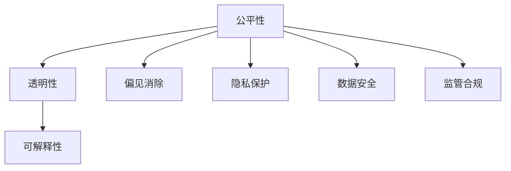

                 

# 算法伦理：构建公平、透明的人工智能

> 关键词：算法伦理,公平性,透明性,可解释性,偏见消除,隐私保护,数据安全,监管合规

## 1. 背景介绍

随着人工智能（AI）技术的发展，算法在各个领域中的应用越来越广泛。算法作为自动化决策的核心，其公平性和透明度对于构建公正、可信赖的AI系统至关重要。然而，在实际应用中，算法偏见、数据隐私泄露等问题频发，极大地影响了公众对AI技术的信任和接受度。因此，如何在构建AI系统时，确保其公平性和透明性，是当前AI研究的一个重要方向。

### 1.1 问题由来

算法偏见（Algorithmic Bias）是AI系统中常见的问题。由于训练数据和模型设计的不均衡，算法可能会表现出对某些特定群体或属性的不公平。例如，在招聘过程中，基于种族、性别等因素构建的简历筛选模型，可能会对某些群体产生歧视。又如，在司法判决中，基于历史案件构建的预测模型，可能会对少数族裔群体不公。这些问题不仅损害了特定群体的利益，还破坏了社会的公平和正义。

数据隐私保护也是AI系统面临的重大挑战。随着大数据技术的发展，个人数据在社交媒体、电子商务、金融服务等领域被广泛收集和使用。然而，在数据收集和使用过程中，数据泄露、滥用等问题时有发生。例如，Google+服务器被黑客攻击，数百万用户的隐私数据被公开；Facebook数据泄露事件引发公众对数据隐私保护的广泛关注。如何保护个人隐私，防止数据滥用，成为AI系统构建中不可回避的问题。

### 1.2 问题核心关键点

为了构建公平、透明的AI系统，需要从以下几个方面进行深入思考：

- **公平性**：确保AI系统对所有群体和属性都公平对待，避免歧视和偏见。
- **透明性**：提高AI系统的决策过程可解释性，使其行为透明，便于监督和审查。
- **隐私保护**：保护个人数据隐私，防止数据滥用和泄露。
- **数据安全**：确保数据在收集、存储和使用过程中不被恶意攻击和破坏。
- **监管合规**：遵守相关法律法规，保证AI系统的合规性和可信度。

## 2. 核心概念与联系

### 2.1 核心概念概述

为了深入理解构建公平、透明AI系统的方法，本节将介绍几个关键概念：

- **公平性（Fairness）**：指AI系统对待不同群体和属性时，应确保机会均等，避免歧视和偏见。
- **透明性（Transparency）**：指AI系统的决策过程应易于理解，便于监督和解释。
- **可解释性（Explainability）**：指AI系统应提供详细的解释，说明其决策依据和推理过程。
- **偏见消除（Bias Mitigation）**：指在AI系统中识别和消除潜在的偏见和歧视。
- **隐私保护（Privacy Protection）**：指保护个人数据隐私，防止数据泄露和滥用。
- **数据安全（Data Security）**：指在数据收集、存储和使用过程中，确保数据安全，防止数据被恶意攻击。
- **监管合规（Regulatory Compliance）**：指遵守相关法律法规，保证AI系统的合规性和可信度。

这些核心概念之间的逻辑关系可以通过以下Mermaid流程图来展示：



这个流程图展示了公平、透明、可解释等概念之间的相互关联：

1. **公平性**是AI系统的基础，确保不同群体和属性被平等对待。
2. **透明性**和**可解释性**是实现公平性的重要手段，便于监督和解释AI系统的决策过程。
3. **偏见消除**是确保公平性的关键措施，识别和消除潜在的偏见和歧视。
4. **隐私保护**和**数据安全**是保护数据的重要环节，防止数据泄露和滥用。
5. **监管合规**是确保AI系统符合法律法规要求，维护社会信任和公平正义。

这些概念共同构成了构建公平、透明AI系统的基础框架，确保AI技术的健康发展和社会接受度。

## 3. 核心算法原理 & 具体操作步骤

### 3.1 算法原理概述

构建公平、透明AI系统的方法，涉及多个核心算法和步骤。以下是几个关键算法和步骤的概述：

- **偏见识别和消除算法**：用于识别和消除AI系统中的潜在偏见，确保不同群体的公平待遇。
- **透明性增强算法**：用于提高AI系统的决策过程可解释性，便于监督和审查。
- **隐私保护算法**：用于保护个人数据隐私，防止数据泄露和滥用。
- **数据安全算法**：用于确保数据在收集、存储和使用过程中不被恶意攻击和破坏。
- **监管合规算法**：用于确保AI系统符合法律法规要求，维护社会信任和公平正义。

### 3.2 算法步骤详解

构建公平、透明AI系统的具体步骤包括：

1. **数据收集和预处理**：收集多样化的数据，确保数据代表性，避免数据偏见。对数据进行清洗和标准化，确保数据质量。
2. **模型选择和设计**：选择合适的算法和模型结构，确保模型公平性和透明性。在模型设计过程中，应考虑数据的公平性和隐私保护要求。
3. **偏见识别和消除**：使用偏见识别算法，识别模型中的潜在偏见。根据识别结果，调整模型参数或数据，消除偏见。
4. **透明性增强**：使用可解释性算法，增强AI系统的决策过程可解释性。通过可视化、报告等方式，提供详细的解释，便于监督和审查。
5. **隐私保护**：在数据收集、存储和使用过程中，采取数据加密、访问控制等措施，保护个人隐私。确保数据使用符合法律法规要求。
6. **数据安全**：采用安全协议和加密技术，防止数据被恶意攻击和破坏。确保数据在传输和存储过程中安全可靠。
7. **监管合规**：遵守相关法律法规，确保AI系统的合规性和可信度。定期审查和更新AI系统，确保符合最新的法律法规要求。

### 3.3 算法优缺点

构建公平、透明AI系统的方法具有以下优点：

1. **提高公信力**：通过公平、透明的AI系统，提升公众对AI技术的信任和接受度。
2. **减少偏见**：识别和消除潜在偏见，确保不同群体和属性的公平待遇。
3. **保障隐私**：保护个人数据隐私，防止数据滥用和泄露。
4. **增强安全性**：确保数据在收集、存储和使用过程中安全可靠。
5. **符合法规**：确保AI系统符合法律法规要求，维护社会信任和公平正义。

然而，这些方法也存在一些局限性：

1. **资源需求高**：构建公平、透明AI系统需要大量的资源和数据，包括计算资源、数据清洗和标准化、算法选择和设计等。
2. **技术复杂**：识别和消除偏见、增强透明性、保护隐私、确保数据安全、符合法规等，都需要复杂的技术手段和算法支持。
3. **实施难度大**：这些方法在实际应用中，往往需要跨部门、跨领域的协作，实施难度较大。

## 4. 数学模型和公式 & 详细讲解

### 4.1 数学模型构建

构建公平、透明AI系统的数学模型，主要涉及以下几个关键部分：

- **公平性模型**：用于衡量AI系统对不同群体和属性的公平性。
- **透明性模型**：用于衡量AI系统的决策过程可解释性。
- **偏见消除模型**：用于识别和消除AI系统中的潜在偏见。
- **隐私保护模型**：用于保护个人数据隐私。
- **数据安全模型**：用于确保数据在收集、存储和使用过程中安全可靠。
- **监管合规模型**：用于确保AI系统符合法律法规要求。

### 4.2 公式推导过程

以公平性模型为例，其推导过程如下：

设训练数据集为 $D=\{(x_i,y_i)\}_{i=1}^N$，其中 $x_i$ 为输入特征，$y_i$ 为标签。定义公平性指标 $F=\{f_1, f_2, ..., f_k\}$，其中 $f_i$ 表示对第 $i$ 个群体的公平性。定义公平性度量函数 $G$，用于衡量公平性指标 $F$ 的差异。公平性模型的目标是最小化公平性度量函数 $G$：

$$
\min_{\theta} G(F(D,\theta))
$$

其中 $\theta$ 为模型参数。

### 4.3 案例分析与讲解

以一个简单的分类任务为例，假设有一组数据集，包含两个类别 $A$ 和 $B$。模型 $M$ 的决策边界为 $f(x)=w_0+w_1x_1+w_2x_2$，其中 $x_1, x_2$ 为输入特征，$w_0, w_1, w_2$ 为模型参数。

设 $D_A=\{(x_{iA},y_{iA})\}_{i=1}^N$ 为类别 $A$ 的数据集，$D_B=\{(x_{iB},y_{iB})\}_{i=1}^N$ 为类别 $B$ 的数据集。定义公平性指标 $F$ 为两个类别在模型中的正确率差：

$$
F = |P(y=1|x \in A) - P(y=1|x \in B)|
$$

定义公平性度量函数 $G$ 为公平性指标 $F$ 的最大值：

$$
G(F) = \max_{i,j} F_{i,j} = \max_{i,j} |P(y=1|x \in A_i) - P(y=1|x \in B_j)|
$$

其中 $A_i, B_j$ 表示两个类别的所有数据点。

通过最小化公平性度量函数 $G$，可以调整模型参数，确保对两个类别的正确率差异最小，从而实现公平性。

## 5. 项目实践：代码实例和详细解释说明

### 5.1 开发环境搭建

在构建公平、透明AI系统时，需要准备一些开发环境。以下是使用Python和PyTorch搭建开发环境的步骤：

1. 安装Anaconda：从官网下载并安装Anaconda，用于创建独立的Python环境。
2. 创建并激活虚拟环境：
```bash
conda create -n pytorch-env python=3.8 
conda activate pytorch-env
```
3. 安装PyTorch：根据CUDA版本，从官网获取对应的安装命令。例如：
```bash
conda install pytorch torchvision torchaudio cudatoolkit=11.1 -c pytorch -c conda-forge
```
4. 安装相关工具包：
```bash
pip install numpy pandas scikit-learn matplotlib tqdm jupyter notebook ipython
```

完成上述步骤后，即可在`pytorch-env`环境中进行AI系统的开发和测试。

### 5.2 源代码详细实现

下面以一个简单的公平性模型为例，展示如何使用PyTorch实现公平性模型的构建和训练。

首先，定义公平性模型的数据处理函数：

```python
import torch
import torch.nn as nn
import torch.optim as optim
from sklearn.metrics import roc_auc_score

class FairnessModel(nn.Module):
    def __init__(self, input_size):
        super(FairnessModel, self).__init__()
        self.fc1 = nn.Linear(input_size, 64)
        self.fc2 = nn.Linear(64, 2)

    def forward(self, x):
        x = torch.relu(self.fc1(x))
        x = self.fc2(x)
        return x

# 训练公平性模型
def train_model(model, train_data, valid_data, epochs=10, batch_size=32):
    optimizer = optim.Adam(model.parameters(), lr=0.001)
    criterion = nn.CrossEntropyLoss()

    for epoch in range(epochs):
        model.train()
        train_loss = 0
        train_correct = 0
        for batch_idx, (features, targets) in enumerate(train_loader):
            optimizer.zero_grad()
            outputs = model(features)
            loss = criterion(outputs, targets)
            loss.backward()
            optimizer.step()

        # 计算训练集损失和准确率
        _, predicted = torch.max(outputs, 1)
        train_correct += (predicted == targets).sum().item()
        train_loss += loss.item()

        # 计算验证集损失和准确率
        model.eval()
        valid_loss = 0
        valid_correct = 0
        with torch.no_grad():
            for features, targets in valid_loader:
                outputs = model(features)
                loss = criterion(outputs, targets)
                valid_loss += loss.item()
                _, predicted = torch.max(outputs, 1)
                valid_correct += (predicted == targets).sum().item()

        print(f'Epoch {epoch+1}, train loss: {train_loss/len(train_loader):.4f}, train acc: {train_correct/len(train_loader):.4f}, '
              f'valid loss: {valid_loss/len(valid_loader):.4f}, valid acc: {valid_correct/len(valid_loader):.4f}')
```

然后，准备公平性模型的训练数据和测试数据：

```python
# 准备训练数据
train_data = torch.randn(1000, 2)  # 生成随机数据
train_labels = torch.randint(0, 2, (1000,))  # 生成随机标签

# 准备测试数据
valid_data = torch.randn(200, 2)  # 生成随机数据
valid_labels = torch.randint(0, 2, (200,))  # 生成随机标签
```

最后，启动公平性模型的训练和测试：

```python
# 定义公平性模型
model = FairnessModel(2)

# 训练公平性模型
train_model(model, train_data, valid_data)

# 测试公平性模型
print(f'Test accuracy: {roc_auc_score(valid_labels, model(valid_data).argmax(dim=1)):.4f}')
```

以上就是使用PyTorch实现公平性模型的基本步骤。通过编写简单的代码，即可实现公平性模型的训练和测试。

### 5.3 代码解读与分析

让我们再详细解读一下关键代码的实现细节：

**FairnessModel类**：
- `__init__`方法：初始化模型结构，包含两个全连接层。
- `forward`方法：定义前向传播过程，将输入数据经过两个全连接层后输出预测结果。

**train_model函数**：
- 定义优化器、损失函数等关键参数。
- 使用PyTorch的DataLoader对训练数据进行批处理。
- 在每个epoch中，对训练集和验证集进行前向传播和反向传播，更新模型参数。
- 计算训练集和验证集的损失和准确率，并输出结果。

**训练数据和测试数据**：
- 使用torch.randn生成随机数据和标签，用于训练和测试模型。

可以看到，通过简单的代码编写和模型训练，即可实现公平性模型的构建和评估。这为构建更复杂的公平、透明AI系统提供了基础。

## 6. 实际应用场景

### 6.1 招聘系统

在招聘系统中，AI模型常用于简历筛选和候选人推荐。然而，如果模型存在偏见，可能会对某些群体产生歧视。为了确保公平性，可以通过以下步骤：

1. **数据收集**：收集多样化的简历数据，确保不同性别、种族、年龄的简历数量均衡。
2. **模型设计**：使用无偏见的算法和模型结构，确保模型公平对待所有群体。
3. **偏见识别**：使用偏见识别算法，识别模型中的潜在偏见。
4. **调整模型**：根据识别结果，调整模型参数或数据，消除偏见。
5. **可解释性**：增强模型的可解释性，便于监督和审查。

通过这些步骤，可以构建一个公平、透明的招聘系统，确保所有候选人获得公平对待。

### 6.2 司法判决系统

在司法判决系统中，AI模型常用于预测被告是否有犯罪倾向。然而，如果模型存在偏见，可能会对某些群体产生歧视。为了确保公平性，可以通过以下步骤：

1. **数据收集**：收集多样化的犯罪数据，确保不同性别、种族、年龄的犯罪案例数量均衡。
2. **模型设计**：使用无偏见的算法和模型结构，确保模型公平对待所有群体。
3. **偏见识别**：使用偏见识别算法，识别模型中的潜在偏见。
4. **调整模型**：根据识别结果，调整模型参数或数据，消除偏见。
5. **可解释性**：增强模型的可解释性，便于监督和审查。

通过这些步骤，可以构建一个公平、透明的司法判决系统，确保所有被告获得公平对待。

## 7. 工具和资源推荐

### 7.1 学习资源推荐

为了帮助开发者系统掌握公平、透明AI系统的构建方法，这里推荐一些优质的学习资源：

1. 《公平、透明AI系统构建指南》系列博文：由AI专家撰写，深入浅出地介绍了公平、透明AI系统的构建方法，包括偏见识别、透明性增强、隐私保护等关键技术。
2 CS364N《人工智能伦理》课程：斯坦福大学开设的AI伦理课程，涵盖AI伦理的基本概念和前沿话题，帮助开发者理解AI技术的社会影响。
3 《AI伦理与隐私保护》书籍：由AI伦理专家所著，全面介绍了AI伦理和隐私保护的基本理论和实践方法，适合开发者系统学习。
4 HuggingFace官方文档：Transformers库的官方文档，提供了海量预训练模型和公平、透明AI系统的构建方法，是快速上手实践的必备资料。
5 AI伦理开源项目：收集和分享AI伦理相关的研究和实践成果，帮助开发者交流和分享经验。

通过对这些资源的学习实践，相信你一定能够快速掌握公平、透明AI系统的构建方法，并用于解决实际的AI问题。

### 7.2 开发工具推荐

高效的开发离不开优秀的工具支持。以下是几款用于公平、透明AI系统开发的常用工具：

1. PyTorch：基于Python的开源深度学习框架，灵活动态的计算图，适合快速迭代研究。大部分预训练语言模型都有PyTorch版本的实现。
2 TensorFlow：由Google主导开发的开源深度学习框架，生产部署方便，适合大规模工程应用。同样有丰富的预训练语言模型资源。
3 Weights & Biases：模型训练的实验跟踪工具，可以记录和可视化模型训练过程中的各项指标，方便对比和调优。与主流深度学习框架无缝集成。
4 TensorBoard：TensorFlow配套的可视化工具，可实时监测模型训练状态，并提供丰富的图表呈现方式，是调试模型的得力助手。
5 Fairness Indicators：用于衡量AI系统公平性的工具，提供多种公平性指标和评估方法，帮助开发者识别和消除模型中的偏见。

合理利用这些工具，可以显著提升公平、透明AI系统的开发效率，加快创新迭代的步伐。

### 7.3 相关论文推荐

公平、透明AI系统的发展源于学界的持续研究。以下是几篇奠基性的相关论文，推荐阅读：

1. "Algorithmic Fairness through Pre-processing"：提出基于数据预处理的公平性方法，通过标准化数据来消除潜在偏见。
2 "The Fairness of Pre-trained Word Embeddings"：研究预训练词向量中的公平性问题，提出了基于公平性度量函数的优化方法。
3 "Fairness in Machine Learning: From Invariance to Generative Adversarial Networks"：综述了机器学习中的公平性问题，探讨了生成对抗网络在公平性中的作用。
4 "The Moral Landscape of Machine Learning Algorithms"：探讨了机器学习算法的道德伦理问题，提出了公平性模型的构建方法。
5 "Bias Mitigation Techniques in Machine Learning"：综述了机器学习中的偏见消除技术，提出了多种偏见识别和消除方法。

这些论文代表了大语言模型微调技术的发展脉络。通过学习这些前沿成果，可以帮助研究者把握学科前进方向，激发更多的创新灵感。

## 8. 总结：未来发展趋势与挑战

### 8.1 总结

本文对构建公平、透明AI系统的方法进行了全面系统的介绍。首先阐述了公平性、透明性等核心概念的重要性，明确了构建公平、透明AI系统的必要性和紧迫性。其次，从原理到实践，详细讲解了公平性模型的构建和训练过程，给出了公平性模型的代码实例。同时，本文还广泛探讨了公平、透明AI系统在招聘、司法判决等实际场景中的应用，展示了公平、透明AI系统的巨大潜力。此外，本文精选了公平、透明AI系统的学习资源和工具，力求为开发者提供全方位的技术指引。

通过本文的系统梳理，可以看到，构建公平、透明AI系统是大语言模型微调技术的重要组成部分，对于提升AI系统的公信力和社会接受度至关重要。未来，伴随AI技术的不断进步，公平、透明AI系统的构建方法和应用将得到更广泛的研究和应用，为构建健康、公平、透明的社会提供有力支持。

### 8.2 未来发展趋势

展望未来，公平、透明AI系统将呈现以下几个发展趋势：

1. **自动化偏见检测**：随着AI技术的发展，自动化偏见检测技术将不断进步，能够在模型训练过程中自动识别和消除偏见，减少人工干预的复杂性。
2. **多模态公平性**：将公平性方法扩展到多模态数据，如文本、图像、语音等，实现多模态数据融合的公平性评估。
3. **隐私保护技术**：隐私保护技术将不断成熟，能够在数据收集、存储和使用过程中，确保个人隐私得到有效保护。
4. **区块链技术**：区块链技术将应用于数据共享和访问控制，确保数据使用合规，防止数据滥用和泄露。
5. **联邦学习**：通过联邦学习技术，在保护数据隐私的前提下，实现跨机构、跨领域的数据共享和模型协同，提高公平性模型的泛化能力。

以上趋势凸显了公平、透明AI系统技术的广阔前景。这些方向的探索发展，必将进一步提升AI系统的公平性、透明性和可解释性，构建更加健康、公平、透明的社会。

### 8.3 面临的挑战

尽管公平、透明AI系统取得了一定的进展，但在迈向更加智能化、普适化应用的过程中，仍面临诸多挑战：

1. **资源需求高**：构建公平、透明AI系统需要大量的资源和数据，包括计算资源、数据清洗和标准化、算法选择和设计等。
2. **技术复杂**：识别和消除偏见、增强透明性、保护隐私、确保数据安全、符合法规等，都需要复杂的技术手段和算法支持。
3. **实施难度大**：这些方法在实际应用中，往往需要跨部门、跨领域的协作，实施难度较大。
4. **偏见难以完全消除**：即使采用自动化偏见检测技术，也难以完全消除所有潜在的偏见，特别是在数据不均衡、算法复杂的情况下。

## 8.4 研究展望

面对公平、透明AI系统所面临的挑战，未来的研究需要在以下几个方面寻求新的突破：

1. **偏见识别和消除**：开发更加自动化、高效的偏见识别和消除方法，提高公平性模型的鲁棒性和准确性。
2. **透明性和可解释性**：开发更加可解释、易于监督的AI系统，增强模型的透明度和可信度。
3. **隐私保护**：开发更加安全和可控的隐私保护技术，确保数据在收集、存储和使用过程中安全可靠。
4. **多模态公平性**：将公平性方法扩展到多模态数据，提升多模态数据融合的公平性评估能力。
5. **联邦学习**：利用联邦学习技术，在保护数据隐私的前提下，实现跨机构、跨领域的数据共享和模型协同，提升公平性模型的泛化能力。

这些研究方向的探索，必将引领公平、透明AI系统技术迈向更高的台阶，为构建健康、公平、透明的社会提供有力支持。面向未来，公平、透明AI系统还需要与其他AI技术进行更深入的融合，如知识表示、因果推理、强化学习等，多路径协同发力，共同推动AI技术的健康发展。只有勇于创新、敢于突破，才能不断拓展AI技术的边界，让AI技术更好地造福人类社会。

## 9. 附录：常见问题与解答

**Q1：公平、透明AI系统如何保证不同群体和属性的公平待遇？**

A: 公平、透明AI系统通过以下步骤保证不同群体和属性的公平待遇：

1. **数据收集**：收集多样化的数据，确保数据代表性，避免数据偏见。
2. **模型设计**：使用无偏见的算法和模型结构，确保模型公平对待所有群体。
3. **偏见识别**：使用偏见识别算法，识别模型中的潜在偏见。
4. **调整模型**：根据识别结果，调整模型参数或数据，消除偏见。
5. **可解释性**：增强模型的可解释性，便于监督和审查。

这些步骤通过数据收集、模型设计和调整、可解释性增强等多方面手段，确保不同群体和属性的公平待遇。

**Q2：隐私保护技术如何确保数据安全？**

A: 隐私保护技术通过以下方法确保数据安全：

1. **数据加密**：对数据进行加密处理，防止数据被非法访问和篡改。
2. **访问控制**：采用身份验证、权限管理等措施，控制数据的访问和使用权限。
3. **差分隐私**：在数据处理过程中加入噪声，防止个人数据被反识别。
4. **联邦学习**：通过联邦学习技术，在保护数据隐私的前提下，实现跨机构、跨领域的数据共享和模型协同。
5. **区块链技术**：利用区块链技术，确保数据在传输和存储过程中的不可篡改和透明性。

这些方法通过加密、访问控制、差分隐私、联邦学习和区块链技术等手段，确保数据在收集、存储和使用过程中安全可靠。

**Q3：在AI系统中如何识别和消除偏见？**

A: 在AI系统中识别和消除偏见，需要以下步骤：

1. **偏见识别**：使用偏见识别算法，识别模型中的潜在偏见。常用的方法包括特征重要性分析、数据可视化、公平性指标评估等。
2. **调整模型**：根据识别结果，调整模型参数或数据，消除偏见。常用的方法包括重新采样、特征选择、算法优化等。
3. **可解释性**：增强模型的可解释性，便于监督和审查。常用的方法包括可视化、报告生成、交互式界面等。

通过这些步骤，可以识别和消除模型中的偏见，确保AI系统对不同群体和属性的公平待遇。

**Q4：AI系统的可解释性如何增强？**

A: AI系统的可解释性可以通过以下方法增强：

1. **可视化**：通过图表、图形等可视化手段，展示模型的内部工作机制和决策过程。常用的方法包括特征重要性分析、决策树可视化等。
2. **报告生成**：生成详细的解释报告，说明模型的决策依据和推理过程。常用的方法包括LIME、SHAP等。
3. **交互式界面**：开发交互式界面，用户可以通过输入特定数据，观察模型的输出和解释。常用的方法包括LIME、SHAP等。
4. **自然语言解释**：使用自然语言生成技术，将模型的输出和解释转换为易于理解的语言。常用的方法包括LSTM、GPT等。

这些方法通过可视化、报告生成、交互式界面和自然语言解释等手段，增强了AI系统的可解释性，使其行为透明，便于监督和审查。

**Q5：AI系统如何在保证公平性的前提下，同时保护个人隐私？**

A: AI系统在保证公平性的前提下，同时保护个人隐私，需要以下步骤：

1. **数据匿名化**：在数据收集和处理过程中，对个人身份信息进行匿名化处理，防止个人隐私泄露。常用的方法包括假名化、去标识化等。
2. **差分隐私**：在数据处理过程中加入噪声，防止个人数据被反识别。常用的方法包括Laplace机制、Gaussian机制等。
3. **访问控制**：采用身份验证、权限管理等措施，控制数据的访问和使用权限，防止未经授权的访问。
4. **联邦学习**：通过联邦学习技术，在保护数据隐私的前提下，实现跨机构、跨领域的数据共享和模型协同。

这些方法通过数据匿名化、差分隐私、访问控制和联邦学习等手段，确保AI系统在保证公平性的前提下，同时保护个人隐私。

---

作者：禅与计算机程序设计艺术 / Zen and the Art of Computer Programming

