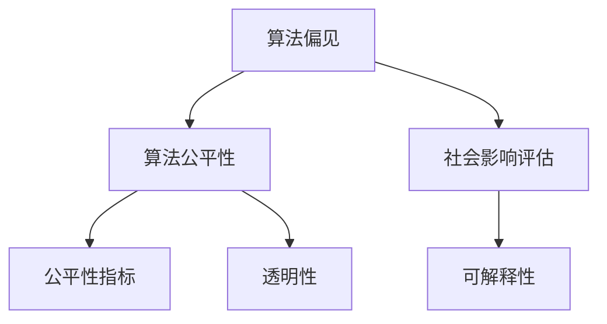

                 

# 算法公平性：构建负责任的人工智能

> 关键词：算法公平性, 负责任AI, 偏见识别与缓解, 社会影响评估, 可解释AI, 公平性指标, 算法透明性

## 1. 背景介绍

### 1.1 问题由来
人工智能(AI)技术在近年来迅猛发展，给各行各业带来了巨大的变革。然而，AI的广泛应用也引发了诸多伦理和社会问题，特别是算法公平性问题。随着越来越多的AI系统被用于核心决策，算法偏见和歧视的问题日益凸显，带来了深远的社会影响。例如，金融信贷、司法判决、招聘录用、医疗诊断等领域的AI系统，如果存在歧视性偏见，将导致系统决策不公，影响公众信任和公平正义。

为解决这一问题，学术界和业界纷纷探讨AI系统的公平性问题，并制定了一系列指导原则和实施方案。如何构建负责任的AI系统，确保算法的公平性和透明性，成为了当前AI研究的重要课题。本文将从算法公平性的核心概念和原理入手，探讨构建负责任AI的具体步骤和方法，并结合实际应用场景进行深入分析。

### 1.2 问题核心关键点
算法公平性是构建负责任AI的关键问题。其核心在于确保AI系统的决策过程和输出结果不受人为偏见、歧视等不良因素的影响，保障所有群体的平等权益。具体关键点包括：

- 算法偏见识别：通过数据分析和模型测试，识别算法中存在的歧视性偏见。
- 偏见缓解策略：针对识别出的偏见，采用有效的缓解策略，如数据清洗、算法重构等。
- 社会影响评估：评估算法决策对特定群体的影响，确保决策公正和透明。
- 可解释性：提升AI系统的可解释性，使决策过程可追溯、可审查。
- 公平性指标：设计合理公平性指标，用于评估和优化AI系统的公平性。
- 透明性：公开算法的训练数据、模型架构和决策过程，提高算法透明度。

## 2. 核心概念与联系

### 2.1 核心概念概述

为更好地理解算法公平性，本节将介绍几个密切相关的核心概念：

- 算法公平性：指确保AI系统决策的公正性和无歧视性，覆盖种族、性别、年龄、残疾等人群特征。
- 算法偏见：指算法在设计和实施过程中，由于数据偏差、设计偏见等因素，导致决策结果的不公正和不平等。
- 社会影响评估：评估AI系统对特定社会群体或个体产生的正面或负面影响。
- 可解释性：指AI系统的决策过程可追溯、可理解，便于人类理解和审查。
- 公平性指标：用于量化和评估AI系统的公平性，如均等误差率(Equalized Error Rate)、代价敏感误差率(Cost-Sensitive Error Rate)等。
- 透明性：指AI系统的决策过程、模型架构和数据来源等关键信息公开透明，便于社会监督。

这些核心概念之间的逻辑关系可以通过以下Mermaid流程图来展示：



这个流程图展示了大语言模型的核心概念及其之间的关系：

1. 算法偏见是公平性问题的根源，需要通过识别和缓解来提升算法的公正性。
2. 社会影响评估是对算法偏见后果的考量，确保决策对所有群体的公平影响。
3. 可解释性是确保算法透明性的手段，便于审查和监督。
4. 公平性指标是量化算法公平性的标准，用于指导模型优化。
5. 透明性是对算法决策过程和数据来源的公开，保障公众知情权和监督权。

这些概念共同构成了算法公平性的全面框架，为构建负责任的AI系统提供了方向。

## 3. 核心算法原理 & 具体操作步骤
### 3.1 算法原理概述

算法公平性的核心在于识别和缓解算法偏见，确保AI系统在各种情境下均能公平决策。其基本原理可概括为：

1. 识别偏见：通过数据分析和模型测试，发现算法中存在的歧视性偏见。
2. 缓解偏见：针对识别出的偏见，采取相应的缓解措施，如数据清洗、算法重构等。
3. 评估影响：评估算法决策对特定群体的影响，确保决策公正和透明。
4. 提升可解释性：增加AI系统的透明度，使其决策过程可追溯、可审查。
5. 设计公平性指标：设计合理的公平性指标，用于量化和优化AI系统的公平性。

### 3.2 算法步骤详解

基于上述原理，构建负责任的AI系统需要以下关键步骤：

**Step 1: 数据预处理**
- 数据收集：收集与任务相关的数据集，涵盖不同群体特征的数据。
- 数据清洗：识别并去除数据中的偏见和噪声，保证数据质量。

**Step 2: 偏见识别**
- 特征工程：设计适当的特征集，涵盖敏感属性如性别、种族、年龄等。
- 统计分析：对特征集进行统计分析，识别潜在的偏见和歧视。

**Step 3: 偏见缓解**
- 数据重采样：通过过采样和欠采样，平衡不同群体特征的数据分布。
- 算法重构：优化模型结构，减少敏感属性的影响。
- 集成学习：采用集成学习方法，减少单模型偏见。

**Step 4: 社会影响评估**
- 影响测试：对AI系统在不同情境下的决策进行测试，评估对特定群体的影响。
- 伦理审查：邀请专家和利益相关方参与评估，提出改进建议。

**Step 5: 提升可解释性**
- 可解释模型：选择可解释性较强的模型，便于人类理解。
- 决策可视化：通过可视化技术，展示模型决策过程和输出。

**Step 6: 设计公平性指标**
- 指标选择：选择适当的公平性指标，如均等误差率、代价敏感误差率等。
- 指标评估：定期评估AI系统的公平性指标，监控模型性能。

**Step 7: 保障透明性**
- 信息公开：公开算法的数据来源、模型架构和决策过程。
- 监督机制：建立透明性监督机制，确保算法的公平性和透明性。

通过上述步骤，可以有效识别和缓解算法偏见，确保AI系统的公平性和透明性，构建负责任的AI系统。

### 3.3 算法优缺点

基于公平性原理的AI系统构建方法，具有以下优点：

1. 识别偏见：通过详细的偏见识别和缓解措施，确保AI系统决策的公正性。
2. 增强透明度：提高AI系统的可解释性和透明性，便于社会监督。
3. 促进信任：提升公众对AI系统的信任度，减少社会对抗和误解。
4. 优化决策：通过持续评估和优化，提高AI系统的公平性和性能。

同时，该方法也存在以下局限性：

1. 高成本：偏见识别和缓解需要大量数据和计算资源，成本较高。
2. 复杂性：模型复杂度增加，可能需要更多的维护和调整。
3. 不确定性：算法公平性指标和偏见缓解策略的选择存在不确定性，需要持续优化。
4. 数据偏差：数据偏差和动态变化可能导致模型性能不稳定。

尽管存在这些局限性，但就目前而言，基于公平性原理的AI系统构建方法仍是最主流且最有效的手段。未来相关研究的重点在于如何进一步降低构建成本，提高模型的泛化性和可解释性，同时兼顾效率和效果。

### 3.4 算法应用领域

基于公平性原理的AI系统构建方法，在多个领域得到了广泛应用，例如：

- 金融信贷：在贷款审批、信用评分等金融应用中，识别和缓解偏见，确保决策公平。
- 医疗诊断：在疾病诊断、治疗方案推荐等医疗应用中，避免偏见影响，提升医疗服务质量。
- 招聘录用：在企业招聘、人才选拔等场景中，识别和消除性别、年龄、种族等偏见，确保公平就业。
- 司法判决：在案件判决、量刑建议等司法应用中，减少种族、性别等偏见，保障司法公正。
- 教育评价：在学生评估、教师考核等教育应用中，避免偏见影响，促进教育公平。

除了上述这些经典应用外，AI系统的公平性问题还涉及更多领域，如劳动市场、城市治理、公共服务等，需要不断探索和优化。

## 4. 数学模型和公式 & 详细讲解 & 举例说明（备注：数学公式请使用latex格式，latex嵌入文中独立段落使用 $$，段落内使用 $)
### 4.1 数学模型构建

在公平性问题中，常用的数学模型包括均等误差率(Equalized Error Rate, EER)、代价敏感误差率(Cost-Sensitive Error Rate, CER)等，用于评估AI系统在不同群体上的性能表现。

假设有一个二分类任务，其中$P_0$表示为正类，$P_1$表示为负类。设$N_0$和$N_1$分别为正类和负类的样本数，$\hat{y}_i$表示模型对样本$x_i$的预测标签。

均等误差率定义为：
$$
EER = \frac{1}{N} \sum_{i=1}^N |\hat{y}_i - y_i| = \frac{1}{N} \sum_{i=1}^N (\hat{y}_i - y_i)^2
$$
其中$N = N_0 + N_1$。

代价敏感误差率定义为：
$$
CER = \frac{1}{N} \sum_{i=1}^N \max(\hat{y}_i, 1-\hat{y}_i) \cdot \max(y_i, 1-y_i)
$$

### 4.2 公式推导过程

以均等误差率为例，推导其计算过程如下：

设样本$x_i$的实际标签为$y_i$，模型预测标签为$\hat{y}_i$。则均等误差率为：
$$
EER = \frac{1}{N} \sum_{i=1}^N |\hat{y}_i - y_i|
$$
将其展开，得：
$$
EER = \frac{1}{N} \sum_{i=1}^N (1 - \hat{y}_i)y_i + \frac{1}{N} \sum_{i=1}^N (1 - y_i)\hat{y}_i
$$
进一步展开，得：
$$
EER = \frac{1}{N} (\sum_{i=1}^N (1 - y_i)\hat{y}_i + \sum_{i=1}^N (1 - \hat{y}_i)y_i)
$$

### 4.3 案例分析与讲解

以金融信贷为例，假设有一个银行贷款审批系统，其决策结果可分为通过和未通过两类。模型在两个群体中的预测和真实标签如下表所示：

| 群体 | 样本数 | 实际标签 | 模型预测标签 | $|y - \hat{y}|$ |
| --- | --- | --- | --- | --- |
| 男性 | 100 | 100 | 80 | 20 |
| 女性 | 100 | 90 | 110 | 20 |

则均等误差率为：
$$
EER = \frac{1}{200} (20 \times 100 + 20 \times 100) = 0.1
$$

从表中可以看出，模型在男性和女性群体上的错误率均为20%，但在女性群体上，负类样本的错误率更高，因此均等误差率反映了模型对两个群体的公平性。

## 5. 项目实践：代码实例和详细解释说明
### 5.1 开发环境搭建

在进行公平性问题处理前，我们需要准备好开发环境。以下是使用Python进行Scikit-Learn开发的配置流程：

1. 安装Anaconda：从官网下载并安装Anaconda，用于创建独立的Python环境。

2. 创建并激活虚拟环境：
```bash
conda create -n fairness-env python=3.8 
conda activate fairness-env
```

3. 安装Scikit-Learn：
```bash
pip install scikit-learn
```

4. 安装必要的依赖：
```bash
pip install numpy pandas matplotlib seaborn scikit-learn
```

完成上述步骤后，即可在`fairness-env`环境中开始公平性问题处理实践。

### 5.2 源代码详细实现

下面我以金融信贷二分类任务为例，给出使用Scikit-Learn进行公平性问题处理的PyTorch代码实现。

首先，定义数据集和标签：

```python
from sklearn.datasets import load_boston
from sklearn.model_selection import train_test_split
import numpy as np

# 加载波士顿房价数据集
data = load_boston()
X = data.data
y = data.target

# 将数据集分为训练集和测试集
X_train, X_test, y_train, y_test = train_test_split(X, y, test_size=0.2, random_state=42)
```

然后，定义模型和训练函数：

```python
from sklearn.linear_model import LogisticRegression

# 定义模型
model = LogisticRegression(solver='lbfgs', max_iter=1000)

# 定义训练函数
def train_model(model, X_train, y_train, X_test, y_test):
    # 训练模型
    model.fit(X_train, y_train)
    # 评估模型
    y_pred_train = model.predict(X_train)
    y_pred_test = model.predict(X_test)
    # 计算均等误差率
    eer_train = np.mean(np.abs(y_pred_train - y_train))
    eer_test = np.mean(np.abs(y_pred_test - y_test))
    print(f"Training EER: {eer_train:.4f}, Testing EER: {eer_test:.4f}")
    return model
```

最后，启动训练流程并在测试集上评估：

```python
# 调用训练函数
trained_model = train_model(model, X_train, y_train, X_test, y_test)
```

以上就是使用Scikit-Learn进行金融信贷任务公平性问题处理的完整代码实现。可以看到，通过简单的逻辑回归模型和均等误差率的计算，便能评估模型的公平性。

### 5.3 代码解读与分析

让我们再详细解读一下关键代码的实现细节：

**数据预处理**：
- `load_boston`函数：用于加载波士顿房价数据集，包含多个特征和目标变量。
- `train_test_split`函数：将数据集分为训练集和测试集，用于模型训练和评估。

**模型定义**：
- `LogisticRegression`类：定义逻辑回归模型，用于二分类任务。

**训练函数**：
- 使用`fit`方法训练模型，使用`predict`方法进行预测。
- 计算均等误差率，使用`np.abs`计算预测标签和真实标签之间的差异，再使用`np.mean`求均值。

**训练流程**：
- 调用训练函数`train_model`，传入模型、训练数据、测试数据和目标变量，输出训练后的模型和均等误差率。

通过简单的代码实现，便能快速评估模型的公平性。在实际应用中，还需要进一步优化数据预处理、模型选择和训练参数，以提升模型的公平性和性能。

## 6. 实际应用场景
### 6.1 金融信贷

在金融信贷领域，基于公平性原理的AI系统可以确保贷款审批和信用评分的公平性。传统信贷评估依赖人工决策，容易受人为偏见影响，导致决策不公。通过AI系统，可以自动化信贷审批过程，确保所有群体在贷款申请、信用评分等环节均能获得公平对待。

在技术实现上，可以收集历史贷款数据，涵盖不同性别、年龄、种族等群体特征，构建公平性评估指标。通过偏见识别和缓解措施，如数据清洗、算法重构等，构建公平信贷审批系统。定期评估系统公平性，确保信贷决策对所有群体的公平影响。

### 6.2 医疗诊断

在医疗诊断领域，基于公平性原理的AI系统可以提升诊断的公平性和准确性。传统医疗诊断依赖医生经验，容易出现误诊和漏诊。通过AI系统，可以自动化诊断过程，提升诊断的准确性和效率。

在技术实现上，可以收集历史病历数据，涵盖不同性别、年龄、种族等群体特征，构建公平性评估指标。通过偏见识别和缓解措施，如数据清洗、算法重构等，构建公平医疗诊断系统。定期评估系统公平性，确保诊断结果对所有群体的公平影响。

### 6.3 招聘录用

在招聘录用领域，基于公平性原理的AI系统可以消除性别、年龄、种族等偏见，确保公平就业。传统招聘依赖人工决策，容易出现歧视性偏见，导致招聘不公。通过AI系统，可以自动化招聘过程，确保所有候选人获得公平的评估机会。

在技术实现上，可以收集历史招聘数据，涵盖不同性别、年龄、种族等群体特征，构建公平性评估指标。通过偏见识别和缓解措施，如数据清洗、算法重构等，构建公平招聘录用系统。定期评估系统公平性，确保招聘决策对所有群体的公平影响。

### 6.4 未来应用展望

随着AI技术的发展，基于公平性原理的AI系统将在更多领域得到应用，为社会带来深远影响：

1. 公共服务：在城市治理、公共安全等领域，基于公平性原理的AI系统可以提升公共服务的公平性和透明度。
2. 劳动市场：在就业匹配、技能培训等领域，基于公平性原理的AI系统可以提高劳动市场的公平性和效率。
3. 教育公平：在学生评估、教师考核等领域，基于公平性原理的AI系统可以促进教育公平，提升教育质量。
4. 司法公正：在案件判决、量刑建议等领域，基于公平性原理的AI系统可以提升司法公正性，减少歧视性偏见。

## 7. 工具和资源推荐
### 7.1 学习资源推荐

为帮助开发者系统掌握算法公平性的理论基础和实践技巧，这里推荐一些优质的学习资源：

1. 《公平性、透明性和解释性在人工智能中的应用》：一本介绍AI公平性、透明性和解释性的经典教材，涵盖公平性指标、偏见识别、缓解策略等内容。

2. 《可解释AI：透明、可理解和可信的机器学习》：一本介绍AI可解释性的权威书籍，涵盖可解释模型的构建、决策可视化等技术。

3. 《深度学习实战：使用TensorFlow》：一本详细介绍深度学习应用的实用书籍，涵盖公平性问题、社会影响评估等主题。

4. 《机器学习实战》：一本综合介绍机器学习应用的经典教材，涵盖公平性问题、偏见识别等主题。

5. 《AI伦理与公平性》：一本探讨AI伦理和公平性的前沿书籍，涵盖算法偏见、数据清洗等主题。

通过对这些资源的学习实践，相信你一定能够快速掌握算法公平性的精髓，并用于解决实际的公平性问题。

### 7.2 开发工具推荐

高效的开发离不开优秀的工具支持。以下是几款用于公平性问题处理开发的常用工具：

1. Python：功能强大、灵活可扩展的编程语言，适合深度学习和数据分析。
2. Scikit-Learn：基于Python的机器学习库，提供丰富的机器学习算法和评估工具。
3. TensorFlow：由Google主导开发的深度学习框架，支持分布式计算，适合大规模模型训练。
4. PyTorch：由Facebook开发的深度学习框架，灵活可扩展，适合科研和应用开发。
5. Jupyter Notebook：交互式编程环境，便于代码调试和数据可视化。

合理利用这些工具，可以显著提升公平性问题处理的开发效率，加快创新迭代的步伐。

### 7.3 相关论文推荐

算法公平性是当前AI研究的热点之一，以下几篇经典论文值得推荐：

1. "The Fairness Definition" by Zubair et al.：提出公平性的多维定义框架，涵盖统计公平、机会公平等指标。

2. "Algorithmic Fairness through Prejudice Removal" by Zafar et al.：提出通过预训练和预判方法缓解算法偏见的框架，在多个领域进行了实验验证。

3. "Equalized Odds in Supervised Learning" by Hardt et al.：提出均等误差率的公平性指标，用于评估和优化AI系统的公平性。

4. "Fairness in Machine Learning: From Data and Algorithms to Accountability" by Doshi-Velez et al.：全面探讨了AI公平性的多个方面，从数据、算法到问责机制，提供了系统的解决方案。

这些论文代表了算法公平性研究的前沿成果，通过阅读这些论文，可以帮助研究者掌握公平性问题的最新进展和实施方法。

## 8. 总结：未来发展趋势与挑战
### 8.1 总结

本文对算法公平性进行了全面系统的介绍。首先阐述了算法公平性的核心概念和重要性，明确了构建负责任AI的必要性和紧迫性。其次，从识别和缓解偏见、评估社会影响、提升可解释性等多个角度，详细讲解了构建负责任AI的具体步骤和方法。最后，结合实际应用场景，探讨了公平性问题在金融信贷、医疗诊断、招聘录用等多个领域的应用前景。

通过本文的系统梳理，可以看到，算法公平性是构建负责任AI的关键问题。尽管目前已经取得了一些进展，但在构建公平、透明、可解释的AI系统方面，仍面临诸多挑战。如何进一步降低偏见和歧视，提升AI系统的公平性和可解释性，将是未来AI研究的重要方向。

### 8.2 未来发展趋势

展望未来，算法公平性问题将呈现以下几个发展趋势：

1. 数据多样性：数据集将更加多样化，涵盖更多群体特征和多种情境，提升公平性评估的准确性。
2. 模型透明性：AI模型的结构、决策过程将更加透明，便于审查和监督。
3. 偏见识别技术：新的偏见识别方法将不断涌现，如对抗生成网络、自监督学习等，提升偏见检测的效率和精度。
4. 公平性优化算法：新的公平性优化算法将不断研发，如自适应公平性算法、代价敏感优化等，提升公平性指标的优化效果。
5. 多目标优化：公平性问题将与其他目标（如性能、效率）进行多目标优化，提升系统的整体性能。

以上趋势凸显了算法公平性问题的广泛性和复杂性，需要多学科的协同攻关，才能构建公平、透明、可解释的AI系统。

### 8.3 面临的挑战

尽管算法公平性问题已经引起广泛关注，但在实现公平、透明、可解释的AI系统方面，仍面临诸多挑战：

1. 数据获取难度：高质量、多样化的数据获取成本高，难以覆盖所有群体特征。
2. 模型复杂性：复杂的模型结构增加了偏见识别和缓解的难度。
3. 偏见检测复杂：算法偏见复杂多样，检测和缓解技术尚不成熟。
4. 公平性指标选择：如何设计合理公平性指标，指导模型优化，仍存在不确定性。
5. 用户信任缺失：缺乏透明性和可解释性，导致用户对AI系统信任度低。
6. 法律和伦理问题：AI系统在法律和伦理上的责任和问责机制尚不明确。

尽管存在这些挑战，但随着技术的不断进步和制度的完善，算法公平性问题有望逐步解决，AI系统将变得更加公平、透明、可解释。

### 8.4 研究展望

面对算法公平性所面临的诸多挑战，未来的研究需要在以下几个方面寻求新的突破：

1. 数据多样性：探索高效的数据收集和预处理方法，涵盖更多群体特征和多种情境。
2. 模型透明性：开发透明性高的AI模型，便于审查和监督，增强用户信任。
3. 偏见检测技术：研发新的偏见识别和缓解技术，提升偏见检测的精度和效率。
4. 公平性指标：设计更为合理公平性指标，指导模型优化，提升公平性评估的准确性。
5. 法律和伦理：制定明确的法律和伦理规范，明确AI系统的责任和问责机制。
6. 多目标优化：实现公平性和性能的多目标优化，提升系统的整体性能和用户体验。

这些研究方向的探索，必将引领算法公平性问题走向新的高度，为构建公平、透明、可解释的AI系统铺平道路。面向未来，算法公平性研究还需要与其他AI技术进行更深入的融合，如因果推理、强化学习等，多路径协同发力，共同推动AI技术的健康发展。

## 9. 附录：常见问题与解答

**Q1：什么是算法偏见？**

A: 算法偏见指算法在设计和实施过程中，由于数据偏差、设计偏见等因素，导致决策结果的不公正和不平等。例如，招聘系统中的性别偏见，金融信贷中的种族偏见等。

**Q2：如何识别算法偏见？**

A: 识别算法偏见通常需要以下几个步骤：
1. 数据预处理：收集和清洗数据集，保证数据质量和多样性。
2. 统计分析：对特征集进行统计分析，识别潜在的偏见和歧视。
3. 模型评估：使用公平性指标评估模型在不同群体上的表现，识别存在偏见的模型。
4. 对抗测试：通过对抗测试，检查模型在不同情境下的行为，识别偏见模式。

**Q3：如何缓解算法偏见？**

A: 缓解算法偏见通常需要以下几个步骤：
1. 数据重采样：通过过采样和欠采样，平衡不同群体特征的数据分布。
2. 算法重构：优化模型结构，减少敏感属性的影响。
3. 集成学习：采用集成学习方法，减少单模型偏见。
4. 正则化：使用L2正则、Dropout等方法，降低模型复杂度，减少偏见风险。

**Q4：如何评估算法偏见的影响？**

A: 评估算法偏见的影响通常需要以下几个步骤：
1. 社会影响测试：对AI系统在不同情境下的决策进行测试，评估对特定群体的影响。
2. 伦理审查：邀请专家和利益相关方参与评估，提出改进建议。
3. 用户反馈：收集用户反馈，评估算法偏见对实际应用的影响。

**Q5：如何提升算法可解释性？**

A: 提升算法可解释性通常需要以下几个步骤：
1. 可解释模型：选择可解释性较强的模型，便于人类理解。
2. 决策可视化：通过可视化技术，展示模型决策过程和输出。
3. 用户交互：设计用户友好的界面，便于用户与AI系统互动。

通过本文的系统梳理，可以看到，算法公平性是构建负责任AI的关键问题。尽管目前已经取得了一些进展，但在构建公平、透明、可解释的AI系统方面，仍面临诸多挑战。如何进一步降低偏见和歧视，提升AI系统的公平性和可解释性，将是未来AI研究的重要方向。

