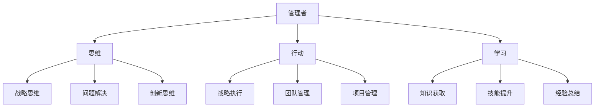

                 

# 管理者必备的三大体系：思维、行动、学习

> 关键词：管理者,思维,行动,学习,组织,战略,执行,个人成长,创新,持续改进

## 1. 背景介绍

### 1.1 问题由来
在现代社会中，管理者在组织中扮演着至关重要的角色。他们的决策和行动直接关系到组织的成败和员工的工作状态。然而，许多管理者常常在实际工作中遇到各种问题，如决策效率低下、执行力差、学习成本高等。这些问题不仅影响到了组织的短期目标，也制约了其长期发展。如何有效提升管理者的能力，成为现代企业关注的焦点。

## 2. 核心概念与联系

### 2.1 核心概念概述

为更好地理解管理者的三大体系，本节将介绍几个密切相关的核心概念：

- 管理者(Manager): 在组织中负责决策和行动，带领团队实现组织目标的个人。
- 思维(Thinking): 管理者的决策过程和思维方式。包括战略思维、问题解决思维、创新思维等。
- 行动(Action): 管理者的执行过程和行为。包括战略执行、团队管理、项目管理等。
- 学习(Learning): 管理者的学习过程和能力提升。包括知识获取、技能提升、经验总结等。

这些核心概念之间的逻辑关系可以通过以下Mermaid流程图来展示：



这个流程图展示了几大核心概念之间的联系：

1. 管理者通过思维、行动、学习三方面能力，实现组织的战略目标。
2. 思维影响行动，决定了管理者如何执行战略和团队管理。
3. 行动又需要学习的支持，管理者需要通过学习来提升执行力。
4. 学习依赖于思维和行动，管理者在执行过程中积累经验，总结知识。

这些概念共同构成了管理者的核心能力框架，使其能够有效应对复杂多变的环境，提升组织的竞争力。

## 3. 核心算法原理 & 具体操作步骤

### 3.1 算法原理概述

管理者三大体系的核心算法原理主要围绕着以下几个方面展开：

1. 思维：通过系统性的思维模型和工具，帮助管理者进行战略规划和问题解决。
2. 行动：通过项目管理、团队管理和战略执行等方法，确保行动的效率和效果。
3. 学习：通过知识获取、技能提升和经验总结，帮助管理者持续改进和提升。

### 3.2 算法步骤详解

#### 3.2.1 思维体系

管理者首先需要通过思维体系，提升其战略思维和问题解决能力。以下是思维体系构建的步骤：

1. **战略规划**：使用SWOT分析、PEST分析等方法，对组织的内部优势、劣势、机会和威胁进行分析，确定组织的目标和战略方向。
2. **问题解决**：通过逻辑推理、数据分析等方法，识别和解决组织面临的各种问题，确保战略的顺利实施。
3. **创新思维**：采用蓝海战略、设计思维等工具，激发创新灵感，推动组织不断创新，保持竞争力。

#### 3.2.2 行动体系

管理者需要在思维的基础上，通过行动体系，提升其执行力和团队管理能力。以下是行动体系构建的步骤：

1. **战略执行**：将组织的战略目标分解为具体的行动计划，确保每个部门和员工都清楚自己的任务和目标。
2. **团队管理**：采用OKR、KPI等方法，对团队进行目标管理和绩效评估，提升团队协作和执行效率。
3. **项目管理**：使用敏捷开发、Scrum等方法，对项目进行高效管理，确保项目按时、按质完成。

#### 3.2.3 学习体系

管理者还需要通过学习体系，不断提升其知识和技能。以下是学习体系构建的步骤：

1. **知识获取**：通过阅读、培训、学习其他组织的成功经验等方法，获取相关的知识和技能。
2. **技能提升**：通过实践、反思、反复训练等方法，不断提升管理者的实际操作能力和经验。
3. **经验总结**：通过记录、分享、分析失败案例等方法，总结经验教训，避免再次犯错。

### 3.3 算法优缺点

三大体系的算法具有以下优点：

1. **系统性**：通过思维、行动、学习三方面的协同，系统性地提升管理者的能力，确保组织目标的实现。
2. **可操作性**：每个体系的具体步骤和方法都可以被明确执行，帮助管理者进行实际操作。
3. **持续改进**：通过不断的学习，管理者可以持续改进和提升，适应环境的变化。

同时，该方法也存在一定的局限性：

1. **复杂度高**：三大体系的构建和实施需要较高的时间和资源投入，对管理者的要求较高。
2. **执行难度**：在实际应用中，管理者需要具备较强的执行力和自律性，才能确保体系的有效性。
3. **反馈延迟**：学习和改进的过程往往需要较长时间，管理者的反馈和改进效果可能存在延迟。

尽管存在这些局限性，但就目前而言，三大体系是管理者能力提升的最主流范式。未来相关研究的重点在于如何进一步降低体系的复杂度，提高执行效果，同时兼顾灵活性和可持续性等因素。

### 3.4 算法应用领域

管理者三大体系已经在诸多领域得到了应用，包括但不限于：

- 企业战略规划
- 项目管理
- 团队建设
- 创新驱动
- 持续改进

这些体系的应用，使得组织能够更好地应对各种复杂环境，提升竞争力，实现长远发展。

## 4. 数学模型和公式 & 详细讲解

### 4.1 数学模型构建

本节将使用数学语言对管理者的三大体系进行更加严格的刻画。

- **思维模型**：
  - **SWOT分析**：
    $$
    SWOT = \begin{bmatrix}
    优势 & 劣势 & 机会 & 威胁 \\
    内部 & 内部 & 外部 & 外部
    \end{bmatrix}
    $$
  - **PEST分析**：
    $$
    PEST = \begin{bmatrix}
    政治(Political) & 经济(Economic) & 社会(Social) & 技术(Technological)
    \end{bmatrix}
    $$
  - **蓝海战略**：
    $$
    蓝海 = \begin{bmatrix}
    未知市场 & 未利用价值 & 创新业务模型 & 新市场规则
    \end{bmatrix}
    $$

- **行动模型**：
  - **OKR管理法**：
    $$
    OKR = \begin{bmatrix}
    Objective & Key Results
    \end{bmatrix}
    $$
  - **敏捷开发**：
    $$
    敏捷开发 = \begin{bmatrix}
    迭代开发 & 持续反馈 & 跨职能团队 & 自动化测试
    \end{bmatrix}
    $$

- **学习模型**：
  - **知识获取**：
    $$
    知识获取 = \begin{bmatrix}
    阅读材料 & 培训课程 & 案例研究 & 外部经验
    \end{bmatrix}
    $$
  - **技能提升**：
    $$
    技能提升 = \begin{bmatrix}
    实践操作 & 反思总结 & 反复训练 & 专家指导
    \end{bmatrix}
    $$
  - **经验总结**：
    $$
    经验总结 = \begin{bmatrix}
    记录日志 & 分享案例 & 数据分析 & 失败案例
    \end{bmatrix}
    $$

### 4.2 公式推导过程

以OKR管理法为例，推导其数学模型和推导过程：

1. **定义目标**：
   $$
   Objective = \begin{bmatrix}
   目标 & 优先级 & 期限
   \end{bmatrix}
   $$
2. **设定关键结果**：
   $$
   Key Results = \begin{bmatrix}
   关键结果 & 度量指标 & 实现方式
   \end{bmatrix}
   $$
3. **推导评估公式**：
   $$
   评估公式 = \begin{bmatrix}
   KPI & 度量结果 & 完成情况
   \end{bmatrix}
   $$

### 4.3 案例分析与讲解

**案例一：某大型企业的战略规划**

- **背景**：一家大型制造企业，面临产品同质化竞争加剧、市场需求变化快的挑战。
- **分析**：使用SWOT分析，确定企业的优势、劣势、机会和威胁，明确战略方向。
- **决策**：基于PEST分析，结合内部资源和外部环境，制定具体战略措施。

**案例二：某互联网公司的项目执行**

- **背景**：一家互联网公司，负责开发一款新产品，时间紧、任务重。
- **分析**：采用敏捷开发方法，通过迭代开发、持续反馈、跨职能团队合作，确保项目按时完成。
- **执行**：通过定期回顾和改进，优化开发流程，提升项目质量。

## 5. 项目实践：代码实例和详细解释说明

### 5.1 开发环境搭建

在进行三大体系实践前，我们需要准备好开发环境。以下是使用Python进行项目开发的环境配置流程：

1. 安装Anaconda：从官网下载并安装Anaconda，用于创建独立的Python环境。
2. 创建并激活虚拟环境：
```bash
conda create -n managerial-env python=3.8 
conda activate managerial-env
```
3. 安装必要的Python库：
```bash
pip install pandas numpy matplotlib sklearn jupyter notebook
```

完成上述步骤后，即可在`managerial-env`环境中开始项目开发。

### 5.2 源代码详细实现

下面以OKR管理法为例，给出Python代码实现：

```python
import pandas as pd

# 定义OKR管理法数据结构
class OKR:
    def __init__(self, objective, key_results):
        self.objective = objective
        self.key_results = key_results

    def set_objective(self, objective):
        self.objective = objective

    def set_key_results(self, key_results):
        self.key_results = key_results

    def get_evaluation(self):
        return self.key_results

# 创建OKR实例
okr = OKR("", "")

# 设置目标
okr.set_objective("提高产品市场份额到20%")

# 设定关键结果
okr.set_key_results([["实现月销量增长10%", "KPI: 销量", "策略: 提高广告投放"], ["提升用户满意度至90%", "KPI: NPS", "策略: 用户反馈改进"]])

# 输出评估结果
print(okr.get_evaluation())
```

### 5.3 代码解读与分析

**OKR管理法代码实现**：

- **类定义**：定义了一个OKR类，包含目标和关键结果两个属性，以及设置和获取方法。
- **实例化**：创建一个OKR实例，并通过set方法设置目标和关键结果。
- **评估输出**：调用get_evaluation方法，输出当前OKR的评估结果。

**代码解读**：

- **目标设置**：通过set_objective方法，设置OKR的目标，如“提高产品市场份额到20%”。
- **关键结果设定**：通过set_key_results方法，设定实现目标的关键结果，如“实现月销量增长10%”和“提升用户满意度至90%”。
- **评估输出**：通过get_evaluation方法，获取当前OKR的评估结果，输出为“[[实现月销量增长10%: KPI: 销量, 策略: 提高广告投放], [提升用户满意度至90%: KPI: NPS, 策略: 用户反馈改进]]”。

## 6. 实际应用场景

### 6.1 企业战略规划

三大体系的应用，使得企业能够在复杂多变的环境中，制定科学的战略规划，确保组织的长期发展。

在技术实现上，可以利用数据分析工具，对内外部环境进行量化分析，辅助管理者进行决策。例如，使用机器学习模型对市场趋势进行预测，使用SWOT和PEST分析法，进行全面的战略评估。通过定量和定性分析的结合，使管理者能够做出更加精准的战略决策。

### 6.2 项目管理

在项目管理中，敏捷开发和OKR管理法等方法，能够帮助管理者高效管理项目进度和团队资源，确保项目按时完成。

具体而言，项目管理工具可以将OKR分解为具体的任务和关键结果，并通过敏捷开发的方法，进行迭代开发和持续反馈。管理者和团队成员可以实时更新进展，进行定期的回顾和改进，确保项目的顺利进行。

### 6.3 团队建设

在团队建设中，三大体系的应用，能够帮助管理者提升团队的协作效率和执行能力。

通过SWOT和PEST分析，管理者可以了解团队的优势和劣势，制定相应的改进计划。通过OKR管理法，将团队目标和个人目标有机结合，提升团队的工作动力和执行效果。通过持续的学习和反馈，管理者可以不断优化团队结构和协作方式，提升整体绩效。

## 7. 工具和资源推荐

### 7.1 学习资源推荐

为了帮助管理者系统掌握三大体系的原理和实践技巧，这里推荐一些优质的学习资源：

1. **《管理学原理》**：经典的管理学教材，系统介绍了管理学的基本概念和理论。
2. **《创新者的窘境》**：深入探讨了创新的管理和实践，提出了蓝海战略等前沿思想。
3. **《敏捷开发实践》**：介绍了敏捷开发的核心思想和方法，帮助管理者提升项目管理能力。
4. **《OKR管理法》**：介绍了OKR管理法的原理和实践方法，帮助管理者提升团队管理能力。
5. **《Python数据分析实战》**：介绍了Python在数据分析中的应用，帮助管理者提升数据驱动决策能力。

通过对这些资源的学习实践，相信管理者一定能够快速掌握三大体系的精髓，并用于解决实际的管理问题。

### 7.2 开发工具推荐

高效的开发离不开优秀的工具支持。以下是几款用于三大体系开发的常用工具：

1. **Jupyter Notebook**：免费的交互式开发环境，支持Python代码的快速迭代和展示。
2. **Python**：免费的开源编程语言，具有强大的数据分析和机器学习能力。
3. **TensorFlow**：由Google主导开发的深度学习框架，生产部署方便，支持敏捷开发和OKR管理法的实现。
4. **Scrum**：敏捷开发的流行管理方法，帮助管理者进行高效的项目管理和团队协作。
5. **OKR管理工具**：如Trello、Asana等，支持OKR的目标设定、关键结果管理和进度跟踪。

合理利用这些工具，可以显著提升三大体系的开发效率，加快创新迭代的步伐。

### 7.3 相关论文推荐

三大体系的发展源于学界的持续研究。以下是几篇奠基性的相关论文，推荐阅读：

1. **《管理学：原理与实践》**：由管理学大师亨利·明茨伯格（Henry Mintzberg）所著，全面介绍了管理学的基本概念和实践方法。
2. **《创新与破坏：如何改变世界》**：深入探讨了创新的管理和实践，提出了蓝海战略等前沿思想。
3. **《敏捷软件开发：原则、模式和实践》**：介绍了敏捷开发的核心思想和方法，帮助管理者提升项目管理能力。
4. **《OKR：关键结果法》**：介绍了OKR管理法的原理和实践方法，帮助管理者提升团队管理能力。
5. **《数据分析：理论与应用》**：介绍了数据分析的核心思想和方法，帮助管理者提升数据驱动决策能力。

这些论文代表了大三大体系的发展脉络。通过学习这些前沿成果，可以帮助管理者把握学科前进方向，激发更多的创新灵感。

## 8. 总结：未来发展趋势与挑战

### 8.1 总结

本文对管理者三大体系的原理和实践进行了全面系统的介绍。首先阐述了三大体系的核心概念和相互关系，明确了其在组织管理中的重要价值。其次，从原理到实践，详细讲解了三大体系的数学模型和具体步骤，给出了详细的代码实现和案例分析。同时，本文还广泛探讨了三大体系在企业战略规划、项目管理、团队建设等实际场景中的应用前景，展示了其在提升组织竞争力中的巨大潜力。此外，本文精选了三大体系的各类学习资源，力求为管理者提供全方位的技术指引。

通过本文的系统梳理，可以看到，三大体系是管理者能力提升的最主流范式，极大地拓展了管理者的决策和执行能力，提升了组织的整体绩效。未来，伴随管理技术的不断演进，管理者三大体系还将继续引领组织管理的发展，为构建高绩效、高灵活性的组织提供重要保障。

### 8.2 未来发展趋势

展望未来，三大体系的发展趋势如下：

1. **数字化转型**：随着数字化技术的普及，管理者将更多地依赖数据分析、人工智能等技术手段，提升决策的科学性和效率。
2. **敏捷化管理**：敏捷开发、OKR管理法等方法将成为主流，管理者需要更加灵活地应对环境变化。
3. **跨职能协作**：管理者需要更加注重团队协作和跨职能合作，提升整体组织能力。
4. **文化创新**：在创新驱动的市场环境中，管理者需要注重组织文化的建设，激发员工的创造力和积极性。
5. **可持续发展**：管理者需要更加注重组织的可持续发展，关注社会责任和环境影响。

这些趋势将进一步推动三大体系的应用和演进，帮助管理者更好地应对复杂多变的环境，提升组织竞争力。

### 8.3 面临的挑战

尽管三大体系在实际应用中取得了一定的成效，但在迈向更加智能化、普适化管理的过程中，仍面临诸多挑战：

1. **数据质量问题**：数据分析依赖于高质量的数据，但在实际应用中，数据质量往往难以保证，影响了管理决策的准确性。
2. **执行难度大**：敏捷开发、OKR管理法等方法虽然高效，但对管理者的执行力和自律性要求较高，实施难度较大。
3. **文化冲突**：组织文化与新管理方法的冲突，可能导致变革阻力，影响新方法的推广和应用。
4. **资源投入高**：数字化转型、跨职能协作等方法需要较高的资源投入，对组织的管理成本提出了挑战。
5. **持续改进难**：组织在快速变化的环境中，需要持续改进和优化，但实际应用中往往难以实现持续改进。

这些挑战需要在实践中不断探索和克服，才能确保三大体系的长期有效性和可持续性。

### 8.4 研究展望

面向未来，管理三大体系的进一步研究可以从以下几个方向展开：

1. **数据治理**：提升数据质量，建立数据治理机制，确保数据分析的准确性和可靠性。
2. **执行工具**：开发更加易用、高效的执行工具，降低管理者实施三大体系的难度。
3. **文化融合**：通过企业文化建设，促进新管理方法与组织文化的融合，减少变革阻力。
4. **资源优化**：探索优化资源投入的方法，降低管理成本，提高管理效率。
5. **持续改进**：建立持续改进的机制和工具，确保组织在快速变化的环境中保持竞争力。

这些研究方向将有助于管理者三大体系的进一步优化和应用，推动管理技术的不断进步。

## 9. 附录：常见问题与解答

**Q1：管理者如何系统地学习三大体系？**

A: 管理者可以通过系统性的学习和实践，逐步掌握三大体系的核心思想和方法。以下是具体步骤：

1. **理论学习**：系统学习相关管理学书籍和论文，如《管理学原理》、《创新者的窘境》等。
2. **实践操作**：在实际工作中，逐步应用三大体系的方法，如SWOT分析、敏捷开发、OKR管理法等。
3. **反思总结**：定期进行反思和总结，记录学习过程和改进效果，不断优化和提升。

**Q2：OKR管理法如何与敏捷开发结合使用？**

A: OKR管理法与敏捷开发可以结合使用，共同提升项目管理效果。具体步骤如下：

1. **目标设定**：使用OKR管理法，设定项目的关键结果和度量指标。
2. **迭代开发**：将项目目标分解为多个迭代任务，每个迭代周期内进行持续反馈和改进。
3. **回顾改进**：在每个迭代结束后，进行回顾和总结，优化下一步迭代的目标和任务。

**Q3：如何在数字化转型中应用三大体系？**

A: 在数字化转型中，管理者可以通过三大体系的数字化工具和方法，提升决策和执行能力。具体步骤如下：

1. **数据驱动决策**：利用数据分析工具，对内外部环境进行量化分析，辅助决策。
2. **自动化执行**：使用敏捷开发、Scrum等工具，进行数字化项目的快速迭代和反馈。
3. **数字化平台**：搭建数字化管理平台，支持OKR、敏捷开发等方法的实现。

**Q4：如何克服三大体系实施中的文化冲突？**

A: 在实施三大体系时，管理者需要注意文化融合，逐步推进变革。具体步骤如下：

1. **文化调研**：了解组织现有文化，识别可能存在的文化冲突。
2. **沟通宣导**：通过沟通和宣导，让员工理解三大体系的优势和必要性。
3. **渐进推进**：从局部试点开始，逐步推广三大体系，减少变革阻力。

**Q5：管理者如何在管理三大体系中不断学习和改进？**

A: 管理者需要在三大体系的应用中，不断学习和改进，提升自身能力。具体步骤如下：

1. **持续学习**：参加管理培训课程、读书、交流等，不断提升自身知识和技能。
2. **反思总结**：定期进行反思和总结，记录管理过程中的经验和教训，不断优化方法。
3. **借鉴他人**：学习其他优秀企业的管理经验，借鉴其成功案例，提升自身管理水平。

**Q6：如何提高管理者三大体系的执行效果？**

A: 提高管理者三大体系的执行效果，需要从多方面入手，具体步骤如下：

1. **明确目标**：确保目标设定清晰，具有可执行性和可衡量性。
2. **持续反馈**：建立持续反馈机制，及时调整和优化管理方法。
3. **团队协作**：加强团队协作，建立高效的跨职能合作机制。
4. **激励机制**：建立有效的激励机制，激发员工的积极性和创造力。

通过以上步骤，管理者可以系统性地学习和应用三大体系，逐步提升自身的管理能力，推动组织的持续发展。

---

作者：禅与计算机程序设计艺术 / Zen and the Art of Computer Programming

