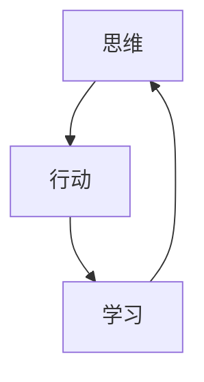

                 

# 管理者必备的三大体系：思维、行动、学习

管理是一门复杂的艺术，涉及战略规划、团队建设、资源分配、绩效评估等众多方面。一个优秀的管理者，除了具备丰富的实践经验，更应该掌握一套系统化的管理框架，以提升管理效果和组织竞争力。本文将详细介绍管理者必备的三个核心体系：思维、行动、学习，帮助读者构建完整的管理工具箱，提升管理能力和领导水平。

## 1. 背景介绍

### 1.1 问题由来

在当今快速变化、充满不确定性的商业环境中，管理者面临的挑战越来越复杂。如何在资源有限的情况下，制定科学的决策，带领团队实现业绩突破，成为每个管理者的必修课。然而，多数管理者往往缺乏系统的管理理论支持，依靠直觉和经验进行管理，导致决策失误、团队士气低下、资源浪费等问题频发。

为了帮助管理者系统掌握管理知识，本文将详细介绍三大核心体系：思维、行动、学习。这些体系不仅适用于个人管理，也适用于组织战略和流程管理，是管理者必备的框架。

## 2. 核心概念与联系

### 2.1 核心概念概述

- **思维**：指管理者运用科学方法和逻辑思维，制定合理的决策和计划。包括战略思维、分析思维、创新思维等，是管理决策的基础。

- **行动**：指管理者将决策和计划转化为具体的执行步骤，包括资源分配、团队建设、绩效管理等。是落实决策、实现目标的重要环节。

- **学习**：指管理者通过不断学习、反思和调整，提升自身管理能力和组织竞争力。包括知识更新、技能提升、文化建设等，是持续改进、适应变化的关键。

这三个体系相互关联，共同构成一个完整的管理循环。思维决定行动，行动验证思维；同时，持续学习不断优化思维和行动，形成一个动态的良性循环。

### 2.2 核心概念原理和架构的 Mermaid 流程图



这张流程图展示了思维、行动和学习的相互关系。思维指导行动，行动反馈学习，学习进一步优化思维，形成一个持续循环。

## 3. 核心算法原理 & 具体操作步骤

### 3.1 算法原理概述

管理者三大体系的应用，基于一系列科学的原理和模型。本节将详细介绍这些原理和模型，帮助读者更好地理解管理流程和实践方法。

- **思维体系**：基于系统思考、因果分析、问题解决等理论，帮助管理者制定科学合理的决策和计划。
- **行动体系**：基于项目管理、人力资源管理、绩效管理等模型，确保决策和计划得到高效执行。
- **学习体系**：基于知识管理、反馈循环、组织学习等理论，推动管理者持续改进，提升组织竞争力。

### 3.2 算法步骤详解

#### 3.2.1 思维体系

**步骤1：系统思考**  
- 利用系统思考方法，全面分析组织内外环境，识别关键驱动因素和制约因素。
- 绘制因果图，明确各因素之间的相互作用关系。

**步骤2：因果分析**  
- 应用因果分析模型，深入挖掘问题的根本原因，找到解决方案。
- 通过五问法等工具，逐步排除表面现象，直击问题本质。

**步骤3：问题解决**  
- 应用问题解决模型，如PDCA循环，制定解决问题的步骤和措施。
- 利用SWOT分析，评估不同方案的优劣，选择最佳路径。

#### 3.2.2 行动体系

**步骤1：项目规划**  
- 制定详细的项目计划，包括目标、资源、时间表、里程碑等。
- 应用甘特图、PERT图等工具，优化资源分配和进度安排。

**步骤2：团队管理**  
- 构建高效的团队结构，明确职责分工和协作机制。
- 应用OKR目标管理方法，设定具体、可衡量的团队目标，激励团队成员。

**步骤3：绩效管理**  
- 设定明确的绩效指标，定期评估团队和个人绩效。
- 应用KPI、BSC等方法，进行绩效分析和反馈改进。

#### 3.2.3 学习体系

**步骤1：知识管理**  
- 建立知识库，收集、整理、共享组织内部知识。
- 应用知识管理系统，如Confluence、SharePoint等，促进知识共享和传承。

**步骤2：反馈循环**  
- 设立绩效评估机制，收集团队和员工的反馈信息。
- 应用PDCA循环，不断调整和优化管理流程和策略。

**步骤3：组织学习**  
- 推动持续学习和改进文化，营造知识型组织。
- 应用行动学习、反思会议等方法，提升组织整体学习能力和竞争力。

### 3.3 算法优缺点

#### 3.3.1 思维体系的优缺点

**优点**：
- **系统性**：通过系统思考和因果分析，管理者能够全面考虑问题，避免片面性。
- **科学性**：应用科学方法和模型，提升决策的准确性和可操作性。
- **前瞻性**：通过问题解决模型，预测未来趋势，制定长远规划。

**缺点**：
- **复杂性**：系统思考和因果分析需要较高的专业技能，对管理者的知识要求较高。
- **耗时性**：应用因果分析模型，需要较长的分析和验证过程。
- **资源需求**：系统思考和问题解决模型，往往需要较多资源和时间投入。

#### 3.3.2 行动体系的优缺点

**优点**：
- **执行性强**：通过项目管理、团队管理和绩效管理等方法，确保决策和计划得到高效执行。
- **效率高**：应用甘特图、PERT图等工具，优化资源分配和进度安排，提升执行效率。
- **适应性强**：通过灵活的项目管理和绩效管理，应对环境变化和不确定性。

**缺点**：
- **执行难度大**：项目管理需要高度的专业技能和经验，对团队要求较高。
- **资源消耗大**：项目管理通常需要较多的资源和时间投入，成本较高。
- **灵活性不足**：过于僵化的项目管理方法，可能限制团队的灵活性和创新性。

#### 3.3.3 学习体系的优缺点

**优点**：
- **持续改进**：通过知识管理和反馈循环，推动管理者持续学习，提升自身能力。
- **竞争力强**：通过组织学习，提升团队整体能力和竞争力。
- **适应性强**：应用行动学习和反思会议，灵活应对变化和挑战。

**缺点**：
- **复杂度高**：知识管理需要较高的技术支持和管理成本，实施难度较大。
- **反馈延迟**：绩效评估和反馈循环需要较长时间，难以快速调整。
- **效果不确定**：学习效果依赖于管理者和学习机制的落实情况，效果难以量化评估。

### 3.4 算法应用领域

管理者三大体系不仅适用于各类企业组织，还广泛应用于政府机构、非营利组织、社会团体等。以下以企业组织为例，详细介绍其具体应用场景：

#### 3.4.1 思维体系应用

**战略规划**：
- 利用系统思考和因果分析，制定长远战略规划，规避市场风险。
- 应用问题解决模型，识别关键问题，制定应对策略。

**问题解决**：
- 应用因果分析和PDCA循环，快速解决生产、质量、客户满意度等问题。
- 利用SWOT分析，评估不同解决方案的优劣，选择最佳路径。

#### 3.4.2 行动体系应用

**项目管理**：
- 应用甘特图和PERT图，制定项目计划和进度安排，确保项目按时完成。
- 应用OKR目标管理方法，设定具体、可衡量的项目目标，激励团队成员。

**团队管理**：
- 构建高效的团队结构，明确职责分工和协作机制。
- 应用绩效管理工具，定期评估团队和个人绩效，提供改进建议。

#### 3.4.3 学习体系应用

**知识管理**：
- 建立知识库，收集、整理、共享组织内部知识。
- 应用知识管理系统，如Confluence、SharePoint等，促进知识共享和传承。

**反馈循环**：
- 设立绩效评估机制，收集团队和员工的反馈信息。
- 应用PDCA循环，不断调整和优化管理流程和策略。

**组织学习**：
- 推动持续学习和改进文化，营造知识型组织。
- 应用行动学习和反思会议，提升团队整体学习能力和竞争力。

## 4. 数学模型和公式 & 详细讲解 & 举例说明

### 4.1 数学模型构建

本节将通过数学模型和公式，深入讲解管理者三大体系的应用原理。

- **思维模型**：利用系统思考、因果分析、问题解决等数学模型，帮助管理者制定科学决策。
- **行动模型**：应用项目管理、人力资源管理、绩效管理等模型，确保决策和计划得到高效执行。
- **学习模型**：基于知识管理、反馈循环、组织学习等模型，推动管理者持续改进。

### 4.2 公式推导过程

#### 4.2.1 系统思考

系统思考基于反馈循环理论，通过绘制因果图和反馈循环图，全面分析系统内外因素的相互作用关系。因果图用于表示各因素之间的因果关系，反馈循环图用于分析系统的动态变化。

- **因果图**：
  $$
  G(C) = \{ (X_i, Y_j) \mid X_i \rightarrow Y_j \in R \}
  $$
  其中 $G(C)$ 表示因果关系集合，$X_i$ 和 $Y_j$ 表示系统内的各个变量，$R$ 表示因果关系集合。

- **反馈循环图**：
  $$
  F(L) = \{ (X_i, Y_j) \mid X_i \leftrightarrow Y_j \in R \}
  $$
  其中 $F(L)$ 表示反馈循环集合，$X_i$ 和 $Y_j$ 表示系统内的各个变量，$R$ 表示反馈关系集合。

#### 4.2.2 因果分析

因果分析基于鱼骨图和五问法等模型，深入挖掘问题的根本原因，找到解决方案。鱼骨图用于识别问题的主因和子因，五问法用于逐步排除表面现象，直击问题本质。

- **鱼骨图**：
  $$
  F(X) = \{ (C_i, F_j) \mid C_i \rightarrow F_j \in R \}
  $$
  其中 $F(X)$ 表示鱼骨图集合，$C_i$ 表示问题的主因，$F_j$ 表示问题的子因，$R$ 表示因果关系集合。

- **五问法**：
  1. **现象是什么？**
  2. **为什么会这样？**
  3. **为什么会发生？**
  4. **最根本的原因是什么？**
  5. **有哪些应对措施？**

#### 4.2.3 问题解决

问题解决基于PDCA循环模型，制定解决问题的步骤和措施，确保问题得到有效解决。PDCA循环包括计划(Plan)、执行(Do)、检查(Check)、调整(Action)四个步骤。

- **计划(Plan)**：
  $$
  P = \{ (T_i, M_i) \mid T_i \rightarrow M_i \in R \}
  $$
  其中 $P$ 表示计划集合，$T_i$ 表示任务，$M_i$ 表示措施，$R$ 表示因果关系集合。

- **执行(Do)**：
  $$
  D = \{ (T_i, A_i) \mid T_i \rightarrow A_i \in R \}
  $$
  其中 $D$ 表示执行集合，$T_i$ 表示任务，$A_i$ 表示行动，$R$ 表示因果关系集合。

- **检查(Check)**：
  $$
  C = \{ (T_i, O_i) \mid T_i \rightarrow O_i \in R \}
  $$
  其中 $C$ 表示检查集合，$T_i$ 表示任务，$O_i$ 表示结果，$R$ 表示因果关系集合。

- **调整(Action)**：
  $$
  A = \{ (T_i, M_i) \mid T_i \rightarrow M_i \in R \}
  $$
  其中 $A$ 表示调整集合，$T_i$ 表示任务，$M_i$ 表示措施，$R$ 表示因果关系集合。

### 4.3 案例分析与讲解

#### 4.3.1 案例一：企业战略规划

某互联网公司面临市场份额下滑的问题，需要进行战略调整。通过系统思考，绘制因果图和反馈循环图，识别出核心问题为市场竞争激烈和内部管理效率低下。进一步利用因果分析，深入挖掘问题的根本原因，发现核心问题为市场定位不准确和团队协作不力。

最终制定了具体的问题解决措施，包括调整市场定位和优化团队协作机制。通过PDCA循环，制定详细的执行计划，并定期评估执行效果，确保战略调整顺利进行。

#### 4.3.2 案例二：项目管理

某软件公司开发一个新的产品，需要进行项目管理。通过项目管理模型，制定详细的项目计划和进度安排，确保项目按时完成。应用甘特图和PERT图，优化资源分配和进度安排，确保项目按时完成。

通过OKR目标管理方法，设定具体、可衡量的项目目标，激励团队成员。定期评估项目进展和团队绩效，调整项目计划和资源分配，确保项目顺利进行。

## 5. 项目实践：代码实例和详细解释说明

### 5.1 开发环境搭建

在进行管理实践前，我们需要准备好开发环境。以下是使用Python进行代码开发的环境配置流程：

1. 安装Anaconda：从官网下载并安装Anaconda，用于创建独立的Python环境。

2. 创建并激活虚拟环境：
```bash
conda create -n pyenv python=3.8 
conda activate pyenv
```

3. 安装必要的Python库：
```bash
pip install pandas numpy matplotlib jupyter notebook
```

完成上述步骤后，即可在`pyenv`环境中开始管理实践。

### 5.2 源代码详细实现

以下是使用Python和Jupyter Notebook进行系统思考和因果分析的代码实现：

```python
import pandas as pd
import matplotlib.pyplot as plt

# 导入数据
data = pd.read_csv('causal_relationship.csv')

# 绘制因果图
def draw_cause_effect_graph(data):
    # 获取变量集合
    X = data.columns[:-1]
    Y = data.columns[-1]
    
    # 绘制因果图
    graph = nx.DiGraph()
    
    for i, row in data.iterrows():
        graph.add_node(X[i])
        graph.add_node(Y)
        graph.add_edge(X[i], Y)
    
    # 绘制图形
    pos = nx.spring_layout(graph)
    nx.draw(graph, pos=pos, with_labels=True)
    plt.show()

# 绘制反馈循环图
def draw_feedback_loop_graph(data):
    # 获取变量集合
    X = data.columns[:-1]
    Y = data.columns[-1]
    
    # 绘制反馈循环图
    graph = nx.DiGraph()
    
    for i, row in data.iterrows():
        graph.add_node(X[i])
        graph.add_node(Y)
        graph.add_edge(X[i], Y)
        graph.add_edge(Y, X[i])
    
    # 绘制图形
    pos = nx.spring_layout(graph)
    nx.draw(graph, pos=pos, with_labels=True)
    plt.show()

# 使用样例数据
data = pd.DataFrame({
    'Customer_Satisfaction': ['Low', 'Medium', 'High'],
    'Customer_Retention_Rate': ['Low', 'Medium', 'High'],
    'Employee_Satisfaction': ['Low', 'Medium', 'High'],
    'Sales': ['Low', 'Medium', 'High']
})

# 绘制因果图
draw_cause_effect_graph(data)

# 绘制反馈循环图
draw_feedback_loop_graph(data)
```

### 5.3 代码解读与分析

让我们再详细解读一下关键代码的实现细节：

- `draw_cause_effect_graph`函数：用于绘制因果图，将数据集中的变量集合表示为节点，变量之间的关系表示为有向边。
- `draw_feedback_loop_graph`函数：用于绘制反馈循环图，将变量之间的关系设置为双向循环。
- 导入数据和定义函数后，使用样例数据进行演示，分别绘制出因果图和反馈循环图。

通过这些代码，可以直观地展示系统思考和因果分析的原理和步骤。

## 6. 实际应用场景

### 6.1 智能客服系统

基于管理者三大体系，智能客服系统能够实现高效的管理和运营。系统通过系统思考，全面分析客户服务的关键因素，如响应速度、服务质量、客户满意度等。应用因果分析和PDCA循环，制定具体的客户服务改进措施，提升服务质量和客户满意度。

同时，应用项目管理方法，制定详细的服务流程和目标，确保客服系统的高效运营。通过持续学习和反馈机制，不断优化客服流程和策略，提升整体服务水平。

### 6.2 金融舆情监测

在金融舆情监测领域，管理者三大体系同样发挥着重要作用。通过系统思考和因果分析，全面分析市场舆情的关键因素，如新闻报道、社交媒体、分析师评论等。应用因果分析和PDCA循环，制定具体的舆情监测和应对措施，提升舆情监测的准确性和及时性。

应用项目管理方法，制定详细的舆情监测计划和目标，确保监测系统的高效运行。通过持续学习和反馈机制，不断优化舆情监测策略，提升整体舆情应对能力。

### 6.3 生产运营管理

在生产运营管理领域，管理者三大体系能够提升生产效率和产品质量。通过系统思考和因果分析，全面分析生产运营的关键因素，如设备维护、人员培训、生产流程等。应用因果分析和PDCA循环，制定具体的生产改进措施，提升生产效率和产品质量。

应用项目管理方法，制定详细的操作流程和目标，确保生产运营的高效运行。通过持续学习和反馈机制，不断优化生产流程和策略，提升整体生产效率。

## 7. 工具和资源推荐

### 7.1 学习资源推荐

为了帮助管理者系统掌握管理知识，以下是一些优质的学习资源：

1. 《管理的实践》：彼得·德鲁克著作，系统介绍了管理者的核心职责和实践方法。
2. 《领导力挑战》：约翰·麦克斯韦著作，帮助管理者提升领导力和团队协作能力。
3. 《系统思考》：彼得·圣吉著作，介绍系统思考的基本原理和应用方法。
4. 《因果分析》：道格拉斯·威特著作，深入讲解因果分析和问题解决的模型和方法。
5. 《项目管理》：托马斯·弗里曼著作，系统介绍项目管理的基本原理和工具。

### 7.2 开发工具推荐

以下是几款用于管理实践开发的常用工具：

1. Jupyter Notebook：开源的交互式编程环境，支持Python、R等多种编程语言，适合数据分析和管理实践。
2. Microsoft Excel：广泛使用的电子表格软件，支持数据处理、分析和管理。
3. Microsoft Power BI：强大的商业智能工具，支持数据分析、可视化和决策支持。
4. Tableau：流行的数据可视化工具，支持多种数据源和图表展示。
5. GitHub：全球最大的代码托管平台，适合管理项目和代码协作。

### 7.3 相关论文推荐

管理者三大体系的研究，源于学界的持续探索。以下是几篇奠基性的相关论文，推荐阅读：

1. 《系统思考：思维范式与实践方法》：彼得·圣吉，介绍系统思考的基本原理和应用方法。
2. 《因果分析模型与实际应用》：约翰·麦克斯韦，深入讲解因果分析和问题解决的模型和方法。
3. 《项目管理：理论与实践》：托马斯·弗里曼，系统介绍项目管理的基本原理和工具。
4. 《持续学习与组织创新》：道格拉斯·威特，深入探讨持续学习和组织创新的实践方法。

## 8. 总结：未来发展趋势与挑战

### 8.1 总结

本文对管理者必备的三大体系：思维、行动、学习，进行了全面系统的介绍。首先阐述了三大体系的应用背景和意义，明确了其在管理决策、执行和改进中的核心作用。其次，从原理到实践，详细讲解了系统思考、因果分析、项目管理、绩效管理、知识管理等核心方法，给出了具体的代码实现和案例分析。同时，本文还广泛探讨了三大体系在智能客服、金融舆情、生产运营等实际场景中的应用前景，展示了其在管理实践中的巨大潜力。最后，本文精选了相关的学习资源、开发工具和论文，为管理者提供了全面的学习路径和实践工具。

通过本文的系统梳理，可以看到，管理者三大体系是提升管理效果和组织竞争力的重要工具。这些体系的科学应用，能够帮助管理者系统思考、高效执行和持续改进，推动企业实现长远发展和持续进步。

### 8.2 未来发展趋势

展望未来，管理者三大体系将呈现以下几个发展趋势：

1. **系统思考的普及**：随着系统思考理论的普及和应用，越来越多的管理者将采用系统思维方法，全面分析和解决问题。

2. **因果分析的深化**：因果分析将成为管理决策的重要工具，帮助管理者深入挖掘问题的本质，制定科学决策。

3. **项目管理的方法论**：项目管理将进一步优化，采用敏捷管理、精益管理等方法论，提升项目执行效率和效果。

4. **绩效管理的精细化**：绩效管理将更加注重目标设定、过程跟踪和结果评估，提升管理绩效。

5. **知识管理的智能化**：知识管理系统将更加智能化，支持数据挖掘、自然语言处理等技术，提升知识管理效果。

6. **组织学习的创新**：组织学习将更多地采用行动学习、反思会议等创新方法，推动组织持续改进和创新。

以上趋势凸显了管理者三大体系的广泛应用前景，这些方向的探索发展，必将进一步提升管理水平和组织竞争力。

### 8.3 面临的挑战

尽管管理者三大体系的应用前景广阔，但在实际落地过程中，仍然面临诸多挑战：

1. **知识和技能缺口**：管理者需要具备系统思考、因果分析、项目管理等多方面的知识和技能，而不同管理者的知识水平不一，缺乏系统的培训和实践。

2. **组织文化差异**：不同组织的企业文化和管理风格不同，系统思考、项目管理等方法可能面临不同程度的抵触和挑战。

3. **技术和资源限制**：知识管理、项目管理等方法需要一定的技术和资源投入，对小微企业和管理者来说，可能存在一定的资源限制。

4. **反馈机制不畅**：绩效管理和反馈机制需要建立健全的机制，而在实际管理中，往往存在信息不对称、反馈延迟等问题。

5. **持续改进困难**：持续学习和改进需要管理者具备较强的自我反思和调整能力，而许多管理者难以坚持长期改进。

这些挑战需要管理者不断学习和探索，积极应对，才能充分发挥三大体系的作用。

### 8.4 研究展望

面对管理者三大体系所面临的挑战，未来的研究需要在以下几个方面寻求新的突破：

1. **系统思考的普及和推广**：通过教育和培训，提高管理者的系统思考能力，推广系统思考方法。

2. **因果分析的深化和工具化**：开发更简单、易用的因果分析工具，帮助管理者深入挖掘问题的本质。

3. **项目管理的方法创新**：探索敏捷管理、精益管理等方法，提升项目管理效率和效果。

4. **绩效管理的精细化和智能化**：利用大数据和人工智能技术，提升绩效管理的精细化和智能化水平。

5. **知识管理的智能化和社区化**：建立智能化知识管理系统，支持社区化知识共享和协作。

6. **组织学习的创新和方法优化**：探索更多创新学习方法，如行动学习、反思会议等，提升组织学习的实效性。

这些研究方向的探索，必将引领管理者三大体系走向成熟，推动组织管理水平和竞争力的提升。面向未来，管理者需要不断学习和创新，将三大体系应用到实际管理中，才能真正实现管理效能的提升和组织目标的实现。

## 9. 附录：常见问题与解答

**Q1：管理者三大体系是否适用于所有类型的组织？**

A: 管理者三大体系不仅适用于企业组织，还广泛应用于政府机构、非营利组织、社会团体等。不同类型的组织在应用三大体系时，需要根据实际情况进行适当调整和优化。

**Q2：管理者如何在资源有限的情况下应用三大体系？**

A: 管理者可以通过精细化管理、优先级排序、资源共享等方法，合理分配资源，确保三大体系的有效应用。同时，可以采用敏捷管理、精益管理等方法，提高资源利用效率。

**Q3：管理者三大体系是否需要持续学习？**

A: 管理者三大体系需要持续学习和改进，以适应外部环境的变化和组织内部的发展。管理者应定期进行自我反思和知识更新，推动组织持续进步。

**Q4：管理者三大体系如何应对复杂多变的环境？**

A: 管理者三大体系的核心在于系统思考和因果分析，能够帮助管理者全面分析问题，制定科学决策。在复杂多变的环境中，管理者应灵活应用三大体系，及时调整策略，以应对不确定性和风险。

**Q5：管理者三大体系如何推动组织创新？**

A: 管理者三大体系通过系统思考、因果分析、持续学习等方法，推动组织不断创新和改进。管理者应鼓励团队提出创新建议，利用反馈机制不断优化管理流程和策略，提升组织整体创新能力。

---

作者：禅与计算机程序设计艺术 / Zen and the Art of Computer Programming

