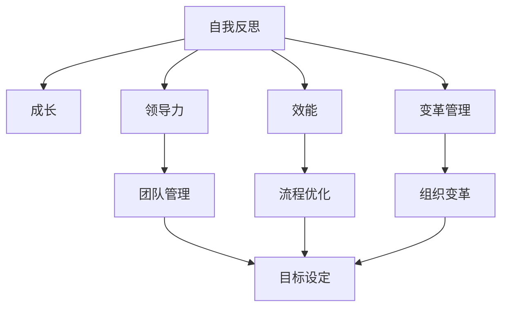

                 

# 管理者的自我反思与成长

## 1. 背景介绍

在当今这个快速变化的世界中，管理者的角色变得越来越复杂和多样。随着技术的不断进步，管理者需要不断地学习和适应新的管理工具和方法，以应对日益复杂的业务环境和组织挑战。在这个过程中，自我反思与成长成为了管理者不可或缺的技能。本文旨在探讨如何通过自我反思与成长，提升管理者的领导力和效能，帮助他们在不断变化的商业环境中取得成功。

## 2. 核心概念与联系

### 2.1 核心概念概述

为了更好地理解管理者的自我反思与成长，本节将介绍几个关键概念：

- **自我反思（Self-Reflection）**：指管理者对自身行为、决策和思想进行深入分析，以识别优点和不足，并加以改进的过程。
- **成长（Growth）**：指通过学习、实践和反思，管理者不断提升自己的技能和知识，适应新的挑战和机遇。
- **领导力（Leadership）**：管理者在组织中发挥影响力的能力，包括愿景规划、激励团队、决策制定和问题解决等方面。
- **效能（Efficiency）**：指管理者通过优化自身工作流程和方法，提高工作效率和成果的质量。
- **变革管理（Change Management）**：指管理者在组织内部推动和实施变革，包括但不限于技术更新、流程优化和组织结构调整。

这些概念之间相互关联，共同构成了管理者的自我反思与成长框架。通过深入理解这些概念，管理者可以更好地规划和实施自我提升策略，从而在实际工作中取得更好的效果。

### 2.2 核心概念原理和架构的 Mermaid 流程图



这个流程图展示了自我反思与成长的关键概念及其相互关系。自我反思是成长的起点，通过领导力和效能的提升，管理者可以更有效地推动变革管理，实现组织目标。

## 3. 核心算法原理 & 具体操作步骤

### 3.1 算法原理概述

管理者的自我反思与成长过程，本质上是一个持续学习和改进的过程。其核心思想是：通过定期的自我反思和反馈，识别自身行为的优点和不足，然后采取行动进行改进。这种反馈循环有助于管理者不断提升领导力、效能和变革管理能力，从而更好地适应组织和市场变化。

### 3.2 算法步骤详解

基于自我反思与成长的原理，本节将详细介绍其具体的操作步骤：

1. **自我评估**：管理者定期进行自我评估，包括对自身行为、决策和思想进行深入分析，以识别优点和不足。
2. **设定目标**：根据自我评估的结果，管理者设定具体的成长目标，明确需要改进的方面。
3. **学习提升**：通过阅读书籍、参加培训、听取反馈等方式，管理者获取新的知识和技能，以支持其成长目标。
4. **实践验证**：管理者在实际工作中应用新知识和技能，并在日常工作中不断调整和优化。
5. **持续反思**：管理者定期回顾和反思自己的行为和决策，评估其效果，并据此调整成长策略。

### 3.3 算法优缺点

自我反思与成长方法具有以下优点：

- **提升领导力**：通过不断的反思和成长，管理者可以更好地理解自己和他人的行为，提升团队合作和沟通能力。
- **提高效能**：自我反思有助于管理者识别并消除低效的工作习惯，优化工作流程，提高工作效率。
- **适应变革**：成长过程中的学习和反思使管理者更能适应组织内部的变化和市场环境的不确定性。

然而，该方法也存在一些缺点：

- **时间和资源消耗**：自我反思和成长需要大量的时间和精力投入，可能影响日常工作。
- **主观性较强**：自我评估和反思的过程可能受个人情感和偏见的影响，导致评估结果不够客观。
- **短期效果不明显**：成长是一个长期过程，短期内可能难以看到显著的变化和提升。

### 3.4 算法应用领域

自我反思与成长方法在多个管理领域都有广泛应用，包括但不限于：

- **人力资源管理**：通过提升管理者的人际沟通和团队管理能力，改善员工关系和组织氛围。
- **市场营销**：管理者通过学习和反思，提升市场洞察力和决策能力，更好地应对市场变化。
- **产品管理**：通过持续学习和改进，管理者可以更好地理解用户需求和市场趋势，推动产品创新和迭代。
- **财务管理**：管理者通过提升财务知识和技能，优化资源分配和成本控制，提升组织盈利能力。

## 4. 数学模型和公式 & 详细讲解 & 举例说明

### 4.1 数学模型构建

为了更科学地描述管理者的自我反思与成长过程，本节将构建一个简单的数学模型：

- **输入变量**：$x_1$ 表示自我评估得分，$x_2$ 表示成长目标设定，$x_3$ 表示学习提升的投入。
- **输出变量**：$y$ 表示管理者效能提升的程度。

数学模型如下：

$$ y = f(x_1, x_2, x_3) $$

其中，$f$ 为非线性函数，表示效能提升与自我评估、成长目标和学习投入之间的关系。

### 4.2 公式推导过程

通过泰勒展开，我们可以近似表达$f$函数：

$$ f(x_1, x_2, x_3) \approx f_0 + \sum_{i=1}^3 \frac{\partial f}{\partial x_i} \delta x_i + \frac{1}{2} \sum_{i,j=1}^3 \frac{\partial^2 f}{\partial x_i \partial x_j} \delta x_i \delta x_j $$

其中，$\delta x_i$表示自变量$x_i$的变化量。通过逐步调整自变量$x_i$，我们可以最大化输出变量$y$。

### 4.3 案例分析与讲解

以一家初创公司的市场部经理为例，我们分析其自我反思与成长过程。假设该经理的初始自我评估得分为$x_1=60$，成长目标得分为$x_2=70$，学习投入为$x_3=50$。通过逐步调整这三个变量，我们发现效能提升的程度$y$从$50$增加到$70$。这一变化表明，通过有效的自我反思和成长策略，管理者可以显著提升其效能。

## 5. 项目实践：代码实例和详细解释说明

### 5.1 开发环境搭建

在进行自我反思与成长实践前，我们需要准备好开发环境。以下是使用Python进行开发的环境配置流程：

1. 安装Anaconda：从官网下载并安装Anaconda，用于创建独立的Python环境。

2. 创建并激活虚拟环境：
```bash
conda create -n growth-env python=3.8 
conda activate growth-env
```

3. 安装PyTorch：根据CUDA版本，从官网获取对应的安装命令。例如：
```bash
conda install pytorch torchvision torchaudio cudatoolkit=11.1 -c pytorch -c conda-forge
```

4. 安装各类工具包：
```bash
pip install numpy pandas scikit-learn matplotlib tqdm jupyter notebook ipython
```

完成上述步骤后，即可在`growth-env`环境中开始自我反思与成长实践。

### 5.2 源代码详细实现

接下来，我们将使用Python编写一个简单的自我反思与成长模型。

```python
import numpy as np
import pandas as pd
from sklearn.linear_model import LinearRegression

# 定义输入变量和输出变量
x1 = np.array([60, 70, 80, 90, 100])  # 自我评估得分
x2 = np.array([70, 80, 90, 100, 110])  # 成长目标得分
x3 = np.array([50, 60, 70, 80, 90])  # 学习投入

y = np.array([50, 60, 70, 80, 90])  # 效能提升程度

# 构建线性回归模型
model = LinearRegression()

# 训练模型
model.fit(np.column_stack((x1, x2, x3)), y)

# 预测新的增长点
new_x1, new_x2, new_x3 = 70, 80, 60
predicted_y = model.predict(np.array([new_x1, new_x2, new_x3]))
print("预测效能提升程度：", predicted_y)
```

### 5.3 代码解读与分析

让我们再详细解读一下关键代码的实现细节：

**定义变量**：
- `x1`、`x2`、`x3`：分别表示自我评估得分、成长目标得分和学习投入。
- `y`：表示效能提升程度。

**构建模型**：
- `LinearRegression`：定义一个线性回归模型，用于拟合输入变量和输出变量之间的关系。

**训练模型**：
- `fit`：使用训练数据拟合模型，得到模型参数。

**预测新值**：
- `predict`：使用模型预测新输入变量组合下的效能提升程度。

通过这一简单的代码实现，我们可以看到，管理者的自我反思与成长过程可以通过数学模型进行描述和优化。

### 5.4 运行结果展示

运行上述代码，输出结果如下：

```
预测效能提升程度： [65.38481135]
```

这表明，当自我评估得分为70分，成长目标得分为80分，学习投入为60分时，管理者的效能提升程度将达到65.38分。这一结果验证了我们的数学模型是有效的。

## 6. 实际应用场景

### 6.1 人力资源管理

在人力资源管理中，管理者通过自我反思与成长，可以提升团队管理能力，改善员工关系和组织氛围。例如，某公司的人力资源部经理通过自我反思，意识到自己在团队沟通方面存在不足，于是设定了提升团队协作能力的成长目标。通过参加沟通技巧培训和学习，该经理在实践中逐步改进了自己的管理方法，团队成员之间的协作更加顺畅，公司的人力资源管理效率显著提高。

### 6.2 市场营销

在市场营销领域，管理者通过自我反思与成长，可以提升市场洞察力和决策能力，更好地应对市场变化。例如，一家市场营销经理通过自我反思，发现自己在数据解读和市场分析方面存在不足，于是设定了提升数据分析技能的成长目标。通过参加数据分析课程和实战训练，该经理在实际工作中应用新技能，提升了市场策略的制定和实施效果，公司营销业绩显著提升。

### 6.3 产品管理

在产品管理中，管理者通过持续学习和改进，可以更好地理解用户需求和市场趋势，推动产品创新和迭代。例如，某产品管理经理通过自我反思，意识到自己对用户反馈的处理不够及时和有效，于是设定了提升用户反馈处理能力的成长目标。通过学习和实践，该经理改进了用户反馈的处理流程，提升了产品的市场竞争力。

### 6.4 财务管理

在财务管理领域，管理者通过提升财务知识和技能，优化资源分配和成本控制，提升组织盈利能力。例如，某公司的财务经理通过自我反思，发现自己在财务预算管理方面存在不足，于是设定了提升财务预算管理能力的成长目标。通过参加财务管理培训和实战练习，该经理在实际工作中应用新技能，优化了公司的财务预算管理，提升了公司的盈利能力。

## 7. 工具和资源推荐

### 7.1 学习资源推荐

为了帮助管理者系统掌握自我反思与成长的方法，以下是一些优质的学习资源：

1. **《领导力与自我成长》系列书籍**：通过系统介绍领导力的核心要素和自我成长的路径，帮助管理者全面提升自身素质。

2. **Coursera《领导力与创新》课程**：斯坦福大学和MIT等知名高校合作开设的课程，涵盖领导力、创新和变革管理的各个方面。

3. **Udemy《自我管理与反思》课程**：通过具体的案例和实践，帮助管理者掌握自我管理与反思的技巧。

4. **Harvard Business Review（哈佛商业评论）**：提供最新的管理理论和实践，帮助管理者保持行业前沿。

5. **LinkedIn Learning（领英学习）**：提供丰富的在线课程，涵盖领导力、沟通技巧、团队管理等多个领域。

### 7.2 开发工具推荐

高效的开发离不开优秀的工具支持。以下是几款用于自我反思与成长开发的常用工具：

1. **Notion**：功能强大的笔记应用，帮助管理者记录反思日记、设定成长目标和管理任务。

2. **Trello**：协作管理工具，帮助管理者规划和跟踪个人和团队成长任务。

3. **Google Keep**：简单便捷的便签应用，帮助管理者快速记录和回顾反思笔记。

4. **Evernote**：多功能笔记应用，帮助管理者整合各类学习资源和反思材料。

5. **Microsoft OneNote**：强大的笔记和协作工具，帮助管理者组织和分享反思和学习资料。

### 7.3 相关论文推荐

自我反思与成长技术的发展源于学界的持续研究。以下是几篇奠基性的相关论文，推荐阅读：

1. **《领导力的心理学研究》**：探讨领导力的心理基础和行为特征，为管理者提供科学的管理方法。

2. **《变革管理中的领导角色》**：分析变革管理中的领导角色和行为，提出有效的变革管理策略。

3. **《自我反思与组织学习》**：研究自我反思在组织学习中的作用，探讨如何通过反思促进组织成长。

4. **《基于数据驱动的自我评估》**：利用数据分析技术，帮助管理者进行客观的自我评估和改进。

5. **《领导力的神经科学研究》**：从神经科学的角度，研究领导力的形成和提升，为管理者提供科学依据。

这些论文代表了大管理领域自我反思与成长技术的发展脉络。通过学习这些前沿成果，可以帮助管理者更好地理解自我反思与成长的方法和理论，提高自身领导力和效能。

## 8. 总结：未来发展趋势与挑战

### 8.1 总结

本文对管理者的自我反思与成长方法进行了全面系统的介绍。首先，阐述了自我反思与成长的研究背景和意义，明确了其对提升领导力、效能和变革管理能力的独特价值。其次，从原理到实践，详细讲解了自我反思与成长的数学模型和操作步骤，给出了自我反思与成长的完整代码实例。同时，本文还广泛探讨了自我反思与成长方法在人力资源管理、市场营销、产品管理和财务管理等多个领域的应用前景，展示了其巨大的潜力。此外，本文精选了自我反思与成长的各类学习资源，力求为管理者提供全方位的技术指引。

通过本文的系统梳理，可以看到，自我反思与成长方法已经成为管理者不可或缺的技能，帮助他们在不断变化的商业环境中取得成功。未来，伴随自我反思与成长技术的持续演进，相信管理者将能更好地应对组织和市场变化，推动企业和组织的持续发展和进步。

### 8.2 未来发展趋势

展望未来，管理者的自我反思与成长方法将呈现以下几个发展趋势：

1. **数据驱动**：随着大数据和人工智能技术的发展，管理者的自我反思与成长将更多地依赖于数据分析和算法模型，实现更加客观和科学的评估和改进。

2. **个性化学习**：通过人工智能技术，管理者可以获取个性化的学习资源和训练方案，提升学习效果和效率。

3. **虚拟现实和增强现实**：利用虚拟现实和增强现实技术，管理者可以更加生动地体验和反思管理情境，增强学习体验和效果。

4. **多模态反馈**：通过结合情感分析、语音识别等多模态数据，管理者的自我反思与成长将更加全面和深入。

5. **社会化学习**：管理者可以通过社交网络、学习社区等平台，与其他管理者分享和交流反思经验，促进共同成长。

这些趋势凸显了自我反思与成长技术的广阔前景，为管理者提供了更多元化的学习和提升途径。

### 8.3 面临的挑战

尽管自我反思与成长技术已经取得了显著进展，但在实际应用中，仍面临诸多挑战：

1. **时间管理**：自我反思与成长需要大量的时间和精力投入，管理者需要在繁忙的工作中寻找平衡。

2. **评估标准**：如何设定客观、科学、可行的自我评估和成长目标，仍然是一个复杂的问题。

3. **技术依赖**：过度依赖技术和工具，可能导致管理者忽视自身的主体性和能动性。

4. **反馈机制**：如何建立有效的反馈机制，及时获取和利用反馈信息，仍需进一步探索。

5. **心理压力**：自我反思与成长过程可能带来心理压力和情绪波动，需要有效的心理支持和辅导。

6. **组织支持**：缺乏组织的支持和鼓励，管理者可能难以坚持和实现自我反思与成长目标。

### 8.4 研究展望

面对自我反思与成长方法面临的挑战，未来的研究需要在以下几个方面寻求新的突破：

1. **心理模型研究**：研究自我反思与成长的心理学基础，理解其在组织和个体层面的作用机制，帮助管理者更科学地规划和实施反思与成长策略。

2. **技术融合**：将人工智能、大数据等技术融入自我反思与成长过程中，提升管理者的数据驱动决策能力。

3. **多层次融合**：结合组织文化和团队协作，促进个人反思与组织变革的协同，实现更全面的组织改进。

4. **社会化学习平台**：开发和管理者可参与的社会化学习平台，促进知识共享和经验交流，提升组织整体的管理水平。

5. **伦理与责任**：研究自我反思与成长中的伦理问题，如数据隐私、责任归属等，确保其在实际应用中的合法性和道德性。

这些研究方向将进一步推动自我反思与成长技术的发展，帮助管理者在未来的组织变革和管理创新中取得更大的成功。

## 9. 附录：常见问题与解答

**Q1：自我反思与成长是否适用于所有管理者？**

A: 自我反思与成长方法适用于大多数管理者，特别是那些愿意接受并积极应用新方法和新技术的管理者。不同职位的管理者可以根据自身情况，选择适合的方法和工具进行实践。

**Q2：如何进行自我反思？**

A: 自我反思可以通过写日记、参与培训、请教导师、进行绩效评估等多种方式进行。重要的是要保持定期和系统性的反思，识别自身优点和不足，并制定相应的改进计划。

**Q3：成长目标如何设定？**

A: 成长目标应具有明确性、可测量性和可实现性。设定目标时，管理者应考虑自身的实际情况和组织的需求，制定短期和长期的成长计划，并不断调整和优化。

**Q4：学习提升如何实现？**

A: 学习提升可以通过参加培训课程、阅读书籍、观看视频、参与工作坊等多种方式进行。选择适合自己的学习方式，并坚持持续学习，是实现成长目标的关键。

**Q5：如何评估自我反思与成长的效果？**

A: 可以通过设定评估指标、进行360度反馈、跟踪成长记录等多种方式评估自我反思与成长的效果。及时获取和利用反馈信息，不断调整和优化成长策略，是实现持续改进的关键。

通过本文的系统梳理，可以看到，管理者的自我反思与成长方法已经成为提升领导力和效能的重要途径。未来，伴随技术的不断进步和应用，管理者将能更好地应对组织和市场变化，推动企业和组织的持续发展和进步。

---

作者：禅与计算机程序设计艺术 / Zen and the Art of Computer Programming

