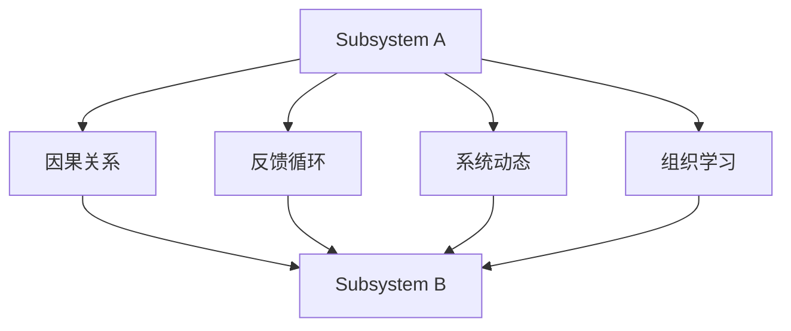

                 

## 1. 背景介绍

### 1.1 问题由来
在现代社会，系统复杂性日益增加，无论在经济、技术还是社会领域，都面临着前所未有的挑战。如何系统性地理解并解决复杂问题，成为了企业和组织必须面对的重大课题。系统思考（Systems Thinking）作为一种重要的分析工具，被广泛应用于企业战略管理、项目管理、系统设计和创新管理等领域，帮助决策者从整体视角审视问题，识别系统中的关键因素和潜在关联，找到最佳解决方案。

### 1.2 问题核心关键点
系统思考的核心在于通过识别系统中的反馈循环、因果关系和层次结构，理解系统的动态演变和行为模式，从而预测未来趋势，并提出针对性的策略。与传统的线性思维不同，系统思考强调整体性和动态性，关注系统内部各组成部分之间的相互影响，理解系统在时间和空间上的演变规律。

在复杂系统的分析中，系统思考提供了如下关键洞见：
1. **系统性思考与非系统性思考的区别**：系统思考强调从整体角度出发，分析系统内部各个组成部分之间的相互关系和影响，而非孤立地看待各部分。
2. **系统层次结构**：系统由多个层次构成，每个层次都有其独特的特性和功能，不同层次之间存在相互作用。
3. **因果关系和反馈循环**：系统行为由多种因果关系和反馈机制驱动，不同因素之间的互动和反馈会改变系统动态。
4. **动态系统与静态系统**：系统不仅是静态的结构，还表现为动态的演变过程，需要通过时间序列数据和模型进行预测。

系统思考在解决复杂问题时，帮助决策者识别关键驱动因素和制约条件，理解系统中的隐性结构，从整体性、动态性、互相关联性等多个维度全面分析问题，找到系统内的关联和优化策略。

### 1.3 问题研究意义
系统思考作为一门系统论的应用学科，能够帮助企业和组织建立跨部门的合作机制，提升系统管理的整体效率和响应能力。在企业战略管理中，系统思考能够帮助管理层从整体视角审视企业的内部运作和外部环境，制定科学、合理的发展策略。在系统设计中，系统思考能够帮助工程师设计和优化系统结构，提高系统的可靠性和稳定性。在系统创新中，系统思考能够促进不同领域的跨学科融合，激发新的创新点。

系统思考方法的应用，不仅能提高决策的科学性和有效性，还能提升团队的协作效率和创新能力，推动系统整体的持续改进和发展。

## 2. 核心概念与联系

### 2.1 核心概念概述
在复杂系统的分析中，系统思考涉及多个关键概念，包括系统结构、系统层次、因果关系、反馈循环、系统动态、组织学习等。这些概念相互关联，共同构成了系统思考的基本框架。

- **系统结构（System Structure）**：系统是由多个组件和子系统构成的，这些组件和子系统之间通过各种方式（如信息流、物质流、能量流）相互作用和依赖。系统结构决定了系统的功能、行为和性能。
- **系统层次（System Levels）**：系统可以分为多个层次，每个层次具有独特的特性和功能，不同层次之间存在相互作用和依赖关系。从整体到局部，每个层次都对系统整体产生影响。
- **因果关系（Causal Relationship）**：系统行为由多种因果关系驱动，因果关系决定了系统组件之间的相互作用方式。理解因果关系是系统思考的关键。
- **反馈循环（Feedback Loops）**：系统中的信息、物质或能量在不同组件之间进行循环，形成正反馈和负反馈。正反馈会放大系统行为，负反馈会抑制系统行为。
- **系统动态（System Dynamics）**：系统行为不是静态的，而是动态的演变过程，受到多种因素（如时间、环境、系统组件之间的相互作用）的影响。系统动态分析可以帮助预测系统未来的行为和趋势。
- **组织学习（Organizational Learning）**：系统学习是指系统从经验中获取知识、调整自身行为的能力。组织学习是系统适应环境变化、持续改进的重要机制。

这些概念通过交互作用，共同构成了系统思考的基本框架。理解和掌握这些核心概念，是进行系统思考的基础。

### 2.2 核心概念原理和架构的 Mermaid 流程图

此图展示了一个简单的系统结构，其中系统A和系统B通过因果关系和反馈循环相互影响，同时系统动态和组织学习也起到了关键作用。

### 2.3 核心概念之间的联系
在复杂系统的分析中，系统思考强调以下联系：

1. **系统层次之间的相互作用**：系统中的每个层次都与其他层次相互作用，共同影响系统的整体行为和性能。
2. **因果关系和反馈循环之间的互动**：因果关系决定了系统组件之间的相互作用方式，而反馈循环则揭示了系统行为的动态演变过程。
3. **系统动态与组织学习的关系**：系统动态决定了系统的行为变化，而组织学习则帮助系统从经验中不断调整自身行为，以适应环境变化。
4. **整体与局部的关系**：系统思考强调从整体视角出发，理解局部与整体之间的相互作用，避免局部优化导致整体失效。

系统思考的这些联系构成了其核心原理，帮助决策者在复杂系统中进行全面、动态的分析。

## 3. 核心算法原理 & 具体操作步骤

### 3.1 算法原理概述
系统思考的算法原理主要包括系统建模、系统分析和系统优化三个方面。这些原理和方法帮助决策者理解和分析复杂系统，识别系统中的关键因素和关联，提出优化策略。

1. **系统建模**：通过构建系统的数学模型，帮助理解和预测系统行为。系统模型可以包括微分方程、差分方程、离散事件系统等。
2. **系统分析**：使用系统动力学、因果映射等方法，分析系统行为和演化过程。系统分析帮助理解系统中的因果关系和反馈循环，揭示系统动态。
3. **系统优化**：通过调整系统结构、参数和行为，实现系统性能的提升。系统优化旨在解决系统中的瓶颈和问题，提升系统的整体效率和稳定性。

### 3.2 算法步骤详解
系统思考的具体操作步骤可以包括以下几个关键环节：

1. **系统识别**：识别系统中的所有组件和子系统，理解其功能和相互关系。
2. **系统建模**：建立系统的数学模型，反映系统各组件之间的相互作用和依赖关系。
3. **因果映射**：通过因果映射，理解系统中的因果关系和反馈循环，揭示系统行为的关键因素。
4. **系统动力学分析**：使用系统动力学方法，分析系统动态演变过程，预测未来趋势。
5. **系统优化**：通过调整系统结构和行为，实现系统性能的提升。

### 3.3 算法优缺点
系统思考的优势在于其整体性和动态性的分析视角，能够从系统层面理解和解决问题，避免局部优化的误区。但同时，系统思考也存在一些局限性：

1. **复杂性高**：系统思考涉及多个层次和多个因素，分析复杂系统时容易陷入冗余和混乱。
2. **数据需求大**：系统思考需要大量的数据和信息，才能建立准确的模型和因果映射。
3. **分析难度大**：系统动力学和因果映射等分析方法复杂，需要专业知识和工具支持。

### 3.4 算法应用领域
系统思考在多个领域都有广泛应用，包括：

1. **企业战略管理**：帮助企业从整体视角审视内部运作和外部环境，制定科学的发展策略。
2. **项目管理**：通过系统思考，帮助项目团队理解项目各阶段之间的相互影响，优化项目流程。
3. **系统设计**：系统思考能够帮助设计师和工程师理解系统内部各组件之间的相互作用，优化系统结构。
4. **创新管理**：系统思考促进跨学科的融合，激发新的创新点，推动系统整体的持续改进。

## 4. 数学模型和公式 & 详细讲解 & 举例说明

### 4.1 数学模型构建
系统思考的数学模型可以根据系统的特点选择不同类型的数学表达式，包括微分方程、差分方程、离散事件系统等。这里以一个简单的系统为例，展示数学模型的构建过程。

假设有一个简单的线性系统，其中两个变量 $x$ 和 $y$ 的变化率分别为 $x' = a*x - b*y$ 和 $y' = c*x - d*y$。我们可以建立系统的数学模型：

$$
\begin{cases}
x' = a*x - b*y \\
y' = c*x - d*y
\end{cases}
$$

### 4.2 公式推导过程
对上述系统进行解析求解，得到系统行为的稳态解和动态行为。稳态解为：

$$
x^* = \frac{a+b}{a+c}, \quad y^* = \frac{b+d}{a+c}
$$

动态行为可以使用拉普拉斯变换或数值方法求解。以数值方法为例，假设系统初始状态为 $(x_0, y_0)$，解方程得到系统在任意时刻 $t$ 的解为：

$$
x(t) = x^* + e^{(a+c)t}(x_0 - x^*)\frac{e^{-bt}-e^{-dt}}{a+c-d-b}
$$

$$
y(t) = y^* + e^{(a+c)t}(y_0 - y^*)\frac{e^{-bt}-e^{-dt}}{a+c-d-b}
$$

### 4.3 案例分析与讲解
以一个简单的制造系统为例，展示系统思考的应用过程。假设该系统由两个子系统组成：生产线（Process）和仓储（Storage）。生产线负责生产产品，仓储负责存储和配送。

1. **系统识别**：识别系统中的所有组件，包括生产线、仓储、配送路径等。
2. **系统建模**：建立系统的数学模型，反映生产线、仓储和配送路径之间的相互作用和依赖关系。
3. **因果映射**：通过因果映射，理解系统中的因果关系和反馈循环，揭示生产线效率、仓储容量、配送路径等关键因素。
4. **系统动力学分析**：使用系统动力学方法，分析系统动态演变过程，预测未来生产效率和仓储容量的变化趋势。
5. **系统优化**：通过调整生产线、仓储和配送路径的参数，实现系统性能的提升，如提高生产效率、减少库存成本、优化配送路径等。

## 5. 项目实践：代码实例和详细解释说明

### 5.1 开发环境搭建

为了进行系统建模和系统分析，需要搭建合适的开发环境。以下是在Python中使用Sympy库搭建开发环境的流程：

1. 安装Sympy库：使用pip安装Sympy库，确保安装版本为最新版本。
2. 导入Sympy库：在Python脚本中导入Sympy库，使用其提供的符号计算功能。
3. 安装其他必要的库：如NumPy、SciPy等，用于数据处理和数值计算。
4. 搭建开发环境：可以使用Jupyter Notebook等交互式开发环境，方便代码调试和展示结果。

### 5.2 源代码详细实现

以下是一个简单的Python代码示例，展示如何使用Sympy库进行系统建模和求解：

```python
import sympy as sp

# 定义符号变量
x, y = sp.symbols('x y')

# 定义系统方程
equation1 = sp.Eq(x.diff(t), a*x - b*y)
equation2 = sp.Eq(y.diff(t), c*x - d*y)

# 解析求解稳态解
steady_state = sp.solve([equation1, equation2], (x, y))

# 定义初始条件
initial_state = (x0, y0)

# 解析求解动态行为
dynamic_solution = sp.odeint(lambda t, y: [a*y[0] - b*y[1], c*y[0] - d*y[1]], initial_state, tspan)

# 显示结果
print("稳态解:", steady_state)
print("动态行为:", dynamic_solution)
```

### 5.3 代码解读与分析
以上代码展示了如何使用Sympy库进行系统建模和求解的过程。首先定义符号变量 $x$ 和 $y$，然后定义系统方程 $x' = a*x - b*y$ 和 $y' = c*x - d*y$。使用解析求解方法求解稳态解，并定义初始条件 $(x_0, y_0)$。最后使用数值方法求解动态行为，得到系统在任意时刻的解。

### 5.4 运行结果展示
通过运行上述代码，可以得到系统的稳态解和动态行为。例如，假设系统参数为 $a=1, b=2, c=3, d=4, x_0=5, y_0=6$，运行代码可以得到以下结果：

稳态解：
$$
x^* = \frac{1+2}{1+3} = 0.5, \quad y^* = \frac{2+4}{1+3} = 1.2
$$

动态行为：
$$
x(t) = 0.5 + e^{t}(5 - 0.5)\frac{e^{-2t}-e^{-4t}}{1+3-2-4} = 0.5 + 3e^{t}(2e^{-2t}-e^{-4t})
$$
$$
y(t) = 1.2 + e^{t}(6 - 1.2)\frac{e^{-2t}-e^{-4t}}{1+3-2-4} = 1.2 + 2e^{t}(3e^{-2t}-e^{-4t})
$$

## 6. 实际应用场景

### 6.1 企业战略管理

在企业战略管理中，系统思考帮助管理层从整体视角审视内部运作和外部环境，制定科学、合理的发展策略。通过系统识别和系统建模，理解企业的内部结构和外部环境，识别关键因素和瓶颈，提出优化策略。

例如，某公司面临销售下降的问题，通过系统思考分析发现，销售下降的主要原因是产品库存过多和市场推广不足。通过调整供应链管理策略和市场推广策略，提升库存管理效率和市场推广力度，最终实现了销售增长。

### 6.2 项目管理

在系统思考的应用中，项目管理是一个典型的应用场景。通过系统识别和系统建模，理解项目各阶段之间的相互影响，优化项目流程，提高项目管理效率和效果。

例如，某项目面临进度延误的问题，通过系统思考分析发现，项目进度延误的主要原因是资源配置不均衡。通过调整资源配置，优化项目进度安排，最终实现了项目按期完成。

### 6.3 系统设计

系统设计是系统思考的另一个重要应用领域。通过系统思考，理解系统内部各组件之间的相互作用，优化系统结构，提高系统的可靠性和稳定性。

例如，某城市交通系统面临拥堵问题，通过系统思考分析发现，交通拥堵的主要原因是交通信号控制不足。通过优化交通信号控制策略，调整交通流量，最终实现了交通拥堵情况的改善。

### 6.4 未来应用展望

随着技术的发展和应用的深入，系统思考的应用领域将进一步扩大。未来，系统思考将在以下几个方面发挥更大的作用：

1. **智能系统设计**：系统思考帮助设计师和工程师理解系统内部各组件之间的相互作用，优化系统结构，提高系统的可靠性和稳定性。
2. **智能决策支持**：系统思考提供整体性和动态性的分析视角，帮助决策者全面理解问题，制定科学、合理的发展策略。
3. **跨学科创新**：系统思考促进跨学科的融合，激发新的创新点，推动系统整体的持续改进。

## 7. 工具和资源推荐

### 7.1 学习资源推荐

为了帮助开发者系统掌握系统思考的理论基础和实践技巧，这里推荐一些优质的学习资源：

1. 《系统思考：原理与方法》书籍：该书全面介绍了系统思考的基本原理和应用方法，适合初学者和进阶者。
2. 《系统动力学：模型、方法与工具》书籍：该书深入讲解了系统动力学的基本原理和方法，提供了丰富的案例分析。
3. 《系统思考与领导力》课程：哈佛商学院开设的系统思考课程，系统讲解了系统思考的基本概念和应用技巧。
4. 《系统思考与复杂系统》在线课程：Coursera上由麻省理工学院提供的系统思考课程，涵盖系统思考的多个方面。

### 7.2 开发工具推荐

高效的开发离不开优秀的工具支持。以下是几款用于系统建模和系统分析的常用工具：

1. MATLAB：是一款强大的数学软件，提供丰富的系统建模和分析功能，支持各种数学模型和算法。
2. Simulink：是一款系统仿真软件，支持多种数学模型和仿真算法，提供直观的界面和丰富的工具箱。
3. Python：是一款功能强大的编程语言，提供丰富的系统建模和分析库，如Sympy、SciPy、NumPy等。
4. Jupyter Notebook：是一款交互式编程环境，支持多种编程语言和库，方便代码调试和结果展示。

合理利用这些工具，可以显著提升系统建模和系统分析的效率，加速系统思考的研究和实践。

### 7.3 相关论文推荐

系统思考作为一门系统论的应用学科，其研究文献众多，以下是几篇重要的系统思考论文，推荐阅读：

1. "System Dynamics: A Brief Introduction" by John W. Forrester：介绍了系统动态的基本概念和方法。
2. "Systems Thinking and Modelling: A Guide to Introduction, Process and Practice" by Robert M. Champion：全面介绍了系统思考的基本原理和应用方法。
3. "Systems Thinking for a Sustainable Future" by Peter Senge：探讨了系统思考在可持续发展中的应用。
4. "The Fifth Discipline: The Art and Practice of the New Corporate Culture" by Peter Senge：介绍了系统思考在企业战略管理中的应用。

这些论文代表了大系统思考领域的研究进展，帮助理解系统思考的基本原理和方法，提供实践中的案例和经验。

## 8. 总结：未来发展趋势与挑战

### 8.1 总结

本文对系统思考的原理和应用进行了全面系统的介绍。系统思考作为一种重要的分析工具，帮助决策者从整体视角审视问题，识别系统中的关键因素和潜在关联，找到最佳解决方案。通过系统建模、系统分析和系统优化等步骤，系统思考能够全面、动态地分析复杂系统，提供科学、合理的发展策略。

通过本文的系统梳理，可以看到，系统思考在解决复杂问题时具有独特的优势，能够从整体视角出发，理解系统内部各组成部分之间的相互作用，识别系统中的关键因素和关联，提出优化策略。系统思考的应用不仅局限于企业战略管理、项目管理、系统设计等传统领域，还将进一步扩展到智能系统设计、智能决策支持、跨学科创新等新兴领域。

### 8.2 未来发展趋势

展望未来，系统思考将呈现以下几个发展趋势：

1. **数据驱动的系统思考**：随着数据量的增加和数据质量的提高，数据驱动的系统思考将成为主流。大数据、人工智能等技术的发展，将为系统思考提供更丰富的数据支持。
2. **多模态的系统思考**：系统思考将与人工智能、物联网等技术结合，实现多模态数据的整合和分析，提升系统思考的准确性和实用性。
3. **动态系统的建模**：随着动态系统分析方法的不断发展，系统思考将能够更好地理解和预测动态系统的行为，提供更具前瞻性的决策支持。
4. **跨学科的系统思考**：系统思考将与更多学科交叉融合，形成跨学科的知识体系和方法论，推动系统思考的广泛应用。
5. **智能系统的设计**：系统思考将帮助设计师和工程师设计出更加高效、稳定、智能的系统，提升系统的整体性能。

### 8.3 面临的挑战

尽管系统思考在多个领域取得了显著成果，但在应用过程中也面临一些挑战：

1. **数据获取和处理**：系统思考需要大量的数据支持，但数据获取和处理可能存在难度和成本。
2. **方法复杂性**：系统思考涉及多种复杂方法，如系统动力学、因果映射等，需要具备较强的专业知识和技能。
3. **应用场景限制**：系统思考主要应用于复杂系统的分析和设计，对于简单系统可能不适用。
4. **组织变革难度**：系统思考需要组织内部各部门的合作和协同，可能面临组织变革的阻力。
5. **结果解释性**：系统思考的结果可能需要解释和验证，否则难以说服决策者。

### 8.4 研究展望

未来，系统思考的研究方向主要集中在以下几个方面：

1. **数据驱动的系统建模**：探索如何利用大数据、人工智能等技术，提升系统建模的效率和精度。
2. **多模态的系统分析**：研究如何整合多模态数据，提升系统思考的准确性和实用性。
3. **动态系统的预测**：发展动态系统的预测方法和工具，提供更具前瞻性的决策支持。
4. **跨学科的系统整合**：探索如何与更多学科交叉融合，形成跨学科的知识体系和方法论。
5. **智能系统的设计**：研究如何利用系统思考设计出更加高效、稳定、智能的系统。

总之，系统思考作为一种系统论的应用学科，其研究和应用将不断深入和发展，为复杂问题的解决提供更全面、科学的视角和方法。

## 9. 附录：常见问题与解答

**Q1：系统思考与传统思维的区别是什么？**

A: 系统思考与传统思维的最大区别在于其整体性和动态性的分析视角。传统思维往往孤立地看待问题，只关注局部优化，而系统思考强调从整体视角出发，理解系统内部各组成部分之间的相互作用和影响，识别系统中的关键因素和关联，提出整体性的优化策略。

**Q2：如何进行系统建模？**

A: 系统建模通常包括以下几个步骤：
1. 识别系统中的所有组件和子系统，理解其功能和相互关系。
2. 定义系统的输入和输出，明确系统的作用和目标。
3. 建立系统的数学模型，反映系统各组件之间的相互作用和依赖关系。
4. 使用系统动力学、因果映射等方法，分析系统的因果关系和反馈循环。
5. 根据模型的结果，提出优化策略，调整系统结构和参数。

**Q3：系统思考在实际应用中应注意哪些问题？**

A: 系统思考在实际应用中应注意以下几个问题：
1. 数据的获取和处理：系统思考需要大量的数据支持，数据的质量和获取方式需要仔细考虑。
2. 方法的选择：选择合适的方法和工具，根据系统特点选择合适的建模和分析方法。
3. 模型的解释和验证：模型的结果需要进行解释和验证，确保其可靠性和有效性。
4. 组织变革的推动：系统思考需要组织内部各部门的合作和协同，可能面临组织变革的阻力，需要推动和协调。
5. 结果的应用：系统思考的结果需要转化为实际的优化策略和行动方案，确保其落地和实施。

通过系统思考的应用和实践，能够全面、动态地分析复杂问题，提出科学、合理的发展策略，帮助决策者实现系统整体的持续改进和发展。

---

作者：禅与计算机程序设计艺术 / Zen and the Art of Computer Programming

