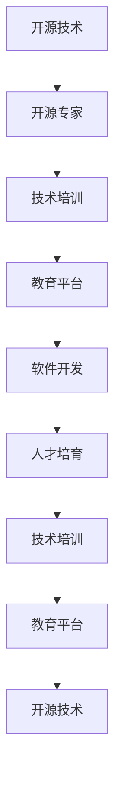

                 

# 组织技术培训：开源专家的教学机会

> 关键词：技术培训, 开源专家, 教学机会, 教育平台, 软件开发, 人才培育, 学习资源

## 1. 背景介绍

随着信息技术的发展，技术培训在各个行业中的应用变得越来越重要。组织技术培训不仅能提升员工的技术水平和业务能力，还能推动企业的创新与发展。在当前的软件开发行业中，开源技术的快速发展和普及更是对企业技术培训提出了新的挑战和机遇。本节将介绍开源技术在技术培训中的应用现状，探讨其发展趋势和挑战。

### 1.1 技术培训的重要性

技术培训对企业的发展具有重要意义。通过对员工进行系统的技术培训，可以提高其技术水平和业务能力，推动企业创新与发展。特别是在软件开发领域，技术培训不仅可以帮助员工掌握最新的开发工具和技术，还能提升团队的整体素质和竞争力。

### 1.2 开源技术的发展

开源技术已经成为软件开发行业的主流趋势。开源技术的快速发展和普及，使得企业技术培训的内容和形式发生了巨大变化。企业需要不断更新技术培训的内容和形式，以适应开源技术的发展。

## 2. 核心概念与联系

### 2.1 核心概念概述

为了更好地理解开源技术在技术培训中的应用，本节将介绍几个密切相关的核心概念：

- 开源技术：指公开源代码的软件，任何人都可以自由地查看、修改和分发源代码。
- 开源专家：指在开源技术领域具有丰富经验和专业知识的专家。
- 技术培训：指通过系统化的学习和训练，提升员工的技术水平和业务能力的过程。
- 教育平台：指提供技术培训的在线或线下平台，如Coursera、Udacity等。
- 软件开发：指通过编程和测试等手段，开发、测试、维护软件产品的过程。
- 人才培育：指通过培训和教育，培养和提升人才的能力和素质。

这些核心概念之间的逻辑关系可以通过以下Mermaid流程图来展示：



这个流程图展示了一系列核心概念之间的联系：开源技术的发展和普及推动了开源专家的出现；开源专家通过技术培训，为软件开发提供人才；教育平台是技术培训的主要载体；软件开发需要人才的支撑；人才培育是技术培训的最终目的。

## 3. 核心算法原理 & 具体操作步骤

### 3.1 算法原理概述

开源技术在技术培训中的应用，主要依赖于开源专家的知识和经验。通过对开源专家进行系统的培训，企业可以掌握最新的技术，并将其应用到实际开发中。开源专家的培训内容通常包括以下几个方面：

1. 技术原理：掌握开源技术的核心原理和设计思路。
2. 工具使用：熟悉开源技术的主要工具和开发环境。
3. 代码阅读与修改：学会阅读和修改开源代码。
4. 项目实践：通过实践项目，应用所学技术。

### 3.2 算法步骤详解

开源专家在技术培训中的具体步骤通常包括以下几个环节：

1. 需求分析：根据企业的需求，确定培训内容和技术栈。
2. 课程设计：设计培训课程内容和培训方式。
3. 教学实施：通过在线或线下方式，开展技术培训。
4. 评估反馈：通过考试、项目和反馈等方式，评估培训效果。
5. 优化改进：根据评估结果，优化培训内容和方式。

### 3.3 算法优缺点

开源技术在技术培训中的优点主要包括：

1. 成本低廉：开源技术的学习和应用成本相对较低，企业可以通过内部培训和外部培训相结合的方式，降低培训成本。
2. 灵活性高：开源技术具有高度的灵活性，企业可以根据自身需求选择相应的开源技术。
3. 技术先进：开源技术通常具有较高的技术水平和创新性，可以推动企业的技术进步。

同时，开源技术在技术培训中也存在一些缺点：

1. 学习难度高：开源技术的学习难度较大，需要具备一定的编程基础和经验。
2. 技术更新快：开源技术的更新速度较快，企业需要不断更新培训内容和技术栈。
3. 缺乏统一标准：开源技术缺乏统一的标准和规范，培训效果难以评估和控制。

### 3.4 算法应用领域

开源技术在技术培训中的应用领域非常广泛，主要包括：

1. 软件开发：通过培训开发人员掌握开源技术，提升开发效率和产品质量。
2. 系统运维：通过培训运维人员掌握开源技术，提高系统的稳定性和可靠性。
3. 数据分析：通过培训数据分析人员掌握开源技术，提升数据处理和分析能力。
4. 人工智能：通过培训人工智能工程师掌握开源技术，推动人工智能技术的发展。

## 4. 数学模型和公式 & 详细讲解 & 举例说明

### 4.1 数学模型构建

为了更好地理解开源技术在技术培训中的应用，本节将使用数学语言对技术培训的数学模型进行描述。

假设企业需要进行开源技术培训，时间为 $T$，共有 $N$ 名员工参加培训。设员工在培训前对技术 $X$ 的了解程度为 $F(X_i)$，其中 $X_i$ 为技术，$i$ 为员工编号。培训结束后的了解程度为 $F'(X_i)$，则技术培训的数学模型可以表示为：

$$
F'(X_i) = f(X_i, T)
$$

其中 $f$ 为技术培训函数，表示员工在 $T$ 时间内的技术提升程度。

### 4.2 公式推导过程

假设员工对技术的了解程度满足正态分布 $N(\mu, \sigma^2)$，则技术培训的效果可以表示为：

$$
F'(X_i) = N(\mu + \alpha T, \sigma^2)
$$

其中 $\mu$ 为技术培训前员工的平均了解程度，$\sigma^2$ 为员工的技术水平波动程度，$\alpha$ 为技术培训的效果系数。

### 4.3 案例分析与讲解

假设某企业进行开源技术培训，培训时间为 2 个月，共有 10 名员工参加培训。培训前，员工对技术 $X$ 的平均了解程度为 50%，技术水平波动程度为 10%，培训效果系数为 0.2。则培训结束后，员工的平均技术水平可以表示为：

$$
F'(X_i) = N(50 + 0.2 \times 2, 10^2) = N(58, 100)
$$

培训后的技术水平分布可以表示为：

$$
P(F'(X_i) \geq 60) = 0.95
$$

即 95% 的员工培训后的技术水平可以超过 60%。

## 5. 项目实践：代码实例和详细解释说明

### 5.1 开发环境搭建

在进行技术培训的实践前，我们需要准备好开发环境。以下是使用Python进行Django开发的环境配置流程：

1. 安装Anaconda：从官网下载并安装Anaconda，用于创建独立的Python环境。

2. 创建并激活虚拟环境：
```bash
conda create -n django-env python=3.8 
conda activate django-env
```

3. 安装Django：从官网获取对应的安装命令。例如：
```bash
pip install django
```

4. 安装各类工具包：
```bash
pip install numpy pandas scikit-learn matplotlib tqdm jupyter notebook ipython
```

完成上述步骤后，即可在`django-env`环境中开始技术培训的实践。

### 5.2 源代码详细实现

下面以技术培训课程设计的项目为例，给出使用Django框架进行技术培训的Python代码实现。

首先，定义技术培训课程的基本信息：

```python
from django.db import models
from django.contrib.auth.models import User

class Course(models.Model):
    title = models.CharField(max_length=100)
    duration = models.IntegerField()
    description = models.TextField()
    start_date = models.DateField()
    end_date = models.DateField()
    instructor = models.ForeignKey(User, on_delete=models.CASCADE)

    def __str__(self):
        return self.title
```

然后，定义用户注册和登录的视图函数：

```python
from django.shortcuts import render, redirect
from django.contrib.auth import authenticate, login, logout

def login_view(request):
    if request.method == 'POST':
        username = request.POST['username']
        password = request.POST['password']
        user = authenticate(request, username=username, password=password)
        if user is not None:
            login(request, user)
            return redirect('home')
        else:
            context = {'error_message': 'Invalid credentials'}
            return render(request, 'login.html', context)
    return render(request, 'login.html')

def logout_view(request):
    logout(request)
    return redirect('login')
```

接着，定义技术培训课程的视图函数：

```python
from django.shortcuts import render, redirect
from .models import Course
from .forms import CourseForm

def course_list(request):
    courses = Course.objects.all()
    return render(request, 'course_list.html', {'courses': courses})

def course_detail(request, pk):
    course = Course.objects.get(pk=pk)
    return render(request, 'course_detail.html', {'course': course})

def course_create(request):
    if request.method == 'POST':
        form = CourseForm(request.POST)
        if form.is_valid():
            form.save()
            return redirect('course_list')
    else:
        form = CourseForm()
    return render(request, 'course_create.html', {'form': form})

def course_update(request, pk):
    course = Course.objects.get(pk=pk)
    if request.method == 'POST':
        form = CourseForm(request.POST, instance=course)
        if form.is_valid():
            form.save()
            return redirect('course_list')
    else:
        form = CourseForm(instance=course)
    return render(request, 'course_update.html', {'form': form})

def course_delete(request, pk):
    course = Course.objects.get(pk=pk)
    if request.method == 'POST':
        course.delete()
        return redirect('course_list')
    return render(request, 'course_delete.html', {'course': course})
```

最后，定义技术培训课程的表单：

```python
from django import forms
from .models import Course

class CourseForm(forms.ModelForm):
    class Meta:
        model = Course
        fields = ['title', 'duration', 'description', 'start_date', 'end_date', 'instructor']
```

完成上述步骤后，即可在`django-env`环境中运行技术培训的实践项目。

### 5.3 代码解读与分析

让我们再详细解读一下关键代码的实现细节：

**Course模型**：
- `__str__`方法：定义模型对象的字符串表示，方便在管理界面显示。

**登录和注销视图函数**：
- `login_view`：用户登录视图函数，根据用户输入的用户名和密码进行认证。
- `logout_view`：用户注销视图函数，将用户从会话中移除，并重定向到登录页面。

**技术培训课程视图函数**：
- `course_list`：列出所有技术培训课程。
- `course_detail`：展示单个技术培训课程的详细信息。
- `course_create`：创建新的技术培训课程。
- `course_update`：更新现有的技术培训课程。
- `course_delete`：删除现有的技术培训课程。

**CourseForm表单**：
- `Meta`类：定义表单与模型的关系和要展示的字段。

这些代码实现了基本的技术培训课程管理功能，包括课程的创建、修改和删除等。开发者可以根据实际需求，继续扩展功能，如添加课程评价、安排学员等。

## 6. 实际应用场景

### 6.1 企业内部培训

企业内部培训是开源技术培训的重要应用场景。通过技术培训，企业可以提升员工的开发和运维能力，增强企业的竞争力。企业可以通过内部培训或外部培训，帮助员工掌握最新的开源技术。

### 6.2 开源社区培训

开源社区是开源技术的重要组成部分。通过社区培训，开源社区可以推动技术的发展和普及。企业可以与开源社区合作，开展社区培训，提升社区成员的技术水平。

### 6.3 在线教育平台培训

在线教育平台是技术培训的重要载体。通过在线教育平台，企业可以开展大规模的技术培训，提升员工的技术水平。企业可以选择适合的开源课程，开展在线培训，提升员工的技术能力。

### 6.4 未来应用展望

随着开源技术的发展和普及，技术培训的应用将更加广泛。未来，技术培训将更多地依赖于在线教育平台和开源社区，推动技术的发展和普及。企业可以通过在线教育平台和开源社区，进行大规模的技术培训，提升员工的技术水平。

## 7. 工具和资源推荐

### 7.1 学习资源推荐

为了帮助开发者系统掌握开源技术在技术培训中的应用，这里推荐一些优质的学习资源：

1. Coursera和Udacity：全球知名的在线教育平台，提供大量的技术培训课程，涵盖各种开源技术。
2. GitHub：开源社区的重要组成部分，提供大量的开源项目和技术文档，方便开发者学习和使用。
3. Python官方文档：Python编程语言的重要参考资料，提供详细的API文档和代码示例，方便开发者学习和使用。
4. Django官方文档：Django Web框架的重要参考资料，提供详细的API文档和开发指南，方便开发者学习和使用。
5. PyTorch官方文档：PyTorch深度学习框架的重要参考资料，提供详细的API文档和开发指南，方便开发者学习和使用。

通过对这些资源的学习实践，相信你一定能够快速掌握开源技术在技术培训中的应用，并用于解决实际的技术问题。

### 7.2 开发工具推荐

高效的开发离不开优秀的工具支持。以下是几款用于技术培训开发的常用工具：

1. GitHub：全球最大的开源社区，提供代码托管、协作开发、项目管理等功能。
2. Jupyter Notebook：Python编程的重要开发工具，支持代码编写、数据分析和机器学习等。
3. VS Code：轻量级的代码编辑器，支持多种编程语言和插件扩展。
4. Docker：开源容器技术，支持应用容器的构建、管理和部署。
5. Kubernetes：开源容器编排技术，支持大规模应用的自动化部署和管理。

合理利用这些工具，可以显著提升技术培训的开发效率，加快创新迭代的步伐。

### 7.3 相关论文推荐

开源技术在技术培训中的应用，得益于学界的持续研究。以下是几篇奠基性的相关论文，推荐阅读：

1. "Introduction to Data Science" by Chang and Jonker：介绍数据科学的基本概念和应用，涵盖Python编程、数据分析和机器学习等。
2. "Deep Learning" by Goodfellow et al.：介绍深度学习的基本概念和应用，涵盖神经网络、卷积神经网络和生成对抗网络等。
3. "Natural Language Processing" by Bird et al.：介绍自然语言处理的基本概念和应用，涵盖文本分类、命名实体识别和机器翻译等。
4. "Software Engineering" by DiScala et al.：介绍软件工程的基本概念和应用，涵盖软件开发、测试和维护等。
5. "Agile Software Development" by Hunt and Thomas：介绍敏捷软件开发的基本概念和应用，涵盖Scrum和Kanban等。

这些论文代表了大语言模型微调技术的发展脉络。通过学习这些前沿成果，可以帮助研究者把握学科前进方向，激发更多的创新灵感。

## 8. 总结：未来发展趋势与挑战

### 8.1 总结

本文对开源技术在技术培训中的应用进行了全面系统的介绍。首先阐述了开源技术在技术培训中的重要性，明确了技术培训在企业发展中的关键作用。其次，从原理到实践，详细讲解了开源技术在技术培训中的数学模型和具体操作步骤，给出了技术培训项目开发的完整代码实例。同时，本文还广泛探讨了技术培训在企业内部培训、开源社区培训、在线教育平台培训等多个领域的应用前景，展示了开源技术在技术培训中的广阔前景。

通过本文的系统梳理，可以看到，开源技术在技术培训中的应用已经成为企业发展的重要引擎。开源技术的学习和应用，能够提升员工的技术水平和业务能力，推动企业创新与发展。未来，随着开源技术的发展和普及，技术培训的应用将更加广泛，对企业的发展也将起到更大的推动作用。

### 8.2 未来发展趋势

展望未来，开源技术在技术培训中将呈现以下几个发展趋势：

1. 在线教育平台的发展：在线教育平台将成为技术培训的重要载体，推动技术培训的大规模普及。
2. 开源社区的壮大：开源社区将成为技术培训的重要来源，提供丰富的技术培训资源。
3. 人工智能的应用：人工智能技术将被广泛应用到技术培训中，提升技术培训的效果和质量。
4. 持续学习的重要性：持续学习将成为技术培训的重要特征，帮助员工不断更新和提升技术水平。
5. 实时化学习的需求：实时化学习将成为技术培训的重要目标，提升学习效率和效果。
6. 跨领域融合的趋势：跨领域融合将成为技术培训的重要方向，推动技术的跨学科应用。

以上趋势凸显了开源技术在技术培训中的巨大潜力。这些方向的探索发展，必将进一步提升技术培训的效果和质量，为企业的创新与发展提供更强大的技术支撑。

### 8.3 面临的挑战

尽管开源技术在技术培训中已经取得了显著的成果，但在迈向更加智能化、普适化应用的过程中，它仍面临着诸多挑战：

1. 技术更新的速度：开源技术的发展速度较快，企业需要不断更新培训内容和技术栈，才能跟上技术发展的步伐。
2. 培训效果的评估：技术培训效果的评估比较困难，难以客观准确地评估培训效果，影响培训的决策和优化。
3. 培训内容的丰富度：技术培训的内容较为单一，缺乏多样性和趣味性，难以满足员工的学习需求。
4. 培训资源的共享：技术培训的资源较为分散，难以实现资源共享和跨地域合作，影响培训的效率和效果。
5. 培训管理的复杂度：技术培训的管理较为复杂，需要协调多方的资源和时间，难以实现精细化的管理。
6. 培训效果的落地：技术培训的效果需要落地应用，才能真正发挥作用，难以实现培训与实际工作的有效结合。

正视技术培训面临的这些挑战，积极应对并寻求突破，将是大语言模型微调技术迈向成熟的必由之路。相信随着学界和产业界的共同努力，这些挑战终将一一被克服，开源技术在技术培训中将发挥更大的作用。

### 8.4 研究展望

面对开源技术在技术培训中面临的种种挑战，未来的研究需要在以下几个方面寻求新的突破：

1. 多模式学习：结合多种学习模式（如在线学习、面授学习、自学习等），提升技术培训的效果和质量。
2. 跨学科应用：结合多种学科知识（如计算机科学、数据科学、心理学等），推动技术的跨学科应用。
3. 个性化学习：结合个性化学习技术（如推荐系统、智能推荐等），提升技术培训的个性化和灵活性。
4. 开放式培训：结合开源社区和在线平台，推动技术的开放式应用，实现技术的共享和合作。
5. 实时化培训：结合实时化学习技术（如实时反馈、实时评价等），提升技术培训的实时性和效果。
6. 跨领域融合：结合跨领域知识和技术（如人工智能、大数据、区块链等），推动技术的跨领域融合。

这些研究方向的探索，必将引领开源技术在技术培训中的应用走向更高的台阶，为构建智能化、普适化的技术培训体系提供更强大的技术支撑。面向未来，开源技术在技术培训中还需与其他人工智能技术进行更深入的融合，多路径协同发力，共同推动技术培训的进步。只有勇于创新、敢于突破，才能不断拓展技术培训的边界，让技术培训更好地服务于企业的发展。

