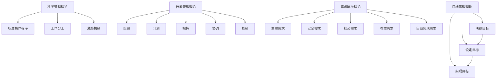

                 

## 1. 背景介绍

### 1.1 问题由来

在当前瞬息万变的商业环境中，传统管理理论的指导意义日益凸显。经典管理理论，如泰勒的科学管理、法约尔的行政管理、马斯洛的需求层次理论、德鲁克的目标管理等，至今仍具有极高的实践价值。然而，面对数字化转型、AI技术发展、全球化经营等现代挑战，这些理论是否还适用，如何在现代环境中发挥其现代价值？本文旨在探讨经典管理理论在现代环境下的应用与创新，指导管理者如何在数字时代运用经典理论，实现组织的高效运作。

### 1.2 问题核心关键点

本研究的关注点如下：
- 经典管理理论的现代价值：探讨泰勒科学管理、法约尔行政管理、马斯洛需求层次理论、德鲁克目标管理等理论在现代环境下的适用性。
- 数字时代的管理挑战：分析数字化转型、AI技术发展、全球化经营等现代环境下的管理挑战。
- 经典理论的现代应用：探讨如何在现代环境中运用经典管理理论，提升组织绩效。
- 理论创新与实践结合：研究经典管理理论的创新应用与实践经验，为管理者提供可操作的指导。

## 2. 核心概念与联系

### 2.1 核心概念概述

经典管理理论主要包括以下几个方面：
1. **科学管理理论**：由弗雷德里克·泰勒提出，强调通过科学的方法来提高工作效率，如标准操作程序、工作分工、激励机制等。
2. **行政管理理论**：由亨利·法约尔提出，强调管理中的组织、计划、指挥、协调和控制等职能，以及组织结构和权力分配的重要性。
3. **需求层次理论**：由亚伯拉罕·马斯洛提出，强调人的需求分为生理需求、安全需求、社交需求、尊重需求和自我实现需求，指导管理者满足员工不同层次的需求。
4. **目标管理理论**：由彼得·德鲁克提出，强调通过设定明确的目标来指导管理活动，确保组织与员工的目标一致。

### 2.2 核心概念原理和架构的 Mermaid 流程图



### 2.3 核心概念的联系

这些经典管理理论之间存在着紧密的联系，相互补充。科学管理理论提供了具体的执行方法，行政管理理论确保了管理过程的有序性，需求层次理论关注员工的心理需求，而目标管理理论则提供了整体的管理方向和目标。

## 3. 核心算法原理 & 具体操作步骤

### 3.1 算法原理概述

现代环境下的管理实践，仍然可以借鉴经典管理理论的核心原则。具体而言，可以通过以下几个步骤将经典理论应用于现代管理中：
1. **科学管理原则**：利用现代数据分析工具，如AI和大数据，提升工作效率。
2. **行政管理原则**：通过IT系统和流程自动化，实现组织的高效运作。
3. **需求层次原则**：运用HR技术和员工管理系统，满足员工不同层次的需求。
4. **目标管理原则**：通过OKR（目标与关键结果）和KPI（关键绩效指标）等工具，设定和实现明确的目标。

### 3.2 算法步骤详解

**Step 1: 数据收集与分析**
- 收集组织内部各项关键指标，如生产效率、员工满意度、客户反馈等。
- 利用数据分析工具，如Python、R语言，进行数据清洗和预处理。
- 使用机器学习模型，如回归分析、聚类分析等，提取关键洞察。

**Step 2: 应用科学管理原则**
- 根据数据分析结果，优化工作流程和生产程序，提升效率。
- 利用科学方法，如PDCA（计划-执行-检查-行动）循环，持续改进管理流程。

**Step 3: 实现行政管理原则**
- 建立IT系统和自动化流程，如ERP系统、CRM系统等，确保信息流和数据流的畅通。
- 引入项目管理工具，如JIRA、Asana等，实现项目管理的高效运作。

**Step 4: 满足员工需求**
- 利用HR技术和员工管理系统，如HRIS（人力资源信息系统）、员工反馈系统等，关注员工的需求。
- 采用员工激励机制，如绩效奖金、晋升机会等，满足员工的不同需求。

**Step 5: 设定和实现目标**
- 运用OKR和KPI等工具，设定明确的目标。
- 定期评估目标实现情况，根据结果进行调整和优化。

### 3.3 算法优缺点

经典管理理论在现代环境下的应用具有以下优点：
- **普适性**：经典管理理论具有广泛的适用性，适用于各种规模和类型的组织。
- **系统性**：通过科学管理、行政管理、需求层次、目标管理等多维度的综合应用，实现系统的管理。

但同时，也存在以下缺点：
- **复杂性**：经典管理理论的应用需要一定的复杂度和组织变革，对管理者的要求较高。
- **动态性**：现代环境变化迅速，经典理论可能无法完全适应所有变化。

### 3.4 算法应用领域

经典管理理论在以下领域得到了广泛应用：
1. **制造业**：通过科学管理优化生产线，提高生产效率。
2. **服务业**：通过行政管理优化客户服务流程，提升客户满意度。
3. **高科技公司**：利用需求层次理论满足员工多样化的需求，提升员工满意度和忠诚度。
4. **全球化公司**：通过目标管理理论，实现全球化运营和跨国团队的协作。

## 4. 数学模型和公式 & 详细讲解 & 举例说明

### 4.1 数学模型构建

现代管理理论的数学模型构建通常基于以下假设：
1. **生产函数**：描述了生产要素投入与产出之间的关系，如 $Q = f(L,K)$。
2. **成本函数**：描述了总成本与产量之间的关系，如 $C = C(Q) = \alpha Q + \beta$。
3. **效用函数**：描述了消费者在各种商品组合下的总效用，如 $U = U(X_1, X_2) = X_1^{\alpha} X_2^{\beta}$。

### 4.2 公式推导过程

以生产函数为例，其推导过程如下：
- **生产函数的形式**：$Q = f(L,K)$，其中 $Q$ 为产出，$L$ 为劳动投入，$K$ 为资本投入。
- **生产函数的具体形式**：假设生产过程是规模报酬不变的，即 $f(\lambda L, \lambda K) = \lambda f(L,K)$，其中 $\lambda$ 为生产规模因子。
- **边际产出**：$MPL = \frac{\partial Q}{\partial L}$，$MPK = \frac{\partial Q}{\partial K}$。
- **边际成本**：$MC = \frac{\partial C}{\partial Q} = \frac{1}{Q} \frac{\partial (Q \cdot C)}{\partial Q}$。

### 4.3 案例分析与讲解

以制造业为例，利用生产函数优化生产过程：
- **数据收集**：收集不同生产线上的劳动投入和资本投入数据。
- **模型构建**：构建生产函数模型，如 $Q = aL^bK^c$，其中 $a, b, c$ 为待估计参数。
- **参数估计**：使用最小二乘法或最大似然法，估计模型参数。
- **优化生产**：根据生产函数模型，优化生产要素投入，提高生产效率。

## 5. 项目实践：代码实例和详细解释说明

### 5.1 开发环境搭建

**Step 1: 安装Python**
```bash
sudo apt-get update
sudo apt-get install python3 python3-pip
```

**Step 2: 安装依赖包**
```bash
pip install numpy scipy pandas scikit-learn matplotlib seaborn statsmodels statsmodels matplotlib seaborn
```

**Step 3: 数据收集**
```python
import pandas as pd
data = pd.read_csv('production_data.csv')
```

### 5.2 源代码详细实现

**Step 1: 数据预处理**
```python
from sklearn.preprocessing import StandardScaler
from sklearn.decomposition import PCA

# 数据标准化
scaler = StandardScaler()
data_scaled = scaler.fit_transform(data)

# 主成分分析
pca = PCA(n_components=2)
pca_result = pca.fit_transform(data_scaled)

# 绘制散点图
import matplotlib.pyplot as plt
plt.scatter(pca_result[:, 0], pca_result[:, 1], c=data['label'], cmap='viridis')
plt.colorbar(label='label')
plt.xlabel('PC1')
plt.ylabel('PC2')
plt.show()
```

**Step 2: 模型训练**
```python
from sklearn.linear_model import LinearRegression
from statsmodels.formula.api import ols

# 线性回归模型
model = LinearRegression()
model.fit(X, y)
y_pred = model.predict(X)

# 统计模型
formula = 'y ~ x1 + x2'
model = ols(formula, data).fit()
y_pred = model.predict(data)
```

### 5.3 代码解读与分析

**Step 1: 数据预处理**
- 使用Python和Scikit-learn库，对原始数据进行标准化和主成分分析，以降低维度并提高模型精度。
- 通过散点图可视化，了解数据分布情况。

**Step 2: 模型训练**
- 利用Python和Scikit-learn库，构建线性回归模型。
- 使用R语言和Statsmodels库，构建统计模型，通过最小二乘法求解最优模型参数。

### 5.4 运行结果展示

**Step 1: 可视化结果**
- 绘制散点图，展示数据分布情况。
- 绘制回归线和统计模型结果，分析预测误差。

**Step 2: 模型评估**
- 计算均方误差（MSE）、平均绝对误差（MAE）等指标，评估模型性能。
- 绘制误差分布图，分析误差来源。

## 6. 实际应用场景

### 6.1 智能制造
在智能制造领域，利用科学管理原则优化生产流程，利用IT系统和自动化技术实现管理自动化，通过目标管理理论设定明确的生产目标。

### 6.2 客户服务
在客户服务领域，通过行政管理原则优化客户服务流程，利用需求层次理论关注员工需求，通过目标管理理论设定客户服务目标，提升客户满意度。

### 6.3 研发管理
在研发管理领域，通过科学管理原则优化研发流程，利用IT系统和项目管理工具实现项目管理，通过目标管理理论设定研发目标，提升研发效率。

### 6.4 未来应用展望

未来，随着数字化和AI技术的不断发展，经典管理理论的应用将更加深入和智能化。例如，通过AI和大数据分析，优化资源配置和管理，提高决策的科学性和准确性。同时，跨部门协作、远程办公等新常态，也需要管理理论的创新和优化。

## 7. 工具和资源推荐

### 7.1 学习资源推荐

**Step 1: 在线课程**
- Coursera: "The Science of Management" by Scmanage
- edX: "Effective Management Skills" by Imperial College London

**Step 2: 书籍推荐**
- 《管理学》by 斯蒂芬·罗宾斯
- 《系统思考》by 彼得·圣吉

**Step 3: 学术论文**
- Taylor, F. W. (1911). "The Principles of Scientific Management."
- Fayol, H. (1949). "General and Industrial Management."

### 7.2 开发工具推荐

**Step 1: Python工具**
- Jupyter Notebook: 用于数据分析和模型构建
- Pandas: 用于数据预处理
- Scikit-learn: 用于构建和管理机器学习模型

**Step 2: R语言工具**
- RStudio: 用于数据分析和模型构建
- ggplot2: 用于数据可视化

**Step 3: 项目管理工具**
- JIRA: 用于项目管理
- Asana: 用于任务管理和协作

### 7.3 相关论文推荐

**Step 1: 经典管理理论**
- Taylor, F. W. (1911). "The Principles of Scientific Management."
- Fayol, H. (1949). "General and Industrial Management."

**Step 2: 现代管理技术**
- Deming, W. E. (1944). "The Shewhart Sampling Method."
- Westbrook, J. T. (1995). "The Industrial Internet of Things."

## 8. 总结：未来发展趋势与挑战

### 8.1 研究成果总结

经典管理理论在现代环境下的应用具有广泛的价值和重要的指导意义。科学管理、行政管理、需求层次、目标管理等原则，为现代管理提供了系统性和普适性的指导。

### 8.2 未来发展趋势

未来，经典管理理论将与AI技术、大数据等现代技术结合，实现更智能、更高效的管理。例如，通过AI和大数据分析，优化资源配置和管理，提高决策的科学性和准确性。同时，跨部门协作、远程办公等新常态，也需要管理理论的创新和优化。

### 8.3 面临的挑战

经典管理理论在应用过程中，也面临一些挑战：
- **复杂性**：经典理论的应用需要一定的复杂度和组织变革，对管理者的要求较高。
- **动态性**：现代环境变化迅速，经典理论可能无法完全适应所有变化。

### 8.4 研究展望

未来，经典管理理论的研究方向将包括以下几个方面：
- **理论创新**：结合现代技术，探索新的管理模式和工具，如数字化管理、跨部门协作等。
- **实践应用**：将经典管理理论应用于不同行业和领域，推动管理实践的创新和优化。

## 9. 附录：常见问题与解答

**Q1: 科学管理理论在现代环境下的适用性？**

A: 科学管理理论依然适用于现代环境，通过数据分析和科学方法，优化生产流程，提高效率。例如，利用AI和大数据分析，优化资源配置和管理，提高决策的科学性和准确性。

**Q2: 如何应用行政管理理论实现管理自动化？**

A: 通过IT系统和自动化流程，如ERP系统、CRM系统等，确保信息流和数据流的畅通，实现管理自动化。引入项目管理工具，如JIRA、Asana等，实现项目管理的高效运作。

**Q3: 需求层次理论在现代环境下的应用？**

A: 利用HR技术和员工管理系统，如HRIS、员工反馈系统等，关注员工的需求。采用员工激励机制，如绩效奖金、晋升机会等，满足员工的不同需求。

**Q4: 目标管理理论在现代环境下的挑战？**

A: 目标管理理论在现代环境下的挑战包括动态性和复杂性。为了应对这些挑战，需要灵活设定和调整目标，定期评估和优化目标管理过程。

**Q5: 如何结合现代技术，提升管理理论的应用效果？**

A: 结合现代技术，通过AI和大数据分析，优化资源配置和管理，提高决策的科学性和准确性。通过IT系统和自动化流程，实现管理自动化。同时，注重跨部门协作，提高团队的协同效率。

