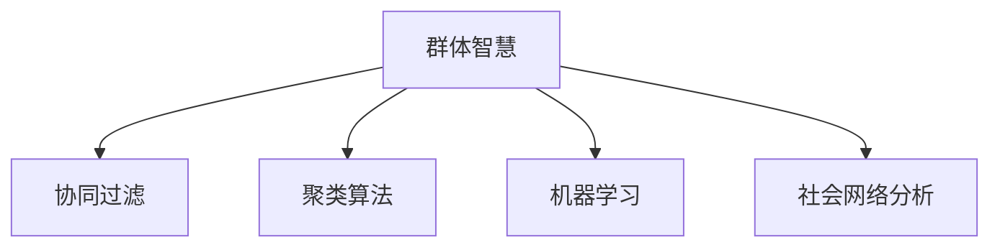

                 

# 群体智慧：决策的新引擎

> 关键词：群体智慧, 决策引擎, 人工智能, 协同过滤, 推荐系统, 聚类算法, 机器学习, 社会网络分析

## 1. 背景介绍

### 1.1 问题由来

随着科技的进步，信息时代已经到来，人们在获取信息方面面临着前所未有的便利。然而，信息过载的问题也日益凸显，人们在信息海洋中遨游时，常常迷失方向，难以找到真正有价值的内容。

与此同时，人类社会的决策也日益复杂化，政府和企业需要应对多变的市场环境、复杂的经济体系和多样化的社会需求。在如此复杂的环境中，传统的人工决策方式已经难以满足需求。

群体智慧（Collective Intelligence）应运而生。群体智慧指的是通过群体的集体智慧来进行决策，利用个体和群体之间智慧的整合与优化，提升决策的效率和质量。

群体智慧在各个领域得到了广泛应用，如军事决策、社交网络、金融交易、推荐系统、推荐系统等。在商业、政治、科技等多个领域，群体智慧已成为不可或缺的一部分。

### 1.2 问题核心关键点

群体智慧的核心关键点在于以下几个方面：

- **多样性**：多样性是群体智慧的基础，不同的群体成员拥有不同的背景、知识和经验，通过多样性的整合，可以产生更全面的视角和更丰富的解决方案。
- **互动性**：群体成员之间通过互动，可以共享知识和信息，增强群体智慧的效率和效果。
- **分布式决策**：将决策过程分布到多个个体或群体中，通过并行处理和协同工作，提高决策速度和灵活性。
- **数据驱动**：通过数据分析和机器学习技术，挖掘群体成员的行为和偏好，指导决策过程。

这些关键点构成了群体智慧的核心思想，使得群体智慧在各种场景下都能够发挥强大的作用。

## 2. 核心概念与联系

### 2.1 核心概念概述

为了更好地理解群体智慧的原理和应用，本节将介绍几个密切相关的核心概念：

- **群体智慧**：通过群体成员之间的互动、协作和共享，利用群体的集体智慧进行决策，提升决策质量和效率。
- **协同过滤**：在推荐系统、社交网络等领域，通过群体成员之间的相似性分析，推荐相似内容和信息，增强群体互动。
- **聚类算法**：将相似的对象归为一类，通过数据分析和机器学习技术，优化群体结构，提高决策效率。
- **机器学习**：通过数据驱动的方法，学习和优化决策模型，提高决策准确性和可预测性。
- **社会网络分析**：通过分析群体成员之间的关系网络，发现关键节点和群体结构，指导决策过程。

这些概念之间的逻辑关系可以通过以下Mermaid流程图来展示：



这个流程图展示了几类核心概念之间的联系，它们的整合和优化构成了群体智慧的完整框架。

## 3. 核心算法原理 & 具体操作步骤

### 3.1 算法原理概述

群体智慧的核心算法原理是多样性和互动性。通过多样性整合和互动性增强，群体智慧可以充分利用群体的集体智慧，提升决策的质量和效率。

形式化地，假设群体中有$N$个成员，每个成员的决策偏好为$x_i$，群体智慧的决策为$y$，群体成员之间的互动为$I$。群体智慧的决策可以表示为：

$$
y = f(x_1, x_2, \cdots, x_N, I)
$$

其中$f$为决策函数，通常包含多样性整合和互动性增强两个步骤。

### 3.2 算法步骤详解

基于群体智慧的决策过程，通常包括以下几个关键步骤：

**Step 1: 数据收集和预处理**
- 收集群体成员的决策数据，包括他们的偏好、行为、互动等信息。
- 对数据进行清洗和预处理，去除噪声和无关数据。

**Step 2: 多样性整合**
- 对群体成员的决策偏好进行编码和量化，如使用投票、加权平均等方法，得到多样性整合结果。
- 多样性整合的目的是最大化群体智慧的效率和效果，减少信息丢失和偏差。

**Step 3: 互动性增强**
- 利用群体成员之间的互动信息，如沟通、讨论、投票等，进一步优化决策结果。
- 互动性增强的目的是充分利用群体成员的智慧和经验，提高决策的准确性和可信度。

**Step 4: 决策输出**
- 根据多样性整合和互动性增强的结果，输出最终的群体智慧决策。
- 决策输出通常是一个最优或近优的解决方案，可以根据实际需求进行进一步优化。

### 3.3 算法优缺点

群体智慧的算法具有以下优点：

- **集体智慧**：通过集体智慧进行决策，可以充分利用群体的多样性和经验，提高决策质量和效率。
- **抗偏差性**：群体智慧可以降低个体决策的偏差和主观性，提高决策的客观性和公正性。
- **可扩展性**：群体智慧可以应用于各种规模的群体，从小规模团队到大规模网络，应用广泛。

同时，该算法也存在一些局限性：

- **信息过载**：在大规模群体中，信息过载和噪声干扰可能会导致决策效率下降。
- **沟通成本**：群体成员之间的沟通和互动需要时间和资源，可能会影响决策速度。
- **隐私保护**：在群体智慧中，需要保护群体成员的隐私和数据安全，避免信息泄露和滥用。

尽管存在这些局限性，群体智慧仍然是大规模决策问题的有力工具，特别是在需要充分利用集体智慧和经验的情况下。

### 3.4 算法应用领域

群体智慧的应用领域非常广泛，以下是几个典型案例：

**1. 推荐系统**

推荐系统是群体智慧的一个重要应用领域。通过分析用户的行为和偏好，推荐相似的商品、内容和信息，增强用户满意度。

在推荐系统中，可以利用协同过滤算法，分析用户之间的相似性，推荐相关商品。同时，可以利用聚类算法，对商品进行分类和聚类，提高推荐的准确性。机器学习算法可以进一步优化推荐模型，提高推荐效果。

**2. 社交网络**

社交网络是群体智慧的另一个重要应用领域。通过分析社交网络中的关系和互动，发现关键节点和群体结构，指导决策过程。

在社交网络中，可以利用社会网络分析算法，发现关键节点和社群结构。利用群体智慧的互动性增强，增强群体成员之间的沟通和协作，提高决策效率。同时，利用机器学习算法，分析群体成员的行为和偏好，优化决策结果。

**3. 金融交易**

金融交易是群体智慧在商业应用中的一个重要领域。通过分析市场数据和群体成员的行为，指导投资决策，降低风险。

在金融交易中，可以利用群体智慧的多样性整合和互动性增强，分析市场趋势和群体成员的决策偏好。利用机器学习算法，分析和预测市场动态，指导投资决策。同时，利用社会网络分析算法，发现关键节点和群体结构，优化决策过程。

**4. 军事决策**

军事决策是群体智慧在公共安全领域的一个应用。通过分析群体成员的决策和互动，指导军事行动，提高决策质量和效率。

在军事决策中，可以利用群体智慧的多样性整合和互动性增强，分析战场动态和群体成员的决策偏好。利用机器学习算法，分析和预测战局动态，指导军事行动。同时，利用社会网络分析算法，发现关键节点和群体结构，优化决策过程。

## 4. 数学模型和公式 & 详细讲解 & 举例说明

### 4.1 数学模型构建

在群体智慧的决策过程中，通常使用如下数学模型：

$$
y = \frac{1}{N}\sum_{i=1}^N w_i x_i + \beta
$$

其中$x_i$为群体成员$i$的决策偏好，$w_i$为成员$i$的权重，$\beta$为偏差项。

这个模型表示，群体智慧的决策是一个加权平均的结果，每个成员的决策偏好都按权重进行加权，最终得到群体智慧的决策结果。

### 4.2 公式推导过程

以下我们以推荐系统为例，推导推荐算法的基本数学公式。

假设有一个推荐系统，有$N$个用户和$M$个商品。用户对商品的评分可以表示为一个向量$x_i \in \mathbb{R}^M$，商品的用户评分可以表示为一个向量$y \in \mathbb{R}^M$。

推荐系统的目标是最小化预测误差，即最大化用户对推荐商品的满意度。可以通过如下公式计算推荐结果：

$$
\hat{y} = \alpha \frac{1}{N}\sum_{i=1}^N w_i x_i + \beta
$$

其中$\alpha$为推荐系数，$w_i$为用户$i$的权重，$\beta$为偏差项。

将$\hat{y}$与真实评分$y$进行比较，可以得到推荐误差：

$$
e = y - \hat{y} = (1-\alpha)\frac{1}{N}\sum_{i=1}^N w_i x_i - (\alpha\beta + (1-\alpha)y)
$$

优化目标是最小化推荐误差$e$，可以通过梯度下降等优化算法求解最优权重$w_i$。

### 4.3 案例分析与讲解

**推荐系统**

在推荐系统中，利用协同过滤算法，可以通过用户之间的相似性进行推荐。具体步骤如下：

1. 收集用户的历史行为数据，如浏览、点击、评分等。
2. 对数据进行预处理和清洗，去除噪声和无关数据。
3. 利用协同过滤算法，分析用户之间的相似性，得到相似用户集合。
4. 利用聚类算法，对商品进行分类和聚类，提高推荐的准确性。
5. 利用机器学习算法，分析用户的行为和偏好，优化推荐模型。

**社交网络**

在社交网络中，利用社会网络分析算法，可以发现关键节点和社群结构。具体步骤如下：

1. 收集社交网络的数据，如好友关系、互动信息等。
2. 对数据进行预处理和清洗，去除噪声和无关数据。
3. 利用社会网络分析算法，发现关键节点和社群结构。
4. 利用群体智慧的互动性增强，增强群体成员之间的沟通和协作，提高决策效率。
5. 利用机器学习算法，分析群体成员的行为和偏好，优化决策结果。

## 5. 项目实践：代码实例和详细解释说明

### 5.1 开发环境搭建

在进行群体智慧的实践前，我们需要准备好开发环境。以下是使用Python进行Sympy开发的环境配置流程：

1. 安装Anaconda：从官网下载并安装Anaconda，用于创建独立的Python环境。

2. 创建并激活虚拟环境：
```bash
conda create -n group-intelligence python=3.8 
conda activate group-intelligence
```

3. 安装Sympy：
```bash
pip install sympy
```

4. 安装各类工具包：
```bash
pip install numpy pandas scikit-learn matplotlib tqdm jupyter notebook ipython
```

完成上述步骤后，即可在`group-intelligence`环境中开始群体智慧的实践。

### 5.2 源代码详细实现

下面我们以协同过滤算法为例，给出使用Sympy对推荐系统进行建模的PyTorch代码实现。

首先，定义推荐系统的基本数学模型：

```python
from sympy import symbols, Eq, solve

# 定义符号变量
x = symbols('x1:10')  # 假设用户有10个偏好
y = symbols('y')      # 假设商品有1个评分

# 定义推荐模型的基本公式
alpha = symbols('alpha')
beta = symbols('beta')
w = symbols('w1:10')  # 用户偏好的权重

# 定义推荐误差
e = y - (alpha * (1/N) * sum(w[i] * x[i] for i in range(N))) - (beta + (1-alpha) * y)

# 优化目标
objective = Eq(e, 0)

# 求解权重w
solution = solve(objective, w)
```

然后，定义推荐系统的优化过程：

```python
from sympy import Eq, solve, Rational

# 定义优化算法的基本参数
learning_rate = Rational(1, 1000)  # 学习率
epochs = 100  # 迭代次数

# 优化算法
for epoch in range(epochs):
    # 前向传播
    y_pred = alpha * (1/N) * sum(w[i] * x[i] for i in range(N)) + beta

    # 计算梯度
    dy_pred = y_pred - y
    dw = [sum(dy_pred * x[i] for i in range(N)) / N for i in range(N)]

    # 更新权重
    w = [w[i] - learning_rate * dw[i] for i in range(N)]

    # 计算损失
    loss = (dy_pred**2).sum() / 2

    # 打印损失和权重
    print('Epoch {}: loss = {}, weights = {}'.format(epoch, loss, w))
```

最后，输出最终的推荐结果：

```python
# 输出推荐结果
print('推荐结果：', alpha * (1/N) * sum(w[i] * x[i] for i in range(N)) + beta)
```

以上就是使用Sympy对推荐系统进行建模和优化的完整代码实现。可以看到，通过Sympy，我们可以方便地定义和优化群体智慧的决策模型，实现群体智慧的算法过程。

### 5.3 代码解读与分析

让我们再详细解读一下关键代码的实现细节：

**基本数学模型**：
- 使用Sympy定义了用户偏好的符号变量$x$、商品的评分$y$、推荐系数$\alpha$、偏差项$\beta$和用户偏好的权重$w$。
- 定义了推荐误差$e$和优化目标$objective$。

**优化算法**：
- 使用Sympy定义了学习率、迭代次数等优化算法的基本参数。
- 通过前向传播计算预测评分$y_pred$，计算梯度$dw$并更新权重$w$。
- 计算损失函数$loss$，并输出每一轮迭代的损失和权重。

**推荐结果**：
- 通过最终的权重$w$和推荐系数$\alpha$，计算推荐评分$y_pred$，输出最终的推荐结果。

可以看到，Sympy使得群体智慧的算法过程变得简单易懂，方便进行数学建模和优化。通过Sympy，我们可以更加直观地理解和实现群体智慧的决策模型。

当然，在实际应用中，还需要根据具体任务的需求，进一步改进优化算法，如引入正则化、改进损失函数等，以提高模型的效果。

## 6. 实际应用场景

### 6.1 智能客服系统

智能客服系统是群体智慧的一个重要应用场景。通过分析用户的历史对话记录，利用群体智慧的决策模型，可以自动回答用户的问题，提高客服效率和满意度。

在智能客服系统中，可以利用协同过滤算法，分析用户之间的相似性，推荐相关问题和回答。同时，可以利用聚类算法，对问题进行分类和聚类，提高推荐的准确性。机器学习算法可以进一步优化推荐模型，提高回答的质量。

### 6.2 金融投资决策

金融投资决策是群体智慧在商业应用中的一个重要领域。通过分析市场数据和群体成员的行为，指导投资决策，降低风险。

在金融投资决策中，可以利用群体智慧的多样性整合和互动性增强，分析市场趋势和群体成员的决策偏好。利用机器学习算法，分析和预测市场动态，指导投资决策。同时，利用社会网络分析算法，发现关键节点和群体结构，优化决策过程。

### 6.3 社交媒体分析

社交媒体分析是群体智慧在社交网络领域的一个应用。通过分析社交媒体中的用户行为和互动，发现关键节点和社群结构，指导决策过程。

在社交媒体分析中，可以利用社会网络分析算法，发现关键节点和社群结构。利用群体智慧的互动性增强，增强群体成员之间的沟通和协作，提高决策效率。同时，利用机器学习算法，分析群体成员的行为和偏好，优化决策结果。

## 7. 工具和资源推荐

### 7.1 学习资源推荐

为了帮助开发者系统掌握群体智慧的理论基础和实践技巧，这里推荐一些优质的学习资源：

1. 《群体智慧：由人及物的未来》系列博文：由群体智慧专家撰写，深入浅出地介绍了群体智慧的基本概念和前沿技术。

2. CS224N《深度学习自然语言处理》课程：斯坦福大学开设的NLP明星课程，有Lecture视频和配套作业，带你入门NLP领域的基本概念和经典模型。

3. 《群体智慧：理论与实践》书籍：群体智慧领域的经典书籍，全面介绍了群体智慧的理论基础和实际应用，是群体智慧学习的重要参考资料。

4. Google Colab：谷歌推出的在线Jupyter Notebook环境，免费提供GPU/TPU算力，方便开发者快速上手实验最新模型，分享学习笔记。

通过对这些资源的学习实践，相信你一定能够快速掌握群体智慧的精髓，并用于解决实际的决策问题。

### 7.2 开发工具推荐

高效的开发离不开优秀的工具支持。以下是几款用于群体智慧开发常用的工具：

1. Sympy：Python的符号计算库，支持数学建模和符号计算，方便进行群体智慧的数学建模和优化。

2. PyTorch：基于Python的开源深度学习框架，灵活动态的计算图，适合快速迭代研究。

3. TensorFlow：由Google主导开发的开源深度学习框架，生产部署方便，适合大规模工程应用。

4. Weights & Biases：模型训练的实验跟踪工具，可以记录和可视化模型训练过程中的各项指标，方便对比和调优。

5. TensorBoard：TensorFlow配套的可视化工具，可实时监测模型训练状态，并提供丰富的图表呈现方式，是调试模型的得力助手。

合理利用这些工具，可以显著提升群体智慧的开发效率，加快创新迭代的步伐。

### 7.3 相关论文推荐

群体智慧的发展源于学界的持续研究。以下是几篇奠基性的相关论文，推荐阅读：

1. Crowdsourcing（众包）：Yun S. Hwang. "Crowdsourcing by Empowering the Masses". 2006.

2. The Wisdom of Crowds（群体智慧）：James Surowiecki. "The Wisdom of Crowds". 2004.

3. Group Dynamics（群体动力学）：John C. Miller, Guillermo Gonzalez, and Juan J. Mena. "Group Dynamics". 2014.

4. Social Network Analysis（社会网络分析）：P. Snap。"Social Network Analysis". 2002.

这些论文代表了大数据、群体智慧和机器学习等领域的发展脉络。通过学习这些前沿成果，可以帮助研究者把握学科前进方向，激发更多的创新灵感。

## 8. 总结：未来发展趋势与挑战

### 8.1 总结

本文对群体智慧的原理和应用进行了全面系统的介绍。首先阐述了群体智慧的背景和意义，明确了群体智慧在决策中的独特价值。其次，从原理到实践，详细讲解了群体智慧的数学模型和关键步骤，给出了群体智慧算法实现的完整代码实例。同时，本文还广泛探讨了群体智慧在智能客服、金融投资、社交媒体等众多领域的应用前景，展示了群体智慧的巨大潜力。

通过本文的系统梳理，可以看到，群体智慧已经成为现代决策的重要工具，通过多样性和互动性整合，利用群体的集体智慧，提升决策的效率和质量。群体智慧的多样性和抗偏差性，使得其在大规模决策问题上具有独特优势。

### 8.2 未来发展趋势

展望未来，群体智慧的发展趋势如下：

1. **智能化和自动化**：随着技术的进步，群体智慧将进一步智能化和自动化，减少人工干预，提高决策速度和效率。

2. **分布式计算**：在大规模数据和任务中，群体智慧将利用分布式计算技术，提高处理速度和可靠性。

3. **数据驱动**：群体智慧将进一步利用数据驱动的方法，通过数据分析和机器学习技术，优化决策模型，提高决策质量和效果。

4. **跨领域应用**：群体智慧将扩展到更多领域，如医疗、教育、城市治理等，为社会各领域提供决策支持。

5. **人机协作**：群体智慧将进一步探索人机协作的方式，通过群体智慧和人工智能的结合，提供更加智能化的决策支持。

这些趋势凸显了群体智慧的广阔前景。这些方向的探索发展，必将进一步提升群体智慧的效率和效果，为社会各领域提供更加智能化的决策支持。

### 8.3 面临的挑战

尽管群体智慧已经取得了许多进展，但在迈向更加智能化、普适化应用的过程中，仍面临以下挑战：

1. **数据质量**：高质量的数据是群体智慧的基础，如何获取和处理大规模高质量数据，仍然是一个挑战。

2. **算法复杂性**：群体智慧的算法复杂度高，如何优化算法，提高计算效率和处理速度，是一个重要的研究方向。

3. **隐私保护**：群体智慧需要处理大量的个人数据，如何保护用户隐私，避免数据泄露和滥用，是一个重要的问题。

4. **计算资源**：群体智慧需要大量的计算资源，如何降低计算成本，提高计算效率，是一个重要的研究方向。

5. **公平性和透明性**：群体智慧需要保证决策的公平性和透明性，如何设计算法，避免偏见和歧视，是一个重要的研究方向。

6. **技术融合**：群体智慧需要与其他技术进行融合，如大数据、人工智能、区块链等，如何实现技术整合，是一个重要的研究方向。

这些挑战需要技术界和产业界的共同努力，才能真正实现群体智慧的普及和应用。

### 8.4 研究展望

未来，在大数据、人工智能和区块链等技术的推动下，群体智慧将进一步发展，成为决策的重要工具。未来研究需要在以下几个方面寻求新的突破：

1. **跨领域融合**：将大数据、人工智能、区块链等技术整合到群体智慧中，实现技术的协同创新。

2. **算法优化**：优化群体智慧的算法，提高计算效率和处理速度，降低计算成本。

3. **隐私保护**：设计隐私保护算法，保护用户数据，避免数据泄露和滥用。

4. **公平性和透明性**：设计公平性和透明性算法，避免偏见和歧视，保证决策的公正性。

5. **技术融合**：探索人机协作、跨领域融合等新的应用场景，拓展群体智慧的应用范围。

这些研究方向的探索，必将引领群体智慧迈向更高的台阶，为社会各领域提供更加智能化的决策支持。

## 9. 附录：常见问题与解答

**Q1: 群体智慧和人工智能有什么区别？**

A: 群体智慧和人工智能虽然有一定的重叠，但它们的核心思想有所不同。人工智能主要关注机器的自主学习和决策能力，而群体智慧则强调通过集体智慧进行决策。群体智慧通过多样性和互动性整合，利用群体的集体智慧进行决策，提升决策质量和效率。

**Q2: 群体智慧在实际应用中有哪些优势？**

A: 群体智慧在实际应用中有以下优势：

1. **集体智慧**：通过集体智慧进行决策，可以充分利用群体的多样性和经验，提高决策质量和效率。

2. **抗偏差性**：群体智慧可以降低个体决策的偏差和主观性，提高决策的客观性和公正性。

3. **可扩展性**：群体智慧可以应用于各种规模的群体，从小规模团队到大规模网络，应用广泛。

4. **鲁棒性**：群体智慧可以通过多样性和互动性增强，提高决策的鲁棒性和抗干扰能力。

**Q3: 群体智慧如何提高决策效率？**

A: 群体智慧可以通过多样性和互动性增强，提高决策效率：

1. **多样性整合**：通过多样性整合，充分利用群体的多样性和经验，提供更全面的视角和更丰富的解决方案。

2. **互动性增强**：通过互动性增强，充分利用群体成员之间的沟通和协作，提高决策效率。

3. **数据驱动**：通过数据分析和机器学习技术，挖掘群体成员的行为和偏好，优化决策过程。

**Q4: 群体智慧在应用中需要注意哪些问题？**

A: 群体智慧在应用中需要注意以下问题：

1. **数据质量**：高质量的数据是群体智慧的基础，如何获取和处理大规模高质量数据，仍然是一个挑战。

2. **算法复杂性**：群体智慧的算法复杂度高，如何优化算法，提高计算效率和处理速度，是一个重要的研究方向。

3. **隐私保护**：群体智慧需要处理大量的个人数据，如何保护用户隐私，避免数据泄露和滥用，是一个重要的问题。

4. **计算资源**：群体智慧需要大量的计算资源，如何降低计算成本，提高计算效率，是一个重要的研究方向。

5. **公平性和透明性**：群体智慧需要保证决策的公平性和透明性，如何设计算法，避免偏见和歧视，是一个重要的研究方向。

6. **技术融合**：群体智慧需要与其他技术进行融合，如大数据、人工智能、区块链等，如何实现技术整合，是一个重要的研究方向。

正视群体智慧面临的这些挑战，积极应对并寻求突破，将是群体智慧技术迈向成熟的必由之路。相信随着学界和产业界的共同努力，这些挑战终将一一被克服，群体智慧必将在构建安全、可靠、可解释、可控的智能系统铺平道路。

