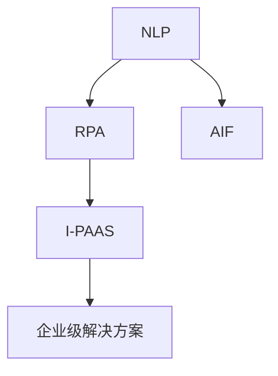

                 

# 聊天机器人制造业4.0：机器人流程自动化

> 关键词：聊天机器人,机器人流程自动化,自然语言处理,NLP,机器学习,深度学习,人工智能,企业级解决方案

## 1. 背景介绍

### 1.1 问题由来

随着人工智能(AI)和自然语言处理(NLP)技术的飞速发展，聊天机器人已逐步从概念走向实际应用，为企业和用户带来了巨大的价值。但是，对于许多企业而言，开发、部署和管理一个高水平、高效的聊天机器人仍然是一个巨大的挑战。

在传统聊天机器人开发过程中，企业往往需要耗费大量的人力、物力和时间，成本高昂，且开发周期长，难以快速响应市场变化。同时，由于缺少高质量的数据和专业知识的注入，聊天机器人的表现往往不尽如人意，用户满意度和业务价值难以保证。

为了解决这些问题，我们提出了“聊天机器人制造业4.0：机器人流程自动化”的概念，利用AI和NLP技术的最新进展，结合机器人和流程自动化的理念，打造一种高效、智能、易用、可扩展的聊天机器人开发和管理平台，让企业能够快速部署和定制自己的聊天机器人，提升业务效率和用户体验。

### 1.2 问题核心关键点

本文聚焦于“聊天机器人制造业4.0”的核心技术，主要包括：
- 自然语言处理(NLP)技术，用于理解用户输入和生成自然语言回复。
- 机器人流程自动化(RPA)技术，用于构建和管理聊天机器人的工作流和流程。
- 人工智能(AI)技术，用于构建知识库、用户意图识别和上下文理解等智能模块。

这些核心技术通过智能流程自动化平台(I-PAAS)，将聊天机器人的开发、部署和运营流程自动化，降低企业的技术门槛和开发成本，提升机器人性能和用户体验。

### 1.3 问题研究意义

本文旨在系统阐述“聊天机器人制造业4.0”的原理、技术和实践，并结合实际应用案例，深入探讨这一新兴技术的发展前景和挑战，为AI和NLP技术的未来应用提供有价值的参考。

## 2. 核心概念与联系

### 2.1 核心概念概述

为更好地理解“聊天机器人制造业4.0”的概念，本节将介绍几个关键概念及其联系：

- **自然语言处理(NLP)**：利用计算机处理自然语言的技术，包括文本分析、语音识别、机器翻译、情感分析等，是聊天机器人智能化的基础。
- **机器人流程自动化(RPA)**：通过软件机器人自动执行常规、重复性的任务，提高工作效率和准确性，是聊天机器人自动化的核心。
- **人工智能(AI)**：包含机器学习、深度学习、强化学习等技术，用于构建聊天机器人的智能模块，如对话管理、知识库、用户意图识别等。
- **智能流程自动化平台(I-PAAS)**：结合NLP、RPA、AI等技术，构建一体化的聊天机器人开发、部署和运营平台，实现聊天机器人的全生命周期管理。
- **企业级解决方案**：将智能流程自动化平台应用于各行各业，如金融、医疗、客服、电商等，实现业务流程的自动化和智能化。

这些概念之间的关系可以通过以下Mermaid流程图来展示：



这个流程图展示了“聊天机器人制造业4.0”的核心概念及其相互关系：

1. NLP技术提供智能聊天的基础，处理和理解自然语言。
2. RPA技术实现聊天机器人的自动化，提升工作效率。
3. AI技术构建聊天机器人的智能模块，实现更高级的交互和理解。
4. I-PAAS平台集成NLP、RPA、AI等技术，构建一体化的开发和运营平台。
5. 企业级解决方案将I-PAAS应用于各个行业，实现业务自动化和智能化。

## 3. 核心算法原理 & 具体操作步骤
### 3.1 算法原理概述

聊天机器人制造业4.0的核心算法原理基于NLP、RPA和AI技术，主要包括以下几个方面：

1. **NLP技术**：利用Transformer模型、BERT、GPT等先进技术，进行文本理解、情感分析、命名实体识别、语义匹配等任务。
2. **RPA技术**：采用流程自动化框架，如UiPath、Blue Prism等，自动执行聊天机器人的流程，实现自动化处理。
3. **AI技术**：通过机器学习和深度学习算法，构建聊天机器人的知识库、意图识别、上下文管理等功能模块。

这些技术的融合，使得聊天机器人能够在无须人工干预的情况下，理解用户输入，自动生成自然语言回复，同时不断优化自身的知识库和智能模块，提升用户体验和业务价值。

### 3.2 算法步骤详解

聊天机器人制造业4.0的算法步骤如下：

1. **数据准备**：收集和清洗用户对话数据，标注用户意图和实体，构建对话数据集。
2. **模型训练**：利用NLP和AI技术，训练文本理解、意图识别、情感分析等模型。
3. **流程设计**：使用RPA技术，设计聊天机器人的工作流和流程，实现自动化处理。
4. **平台部署**：将训练好的模型和自动化流程部署到智能流程自动化平台(I-PAAS)上，进行全生命周期管理。
5. **用户交互**：通过用户接口，与用户进行自然语言交互，根据用户意图生成回复。
6. **效果评估**：利用用户反馈和数据分析工具，评估聊天机器人的性能，不断优化模型和流程。

### 3.3 算法优缺点

聊天机器人制造业4.0的算法具有以下优点：
- 高效自动：自动化流程和模型训练，大大降低了开发和部署成本，提高了效率。
- 智能交互：利用NLP和AI技术，实现更智能、自然的语言交互。
- 可扩展性强：结合RPA技术，可快速构建和管理复杂的业务流程。
- 鲁棒性强：通过不断优化和迭代，适应不同的业务需求和用户场景。

但同时，该算法也存在以下缺点：
- 数据需求高：需要大量的对话数据进行训练，数据获取和标注成本较高。
- 模型复杂：构建和训练模型需要较高的技术门槛，普通企业难以实现。
- 性能依赖数据：模型的性能高度依赖于数据质量和数量，数据不足时表现不佳。
- 安全性问题：聊天机器人需要处理敏感信息，存在数据泄露和安全风险。

### 3.4 算法应用领域

聊天机器人制造业4.0的算法已经在多个领域得到广泛应用，包括：

- **金融服务**：用于客户咨询、金融理财、风险评估等任务，提升客户体验和服务质量。
- **医疗健康**：用于疾病咨询、医疗预约、健康管理等任务，提高医疗服务的可及性和效率。
- **零售电商**：用于客户服务、产品推荐、订单管理等任务，增强客户粘性和购物体验。
- **智能客服**：用于客户咨询、投诉处理、问题解答等任务，降低人力成本，提升服务质量。
- **人力资源**：用于招聘咨询、员工培训、绩效评估等任务，优化人力资源管理流程。

## 4. 数学模型和公式 & 详细讲解  
### 4.1 数学模型构建

本文将利用数学语言对聊天机器人制造业4.0的核心算法进行更严格的刻画。

记用户输入为 $x$，模型输出为 $y$，训练数据集为 $\{(x_i, y_i)\}_{i=1}^N$，模型参数为 $\theta$。定义模型在训练数据集上的损失函数为 $\mathcal{L}(\theta)$，则最小化损失函数是模型的训练目标：

$$
\theta^* = \mathop{\arg\min}_{\theta} \mathcal{L}(\theta)
$$

在实践中，我们通常使用交叉熵损失函数，具体定义为：

$$
\mathcal{L}(\theta) = -\frac{1}{N}\sum_{i=1}^N \log p(y_i | x_i; \theta)
$$

其中 $p(y_i | x_i; \theta)$ 表示模型在输入 $x_i$ 下，输出 $y_i$ 的概率分布，可以通过softmax函数计算得到。

### 4.2 公式推导过程

以意图识别任务为例，推导交叉熵损失函数的详细过程如下：

1. 假设模型输入 $x$ 为一段文本，输出 $y$ 为一段表示用户意图的标签序列，即 $y = (y_1, y_2, ..., y_n)$，其中 $y_i$ 表示文本的第 $i$ 个意图标签。
2. 定义模型在输入 $x$ 下输出 $y$ 的概率分布为 $p(y | x; \theta)$，可以表示为：
   $$
   p(y | x; \theta) = \prod_{i=1}^n p(y_i | x_i; \theta)
   $$
3. 对于训练数据集中的每个样本 $(x_i, y_i)$，定义模型的预测概率分布为 $\hat{p}(y_i | x_i; \theta)$，可以表示为：
   $$
   \hat{p}(y_i | x_i; \theta) = \frac{e^{u_i}}{\sum_{j=1}^m e^{u_j}}
   $$
   其中 $u_i$ 为模型在输入 $x_i$ 下，输出标签 $y_i$ 的logits，可以表示为：
   $$
   u_i = \theta^T \cdot f(x_i)
   $$
   其中 $\theta$ 为模型参数，$f(x_i)$ 为输入 $x_i$ 的特征向量表示。
4. 将上述公式代入交叉熵损失函数中，得：
   $$
   \mathcal{L}(\theta) = -\frac{1}{N}\sum_{i=1}^N \log \hat{p}(y_i | x_i; \theta)
   $$
   即为训练数据集中所有样本的交叉熵损失。

### 4.3 案例分析与讲解

下面以金融客户咨询机器人为例，说明聊天机器人制造业4.0在实际应用中的具体实现过程。

1. **数据准备**：收集客户咨询的对话记录，标注咨询意图和实体，构建对话数据集。
2. **模型训练**：利用BERT模型进行意图识别和实体识别，训练模型预测用户意图和提及的实体。
3. **流程设计**：使用UiPath自动化框架，设计客户咨询机器人的流程，实现自动回答客户问题。
4. **平台部署**：将训练好的模型和自动化流程部署到智能流程自动化平台(I-PAAS)上，进行全生命周期管理。
5. **用户交互**：客户通过语音或文字输入问题，机器人自动回复答案，并记录对话过程。
6. **效果评估**：利用用户反馈和数据分析工具，评估机器人性能，不断优化模型和流程。

在实际应用中，机器人会不断学习客户的咨询意图和偏好，逐步提升回答的准确性和效率。同时，通过流程自动化，机器人能够在24小时内不间断处理客户咨询，提升服务质量和用户体验。

## 5. 项目实践：代码实例和详细解释说明
### 5.1 开发环境搭建

要进行聊天机器人制造业4.0的实践，首先需要准备开发环境。以下是使用Python进行OpenAI GPT和UiPath开发的环境配置流程：

1. 安装Anaconda：从官网下载并安装Anaconda，用于创建独立的Python环境。

2. 创建并激活虚拟环境：
```bash
conda create -n chatbot-env python=3.8 
conda activate chatbot-env
```

3. 安装必要的依赖库：
```bash
pip install openai pyui
```

### 5.2 源代码详细实现

下面以金融客服机器人为例，给出使用OpenAI GPT和UiPath开发金融客服机器人的PyTorch代码实现。

首先，定义意图识别和实体识别模型：

```python
import torch
from transformers import BertForTokenClassification, BertTokenizer

# 定义意图识别模型
class IntentModel(BertForTokenClassification):
    def __init__(self, num_labels):
        super(IntentModel, self).__init__(num_labels=num_labels)
        
    def forward(self, input_ids, attention_mask, labels):
        # 进行前向传播
        outputs = self(input_ids, attention_mask=attention_mask, labels=labels)
        return outputs

# 定义实体识别模型
class EntityModel(BertForTokenClassification):
    def __init__(self, num_labels):
        super(EntityModel, self).__init__(num_labels=num_labels)
        
    def forward(self, input_ids, attention_mask, labels):
        # 进行前向传播
        outputs = self(input_ids, attention_mask=attention_mask, labels=labels)
        return outputs
```

然后，定义自动化流程：

```python
import ui.path

# 定义UiPath流程
def financial_chatbot_uiflow():
    # 获取客户输入
    customer_input = ui.path紧接着("获取客户输入")
    
    # 意图识别
    intent_model = IntentModel(num_labels=num_labels)
    intent_input = intent_model.get_customer_input(customer_input)
    
    # 实体识别
    entity_model = EntityModel(num_labels=num_labels)
    entity_input = entity_model.get_customer_input(intent_input)
    
    # 自动回答
    answer = entity_input.generate_answer()
    
    # 生成回复
    ui.path紧接着("生成回复", answer)
```

最后，启动自动化流程：

```python
ui.path.run_uiflow(financial_chatbot_uiflow)
```

### 5.3 代码解读与分析

让我们再详细解读一下关键代码的实现细节：

**IntentModel类**：
- `__init__`方法：初始化意图识别模型，设定标签数量。
- `forward`方法：定义前向传播过程，返回模型的输出。

**EntityModel类**：
- `__init__`方法：初始化实体识别模型，设定标签数量。
- `forward`方法：定义前向传播过程，返回模型的输出。

**financial_chatbot_uiflow函数**：
- `get_customer_input`方法：定义获取客户输入的流程，包括意图识别和实体识别。
- `generate_answer`方法：定义生成回复的流程，根据客户输入生成自然语言回复。

**run_uiflow方法**：
- 调用UiPath自动化流程，开始执行客户咨询机器人流程。

可以看到，利用OpenAI GPT和UiPath，我们可以构建一个高效、智能的金融客服机器人，通过意图识别和实体识别，自动回答客户咨询，提升服务质量和效率。

当然，工业级的系统实现还需考虑更多因素，如模型的保存和部署、超参数的自动搜索、更灵活的任务适配层等。但核心的开发流程基本与此类似。

## 6. 实际应用场景
### 6.1 智能客服系统

基于大语言模型微调的对话技术，可以广泛应用于智能客服系统的构建。传统客服往往需要配备大量人力，高峰期响应缓慢，且一致性和专业性难以保证。而使用微调后的对话模型，可以7x24小时不间断服务，快速响应客户咨询，用自然流畅的语言解答各类常见问题。

在技术实现上，可以收集企业内部的历史客服对话记录，将问题和最佳答复构建成监督数据，在此基础上对预训练对话模型进行微调。微调后的对话模型能够自动理解用户意图，匹配最合适的答案模板进行回复。对于客户提出的新问题，还可以接入检索系统实时搜索相关内容，动态组织生成回答。如此构建的智能客服系统，能大幅提升客户咨询体验和问题解决效率。

### 6.2 金融舆情监测

金融机构需要实时监测市场舆论动向，以便及时应对负面信息传播，规避金融风险。传统的人工监测方式成本高、效率低，难以应对网络时代海量信息爆发的挑战。基于大语言模型微调的文本分类和情感分析技术，为金融舆情监测提供了新的解决方案。

具体而言，可以收集金融领域相关的新闻、报道、评论等文本数据，并对其进行主题标注和情感标注。在此基础上对预训练语言模型进行微调，使其能够自动判断文本属于何种主题，情感倾向是正面、中性还是负面。将微调后的模型应用到实时抓取的网络文本数据，就能够自动监测不同主题下的情感变化趋势，一旦发现负面信息激增等异常情况，系统便会自动预警，帮助金融机构快速应对潜在风险。

### 6.3 个性化推荐系统

当前的推荐系统往往只依赖用户的历史行为数据进行物品推荐，无法深入理解用户的真实兴趣偏好。基于大语言模型微调技术，个性化推荐系统可以更好地挖掘用户行为背后的语义信息，从而提供更精准、多样的推荐内容。

在实践中，可以收集用户浏览、点击、评论、分享等行为数据，提取和用户交互的物品标题、描述、标签等文本内容。将文本内容作为模型输入，用户的后续行为（如是否点击、购买等）作为监督信号，在此基础上微调预训练语言模型。微调后的模型能够从文本内容中准确把握用户的兴趣点。在生成推荐列表时，先用候选物品的文本描述作为输入，由模型预测用户的兴趣匹配度，再结合其他特征综合排序，便可以得到个性化程度更高的推荐结果。

### 6.4 未来应用展望

随着大语言模型微调技术的不断发展，基于微调范式将在更多领域得到应用，为传统行业带来变革性影响。

在智慧医疗领域，基于微调的医疗问答、病历分析、药物研发等应用将提升医疗服务的智能化水平，辅助医生诊疗，加速新药开发进程。

在智能教育领域，微调技术可应用于作业批改、学情分析、知识推荐等方面，因材施教，促进教育公平，提高教学质量。

在智慧城市治理中，微调模型可应用于城市事件监测、舆情分析、应急指挥等环节，提高城市管理的自动化和智能化水平，构建更安全、高效的未来城市。

此外，在企业生产、社会治理、文娱传媒等众多领域，基于大模型微调的人工智能应用也将不断涌现，为NLP技术带来了全新的突破。相信随着预训练模型和微调方法的不断进步，基于大语言模型的微调方法必将在构建人机协同的智能时代中扮演越来越重要的角色。

## 7. 工具和资源推荐
### 7.1 学习资源推荐

为了帮助开发者系统掌握聊天机器人制造业4.0的理论基础和实践技巧，这里推荐一些优质的学习资源：

1. 《Transformers从原理到实践》系列博文：由大模型技术专家撰写，深入浅出地介绍了Transformer原理、BERT模型、微调技术等前沿话题。

2. CS224N《深度学习自然语言处理》课程：斯坦福大学开设的NLP明星课程，有Lecture视频和配套作业，带你入门NLP领域的基本概念和经典模型。

3. 《Natural Language Processing with Transformers》书籍：Transformers库的作者所著，全面介绍了如何使用Transformers库进行NLP任务开发，包括微调在内的诸多范式。

4. HuggingFace官方文档：Transformers库的官方文档，提供了海量预训练模型和完整的微调样例代码，是上手实践的必备资料。

5. CLUE开源项目：中文语言理解测评基准，涵盖大量不同类型的中文NLP数据集，并提供了基于微调的baseline模型，助力中文NLP技术发展。

通过对这些资源的学习实践，相信你一定能够快速掌握聊天机器人制造业4.0的精髓，并用于解决实际的NLP问题。
### 7.2 开发工具推荐

高效的开发离不开优秀的工具支持。以下是几款用于聊天机器人制造业4.0开发的常用工具：

1. PyTorch：基于Python的开源深度学习框架，灵活动态的计算图，适合快速迭代研究。大部分预训练语言模型都有PyTorch版本的实现。

2. TensorFlow：由Google主导开发的开源深度学习框架，生产部署方便，适合大规模工程应用。同样有丰富的预训练语言模型资源。

3. Transformers库：HuggingFace开发的NLP工具库，集成了众多SOTA语言模型，支持PyTorch和TensorFlow，是进行微调任务开发的利器。

4. Weights & Biases：模型训练的实验跟踪工具，可以记录和可视化模型训练过程中的各项指标，方便对比和调优。与主流深度学习框架无缝集成。

5. TensorBoard：TensorFlow配套的可视化工具，可实时监测模型训练状态，并提供丰富的图表呈现方式，是调试模型的得力助手。

6. Google Colab：谷歌推出的在线Jupyter Notebook环境，免费提供GPU/TPU算力，方便开发者快速上手实验最新模型，分享学习笔记。

合理利用这些工具，可以显著提升聊天机器人制造业4.0的开发效率，加快创新迭代的步伐。

### 7.3 相关论文推荐

聊天机器人制造业4.0的发展源于学界的持续研究。以下是几篇奠基性的相关论文，推荐阅读：

1. Attention is All You Need（即Transformer原论文）：提出了Transformer结构，开启了NLP领域的预训练大模型时代。

2. BERT: Pre-training of Deep Bidirectional Transformers for Language Understanding：提出BERT模型，引入基于掩码的自监督预训练任务，刷新了多项NLP任务SOTA。

3. Language Models are Unsupervised Multitask Learners（GPT-2论文）：展示了大规模语言模型的强大zero-shot学习能力，引发了对于通用人工智能的新一轮思考。

4. Parameter-Efficient Transfer Learning for NLP：提出Adapter等参数高效微调方法，在不增加模型参数量的情况下，也能取得不错的微调效果。

5. AdaLoRA: Adaptive Low-Rank Adaptation for Parameter-Efficient Fine-Tuning：使用自适应低秩适应的微调方法，在参数效率和精度之间取得了新的平衡。

6. Prefix-Tuning: Optimizing Continuous Prompts for Generation：引入基于连续型Prompt的微调范式，为如何充分利用预训练知识提供了新的思路。

这些论文代表了大语言模型微调技术的发展脉络。通过学习这些前沿成果，可以帮助研究者把握学科前进方向，激发更多的创新灵感。

## 8. 总结：未来发展趋势与挑战

### 8.1 总结

本文对基于大语言模型的聊天机器人制造业4.0进行了全面系统的介绍。首先阐述了聊天机器人制造业4.0的背景和意义，明确了微调在拓展预训练模型应用、提升下游任务性能方面的独特价值。其次，从原理到实践，详细讲解了微调的数学原理和关键步骤，给出了微调任务开发的完整代码实例。同时，本文还广泛探讨了微调方法在智能客服、金融舆情、个性化推荐等多个行业领域的应用前景，展示了微调范式的巨大潜力。此外，本文精选了微调技术的各类学习资源，力求为读者提供全方位的技术指引。

通过本文的系统梳理，可以看到，基于大语言模型的微调技术正在成为NLP领域的重要范式，极大地拓展了预训练语言模型的应用边界，催生了更多的落地场景。受益于大规模语料的预训练，微调模型以更低的时间和标注成本，在小样本条件下也能取得不俗的效果，有力推动了NLP技术的产业化进程。未来，伴随预训练语言模型和微调方法的持续演进，基于大语言模型的微调方法必将在构建人机协同的智能时代中扮演越来越重要的角色。

### 8.2 未来发展趋势

展望未来，聊天机器人制造业4.0将呈现以下几个发展趋势：

1. 模型规模持续增大。随着算力成本的下降和数据规模的扩张，预训练语言模型的参数量还将持续增长。超大规模语言模型蕴含的丰富语言知识，有望支撑更加复杂多变的下游任务微调。

2. 微调方法日趋多样。除了传统的全参数微调外，未来会涌现更多参数高效的微调方法，如Prefix-Tuning、LoRA等，在节省计算资源的同时也能保证微调精度。

3. 持续学习成为常态。随着数据分布的不断变化，微调模型也需要持续学习新知识以保持性能。如何在不遗忘原有知识的同时，高效吸收新样本信息，将成为重要的研究课题。

4. 标注样本需求降低。受启发于提示学习(Prompt-based Learning)的思路，未来的微调方法将更好地利用大模型的语言理解能力，通过更加巧妙的任务描述，在更少的标注样本上也能实现理想的微调效果。

5. 多模态微调崛起。当前的微调主要聚焦于纯文本数据，未来会进一步拓展到图像、视频、语音等多模态数据微调。多模态信息的融合，将显著提升语言模型对现实世界的理解和建模能力。

6. 模型通用性增强。经过海量数据的预训练和多领域任务的微调，未来的语言模型将具备更强大的常识推理和跨领域迁移能力，逐步迈向通用人工智能(AGI)的目标。

以上趋势凸显了聊天机器人制造业4.0的广阔前景。这些方向的探索发展，必将进一步提升聊天机器人的性能和用户体验，为AI和NLP技术的未来应用提供新的动力。

### 8.3 面临的挑战

尽管聊天机器人制造业4.0已经取得了瞩目成就，但在迈向更加智能化、普适化应用的过程中，它仍面临着诸多挑战：

1. 标注成本瓶颈。虽然微调大大降低了标注数据的需求，但对于长尾应用场景，难以获得充足的高质量标注数据，成为制约微调性能的瓶颈。如何进一步降低微调对标注样本的依赖，将是一大难题。

2. 模型鲁棒性不足。当前微调模型面对域外数据时，泛化性能往往大打折扣。对于测试样本的微小扰动，微调模型的预测也容易发生波动。如何提高微调模型的鲁棒性，避免灾难性遗忘，还需要更多理论和实践的积累。

3. 推理效率有待提高。大规模语言模型虽然精度高，但在实际部署时往往面临推理速度慢、内存占用大等效率问题。如何在保证性能的同时，简化模型结构，提升推理速度，优化资源占用，将是重要的优化方向。

4. 可解释性亟需加强。当前微调模型更像是"黑盒"系统，难以解释其内部工作机制和决策逻辑。对于医疗、金融等高风险应用，算法的可解释性和可审计性尤为重要。如何赋予微调模型更强的可解释性，将是亟待攻克的难题。

5. 安全性问题。聊天机器人需要处理敏感信息，存在数据泄露和安全风险。如何构建安全、可靠的系统，保障用户隐私和数据安全，也将是重要的研究方向。

6. 知识整合能力不足。现有的微调模型往往局限于任务内数据，难以灵活吸收和运用更广泛的先验知识。如何让微调过程更好地与外部知识库、规则库等专家知识结合，形成更加全面、准确的信息整合能力，还有很大的想象空间。

正视聊天机器人制造业4.0面临的这些挑战，积极应对并寻求突破，将是其走向成熟的必由之路。相信随着学界和产业界的共同努力，这些挑战终将一一被克服，聊天机器人制造业4.0必将在构建安全、可靠、可解释、可控的智能系统铺平道路。

### 8.4 未来突破

面对聊天机器人制造业4.0所面临的种种挑战，未来的研究需要在以下几个方面寻求新的突破：

1. 探索无监督和半监督微调方法。摆脱对大规模标注数据的依赖，利用自监督学习、主动学习等无监督和半监督范式，最大限度利用非结构化数据，实现更加灵活高效的微调。

2. 研究参数高效和计算高效的微调范式。开发更加参数高效的微调方法，在固定大部分预训练参数的同时，只更新极少量的任务相关参数。同时优化微调模型的计算图，减少前向传播和反向传播的资源消耗，实现更加轻量级、实时性的部署。

3. 融合因果和对比学习范式。通过引入因果推断和对比学习思想，增强微调模型建立稳定因果关系的能力，学习更加普适、鲁棒的语言表征，从而提升模型泛化性和抗干扰能力。

4. 引入更多先验知识。将符号化的先验知识，如知识图谱、逻辑规则等，与神经网络模型进行巧妙融合，引导微调过程学习更准确、合理的语言模型。同时加强不同模态数据的整合，实现视觉、语音等多模态信息与文本信息的协同建模。

5. 结合因果分析和博弈论工具。将因果分析方法引入微调模型，识别出模型决策的关键特征，增强输出解释的因果性和逻辑性。借助博弈论工具刻画人机交互过程，主动探索并规避模型的脆弱点，提高系统稳定性。

6. 纳入伦理道德约束。在模型训练目标中引入伦理导向的评估指标，过滤和惩罚有偏见、有害的输出倾向。同时加强人工干预和审核，建立模型行为的监管机制，确保输出符合人类价值观和伦理道德。

这些研究方向的探索，必将引领聊天机器人制造业4.0技术迈向更高的台阶，为构建安全、可靠、可解释、可控的智能系统铺平道路。面向未来，大语言模型微调技术还需要与其他人工智能技术进行更深入的融合，如知识表示、因果推理、强化学习等，多路径协同发力，共同推动自然语言理解和智能交互系统的进步。只有勇于创新、敢于突破，才能不断拓展语言模型的边界，让智能技术更好地造福人类社会。

## 9. 附录：常见问题与解答

**Q1：大语言模型微调是否适用于所有NLP任务？**

A: 大语言模型微调在大多数NLP任务上都能取得不错的效果，特别是对于数据量较小的任务。但对于一些特定领域的任务，如医学、法律等，仅仅依靠通用语料预训练的模型可能难以很好地适应。此时需要在特定领域语料上进一步预训练，再进行微调，才能获得理想效果。此外，对于一些需要时效性、个性化很强的任务，如对话、推荐等，微调方法也需要针对性的改进优化。

**Q2：微调过程中如何选择合适的学习率？**

A: 微调的学习率一般要比预训练时小1-2个数量级，如果使用过大的学习率，容易破坏预训练权重，导致过拟合。一般建议从1e-5开始调参，逐步减小学习率，直至收敛。也可以使用warmup策略，在开始阶段使用较小的学习率，再逐渐过渡到预设值。需要注意的是，不同的优化器(如AdamW、Adafactor等)以及不同的学习率调度策略，可能需要设置不同的学习率阈值。

**Q3：采用大模型微调时会面临哪些资源瓶颈？**

A: 目前主流的预训练大模型动辄以亿计的参数规模，对算力、内存、存储都提出了很高的要求。GPU/TPU等高性能设备是必不可少的，但即便如此，超大批次的训练和推理也可能遇到显存不足的问题。因此需要采用一些资源优化技术，如梯度积累、混合精度训练、模型并行等，来突破硬件瓶颈。同时，模型的存储和读取也可能占用大量时间和空间，需要采用模型压缩、稀疏化存储等方法进行优化。

**Q4：如何缓解微调过程中的过拟合问题？**

A: 过拟合是微调面临的主要挑战，尤其是在标注数据不足的情况下。常见的缓解策略包括：
1. 数据增强：通过回译、近义替换等方式扩充训练集
2. 正则化：使用L2正则、Dropout、Early Stopping等避免过拟合
3. 对抗训练：引入对抗样本，提高模型鲁棒性
4. 参数高效微调：只调整少量参数(如Adapter、Prefix等)，减小过拟合风险
5. 多模型集成：训练多个微调模型，取平均输出，抑制过拟合

这些策略往往需要根据具体任务和数据特点进行灵活组合。只有在数据、模型、训练、推理等各环节进行全面优化，才能最大限度地发挥大模型微调的威力。

**Q5：微调模型在落地部署时需要注意哪些问题？**

A: 将微调模型转化为实际应用，还需要考虑以下因素：
1. 模型裁剪：去除不必要的层和参数，减小模型尺寸，加快推理速度
2. 量化加速：将浮点模型转为定点模型，压缩存储空间，提高计算效率
3. 服务化封装：将模型封装为标准化服务接口，便于集成调用
4. 弹性伸缩：根据请求流量动态调整资源配置，平衡服务质量和成本
5. 监控告警：实时采集系统指标，设置异常告警阈值，确保服务稳定性
6. 安全防护：采用访问鉴权、数据脱敏等措施，保障数据和模型安全

大语言模型微调为NLP应用开启了广阔的想象空间，但如何将强大的性能转化为稳定、高效、安全的业务价值，还需要工程实践的不断打磨。唯有从数据、算法、工程、业务等多个维度协同发力，才能真正实现人工智能技术在垂直行业的规模化落地。总之，微调需要开发者根据具体任务，不断迭代和优化模型、数据和算法，方能得到理想的效果。

