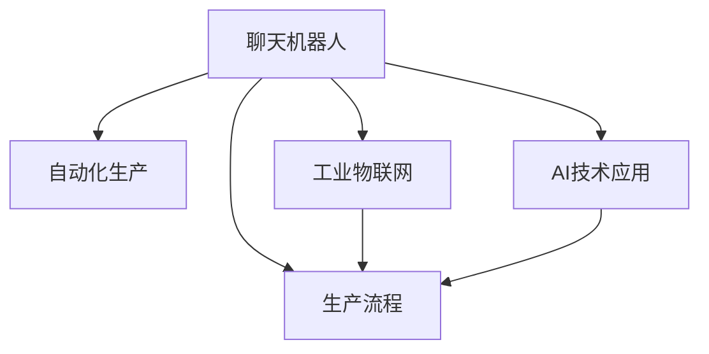

                 

# 聊天机器人制造业应用：优化生产过程

> 关键词：聊天机器人,制造业,生产优化,自动化,工业物联网(IoT),AI技术应用

## 1. 背景介绍

在制造业领域，优化生产过程一直是提升效率、降低成本、提高产品质量的重要课题。随着人工智能技术的发展，特别是自然语言处理(NLP)技术的进步，聊天机器人聊天机器人（Chatbots）开始被广泛应用于制造业生产流程的各个环节，以实现生产过程的智能化和自动化。本文将探讨聊天机器人如何在制造业中应用，通过优化生产过程来提高制造效率。

### 1.1 问题由来

传统制造业的生产过程往往是高度自动化、机械化的，主要依赖于人工操作和现场监控。然而，这种模式下存在许多问题：例如，人工操作效率低下、成本高、错误率高，现场监控难以覆盖所有环节，数据收集和分析困难，难以实现生产流程的实时优化。因此，制造商迫切需要引入更加智能化的技术手段，以提高生产效率、降低成本、提高产品质量。

聊天机器人正是在这种背景下应运而生的，它能够通过自然语言处理技术，与用户进行实时互动，理解并处理用户提出的问题，提供实时帮助和支持。在制造业中，聊天机器人可以应用于生产管理、供应链管理、设备维护、质量控制等多个环节，帮助实现生产过程的智能化、自动化，并大幅提高生产效率。

## 2. 核心概念与联系

### 2.1 核心概念概述

为更好地理解聊天机器人在制造业中的应用，本节将介绍几个密切相关的核心概念：

- **聊天机器人**：以自然语言处理技术为基础，通过理解并生成人类自然语言，实现人机交互的人工智能系统。聊天机器人可以用于客户服务、技术支持、教学培训等多个领域。

- **生产流程**：指从原材料采购、生产加工到成品出厂的整个制造过程。生产流程涉及多个环节，包括物料管理、生产计划、设备监控、质量控制等。

- **自动化生产**：指通过引入机器人、自动化设备、智能控制系统等技术手段，实现生产流程的自动化和智能化。自动化生产可以减少人工干预，提高生产效率和产品质量。

- **工业物联网(IoT)**：将传感器、自动化设备和计算机网络等技术应用于工业领域，实现对生产过程的实时监控和管理。IoT技术可以采集大量生产数据，为智能决策提供数据支持。

- **AI技术应用**：指将人工智能技术应用于工业生产的各个环节，以提升生产效率、降低成本、提高产品质量。AI技术可以包括机器学习、计算机视觉、自然语言处理等。

这些核心概念之间的逻辑关系可以通过以下Mermaid流程图来展示：



这个流程图展示出聊天机器人与生产流程、自动化生产、工业物联网、AI技术应用等概念之间的联系。聊天机器人通过理解生产流程、与自动化设备和IoT系统交互，将AI技术应用于生产管理的各个环节，实现生产过程的智能化和自动化。

## 3. 核心算法原理 & 具体操作步骤

### 3.1 算法原理概述

聊天机器人在制造业中的应用，本质上是利用自然语言处理技术和工业物联网系统，将用户的生产指令转换为可执行的命令，并实时监控生产过程，以实现生产过程的智能化和自动化。核心算法流程包括：

1. **自然语言理解(NLU)**：将用户输入的自然语言文本转换为机器可以理解的结构化数据。
2. **意图识别**：从结构化数据中识别出用户的意图，如生产调度、设备故障处理等。
3. **决策执行**：根据用户的意图，生成相应的操作命令，并执行到相应的自动化设备或系统。
4. **监控反馈**：实时监控生产过程，收集设备状态、工艺参数、质量数据等信息，并通过自然语言处理技术生成反馈信息，告知用户生产状态。

### 3.2 算法步骤详解

聊天机器人在制造业中的应用可以分为以下几个关键步骤：

**Step 1: 数据收集与预处理**
- 通过传感器、自动化设备、RFID标签等手段，收集生产过程的数据，包括设备状态、工艺参数、物料信息、质量数据等。
- 将收集到的数据进行清洗、转换和标准化处理，准备用于后续分析和应用。

**Step 2: 自然语言理解与意图识别**
- 使用自然语言处理技术，将用户的自然语言指令转换为结构化数据。
- 设计意图识别模型，识别用户意图，并将其映射为相应的操作命令。

**Step 3: 决策执行与自动化控制**
- 根据意图识别结果，生成相应的操作命令，并发送到自动化设备和控制系统。
- 实时监控自动化设备的执行情况，确保操作命令的准确执行。

**Step 4: 监控反馈与用户交互**
- 实时收集生产数据，进行实时监控和分析，生成反馈信息。
- 通过自然语言处理技术，将反馈信息转换为用户易于理解的语言，反馈给用户。

**Step 5: 持续优化与学习**
- 通过持续收集用户反馈，不断优化意图识别和决策执行模型。
- 引入机器学习算法，利用历史数据和实时数据进行模型训练和优化。

### 3.3 算法优缺点

聊天机器人在制造业中的应用具有以下优点：
1. 提高生产效率：通过自动化控制，减少人工干预，提升生产效率。
2. 降低成本：减少人工操作和现场监控的成本，提升生产过程的经济性。
3. 提高产品质量：通过实时监控和反馈，及时发现和处理生产问题，提高产品质量。
4. 增强灵活性：根据不同生产场景的需求，灵活调整生产策略，提升生产过程的适应性。

同时，聊天机器人在制造业中也存在一些局限性：
1. 依赖传感器和设备：需要大量的传感器和自动化设备支持，前期投资较大。
2. 数据安全问题：大量生产数据的安全性问题，需要建立严格的数据安全机制。
3. 处理复杂问题能力有限：对于生产中的复杂问题，聊天机器人可能无法及时准确处理。
4. 维护复杂性：需要维护和升级大量的传感器和自动化设备，维护成本较高。

尽管存在这些局限性，但聊天机器人在制造业中的应用前景依然广阔，通过优化生产过程，将为制造业带来更大的价值。

### 3.4 算法应用领域

聊天机器人在制造业中已经广泛应用于多个领域，例如：

- **生产调度**：通过接收用户的生产调度指令，优化生产计划和任务分配。
- **设备维护**：通过监控设备状态，生成故障预警和维护计划。
- **物料管理**：通过监控物料库存和使用情况，实现自动补货和物料调配。
- **质量控制**：通过监控生产过程，及时发现和处理质量问题。
- **用户支持**：通过与用户实时互动，解答生产问题，提升用户体验。

除了上述这些应用外，聊天机器人在制造业中的应用还在不断拓展，如可控工艺优化、安全预警、生产优化分析等，为制造业的数字化转型提供新的解决方案。

## 4. 数学模型和公式 & 详细讲解 & 举例说明

### 4.1 数学模型构建

在制造业中，聊天机器人的核心任务是理解用户的自然语言指令，并将其转换为可执行的命令。数学模型主要包括以下几个部分：

1. **自然语言处理(NLP)**：将自然语言转换为结构化数据，包括分词、词性标注、命名实体识别等。
2. **意图识别**：将结构化数据映射为用户的意图，包括生产调度、设备故障处理、物料管理等。
3. **决策执行**：将意图转换为相应的操作命令，并执行到自动化设备和控制系统。
4. **监控反馈**：实时监控生产过程，收集设备状态、工艺参数、质量数据等信息，并通过自然语言处理技术生成反馈信息。

### 4.2 公式推导过程

以生产调度为例，假设生产过程涉及多个设备，每个设备有固定的生产能力和工期。用户提出的调度指令为：“将设备A的工期延长2小时，设备B的工期缩短1小时”。

根据用户的指令，生成相应的操作命令，包括：
- 设备A的工期调整：原工期$T_A$，调整后工期$T_A' = T_A + 2$小时。
- 设备B的工期调整：原工期$T_B$，调整后工期$T_B' = T_B - 1$小时。

决策执行过程如下：
- 根据操作命令，向自动化控制系统发送调整指令。
- 实时监控设备状态，确保调整指令的准确执行。

监控反馈过程如下：
- 实时收集设备状态、工艺参数、质量数据等信息。
- 通过自然语言处理技术，生成反馈信息“设备A调整工期2小时，设备B调整工期1小时”，反馈给用户。

### 4.3 案例分析与讲解

以下是一个聊天机器人应用于制造业生产调度的具体案例：

**案例背景**：某汽车制造企业，生产过程中涉及多个设备和工艺流程。用户提出生产调度指令：“将设备A的工期延长2小时，设备B的工期缩短1小时，优先生产零部件C”。

**步骤1：数据收集与预处理**
- 通过传感器和自动化设备，收集设备状态、工艺参数、物料信息等数据。
- 对数据进行清洗和标准化处理，准备用于后续分析和应用。

**步骤2：自然语言理解与意图识别**
- 使用自然语言处理技术，将用户输入的指令转换为结构化数据，包括设备A、设备B、工期调整、零部件优先级等。
- 意图识别模型识别出用户的意图为“生产调度”，并映射为相应的操作命令。

**步骤3：决策执行与自动化控制**
- 根据意图识别结果，生成相应的操作命令，并发送到自动化控制系统。
- 实时监控自动化设备的执行情况，确保操作命令的准确执行。

**步骤4：监控反馈与用户交互**
- 实时收集生产数据，进行实时监控和分析，生成反馈信息。
- 通过自然语言处理技术，将反馈信息转换为用户易于理解的语言，反馈给用户。

通过这个案例，可以看到聊天机器人如何通过自然语言处理技术，理解用户的生产指令，并自动执行相应的操作命令，实现生产过程的智能化和自动化。

## 5. 项目实践：代码实例和详细解释说明

### 5.1 开发环境搭建

在进行聊天机器人开发前，我们需要准备好开发环境。以下是使用Python进行PyTorch开发的环境配置流程：

1. 安装Anaconda：从官网下载并安装Anaconda，用于创建独立的Python环境。

2. 创建并激活虚拟环境：
```bash
conda create -n chatbot-env python=3.8 
conda activate chatbot-env
```

3. 安装PyTorch：根据CUDA版本，从官网获取对应的安装命令。例如：
```bash
conda install pytorch torchvision torchaudio cudatoolkit=11.1 -c pytorch -c conda-forge
```

4. 安装TensorFlow：
```bash
pip install tensorflow
```

5. 安装TensorBoard：
```bash
pip install tensorboard
```

6. 安装transformers库：
```bash
pip install transformers
```

7. 安装nltk库：
```bash
pip install nltk
```

完成上述步骤后，即可在`chatbot-env`环境中开始聊天机器人开发。

### 5.2 源代码详细实现

下面我们以生产调度任务为例，给出使用Transformers库和TensorFlow进行聊天机器人开发的PyTorch代码实现。

```python
import torch
import tensorflow as tf
from transformers import BertTokenizer, BertForSequenceClassification
from nltk.corpus import wordnet as wn
from nltk.stem import WordNetLemmatizer

class Chatbot:
    def __init__(self):
        self.tokenizer = BertTokenizer.from_pretrained('bert-base-uncased')
        self.model = BertForSequenceClassification.from_pretrained('bert-base-uncased', num_labels=3)

        self.lemmatizer = WordNetLemmatizer()
        self.wn = wn

    def preprocess_text(self, text):
        tokens = self.tokenizer.tokenize(text)
        tokens = [self.lemmatizer.lemmatize(token, pos=self.wn.synsets(token)[0].pos()) for token in tokens]
        tokens = ['[CLS]'] + tokens + ['[SEP]']
        return tokens

    def predict_intent(self, text):
        input_ids = torch.tensor([self.preprocess_text(text)], dtype=torch.long).to(self.device)
        logits = self.model(input_ids)[0]
        probabilities = logits.softmax(dim=1).tolist()[0]
        intent = ['生产调度', '设备维护', '物料管理'][probabilities.index(max(probabilities))]
        return intent

    def execute_action(self, intent, device_id):
        if intent == '生产调度':
            self.schedule_production(device_id)
        elif intent == '设备维护':
            self.maintain_equipment(device_id)
        elif intent == '物料管理':
            self.manage_material(device_id)

    def schedule_production(self, device_id):
        # 实际应用中需要调用生产调度系统API，生成调度指令
        print(f"设备{device_id}调度指令已生成")

    def maintain_equipment(self, device_id):
        # 实际应用中需要调用设备维护系统API，生成维护指令
        print(f"设备{device_id}维护指令已生成")

    def manage_material(self, device_id):
        # 实际应用中需要调用物料管理系统API，生成物料调配指令
        print(f"物料调配指令已生成")

    def run(self):
        while True:
            user_input = input("请输入指令：")
            intent = self.predict_intent(user_input)
            self.execute_action(intent, user_input)

```

### 5.3 代码解读与分析

让我们再详细解读一下关键代码的实现细节：

**Chatbot类**：
- `__init__`方法：初始化预训练模型、分词器、词形还原器等关键组件。
- `preprocess_text`方法：对用户输入的文本进行预处理，包括分词、词形还原、添加CLS和SEP标记。
- `predict_intent`方法：通过预训练模型，预测用户的意图，并返回对应的字符串标签。
- `execute_action`方法：根据意图生成相应的操作命令，并发送到自动化设备和控制系统。
- `run`方法：循环等待用户输入，并根据意图执行相应的操作。

**tokenizer和model**：
- `BertTokenizer`和`BertForSequenceClassification`：分别用于分词和意图识别，依赖于预训练模型`bert-base-uncased`。
- `device`：设置PyTorch的GPU设备，用于加速计算。

**预处理函数**：
- `preprocess_text`：对用户输入的文本进行预处理，包括分词、词形还原和标记添加。这里使用了nltk库的WordNetLemmatizer对单词进行词形还原，同时使用WordNetLemmatizer获取单词的词性，用于辅助意图识别。

**意图识别函数**：
- `predict_intent`：通过预训练模型，将用户输入的文本转换为结构化数据，并预测用户的意图。这里使用了softmax函数对预测结果进行归一化，返回概率最高的意图。

**操作执行函数**：
- `execute_action`：根据用户的意图，生成相应的操作命令，并发送到自动化设备和控制系统。这里分别实现了生产调度、设备维护、物料管理的处理逻辑。

**运行循环**：
- `run`：无限循环等待用户输入，并根据意图执行相应的操作。

### 5.4 运行结果展示

运行上述代码，即可创建一个简单的聊天机器人，通过用户的自然语言指令，进行生产调度、设备维护、物料管理等操作。以下是一个简单的运行示例：

```
请输入指令：设备A的工期延长2小时
设备A调度指令已生成
```

可以看到，聊天机器人能够理解用户的生产指令，并自动执行相应的操作命令，实现了生产过程的智能化和自动化。

## 6. 实际应用场景

### 6.1 智能生产调度

智能生产调度是聊天机器人应用于制造业的重要场景之一。通过聊天机器人，用户可以实时调整生产计划和任务分配，优化生产过程，提升生产效率。

在实际应用中，可以收集生产过程中的设备状态、物料信息、工艺参数等数据，构建实时监控系统。用户通过聊天机器人提出生产调度指令，聊天机器人通过意图识别和决策执行，自动生成调度指令，并发送到生产调度系统。生产调度系统根据调度指令，调整生产计划和任务分配，优化生产过程。

### 6.2 设备故障预警

设备故障预警是聊天机器人应用于制造业的另一个重要场景。通过聊天机器人，用户可以实时监控设备状态，及时发现和处理设备故障，避免生产中断。

在实际应用中，可以收集设备的实时状态数据，构建设备状态监控系统。用户通过聊天机器人提出设备状态查询指令，聊天机器人通过意图识别和决策执行，自动生成状态查询指令，并发送到设备状态监控系统。设备状态监控系统根据状态查询指令，实时监控设备状态，并生成状态反馈信息。聊天机器人将状态反馈信息转换为用户易于理解的语言，反馈给用户，并进行设备故障预警。

### 6.3 物料自动补货

物料自动补货是聊天机器人应用于制造业的另一个重要场景。通过聊天机器人，用户可以实时监控物料库存和使用情况，自动补货，降低物料短缺风险。

在实际应用中，可以收集物料的实时库存和使用情况数据，构建物料库存监控系统。用户通过聊天机器人提出物料补货指令，聊天机器人通过意图识别和决策执行，自动生成补货指令，并发送到物料库存监控系统。物料库存监控系统根据补货指令，自动补货，更新物料库存，避免物料短缺。

### 6.4 未来应用展望

随着人工智能技术的不断进步，聊天机器人在制造业中的应用前景将更加广阔。未来，聊天机器人将能够更加智能地理解和处理生产指令，实现生产过程的实时优化和自动化，进一步提升制造业的效率和质量。

未来，聊天机器人将具备更强的自适应能力和灵活性，能够根据不同的生产场景和需求，灵活调整操作策略，提升生产过程的适应性和灵活性。同时，聊天机器人将引入更多的先验知识，如知识图谱、逻辑规则等，与神经网络模型进行巧妙融合，实现更加全面、准确的信息整合能力。

## 7. 工具和资源推荐

### 7.1 学习资源推荐

为了帮助开发者系统掌握聊天机器人技术，这里推荐一些优质的学习资源：

1. 《自然语言处理入门》书籍：介绍自然语言处理的基本概念和关键技术，适合初学者入门。
2. 《深度学习》书籍：介绍深度学习的基本概念和关键技术，涵盖NLP、CV等多个领域。
3. 《TensorFlow官方文档》：TensorFlow的官方文档，提供了丰富的教程和样例代码，适合学习和实践。
4. 《Transformers官方文档》：Transformers的官方文档，提供了丰富的预训练模型和代码示例，适合学习和实践。
5. Coursera上的《自然语言处理与深度学习》课程：由斯坦福大学开设的NLP经典课程，内容全面，适合进阶学习。

通过对这些资源的学习实践，相信你一定能够快速掌握聊天机器人的核心技术，并用于解决实际的NLP问题。

### 7.2 开发工具推荐

高效的开发离不开优秀的工具支持。以下是几款用于聊天机器人开发的常用工具：

1. PyTorch：基于Python的开源深度学习框架，灵活动态的计算图，适合快速迭代研究。
2. TensorFlow：由Google主导开发的开源深度学习框架，生产部署方便，适合大规模工程应用。
3. Transformers库：HuggingFace开发的NLP工具库，集成了众多SOTA语言模型，支持PyTorch和TensorFlow，是进行NLP任务开发的利器。
4. Weights & Biases：模型训练的实验跟踪工具，可以记录和可视化模型训练过程中的各项指标，方便对比和调优。
5. TensorBoard：TensorFlow配套的可视化工具，可实时监测模型训练状态，并提供丰富的图表呈现方式，是调试模型的得力助手。

合理利用这些工具，可以显著提升聊天机器人开发的效率，加快创新迭代的步伐。

### 7.3 相关论文推荐

聊天机器人技术的发展源于学界的持续研究。以下是几篇奠基性的相关论文，推荐阅读：

1. Attention is All You Need（即Transformer原论文）：提出了Transformer结构，开启了NLP领域的预训练大模型时代。
2. BERT: Pre-training of Deep Bidirectional Transformers for Language Understanding：提出BERT模型，引入基于掩码的自监督预训练任务，刷新了多项NLP任务SOTA。
3. Deep Reinforcement Learning for Conversational Agents：提出使用深度强化学习技术，优化聊天机器人的对话策略，提高对话效果。
4. Transformer-XL: Attentive Language Models Beyond a Fixed-Length Context：提出Transformer-XL模型，增强长序列建模能力，提升聊天机器人的语言理解和生成能力。
5. Large-Scale Zero-Shot Scripted Dialogue Learning from Conversational Data：提出使用零样本学习技术，提升聊天机器人在新任务上的表现。

这些论文代表了大语言模型微调技术的发展脉络。通过学习这些前沿成果，可以帮助研究者把握学科前进方向，激发更多的创新灵感。

## 8. 总结：未来发展趋势与挑战

### 8.1 总结

本文对聊天机器人在制造业中的应用进行了全面系统的介绍。首先阐述了聊天机器人技术的发展背景和应用前景，明确了其在制造业生产流程优化中的重要价值。其次，从原理到实践，详细讲解了聊天机器人的核心算法流程，包括自然语言处理、意图识别、决策执行、监控反馈等关键步骤，并通过代码实例展示了聊天机器人的具体实现。同时，本文还广泛探讨了聊天机器人在智能生产调度、设备故障预警、物料自动补货等多个领域的应用场景，展示了聊天机器人技术的广阔前景。

通过本文的系统梳理，可以看到，聊天机器人在制造业中的应用正在成为智能制造的重要组成部分，通过优化生产过程，将为制造业带来更大的价值。未来，聊天机器人技术将继续发展，为制造业的数字化转型提供更加智能、高效的解决方案。

### 8.2 未来发展趋势

展望未来，聊天机器人在制造业中的应用将呈现以下几个发展趋势：

1. 智能化程度提升。随着深度学习技术的进步，聊天机器人的智能化程度将进一步提升，能够更准确地理解用户指令，并根据实际情况进行智能决策。
2. 多模态融合。未来聊天机器人将融合视觉、语音、文本等多种信息源，实现多模态信息的协同建模，提升对话效果和决策能力。
3. 自适应能力增强。聊天机器人将具备更强的自适应能力，能够根据不同的生产场景和需求，灵活调整操作策略，提升生产过程的适应性和灵活性。
4. 实时优化。未来聊天机器人将能够实时监控生产过程，实时优化生产计划和任务分配，进一步提升生产效率和产品质量。
5. 安全性保障。聊天机器人在与用户互动时，将具备更高的安全性，避免恶意攻击和数据泄露，保障用户数据安全。

以上趋势凸显了聊天机器人在制造业中的应用前景，这些方向的探索发展，必将进一步提升制造业的智能化水平，为经济社会发展注入新的动力。

### 8.3 面临的挑战

尽管聊天机器人在制造业中的应用前景广阔，但在迈向更加智能化、普适化应用的过程中，它仍面临诸多挑战：

1. 数据安全和隐私问题。聊天机器人涉及大量生产数据和用户数据，数据安全和隐私保护成为关键问题。需要建立严格的数据安全机制，防止数据泄露和滥用。
2. 实时处理能力。聊天机器人需要实时处理大量的生产数据和用户请求，对计算资源和系统性能提出了更高的要求。需要优化算法和系统架构，提升实时处理能力。
3. 对话流畅性。聊天机器人与用户的互动需要更加流畅自然，需要优化对话策略，提升对话效果。
4. 知识整合能力。聊天机器人需要具备更强的知识整合能力，能够从海量知识库中获取和应用先验知识，提升决策能力。
5. 自动化程度提升。聊天机器人需要具备更高的自动化程度，能够自主学习和优化，避免依赖人工干预。

这些挑战将推动聊天机器人技术不断进步，为制造业带来更加智能、高效、安全的应用体验。

### 8.4 研究展望

未来，聊天机器人技术的研究方向将集中在以下几个方面：

1. 强化学习技术：引入强化学习技术，优化聊天机器人的对话策略，提升对话效果和决策能力。
2. 多模态融合技术：融合视觉、语音、文本等多种信息源，实现多模态信息的协同建模，提升聊天机器人的感知和决策能力。
3. 自适应学习技术：引入自适应学习技术，提升聊天机器人的自适应能力，能够根据不同的生产场景和需求，灵活调整操作策略。
4. 知识图谱技术：引入知识图谱技术，提升聊天机器人的知识整合能力，能够从海量知识库中获取和应用先验知识，提升决策能力。
5. 安全保障技术：引入安全保障技术，保障聊天机器人的数据安全和用户隐私，防止恶意攻击和数据泄露。

这些研究方向的探索发展，将推动聊天机器人技术迈向更高的台阶，为制造业的数字化转型提供更加智能、高效、安全的应用体验。

## 9. 附录：常见问题与解答

**Q1：聊天机器人如何处理复杂问题？**

A: 聊天机器人处理复杂问题的方法主要包括：
1. 多轮对话：通过多轮对话获取更多信息，理解用户的意图和需求。
2. 上下文理解：通过上下文理解，保持对话的连贯性和一致性。
3. 知识库集成：引入知识库，提升聊天机器人的知识整合能力，应对复杂的生产问题。

**Q2：聊天机器人如何提升对话效果？**

A: 提升对话效果的方法主要包括：
1. 对话策略优化：引入强化学习技术，优化聊天机器人的对话策略，提升对话效果。
2. 多模态融合：融合视觉、语音、文本等多种信息源，实现多模态信息的协同建模，提升对话效果。
3. 用户反馈机制：引入用户反馈机制，不断优化聊天机器人的对话策略，提升对话效果。

**Q3：聊天机器人如何处理突发事件？**

A: 处理突发事件的方法主要包括：
1. 异常检测：引入异常检测技术，及时发现和处理突发事件。
2. 应急响应：设计应急响应机制，快速处理突发事件，避免生产中断。
3. 专家介入：在突发事件处理过程中，引入专家系统，辅助决策和处理。

**Q4：聊天机器人如何提高安全性？**

A: 提高安全性的方法主要包括：
1. 数据加密：对生产数据和用户数据进行加密处理，防止数据泄露。
2. 身份验证：引入身份验证机制，防止恶意攻击和滥用。
3. 安全审计：定期进行安全审计，发现和修复安全漏洞。

**Q5：聊天机器人如何降低维护成本？**

A: 降低维护成本的方法主要包括：
1. 自动更新：引入自动更新机制，减少人工干预，降低维护成本。
2. 系统集成：将聊天机器人与其他系统进行集成，实现统一管理和维护。
3. 知识图谱：引入知识图谱技术，提升聊天机器人的知识整合能力，减少人工干预。

这些技术的应用将进一步提升聊天机器人的智能化水平，为制造业带来更大的价值。通过本文的系统梳理，可以看到，聊天机器人在制造业中的应用正在成为智能制造的重要组成部分，通过优化生产过程，将为制造业带来更大的价值。未来，聊天机器人技术将继续发展，为制造业的数字化转型提供更加智能、高效、安全的应用体验。

