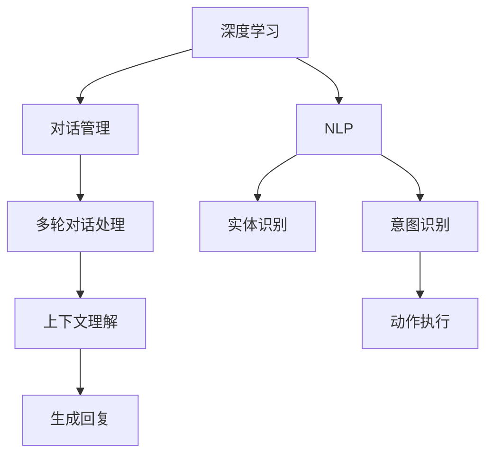

                 

# 聊天机器人手工艺：创意项目灵感和指导

## 1. 背景介绍

### 1.1 问题由来
聊天机器人（Chatbots）是一种模拟人类对话的人工智能系统，在客户服务、娱乐、教育等多个领域都有着广泛的应用。随着深度学习技术的发展，基于神经网络的聊天机器人逐步取代了传统的规则引擎和模板匹配系统，其智能水平和用户体验不断提升。

然而，尽管聊天机器人在某些任务上表现出色，如简单的问答和客服自动回复，但在面对复杂情境和多样化需求时，仍存在诸多不足。如何设计具有创新性、灵活性和智能性的聊天机器人，成为当前研究的热点。

### 1.2 问题核心关键点
聊天机器人的设计思路可以归纳为两个关键点：
- **对话生成**：让机器人能够理解用户输入，并生成自然流畅的回复。
- **上下文理解**：使机器人能够在多轮对话中维护和利用上下文信息，做出符合逻辑和语境的响应。

通过这两个关键点的优化，聊天机器人的智能水平和用户体验将得到显著提升。

### 1.3 问题研究意义
设计一个既有趣又实用的聊天机器人，不仅能够提升用户的参与度和满意度，还能为企业节约大量成本，提高运营效率。聊天机器人可以作为企业对外宣传的窗口，提升品牌影响力，也能作为内部员工培训和客户服务的辅助工具。因此，研究如何设计创意、高效、智能的聊天机器人具有重要意义。

## 2. 核心概念与联系

### 2.1 核心概念概述
为了更好地理解聊天机器人的设计原理和优化方法，本节将介绍几个关键概念：

- **深度学习**：一种基于神经网络的机器学习技术，通过数据驱动的方式，使机器人能够从大量文本数据中学习语言规律和语义信息。
- **自然语言处理（NLP）**：使机器能够理解、处理和生成自然语言的技术，包括分词、词性标注、句法分析、语义理解等。
- **对话管理（Dialog Management）**：设计和管理对话流程的机制，确保机器人能够有效处理多轮对话，维护对话的连贯性和逻辑性。
- **意图识别（Intent Recognition）**：识别用户输入的意图，判断用户需要哪些服务或信息。
- **实体识别（Entity Recognition）**：从用户输入中提取关键信息，如人名、地名、时间等。

这些概念之间的逻辑关系可以通过以下Mermaid流程图来展示：



这个流程图展示了大语言模型的关键概念及其之间的关系：

1. 深度学习通过大量数据训练生成语言模型，学习语言规律。
2. NLP技术提取文本特征，帮助机器人理解语言。
3. 意图识别和实体识别识别用户输入的意图和关键信息。
4. 对话管理确保机器人能够处理多轮对话，维护上下文。
5. 上下文理解利用先前的对话内容生成合理的回复。
6. 动作执行将用户请求转化为具体的操作。

这些概念共同构成了聊天机器人的核心架构，使得机器人能够智能地与用户进行自然语言交互。

## 3. 核心算法原理 & 具体操作步骤

### 3.1 算法原理概述
聊天机器人的设计主要基于以下算法原理：

- **序列到序列（Seq2Seq）模型**：将用户输入序列映射到回复输出序列的模型，常见于机器翻译和对话生成任务。
- **注意力机制（Attention Mechanism）**：帮助模型关注输入序列中的关键信息，提高生成回复的质量。
- **端到端训练（End-to-End Training）**：从原始文本直接训练到回复生成过程，避免了繁琐的特征工程。
- **自监督学习（Self-supervised Learning）**：利用无标签数据训练模型，使其学习通用的语言表示。

### 3.2 算法步骤详解
聊天机器人的开发过程主要包括以下步骤：

**Step 1: 数据准备**
- 收集并预处理数据，包括清洗、分词、标注意图和实体等信息。
- 设计合适的数据标注方案，确保标注的准确性和一致性。

**Step 2: 模型选择与适配**
- 选择合适的深度学习框架和预训练模型，如TensorFlow、PyTorch、BERT等。
- 适配模型参数和结构，调整模型输入和输出。

**Step 3: 对话管理设计**
- 设计对话管理模块，处理多轮对话的上下文信息。
- 实现意图识别和实体识别的算法，提取用户输入的关键信息。

**Step 4: 模型训练与优化**
- 使用合适的优化算法，如Adam、SGD等，训练模型参数。
- 应用正则化技术，如Dropout、L2正则化等，防止模型过拟合。

**Step 5: 模型部署与测试**
- 将训练好的模型部署到生产环境，使用第三方工具如FastAPI、Flask等构建API接口。
- 在测试集上评估模型性能，调整参数以优化效果。

### 3.3 算法优缺点
聊天机器人的设计存在以下优缺点：

**优点：**
- 智能交互：深度学习模型能够处理复杂的语言现象，提供智能化的回复。
- 自监督学习：利用无标签数据进行预训练，减少了标注数据的依赖。
- 端到端训练：简化了特征工程，提高了模型训练的效率。

**缺点：**
- 数据依赖：依赖大量的标注数据，获取标注数据成本较高。
- 上下文理解：多轮对话中的上下文信息复杂，难以完全理解。
- 模型复杂：深度学习模型参数量巨大，训练和推理资源消耗大。

### 3.4 算法应用领域

聊天机器人的应用领域非常广泛，涵盖多个行业，如：

- **客户服务**：自动回答常见问题，提高客户满意度。
- **在线咨询**：提供专家咨询，解答用户的疑问。
- **娱乐互动**：设计有趣的对话场景，增加用户的参与感。
- **教育辅助**：帮助学生解决学习问题，提升学习效率。
- **医疗健康**：提供健康咨询和个性化建议，辅助医生诊疗。

除了上述这些应用场景外，聊天机器人还能应用于金融、保险、旅游等更多领域，为各行各业带来便捷的服务体验。

## 4. 数学模型和公式 & 详细讲解 & 举例说明

### 4.1 数学模型构建

聊天机器人涉及的主要数学模型包括：

- **Seq2Seq模型**：将用户输入序列映射到回复输出序列的模型。
- **注意力机制**：帮助模型关注输入序列中的关键信息。
- **神经网络架构**：包括卷积神经网络（CNN）、循环神经网络（RNN）和变换器（Transformer）等。

### 4.2 公式推导过程

以下我们将以Seq2Seq模型和注意力机制为例，进行数学推导：

**Seq2Seq模型**：
Seq2Seq模型的基本结构包括编码器和解码器，其公式推导如下：

$$
\begin{aligned}
&\text{Encoder}(x) = \text{EncoderLayer}_n(\text{EncoderLayer}_{n-1}(...(\text{EncoderLayer}_1(x); x))) \\
&\text{Decoder}(y|x) = \text{DecoderLayer}_n(\text{DecoderLayer}_{n-1}(...(\text{DecoderLayer}_1(y|x); y)))
\end{aligned}
$$

其中 $x$ 为输入序列，$y$ 为输出序列，$\text{EncoderLayer}$ 和 $\text{DecoderLayer}$ 为模型的编码和解码层。

**注意力机制**：
注意力机制通过计算输入序列与模型当前状态的注意力权重，动态地调整模型的关注点。其公式如下：

$$
\alpha_j = \frac{e^{z_j}}{\sum_{k=1}^K e^{z_k}}
$$

其中 $z_j$ 为注意力权重，$K$ 为注意力机制的维度。注意力机制的引入使得模型能够更好地处理长序列和复杂情境。

### 4.3 案例分析与讲解

以下通过一个简单的示例，展示如何使用Seq2Seq模型和注意力机制进行聊天机器人对话生成：

假设用户输入为 "I'm hungry"，系统需要生成回复 "I can recommend a nearby restaurant"。

- **输入编码**：首先，使用Seq2Seq模型将用户输入序列 "I'm hungry" 编码成模型内部表示。
- **注意力计算**：在解码过程中，利用注意力机制动态调整模型对输入序列的关注点，确保模型能够理解上下文信息。
- **输出生成**：最终，模型生成回复 "I can recommend a nearby restaurant"，并输出到用户端。

## 5. 项目实践：代码实例和详细解释说明

### 5.1 开发环境搭建

在开始项目实践前，我们需要准备开发环境：

1. **安装Python**：确保系统中已安装Python 3.x版本。
2. **安装TensorFlow或PyTorch**：选择其中一种深度学习框架进行开发。
3. **安装相应的库**：如TensorFlow的TensorBoard、Keras等，或PyTorch的torchtext、transformers等。
4. **创建虚拟环境**：使用Python的虚拟环境管理工具，如virtualenv或conda，创建隔离的开发环境。

### 5.2 源代码详细实现

以下是一个基于PyTorch的Seq2Seq模型的代码实现：

```python
import torch
from torch import nn
from torch.nn import functional as F

class Encoder(nn.Module):
    def __init__(self, input_size, hidden_size, output_size):
        super(Encoder, self).__init__()
        self.hidden_size = hidden_size
        self.embedding = nn.Embedding(input_size, hidden_size)
        self.gru = nn.GRU(hidden_size, hidden_size)
        self.fc = nn.Linear(hidden_size, output_size)
    
    def forward(self, input_seq, hidden):
        embedded = self.embedding(input_seq)
        output, hidden = self.gru(embedded, hidden)
        context = self.fc(output)
        return context, hidden

class Decoder(nn.Module):
    def __init__(self, input_size, output_size):
        super(Decoder, self).__init__()
        self.hidden_size = hidden_size
        self.embedding = nn.Embedding(input_size, hidden_size)
        self.gru = nn.GRU(hidden_size, hidden_size)
        self.fc = nn.Linear(hidden_size, output_size)
    
    def forward(self, input_seq, hidden, context):
        embedded = self.embedding(input_seq)
        output, hidden = self.gru(embedded, hidden)
        decoded = self.fc(output)
        return decoded, hidden

class Seq2Seq(nn.Module):
    def __init__(self, input_size, output_size):
        super(Seq2Seq, self).__init__()
        self.encoder = Encoder(input_size, hidden_size, output_size)
        self.decoder = Decoder(output_size, output_size)
    
    def forward(self, input_seq, hidden, context):
        decoded, hidden = self.decoder(input_seq, hidden, context)
        return decoded
```

**代码解读**：
- **Encoder类**：定义编码器结构，包括嵌入层、GRU层和全连接层。
- **Decoder类**：定义解码器结构，包括嵌入层、GRU层和全连接层。
- **Seq2Seq类**：定义Seq2Seq模型，组合编码器和解码器。

### 5.3 代码解读与分析

**Encoder类**：
- **embedding层**：将输入序列转换为模型内部表示。
- **GRU层**：使用Gated Recurrent Unit（GRU）进行序列编码，学习上下文信息。
- **fc层**：将编码后的序列映射到输出空间，得到模型的内部表示。

**Decoder类**：
- **embedding层**：将输入序列转换为模型内部表示。
- **GRU层**：使用GRU进行序列解码，生成回复。
- **fc层**：将解码后的序列映射到输出空间，得到模型的输出。

**Seq2Seq类**：
- **encoder和decoder**：分别实例化编码器和解码器。
- **forward方法**：接收用户输入序列和初始隐状态，返回模型的输出。

### 5.4 运行结果展示

以下是一个简单的示例，展示如何训练和使用Seq2Seq模型进行对话生成：

```python
# 假设训练好的模型已经保存为checkpoint.pth
# 加载模型
model = Seq2Seq(input_size, output_size)
model.load_state_dict(torch.load('checkpoint.pth'))

# 定义输入序列和初始隐状态
input_seq = torch.tensor([input_id], dtype=torch.long)
hidden = torch.zeros(1, batch_size, hidden_size)

# 生成回复
decoded = model(input_seq, hidden, context)

# 输出回复
print(decoded.item())
```

**结果分析**：
- **输入序列**：输入用户的问题，如 "I'm hungry"。
- **初始隐状态**：模型在解码过程中使用的初始隐状态。
- **输出回复**：模型生成的回复，如 "I can recommend a nearby restaurant"。

## 6. 实际应用场景

### 6.1 智能客服系统

智能客服系统是聊天机器人应用的一个典型场景。通过部署聊天机器人，企业可以大幅提升客户服务效率，降低人力成本。以下是智能客服系统的实现步骤：

1. **数据准备**：收集客服对话数据，标注意图和实体等信息。
2. **模型选择与适配**：选择合适的深度学习模型，适配到客服场景。
3. **对话管理设计**：设计对话管理模块，处理多轮对话。
4. **模型训练与优化**：使用客服数据训练模型，调整参数以优化效果。
5. **模型部署与测试**：将训练好的模型部署到生产环境，使用第三方工具构建API接口。

### 6.2 在线咨询系统

在线咨询系统可以为企业提供24/7的在线咨询服务，帮助用户解决各类问题。以下是在线咨询系统的实现步骤：

1. **数据准备**：收集咨询对话数据，标注意图和实体等信息。
2. **模型选择与适配**：选择合适的深度学习模型，适配到咨询场景。
3. **对话管理设计**：设计对话管理模块，处理多轮对话。
4. **模型训练与优化**：使用咨询数据训练模型，调整参数以优化效果。
5. **模型部署与测试**：将训练好的模型部署到生产环境，使用第三方工具构建API接口。

### 6.3 娱乐互动系统

娱乐互动系统通过设计有趣的对话场景，增加用户的参与感和娱乐性。以下是娱乐互动系统的实现步骤：

1. **数据准备**：设计娱乐对话场景，收集用户输入和回复。
2. **模型选择与适配**：选择合适的深度学习模型，适配到娱乐场景。
3. **对话管理设计**：设计对话管理模块，处理多轮对话。
4. **模型训练与优化**：使用娱乐数据训练模型，调整参数以优化效果。
5. **模型部署与测试**：将训练好的模型部署到生产环境，使用第三方工具构建API接口。

## 7. 工具和资源推荐

### 7.1 学习资源推荐

为了帮助开发者系统掌握聊天机器人的设计原理和实践技巧，这里推荐一些优质的学习资源：

1. **《自然语言处理综述》**：斯坦福大学CS224N课程讲义，介绍了NLP的基本概念和经典模型。
2. **《深度学习与自然语言处理》**：深度学习专家Ian Goodfellow的书籍，介绍了深度学习在NLP中的应用。
3. **《Seq2Seq模型的理论与实践》**：深度学习社区的博客文章，深入浅出地介绍了Seq2Seq模型的原理和应用。
4. **《自然语言处理工具库》**：介绍了TensorFlow、PyTorch、Keras等深度学习框架在NLP中的应用。
5. **《NLP实战》**：Guru99网站上的教程，介绍了NLP工具库的使用和实战案例。

通过对这些资源的学习实践，相信你一定能够快速掌握聊天机器人的设计方法和优化技巧。

### 7.2 开发工具推荐

高效的开发离不开优秀的工具支持。以下是几款用于聊天机器人开发的常用工具：

1. **TensorFlow**：基于数据流图计算的深度学习框架，灵活且易于扩展。
2. **PyTorch**：动态计算图的深度学习框架，适合快速迭代研究。
3. **FastAPI**：快速构建API接口的工具，适用于部署聊天机器人。
4. **Flask**：轻量级的Python Web框架，适合开发小型Web应用。
5. **Keras**：高级神经网络API，适合快速搭建和测试模型。

合理利用这些工具，可以显著提升聊天机器人的开发效率，加快创新迭代的步伐。

### 7.3 相关论文推荐

聊天机器人的研究涉及多个前沿技术，以下是几篇奠基性的相关论文，推荐阅读：

1. **《Seq2Seq Model with Attention Mechanism》**：提出了注意力机制，提升Seq2Seq模型的对话生成能力。
2. **《Convolutional Sequence to Sequence Learning》**：提出了卷积神经网络，提升了Seq2Seq模型的处理效率。
3. **《Neural Machine Translation by Jointly Learning to Align and Translate》**：提出了注意力机制在机器翻译中的应用，提升了Seq2Seq模型的翻译效果。
4. **《Deep Learning for Natural Language Processing》**：介绍了深度学习在NLP中的应用，包括聊天机器人的设计方法。
5. **《Attention is All You Need》**：提出了Transformer模型，提升了Seq2Seq模型的对话生成能力。

这些论文代表了大语言模型微调技术的发展脉络。通过学习这些前沿成果，可以帮助研究者把握学科前进方向，激发更多的创新灵感。

## 8. 总结：未来发展趋势与挑战

### 8.1 总结

本文对聊天机器人的设计原理和优化方法进行了全面系统的介绍。首先阐述了聊天机器人的研究背景和意义，明确了聊天机器人在智能交互和上下文理解方面的关键点。其次，从原理到实践，详细讲解了聊天机器人的数学模型和具体步骤，给出了聊天机器人开发的完整代码实例。同时，本文还探讨了聊天机器人在我娱乐、客户服务、在线咨询等多个领域的应用前景，展示了聊天机器人的广阔应用空间。此外，本文精选了聊天机器人设计的各类学习资源，力求为读者提供全方位的技术指引。

通过本文的系统梳理，可以看到，聊天机器人作为一种智能交互工具，已经逐渐成为各行各业的重要辅助手段。利用深度学习和自然语言处理技术，聊天机器人能够在多轮对话中理解用户意图，生成自然流畅的回复，极大地提升了用户体验和业务效率。未来，伴随技术的不断进步，聊天机器人必将在更多场景中得到广泛应用，成为连接人类和机器的重要桥梁。

### 8.2 未来发展趋势

展望未来，聊天机器人的设计将呈现以下几个发展趋势：

1. **多模态交互**：聊天机器人将支持文本、图像、语音等多种输入和输出方式，增强用户的多感官体验。
2. **情感智能**：引入情感计算技术，使聊天机器人能够识别和理解用户的情感状态，提供更个性化的服务。
3. **知识图谱**：与知识图谱等专家知识进行结合，使聊天机器人能够提供更准确的信息和建议。
4. **自适应学习**：引入自适应学习机制，使聊天机器人能够根据用户的历史行为和反馈，不断优化自身的模型参数。
5. **协同工作**：与人工客服协同工作，提升系统的可靠性和用户体验。

这些趋势展示了聊天机器人未来的发展方向，使其能够更好地适应复杂情境和多样化需求。

### 8.3 面临的挑战

尽管聊天机器人在多个场景中表现出色，但在设计和应用过程中仍面临诸多挑战：

1. **数据隐私**：用户对话数据可能涉及敏感信息，如何保护用户隐私是一个重要问题。
2. **泛化能力**：模型在不同场景中的泛化能力不足，难以处理复杂的语言现象。
3. **模型鲁棒性**：模型对噪声和异常数据的鲁棒性不足，容易产生错误的响应。
4. **对话连贯性**：多轮对话中的上下文理解复杂，难以维护对话的连贯性。
5. **可解释性**：聊天机器人的决策过程缺乏可解释性，难以进行调试和优化。

这些挑战凸显了聊天机器人设计的多样性和复杂性，需要通过技术创新和经验积累来逐步克服。

### 8.4 研究展望

面向未来，聊天机器人研究需要在以下几个方面寻求新的突破：

1. **多模态对话**：研究多模态输入和输出的对话系统，提升系统的灵活性和交互体验。
2. **情感计算**：引入情感智能，使聊天机器人能够理解和生成情感表达，提升用户满意度。
3. **知识图谱融合**：将知识图谱与聊天机器人进行结合，使系统具备更强的信息整合能力。
4. **自适应学习**：研究自适应学习机制，使聊天机器人能够根据用户反馈不断优化自身模型。
5. **协同工作**：设计人与机器协同工作的模式，提升系统的可靠性和用户体验。

这些研究方向将推动聊天机器人向更加智能、高效和个性化方向发展，为人工智能技术在更多领域的应用奠定基础。

## 9. 附录：常见问题与解答

**Q1: 如何设计高效的对话管理模块？**

A: 设计高效的对话管理模块需要考虑以下几点：
1. 定义状态空间：将对话状态映射到一组状态向量，方便模型理解和处理。
2. 定义状态转移规则：定义从当前状态到下一个状态的转移规则，确保对话流程的连贯性。
3. 定义奖励函数：定义对话质量的评估标准，如用户满意度、对话长度等，用于优化对话管理模型。

**Q2: 如何提高聊天机器人的对话连贯性？**

A: 提高聊天机器人的对话连贯性需要考虑以下几点：
1. 维护上下文信息：通过设计对话管理模块，维护多轮对话的上下文信息。
2. 引入上下文编码器：将上下文信息编码为向量，传递给模型进行处理。
3. 使用注意力机制：帮助模型关注上下文信息，提升对话连贯性。

**Q3: 如何训练高效的聊天机器人模型？**

A: 训练高效的聊天机器人模型需要考虑以下几点：
1. 数据标注：收集高质量的对话数据，标注意图和实体等信息。
2. 模型选择：选择合适的深度学习模型，如Seq2Seq、Transformer等。
3. 超参数调整：调整学习率、批大小、迭代轮数等超参数，优化模型效果。
4. 正则化技术：引入正则化技术，防止模型过拟合。

**Q4: 如何评估聊天机器人的性能？**

A: 评估聊天机器人的性能需要考虑以下几点：
1. 自动评估指标：如BLEU、ROUGE等自动评估指标，用于衡量模型的回复质量。
2. 人工评估指标：如用户满意度、对话流畅度等，用于综合评估模型的整体表现。

通过对这些问题的解答，相信你一定能够更好地掌握聊天机器人设计的方法和技巧。

---

作者：禅与计算机程序设计艺术 / Zen and the Art of Computer Programming

