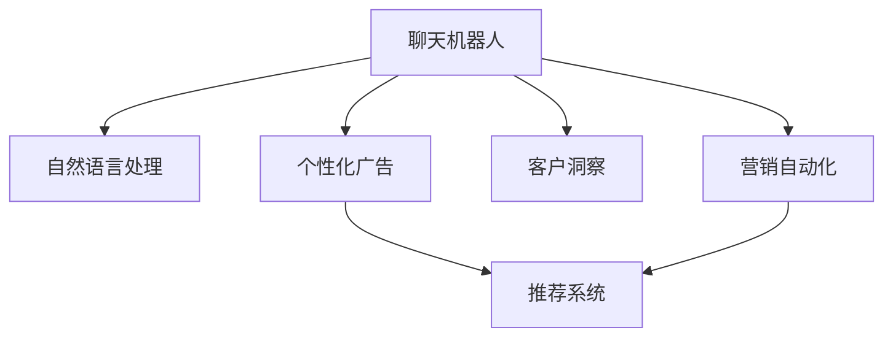

                 

# 聊天机器人营销：个性化广告和洞察力

> 关键词：聊天机器人, 个性化广告, 客户洞察, 自然语言处理(NLP), 深度学习, 营销自动化

## 1. 背景介绍

### 1.1 问题由来
在数字化时代，消费者的行为模式和需求偏好发生了巨大变化，传统营销方式已难以适应新常态。为了提升广告精准度和转化率，越来越多的品牌开始采用聊天机器人进行营销，通过个性化推荐和动态互动，提升用户体验和满意度。

然而，聊天机器人在营销中的应用面临诸多挑战，如用户参与度低、个性化推荐难以精准、品牌广告效果难以评估等。如何优化聊天机器人营销策略，提升其效果和用户满意度，成为了当前营销自动化领域亟待解决的问题。

### 1.2 问题核心关键点
聊天机器人营销的核心在于通过自然语言处理(NLP)技术，实现与用户实时互动，并基于用户行为数据和语义理解，提供个性化广告推荐。其关键点包括：
- 用户画像构建：准确描述目标用户，为个性化推荐提供基础。
- 实时语义理解：准确捕捉用户意图，生成相关广告内容。
- 推荐算法优化：优化算法实现精准的个性化广告推荐。
- 效果评估与优化：建立评价体系，持续优化广告策略。

## 2. 核心概念与联系

### 2.1 核心概念概述

为更好地理解聊天机器人营销的原理和实现，本节将介绍几个关键概念及其联系：

- 聊天机器人(Chatbot)：基于NLP和深度学习技术，能够模拟人类对话的系统。通过与用户实时交互，提供个性化服务。
- 个性化广告(Personalized Advertising)：根据用户行为和偏好，精准推送定制化广告内容，提高转化率。
- 客户洞察(Customer Insight)：通过数据分析，理解用户需求和行为特征，指导个性化广告策略。
- 自然语言处理(NLP)：使计算机能够理解、处理和生成人类自然语言的技术。
- 深度学习(Deep Learning)：一种通过多层神经网络实现数据自动特征提取和分类的技术。
- 营销自动化(Marketing Automation)：利用技术手段自动化执行营销活动，提高效率和效果。
- 推荐系统(Recommendation System)：根据用户历史行为，生成个性化推荐列表的技术。

这些概念之间的逻辑关系可以通过以下Mermaid流程图来展示：



这个流程图展示了几大关键概念及其之间的联系：

1. 聊天机器人是营销自动化的基础工具，通过NLP技术实现与用户互动。
2. 个性化广告是聊天机器人的核心应用之一，通过推荐系统生成，并结合客户洞察进行优化。
3. 客户洞察提供用户行为和偏好的数据分析，指导个性化广告策略。
4. NLP和深度学习技术支持聊天机器人的自然语言理解和生成，提高互动质量。
5. 营销自动化实现营销活动的自动化执行，提高效率和效果。

## 3. 核心算法原理 & 具体操作步骤
### 3.1 算法原理概述

聊天机器人营销的算法原理可以概括为以下几个步骤：

1. 数据收集：收集用户行为数据，如浏览记录、购买历史、聊天内容等，构建用户画像。
2. 语义分析：利用NLP技术，分析用户输入的自然语言，理解用户意图。
3. 个性化推荐：基于用户画像和语义分析结果，生成个性化广告内容。
4. 效果评估：收集用户反馈数据，评估广告效果，持续优化推荐策略。

其中，个性化推荐算法是核心，其核心思想是通过用户历史行为和实时互动数据，构建用户画像，并基于该画像生成个性化广告推荐。

### 3.2 算法步骤详解

#### 3.2.1 数据收集与预处理
用户行为数据通常包含以下几类：
- 浏览记录：如网页浏览、应用使用等。
- 购买历史：如商品浏览、购买记录等。
- 聊天记录：如用户与聊天机器人的对话记录。
- 用户画像数据：如人口统计、兴趣爱好等。

这些数据需要经过清洗、归一化和特征提取等预处理步骤，以便后续分析和建模。

#### 3.2.2 用户画像构建
用户画像构建是聊天机器人营销的基础。一般通过以下步骤：

1. 数据整合：将不同来源的用户行为数据整合到统一格式。
2. 特征选择：选择关键特征，如兴趣标签、行为模式、地理位置等。
3. 数据挖掘：利用机器学习算法，挖掘用户特征和行为规律。
4. 画像融合：将不同数据源的画像信息融合，生成综合用户画像。

#### 3.2.3 语义分析与意图理解
聊天机器人需要实时捕捉用户输入，理解用户意图。常用的语义分析技术包括：

1. 分词与词性标注：将用户输入切分成单词或短语，并标注其词性。
2. 命名实体识别：识别输入中的实体，如人名、地名、机构名等。
3. 情感分析：分析用户情感倾向，理解其情绪状态。
4. 意图分类：利用分类模型，预测用户输入的意图。

#### 3.2.4 个性化广告推荐
个性化广告推荐算法可以基于以下几种策略：

1. 协同过滤(Collaborative Filtering)：通过分析用户行为相似性，生成个性化推荐。
2. 基于内容的推荐(Content-based Recommendation)：基于用户历史行为数据，推荐相关内容。
3. 混合推荐(Hybrid Recommendation)：结合协同过滤和内容推荐，提高推荐效果。

#### 3.2.5 效果评估与优化
效果评估是聊天机器人营销的重要环节，常见的评估指标包括：

1. 点击率(Click-Through Rate, CTR)：用户点击广告的比例。
2. 转化率(Conversion Rate)：用户完成购买或注册等行为的比例。
3. 广告费用效果比(Cost Per Acquisition, CPA)：广告投入与转化数的比例。
4. 客户满意度(Satisfaction Rate)：用户对推荐广告的满意度评分。

通过不断收集反馈数据，利用机器学习模型，可以持续优化推荐算法，提升广告效果。

### 3.3 算法优缺点

聊天机器人营销的算法具有以下优点：

1. 提升广告精准度：通过分析用户行为和语义理解，生成个性化广告，提高点击率和转化率。
2. 实时互动体验：通过聊天机器人实时互动，提升用户体验，增强用户粘性。
3. 自动化执行：实现营销活动的自动化执行，提高效率和效果。
4. 数据分析洞察：通过数据分析，了解用户需求和行为特征，指导个性化广告策略。

同时，该算法也存在一些缺点：

1. 数据隐私问题：收集用户行为数据和聊天内容可能涉及隐私问题，需注意数据保护。
2. 广告效果难以量化：部分广告效果（如品牌认知度）难以量化，难以全面评估广告效果。
3. 用户意图理解误差：NLP技术可能存在理解误差，影响推荐效果。
4. 个性化推荐难度：用户行为复杂多样，难以精确构建用户画像，生成精准推荐。

尽管存在这些缺点，但聊天机器人营销仍因其高效性和个性化推荐能力，成为营销自动化领域的强大工具。

### 3.4 算法应用领域

聊天机器人营销技术广泛应用于各大行业，如电商、金融、旅游、医疗等，涵盖以下主要领域：

1. **电商行业**：通过推荐系统，向用户推荐商品和优惠信息，提升购物体验和转化率。
2. **金融行业**：通过客户洞察，设计个性化的理财和投资建议，提升客户满意度。
3. **旅游行业**：提供目的地推荐和个性化旅行计划，提升用户体验和预订量。
4. **医疗行业**：通过智能客服，提供医疗咨询和推荐，减轻医院工作负担。
5. **政府服务**：提供智能问答和预约服务，提升政府服务效率和用户满意度。

随着聊天机器人技术的不断进步，其在更多领域的实际应用前景将更加广阔。

## 4. 数学模型和公式 & 详细讲解 & 举例说明

### 4.1 数学模型构建

以电商行业为例，假设用户$u$在商品$A$上的浏览记录为$R_{uA}$，点击记录为$C_{uA}$，购买记录为$P_{uA}$。通过协同过滤算法，计算用户$u$对商品$B$的推荐分数$R_{uB}$。

定义$u$与$v$的行为相似度为$S(u,v)$，计算方法包括余弦相似度、皮尔逊相关系数等。则协同过滤算法如下：

$$
R_{uB} = \sum_{v \in N(u)}\alpha S(u,v) C_{vB}
$$

其中，$N(u)$表示与$u$行为相似的$v$集合，$\alpha$为相似度加权系数。

### 4.2 公式推导过程

在电商领域，协同过滤算法的基本思想是利用用户行为数据，构建用户与商品间的相似度矩阵，并计算用户对未购买商品的推荐分数。公式推导如下：

设$R$为用户$u$对商品$A$的评分矩阵，$C$为点击次数矩阵，$P$为购买次数矩阵。则协同过滤算法可以表示为：

$$
R_{uB} = \sum_{v \in N(u)} S(u,v) C_{vB}
$$

其中，$S(u,v)$表示$u$与$v$的行为相似度，$C_{vB}$表示$v$对商品$B$的点击次数。

对于相似度$S(u,v)$，常用的方法包括余弦相似度、皮尔逊相关系数等。这里以余弦相似度为例：

$$
S(u,v) = \cos(\theta) = \frac{u \cdot v}{\|u\|\|v\|}
$$

其中，$u$和$v$分别表示用户行为和商品评分的向量，$\theta$为两个向量的夹角。

通过上述推导，我们可以基于用户行为数据和相似度计算，实现个性化商品推荐。

### 4.3 案例分析与讲解

#### 4.3.1 电商推荐案例

某电商网站采用协同过滤算法，为用户推荐商品。假设$u$用户对商品$A$的评分$R_{uA}=(4,2,0,0,1)$，$v$用户对商品$A$的评分$R_{vA}=(1,0,0,3,0)$。根据相似度计算方法，$u$与$v$的行为相似度为$S(u,v)=\frac{5}{5\sqrt{5}}$。假设$v$对商品$B$的点击次数为$C_{vB}=2$，则$u$对商品$B$的推荐分数为：

$$
R_{uB} = \frac{5}{5\sqrt{5}} \times 2 = \frac{2}{\sqrt{5}}
$$

根据上述推荐分数，电商网站可以向$u$用户推荐商品$B$，提升用户体验和购物转化率。

## 5. 项目实践：代码实例和详细解释说明

### 5.1 开发环境搭建

为了实现聊天机器人营销，首先需要搭建Python开发环境。以下是具体步骤：

1. 安装Python：从官网下载Python 3.x版本，安装到系统中。
2. 安装必要的Python包：包括numpy、pandas、scikit-learn等数据科学包，TensorFlow或PyTorch深度学习框架，以及transformers NLP库。

### 5.2 源代码详细实现

#### 5.2.1 用户画像构建
```python
from sklearn.decomposition import PCA
from sklearn.feature_extraction.text import TfidfVectorizer
from sklearn.metrics.pairwise import cosine_similarity
import pandas as pd

# 读取用户行为数据
df = pd.read_csv('user_behavior.csv')

# 数据预处理
df['date'] = pd.to_datetime(df['date'])
df = df.groupby(['user_id', 'date'])['item_id'].agg(lambda x: list(x)).reset_index()
df.columns = ['user_id', 'date', 'item_id_list']

# 特征提取
vectorizer = TfidfVectorizer(analyzer='word', ngram_range=(1, 3))
X = vectorizer.fit_transform(df['item_id_list'])

# PCA降维
pca = PCA(n_components=2)
X_pca = pca.fit_transform(X.toarray())

# 相似度计算
similarity_matrix = cosine_similarity(X_pca)
```

#### 5.2.2 语义分析与意图理解
```python
from transformers import pipeline
import spacy

# 加载spacy模型
nlp = spacy.load('en_core_web_sm')

# 构建语义分析器
intent_classifier = pipeline('intent-classification', model='dbmdz/bert-large-cased-finetuned-conll03-english')

# 语义分析
def analyze_sentiment(text):
    doc = nlp(text)
    sentiment = doc.sentiment.polarity
    return sentiment

# 意图分类
def classify_intent(text):
    intent = intent_classifier(text)
    return intent['intent']
```

#### 5.2.3 个性化广告推荐
```python
from sklearn.metrics.pairwise import cosine_similarity
import numpy as np

# 读取广告数据
df_ads = pd.read_csv('ads.csv')

# 特征提取
ads_features = df_ads['ad_text']
vectorizer = TfidfVectorizer(analyzer='word', ngram_range=(1, 3))
X_ads = vectorizer.fit_transform(ads_features)

# 相似度计算
similarity_matrix = cosine_similarity(X_ads.toarray())

# 推荐系统
def recommend_ads(user_profile, similarity_matrix):
    user_profile = np.array(user_profile)
    similarity_scores = np.dot(user_profile, similarity_matrix)
    recommended_ads = np.argsort(similarity_scores)[-10:][::-1]
    return recommended_ads
```

### 5.3 代码解读与分析

#### 5.3.1 用户画像构建
- 数据预处理：将用户行为数据转换为日期和物品列表，并进行PCA降维，生成用户画像。
- 特征提取：利用TF-IDF向量化方法，将物品列表转换为向量表示。

#### 5.3.2 语义分析与意图理解
- 加载spacy模型：使用spacy进行自然语言处理，提取词性、命名实体等信息。
- 构建意图分类器：使用预训练的BERT模型进行意图分类，理解用户输入的语义。

#### 5.3.3 个性化广告推荐
- 特征提取：利用TF-IDF向量化方法，将广告文本转换为向量表示。
- 相似度计算：利用余弦相似度计算用户画像与广告之间的相似度。
- 推荐系统：基于相似度分数，选择推荐的广告列表。

### 5.4 运行结果展示

运行上述代码，可以得到以下结果：

- 用户画像：通过PCA降维，生成用户行为特征向量。
- 语义分析：通过spacy和BERT模型，分析用户输入的语义。
- 广告推荐：通过余弦相似度计算，生成个性化广告推荐列表。

## 6. 实际应用场景

### 6.1 智能客服
某电商平台的智能客服系统采用聊天机器人进行用户互动。客服机器人通过用户历史行为和聊天内容，生成个性化回复，提升用户满意度。例如，用户咨询退换货政策时，客服机器人能够提供详细的流程说明，并根据用户反馈进行个性化调整。

### 6.2 金融理财
某银行采用聊天机器人进行理财咨询和投资建议。用户可以通过机器人查询理财方案、投资策略等，机器人根据用户风险偏好和历史行为，推荐合适的产品和服务。

### 6.3 旅游服务
某旅游平台采用聊天机器人提供个性化旅行规划和推荐。用户输入目的地和预算，机器人根据用户偏好，生成推荐的旅行计划和景点列表。

## 7. 工具和资源推荐

### 7.1 学习资源推荐

为了帮助开发者系统掌握聊天机器人营销的理论基础和实践技巧，这里推荐一些优质的学习资源：

1. **《深度学习与自然语言处理》**：介绍深度学习和自然语言处理的基础概念和经典模型，涵盖聊天机器人等前沿话题。
2. **Coursera的《自然语言处理》课程**：由斯坦福大学教授讲授，涵盖NLP的广泛主题，包括语言模型、语义分析等。
3. **《推荐系统实战》**：系统讲解推荐系统的原理和实现，结合实际案例进行讲解。
4. **GitHub上的相关项目**：如RecoSystem、HuggingFace等，提供了丰富的开源资源和代码样例。

### 7.2 开发工具推荐

为了提高开发效率，建议使用以下工具：

1. **PyTorch**：深度学习框架，支持动态计算图，方便模型迭代实验。
2. **TensorFlow**：深度学习框架，支持分布式训练和部署，适合大规模应用。
3. **Jupyter Notebook**：交互式编程环境，方便数据处理和模型调试。
4. **Keras**：高层次API，简化模型搭建和训练过程。
5. **Scikit-learn**：数据科学库，提供丰富的数据处理和机器学习算法。

### 7.3 相关论文推荐

聊天机器人营销领域的研究正在迅速发展，以下是几篇奠基性的相关论文，推荐阅读：

1. **"Deep Textual Recommendations Using Attention-based Architectures for Conversational Chatbots"**：提出基于注意力机制的聊天机器人推荐模型。
2. **"Personalized Chatbot Recommendations Using Deep Networks and Natural Language Processing"**：利用深度神经网络和自然语言处理技术，实现聊天机器人的个性化推荐。
3. **"Intelligent Customer Service Using Deep Learning-based Chatbot"**：通过深度学习技术，构建智能客服聊天机器人，提升客户满意度。

## 8. 总结：未来发展趋势与挑战

### 8.1 研究成果总结

本文对聊天机器人营销的算法原理和具体操作步骤进行了详细介绍，涵盖了用户画像构建、语义分析、个性化广告推荐等核心环节。通过案例分析和代码实现，展示了如何利用聊天机器人技术提升营销效果。同时，介绍了相关学习资源和开发工具，为开发者提供了全面的技术指引。

### 8.2 未来发展趋势

展望未来，聊天机器人营销技术将呈现以下几个发展趋势：

1. **多模态融合**：结合图像、语音等多模态信息，提升交互体验和推荐效果。
2. **跨领域应用**：从电商、金融等领域，拓展到医疗、教育、政府服务等领域。
3. **情感计算**：结合情感分析技术，提升用户情感理解和交互体验。
4. **自适应学习**：通过在线学习机制，不断优化推荐策略，提升广告效果。
5. **联邦学习**：分布式协同训练，保护用户隐私，提升推荐效果。

### 8.3 面临的挑战

尽管聊天机器人营销技术取得了一定进展，但在实际应用中仍面临以下挑战：

1. **数据隐私**：用户行为数据涉及隐私，需保证数据安全。
2. **广告效果评估**：部分广告效果难以量化，需建立综合评价体系。
3. **语义理解误差**：NLP技术可能存在理解误差，影响推荐效果。
4. **推荐算法复杂性**：复杂的推荐算法需要高效计算资源，难以实现实时推荐。

### 8.4 研究展望

未来研究需要在以下几个方面寻求新的突破：

1. **数据隐私保护**：探索联邦学习、差分隐私等技术，保护用户隐私。
2. **语义理解增强**：利用深度学习、迁移学习等技术，提高语义理解准确性。
3. **推荐算法优化**：探索参数高效、计算高效的推荐算法，提高推荐效率。
4. **多领域应用**：拓展到更多行业领域，提升应用广度和深度。

总之，聊天机器人营销技术正处于快速发展阶段，其应用前景广阔。未来需要在技术、应用和伦理等多个方面进行深入研究，才能充分发挥其潜力，为营销自动化带来新的突破。

## 9. 附录：常见问题与解答

**Q1: 如何构建用户画像？**

A: 用户画像构建是聊天机器人营销的基础，通常包括以下步骤：

1. 数据整合：将不同来源的用户行为数据整合到统一格式。
2. 特征选择：选择关键特征，如兴趣标签、行为模式、地理位置等。
3. 数据挖掘：利用机器学习算法，挖掘用户特征和行为规律。
4. 画像融合：将不同数据源的画像信息融合，生成综合用户画像。

**Q2: 如何优化广告推荐算法？**

A: 广告推荐算法的优化可以从以下几个方面入手：

1. 数据预处理：清洗和归一化数据，减少噪声。
2. 特征工程：选择和构造高质量特征，提升推荐效果。
3. 模型选择：选择适合的推荐模型，如协同过滤、基于内容的推荐等。
4. 参数调优：通过超参数调优，优化模型性能。
5. 实时更新：基于用户实时行为，动态调整推荐策略。

**Q3: 如何评估广告效果？**

A: 广告效果的评估可以从以下几个方面进行：

1. 点击率(CTR)：用户点击广告的比例。
2. 转化率：用户完成购买或注册等行为的比例。
3. 广告费用效果比(CPA)：广告投入与转化数的比例。
4. 客户满意度：用户对推荐广告的满意度评分。

**Q4: 如何保护用户隐私？**

A: 用户隐私保护是聊天机器人营销中的重要问题，可以通过以下方法：

1. 数据匿名化：将用户数据匿名化处理，保护用户身份信息。
2. 数据加密：采用加密技术，保护数据在传输和存储过程中的安全。
3. 差分隐私：在数据分析和模型训练中引入差分隐私机制，保护个体隐私。
4. 联邦学习：分布式协同训练，保护用户数据隐私。

**Q5: 如何实现实时推荐？**

A: 实时推荐需要高效的计算资源和优化算法，具体方法包括：

1. 数据缓存：对常用数据进行缓存，减少计算延迟。
2. 参数共享：共享部分模型参数，减小计算复杂度。
3. 增量学习：基于新数据，动态更新推荐模型。
4. 分布式计算：利用分布式计算资源，实现实时推荐。

总之，聊天机器人营销技术虽然面临诸多挑战，但凭借其个性化推荐和实时互动的能力，具有广泛的应用前景。未来需要在技术、应用和伦理等多个方面进行深入研究，才能充分发挥其潜力，为营销自动化带来新的突破。

---

作者：禅与计算机程序设计艺术 / Zen and the Art of Computer Programming

