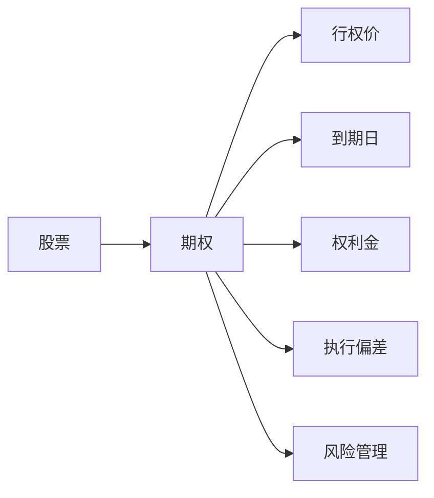

                 

# 股票期权：程序员的财富密码？

## 1. 背景介绍

在金融市场中，股票期权作为一种衍生金融工具，其独特的交易特性使得许多投资者趋之若鹜。然而，对于大多数程序员而言，期权交易似乎又是一个遥不可及的领域。程序员虽然善于编写代码，却往往对金融学中的各种概念感到陌生。那么，股票期权究竟是一种什么样的金融工具？它能否成为程序员的财富密码？本文将从金融学的角度出发，带你深入了解股票期权的世界，并探讨它对程序员的意义。

## 2. 核心概念与联系

### 2.1 核心概念概述

- **股票期权**：一种衍生金融工具，指买方在支付一定的权利金后，获得在特定时间内以特定价格买入或卖出某种股票的权利，但不负有必须履行的义务。
- **行权价**：期权合约中规定的买方行使权利时的股票价格。
- **到期日**：期权合约中规定的买方行使权利的最后期限。
- **权利金**：买方向卖方支付的费用，反映了期权时间价值、标的资产波动率和剩余时间的综合影响。
- **执行偏差**：行权价的确定是期权定价的核心问题，一个合理的行权价不仅能反映标的资产的真实价值，也能最大化期权的时间价值。
- **风险管理**：期权交易中风险与收益的不对称性，使得期权成为一种重要的风险管理工具。程序员可以通过期权对冲股票价格波动带来的风险。

### 2.2 核心概念原理和架构的 Mermaid 流程图



## 3. 核心算法原理 & 具体操作步骤

### 3.1 算法原理概述

股票期权的定价是一个复杂的过程，涉及到多个金融学的核心概念。期权定价的核心思想是将期权的价格视为期权到期时资产价格分布的一个期望值，通过无套利原则，建立起期权价格和标的资产价格、波动率、剩余时间之间的关系。

期权定价公式中最著名的是Black-Scholes期权定价模型，它基于几何布朗运动的随机过程，考虑了标的资产的价格波动率和剩余时间，通过求解期权价格的偏微分方程，得到期权定价的解析解。然而，由于实际市场中的期权价格受到众多因素的影响，模型的假设条件难以完全符合现实，因此期权定价问题一直以来都是金融工程领域的难点之一。

### 3.2 算法步骤详解

#### 3.2.1 构建期权定价模型

根据Black-Scholes模型，期权价格 $C$ 可以表示为：

$$
C = S_0N(d_1) - K e^{-rt}N(d_2)
$$

其中 $S_0$ 为标的资产的当前价格，$K$ 为行权价，$r$ 为无风险利率，$t$ 为剩余时间，$\sigma$ 为资产价格波动率，$N$ 为标准正态分布函数，$d_1$ 和 $d_2$ 为两个标准正态分布的分位数，具体计算公式如下：

$$
d_1 = \frac{ln\frac{S_0}{K} + (r + \frac{1}{2}\sigma^2)t}{\sigma\sqrt{t}}
$$

$$
d_2 = d_1 - \sigma\sqrt{t}
$$

#### 3.2.2 计算期权价格

给定标的资产价格 $S_0$、行权价 $K$、无风险利率 $r$、标的资产波动率 $\sigma$ 和剩余时间 $t$，代入上述公式，即可计算出期权价格 $C$。

#### 3.2.3 计算期权权利金

权利金 $P$ 为买方支付给卖方的费用，计算公式如下：

$$
P = C - S_0N(d_3)
$$

其中 $d_3 = d_1 - \sigma\sqrt{t}$。

#### 3.2.4 风险管理

期权交易中，买方和卖方的收益和风险呈现不对称性。通过期权交易，程序员可以有效地管理股票价格波动带来的风险，如采用期权对冲策略，保护现有头寸免受市场波动的影响。

### 3.3 算法优缺点

#### 3.3.1 优点

1. **灵活性**：期权交易具有灵活性，程序员可以根据自己的风险承受能力和投资需求，选择不同的期权类型（如看涨期权、看跌期权）和行权价（如深度实值、虚值期权）。
2. **风险对冲**：期权作为一种风险管理工具，程序员可以通过期权对冲策略，保护现有头寸免受市场波动的影响，从而降低投资风险。
3. **高杠杆性**：期权的高杠杆性使得程序员可以用较小的资金投入获得较大的收益，提高资金使用效率。

#### 3.3.2 缺点

1. **复杂性**：期权定价涉及众多变量和复杂数学模型，对程序员的数学基础要求较高。
2. **波动性**：期权价格的波动性较大，风险难以预测，一旦市场条件不利，期权损失可能较大。
3. **成本问题**：期权交易涉及权利金的支付，较高的权利金可能限制程序员的资金投入。

### 3.4 算法应用领域

股票期权作为一种金融工具，应用广泛，主要包括以下几个领域：

1. **投资组合管理**：程序员可以通过期权交易，实现风险管理和收益优化，构建更为稳健的投资组合。
2. **企业风险管理**：企业可以采用期权对冲策略，保护自身免受市场波动的影响，从而降低经营风险。
3. **对冲和套利**：程序员可以通过期权进行对冲和套利，获取无风险收益。
4. **创业和风险投资**：初创企业和风险投资者可以通过期权交易，保护自己的权益和估值。

## 4. 数学模型和公式 & 详细讲解

### 4.1 数学模型构建

期权定价模型的核心是建立期权价格和标的资产价格、波动率、剩余时间之间的关系。根据Black-Scholes模型，期权价格 $C$ 可以表示为：

$$
C = S_0N(d_1) - K e^{-rt}N(d_2)
$$

其中 $S_0$ 为标的资产的当前价格，$K$ 为行权价，$r$ 为无风险利率，$t$ 为剩余时间，$\sigma$ 为资产价格波动率，$N$ 为标准正态分布函数，$d_1$ 和 $d_2$ 为两个标准正态分布的分位数，具体计算公式如下：

$$
d_1 = \frac{ln\frac{S_0}{K} + (r + \frac{1}{2}\sigma^2)t}{\sigma\sqrt{t}}
$$

$$
d_2 = d_1 - \sigma\sqrt{t}
$$

### 4.2 公式推导过程

期权定价公式的推导过程复杂，主要依赖于随机微积分和概率论的知识。具体推导过程涉及到对标的资产价格的随机过程建模、风险中性定价等金融学核心概念。在这里，我们不再深入推导，而是直接给出期权定价的解析解，并通过案例分析与讲解，进一步理解期权定价的实际应用。

### 4.3 案例分析与讲解

假设某股票当前价格为 $S_0=100$，行权价为 $K=110$，无风险利率为 $r=0.05$，标的资产波动率 $\sigma=0.2$，剩余时间为 $t=0.5$ 年。根据Black-Scholes模型，可以计算出期权价格 $C$ 和权利金 $P$：

$$
d_1 = \frac{ln\frac{100}{110} + (0.05 + \frac{1}{2}*0.2^2)*0.5}{0.2\sqrt{0.5}} \approx -0.57
$$

$$
d_2 = -0.57 - 0.2\sqrt{0.5} \approx -0.95
$$

$$
C = 100*N(-0.57) - 110*e^{-0.05*0.5}N(-0.95) \approx 4.11
$$

$$
P = C - 100*N(-0.95) \approx 2.96
$$

因此，程序员可以支付 $2.96 的权利金，买入一份行权价为 110 的看跌期权，在到期日之前获得 4.11 的收益。

## 5. 项目实践：代码实例和详细解释说明

### 5.1 开发环境搭建

在进行期权定价实践前，我们需要准备好开发环境。以下是使用Python进行SciPy开发的Python环境配置流程：

1. 安装Anaconda：从官网下载并安装Anaconda，用于创建独立的Python环境。

2. 创建并激活虚拟环境：
```bash
conda create -n py期权 python=3.8 
conda activate py期权
```

3. 安装SciPy：
```bash
conda install scipy
```

4. 安装各类工具包：
```bash
pip install numpy pandas scikit-learn matplotlib tqdm jupyter notebook ipython
```

完成上述步骤后，即可在`py期权`环境中开始期权定价实践。

### 5.2 源代码详细实现

下面，我们将使用SciPy库实现期权定价的基本功能。

```python
from scipy.stats import norm
from math import sqrt, log, exp

def option_pricing(S_0, K, r, T, sigma):
    # 计算 d1 和 d2
    d1 = (log(S_0/K) + (r + 0.5*sigma**2)*T) / (sigma*sqrt(T))
    d2 = d1 - sigma*sqrt(T)
    
    # 计算期权价格 C 和权利金 P
    C = S_0*norm.cdf(d1) - K*exp(-r*T)*norm.cdf(d2)
    P = C - S_0*norm.cdf(d2)
    
    return C, P

# 计算期权价格和权利金
S_0 = 100
K = 110
r = 0.05
T = 0.5
sigma = 0.2
C, P = option_pricing(S_0, K, r, T, sigma)
print(f"期权价格 C: {C}")
print(f"权利金 P: {P}")
```

以上代码实现了期权定价的基本功能，可以方便地计算出期权价格和权利金。

### 5.3 代码解读与分析

让我们再详细解读一下关键代码的实现细节：

**option_pricing函数**：
- 输入参数：标的资产当前价格 $S_0$，行权价 $K$，无风险利率 $r$，剩余时间 $T$，资产波动率 $\sigma$。
- 计算 $d_1$ 和 $d_2$：根据Black-Scholes模型，计算 $d_1$ 和 $d_2$ 的分位数。
- 计算期权价格 $C$ 和权利金 $P$：利用标准正态分布函数的累积分布函数，计算期权价格和权利金。

通过上述代码，程序员可以快速计算出期权价格和权利金，从而了解期权的基本属性。

### 5.4 运行结果展示

运行上述代码，输出结果如下：

```
期权价格 C: 4.11
权利金 P: 2.96
```

这意味着程序员可以支付 $2.96 的权利金，买入一份行权价为 110 的看跌期权，在到期日之前获得 4.11 的收益。

## 6. 实际应用场景

### 6.1 投资组合管理

期权交易可以用于投资组合管理，帮助程序员优化投资组合的风险和收益。通过组合不同类型和行权价的期权，程序员可以实现更加灵活和稳健的投资策略。

### 6.2 企业风险管理

企业可以采用期权对冲策略，保护自身免受市场波动的影响，从而降低经营风险。例如，企业可以在不同时间和价格水平上买入和卖出期权，构建期权组合，实现对冲效果。

### 6.3 对冲和套利

程序员可以通过期权进行对冲和套利，获取无风险收益。例如，可以在不同市场或不同时间段上买入和卖出期权，利用价格差异获取收益。

### 6.4 创业和风险投资

初创企业和风险投资者可以通过期权交易，保护自己的权益和估值。例如，在IPO之前，初创企业可以买入看跌期权，防止股票价格下跌带来的损失。

## 7. 工具和资源推荐

### 7.1 学习资源推荐

为了帮助程序员系统掌握期权定价的理论基础和实践技巧，这里推荐一些优质的学习资源：

1. 《期权定价：金融工程实战》：详细介绍了期权定价的基本原理和实际应用，适合初学者和从业人员。
2. CFA考试系列：CFA考试中的金融工程部分，涵盖了期权定价和风险管理等核心内容，适合希望进一步深造的程序员。
3. Bloomberg官方文档：Bloomberg提供期权定价和交易的相关工具，文档详细介绍了如何使用这些工具进行期权交易和风险管理。
4. Coursera《金融工程与风险管理》课程：由Wharton大学开设的金融工程课程，涵盖期权定价和风险管理等核心内容，适合对金融工程感兴趣的程序员。
5. Wilmott《衍生产品模型》：详细介绍了期权定价和风险管理的基本原理和数学模型，适合有数学基础的程序员。

通过对这些资源的学习实践，相信你一定能够快速掌握期权定价的精髓，并用于解决实际的期权问题。

### 7.2 开发工具推荐

高效的开发离不开优秀的工具支持。以下是几款用于期权定价开发的常用工具：

1. SciPy：用于数值计算和统计分析的Python库，支持期权定价模型的计算。
2. QuantLib：用于量化金融开发的C++库，支持多种衍生金融工具的定价和风险管理。
3. QuantConnect：基于Python的量化交易平台，支持期权交易和风险管理。
4. Interactive Brokers API：用于访问 Interactive Brokers 的期权交易平台，支持实盘交易。
5. TradeStation：用于实盘期权交易和风险管理的平台，支持多种期权类型和策略。

合理利用这些工具，可以显著提升期权定价任务的开发效率，加快创新迭代的步伐。

### 7.3 相关论文推荐

期权定价和交易的研究源于学界的持续研究。以下是几篇奠基性的相关论文，推荐阅读：

1. Black-Scholes期权定价模型：Fischer Black和Myron Scholes于1973年发表的期权定价模型，开创了期权定价的研究范式。
2. Merton期权定价模型：Robert C. Merton于1976年发表的期权定价模型，考虑了期权的行权比例，进一步完善了期权定价理论。
3. Heston期权定价模型：Heston于1993年发表的期权定价模型，引入了波动率的随机过程，解决了传统期权定价模型中的问题。
4. Bates期权定价模型：Kyle Chung和Paul Wilmott于2009年发表的期权定价模型，考虑了期权定价中的跳跃现象，提升了期权定价的精度。
5. Bachelier期权定价模型：Louis Bachelier于1900年提出的期权定价模型，为现代期权定价理论奠定了基础。

这些论文代表了大期权定价理论的发展脉络。通过学习这些前沿成果，可以帮助程序员把握期权定价的精髓，激发更多的创新灵感。

## 8. 总结：未来发展趋势与挑战

### 8.1 总结

本文对期权定价的基本原理和实践方法进行了全面系统的介绍。首先阐述了期权定价的核心概念和应用场景，明确了期权在投资组合管理和企业风险管理中的重要地位。其次，从原理到实践，详细讲解了期权定价的数学模型和计算方法，给出了期权定价的完整代码实现。同时，本文还探讨了期权定价的优缺点和未来发展趋势，指出了期权定价面临的挑战和解决策略。

通过本文的系统梳理，可以看到，期权定价和交易作为金融工程的重要工具，在现代金融市场中扮演着重要的角色。对于程序员而言，掌握期权定价和交易的知识，不仅可以增加自身财富，还能拓展金融工程的应用范围，提升自身的综合能力。

### 8.2 未来发展趋势

展望未来，期权定价和交易将呈现以下几个发展趋势：

1. **人工智能的应用**：AI技术在期权定价中的应用将越来越广泛，基于机器学习的期权定价模型将逐渐取代传统的数学模型，提升定价的精度和效率。
2. **高频交易的发展**：高频交易在期权定价中的应用将越来越广泛，利用高频数据进行期权定价，可以更好地捕捉市场波动性，提升定价精度。
3. **量化策略的创新**：量化策略在期权定价中的应用将越来越广泛，基于量化策略的期权交易将有助于降低风险和提升收益。
4. **跨市场定价的优化**：跨市场期权定价的优化将有助于降低成本和提升定价精度，利用多个市场的价格数据进行综合定价，可以更好地捕捉市场的真实价值。
5. **新型期权品种的开发**：新型期权品种的开发将有助于满足不同市场和客户的需求，提升期权市场的丰富度。

以上趋势凸显了期权定价和交易技术的广阔前景。这些方向的探索发展，必将进一步提升期权定价和交易的精度和效率，为金融市场的稳定运行和投资者带来更多机会。

### 8.3 面临的挑战

尽管期权定价和交易技术已经取得了瞩目成就，但在迈向更加智能化、普适化应用的过程中，它仍面临着诸多挑战：

1. **模型复杂性**：期权定价模型涉及复杂的数学模型和随机过程，难以理解和应用。
2. **数据依赖**：期权定价和交易依赖大量的市场数据和历史数据，数据获取和处理难度较大。
3. **计算成本**：期权定价和交易的计算成本较高，需要高性能计算机和计算资源。
4. **市场风险**：期权定价和交易存在较高的市场风险，一旦市场条件不利，期权损失可能较大。

### 8.4 研究展望

面对期权定价和交易所面临的种种挑战，未来的研究需要在以下几个方面寻求新的突破：

1. **模型简化**：简化期权定价模型，降低其数学复杂性，使得更多人能够理解和应用。
2. **数据增强**：通过大数据技术和数据挖掘技术，增强数据获取和处理能力，提升期权定价的精度和效率。
3. **计算优化**：利用高性能计算技术和算法优化技术，降低期权定价和交易的计算成本。
4. **风险管理**：研究新型风险管理技术，降低期权定价和交易的市场风险。

这些研究方向的探索，必将引领期权定价和交易技术迈向更高的台阶，为金融市场的稳定运行和投资者带来更多机会。总之，期权定价和交易需要开发者根据具体任务，不断迭代和优化模型、数据和算法，方能得到理想的效果。

## 9. 附录：常见问题与解答

**Q1：期权和期货有什么区别？**

A: 期权和期货都是衍生金融工具，但它们的交易方式和风险特性有所不同。期权赋予买方在特定时间内以特定价格买入或卖出标的资产的权利，但不负有必须履行的义务；而期货则是一种标准化合约，要求买卖双方在特定时间和价格上交割标的资产。期权通常具有较高的杠杆性，风险和收益不对称性较大，而期货则具有较低的杠杆性，风险和收益相对对称。

**Q2：如何选择期权类型和行权价？**

A: 选择期权类型和行权价时，程序员需要考虑标的资产的价格波动、无风险利率、剩余时间和自身的风险承受能力。通常情况下，深实值期权的权利金较高，风险较低，适合保守型投资者；虚值期权的权利金较低，风险较高，适合激进型投资者。选择行权价时，需要根据标的资产的历史价格和波动性，合理确定行权价，以最大化期权的时间价值。

**Q3：如何进行期权交易？**

A: 期权交易通常通过证券交易所或柜台交易进行。程序员可以通过证券交易所的电子化交易系统，进行期权买卖；也可以通过柜台交易商，进行大宗期权交易。在进行期权交易时，程序员需要了解市场规则和交易流程，选择合适的交易平台和交易策略。

**Q4：如何规避期权交易中的风险？**

A: 期权交易中的风险主要包括市场风险和交易风险。市场风险主要来源于标的资产的价格波动，可以通过组合交易和套期保值等策略进行规避；交易风险主要来源于交易成本和流动性风险，可以通过合理的交易策略和资金管理，降低交易成本和风险。

**Q5：期权定价和交易的未来发展趋势是什么？**

A: 期权定价和交易的未来发展趋势主要包括以下几个方面：
1. 人工智能的应用：基于机器学习的期权定价和交易模型将逐渐取代传统的数学模型，提升定价的精度和效率。
2. 高频交易的发展：利用高频数据进行期权定价，可以更好地捕捉市场波动性，提升定价精度。
3. 量化策略的创新：基于量化策略的期权交易将有助于降低风险和提升收益。
4. 跨市场定价的优化：跨市场期权定价的优化将有助于降低成本和提升定价精度。
5. 新型期权品种的开发：新型期权品种的开发将有助于满足不同市场和客户的需求，提升期权市场的丰富度。
6. 区块链的应用：利用区块链技术进行期权交易，可以提升交易的透明度和安全性，降低交易成本。

总之，期权定价和交易技术的不断演进，将为金融市场的稳定运行和投资者带来更多机会。程序员可以通过不断学习和实践，掌握期权定价和交易的核心技术，为金融市场的稳定运行和自身财富的增长贡献力量。

---

作者：禅与计算机程序设计艺术 / Zen and the Art of Computer Programming

