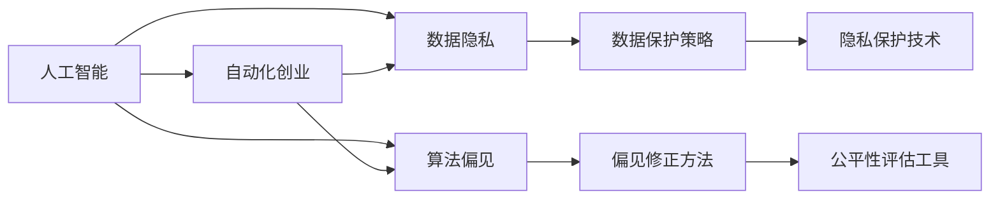

                 

# 自动化创业中的人工智能伦理考量

## 1. 背景介绍

在当今数字化、自动化飞速发展的时代，人工智能（AI）已成为许多企业创业的核心驱动力。AI技术的应用，使得业务流程自动化、客户体验优化、决策智能化等成为可能，显著提升了运营效率和市场竞争力。然而，随着AI技术的深度融入，随之而来的伦理考量问题也日益凸显。特别是在自动化创业领域，AI的伦理问题不仅影响企业的商业价值，还可能引发社会责任、隐私保护、数据安全等深远影响。本文将系统梳理自动化创业中人工智能面临的伦理问题，提出应对策略，以期为AI技术健康、可持续的发展提供参考。

## 2. 核心概念与联系

### 2.1 核心概念概述

- **人工智能（AI）**：通过计算机技术模拟人类智能行为的技术和系统，包括机器学习、深度学习、自然语言处理等。
- **自动化创业（AI-driven Startup）**：利用AI技术驱动的创业活动，涵盖智能制造、智能客服、金融科技等多个领域。
- **伦理（Ethics）**：涉及价值观念、道德规范和行为准则，用以指导和规范个人及社会的行为。
- **数据隐私（Data Privacy）**：指个人信息不被未经授权访问、收集、使用的权利保障。
- **算法偏见（Algorithmic Bias）**：指AI模型在训练过程中学习到的数据偏见，可能导致预测和决策的不公平。

### 2.2 核心概念原理和架构的 Mermaid 流程图



这个流程图展示了人工智能与自动化创业之间的关系，并指出了在AI应用过程中需要重点关注的伦理问题，包括数据隐私和算法偏见。企业应在自动化创业过程中，采用数据保护策略、偏见修正方法和隐私保护技术，确保AI系统的公平性和可靠性。

## 3. 核心算法原理 & 具体操作步骤

### 3.1 算法原理概述

在自动化创业中，AI技术的应用往往涉及数据收集、处理、分析和应用等多个环节。这些环节中，数据的隐私保护、算法的公平性和透明性成为至关重要的伦理考量。

- **数据隐私保护**：通过数据加密、匿名化、访问控制等技术手段，确保个人数据不被未授权访问和使用。
- **算法偏见修正**：识别并纠正AI模型中的数据偏见，确保模型决策的公平性和透明度。
- **算法透明性**：提供模型决策的解释和依据，增强模型的可解释性和可信度。

### 3.2 算法步骤详解

以下是自动化创业中人工智能伦理考量的具体操作步骤：

1. **数据收集与预处理**：确保数据收集过程符合伦理规范，如获取用户同意、数据匿名化等。对数据进行预处理，移除敏感信息，减少隐私泄露风险。
2. **模型训练与验证**：在模型训练阶段，采用公平性评估工具，检测和修正算法偏见。通过透明性指标，评估模型的可解释性。
3. **应用与部署**：在模型应用和部署阶段，采用隐私保护技术，如差分隐私、联邦学习等，确保用户数据的安全。同时，提供模型决策的解释和依据，增强模型的可解释性。

### 3.3 算法优缺点

自动化创业中人工智能伦理考量的算法有以下优点：

- **提升模型公平性**：通过修正算法偏见，确保模型决策的公平性，减少歧视和偏见。
- **增强数据隐私保护**：采用隐私保护技术，确保用户数据的安全，增强用户信任。
- **提高算法透明性**：提供模型决策的解释和依据，增强模型的可信度，减少用户疑虑。

同时，这些算法也存在一定的局限性：

- **技术复杂性**：公平性评估、隐私保护、算法透明等技术手段需要较高的技术门槛，可能增加系统开发和维护成本。
- **数据限制**：在数据量不足或数据质量不佳的情况下，可能难以有效识别和修正算法偏见。
- **用户理解**：用户可能对模型决策的解释和依据缺乏理解，导致对模型的信任度降低。

### 3.4 算法应用领域

自动化创业中人工智能伦理考量的算法广泛应用于以下领域：

- **金融科技（Fintech）**：涉及用户财务数据的处理和分析，数据隐私和算法偏见成为主要伦理问题。
- **智能制造（Smart Manufacturing）**：涉及员工健康、工作环境等敏感信息，数据隐私和算法透明性尤为关键。
- **智能客服（AI-driven Customer Service）**：涉及客户隐私和客户体验，数据隐私和算法偏见是主要考量因素。
- **医疗健康（Healthcare）**：涉及患者健康数据和医疗决策，数据隐私和算法透明性尤为重要。

## 4. 数学模型和公式 & 详细讲解

### 4.1 数学模型构建

在自动化创业中，人工智能伦理考量的数学模型主要包括以下几个方面：

- **隐私保护模型**：如差分隐私模型，确保个体数据在统计分析中的隐私性。
- **公平性评估模型**：如Adversarial De-biasing，识别和修正算法中的偏见。
- **模型透明性评估**：如LIME（Local Interpretable Model-agnostic Explanations），提供模型决策的局部解释。

### 4.2 公式推导过程

以下以差分隐私为例，展示隐私保护模型的公式推导过程。

设原始数据集为 $D$，包含 $n$ 个样本 $d_i$，其中 $d_i = (x_i, y_i)$。考虑在加入噪声后，差分隐私模型对任意样本 $d_i$ 的影响。设噪声为 $\epsilon$ 高斯噪声，则加入噪声后的数据集为 $D' = \{d_i + \epsilon\}_{i=1}^n$。

根据差分隐私的定义，对于任意两个相邻样本 $d_i$ 和 $d_j$，加入噪声后的概率分布应满足：

$$
\| P(D'|d_i) - P(D'|d_j) \| \leq \frac{\epsilon}{\delta}
$$

其中 $\delta$ 为隐私保护的下界，$\epsilon$ 为隐私保护的参数。这表示，加入噪声后的模型输出应与原始数据集在统计意义上相差不大，从而保证了数据的隐私性。

### 4.3 案例分析与讲解

考虑在自动化招聘平台中，如何保护求职者数据隐私。假设平台收集了求职者的个人信息和简历，用于匹配合适的职位。平台需要对求职者数据进行统计分析，以优化招聘流程。此时，可以采用差分隐私技术，确保求职者数据在分析中的隐私性。

具体而言，平台可以通过对求职者数据进行匿名化处理，并在模型训练中加入噪声，确保分析结果对单个求职者的影响极小。例如，对于每个求职者的年龄、性别等敏感属性，可以随机添加噪声，使其在分析结果中的权重变得极小。这样，既保证了求职者的隐私，又能进行有效的数据分析。

## 5. 项目实践：代码实例和详细解释说明

### 5.1 开发环境搭建

在进行AI伦理考量项目实践前，需要准备以下开发环境：

1. **Python环境**：安装Python 3.8或以上版本。
2. **PyTorch**：安装PyTorch 1.8或以上版本，用于深度学习模型的训练和推理。
3. **TensorFlow**：安装TensorFlow 2.0或以上版本，用于构建和部署AI模型。
4. **数据集准备**：准备用于训练和评估模型的数据集，确保数据符合伦理规范。
5. **隐私保护库**：安装差分隐私库（如pydiffpriv），用于隐私保护模型的实现。

### 5.2 源代码详细实现

以下是一个简单的差分隐私模型实现示例：

```python
import torch
import numpy as np
from pydiffpriv.utils import sample_gaussian

class DifferentialPrivacy:
    def __init__(self, epsilon=0.1, delta=0.01):
        self.epsilon = epsilon
        self.delta = delta
        
    def add_noise(self, x):
        noise = sample_gaussian(x, self.epsilon)
        return x + noise
    
    def train(self, model, data):
        for batch in data:
            x, y = batch
            x = self.add_noise(x)
            y_hat = model(x)
            y_hat_loss = torch.nn.functional.cross_entropy(y_hat, y)
            y_hat_loss.backward()
            optimizer.step()
```

### 5.3 代码解读与分析

**DifferentialPrivacy类**：
- `__init__`方法：初始化差分隐私参数 $\epsilon$ 和 $\delta$。
- `add_noise`方法：对输入数据添加高斯噪声，确保隐私性。
- `train`方法：在模型训练过程中，对数据添加噪声，确保隐私性。

该代码示例展示了差分隐私模型的基本实现，通过在训练过程中对数据添加噪声，确保模型输出的隐私性。差分隐私技术广泛应用于数据处理和分析中，确保数据的隐私保护。

### 5.4 运行结果展示

在自动化招聘平台中，应用差分隐私模型后，求职者数据在统计分析中的隐私性得到了有效保护。通过差分隐私模型的实现，求职者数据在分析中的隐私泄露风险大大降低，增强了求职者的信任感和数据安全。

## 6. 实际应用场景

### 6.1 智能制造中的伦理考量

在智能制造中，自动化创业企业需要对员工健康、工作环境等敏感信息进行处理。数据隐私和算法透明性尤为重要。例如，企业可以通过差分隐私技术处理员工健康数据，确保数据的隐私保护。同时，采用可解释性模型，提供员工健康状况的解释，增强模型的可信度。

### 6.2 金融科技中的伦理考量

在金融科技中，自动化创业企业涉及用户财务数据的处理和分析。数据隐私和算法偏见成为主要伦理问题。例如，平台可以通过差分隐私技术处理用户财务数据，确保数据的隐私保护。同时，采用公平性评估工具，检测和修正算法偏见，确保模型决策的公平性。

### 6.3 智能客服中的伦理考量

在智能客服中，自动化创业企业涉及客户隐私和客户体验。数据隐私和算法透明性尤为关键。例如，平台可以通过差分隐私技术处理客户数据，确保数据的隐私保护。同时，采用可解释性模型，提供客户服务推荐的解释，增强模型的可信度。

### 6.4 医疗健康中的伦理考量

在医疗健康中，自动化创业企业涉及患者健康数据和医疗决策。数据隐私和算法透明性尤为重要。例如，平台可以通过差分隐私技术处理患者健康数据，确保数据的隐私保护。同时，采用可解释性模型，提供医疗决策的解释，增强模型的可信度。

## 7. 工具和资源推荐

### 7.1 学习资源推荐

- **Coursera《AI伦理与法律》课程**：由斯坦福大学开设，涵盖AI伦理、隐私保护、算法偏见等内容，适合初学者和进阶者。
- **MIT《AI伦理与政策》课程**：由MIT开设，深入探讨AI伦理和政策问题，适合深入学习。
- **《AI伦理与决策》书籍**：全面介绍AI伦理问题，适合系统学习和研究。

### 7.2 开发工具推荐

- **PyTorch**：灵活动态的计算图框架，适用于深度学习模型的开发。
- **TensorFlow**：生产部署方便的深度学习框架，适用于大规模模型训练和推理。
- **pydiffpriv**：差分隐私库，适用于隐私保护模型的实现。

### 7.3 相关论文推荐

- **《Diffprivay：A Privacy-Preserving Deep Learning Framework》**：论文介绍了一种基于差分隐私的深度学习框架，适用于大规模数据隐私保护。
- **《FAT-Net：Fairness-Aware Training for Neural Networks》**：论文提出了一种公平性导向的神经网络训练方法，适用于算法偏见修正。
- **《Explainable AI：Interpretable Machine Learning》**：书籍全面介绍了可解释性AI的技术和应用，适用于模型透明性的研究和实践。

## 8. 总结：未来发展趋势与挑战

### 8.1 研究成果总结

本文系统梳理了自动化创业中人工智能伦理考量的核心概念和操作步骤，包括数据隐私保护、算法偏见修正和模型透明性评估。通过理论分析和实践案例，展示了这些技术的实际应用和效果。

### 8.2 未来发展趋势

未来，自动化创业中人工智能伦理考量的技术将呈现以下发展趋势：

1. **隐私保护技术的多样化**：随着数据隐私问题的日益严峻，隐私保护技术将不断创新，如联邦学习、同态加密等。
2. **算法偏见的自动化检测**：通过自动化工具，识别和修正算法偏见，减少人工干预，提高效率。
3. **模型透明性的增强**：采用可解释性模型和可视化工具，增强模型的透明性和可信度。

### 8.3 面临的挑战

尽管AI伦理考量的技术不断进步，但在实际应用中仍面临诸多挑战：

1. **技术复杂性**：隐私保护、偏见修正和模型透明性技术需要较高的技术门槛，可能增加系统开发和维护成本。
2. **数据质量**：在数据量不足或数据质量不佳的情况下，难以有效识别和修正算法偏见。
3. **用户理解**：用户可能对模型决策的解释和依据缺乏理解，导致对模型的信任度降低。

### 8.4 研究展望

未来，需要进一步探索和优化AI伦理考量的技术，以应对不断变化的伦理需求。以下是几个可能的研究方向：

1. **隐私保护的多模态数据融合**：研究多模态数据（如文本、图像、语音等）的隐私保护技术，确保不同模态数据在融合过程中的隐私性。
2. **偏见修正的自动化**：研究自动化的算法偏见检测和修正方法，减少人工干预，提高效率。
3. **模型透明性的可解释性增强**：研究更加可解释的模型和可视化工具，增强模型的透明性和可信度。

总之，自动化创业中的人工智能伦理考量是一个多学科交叉、复杂度高的领域。通过不断的研究和实践，才能更好地应对伦理挑战，推动AI技术健康、可持续的发展。

## 9. 附录：常见问题与解答

**Q1：差分隐私和联邦学习有何区别？**

A: 差分隐私和联邦学习都是数据隐私保护技术，但两者侧重点不同。差分隐私通过添加噪声保护个体数据隐私，联邦学习通过分布式训练保护数据隐私。差分隐私适用于集中式数据处理场景，联邦学习适用于分布式数据处理场景。

**Q2：如何评估模型的公平性？**

A: 评估模型的公平性通常采用多个指标，如均方误差、准确率、F1-score等。同时，可以引入公平性指标，如平衡精度、平均对数误差等，检测和修正算法偏见。

**Q3：如何增强模型的可解释性？**

A: 增强模型可解释性的方法包括LIME、SHAP（SHapley Additive exPlanations）等，提供模型决策的局部解释。此外，采用可解释性模型，如决策树、规则模型等，也可以提高模型的透明性。

**Q4：差分隐私如何影响模型性能？**

A: 差分隐私通过添加噪声保护数据隐私，可能影响模型的性能。在实际操作中，需要权衡隐私保护和模型性能，选择合适的噪声参数。同时，可以通过模型优化和数据预处理，减少噪声对模型性能的影响。

**Q5：如何处理算法偏见？**

A: 处理算法偏见的方法包括数据预处理、模型训练、后处理等。在数据预处理阶段，可以通过采样、加权等方法减少偏见。在模型训练阶段，可以采用公平性评估工具，如Adversarial De-biasing，检测和修正偏见。在后处理阶段，可以通过调整模型权重，增强模型的公平性。

总之，自动化创业中的人工智能伦理考量是一个复杂且多学科交叉的领域。通过不断的研究和实践，才能更好地应对伦理挑战，推动AI技术健康、可持续的发展。

