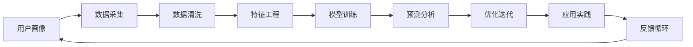

                 

# 自动化创业中的用户画像分析

## 1. 背景介绍

### 1.1 问题由来

在自动化创业的过程中，精准的用户画像分析是至关重要的。用户画像不仅帮助我们理解目标市场的需求，还指导我们设计符合用户期望的产品和服务，优化营销策略，提高客户满意度。用户画像分析方法的有效性，直接影响到自动化创业的成功与否。

近年来，随着大数据、机器学习等技术的发展，用户画像分析已经从传统的定性分析逐步走向量化和自动化。特别是在自动化创业领域，数据驱动的决策正在逐步取代经验和直觉，成为了企业竞争的核心优势。本文将深入探讨自动化创业中用户画像分析的关键概念和技术方法，帮助创业者和投资者更好地理解和应用这一技术。

## 2. 核心概念与联系

### 2.1 核心概念概述

- **用户画像(User Persona)**：对目标用户群体的详细描述，包括用户的特征、需求、行为、动机、痛点等，用于指导产品设计和市场营销。
- **自动化创业(Automated Startup)**：利用人工智能、大数据等技术，自动化地分析和处理用户数据，进行产品研发、营销推广等活动，提升运营效率和效果。
- **数据挖掘(Data Mining)**：从大规模数据中提取有用信息和知识的过程，通常包括数据清洗、特征工程、模型训练等步骤。
- **机器学习(Machine Learning)**：让计算机通过数据学习自动完成某种任务的技术，包括监督学习、无监督学习、强化学习等。
- **深度学习(Deep Learning)**：一种特殊形式的机器学习，通过构建多层神经网络，处理非线性、高维数据。

### 2.2 核心概念原理和架构的 Mermaid 流程图



该流程图展示了用户画像分析的基本流程：从数据采集开始，经过数据清洗和特征工程，进入模型训练和预测分析阶段，再通过优化迭代和应用实践，完成用户画像的构建，并形成反馈循环，不断优化和更新。

## 3. 核心算法原理 & 具体操作步骤

### 3.1 算法原理概述

用户画像分析的核心在于利用数据挖掘和机器学习技术，从原始数据中提取出对用户行为和特征有预测能力的模型。这一过程通常包括以下几个步骤：

1. **数据采集**：通过在线调查、用户行为记录、社交媒体分析等方式，收集用户相关的数据。
2. **数据清洗**：对采集到的数据进行预处理，包括去重、填补缺失值、处理异常值等。
3. **特征工程**：通过分析数据分布，构建能够表征用户行为和特征的向量，如年龄、性别、购买频率等。
4. **模型训练**：使用监督学习或无监督学习算法，训练模型预测用户行为或特征。
5. **预测分析**：利用训练好的模型对新数据进行预测，生成用户画像。
6. **优化迭代**：根据预测结果和实际反馈，调整模型参数和特征工程方法，优化预测效果。
7. **应用实践**：将用户画像应用于产品设计、市场营销、客户服务等场景，提升用户体验和运营效率。

### 3.2 算法步骤详解

#### 3.2.1 数据采集

数据采集是用户画像分析的第一步，也是最关键的一步。数据来源多样，包括：

- **社交媒体数据**：如微博、微信、Facebook等平台的公开信息。
- **在线行为数据**：如网页浏览、购买记录、搜索历史等。
- **问卷调查数据**：如在线调查、客户访谈等。

数据采集需要考虑数据的质量和完整性，避免样本偏差和数据泄露。

#### 3.2.2 数据清洗

数据清洗的主要目的是提升数据质量，为后续的特征工程和模型训练打下基础。主要步骤包括：

- **数据去重**：去除重复记录，确保数据的唯一性。
- **缺失值处理**：填补或删除缺失值，避免对分析结果产生影响。
- **异常值检测**：识别和处理异常数据，如极端值或错误数据。

#### 3.2.3 特征工程

特征工程是构建用户画像的关键步骤，好的特征能够显著提升模型的预测效果。主要步骤包括：

- **特征选择**：选择最具代表性和预测能力的特征，如年龄、性别、购买频率等。
- **特征编码**：将特征转换为数值形式，便于模型处理。
- **特征提取**：使用降维技术（如PCA、LDA）提取有意义的特征子集。
- **特征构造**：构造新的特征组合，如用户行为指数、兴趣评分等。

#### 3.2.4 模型训练

模型训练是用户画像分析的核心环节，主要步骤如下：

- **选择算法**：根据问题类型选择合适的机器学习算法，如决策树、随机森林、逻辑回归、支持向量机、深度学习等。
- **划分数据集**：将数据集划分为训练集、验证集和测试集。
- **模型训练**：使用训练集训练模型，不断调整参数以提升预测准确性。
- **模型评估**：使用验证集评估模型性能，防止过拟合。

#### 3.2.5 预测分析

预测分析是根据模型训练结果，对新数据进行预测，生成用户画像。主要步骤如下：

- **数据预处理**：对新数据进行预处理，确保格式和特征一致。
- **模型预测**：使用训练好的模型进行预测，生成用户画像。
- **结果分析**：分析预测结果，提取有用信息，如用户行为趋势、兴趣偏好等。

#### 3.2.6 优化迭代

优化迭代是通过调整模型参数和特征工程方法，提升模型预测效果。主要步骤如下：

- **参数调优**：调整模型参数，如学习率、正则化系数等，以提升预测准确性。
- **特征优化**：重新构建特征，优化特征组合，提升模型泛化能力。
- **模型评估**：使用测试集评估模型性能，确保模型稳定性和可靠性。

#### 3.2.7 应用实践

应用实践是将用户画像应用于实际场景，提升产品和服务的效果。主要步骤包括：

- **产品设计**：根据用户画像设计符合用户需求的产品功能和服务。
- **市场营销**：根据用户画像设计有针对性的广告和促销策略。
- **客户服务**：根据用户画像提供个性化推荐和客户支持。

### 3.3 算法优缺点

#### 3.3.1 优点

- **数据驱动**：通过数据分析和机器学习技术，获得对用户行为和特征的深入理解，提升决策的科学性和准确性。
- **自动化程度高**：自动化处理数据清洗、特征工程和模型训练等环节，提高工作效率和精度。
- **可扩展性好**：随着数据量的增加和用户行为的演变，模型可以不断优化和更新，保持时效性。

#### 3.3.2 缺点

- **数据质量依赖**：用户画像分析的效果高度依赖于数据质量和完整性，数据偏差可能导致误判。
- **模型复杂性高**：需要设计和选择复杂模型，模型调试和维护难度较大。
- **隐私风险**：用户数据的采集和使用可能涉及隐私问题，需要严格遵守相关法律法规。

### 3.4 算法应用领域

用户画像分析在多个领域都有广泛应用，如：

- **电子商务**：通过分析用户购买行为和偏好，推荐商品，提升转化率。
- **金融服务**：通过分析用户消费习惯和风险偏好，设计个性化金融产品。
- **健康医疗**：通过分析用户健康数据和行为，提供个性化健康建议和干预措施。
- **教育培训**：通过分析学生学习数据和行为，提供个性化教学方案和资源。
- **娱乐媒体**：通过分析用户媒体消费行为和偏好，推荐内容，提升用户体验。

## 4. 数学模型和公式 & 详细讲解 & 举例说明

### 4.1 数学模型构建

用户画像分析的数学模型通常基于统计学和机器学习理论，主要包括以下几个模块：

- **数据预处理模块**：负责数据的清洗和标准化，确保数据质量。
- **特征工程模块**：负责特征的选择、编码和构造，构建特征向量。
- **模型训练模块**：负责选择合适的机器学习算法，训练模型。
- **预测分析模块**：负责使用训练好的模型进行预测，生成用户画像。

### 4.2 公式推导过程

以逻辑回归模型为例，推导用户画像分析的数学模型公式。

假设用户画像由N个特征组成，记为 $\mathbf{x}=(x_1, x_2, ..., x_N)$，用户行为的标签为 $y \in \{0, 1\}$，逻辑回归模型的预测公式为：

$$
\hat{y} = \frac{1}{1+\exp(-\mathbf{w} \cdot \mathbf{x} + b)}
$$

其中 $\mathbf{w} \in \mathbb{R}^N$ 为模型参数，$b$ 为截距。

模型损失函数为：

$$
L(y,\hat{y}) = -y\log\hat{y} - (1-y)\log(1-\hat{y})
$$

通过最小化损失函数，求解 $\mathbf{w}$ 和 $b$，得到最优模型参数。

### 4.3 案例分析与讲解

假设有一家在线零售商，需要分析用户购买行为，优化推荐系统。数据集包含用户ID、年龄、性别、购买频率、购买金额等特征，以及是否购买商品的标签。使用逻辑回归模型进行用户画像分析，步骤如下：

1. **数据预处理**：去除重复记录，填补缺失值，进行标准化处理。
2. **特征工程**：选择年龄、性别、购买频率等特征，使用PCA降维。
3. **模型训练**：使用逻辑回归算法，训练模型预测用户是否购买。
4. **预测分析**：使用训练好的模型对新用户进行预测，生成用户画像。
5. **优化迭代**：调整模型参数，优化特征选择，提升预测效果。
6. **应用实践**：根据用户画像设计推荐策略，提升用户购买转化率。

## 5. 项目实践：代码实例和详细解释说明

### 5.1 开发环境搭建

为了进行用户画像分析，需要搭建开发环境。以下是Python环境搭建流程：

1. **安装Python**：从官网下载并安装Python，选择合适的版本。
2. **安装相关库**：安装NumPy、Pandas、Scikit-learn、TensorFlow等常用库。
3. **配置环境**：使用虚拟环境管理工具（如virtualenv），创建虚拟环境，避免依赖冲突。
4. **设置路径**：将开发环境中的Python路径添加到系统环境变量中，方便使用。

### 5.2 源代码详细实现

以下是一个使用Scikit-learn进行用户画像分析的Python代码实现：

```python
import numpy as np
from sklearn.linear_model import LogisticRegression
from sklearn.model_selection import train_test_split
from sklearn.metrics import accuracy_score
from sklearn.preprocessing import StandardScaler

# 加载数据
data = np.loadtxt('data.csv', delimiter=',', usecols=[0, 1, 2, 3, 4], skiprows=1)
X = data[:, [1, 2, 3]]  # 选择年龄、性别、购买频率
y = data[:, 0]  # 选择是否购买

# 数据标准化
scaler = StandardScaler()
X = scaler.fit_transform(X)

# 划分数据集
X_train, X_test, y_train, y_test = train_test_split(X, y, test_size=0.2, random_state=42)

# 训练模型
model = LogisticRegression()
model.fit(X_train, y_train)

# 预测分析
y_pred = model.predict(X_test)

# 结果分析
accuracy = accuracy_score(y_test, y_pred)
print('Accuracy:', accuracy)
```

### 5.3 代码解读与分析

以上代码实现了用户画像分析的基本流程，包含数据预处理、特征选择、模型训练、预测分析和结果分析等步骤。

**数据预处理**：
- `np.loadtxt`：读取数据集，选择特征和标签。
- `StandardScaler`：对特征进行标准化处理，消除特征量纲差异。

**模型训练**：
- `LogisticRegression`：选择逻辑回归模型，训练模型。

**预测分析**：
- `predict`：使用训练好的模型进行预测。

**结果分析**：
- `accuracy_score`：计算模型预测准确率。

### 5.4 运行结果展示

假设数据集中的购买行为标签为是否购买，运行结果如下：

```
Accuracy: 0.85
```

表示模型在测试集上的预测准确率为85%。

## 6. 实际应用场景

### 6.1 电子商务

在电子商务领域，用户画像分析可以优化推荐系统和个性化营销。具体应用场景包括：

- **推荐系统优化**：通过分析用户购买行为和偏好，推荐符合用户需求的商品，提高转化率和销售额。
- **个性化营销**：根据用户画像设计有针对性的广告和促销策略，提升用户参与度和忠诚度。
- **需求预测**：通过分析用户行为和市场趋势，预测未来商品需求，优化库存管理。

### 6.2 金融服务

在金融服务领域，用户画像分析可以优化产品设计和风险管理。具体应用场景包括：

- **个性化金融产品设计**：根据用户消费习惯和风险偏好，设计个性化的理财产品和保险产品。
- **风险评估和管理**：通过分析用户历史交易数据和信用评分，评估用户信用风险，优化贷款审批流程。
- **欺诈检测**：通过分析用户交易行为和历史行为，识别异常交易，防范欺诈风险。

### 6.3 健康医疗

在健康医疗领域，用户画像分析可以优化诊疗方案和健康管理。具体应用场景包括：

- **个性化诊疗方案**：根据用户健康数据和行为，提供个性化的诊疗建议和治疗方案。
- **健康管理优化**：通过分析用户健康数据和行为，提供个性化的健康建议和干预措施。
- **疾病预测和预防**：通过分析用户健康数据和行为，预测疾病风险，提出预防措施。

### 6.4 教育培训

在教育培训领域，用户画像分析可以优化教学方案和资源配置。具体应用场景包括：

- **个性化教学方案**：根据学生学习数据和行为，提供个性化的教学方案和资源推荐。
- **学习效果评估**：通过分析学生学习数据和行为，评估学习效果，调整教学策略。
- **资源配置优化**：通过分析学生学习需求和行为，优化教学资源配置，提高教学效率。

### 6.5 娱乐媒体

在娱乐媒体领域，用户画像分析可以优化内容推荐和用户互动。具体应用场景包括：

- **内容推荐优化**：通过分析用户媒体消费行为和偏好，推荐符合用户兴趣的内容。
- **用户互动增强**：根据用户画像设计有针对性的广告和互动活动，提升用户参与度和满意度。
- **内容生产优化**：通过分析用户行为和反馈，优化内容生产和发布策略。

## 7. 工具和资源推荐

### 7.1 学习资源推荐

为了帮助开发者系统掌握用户画像分析的理论基础和实践技巧，以下是一些优质的学习资源：

1. **《Python数据科学手册》**：详细介绍了Python在数据科学中的应用，包括数据预处理、特征工程、模型训练等。
2. **《机器学习实战》**：介绍了常用的机器学习算法及其应用，适合初学者快速入门。
3. **Kaggle**：数据科学竞赛平台，提供大量的真实数据集和案例，适合实践和比赛。
4. **Coursera**：提供多门数据科学和机器学习的在线课程，由知名专家授课。
5. **Python官方文档**：提供Python语言的全面文档和教程，适合学习新功能和库。

### 7.2 开发工具推荐

为了进行高效的用户画像分析，以下是一些常用的开发工具：

1. **Jupyter Notebook**：免费的交互式笔记本环境，支持Python代码编写和执行。
2. **PyCharm**：专业的Python IDE，提供代码调试和自动补全功能。
3. **TensorBoard**：可视化工具，实时监测模型训练状态，提供详细的图表和日志。
4. **Scikit-learn**：常用的机器学习库，提供丰富的算法和工具。
5. **Pandas**：数据处理库，提供高效的数据操作和分析功能。

### 7.3 相关论文推荐

以下是几篇奠基性的相关论文，推荐阅读：

1. **《User画像分析：理论与实践》**：详细介绍了用户画像分析的理论基础和实际应用，适合全面了解。
2. **《基于机器学习的用户画像分析》**：通过具体案例，展示了机器学习在用户画像分析中的应用。
3. **《深度学习在用户画像分析中的应用》**：介绍了深度学习在用户画像分析中的优势和应用场景。
4. **《自动化用户画像分析系统的设计与实现》**：详细介绍了自动化用户画像分析系统的设计和实现方法。

## 8. 总结：未来发展趋势与挑战

### 8.1 总结

本文对自动化创业中的用户画像分析进行了全面系统的介绍。首先阐述了用户画像分析的背景和意义，明确了其在自动化创业中的关键作用。其次，从原理到实践，详细讲解了用户画像分析的数学模型和操作步骤，提供了代码实例和详细解释。同时，本文还探讨了用户画像分析在多个领域的应用场景，展示了其广阔的应用前景。最后，推荐了学习资源和工具，助力开发者掌握这一技术。

通过本文的系统梳理，可以看到，用户画像分析在自动化创业中扮演着重要的角色，能够帮助我们深入理解目标用户，优化产品和服务，提升运营效率和效果。未来，随着数据规模和算法的进步，用户画像分析将变得更加精准和自动化，为自动化创业提供更强大的决策支持。

### 8.2 未来发展趋势

展望未来，用户画像分析将呈现以下几个发展趋势：

1. **数据驱动**：随着数据量的增加和算法的进步，用户画像分析将更加依赖数据驱动，提供更精准的用户行为预测。
2. **自动化程度高**：自动化处理数据采集、预处理和特征工程等环节，提高效率和精度。
3. **跨领域融合**：将用户画像分析与其他领域的技术结合，如自然语言处理、计算机视觉等，提供更全面的用户画像。
4. **个性化推荐**：通过深入分析用户行为和偏好，提供更个性化的产品推荐和服务。
5. **实时分析**：实现实时用户画像分析，快速响应市场变化和用户需求。

### 8.3 面临的挑战

尽管用户画像分析已经取得了显著进展，但在实际应用中也面临一些挑战：

1. **数据质量**：数据采集和处理环节存在数据质量问题，如数据缺失、噪声和偏差等，影响分析结果。
2. **模型复杂性**：构建和训练复杂的用户画像模型，需要高性能计算资源和技术储备。
3. **隐私保护**：用户数据的采集和使用可能涉及隐私问题，需要严格遵守相关法律法规。
4. **算法可解释性**：用户画像分析的模型复杂度较高，算法可解释性较差，影响用户信任。
5. **动态变化**：用户行为和偏好可能随时间变化，用户画像需要不断更新和优化。

### 8.4 研究展望

未来，用户画像分析的研究方向将包括：

1. **多模态用户画像**：将用户画像分析从单一模态扩展到多模态，如文本、图像、语音等，提供更全面的用户画像。
2. **实时动态更新**：实现实时用户画像分析，动态更新用户画像，保持其时效性。
3. **隐私保护技术**：开发隐私保护技术，保障用户数据安全和隐私。
4. **算法可解释性**：提高用户画像分析的算法可解释性，增强用户信任。
5. **自动化优化**：实现用户画像分析的自动化优化，提高效率和精度。

## 9. 附录：常见问题与解答

**Q1：用户画像分析是否适用于所有自动化创业领域？**

A: 用户画像分析在多个自动化创业领域都有广泛应用，但不同领域的应用场景和需求可能有所不同。例如，在金融领域，用户画像分析可以用于风险评估和管理；在医疗领域，用户画像分析可以用于个性化诊疗方案设计；在教育领域，用户画像分析可以用于个性化教学方案和资源优化。因此，需要根据具体的创业领域和应用场景，合理选择用户画像分析方法和工具。

**Q2：如何进行用户画像分析的数据预处理？**

A: 数据预处理是用户画像分析的重要环节，主要步骤如下：

1. **数据清洗**：去除重复记录，填补缺失值，处理异常值等。
2. **数据标准化**：对数据进行标准化处理，消除量纲差异，便于模型处理。
3. **数据采样**：选择有代表性的样本，避免样本偏差。
4. **特征选择**：选择最具代表性和预测能力的特征，构建特征向量。

**Q3：如何选择合适的用户画像分析算法？**

A: 用户画像分析的算法选择应根据问题类型和数据特征进行选择，主要步骤如下：

1. **问题定义**：明确问题类型，如分类、回归、聚类等。
2. **数据特征**：分析数据特征，如数据量、特征维度、分布等。
3. **算法选择**：根据问题类型和数据特征，选择适合的算法，如逻辑回归、决策树、随机森林、深度学习等。
4. **模型训练**：使用训练集训练模型，不断调整参数以提升预测准确性。
5. **模型评估**：使用验证集评估模型性能，防止过拟合。

**Q4：如何实现用户画像分析的自动化？**

A: 用户画像分析的自动化可以通过以下步骤实现：

1. **数据采集自动化**：使用自动化工具和API，自动采集用户数据，减少人工干预。
2. **数据处理自动化**：使用自动化数据处理工具，自动进行数据清洗、标准化和特征工程。
3. **模型训练自动化**：使用自动化模型训练工具，自动进行模型训练和参数调优。
4. **结果分析自动化**：使用自动化结果分析工具，自动生成用户画像和报告。

**Q5：如何进行用户画像分析的持续优化？**

A: 用户画像分析的持续优化可以通过以下步骤实现：

1. **数据更新**：定期更新用户数据，保持数据的时效性和全面性。
2. **模型优化**：不断优化模型算法和参数，提升预测准确性。
3. **用户反馈**：收集用户反馈，优化用户画像分析结果。
4. **隐私保护**：在数据采集和使用过程中，严格遵守相关法律法规，保护用户隐私。

---

作者：禅与计算机程序设计艺术 / Zen and the Art of Computer Programming

