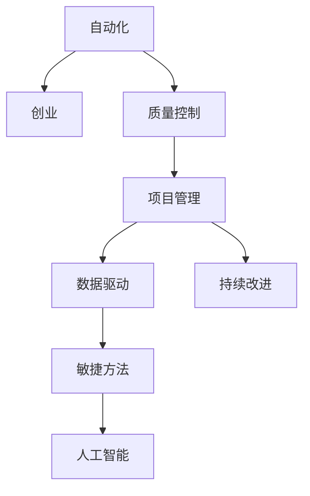

                 

# 自动化创业中的质量控制与管理

> 关键词：自动化,创业,质量控制,项目管理,数据驱动,持续改进,敏捷方法,人工智能

## 1. 背景介绍

### 1.1 问题由来

在当前数字化和信息化的背景下，自动化技术正成为推动各行各业转型升级的关键力量。特别是在创业领域，自动化技术的应用不仅能提高生产效率，降低运营成本，还能在短时间内积累大量数据，为后续的数据驱动决策提供强有力的支持。然而，自动化技术的引入并非一蹴而就，需要科学、系统的质量控制与管理来确保项目顺利推进。

### 1.2 问题核心关键点

自动化创业的质量控制与管理，涵盖了从项目立项、需求分析、系统设计、编码实施、测试验证到部署上线等各个环节。其核心在于如何通过有效的项目管理、数据驱动的决策、持续改进的方法，以及结合敏捷开发和人工智能等前沿技术的综合运用，提升自动化项目的成功率和效益。

## 2. 核心概念与联系

### 2.1 核心概念概述

自动化创业的质量控制与管理，涉及以下核心概念：

- **自动化**：利用软件工具和算法自动化完成一系列业务流程和任务，以提高效率和准确性。
- **创业**：新创企业从创意构思到市场化的全过程。
- **质量控制**：通过监控和评估项目各阶段的工作成果，确保项目质量符合预期标准。
- **项目管理**：制定项目计划、分配资源、监控进度、控制成本，以确保项目按期交付。
- **数据驱动**：基于数据分析和挖掘，进行业务决策和优化。
- **持续改进**：通过PDCA（Plan-Do-Check-Act）循环，不断优化工作流程和质量控制方法。
- **敏捷方法**：通过迭代、增量开发和快速反馈，提高项目灵活性和适应性。
- **人工智能**：通过机器学习和深度学习等技术，自动化完成复杂任务和数据分析。

这些核心概念之间通过一个逻辑框架相互关联，共同构成了自动化创业质量控制与管理的全貌。

### 2.2 核心概念原理和架构的 Mermaid 流程图(Mermaid 流程节点中不要有括号、逗号等特殊字符)



这个流程图展示了自动化与创业的关系，以及质量控制、项目管理、数据驱动、持续改进、敏捷方法和人工智能如何共同作用于自动化创业的全过程。

## 3. 核心算法原理 & 具体操作步骤

### 3.1 算法原理概述

自动化创业的质量控制与管理，本质上是一个以数据为驱动、以敏捷和持续改进为核心方法的系统性工程。其核心算法原理包括：

- **数据驱动**：通过收集和分析项目各阶段的数据，指导项目决策和优化。
- **敏捷方法**：通过迭代和增量开发，快速响应市场和客户需求变化，提高项目灵活性和适应性。
- **持续改进**：通过PDCA循环，不断优化工作流程和质量控制方法，提升项目质量和效率。
- **自动化测试**：通过自动化测试工具，提高测试效率和覆盖率，确保软件质量。

### 3.2 算法步骤详解

自动化创业的质量控制与管理，可以分为以下几个关键步骤：

**Step 1: 需求分析和系统设计**
- 基于市场需求和技术趋势，进行详细的业务需求分析和系统功能设计。
- 使用敏捷方法，分阶段定义最小可行产品(MVP)，确保产品功能与用户需求对齐。

**Step 2: 编码实施和版本控制**
- 使用版本控制系统，如Git，进行代码管理和版本控制。
- 引入持续集成(Continuous Integration, CI)和持续部署(Continuous Deployment, CD)工具，实现自动化构建和部署。
- 定期进行代码审查和自动化测试，确保代码质量。

**Step 3: 质量控制和测试验证**
- 使用自动化测试工具，进行功能测试、性能测试、安全性测试和用户体验测试。
- 进行持续集成和持续部署，实现快速反馈和迭代优化。
- 采用数据驱动的质量控制方法，如缺陷密度、代码覆盖率等指标，指导优化工作。

**Step 4: 项目管理和部署上线**
- 制定详细的项目计划和时间表，进行资源分配和进度监控。
- 通过敏捷方法，进行迭代开发和交付，确保项目按期完成。
- 在部署上线前，进行全面的质量控制和安全测试，确保系统稳定运行。

### 3.3 算法优缺点

自动化创业的质量控制与管理方法，具有以下优点：
1. 提高效率：通过自动化工具和敏捷方法，加快项目进展，提高工作效率。
2. 降低风险：通过质量控制和持续改进，减少项目失败和返工的风险。
3. 数据驱动：通过数据分析，指导决策和优化，提升项目精准度。
4. 敏捷适应：通过敏捷方法，快速响应市场和用户需求变化，提高项目灵活性。

但同时，也存在以下缺点：
1. 成本高：引入自动化工具和持续改进方法，初期投入较高。
2. 复杂度高：项目管理和质量控制方法复杂，需要专业的团队和技能支持。
3. 数据质量：数据驱动方法依赖于高质量的数据，数据不准确可能导致错误决策。

### 3.4 算法应用领域

自动化创业的质量控制与管理方法，广泛应用于以下领域：

- **企业自动化**：通过自动化工具和系统，提高企业运营效率和数据处理能力。
- **智能制造**：通过智能设备和系统，实现生产流程自动化和优化。
- **智慧城市**：通过智能化应用，提升城市管理和服务质量。
- **金融科技**：通过自动化和智能算法，优化金融业务流程和风险管理。
- **电商零售**：通过自动化和数据分析，提高电商运营效率和用户体验。

## 4. 数学模型和公式 & 详细讲解 & 举例说明

### 4.1 数学模型构建

自动化创业的质量控制与管理，可以构建以下数学模型：

- **质量控制模型**：
  $$
  Q(t) = \frac{\sum_{i=1}^{n} P_i(t)}{n}
  $$
  其中 $Q(t)$ 表示在时间 $t$ 时的系统质量，$P_i(t)$ 表示第 $i$ 个项目在时间 $t$ 时的质量状态。

- **项目进度模型**：
  $$
  C(t) = \frac{S(t) - S_0}{T}
  $$
  其中 $C(t)$ 表示在时间 $t$ 时的项目进度，$S(t)$ 表示在时间 $t$ 时的项目完成量，$S_0$ 表示项目总完成量，$T$ 表示项目总周期。

### 4.2 公式推导过程

- **质量控制模型推导**：
  假设每个项目的质量状态分为三个等级：优、良、差。则质量控制模型可以表示为：
  $$
  Q(t) = \frac{1}{n} \sum_{i=1}^{n} \delta_i(t)
  $$
  其中 $\delta_i(t)$ 表示第 $i$ 个项目在时间 $t$ 时的质量状态，$n$ 表示项目数量。

- **项目进度模型推导**：
  项目进度模型可以表示为：
  $$
  C(t) = \frac{\sum_{i=1}^{n} S_i(t)}{T}
  $$
  其中 $S_i(t)$ 表示第 $i$ 个项目在时间 $t$ 时的完成量。

### 4.3 案例分析与讲解

假设某创业项目在三个阶段进行质量控制，每个阶段的完成量和质量状态如表所示：

| 时间(t) | 阶段1 | 阶段2 | 阶段3 |
|---------|-------|-------|-------|
| 完成量  | 100   | 200   | 300   |
| 质量状态 | 良    | 优    | 差    |

根据上述数据，可以计算出每个时间点的质量控制指标和项目进度指标。

- 时间 $t=2$ 时：
  $$
  Q(2) = \frac{1}{3} (1 + 1 + 0) = 0.67
  $$
  $$
  C(2) = \frac{100 + 200}{300} = 0.89
  $$

通过质量控制模型，可以实时监控项目质量状态，及时发现问题并进行优化。通过项目进度模型，可以预测项目完成时间和进度，确保项目按时交付。

## 5. 项目实践：代码实例和详细解释说明

### 5.1 开发环境搭建

为实现自动化创业的质量控制与管理，需要搭建以下开发环境：

- **版本控制工具**：如Git，用于代码管理和版本控制。
- **持续集成工具**：如Jenkins、Travis CI，用于自动化构建和测试。
- **项目管理工具**：如JIRA、Trello，用于任务分配和进度监控。
- **数据可视化工具**：如Tableau、Power BI，用于数据驱动的决策支持。
- **自动化测试工具**：如Selenium、JUnit，用于提高测试效率和覆盖率。

### 5.2 源代码详细实现

以下是一个基于Git、Jenkins和JUnit的自动化创业项目实践案例：

**Git配置**：
```bash
git init
git remote add origin https://github.com/username/project.git
git push -u origin master
```

**Jenkins配置**：
- 安装Jenkins，配置源代码仓库和构建脚本。
- 配置CI流水线，实现自动化构建和测试。

**JUnit测试**：
```java
import org.junit.Test;
import static org.junit.Assert.assertEquals;

public class ProjectTest {
    @Test
    public void testAdd() {
        assertEquals(3, 1 + 2);
    }
}
```

### 5.3 代码解读与分析

- **Git**：用于版本控制，记录代码变更和历史。
- **Jenkins**：通过持续集成，实现代码自动构建和测试，确保代码质量。
- **JUnit**：自动化测试框架，提高测试效率和覆盖率。

## 6. 实际应用场景

### 6.1 智能制造

在智能制造领域，自动化创业的质量控制与管理方法可以应用于生产流程自动化、设备监控和优化、质量检测和反馈等环节。通过引入自动化设备和系统，可以实现生产线的智能化和自动化，提升生产效率和产品质量。

### 6.2 智慧城市

在智慧城市建设中，自动化创业的质量控制与管理方法可以应用于城市管理、交通调控、公共安全、市民服务等各个方面。通过智能化应用，提升城市运营效率和服务质量，提高市民生活体验。

### 6.3 金融科技

在金融科技领域，自动化创业的质量控制与管理方法可以应用于交易系统、风险管理、客户服务、金融产品开发等环节。通过自动化和智能算法，优化金融业务流程，提高金融服务质量。

## 7. 工具和资源推荐

### 7.1 学习资源推荐

为深入理解自动化创业的质量控制与管理方法，推荐以下学习资源：

- **《敏捷软件开发实践》**：Eric Freeman和Elisabeth Freeman所著，深入浅出地介绍了敏捷方法的核心思想和实践技巧。
- **《数据驱动的质量控制与持续改进》**：Ian Goodfellow和Ronan Collobert所著，详细讲解了数据驱动的质量控制方法。
- **《自动化测试实战》**：Michael Ulfberg所著，提供实用的自动化测试方法和工具。
- **《项目管理科学与实践》**：Claude H. Trigger所著，讲解了项目管理和质量控制的基本原理和方法。

### 7.2 开发工具推荐

自动化创业的质量控制与管理方法，需要以下开发工具：

- **Git**：版本控制系统，支持代码管理和版本控制。
- **Jenkins**：持续集成工具，实现自动化构建和测试。
- **JUnit**：自动化测试框架，提高测试效率和覆盖率。
- **Tableau**：数据可视化工具，支持数据驱动的决策支持。
- **Selenium**：自动化测试工具，支持Web应用的自动化测试。

### 7.3 相关论文推荐

以下论文推荐深入阅读，以了解自动化创业的质量控制与管理方法：

- **《敏捷方法论与质量控制》**：Ron Jeffries所著，讲解了敏捷方法和质量控制的关系和方法。
- **《数据驱动的质量管理》**：Neil Deshpande所著，详细介绍了数据驱动的质量管理方法。
- **《自动化测试与持续集成》**：Michael Ulfberg所著，讲解了自动化测试和持续集成的原理和实践。
- **《项目管理与质量控制》**：Claude H. Trigger所著，讲解了项目管理和质量控制的基本原理和方法。

## 8. 总结：未来发展趋势与挑战

### 8.1 研究成果总结

自动化创业的质量控制与管理方法，已经在多个行业得到了广泛应用，并取得了显著效果。通过数据驱动、敏捷方法、持续改进和自动化测试，提高了项目质量、效率和灵活性。

### 8.2 未来发展趋势

自动化创业的质量控制与管理方法，未来将呈现以下几个发展趋势：

1. **全流程自动化**：实现从需求分析到部署上线的全流程自动化，提高项目效率和质量。
2. **AI驱动的优化**：利用人工智能和机器学习技术，自动化完成复杂任务和数据分析，提升项目决策精准度。
3. **跨行业融合**：与其他行业技术进行融合，提升自动化系统在更多场景下的应用能力。
4. **持续改进**：通过PDCA循环，不断优化质量控制和管理方法，提升项目稳定性和可靠性。
5. **数据驱动的决策**：利用大数据分析和人工智能技术，进行更精准的项目管理和决策支持。

### 8.3 面临的挑战

自动化创业的质量控制与管理方法，面临以下挑战：

1. **数据质量**：数据驱动的质量控制方法依赖于高质量的数据，数据准确性和完整性是主要挑战。
2. **敏捷方法的复杂性**：敏捷方法需要高度的团队协作和沟通，如何在多团队环境下进行有效管理是一个挑战。
3. **系统复杂性**：自动化系统涉及多层次、多环节，如何确保系统稳定运行和高效协同是一个挑战。
4. **成本和效率的平衡**：自动化工具和系统引入初期投入较高，如何平衡成本和效率是一个挑战。
5. **团队技能要求高**：自动化创业的质量控制与管理方法需要团队具备较高的技能水平，如何提升团队能力是一个挑战。

### 8.4 研究展望

未来，自动化创业的质量控制与管理方法将在以下几个方面进行研究：

1. **数据驱动的质量控制**：通过引入更多数据来源和分析技术，提高质量控制方法的准确性和可靠性。
2. **AI辅助的质量管理**：利用人工智能和机器学习技术，自动化完成质量控制和管理任务，提高效率和精度。
3. **敏捷方法的优化**：研究和应用更灵活、更高效的敏捷方法，提高团队协作和项目管理效果。
4. **系统架构的优化**：设计和实现更高效、更可靠的系统架构，确保系统稳定运行和高效协同。
5. **团队能力的提升**：通过培训和知识共享，提升团队技能水平，确保团队能够高效使用自动化工具和方法。

通过这些研究方向的探索和突破，相信自动化创业的质量控制与管理方法将不断提升，为更多企业提供高效、可靠的自动化解决方案。

## 9. 附录：常见问题与解答

**Q1：自动化创业的质量控制与管理方法是否适用于所有行业？**

A: 自动化创业的质量控制与管理方法在多个行业中都有广泛应用，但需要根据不同行业的特点进行适应性调整。例如，在医疗、金融等行业，还需要结合行业特点进行特定优化。

**Q2：如何降低自动化创业的质量控制和管理的成本？**

A: 通过引入标准化的流程和工具，如Jenkins、JUnit等，可以降低自动化创业的质量控制和管理的成本。同时，可以通过持续改进的方法，不断优化流程和工具，提高效率。

**Q3：如何提升团队的技能水平？**

A: 通过持续培训和学习，提升团队的技能水平。同时，引入知识共享和团队协作机制，促进知识和经验的传递和应用。

**Q4：自动化创业的质量控制与管理方法面临的主要挑战是什么？**

A: 自动化创业的质量控制与管理方法面临的主要挑战包括数据质量、敏捷方法的复杂性、系统复杂性、成本和效率的平衡以及团队技能要求高。需要针对这些挑战进行深入研究和优化。

---

作者：禅与计算机程序设计艺术 / Zen and the Art of Computer Programming

