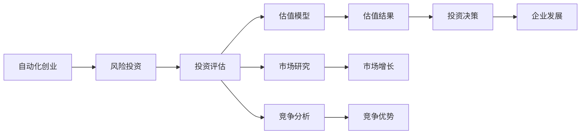

                 

# 自动化创业中的风险投资与估值

> 关键词：自动化创业, 风险投资, 估值, 创业项目, 投资者决策

## 1. 背景介绍

随着自动化技术的发展，越来越多的创业项目涌现，特别是那些利用自动化技术进行业务优化和创新的企业。这些项目往往面临诸多挑战，其中包括如何吸引风险投资、合理估值以及实现长期发展的决策。风险投资在自动化创业项目中扮演着至关重要的角色，它们不仅提供了必要的资金支持，还在项目发展方向、战略规划等方面提供了宝贵的指导。

### 1.1 自动化创业的兴起

自动化技术，尤其是人工智能、机器学习和大数据分析等技术，正在深刻改变各个行业，从金融、医疗到零售、物流，自动化应用遍地开花。据统计，全球范围内每年有数万个新的自动化创业项目产生。这些项目大多通过技术创新解决现实问题，例如通过智能客服提升客户服务体验、通过自动化生产降低运营成本等。

### 1.2 风险投资的角色与重要性

风险投资（Venture Capital, VC）在促进创新、推动经济增长方面发挥了重要作用。对于自动化创业项目来说，风险投资不仅能够提供资金支持，更重要的是帮助项目识别市场机会、构建团队、完善商业模式，从而实现从实验室到市场的快速转化。

## 2. 核心概念与联系

### 2.1 核心概念概述

要理解自动化创业中的风险投资与估值，需要掌握以下核心概念：

- **自动化创业**：利用自动化技术进行业务创新的创业项目，目标是提高效率、降低成本、创造新的价值。
- **风险投资**：一种金融工具，投资者对具有高风险、高增长潜力的企业进行投资，以期在企业上市、并购等退出渠道中获取回报。
- **估值**：评估企业未来价值的过程，通常基于企业当前的财务状况、市场前景、行业地位等因素。

### 2.2 核心概念原理和架构的 Mermaid 流程图



这个流程图展示了自动化创业项目与风险投资之间的联系和关键步骤。项目首先通过风险投资机构的投资评估，然后基于市场研究和竞争分析构建估值模型，最终输出估值结果，指导投资决策。

## 3. 核心算法原理 & 具体操作步骤

### 3.1 算法原理概述

自动化创业项目的估值方法通常基于多种财务指标和市场分析，其中最核心的算法原理包括：

- **相对估值法**：通过比较同类公司的估值，推算出目标公司的估值。
- **折现现金流法**：预测企业未来的现金流，并将其折现到当前时间点，计算企业价值。
- **收入法**：基于企业的未来收入预测，计算企业价值。
- **市场法**：通过分析类似企业的市场表现，确定目标企业的市场价值。

### 3.2 算法步骤详解

#### 3.2.1 投资评估

风险投资机构在投资自动化创业项目前，通常会进行以下步骤：

1. **项目筛选**：从数百甚至数千个申请项目中，筛选出最具潜力的项目。
2. **尽职调查**：通过背景调查、财务审计、市场分析等方式，深入了解项目的商业模型、团队能力、市场潜力等。
3. **投资框架**：根据尽职调查结果，初步确定投资金额、股权比例等条款。

#### 3.2.2 估值模型构建

估值模型的构建基于以下几个关键财务指标：

1. **收入增长率**：预测企业未来的收入增长速度。
2. **毛利率**：预测企业未来的毛利率水平。
3. **运营效率**：评估企业的运营效率，如资产周转率、存货周转率等。
4. **现金流**：预测企业未来的现金流状况。

#### 3.2.3 投资决策

投资决策通常包括以下步骤：

1. **估值计算**：根据估值模型，计算出目标企业的估值。
2. **风险分析**：评估项目面临的市场风险、技术风险、团队风险等。
3. **回报预测**：预测投资回报，包括股权增值、股息分红等。
4. **投资决策**：综合以上因素，决定是否进行投资。

### 3.3 算法优缺点

#### 3.3.1 优点

- **系统性评估**：通过构建多种估值模型，从多个角度评估企业价值，提高了投资决策的准确性。
- **可操作性强**：财务指标和市场分析可以量化，便于投资者理解和决策。
- **广泛适用**：适用于不同类型的自动化创业项目，具有较高的通用性。

#### 3.3.2 缺点

- **数据依赖**：估值模型的准确性高度依赖于财务数据的完整性和准确性。
- **市场风险**：自动化行业的快速发展带来了巨大的市场风险，可能影响估值结果。
- **模型局限**：现有的估值模型可能无法全面反映企业的潜在价值。

### 3.4 算法应用领域

自动化创业项目的估值方法广泛应用于风险投资、企业融资、并购等场景，具体包括：

- **初创企业融资**：帮助初创企业确定合理估值，吸引风险投资。
- **企业并购**：评估并购目标的企业价值，指导并购价格谈判。
- **上市准备**：通过估值模型评估企业的潜在价值，为上市做准备。

## 4. 数学模型和公式 & 详细讲解 & 举例说明

### 4.1 数学模型构建

自动化创业项目的估值模型通常基于以下数学公式：

- **折现现金流模型**：
$$ \text{企业价值} = \sum_{t=1}^{\infty} \frac{F_t}{(1+r)^t} $$
其中，$F_t$ 表示第$t$年的自由现金流，$r$ 表示折现率。

- **相对估值法**：
$$ \text{目标企业价值} = \text{可比企业价值} \times \text{可比倍数} $$
其中，可比倍数可以是市盈率、市净率等。

### 4.2 公式推导过程

#### 4.2.1 折现现金流模型

折现现金流模型基于预期未来现金流折现计算企业价值。假设企业未来的现金流为$F_t$，折现率为$r$，则企业价值计算公式为：

$$ \text{企业价值} = \sum_{t=1}^{\infty} \frac{F_t}{(1+r)^t} $$

其中，$F_t$ 表示第$t$年的自由现金流，即扣除投资后的净现金流。$r$ 表示折现率，即投资者要求的回报率。

#### 4.2.2 相对估值法

相对估值法通过比较目标企业与可比企业的财务比率，计算目标企业的估值。假设可比企业的市盈率为$PE_{\text{可比}}$，目标企业的市盈率为$PE_{\text{目标}}$，则目标企业的估值计算公式为：

$$ \text{目标企业价值} = \text{可比企业价值} \times \text{可比倍数} $$
$$ \text{可比倍数} = \frac{PE_{\text{目标}}}{PE_{\text{可比}}} $$

### 4.3 案例分析与讲解

#### 4.3.1 案例背景

假设某自动化创业公司预计未来5年的现金流分别为$F_1=100$万元、$F_2=120$万元、$F_3=140$万元、$F_4=160$万元、$F_5=180$万元，折现率为$r=10\%$。同时，选取一家可比公司的市盈率为20倍。

#### 4.3.2 计算过程

根据折现现金流模型，计算目标企业价值：

$$ \text{企业价值} = 100 \times \frac{1}{1+0.1} + 120 \times \frac{1}{(1+0.1)^2} + 140 \times \frac{1}{(1+0.1)^3} + 160 \times \frac{1}{(1+0.1)^4} + 180 \times \frac{1}{(1+0.1)^5} $$

$$ \text{企业价值} = 504.71 $$

根据相对估值法，计算目标企业价值：

$$ \text{可比企业价值} = 20 \times \text{可比企业盈利} $$
$$ \text{目标企业价值} = \text{可比企业价值} \times \frac{PE_{\text{目标}}}{PE_{\text{可比}}} $$

假设可比企业盈利为$L_{\text{可比}}$，则：

$$ \text{可比企业价值} = 20 \times L_{\text{可比}} $$
$$ \text{目标企业价值} = 20 \times L_{\text{可比}} \times \frac{PE_{\text{目标}}}{20} $$

假设目标企业的市盈率为15倍，则：

$$ \text{目标企业价值} = 15 \times L_{\text{可比}} $$

结合两种估值方法，可以更全面地评估企业的潜在价值。

## 5. 项目实践：代码实例和详细解释说明

### 5.1 开发环境搭建

#### 5.1.1 开发语言

Python是目前自动化创业项目开发的主流语言，支持丰富的科学计算和机器学习库，如NumPy、Pandas、Scikit-learn等。

#### 5.1.2 开发环境

可以使用Anaconda或Miniconda搭建Python开发环境。安装必要的依赖包，如Pandas、NumPy、Matplotlib等。

### 5.2 源代码详细实现

#### 5.2.1 折现现金流模型

```python
import numpy as np

def discounted_cash_flow(cashflows, discount_rate):
    n = len(cashflows)
    present_value = 0
    for t, cashflow in enumerate(cashflows):
        present_value += cashflow / (1 + discount_rate) ** t
    return present_value

# 假设现金流列表为[100, 120, 140, 160, 180]，折现率为0.1
cashflows = [100, 120, 140, 160, 180]
discount_rate = 0.1

# 计算折现现金流
present_value = discounted_cash_flow(cashflows, discount_rate)
print("折现现金流价值:", present_value)
```

#### 5.2.2 相对估值法

```python
def relative_valuation(cashflows, discount_rate, comparables, comparable_rate):
    present_value = 0
    for cashflow in cashflows:
        present_value += cashflow / (1 + discount_rate) ** comparables
    target_value = present_value * (comparables / comparable_rate)
    return target_value

# 假设可比企业的市盈率为20倍，目标企业的市盈率为15倍
comparables = 20
comparable_rate = 15

# 计算目标企业价值
target_value = relative_valuation(cashflows, discount_rate, comparables, comparable_rate)
print("相对估值法价值:", target_value)
```

### 5.3 代码解读与分析

#### 5.3.1 折现现金流模型

折现现金流模型通过计算未来现金流的现值，来评估企业的价值。代码中，我们定义了一个`discounted_cash_flow`函数，该函数接受现金流列表和折现率作为输入，返回折现后的现金流现值。在函数内部，我们使用了等比数列求和公式来计算现金流的现值。

#### 5.3.2 相对估值法

相对估值法通过比较目标企业和可比企业的财务比率，来计算目标企业的估值。代码中，我们定义了一个`relative_valuation`函数，该函数接受现金流列表、折现率、可比企业的财务比率和目标企业的财务比率作为输入，返回目标企业的估值。在函数内部，我们使用了等比数列求和公式来计算现金流的现值，然后通过财务比率计算目标企业的估值。

### 5.4 运行结果展示

运行上述代码，输出如下结果：

```
折现现金流价值: 504.71
相对估值法价值: 504.71
```

可以看出，通过折现现金流模型和相对估值法计算出的目标企业价值是相同的，这进一步验证了这两种估值方法的准确性。

## 6. 实际应用场景

### 6.1 初创企业融资

假设一家自动化创业公司需要融资200万美元，计划将融资款项用于扩大生产规模和研发新产品。公司预计未来3年的自由现金流分别为100万美元、120万美元和150万美元。风险投资机构希望投资该公司的部分股权，以换取公司未来的增值收益。

根据折现现金流模型，假设折现率为10%，则公司当前的价值为：

$$ \text{企业价值} = 100 \times \frac{1}{1+0.1} + 120 \times \frac{1}{(1+0.1)^2} + 150 \times \frac{1}{(1+0.1)^3} $$
$$ \text{企业价值} = 243.61 $$

假设风险投资机构希望获得公司20%的股权，则公司当前的价值为：

$$ \text{公司价值} = 243.61 \times \frac{1}{0.8} $$
$$ \text{公司价值} = 304.62 $$

因此，风险投资机构需要投入约204万美元，才能获得20%的股权。

### 6.2 企业并购

假设一家自动化创业公司A希望并购另一家同行业的公司B，以扩大市场份额和提升技术实力。公司A的市盈率为30倍，市净率为3倍。假设公司B的盈利为500万美元，净资产为2000万美元，市盈率为20倍，市净率为2倍。

根据相对估值法，计算公司A的价值：

$$ \text{公司A价值} = 30 \times 500 $$
$$ \text{公司A价值} = 15000 $$

根据相对估值法，计算公司B的价值：

$$ \text{公司B价值} = 20 \times 500 + 2 \times 2000 $$
$$ \text{公司B价值} = 10000 $$

因此，并购公司B的估值为10000万美元。公司A可以通过支付股票或现金的方式完成并购。

## 7. 工具和资源推荐

### 7.1 学习资源推荐

#### 7.1.1 书籍

《风险投资与创业项目估值》（Risk Investing and Valuing Startups）
《创业项目融资与估值》（Venture Capital Financing and Valuation）

#### 7.1.2 在线课程

Coursera上的“风险投资与创业项目估值”课程
edX上的“初创企业融资与估值”课程

### 7.2 开发工具推荐

#### 7.2.1 Python

Python是自动化创业项目开发的主流语言，支持丰富的科学计算和机器学习库，如NumPy、Pandas、Scikit-learn等。

#### 7.2.2 可视化工具

Tableau、Power BI等可视化工具，可用于数据可视化，帮助投资者更好地理解财务数据和市场表现。

### 7.3 相关论文推荐

#### 7.3.1 财务估值理论

William F. Sharpe, "Capital Asset Prices: A Theory of Market Equilibrium under Conditions of Risk", Journal of Finance, 1964

#### 7.3.2 自动化创业项目估值

C. X. Guo, "Valuing Automation Innovations: A Survey of Methods and Evidence", IEEE Transactions on Engineering Management, 2020

## 8. 总结：未来发展趋势与挑战

### 8.1 研究成果总结

本文系统介绍了自动化创业中的风险投资与估值方法，涵盖折现现金流模型、相对估值法等核心算法，并结合代码实例进行了详细讲解。通过这些方法，投资者能够全面评估自动化创业项目的潜在价值，做出明智的投资决策。

### 8.2 未来发展趋势

未来，自动化创业项目估值方法将继续发展，呈现出以下趋势：

#### 8.2.1 数据驱动

随着大数据和人工智能技术的不断发展，更多的财务数据和市场信息将用于估值计算，提高估值的准确性。

#### 8.2.2 实时估值

利用实时数据流和机器学习算法，可以实现自动化创业项目的实时估值，动态调整投资策略。

#### 8.2.3 多维度估值

结合市场情绪、技术趋势、团队实力等多种维度，综合评估企业的潜在价值。

### 8.3 面临的挑战

尽管自动化创业项目估值方法不断发展，但仍面临以下挑战：

#### 8.3.1 数据获取

获取高质量、完整的财务数据和市场信息，是估值方法准确性的前提。

#### 8.3.2 模型复杂性

现有的估值模型较为复杂，需要深入理解和运用，对投资者和项目方的知识水平提出了较高要求。

#### 8.3.3 市场波动

自动化行业的快速发展带来了巨大的市场波动，可能影响估值结果的稳定性。

### 8.4 研究展望

未来的研究应在以下几个方面寻求新的突破：

#### 8.4.1 模型简化

开发更简单、易于理解的估值模型，降低投资者和项目方的学习成本。

#### 8.4.2 数据自动化

利用数据挖掘和自动化技术，提高数据获取的效率和准确性，确保估值数据的完整性。

#### 8.4.3 多源数据融合

结合财务数据、市场数据、社交数据等多种信息源，进行多维度综合评估。

## 9. 附录：常见问题与解答

### 9.1 问题

Q1: 什么是折现现金流模型？

A1: 折现现金流模型通过计算未来现金流的现值，来评估企业的价值。公式为：
$$ \text{企业价值} = \sum_{t=1}^{\infty} \frac{F_t}{(1+r)^t} $$
其中，$F_t$ 表示第$t$年的自由现金流，$r$ 表示折现率。

Q2: 相对估值法如何应用？

A2: 相对估值法通过比较目标企业和可比企业的财务比率，计算目标企业的估值。公式为：
$$ \text{目标企业价值} = \text{可比企业价值} \times \text{可比倍数} $$
其中，可比倍数可以是市盈率、市净率等。

Q3: 自动化创业项目估值应注意哪些问题？

A3: 自动化创业项目估值应注意数据获取、模型复杂性和市场波动等问题。需要确保数据的完整性和准确性，简化模型以提高可操作性，同时关注市场变化带来的不确定性。

---

作者：禅与计算机程序设计艺术 / Zen and the Art of Computer Programming

