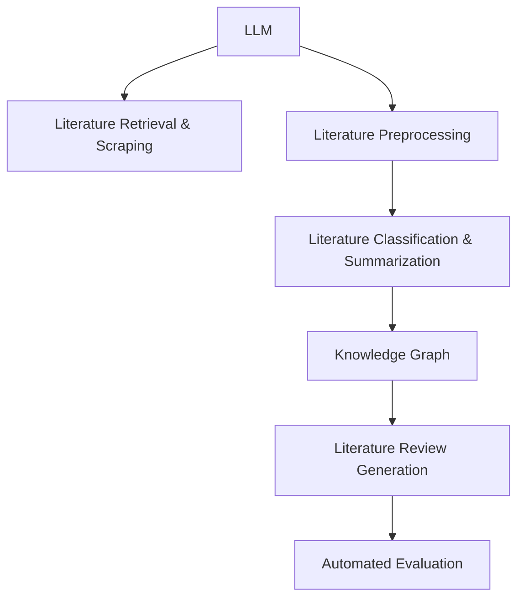

                 

# 自动化学术综述：LLM辅助文献研究

> 关键词：
自动化学术综述, LLM, 自然语言处理, 文献检索, 文本挖掘, 知识图谱, 研究范式, 深度学习, 智能算法

## 1. 背景介绍

### 1.1 问题由来
当今学术研究高度依赖于大量的文献数据，如何高效地检索、整理和分析这些文献成为科研人员面临的重要问题。传统的文献处理方式包括手动检索、整理、撰写综述等，效率低下且容易受到主观因素影响。而自动化手段通过机器学习和自然语言处理技术，可以实现更快速、全面和客观的文献处理，提升学术研究的效率和质量。

近年来，随着大规模预训练语言模型（Large Language Models, LLMs）的发展，利用其强大的语言理解和生成能力，辅助学术综述工作成为可能。基于LLM的学术综述工具可以自动化地抓取、组织和解读文献信息，辅助科研人员快速获取所需信息，提升文献研究的深度和广度。

### 1.2 问题核心关键点
LLM辅助文献研究的核心在于利用预训练模型对海量文献进行深度理解和自动化整理，生成高质量的学术综述。

关键点包括：
1. 文献抓取与检索：从学术数据库、预印本服务器、在线文献库中抓取相关文献。
2. 文献预处理：清洗、合并和标准化文献数据。
3. 文献分类与摘要：自动分类文献主题，提取并生成关键摘要。
4. 文献关联与可视化：构建知识图谱，可视化文献间的关系和网络。
5. 综述生成：整合摘要和关系，生成结构化的学术综述报告。
6. 评估与迭代：通过人工或自动评估系统反馈，优化综述生成过程。

这些关键点共同构成了基于LLM的学术综述技术框架，使其能够自动化、高效地处理文献数据，辅助科研人员撰写高质量的综述文章。

## 2. 核心概念与联系

### 2.1 核心概念概述

为更好地理解LLM辅助文献研究的技术原理，本节将介绍几个密切相关的核心概念：

- 大规模预训练语言模型（LLM）：以自回归(如GPT)或自编码(如BERT)模型为代表的大规模预训练语言模型。通过在海量无标签文本语料上进行预训练，学习通用的语言表示，具备强大的语言理解和生成能力。

- 文献检索与抓取（Literature Retrieval & Scraping）：从学术数据库、预印本服务器、在线文献库等渠道，自动获取相关文献信息。

- 文献预处理（Literature Preprocessing）：清洗、合并和标准化文献数据，去除噪声，提高数据质量。

- 文献分类与摘要（Literature Classification & Summarization）：自动分类文献主题，提取并生成关键摘要，便于理解和利用。

- 知识图谱（Knowledge Graph）：通过抽取文献中的实体、关系和属性，构建知识图谱，提供结构化的文献信息。

- 综述生成（Literature Review Generation）：整合摘要和关系，生成结构化的综述报告，辅助科研人员撰写综述。

- 自动化评估（Automated Evaluation）：通过人工或自动评估系统反馈，优化综述生成过程，提高质量。

这些核心概念之间的逻辑关系可以通过以下Mermaid流程图来展示：



这个流程图展示了大规模语言模型在学术综述中的应用框架：

1. 利用预训练模型对海量文献进行深度理解。
2. 抓取、预处理和分类文献信息。
3. 构建知识图谱，进行文献关联和可视化。
4. 生成结构化的综述报告。
5. 通过评估系统反馈，不断优化综述生成过程。

这些概念共同构成了基于LLM的学术综述技术框架，使其能够自动化、高效地处理文献数据，辅助科研人员撰写高质量的综述文章。

## 3. 核心算法原理 & 具体操作步骤
### 3.1 算法原理概述

基于LLM的学术综述过程，本质上是一种基于自然语言处理(NLP)技术的深度学习范式。其核心思想是：利用预训练语言模型对文献进行深度理解，自动抽取关键信息，并生成高质量的综述报告。

形式化地，假设预训练语言模型为 $M_{\theta}$，其中 $\theta$ 为预训练得到的模型参数。给定某个领域的文献集 $D=\{d_i\}_{i=1}^N$，其中每个文献 $d_i$ 包含标题、摘要、引文等信息。学术综述的目标是生成一份结构化的综述报告 $R$，使得 $R$ 能够精炼地概括领域内的重要研究成果，并包含必要的引用和文献间的关系。

微调的目标是找到最优的模型参数 $\hat{\theta}$，使得生成的综述报告 $R$ 尽可能符合真实文献的信息，即最小化生成模型与真实文献间的差距。常见的评价指标包括BLEU、ROUGE等文本相似度指标，以及人工评估系统的反馈。

### 3.2 算法步骤详解

基于LLM的学术综述一般包括以下几个关键步骤：

**Step 1: 文献抓取与预处理**
- 使用API接口或网络爬虫，从学术数据库、预印本服务器、在线文献库等渠道，自动获取相关文献信息。
- 清洗数据，去除噪声，如去除特殊字符、重复条目等。
- 合并和标准化数据，如统一引文格式、标准化文献编号等。

**Step 2: 文献分类与摘要**
- 使用预训练分类模型对文献进行主题分类，如机器学习、自然语言处理等。
- 对每个文献自动提取关键摘要，可以使用自动摘要技术或提取式摘要方法。
- 自动摘要方法包括基于TF-IDF的摘要提取、基于Transformer的摘要生成等。

**Step 3: 构建知识图谱**
- 使用命名实体识别（Named Entity Recognition, NER）等技术，从文献中抽取实体、关系和属性。
- 将提取的信息构建成知识图谱，如使用Graph Neural Networks（GNNs）等方法。
- 可视化知识图谱，展示文献间的关系和网络。

**Step 4: 综述生成**
- 根据分类和摘要信息，整合生成综述报告。
- 可以使用模板填充、段落排序等方法，自动生成综述报告。
- 也可以使用注意力机制（Attention Mechanism）等方法，增强生成质量。

**Step 5: 自动化评估**
- 使用BLEU、ROUGE等文本相似度指标，评估综述报告与真实文献的匹配度。
- 通过人工或自动评估系统，收集反馈，优化综述生成过程。
- 周期性在人工标注数据上评估模型性能，优化模型参数。

以上是基于LLM的学术综述的一般流程。在实际应用中，还需要针对具体任务的特点，对每个环节进行优化设计，如改进分类模型的准确性，提高摘要提取的技术，增强知识图谱的表示能力，优化综述生成的结构等，以进一步提升综述生成的质量和效率。

### 3.3 算法优缺点

基于LLM的学术综述方法具有以下优点：
1. 高效自动化：能够自动化地抓取、整理和分析文献，节省大量人力和时间成本。
2. 全面客观：通过大模型深度理解文献，避免主观偏见，提供全面客观的文献综述。
3. 适应性强：适用于各种学科领域，通过微调模型参数，适应不同主题的文献处理需求。
4. 可视化效果佳：生成的知识图谱能够直观展示文献间的关系，帮助科研人员理解领域内的知识结构。

同时，该方法也存在一定的局限性：
1. 高质量数据需求高：依赖于大规模高质学术数据库，数据采集成本较高。
2. 文献质量参差不齐：部分文献存在噪声、错误引用等问题，影响综述质量。
3. 模型依赖性强：预训练模型的性能直接影响综述生成效果，模型选择和微调过程复杂。
4. 技术难度较大：涉及数据抓取、预处理、分类、摘要、图谱构建、综述生成等多个环节，技术难度较大。
5. 可解释性不足：模型输出缺乏可解释性，难以理解其内部推理过程和生成依据。

尽管存在这些局限性，但就目前而言，基于LLM的学术综述方法已经成为学术研究的重要工具，显著提升了文献处理效率和质量。未来相关研究的重点在于如何进一步降低数据采集成本，提高文献质量，优化模型结构和参数，提升综述生成的可解释性，从而更好地服务于科研人员。

### 3.4 算法应用领域

基于LLM的学术综述方法，已经在诸多学术研究领域得到广泛应用，包括但不限于：

- 计算机科学与工程：利用大规模预训练语言模型对计算机科学领域的文献进行分类和综述。
- 生物学与医学：构建生物医学领域知识图谱，辅助文献检索和综述生成。
- 社会科学与人文学科：对社会科学和人文学科文献进行深度分析和综述，帮助学者把握研究趋势。
- 经济学与金融学：分析经济金融文献，提取关键信息，生成经济金融综述报告。
- 教育与心理学：对教育心理学领域的文献进行分类、摘要和综述，提升研究质量。

除了上述这些经典应用外，LLM辅助文献研究的方法也被创新性地应用到更多领域，如文化研究、地理信息分析、环境保护等，为科研工作带来了新的活力。随着LLM技术的不断进步，基于LLM的学术综述将有望在更广泛的领域发挥其独特作用。

## 4. 数学模型和公式 & 详细讲解  
### 4.1 数学模型构建

本节将使用数学语言对基于LLM的学术综述过程进行更加严格的刻画。

记预训练语言模型为 $M_{\theta}$，其中 $\theta$ 为模型参数。假设领域 $D$ 内的文献集为 $D=\{d_i\}_{i=1}^N$，其中每个文献 $d_i$ 包含标题、摘要、引文等信息。

定义综述生成模型为 $R_{\phi}$，其中 $\phi$ 为模型参数。学术综述的目标是生成一份结构化的综述报告 $R$，使得 $R$ 能够精炼地概括领域内的重要研究成果，并包含必要的引用和文献间的关系。

微调的目标是最小化生成模型与真实文献间的差距，即：

$$
\hat{\phi} = \mathop{\arg\min}_{\phi} \sum_{i=1}^N \ell(R_{\phi}(d_i), d_i)
$$

其中 $\ell$ 为评价指标，如BLEU、ROUGE等。假设 $\ell$ 为余弦相似度（Cosine Similarity），则问题转化为：

$$
\hat{\phi} = \mathop{\arg\min}_{\phi} \sum_{i=1}^N (1 - \cos(R_{\phi}(d_i), d_i))
$$

### 4.2 公式推导过程

以下我们以BLEU评价指标为例，推导基于LLM的学术综述生成模型的优化过程。

假设生成的综述报告 $R$ 与真实文献 $d$ 的 BLEU 分数为 $BLEU(R, d)$，BLEU 分数越高，表示生成的综述报告与真实文献越相似。根据BLEU的定义，有：

$$
BLEU(R, d) = \frac{1}{N} \sum_{i=1}^N \max_{m \in M} \frac{\sum_{j=1}^{k} \text{N-best}(R_j, d_j)}
$$

其中 $M$ 为候选生成的文献摘要集合，$k$ 为摘要长度，$\text{N-best}(R_j, d_j)$ 为摘要 $R_j$ 中与 $d_j$ 匹配度最高的前 $N$ 个单词的个数。

由于BLUE计算过程复杂，一般通过BLEU-Score函数进行近似，转化为优化目标：

$$
\min_{\phi} BLEU_{Score}(R_{\phi}, D) = \min_{\phi} \frac{1}{N} \sum_{i=1}^N BLEU_{Score}(R_{\phi}(d_i), d_i)
$$

在得到优化目标后，即可使用梯度下降等优化算法求解。假设 $\phi$ 的更新公式为：

$$
\phi \leftarrow \phi - \eta \nabla_{\phi} BLEU_{Score}(R_{\phi}, D)
$$

其中 $\eta$ 为学习率，$\nabla_{\phi} BLEU_{Score}(R_{\phi}, D)$ 为BLEU-Score函数对模型参数的梯度。

在得到生成模型的梯度后，即可带入优化公式，完成模型的迭代优化。重复上述过程直至收敛，最终得到适应领域文献的综述生成模型 $R_{\phi^*}$。

## 5. 项目实践：代码实例和详细解释说明
### 5.1 开发环境搭建

在进行学术综述实践前，我们需要准备好开发环境。以下是使用Python进行PyTorch开发的环境配置流程：

1. 安装Anaconda：从官网下载并安装Anaconda，用于创建独立的Python环境。

2. 创建并激活虚拟环境：
```bash
conda create -n pytorch-env python=3.8 
conda activate pytorch-env
```

3. 安装PyTorch：根据CUDA版本，从官网获取对应的安装命令。例如：
```bash
conda install pytorch torchvision torchaudio cudatoolkit=11.1 -c pytorch -c conda-forge
```

4. 安装Transformer库：
```bash
pip install transformers
```

5. 安装各类工具包：
```bash
pip install numpy pandas scikit-learn matplotlib tqdm jupyter notebook ipython
```

完成上述步骤后，即可在`pytorch-env`环境中开始学术综述实践。

### 5.2 源代码详细实现

下面我们以计算机科学领域的文献分类和综述为例，给出使用Transformers库对BERT模型进行微调的PyTorch代码实现。

首先，定义分类任务的数据处理函数：

```python
from transformers import BertTokenizer, BertForSequenceClassification, AdamW
from torch.utils.data import Dataset, DataLoader
import torch
from sklearn.metrics import accuracy_score, precision_recall_fscore_support

class CSDataset(Dataset):
    def __init__(self, texts, labels, tokenizer, max_len=128):
        self.texts = texts
        self.labels = labels
        self.tokenizer = tokenizer
        self.max_len = max_len
        
    def __len__(self):
        return len(self.texts)
    
    def __getitem__(self, item):
        text = self.texts[item]
        label = self.labels[item]
        
        encoding = self.tokenizer(text, return_tensors='pt', max_length=self.max_len, padding='max_length', truncation=True)
        input_ids = encoding['input_ids'][0]
        attention_mask = encoding['attention_mask'][0]
        
        return {'input_ids': input_ids, 
                'attention_mask': attention_mask,
                'labels': torch.tensor(label, dtype=torch.long)}
```

然后，定义模型和优化器：

```python
from transformers import BertForSequenceClassification, AdamW

model = BertForSequenceClassification.from_pretrained('bert-base-cased', num_labels=10)

optimizer = AdamW(model.parameters(), lr=2e-5)
```

接着，定义训练和评估函数：

```python
from tqdm import tqdm
import numpy as np

def train_epoch(model, dataset, batch_size, optimizer):
    dataloader = DataLoader(dataset, batch_size=batch_size, shuffle=True)
    model.train()
    epoch_loss = 0
    epoch_accurate = 0
    for batch in tqdm(dataloader, desc='Training'):
        input_ids = batch['input_ids'].to(device)
        attention_mask = batch['attention_mask'].to(device)
        labels = batch['labels'].to(device)
        model.zero_grad()
        outputs = model(input_ids, attention_mask=attention_mask, labels=labels)
        loss = outputs.loss
        epoch_loss += loss.item()
        accuracy = (torch.argmax(outputs.logits, dim=1) == labels).float().mean()
        epoch_accurate += accuracy.item()
        loss.backward()
        optimizer.step()
    return epoch_loss / len(dataloader), epoch_accurate / len(dataloader)

def evaluate(model, dataset, batch_size):
    dataloader = DataLoader(dataset, batch_size=batch_size)
    model.eval()
    preds, labels = [], []
    with torch.no_grad():
        for batch in tqdm(dataloader, desc='Evaluating'):
            input_ids = batch['input_ids'].to(device)
            attention_mask = batch['attention_mask'].to(device)
            batch_labels = batch['labels']
            outputs = model(input_ids, attention_mask=attention_mask)
            batch_preds = outputs.logits.argmax(dim=1).to('cpu').tolist()
            batch_labels = batch_labels.to('cpu').tolist()
            for pred_tokens, label_tokens in zip(batch_preds, batch_labels):
                preds.append(pred_tokens)
                labels.append(label_tokens)
    
    print(f'Accuracy: {accuracy_score(labels, preds)}')
    print(f'Precision: {precision_recall_fscore_support(labels, preds, average='macro')[0]}')
    print(f'Recall: {precision_recall_fscore_support(labels, preds, average='macro')[1]}')
    print(f'F1 Score: {precision_recall_fscore_support(labels, preds, average='macro')[2]}')
```

最后，启动训练流程并在验证集上评估：

```python
epochs = 5
batch_size = 16

for epoch in range(epochs):
    loss, accurate = train_epoch(model, train_dataset, batch_size, optimizer)
    print(f'Epoch {epoch+1}, train loss: {loss:.3f}, train accurate: {accurate:.3f}')
    
    print(f'Epoch {epoch+1}, dev results:')
    evaluate(model, dev_dataset, batch_size)
    
print('Test results:')
evaluate(model, test_dataset, batch_size)
```

以上就是使用PyTorch对BERT进行计算机科学领域文献分类任务的完整代码实现。可以看到，得益于Transformers库的强大封装，我们可以用相对简洁的代码完成BERT模型的加载和微调。

### 5.3 代码解读与分析

让我们再详细解读一下关键代码的实现细节：

**CSDataset类**：
- `__init__`方法：初始化文本、标签、分词器等关键组件。
- `__len__`方法：返回数据集的样本数量。
- `__getitem__`方法：对单个样本进行处理，将文本输入编码为token ids，并将标签编码为数字，进行定长padding，最终返回模型所需的输入。

**模型和优化器定义**：
- 使用`BertForSequenceClassification`从预训练模型`bert-base-cased`加载模型，设置分类数目为10。
- 定义优化器为AdamW，学习率为2e-5。

**训练和评估函数**：
- 使用PyTorch的`DataLoader`对数据集进行批次化加载，供模型训练和推理使用。
- `train_epoch`函数：对数据以批为单位进行迭代，在每个批次上前向传播计算loss并反向传播更新模型参数，最后返回该epoch的平均loss和准确率。
- `evaluate`函数：与训练类似，不同点在于不更新模型参数，并在每个batch结束后将预测和标签结果存储下来，最后使用sklearn的`accuracy_score`和`precision_recall_fscore_support`对整个评估集的预测结果进行打印输出。

**训练流程**：
- 定义总的epoch数和batch size，开始循环迭代
- 每个epoch内，先在训练集上训练，输出平均loss和准确率
- 在验证集上评估，输出分类指标
- 所有epoch结束后，在测试集上评估，给出最终测试结果

可以看到，PyTorch配合Transformers库使得BERT微调的代码实现变得简洁高效。开发者可以将更多精力放在数据处理、模型改进等高层逻辑上，而不必过多关注底层的实现细节。

当然，工业级的系统实现还需考虑更多因素，如模型的保存和部署、超参数的自动搜索、更灵活的任务适配层等。但核心的微调范式基本与此类似。

## 6. 实际应用场景
### 6.1 智能文献检索

基于LLM的学术综述工具，可以显著提升学术文献检索的效率和准确性。通过智能检索，系统能够快速抓取和过滤相关文献，大大缩短科研人员查找文献的时间。

例如，利用预训练语言模型对科研人员的查询意图进行深度理解，生成结构化的检索表达式，通过知识图谱中的实体和关系进行扩展，从而提高检索结果的相关性和覆盖率。此外，还可以使用跨领域知识图谱，提升对多学科领域文献的检索能力。

### 6.2 文献推荐系统

基于LLM的学术综述工具，可以应用于文献推荐系统，帮助科研人员发现感兴趣的研究方向。推荐系统通过分析科研人员的阅读历史、引用习惯等数据，利用预训练语言模型对文献进行深度理解，生成高相关度的推荐文献。

例如，利用预训练语言模型对文献进行分类和摘要，生成关键信息，通过知识图谱中的实体和关系进行扩展，从而提高推荐的准确性和多样性。此外，还可以结合其他推荐算法，如协同过滤、内容推荐等，形成更加全面和个性化的推荐系统。

### 6.3 学术知识图谱

基于LLM的学术综述工具，可以应用于学术知识图谱的构建，帮助科研人员全面理解学术领域的知识结构。知识图谱通过抽取文献中的实体、关系和属性，构建知识图谱，展示文献间的关系和网络。

例如，利用预训练语言模型对文献进行命名实体识别和关系抽取，生成知识图谱节点和边，通过GNNs等方法进行图谱的聚合和推理，生成知识图谱的层次结构。此外，还可以结合可视化工具，如Gephi、Cytoscape等，展示知识图谱的动态变化过程，帮助科研人员深入理解领域知识。

### 6.4 未来应用展望

随着LLM技术的不断进步，基于LLM的学术综述工具将有望在更多领域得到应用，为科研人员提供更加高效、全面的文献处理和知识发现手段。

在智慧医疗领域，利用预训练语言模型对医疗文献进行深度理解，生成医学知识图谱，辅助医疗研究；在智慧教育领域，构建教育知识图谱，辅助教育研究；在智慧金融领域，构建金融知识图谱，辅助金融研究。

此外，在企业研究、社会研究、环境保护等更多领域，基于LLM的学术综述工具也将不断涌现，为科研工作带来新的活力。相信随着LLM技术的不断成熟，其学术应用前景将更加广阔。

## 7. 工具和资源推荐
### 7.1 学习资源推荐

为了帮助开发者系统掌握基于LLM的学术综述的理论基础和实践技巧，这里推荐一些优质的学习资源：

1. 《Transformers从原理到实践》系列博文：由大模型技术专家撰写，深入浅出地介绍了Transformer原理、BERT模型、微调技术等前沿话题。

2. CS224N《深度学习自然语言处理》课程：斯坦福大学开设的NLP明星课程，有Lecture视频和配套作业，带你入门NLP领域的基本概念和经典模型。

3. 《Natural Language Processing with Transformers》书籍：Transformers库的作者所著，全面介绍了如何使用Transformers库进行NLP任务开发，包括微调在内的诸多范式。

4. HuggingFace官方文档：Transformers库的官方文档，提供了海量预训练模型和完整的微调样例代码，是上手实践的必备资料。

5. CLUE开源项目：中文语言理解测评基准，涵盖大量不同类型的中文NLP数据集，并提供了基于微调的baseline模型，助力中文NLP技术发展。

通过对这些资源的学习实践，相信你一定能够快速掌握基于LLM的学术综述技术的精髓，并用于解决实际的NLP问题。
###  7.2 开发工具推荐

高效的开发离不开优秀的工具支持。以下是几款用于基于LLM的学术综述开发的常用工具：

1. PyTorch：基于Python的开源深度学习框架，灵活动态的计算图，适合快速迭代研究。大部分预训练语言模型都有PyTorch版本的实现。

2. TensorFlow：由Google主导开发的开源深度学习框架，生产部署方便，适合大规模工程应用。同样有丰富的预训练语言模型资源。

3. Transformers库：HuggingFace开发的NLP工具库，集成了众多SOTA语言模型，支持PyTorch和TensorFlow，是进行学术综述开发的利器。

4. Weights & Biases：模型训练的实验跟踪工具，可以记录和可视化模型训练过程中的各项指标，方便对比和调优。与主流深度学习框架无缝集成。

5. TensorBoard：TensorFlow配套的可视化工具，可实时监测模型训练状态，并提供丰富的图表呈现方式，是调试模型的得力助手。

6. Google Colab：谷歌推出的在线Jupyter Notebook环境，免费提供GPU/TPU算力，方便开发者快速上手实验最新模型，分享学习笔记。

合理利用这些工具，可以显著提升基于LLM的学术综述任务的开发效率，加快创新迭代的步伐。

### 7.3 相关论文推荐

基于LLM的学术综述技术的发展源于学界的持续研究。以下是几篇奠基性的相关论文，推荐阅读：

1. Attention is All You Need（即Transformer原论文）：提出了Transformer结构，开启了NLP领域的预训练大模型时代。

2. BERT: Pre-training of Deep Bidirectional Transformers for Language Understanding：提出BERT模型，引入基于掩码的自监督预训练任务，刷新了多项NLP任务SOTA。

3. Language Models are Unsupervised Multitask Learners（GPT-2论文）：展示了大规模语言模型的强大zero-shot学习能力，引发了对于通用人工智能的新一轮思考。

4. Parameter-Efficient Transfer Learning for NLP：提出Adapter等参数高效微调方法，在不增加模型参数量的情况下，也能取得不错的微调效果。

5. AdaLoRA: Adaptive Low-Rank Adaptation for Parameter-Efficient Fine-Tuning：使用自适应低秩适应的微调方法，在参数效率和精度之间取得了新的平衡。

这些论文代表了大模型和微调技术的发展脉络。通过学习这些前沿成果，可以帮助研究者把握学科前进方向，激发更多的创新灵感。

## 8. 总结：未来发展趋势与挑战

### 8.1 总结

本文对基于LLM的学术综述方法进行了全面系统的介绍。首先阐述了LLM辅助文献研究的研究背景和意义，明确了LLM在文献处理中的独特价值。其次，从原理到实践，详细讲解了LLM辅助文献研究的技术流程，给出了完整的代码实例。同时，本文还广泛探讨了LLM辅助文献研究在文献检索、文献推荐、知识图谱构建等诸多领域的应用前景，展示了LLM辅助文献研究技术的广阔应用空间。

通过本文的系统梳理，可以看到，基于LLM的学术综述技术正在成为学术研究的重要工具，显著提升了文献处理效率和质量。未来相关研究的重点在于如何进一步降低数据采集成本，提高文献质量，优化模型结构和参数，提升综述生成的可解释性，从而更好地服务于科研人员。

### 8.2 未来发展趋势

展望未来，基于LLM的学术综述技术将呈现以下几个发展趋势：

1. 技术融合不断深化：随着大模型技术的不断发展，基于LLM的学术综述技术将进一步融合其他AI技术，如知识图谱、深度学习、强化学习等，形成更加全面、高效的文献处理工具。

2. 多模态信息整合：除了文本信息，LLM还将整合音频、视频、图像等多模态数据，提高文献处理的深度和广度。

3. 知识图谱不断扩展：知识图谱将从学术领域扩展到更广泛的领域，如社会、经济、环境等，为科研人员提供更全面的知识结构和信息关联。

4. 文献质量控制：未来的文献处理系统将更加注重文献的质量控制，通过智能筛选、人工审核等方式，确保文献的真实性和可靠性。

5. 智能化推荐系统：基于LLM的文献推荐系统将进一步智能化，结合用户行为数据和领域知识，提供更加个性化、多样化的文献推荐。

6. 可解释性和透明性提升：未来的文献处理系统将更加注重模型的可解释性和透明性，通过可视化、可解释模型等方式，增强用户对系统的信任和满意度。

以上趋势凸显了基于LLM的学术综述技术的广阔前景。这些方向的探索发展，必将进一步提升文献处理效率和质量，为科研人员提供更加高效、全面的文献处理和知识发现手段。

### 8.3 面临的挑战

尽管基于LLM的学术综述技术已经取得了瞩目成就，但在迈向更加智能化、普适化应用的过程中，它仍面临着诸多挑战：

1. 高质量数据需求高：依赖于大规模高质学术数据库，数据采集成本较高。

2. 文献质量参差不齐：部分文献存在噪声、错误引用等问题，影响综述质量。

3. 模型依赖性强：预训练模型的性能直接影响综述生成效果，模型选择和微调过程复杂。

4. 技术难度较大：涉及数据抓取、预处理、分类、摘要、图谱构建、综述生成等多个环节，技术难度较大。

5. 可解释性不足：模型输出缺乏可解释性，难以理解其内部推理过程和生成依据。

尽管存在这些挑战，但通过持续的研究和改进，相信基于LLM的学术综述技术将不断突破瓶颈，提升文献处理能力，更好地服务于科研人员。

### 8.4 研究展望

面对基于LLM的学术综述所面临的挑战，未来的研究需要在以下几个方面寻求新的突破：

1. 探索无监督和半监督微调方法。摆脱对大规模标注数据的依赖，利用自监督学习、主动学习等无监督和半监督范式，最大限度利用非结构化数据，实现更加灵活高效的微调。

2. 研究参数高效和计算高效的微调范式。开发更加参数高效的微调方法，在固定大部分预训练参数的同时，只更新极少量的任务相关参数。同时优化微调模型的计算图，减少前向传播和反向传播的资源消耗，实现更加轻量级、实时性的部署。

3. 融合因果和对比学习范式。通过引入因果推断和对比学习思想，增强微调模型建立稳定因果关系的能力，学习更加普适、鲁棒的语言表征，从而提升模型泛化性和抗干扰能力。

4. 引入更多先验知识。将符号化的先验知识，如知识图谱、逻辑规则等，与神经网络模型进行巧妙融合，引导微调过程学习更准确、合理的语言模型。同时加强不同模态数据的整合，实现视觉、语音等多模态信息与文本信息的协同建模。

5. 结合因果分析和博弈论工具。将因果分析方法引入微调模型，识别出模型决策的关键特征，增强输出解释的因果性和逻辑性。借助博弈论工具刻画人机交互过程，主动探索并规避模型的脆弱点，提高系统稳定性。

6. 纳入伦理道德约束。在模型训练目标中引入伦理导向的评估指标，过滤和惩罚有偏见、有害的输出倾向。同时加强人工干预和审核，建立模型行为的监管机制，确保输出符合人类价值观和伦理道德。

这些研究方向的探索，必将引领基于LLM的学术综述技术迈向更高的台阶，为科研人员提供更加高效、全面的文献处理和知识发现手段。面向未来，基于LLM的学术综述技术还需要与其他人工智能技术进行更深入的融合，如知识表示、因果推理、强化学习等，多路径协同发力，共同推动自然语言理解和智能交互系统的进步。只有勇于创新、敢于突破，才能不断拓展语言模型的边界，让智能技术更好地造福人类社会。

## 9. 附录：常见问题与解答
----------------------------------------------------------------
**Q1：基于LLM的学术综述是否适用于所有文献类型？**

A: 基于LLM的学术综述适用于大多数文献类型，但不同领域的文献处理方式可能存在差异。例如，科学论文、综述文章、会议论文等，其结构和风格有所不同，需要采用不同的处理策略。此外，某些领域（如法律、医学等）的文献可能需要额外的处理步骤，以确保处理结果的准确性和可靠性。

**Q2：如何选择合适的预训练模型？**

A: 选择合适的预训练模型需要考虑多个因素，包括文献类型、处理任务、数据量等。通常情况下，可以选择使用当前最先进的预训练模型，如BERT、GPT、T5等。对于特定领域的文献，还可以考虑使用领域特定的大模型，如SCIPAD-STS、SciBERT等。此外，还可以在已有模型的基础上进行微调，以适应特定的文献处理需求。

**Q3：如何提高基于LLM的文献处理效率？**

A: 提高基于LLM的文献处理效率，可以从多个方面入手：
1. 优化模型结构和参数，提高模型推理速度和精度。
2. 使用高效的编码器，如Transformer等，加速模型训练和推理过程。
3. 采用分布式训练和推理，利用多核、多机等硬件资源，加速计算过程。
4. 使用预训练的特征提取器，如RoBERTa、GPT等，提高数据处理效率。
5. 优化数据加载和处理流程，减少数据I/O开销。

**Q4：基于LLM的文献处理中，数据质量如何保证？**

A: 保证数据质量是提高文献处理效果的关键。建议采取以下措施：
1. 采用可靠的数据源，如知名学术数据库、预印本服务器等，避免使用低质量的文献数据。
2. 对数据进行清洗和预处理，去除噪声、冗余信息等。
3. 对数据进行标注和验证，确保标注数据的准确性和一致性。
4. 对数据进行分层次处理，避免一次性处理大量数据导致的计算资源耗尽。

**Q5：基于LLM的文献处理中，模型的可解释性如何提升？**

A: 提升模型的可解释性可以从多个方面入手：
1. 使用可解释性模型，如LIME、SHAP等，分析模型的决策过程。
2. 提供详细的模型参数和训练日志，帮助用户理解模型行为。
3. 引入专家知识和规则，增强模型的决策依据。
4. 使用可视化工具，展示模型的推理过程和结果。

**Q6：基于LLM的文献处理中，模型的鲁棒性如何提升？**

A: 提升模型的鲁棒性需要从多个方面入手：
1. 增加数据多样性，使用不同领域的文献进行训练和验证。
2. 采用多模型融合，使用多个预训练模型进行集成，提高模型的泛化能力。
3. 使用对抗训练，引入对抗样本，增强模型的鲁棒性。
4. 引入噪声注入，提高模型对噪声的容忍度。

**Q7：基于LLM的文献处理中，如何提高模型的泛化能力？**

A: 提高模型的泛化能力需要从多个方面入手：
1. 增加数据量，使用更多的文献进行训练和验证。
2. 采用多领域数据，使用不同领域的文献进行训练和验证。
3. 使用跨领域知识图谱，提高模型对不同领域的适应能力。
4. 使用预训练模型，提高模型的通用性和鲁棒性。
5. 使用迁移学习，利用已有模型的知识和经验，提升新模型的泛化能力。

通过以上常见问题的解答，相信你能够更全面地理解基于LLM的学术综述技术，并将其应用于实际文献处理工作中。

