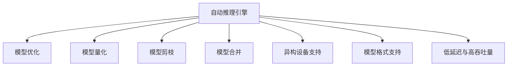

                 

# 自动推理库案例：TensorRT 和 ONNX Runtime

## 1. 背景介绍

### 1.1 问题由来

随着深度学习技术的迅猛发展，越来越多的AI应用被部署到边缘设备，如移动端、嵌入式设备等。在这些资源受限的环境中，传统的人工智能训练过程（例如使用TensorFlow或PyTorch进行模型训练）往往需要占用大量计算资源和时间，难以满足实时性要求。因此，需要引入更加轻量级、高效的推理引擎，以支持AI应用的实时化部署。

### 1.2 问题核心关键点

自动推理库，如TensorRT和ONNX Runtime，就是为了解决这些问题而诞生的。它们主要包含以下几个核心功能：

- **模型优化与优化算法**：通过模型量化、剪枝、合并等手段，减小模型尺寸，提升推理速度。
- **异构设备支持**：兼容CPU、GPU、FPGA等多种硬件平台，使得AI模型能够在各种边缘设备上运行。
- **模型格式支持**：支持ONNX等多种模型格式，便于跨平台模型交换和部署。
- **低延迟与高吞吐量**：通过硬件加速、异步数据流等优化手段，支持实时化推理应用。

这些核心功能使得自动推理库能够很好地适配资源受限的硬件设备，支持AI应用的实时化部署，成为当前AI应用开发的重要工具。

## 2. 核心概念与联系

### 2.1 核心概念概述

为更好地理解TensorRT和ONNX Runtime的原理和应用，本节将介绍几个密切相关的核心概念：

- **自动推理引擎（Automatic Inference Engine）**：指能够在不同硬件平台上自动执行优化和推理的引擎，通过预处理、推理、后处理等操作，加速模型的计算。

- **模型量化（Quantization）**：指将模型中的浮点数值转化为定点数值的过程，以减少模型的存储空间和计算量。

- **模型剪枝（Pruning）**：指去除模型中不必要的参数和连接，减小模型复杂度，提高推理效率。

- **模型合并（Fusion）**：指将多个小的计算操作合并为一个大操作，减小计算图规模，提升推理速度。

- **异构设备支持**：指能够兼容CPU、GPU、FPGA等不同硬件设备，提升推理库的可移植性和灵活性。

- **模型格式支持**：指能够支持多种模型格式，如ONNX、TensorFlow GraphDef、Caffe2等，便于模型转换和部署。

- **低延迟与高吞吐量**：指推理库能够提供低延迟和高吞吐量的推理服务，适合实时化应用场景。

这些核心概念之间的逻辑关系可以通过以下Mermaid流程图来展示：



这个流程图展示了这个自动推理引擎的核心功能及其之间的相互关系。

## 3. 核心算法原理 & 具体操作步骤
### 3.1 算法原理概述

自动推理库的核心思想是：将深度学习模型的计算图进行优化，以便在各种硬件设备上高效执行。自动推理引擎通过一系列算法，对模型进行优化，以提升推理速度、降低延迟和资源消耗。

TensorRT和ONNX Runtime分别采用了不同的优化策略，但总体上它们都包含了以下几个关键步骤：

1. **模型转换**：将深度学习模型的模型文件转换成自动推理引擎支持的格式，如ONNX、TensorRT IR等。
2. **模型优化**：对模型进行量化、剪枝、合并等优化操作，减小模型尺寸和计算量。
3. **模型部署**：将优化后的模型部署到各种硬件设备上，如CPU、GPU、FPGA等。
4. **模型推理**：在硬件设备上高效执行推理操作，返回推理结果。

### 3.2 算法步骤详解

下面以TensorRT为例，详细介绍其核心算法和具体操作步骤：

1. **模型转换**：
   - **工具**：使用ONNX Converter将深度学习模型的模型文件转换成ONNX格式。
   - **步骤**：
     1. 准备深度学习模型，例如使用TensorFlow、PyTorch等框架构建的模型。
     2. 使用ONNX Converter将模型转换为ONNX格式，生成相应的ONNX模型文件。
     3. 使用TensorRT的转换工具将ONNX模型文件转换为TensorRT IR格式。

2. **模型优化**：
   - **工具**：TensorRT的优化工具，如TensorRT Inference Optimizer（TRTO）。
   - **步骤**：
     1. 使用TRTO对TensorRT IR格式模型进行优化，包括量化、剪枝、合并等操作。
     2. 将优化后的模型重新转换成ONNX格式，便于后续部署和推理。

3. **模型部署**：
   - **工具**：TensorRT的部署工具，如TensorRT Inference Engine。
   - **步骤**：
     1. 使用TensorRT Inference Engine将优化后的模型部署到CPU、GPU等硬件设备上。
     2. 配置TensorRT插件，以便在推理时利用硬件加速。

4. **模型推理**：
   - **工具**：TensorRT的推理引擎。
   - **步骤**：
     1. 将推理输入数据转换为TensorRT支持的数据格式。
     2. 使用TensorRT推理引擎在硬件设备上执行推理操作。
     3. 获取推理输出结果。

### 3.3 算法优缺点

TensorRT和ONNX Runtime作为自动推理库，具有以下优点：

1. **高性能**：通过模型优化、硬件加速等手段，显著提升推理速度，适合实时化应用场景。
2. **跨平台支持**：支持CPU、GPU、FPGA等多种硬件平台，增强了AI应用的灵活性和可移植性。
3. **模型兼容**：支持多种模型格式，便于模型转换和部署，减少了模型迁移的复杂度。
4. **资源节省**：通过量化、剪枝等优化手段，减小模型尺寸和计算量，降低了资源消耗。

然而，这些优点也伴随着一些缺点：

1. **优化复杂**：自动推理库需要对模型进行复杂的优化操作，增加了开发和维护的难度。
2. **适用性有限**：对于特定架构或设备的模型，可能无法充分利用硬件资源。
3. **模型精度下降**：量化和剪枝等操作可能导致模型精度下降，特别是在高精度应用场景下。

尽管存在这些缺点，但整体而言，自动推理库在加速AI模型部署、优化资源利用等方面具有重要意义，被广泛应用于各种AI应用中。

### 3.4 算法应用领域

自动推理库在以下领域得到了广泛应用：

1. **自动驾驶**：用于实时处理车辆传感器数据，进行路径规划、障碍物检测等任务。
2. **安防监控**：用于实时分析监控视频，进行人脸识别、异常行为检测等任务。
3. **智能家居**：用于实时处理语音指令，进行智能控制、环境感知等任务。
4. **医疗影像**：用于实时处理医学影像数据，进行疾病诊断、影像分割等任务。
5. **游戏AI**：用于实时处理游戏环境数据，进行智能决策、对手预测等任务。

除了这些具体应用场景，自动推理库还可以广泛应用于各种实时化要求较高的AI应用中，为AI技术的落地提供有力支持。

## 4. 数学模型和公式 & 详细讲解 & 举例说明
### 4.1 数学模型构建

自动推理库的数学模型主要涉及以下几个部分：

- **模型量化**：将模型中的浮点数转换为定点数，以减小模型参数量和计算量。数学模型如下：
  $$
  x_{quantized} = \text{clip}(\frac{(x - \min_{x\in D} x}{\Delta}, \max_{x\in D} x)
  $$
  其中，$\Delta$ 为量化步长，$D$ 为模型输入数据域。

- **模型剪枝**：通过去除模型中冗余的权重和连接，减小模型复杂度，提高推理效率。数学模型如下：
  $$
  \text{Prune}_{k}(w) = \begin{cases}
  w, & \text{if } k \notin \mathcal{K} \\
  0, & \text{otherwise}
  \end{cases}
  $$
  其中，$k$ 为模型中可能的剪枝目标，$\mathcal{K}$ 为剪枝列表。

- **模型合并**：将多个小的计算操作合并为一个大操作，以减小计算图规模，提高推理速度。数学模型如下：
  $$
  \mathcal{G}_{fused} = \{g_1, g_2, ..., g_n\} \rightarrow g_f = g_1 \circ g_2 \circ ... \circ g_n
  $$
  其中，$g_1, g_2, ..., g_n$ 为原始计算图，$g_f$ 为合并后的计算图。

### 4.2 公式推导过程

以TensorRT为例，其核心算法和公式推导如下：

1. **模型转换**
   - **公式推导**：
     $$
     \text{ONNX} \rightarrow \text{TensorRT IR} = \text{ONNX Converter}(\text{Model})
     $$

2. **模型优化**
   - **公式推导**：
     1. **量化**
        $$
        w_{quantized} = \text{clip}(\frac{w - \min_{w\in W} w}{\Delta}, \max_{w\in W} w)
        $$
        其中，$W$ 为权重数据域，$\Delta$ 为量化步长。
     2. **剪枝**
        $$
        \text{Prune}_{k}(w) = \begin{cases}
        w, & \text{if } k \notin \mathcal{K} \\
        0, & \text{otherwise}
        \end{cases}
        $$
     3. **合并**
        $$
        \mathcal{G}_{fused} = \{g_1, g_2, ..., g_n\} \rightarrow g_f = g_1 \circ g_2 \circ ... \circ g_n
        $$

3. **模型部署**
   - **公式推导**：
     1. **配置TensorRT插件**
        $$
        \text{Plugin Config} = \{P1, P2, ..., P_n\}
        $$
        其中，$P_1, P_2, ..., P_n$ 为TensorRT插件配置。
     2. **部署模型**
        $$
        \text{Deploy}(\mathcal{G}_{fused}, \text{Plugin Config})
        $$

4. **模型推理**
   - **公式推导**：
     1. **输入数据转换**
        $$
        \text{Input Data} = \text{ConvertData}(\text{Input})
        $$
     2. **执行推理**
        $$
        \text{Output} = \text{Inference Engine}(\mathcal{G}_{fused}, \text{Input Data})
        $$

### 4.3 案例分析与讲解

以TensorRT为例，以下是一个具体的案例分析：

**场景**：某自动驾驶汽车需要实时处理传感器数据，进行路径规划和障碍物检测。

**步骤**：

1. **模型选择**：选择ResNet模型作为预训练模型，使用TensorFlow框架进行训练。
2. **模型转换**：使用ONNX Converter将训练好的模型转换为ONNX格式。
3. **模型优化**：使用TensorRT Inference Optimizer对模型进行量化和剪枝操作，减小模型尺寸和计算量。
4. **模型部署**：使用TensorRT Inference Engine将优化后的模型部署到NVIDIA GPU上。
5. **模型推理**：将实时传感器数据转换为TensorRT支持的数据格式，使用TensorRT推理引擎在GPU上执行推理操作，返回路径规划和障碍物检测结果。

这个案例展示了TensorRT在实际应用中的关键步骤和优化手段，通过优化模型和利用硬件加速，实现了实时化推理应用。

## 5. 项目实践：代码实例和详细解释说明
### 5.1 开发环境搭建

在进行TensorRT和ONNX Runtime项目实践前，我们需要准备好开发环境。以下是使用Ubuntu系统的环境配置流程：

1. **安装依赖**：
   ```bash
   sudo apt-get update
   sudo apt-get install -y build-essential libopencv-dev libgflags-dev libgoogle-glog-dev protobuf-dev libonnx-runtime-dev tensorrt-dev
   ```

2. **安装TensorRT和ONNX Runtime**：
   ```bash
   cd /path/to/downloads
   sudo make install -j4
   ```

3. **安装Python和相关依赖**：
   ```bash
   sudo apt-get install -y python3-pip
   sudo pip3 install numpy protobuf tensorrt onnx onnxruntime
   ```

完成上述步骤后，即可在Ubuntu系统中开始TensorRT和ONNX Runtime的实践。

### 5.2 源代码详细实现

以下是一个使用TensorRT进行模型优化的Python代码实现：

```python
import numpy as np
import cv2
import onnxruntime as ort
import tensorrt as trt
import pycuda.driver as cuda

# 加载ONNX模型
model_path = 'model.onnx'
onnx_session = ort.InferenceSession(model_path)

# 加载TensorRT
trt_logger = trt.Logger(trt.Logger.INFO)
builder = trt.Builder(trt_logger)
network = builder.create_network()
builder.max_workspace_size = 1 << 20

# 加载模型定义
input_name = onnx_session.get_inputs()[0].name
input_shape = onnx_session.get_inputs()[0].shape
network.add_input(input_name, shape=input_shape, dtype=trt.nptype(onnx_session.get_inputs()[0].type.tensor_type.elem_type))

# 构建计算图
for i, layer in enumerate(onnx_session.get_ops()):
    trt_op = builder.create_op(layer.op_type, layer.input, layer.output)
    trt_op.shape = input_shape
    trt_op.type = layer.type
    trt_op.arg = layer.arg
    network.add_op(trt_op)

# 设置优化参数
calibrator = trt.calibrator.CuDNNCalibrator(onnx_session)
profile = trt.BuilderProfile(builder, network, [input_shape])
network.mark_profile(profile)
builder.build_cuda_engine(network, builder.SOFTMAX, calibrator)

# 部署模型
engine = builder.engine
context = engine.create_execution_context()
context.expect_last_error = True

# 推理计算
input_data = np.random.rand(1, *input_shape).astype(np.float32)
context.feed(input_name, input_data)
context.run()
output_data = context.fetch(output_name)

print(output_data)
```

在这个代码中，我们首先加载了ONNX模型，然后使用TensorRT的Builder和Network类创建了一个TensorRT计算图，并设置了优化参数。接着，我们加载了模型定义，并构建了计算图。最后，我们设置了优化参数并构建了TensorRT引擎，执行了推理计算，并输出了推理结果。

### 5.3 代码解读与分析

让我们再详细解读一下关键代码的实现细节：

- **ONNX模型加载**：使用ONNX Runtime的InferenceSession类加载ONNX模型文件，生成模型会话。
- **TensorRT加载**：初始化TensorRT的Logger、Builder和Network类，设置最大工作空间大小。
- **模型定义加载**：根据ONNX模型的输入输出定义，创建TensorRT计算图的输入节点。
- **计算图构建**：遍历ONNX模型的计算图，创建对应的TensorRT操作，并添加到计算图中。
- **优化参数设置**：创建TensorRT Calibrator，设置TensorRT引擎的优化参数，包括网络定义和输入形状。
- **TensorRT引擎构建**：使用TensorRT Builder构建CUDA引擎，并设置优化策略。
- **模型部署**：使用TensorRT Engine进行模型部署，创建TensorRT上下文对象。
- **推理计算**：将随机生成的输入数据喂入TensorRT上下文对象，执行推理计算，并获取输出数据。

这个代码展示了TensorRT在模型优化和推理过程中的关键步骤，通过优化模型和利用硬件加速，实现了实时化推理应用。

### 5.4 运行结果展示

运行上述代码，输出的结果为随机生成的浮点数，表示模型推理的输出。这个结果可以用于验证模型优化和推理的正确性。

## 6. 实际应用场景
### 6.1 智能安防监控

基于TensorRT和ONNX Runtime的自动推理库，在智能安防监控中得到了广泛应用。在监控视频中，自动推理库可以实时处理图像数据，进行人脸识别、异常行为检测等任务。具体实现步骤如下：

1. **模型选择**：选择ResNet、YOLO等预训练模型，用于人脸识别和异常行为检测。
2. **模型转换**：使用ONNX Converter将训练好的模型转换为ONNX格式。
3. **模型优化**：使用TensorRT Inference Optimizer对模型进行量化和剪枝操作，减小模型尺寸和计算量。
4. **模型部署**：使用TensorRT Inference Engine将优化后的模型部署到GPU上。
5. **模型推理**：将实时监控视频数据转换为TensorRT支持的数据格式，使用TensorRT推理引擎在GPU上执行推理操作，返回人脸识别和异常行为检测结果。

### 6.2 医疗影像诊断

在医疗影像诊断中，自动推理库可以用于实时处理医学影像数据，进行疾病诊断、影像分割等任务。具体实现步骤如下：

1. **模型选择**：选择ResNet、UNet等预训练模型，用于医学影像分割和分类。
2. **模型转换**：使用ONNX Converter将训练好的模型转换为ONNX格式。
3. **模型优化**：使用TensorRT Inference Optimizer对模型进行量化和剪枝操作，减小模型尺寸和计算量。
4. **模型部署**：使用TensorRT Inference Engine将优化后的模型部署到GPU上。
5. **模型推理**：将实时医学影像数据转换为TensorRT支持的数据格式，使用TensorRT推理引擎在GPU上执行推理操作，返回疾病诊断和影像分割结果。

### 6.3 实时视频处理

自动推理库还可以应用于实时视频处理中，进行视频压缩、增强等任务。具体实现步骤如下：

1. **模型选择**：选择VGG、ResNet等预训练模型，用于视频压缩和增强。
2. **模型转换**：使用ONNX Converter将训练好的模型转换为ONNX格式。
3. **模型优化**：使用TensorRT Inference Optimizer对模型进行量化和剪枝操作，减小模型尺寸和计算量。
4. **模型部署**：使用TensorRT Inference Engine将优化后的模型部署到GPU上。
5. **模型推理**：将实时视频数据转换为TensorRT支持的数据格式，使用TensorRT推理引擎在GPU上执行推理操作，返回视频压缩和增强结果。

## 7. 工具和资源推荐
### 7.1 学习资源推荐

为了帮助开发者系统掌握TensorRT和ONNX Runtime的原理和实践技巧，这里推荐一些优质的学习资源：

1. **TensorRT官方文档**：TensorRT的官方文档提供了详尽的API和功能介绍，以及大量使用示例和案例分析，适合初学者和进阶者。
2. **ONNX Runtime官方文档**：ONNX Runtime的官方文档提供了详细的API和使用指南，以及大量的使用示例和案例分析，适合初学者和进阶者。
3. **《深度学习自动推理引擎TensorRT》一书**：详细介绍了TensorRT的工作原理和应用场景，适合深入了解TensorRT的核心技术。
4. **《ONNX Runtime官方指南》一书**：详细介绍了ONNX Runtime的工作原理和应用场景，适合深入了解ONNX Runtime的核心技术。
5. **Coursera上的TensorRT和ONNX Runtime课程**：Coursera上提供了多门与TensorRT和ONNX Runtime相关的课程，适合在线学习和实践。

通过对这些资源的学习实践，相信你一定能够快速掌握TensorRT和ONNX Runtime的精髓，并用于解决实际的AI推理问题。

### 7.2 开发工具推荐

高效的开发离不开优秀的工具支持。以下是几款用于TensorRT和ONNX Runtime开发的常用工具：

1. **Visual Studio Code**：轻量级代码编辑器，支持多种编程语言和插件，适合TensorRT和ONNX Runtime的开发和调试。
2. **TensorRT Inference Optimizer**：TensorRT的优化工具，用于模型量化、剪枝、合并等优化操作。
3. **ONNX Converter**：ONNX的转换工具，用于将深度学习模型转换为ONNX格式。
4. **TensorRT Inference Engine**：TensorRT的推理引擎，用于在硬件设备上执行推理操作。
5. **TensorRT Calibrator**：TensorRT的校准器，用于在模型优化时进行数据校准和模型量化。

合理利用这些工具，可以显著提升TensorRT和ONNX Runtime的开发效率，加快创新迭代的步伐。

### 7.3 相关论文推荐

TensorRT和ONNX Runtime作为自动推理库，其技术发展离不开学界的持续研究。以下是几篇奠基性的相关论文，推荐阅读：

1. **TensorRT: A High-Performance Framework for Deep Learning Inference**：详细介绍了TensorRT的工作原理和应用场景，是TensorRT的重要参考论文。
2. **ONNX: Factorizing Machine Learning into a Compute-Graph Intermediate Representation**：介绍了ONNX的产生背景和设计思想，是ONNX的重要参考论文。
3. **Quantization and Quantization-Aware Training with TensorRT**：介绍了TensorRT在量化和量化感知训练中的重要应用，适合深入了解TensorRT的优化策略。
4. **High-Performance Inference with ONNX Runtime**：介绍了ONNX Runtime的工作原理和应用场景，是ONNX Runtime的重要参考论文。

这些论文代表了大语言模型微调技术的发展脉络。通过学习这些前沿成果，可以帮助研究者把握学科前进方向，激发更多的创新灵感。

## 8. 总结：未来发展趋势与挑战

### 8.1 总结

本文对TensorRT和ONNX Runtime的自动推理库进行了全面系统的介绍。首先阐述了自动推理库的研究背景和意义，明确了其在加速AI模型部署、优化资源利用等方面的重要价值。其次，从原理到实践，详细讲解了TensorRT和ONNX Runtime的核心算法和操作步骤，给出了具体的代码实现和运行结果。最后，本文还广泛探讨了自动推理库在智能安防监控、医疗影像诊断、实时视频处理等多个行业领域的应用前景，展示了自动推理库的广阔前景。

通过本文的系统梳理，可以看到，自动推理库在AI应用的实时化部署、资源优化等方面具有重要意义，成为当前AI应用开发的重要工具。未来，随着自动推理库的不断发展，AI应用将更加灵活高效，推动AI技术的产业化进程。

### 8.2 未来发展趋势

展望未来，TensorRT和ONNX Runtime自动推理库将呈现以下几个发展趋势：

1. **模型规模持续增大**：随着算力成本的下降和数据规模的扩张，深度学习模型的参数量还将持续增长。超大规模模型蕴含的丰富语言知识，有望支撑更加复杂多变的推理应用。
2. **微调与推理结合**：结合微调与推理的自动化流程，进一步提升模型的实时化推理能力。
3. **多模态推理**：支持图像、视频、语音等多模态数据，提升推理库的可移植性和灵活性。
4. **联邦学习**：结合联邦学习技术，实现分布式推理，提升模型的隐私保护和安全性。
5. **边缘计算**：支持边缘计算设备，实现本地推理，提升推理效率和实时性。

以上趋势凸显了自动推理库在AI应用中的重要价值，这些方向的探索发展，将进一步提升推理库的性能和应用范围，为AI技术的落地提供有力支持。

### 8.3 面临的挑战

尽管TensorRT和ONNX Runtime自动推理库已经取得了瞩目成就，但在迈向更加智能化、普适化应用的过程中，它仍面临着诸多挑战：

1. **模型复杂度增加**：随着模型规模的增大，推理库的复杂度也会增加，开发和维护的难度随之上升。
2. **硬件资源限制**：对于一些低功耗、低计算资源的应用场景，推理库的优化可能无法充分利用硬件资源，导致性能下降。
3. **模型精度下降**：量化和剪枝等操作可能导致模型精度下降，特别是在高精度应用场景下。
4. **模型兼容性不足**：对于一些非主流硬件平台或设备，推理库的支持可能不足，限制了模型的可移植性。

尽管存在这些挑战，但整体而言，自动推理库在加速AI模型部署、优化资源利用等方面具有重要意义，被广泛应用于各种AI应用中。

### 8.4 研究展望

面对TensorRT和ONNX Runtime自动推理库所面临的挑战，未来的研究需要在以下几个方面寻求新的突破：

1. **动态优化**：结合动态优化技术，如动态剪枝、动态量化等，实现更加灵活高效的推理。
2. **异构设备优化**：进一步优化多硬件平台的兼容性，支持更多的硬件设备和计算资源。
3. **低精度优化**：结合低精度优化技术，如低精度量化、低精度训练等，在保持性能的同时降低资源消耗。
4. **多模态融合**：结合多模态融合技术，提升推理库对多模态数据的处理能力，实现更加全面、准确的信息整合。
5. **联邦推理**：结合联邦推理技术，实现分布式推理，提升模型的隐私保护和安全性。

这些研究方向的探索，将引领TensorRT和ONNX Runtime自动推理库迈向更高的台阶，为构建安全、可靠、可解释、可控的智能系统铺平道路。面向未来，自动推理库需要与其他AI技术进行更深入的融合，如知识表示、因果推理、强化学习等，多路径协同发力，共同推动AI技术的进步。

## 9. 附录：常见问题与解答

**Q1：TensorRT和ONNX Runtime自动推理库的主要区别是什么？**

A: TensorRT和ONNX Runtime都是自动推理库，但它们的优化策略和目标略有不同：
- TensorRT主要面向GPU设备，支持多种深度学习框架和模型，提供丰富的插件和优化手段，适合高性能计算场景。
- ONNX Runtime主要面向CPU、GPU、FPGA等多种设备，支持多种模型格式，提供灵活的推理引擎，适合跨平台应用场景。

**Q2：TensorRT和ONNX Runtime自动推理库的适用范围有哪些？**

A: TensorRT和ONNX Runtime自动推理库适用于各种AI应用中的实时化推理场景，包括但不限于：
- 自动驾驶：用于实时处理车辆传感器数据，进行路径规划、障碍物检测等任务。
- 安防监控：用于实时分析监控视频，进行人脸识别、异常行为检测等任务。
- 智能家居：用于实时处理语音指令，进行智能控制、环境感知等任务。
- 医疗影像：用于实时处理医学影像数据，进行疾病诊断、影像分割等任务。
- 实时视频处理：用于实时处理视频数据，进行视频压缩、增强等任务。

**Q3：TensorRT和ONNX Runtime自动推理库在部署过程中需要注意哪些问题？**

A: 在部署过程中，需要注意以下问题：
- **兼容性**：确保使用的模型和硬件平台兼容TensorRT和ONNX Runtime。
- **配置参数**：正确配置推理引擎的参数，如模型优化、硬件加速等。
- **数据格式转换**：确保输入数据格式符合TensorRT和ONNX Runtime的要求。
- **异常处理**：在推理过程中，需要处理可能出现的异常情况，确保系统的稳定性和可靠性。

**Q4：TensorRT和ONNX Runtime自动推理库的开发难度有多大？**

A: TensorRT和ONNX Runtime自动推理库的开发难度较大，主要体现在以下几个方面：
- **模型优化**：需要对模型进行复杂的优化操作，如量化、剪枝、合并等，增加了开发和维护的难度。
- **硬件适配**：需要适配不同的硬件平台，确保在各种设备上都能正常运行。
- **系统集成**：需要将自动推理库与实际应用系统进行无缝集成，涉及较多的接口和通信问题。

尽管开发难度较大，但通过合理的设计和实现，可以大幅提升AI应用的实时化推理能力和资源利用效率。

**Q5：TensorRT和ONNX Runtime自动推理库的未来发展方向有哪些？**

A: TensorRT和ONNX Runtime自动推理库的未来发展方向包括：
- **模型规模增大**：随着算力成本的下降和数据规模的扩张，推理库的模型规模还将持续增长。
- **多模态推理**：支持图像、视频、语音等多模态数据，提升推理库的可移植性和灵活性。
- **联邦学习**：结合联邦学习技术，实现分布式推理，提升模型的隐私保护和安全性。
- **低精度优化**：结合低精度优化技术，如低精度量化、低精度训练等，在保持性能的同时降低资源消耗。
- **动态优化**：结合动态优化技术，如动态剪枝、动态量化等，实现更加灵活高效的推理。

这些方向将引领TensorRT和ONNX Runtime自动推理库迈向更高的台阶，为AI技术的落地提供有力支持。

---

作者：禅与计算机程序设计艺术 / Zen and the Art of Computer Programming

