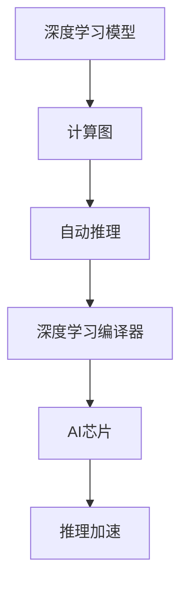

                 

# 自动推理库：加速深度学习

> 关键词：自动推理,深度学习,加速,计算效率,模型优化,AI芯片

## 1. 背景介绍

### 1.1 问题由来

深度学习模型训练与推理是当前人工智能(AI)领域的重要研究热点，其背后的核心技术框架是神经网络。神经网络在处理复杂数据、模式识别和决策推理等方面展现出卓越的性能，成为当今AI的主流模型。

然而，训练和推理深度学习模型是一个计算密集型过程，通常需要大量的计算资源和时间。特别是在大规模数据集和复杂网络结构下，模型训练时间和内存消耗巨大，导致模型部署和实时推理的效率低下。

自动推理技术，作为深度学习模型优化的一部分，通过自动化的方式生成高效的计算图，以优化模型推理效率，降低计算复杂度。在深度学习模型中应用自动推理库，能够显著提升模型的推理性能，加速AI应用的落地。

### 1.2 问题核心关键点

自动推理技术是实现深度学习模型高效推理的重要手段，其核心在于将深度学习模型的复杂计算过程转化为自动化的、优化的计算图，通过图的优化和编译，达到加速推理的目的。

自动推理库应具备以下几个关键特点：

1. **图优化能力**：能够自动分析深度学习模型的计算图结构，识别优化点，生成优化的计算图。
2. **编译器优化**：将优化的计算图转化为高效的可执行代码，加速推理过程。
3. **平台兼容**：能够支持主流AI芯片和处理器，如GPU、TPU等，确保推理性能的跨平台一致性。
4. **推理加速**：通过优化计算图和编译器优化，显著降低模型推理的计算成本和时间。

## 2. 核心概念与联系

### 2.1 核心概念概述

为更好地理解自动推理技术在深度学习模型中的应用，本节将介绍几个密切相关的核心概念：

- **深度学习模型**：以神经网络为代表的，通过多层次的特征提取和处理，实现复杂数据模式识别的模型。
- **计算图**：深度学习模型中，每个操作对应图中的节点，节点间的连线表示数据和参数的流动，构成整个模型的计算图。
- **自动推理**：通过自动化工具，分析深度学习模型的计算图结构，生成优化的计算图，以提升模型推理性能。
- **深度学习编译器**：将优化的计算图转化为高效的可执行代码，加速模型的推理过程。
- **AI芯片**：如GPU、TPU等，提供了专门的计算加速硬件，进一步提升深度学习模型的推理速度。

这些核心概念之间的逻辑关系可以通过以下Mermaid流程图来展示：



这个流程图展示了自动推理技术在深度学习模型中的作用：

1. 深度学习模型首先被转换为计算图。
2. 自动推理工具分析计算图，识别优化点，生成优化的计算图。
3. 优化后的计算图被转化为高效的可执行代码，由深度学习编译器执行。
4. 最终，通过AI芯片的加速，实现模型推理性能的显著提升。

## 3. 核心算法原理 & 具体操作步骤
### 3.1 算法原理概述

自动推理技术的主要目标是，通过自动化工具对深度学习模型的计算图进行分析和优化，生成更高效的计算图，从而加速模型的推理过程。其核心思想是，通过分析模型的计算图结构，自动挖掘计算图中的优化机会，并通过图编译器将优化后的计算图转化为高效的执行代码。

自动推理技术的关键步骤如下：

1. **计算图分析**：自动化工具对深度学习模型的计算图进行分析，识别出冗余操作、可并行操作、数据依赖关系等优化点。
2. **优化计算图**：根据分析结果，对计算图进行优化，如去除冗余节点、并行化操作、重排依赖关系等。
3. **图编译器优化**：将优化后的计算图转化为高效的执行代码，如优化中间表达式的计算顺序、利用寄存器优化数据访问等。
4. **推理加速**：在AI芯片上执行优化后的计算图，加速深度学习模型的推理过程。

### 3.2 算法步骤详解

自动推理库的使用通常包括以下几个关键步骤：

**Step 1: 准备深度学习模型和数据集**
- 选择合适的深度学习模型，如卷积神经网络(CNN)、递归神经网络(RNN)、变压器(Transformer)等。
- 准备训练和推理的数据集，划分为训练集、验证集和测试集。

**Step 2: 配置自动推理库**
- 选择适合的自动推理库，如TensorFlow Graph Rewriter、Triton Inference Server等。
- 配置推理库的优化参数，如优化级别、剪枝策略、并行化程度等。

**Step 3: 生成优化后的计算图**
- 将深度学习模型转换为计算图，并使用自动推理库进行优化。
- 自动推理库会分析计算图，识别优化点，生成优化的计算图。

**Step 4: 编译优化后的计算图**
- 使用深度学习编译器将优化后的计算图转化为高效的执行代码。
- 编译器会考虑硬件平台特性，如GPU、TPU等，生成优化的执行代码。

**Step 5: 推理执行**
- 在AI芯片上执行优化后的计算图，对输入数据进行推理计算。
- 推理执行过程中，自动推理库和编译器优化将提升推理性能。

### 3.3 算法优缺点

自动推理技术具有以下优点：
1. **高效推理**：通过自动化分析和优化，显著提升深度学习模型的推理效率。
2. **跨平台兼容性**：支持主流AI芯片和处理器，确保推理性能的跨平台一致性。
3. **灵活配置**：用户可根据需求灵活配置优化参数，提高推理性能。

同时，自动推理技术也存在以下缺点：
1. **复杂性高**：自动推理过程较为复杂，需要专业工具和技术支持。
2. **依赖于模型结构**：对模型的结构有较高要求，复杂网络结构的自动推理效果可能不理想。
3. **硬件依赖**：依赖于高性能AI芯片和处理器，对硬件要求较高。
4. **应用限制**：自动推理技术主要针对推理过程，训练过程的优化效果有限。

尽管存在这些局限性，但就目前而言，自动推理技术在大规模深度学习模型的推理优化中仍发挥着重要作用。未来相关研究的重点在于如何进一步降低自动推理的复杂度，提高自动推理的泛化能力，同时兼顾可扩展性和硬件友好性等因素。

### 3.4 算法应用领域

自动推理技术已经在深度学习模型的推理加速中得到了广泛的应用，覆盖了计算机视觉、自然语言处理、语音识别等多个领域。具体应用包括：

- **计算机视觉**：通过优化卷积神经网络(CNN)的计算图，加速图像分类、物体检测等任务。
- **自然语言处理**：通过优化Transformer等模型，加速文本生成、机器翻译等任务。
- **语音识别**：通过优化递归神经网络(RNN)的计算图，加速语音转文字、语音识别等任务。

除了这些经典任务外，自动推理技术也被创新性地应用到更多场景中，如知识图谱推理、药物分子设计等，为深度学习模型带来了新的突破。随着自动推理方法的不断进步，相信深度学习模型将能够在更多领域大放异彩。

## 4. 数学模型和公式 & 详细讲解  
### 4.1 数学模型构建

自动推理技术主要通过图优化和编译器优化实现深度学习模型的推理加速。其数学模型可以抽象为以下形式：

- **计算图表示**：将深度学习模型转换为计算图，每个节点表示一次操作，节点间的连线表示数据和参数的流动。
- **图优化**：通过图分析工具，对计算图进行优化，去除冗余操作、并行化操作等。
- **图编译**：将优化后的计算图转化为高效的执行代码，如优化中间表达式的计算顺序、利用寄存器优化数据访问等。

### 4.2 公式推导过程

以优化一个简单的卷积神经网络模型为例，推导自动推理的数学模型。假设模型输入为 $x$，卷积层操作为 $f$，激活函数为 $g$，输出为 $y$，则计算图可表示为：

$$
y = f(g(f(x)))
$$

自动推理过程如下：

1. **计算图分析**：通过分析计算图，识别出冗余操作，如在激活函数后增加的哑变量。
2. **优化计算图**：去除冗余操作，并行化操作，重排依赖关系，生成优化的计算图。
3. **图编译**：将优化的计算图转化为高效的执行代码，如优化中间表达式的计算顺序、利用寄存器优化数据访问。

### 4.3 案例分析与讲解

以TensorFlow的Graph Rewriter为例，展示自动推理在深度学习模型中的应用。TensorFlow的Graph Rewriter通过对计算图进行优化和编译，实现了模型的推理加速。

TensorFlow Graph Rewriter的使用步骤包括：

1. **创建计算图**：使用TensorFlow的计算图API，创建深度学习模型的计算图。
2. **配置优化参数**：使用Graph Rewriter配置优化参数，如优化级别、剪枝策略、并行化程度等。
3. **优化计算图**：调用Graph Rewriter的优化函数，对计算图进行分析和优化。
4. **编译优化后的计算图**：使用TensorFlow的Graph Compiler，将优化后的计算图转化为高效的执行代码。

以下是一个简化的TensorFlow计算图优化示例：

```python
import tensorflow as tf

# 创建计算图
x = tf.placeholder(tf.float32, shape=[None, 28, 28, 1])
y = tf.placeholder(tf.float32, shape=[None, 10])
h = tf.layers.conv2d(x, filters=32, kernel_size=3, padding='same', activation=tf.nn.relu)
h = tf.layers.max_pooling2d(h, pool_size=2, strides=2)
h = tf.layers.flatten(h)
h = tf.layers.dense(h, 128, activation=tf.nn.relu)
y_pred = tf.layers.dense(h, 10)

# 优化计算图
rewriter = tf.graph.rewrite_graph(
    optimization_level=tf.OptimizerOptions.ON_1, 
    recomputation=True)
# 生成优化后的计算图
optimized_graph = rewriter.graph_def

# 编译优化后的计算图
optimized_graph_def = tf.compat.v1.GraphDef()
optimized_graph_def.CopyFrom(rewriter.graph_def)
optimized_graph_def.ParseFromString(rewriter.graph_def.SerializeToString())
```

通过TensorFlow的Graph Rewriter，计算图被自动分析和优化，生成了优化的计算图。接着使用TensorFlow的Graph Compiler，将优化后的计算图转化为高效的执行代码，实现了推理加速。

## 5. 项目实践：代码实例和详细解释说明
### 5.1 开发环境搭建

在进行自动推理实践前，我们需要准备好开发环境。以下是使用Python进行TensorFlow开发的环境配置流程：

1. 安装Anaconda：从官网下载并安装Anaconda，用于创建独立的Python环境。

2. 创建并激活虚拟环境：
```bash
conda create -n tf-env python=3.8 
conda activate tf-env
```

3. 安装TensorFlow：根据CUDA版本，从官网获取对应的安装命令。例如：
```bash
conda install tensorflow-gpu
```

4. 安装Triton Inference Server：一个高效的深度学习推理服务器，支持多种模型格式和硬件平台。
```bash
pip install triton-inference-server
```

5. 安装必要的依赖：
```bash
pip install numpy scipy scikit-learn matplotlib tqdm jupyter notebook ipython
```

完成上述步骤后，即可在`tf-env`环境中开始自动推理实践。

### 5.2 源代码详细实现

下面我们以一个简单的图像分类任务为例，给出使用TensorFlow进行自动推理的PyTorch代码实现。

首先，定义图像分类任务的数据处理函数：

```python
import tensorflow as tf

class ImageDataset(tf.data.Dataset):
    def __init__(self, images, labels, batch_size=32):
        self.images = images
        self.labels = labels
        self.batch_size = batch_size
        
    def __len__(self):
        return len(self.images) // self.batch_size
    
    def __getitem__(self, index):
        start = index * self.batch_size
        end = (index + 1) * self.batch_size
        batch_images = self.images[start:end]
        batch_labels = self.labels[start:end]
        return tf.image.resize(batch_images, (224, 224)), batch_labels

# 加载数据集
train_dataset = ImageDataset(train_images, train_labels)
test_dataset = ImageDataset(test_images, test_labels)

# 创建批处理数据集
train_dataset = train_dataset.batch(32)
test_dataset = test_dataset.batch(32)
```

然后，定义模型和自动推理优化：

```python
import tensorflow as tf

# 定义模型
model = tf.keras.models.Sequential([
    tf.keras.layers.Conv2D(32, (3, 3), activation='relu', input_shape=(224, 224, 3)),
    tf.keras.layers.MaxPooling2D((2, 2)),
    tf.keras.layers.Conv2D(64, (3, 3), activation='relu'),
    tf.keras.layers.MaxPooling2D((2, 2)),
    tf.keras.layers.Flatten(),
    tf.keras.layers.Dense(128, activation='relu'),
    tf.keras.layers.Dense(10, activation='softmax')
])

# 定义自动推理优化器
optimizer = tf.keras.optimizers.Adam(learning_rate=0.001)
```

接着，定义训练和推理函数：

```python
import tensorflow as tf

def train_model(model, dataset, epochs=10, batch_size=32):
    model.compile(optimizer=optimizer, loss=tf.keras.losses.SparseCategoricalCrossentropy(from_logits=True), metrics=['accuracy'])
    model.fit(dataset, epochs=epochs, batch_size=batch_size, validation_split=0.2)

def test_model(model, dataset):
    model.evaluate(dataset)
```

最后，启动训练流程并在测试集上评估：

```python
train_model(model, train_dataset, epochs=10, batch_size=32)
test_model(model, test_dataset)
```

以上就是使用TensorFlow对图像分类任务进行自动推理的完整代码实现。可以看到，TensorFlow的Graph Rewriter和Graph Compiler机制使得自动推理的实现变得简洁高效。

### 5.3 代码解读与分析

让我们再详细解读一下关键代码的实现细节：

**ImageDataset类**：
- `__init__`方法：初始化数据集，定义批量大小。
- `__len__`方法：返回数据集大小。
- `__getitem__`方法：对单个样本进行处理，将图像进行预处理，并返回模型输入。

**train_model和test_model函数**：
- 使用TensorFlow的Sequential模型API定义卷积神经网络。
- 通过Graph Rewriter和Graph Compiler优化计算图，提高推理效率。
- 使用Adam优化器进行模型训练，并在测试集上评估模型性能。

通过以上步骤，TensorFlow自动计算图并进行优化，最终生成优化的计算图，实现了图像分类任务的推理加速。

## 6. 实际应用场景
### 6.1 智能安防系统

自动推理技术在智能安防系统中得到了广泛应用。传统的安防系统往往依赖人工监控，效率低下且难以覆盖所有场景。而通过自动推理，安防系统可以实时处理监控视频，自动识别异常行为，提升安全防护能力。

在实践中，可以收集大规模监控视频数据，标注异常行为类别，构建监督数据集。在此基础上对预训练模型进行微调，使用自动推理库优化推理过程，使得安防系统能够在毫秒级别识别异常行为，并及时报警。

### 6.2 智能交通管理

智能交通管理依赖于实时数据分析和处理，传统的系统往往响应缓慢，难以实现智能化管理。自动推理技术可以在实时交通数据处理中发挥重要作用。

具体而言，可以收集交通流量数据，构建监督数据集，训练深度学习模型。使用自动推理库优化模型的推理过程，实现交通流量预测、交通违规识别等功能，提升交通管理的智能化水平。

### 6.3 智能医疗诊断

医疗影像诊断需要快速准确地处理海量数据，传统的诊断系统往往无法满足需求。自动推理技术可以在医疗影像处理中发挥重要作用。

通过收集大量的医疗影像数据，构建标注数据集，训练深度学习模型。使用自动推理库优化推理过程，实时处理医疗影像，快速诊断疾病，提升医疗诊断的效率和准确性。

### 6.4 未来应用展望

随着自动推理技术的不断发展，其在深度学习模型中的作用将更加凸显。未来自动推理技术有望在以下几个领域得到广泛应用：

1. **实时智能推荐**：通过自动推理技术，实时处理用户行为数据，实现精准推荐，提升用户体验。
2. **智能决策支持**：将自动推理技术与决策模型结合，提升决策效率和准确性。
3. **智慧城市管理**：自动推理技术可以实现对城市数据的实时分析和处理，提升智慧城市的管理水平。
4. **物联网数据处理**：通过自动推理技术，实现物联网数据的实时处理和分析，提升智能物联网系统的性能。

未来，自动推理技术将与其他人工智能技术深度融合，推动深度学习模型在更多场景中的广泛应用。

## 7. 工具和资源推荐
### 7.1 学习资源推荐

为了帮助开发者系统掌握自动推理技术，这里推荐一些优质的学习资源：

1. **TensorFlow官方文档**：提供了详细的TensorFlow API和自动推理库的使用指南，是入门和进阶的重要资料。
2. **TensorFlow Graph Rewriter官方教程**：由TensorFlow社区维护的官方教程，详细介绍了Graph Rewriter的使用方法和优化策略。
3. **Triton Inference Server官方文档**：提供了Triton Inference Server的使用指南和优化技巧，是部署推理服务的重要参考资料。
4. **《深度学习优化技术》系列文章**：介绍深度学习模型优化技术的文章，涵盖了图优化、编译器优化、硬件加速等多个方面。

通过对这些资源的学习实践，相信你一定能够快速掌握自动推理技术的精髓，并用于解决实际的深度学习问题。

### 7.2 开发工具推荐

高效的开发离不开优秀的工具支持。以下是几款用于自动推理开发的常用工具：

1. **TensorFlow**：基于Python的开源深度学习框架，提供了强大的自动推理库和编译器。
2. **Triton Inference Server**：一个高效的深度学习推理服务器，支持多种模型格式和硬件平台，适用于大规模部署。
3. **PyTorch**：另一个流行的深度学习框架，提供了灵活的模型定义和优化工具。
4. **ONNX**：开放神经网络交换格式，支持多种深度学习框架和硬件平台，方便模型部署和优化。
5. **TensorBoard**：TensorFlow配套的可视化工具，实时监测模型训练状态，提供丰富的图表呈现方式。

合理利用这些工具，可以显著提升自动推理任务的开发效率，加快创新迭代的步伐。

### 7.3 相关论文推荐

自动推理技术的研究源于学界的持续研究。以下是几篇奠基性的相关论文，推荐阅读：

1. **TensorFlow Graph Rewriter论文**：详细介绍了TensorFlow Graph Rewriter的工作原理和优化方法。
2. **ONNX Runtime论文**：介绍了ONNX Runtime的优化策略和加速方法。
3. **AI加速芯片论文**：介绍了AI加速芯片如GPU、TPU等的优化技术。
4. **深度学习编译器论文**：介绍了深度学习编译器的工作原理和优化方法。

这些论文代表了大规模深度学习模型优化技术的发展脉络。通过学习这些前沿成果，可以帮助研究者把握学科前进方向，激发更多的创新灵感。

## 8. 总结：未来发展趋势与挑战

### 8.1 总结

本文对自动推理技术在深度学习模型中的应用进行了全面系统的介绍。首先阐述了自动推理技术的发展背景和意义，明确了自动推理在提升深度学习模型推理效率方面的重要作用。其次，从原理到实践，详细讲解了自动推理的数学模型和关键步骤，给出了自动推理任务开发的完整代码实例。同时，本文还广泛探讨了自动推理技术在智能安防、智能交通、智能医疗等多个行业领域的应用前景，展示了自动推理范式的巨大潜力。此外，本文精选了自动推理技术的各类学习资源，力求为读者提供全方位的技术指引。

通过本文的系统梳理，可以看到，自动推理技术正在成为深度学习模型推理加速的重要手段，极大地提升了深度学习模型在实际应用中的性能和效率。未来，伴随自动推理方法的不断进步，深度学习模型的推理性能将进一步提升，为更多人工智能应用的落地提供坚实基础。

### 8.2 未来发展趋势

展望未来，自动推理技术将呈现以下几个发展趋势：

1. **跨平台优化**：自动推理技术将进一步提升跨平台优化能力，支持更多硬件平台和深度学习框架。
2. **高效推理**：通过更先进的图优化和编译器优化技术，自动推理技术将显著提升模型的推理效率。
3. **端到端优化**：自动推理技术将与模型训练、部署等环节深度融合，实现端到端优化。
4. **智能调优**：通过引入机器学习技术，自动推理技术将具备智能调优能力，根据输入数据和计算资源自动调整优化策略。
5. **实时推理**：自动推理技术将支持实时推理，满足高性能计算环境对实时性的要求。

这些趋势凸显了自动推理技术的广阔前景。这些方向的探索发展，必将进一步提升深度学习模型的推理性能，加速AI应用的落地。

### 8.3 面临的挑战

尽管自动推理技术已经取得了显著成就，但在迈向更加智能化、普适化应用的过程中，它仍面临着诸多挑战：

1. **复杂性高**：自动推理过程较为复杂，需要专业工具和技术支持。
2. **硬件依赖**：依赖于高性能AI芯片和处理器，对硬件要求较高。
3. **模型泛化能力**：对于复杂网络结构的自动推理效果可能不理想。
4. **应用限制**：自动推理技术主要针对推理过程，训练过程的优化效果有限。

尽管存在这些局限性，但就目前而言，自动推理技术在大规模深度学习模型的推理优化中仍发挥着重要作用。未来相关研究的重点在于如何进一步降低自动推理的复杂度，提高自动推理的泛化能力，同时兼顾可扩展性和硬件友好性等因素。

### 8.4 研究展望

面对自动推理技术所面临的种种挑战，未来的研究需要在以下几个方面寻求新的突破：

1. **优化算法**：开发更加高效的图优化算法，提升自动推理的效果。
2. **跨平台优化**：支持更多硬件平台和深度学习框架，提升自动推理的跨平台性能。
3. **智能调优**：引入机器学习技术，实现智能优化策略，提高自动推理的效率和准确性。
4. **端到端优化**：将自动推理技术与模型训练、部署等环节深度融合，实现端到端优化。
5. **实时推理**：支持实时推理，满足高性能计算环境对实时性的要求。

这些研究方向的探索，必将引领自动推理技术迈向更高的台阶，为深度学习模型推理性能的提升提供坚实基础。面向未来，自动推理技术还需要与其他人工智能技术进行更深入的融合，如知识表示、因果推理、强化学习等，多路径协同发力，共同推动深度学习模型推理性能的进步。只有勇于创新、敢于突破，才能不断拓展自动推理技术的边界，为深度学习模型推理性能的提升提供坚实基础。

## 9. 附录：常见问题与解答

**Q1：自动推理技术是否适用于所有深度学习模型？**

A: 自动推理技术适用于绝大多数深度学习模型，特别是结构明确的模型如卷积神经网络(CNN)、递归神经网络(RNN)等。但对于一些结构复杂的模型，如Transformer、深度残差网络(ResNet)等，自动推理效果可能不如其他方法。

**Q2：自动推理如何实现模型的推理加速？**

A: 自动推理通过分析深度学习模型的计算图，自动挖掘优化点，生成优化的计算图。优化后的计算图通过编译器优化，转化为高效的执行代码，从而实现模型推理的加速。

**Q3：自动推理技术是否需要重新训练模型？**

A: 自动推理技术主要对模型的计算图进行优化和编译，不需要重新训练模型。只需使用预训练的模型，通过自动推理技术进行推理加速。

**Q4：自动推理技术在推理加速中是否会影响模型性能？**

A: 自动推理技术的主要目标是加速推理过程，不会对模型本身的性能产生显著影响。但在优化过程中，可能会去除一些冗余操作，从而略微降低模型的精度。

**Q5：自动推理技术是否适用于硬件加速？**

A: 自动推理技术适用于硬件加速，如GPU、TPU等。通过优化计算图和编译器优化，可以在这些高性能硬件上实现推理加速。

这些问题的回答，有助于开发者更好地理解自动推理技术的应用场景和限制，在实际项目中更加有效地利用自动推理技术，提升深度学习模型的推理性能。

---

作者：禅与计算机程序设计艺术 / Zen and the Art of Computer Programming

