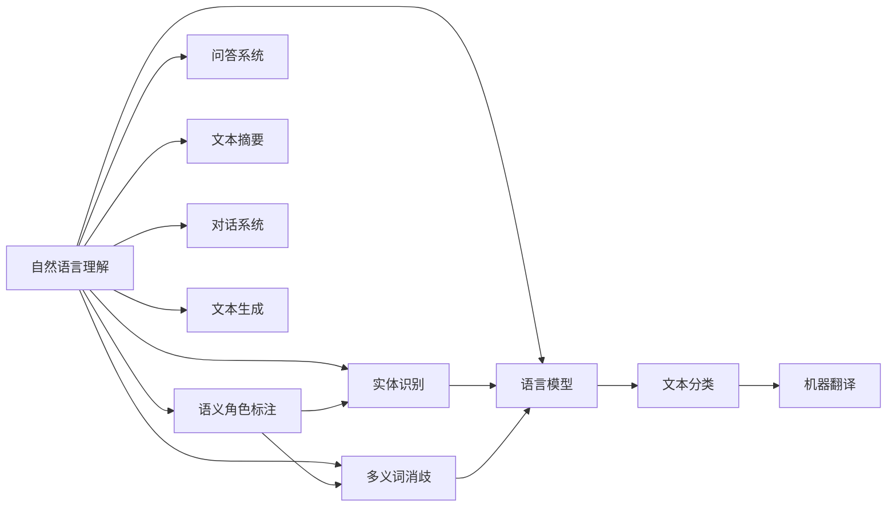
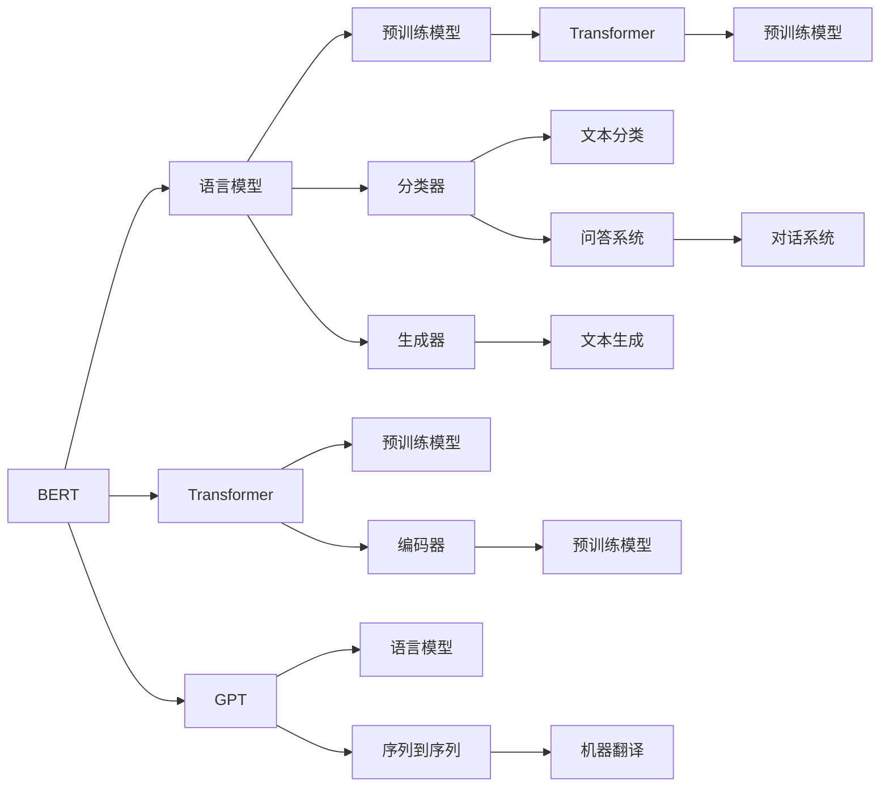

                 

# 自然语言处理的前沿：超越传统的语言理解

## 1. 背景介绍

### 1.1 问题由来
自然语言处理(Natural Language Processing, NLP)作为人工智能的核心分支，在过去几十年中取得了显著的进步。传统的NLP方法主要依赖于基于规则的语法和词汇表，但这种方法往往依赖于人类工程师的直觉和经验，难以处理复杂的语义和上下文关系。近年来，基于深度学习的端到端模型开始崭露头角，尤其是基于神经网络的模型在语言理解、语言生成等方面取得了突破性进展。

然而，即使是最先进的神经网络模型，在面对真实世界的自然语言时，仍然存在许多挑战。例如，多义词、歧义、实体识别、语义角色标注等问题。此外，由于不同语言的语法结构和词汇差异，跨语言理解和翻译也一直是NLP领域的难点。

针对这些挑战，前沿研究不断涌现，推动自然语言处理技术的进步，使其能够更深入地理解人类语言，解决更多实际问题。本文旨在梳理和探讨这些前沿技术，展示自然语言处理技术的最新进展和未来趋势。

### 1.2 问题核心关键点
目前，自然语言处理的前沿研究主要集中在以下几个关键点上：

- 预训练语言模型(Pre-trained Language Models)：如BERT、GPT、XLNet等，通过大规模语料预训练，学习语言的通用表征。这些模型能够显著提升下游任务的表现。
- 端到端学习(End-to-End Learning)：直接从原始文本数据中学习任务的模型，避免人工特征工程，提高模型的泛化能力。
- 自监督学习(Self-Supervised Learning)：利用无标签数据进行预训练，学习语言的知识，同时避免对标注数据的依赖。
- 跨语言学习(Cross-Language Learning)：解决多语言问题，提升不同语言的理解和生成能力。
- 零样本学习(Zero-Shot Learning)和少样本学习(Few-Shot Learning)：在缺少标注数据的情况下，模型仍然能进行推理和生成。
- 序列到序列(Sequence-to-Sequence)：将序列数据转化为另一序列数据，如机器翻译、文本摘要等。
- 多模态学习(Multi-Modal Learning)：结合文本、图像、语音等多模态数据进行理解。

这些前沿技术推动了自然语言处理技术的进步，使其更接近人类的语言理解能力。

## 2. 核心概念与联系

### 2.1 核心概念概述

为了更好地理解自然语言处理技术的发展，本文将介绍一些核心概念及其联系：

- 自然语言理解(Natural Language Understanding)：理解人类语言，包括对语言结构、语义和上下文的理解。
- 自然语言生成(Natural Language Generation)：生成人类可读的自然语言文本。
- 语义角色标注(Semantic Role Labeling)：识别句子中不同词语的语义角色，如主语、宾语、动词等。
- 实体识别(Entity Recognition)：识别文本中的实体，如人名、地名、组织名等。
- 多义词消歧(Ambiguity Resolution)：解决多义词的歧义，确定其在特定上下文中的确切含义。
- 语言模型(Language Model)：预测文本序列的概率分布，用于评估文本的生成概率。
- 文本分类(Text Classification)：将文本归为预定义的类别，如情感分类、主题分类等。
- 机器翻译(Machine Translation)：将文本从一种语言翻译成另一种语言。
- 问答系统(Question Answering)：回答自然语言问题，如智能客服、搜索引擎等。
- 文本摘要(Text Summarization)：从长篇文本中生成简洁的摘要。
- 对话系统(Dialogue System)：模拟人类对话，回答自然语言问题。
- 文本生成(Text Generation)：自动生成符合语法和语义规则的文本。

这些核心概念之间有着紧密的联系，共同构成了自然语言处理技术的全貌。以下是一个简单的Mermaid流程图，展示这些概念之间的联系：



这个流程图展示了大语言处理任务之间的相互关系，各任务之间存在大量的交集，相互支持和依赖。

### 2.2 核心概念原理和架构的 Mermaid 流程图



## 3. 核心算法原理 & 具体操作步骤

### 3.1 算法原理概述

自然语言处理技术的核心算法原理主要包括以下几个方面：

- 预训练语言模型：通过大规模无标签文本数据进行预训练，学习语言的通用表征。
- 端到端学习：直接从原始文本数据中学习任务的模型，避免人工特征工程。
- 自监督学习：利用无标签数据进行预训练，学习语言的知识。
- 序列到序列：将序列数据转化为另一序列数据，如机器翻译、文本摘要等。
- 多模态学习：结合文本、图像、语音等多模态数据进行理解。
- 自适应学习：根据用户反馈或任务需求，动态调整模型参数，提高模型的适应性。

### 3.2 算法步骤详解

自然语言处理技术的算法步骤一般包括以下几个关键步骤：

**Step 1: 准备数据集**
- 收集或预处理数据集，确保数据质量和多样性。
- 将文本数据转化为模型所需的格式，如词向量、字符编码等。
- 将数据集划分为训练集、验证集和测试集。

**Step 2: 选择模型架构**
- 根据任务类型选择合适的模型架构，如BERT、GPT、Transformer等。
- 定义模型的输入和输出格式，如输入序列长度、输出维数等。

**Step 3: 训练模型**
- 使用预训练模型或原始文本数据进行预训练，学习语言的知识。
- 在训练集上使用端到端学习或序列到序列模型进行微调，优化模型在特定任务上的性能。
- 在验证集上评估模型性能，根据评估结果调整模型参数。

**Step 4: 测试和部署**
- 在测试集上评估模型性能，确保模型在实际应用中的表现。
- 将模型部署到实际应用系统中，如搜索引擎、智能客服等。
- 定期更新模型，保证模型性能和鲁棒性。

### 3.3 算法优缺点

自然语言处理技术的算法优点主要包括以下几个方面：

- 高效的自动化处理：自动学习特征，无需人工干预，大大提高了处理效率。
- 灵活的适应性：能够处理多种任务，如文本分类、机器翻译、文本生成等。
- 泛化能力强：利用预训练模型，提升了模型在不同领域和数据上的泛化能力。
- 效果显著：在一些任务上取得了接近甚至超过人类专家的表现。

同时，自然语言处理技术也存在一些缺点：

- 对数据的依赖：需要大量的标注数据进行微调，数据质量对模型性能影响较大。
- 可解释性不足：模型的决策过程难以解释，难以理解模型的推理过程。
- 数据偏差问题：预训练模型可能学习到数据中的偏见和有害信息，影响模型性能。
- 计算资源需求高：大模型训练和推理需要大量的计算资源，如GPU、TPU等。
- 鲁棒性差：模型对噪声和异常数据的容忍度较低，可能出现泛化性差的问题。

### 3.4 算法应用领域

自然语言处理技术已经在许多领域得到了广泛应用，以下是一些典型的应用场景：

- 自然语言理解：理解自然语言文本，如语音识别、文本分类、语义角色标注等。
- 自然语言生成：生成自然语言文本，如机器翻译、文本摘要、对话系统等。
- 问答系统：回答自然语言问题，如智能客服、搜索引擎等。
- 机器翻译：将文本从一种语言翻译成另一种语言。
- 文本分类：将文本归为预定义的类别，如情感分类、主题分类等。
- 文本摘要：从长篇文本中生成简洁的摘要。
- 对话系统：模拟人类对话，回答自然语言问题。
- 文本生成：自动生成符合语法和语义规则的文本。
- 命名实体识别：识别文本中的实体，如人名、地名、组织名等。

## 4. 数学模型和公式 & 详细讲解 & 举例说明

### 4.1 数学模型构建

自然语言处理技术的数学模型主要包括以下几个方面：

- 语言模型：用于评估文本序列的概率分布，如n-gram模型、神经网络语言模型等。
- 词嵌入：将单词转化为向量表示，如word2vec、GloVe等。
- 序列到序列模型：将序列数据转化为另一序列数据，如RNN、LSTM、Transformer等。
- 自注意力机制：通过自注意力机制对序列数据进行编码，如Transformer。
- 多模态模型：结合文本、图像、语音等多模态数据进行理解，如TextCNN、VGGNet等。

### 4.2 公式推导过程

以下是一个简单的数学公式推导过程，以神经网络语言模型为例：

假设文本序列为$(x_1, x_2, ..., x_n)$，其中每个单词$x_i$被转化为一个向量$v_i$。神经网络语言模型的目标是最小化交叉熵损失函数：

$$
L = -\frac{1}{N} \sum_{i=1}^N \sum_{j=1}^N y_{ij} \log p_{ij}
$$

其中，$y_{ij}$为训练样本的标签，$p_{ij}$为模型在给定上下文$x_{1:i}$下预测$x_{i+1}$的概率。

对于Transformer模型，其自注意力机制可以通过以下公式表示：

$$
\text{Attention}(Q, K, V) = \text{Softmax}(\frac{QK^T}{\sqrt{d_k}})V
$$

其中，$Q$为查询向量，$K$为键向量，$V$为值向量，$d_k$为键向量的维数。

### 4.3 案例分析与讲解

以机器翻译为例，自然语言处理技术通过序列到序列模型实现将一种语言翻译成另一种语言。机器翻译的过程一般包括以下几个步骤：

1. 准备数据集：收集双语对照文本数据集，如WMT数据集。
2. 选择模型架构：选择合适的序列到序列模型，如Transformer。
3. 预训练模型：在大规模无标签文本数据上预训练语言模型，如BERT。
4. 微调模型：在翻译数据集上微调序列到序列模型，优化模型在机器翻译任务上的性能。
5. 评估模型：在测试集上评估模型性能，确保模型在实际应用中的表现。
6. 部署模型：将模型部署到实际应用系统中，如Google Translate。

## 5. 项目实践：代码实例和详细解释说明

### 5.1 开发环境搭建

在进行自然语言处理技术开发前，我们需要准备好开发环境。以下是使用Python进行TensorFlow和PyTorch开发的环境配置流程：

1. 安装Anaconda：从官网下载并安装Anaconda，用于创建独立的Python环境。

2. 创建并激活虚拟环境：
```bash
conda create -n pytorch-env python=3.8 
conda activate pytorch-env
```

3. 安装TensorFlow：根据CUDA版本，从官网获取对应的安装命令。例如：
```bash
conda install tensorflow -c tf-nightly
```

4. 安装PyTorch：从官网下载并安装PyTorch，使用以下命令：
```bash
conda install pytorch torchvision torchaudio cudatoolkit=11.1 -c pytorch -c conda-forge
```

5. 安装各类工具包：
```bash
pip install numpy pandas scikit-learn matplotlib tqdm jupyter notebook ipython
```

完成上述步骤后，即可在`pytorch-env`环境中开始自然语言处理技术的开发。

### 5.2 源代码详细实现

这里我们以BERT模型进行情感分类为例，给出使用TensorFlow和Keras实现情感分类的代码。

首先，定义情感分类任务的数据处理函数：

```python
import tensorflow as tf
from tensorflow.keras.preprocessing.text import Tokenizer
from tensorflow.keras.preprocessing.sequence import pad_sequences
import numpy as np

# 数据加载函数
def load_data(file_path):
    with open(file_path, 'r', encoding='utf-8') as f:
        lines = f.readlines()
    texts = [line.split('\t')[0] for line in lines]
    labels = [int(line.split('\t')[1]) for line in lines]
    return texts, labels

# 数据预处理函数
def preprocess_data(texts, labels, max_len=128):
    tokenizer = Tokenizer(oov_token='<OOV>')
    tokenizer.fit_on_texts(texts)
    sequences = tokenizer.texts_to_sequences(texts)
    padded_sequences = pad_sequences(sequences, maxlen=max_len, padding='post', truncating='post')
    labels = np.array(labels)
    return padded_sequences, labels
```

然后，定义模型和优化器：

```python
from tensorflow.keras import layers, models

# 定义BERT模型
tokenizer = BertTokenizer.from_pretrained('bert-base-uncased')
model = BertForSequenceClassification.from_pretrained('bert-base-uncased', num_labels=2)

# 定义优化器
optimizer = AdamW(model.parameters(), lr=2e-5)
```

接着，定义训练和评估函数：

```python
# 训练函数
def train(model, train_data, epochs, batch_size, optimizer):
    model.compile(optimizer=optimizer, loss='binary_crossentropy', metrics=['accuracy'])
    model.fit(train_data, epochs=epochs, batch_size=batch_size, validation_split=0.1)
    return model

# 评估函数
def evaluate(model, test_data, batch_size):
    model.evaluate(test_data, batch_size=batch_size)
```

最后，启动训练流程并在测试集上评估：

```python
epochs = 5
batch_size = 16

# 加载数据集
train_texts, train_labels = load_data('train.txt')
test_texts, test_labels = load_data('test.txt')

# 数据预处理
train_sequences, train_labels = preprocess_data(train_texts, train_labels, max_len=128)
test_sequences, test_labels = preprocess_data(test_texts, test_labels, max_len=128)

# 训练模型
trained_model = train(model, (train_sequences, train_labels), epochs=epochs, batch_size=batch_size, optimizer=optimizer)

# 评估模型
evaluate(trained_model, (test_sequences, test_labels), batch_size=batch_size)
```

以上就是使用TensorFlow和Keras对BERT模型进行情感分类的完整代码实现。可以看到，TensorFlow和Keras提供了丰富的工具和API，使得模型训练和评估变得非常简单高效。

### 5.3 代码解读与分析

让我们再详细解读一下关键代码的实现细节：

**数据处理函数**：
- `load_data`方法：从文件中读取文本和标签，并返回两个numpy数组。
- `preprocess_data`方法：对文本进行分词、填充，并将标签转换为numpy数组，返回填充后的文本序列和标签数组。

**模型定义**：
- `Tokenizer`类：用于将文本序列转化为数字序列，方便模型处理。
- `BertForSequenceClassification`类：定义BERT模型用于情感分类。

**优化器和训练函数**：
- `AdamW`优化器：使用AdamW优化器进行模型训练。
- `train`函数：定义训练函数，对模型进行编译、训练和评估。

**评估函数**：
- `evaluate`函数：在测试集上评估模型性能。

可以看到，TensorFlow和Keras提供了丰富的工具和API，使得模型训练和评估变得非常简单高效。

## 6. 实际应用场景

### 6.1 智能客服系统

智能客服系统是一种典型的自然语言处理应用。通过自然语言处理技术，智能客服系统能够理解客户的问题，并提供准确的答案。这不仅能够提高客户满意度，还能大大减少人工客服的负担。

在实际应用中，智能客服系统通常包括以下几个组件：

- 语音识别：将客户的语音转化为文本。
- 自然语言理解：理解客户的问题。
- 对话管理：生成响应。
- 语音合成：将响应转化为语音。

智能客服系统能够处理多种客户咨询问题，包括常见问题、故障排除、账户管理等。通过不断优化模型，智能客服系统的准确率和响应速度会不断提高，逐步替代部分人工客服，提升企业运营效率。

### 6.2 金融舆情监测

金融舆情监测是一种典型的自然语言处理应用。通过自然语言处理技术，金融舆情监测系统能够实时监控市场舆论动向，识别出风险信号，及时预警。

在实际应用中，金融舆情监测系统通常包括以下几个组件：

- 新闻抓取：从新闻网站、社交媒体等渠道抓取新闻数据。
- 情感分析：分析新闻的情感倾向，识别出风险信号。
- 舆情分析：分析舆情的变化趋势，识别出潜在风险。
- 自动预警：根据舆情分析结果，自动发送预警信息。

金融舆情监测系统能够帮助金融机构及时识别出市场风险，制定应对策略，减少损失。

### 6.3 个性化推荐系统

个性化推荐系统是一种典型的自然语言处理应用。通过自然语言处理技术，个性化推荐系统能够理解用户兴趣，为用户推荐最相关的商品或内容。

在实际应用中，个性化推荐系统通常包括以下几个组件：

- 用户画像：收集用户的历史行为数据，构建用户画像。
- 文本分析：分析用户生成的文本数据，如评论、留言等。
- 推荐算法：根据用户画像和文本分析结果，推荐最相关的商品或内容。
- 推荐展示：将推荐结果展示给用户。

个性化推荐系统能够提高用户的满意度，增加用户粘性，提升企业运营效率。

## 7. 工具和资源推荐

### 7.1 学习资源推荐

为了帮助开发者系统掌握自然语言处理技术，这里推荐一些优质的学习资源：

1. 《深度学习》系列书籍：由神经网络之父Geoffrey Hinton等人所著，全面介绍了深度学习的基本概念和前沿技术。
2. 《自然语言处理综论》系列书籍：由NLP专家Jurafsky和Martin所著，全面介绍了自然语言处理的基本概念和技术。
3. 《自然语言处理实战》系列书籍：由NLP专家Li等人所著，提供了丰富的代码实例和实际案例，帮助读者理解自然语言处理技术的应用。
4. Coursera自然语言处理课程：由斯坦福大学开设的NLP课程，内容涵盖自然语言处理的基本概念和技术，并提供了丰富的编程练习。
5. Kaggle自然语言处理竞赛：Kaggle平台上举办的多项自然语言处理竞赛，提供了大量的数据和实际案例，帮助开发者实践自然语言处理技术。

通过对这些资源的学习实践，相信你一定能够快速掌握自然语言处理技术的精髓，并用于解决实际的NLP问题。

### 7.2 开发工具推荐

高效的开发离不开优秀的工具支持。以下是几款用于自然语言处理开发的常用工具：

1. TensorFlow：由Google主导开发的深度学习框架，提供了丰富的API和工具，适合大模型训练和推理。
2. PyTorch：由Facebook主导开发的深度学习框架，提供了灵活的计算图和自动微分，适合研究性实验和生产部署。
3. Keras：由Francois Chollet主导的深度学习框架，提供了简单易用的API，适合快速原型开发和模型训练。
4. NLTK：Python自然语言处理工具包，提供了丰富的文本处理和分析工具。
5. spaCy：Python自然语言处理工具包，提供了高效的文本处理和实体识别工具。
6. Google Colab：谷歌提供的在线Jupyter Notebook环境，免费提供GPU/TPU算力，方便开发者快速实验和分享代码。

合理利用这些工具，可以显著提升自然语言处理任务的开发效率，加快创新迭代的步伐。

### 7.3 相关论文推荐

自然语言处理技术的发展离不开学界的持续研究。以下是几篇奠基性的相关论文，推荐阅读：

1. Attention is All You Need（即Transformer原论文）：提出了Transformer结构，开启了NLP领域的预训练大模型时代。
2. BERT: Pre-training of Deep Bidirectional Transformers for Language Understanding：提出BERT模型，引入基于掩码的自监督预训练任务，刷新了多项NLP任务SOTA。
3. Language Models are Unsupervised Multitask Learners（GPT-2论文）：展示了大规模语言模型的强大zero-shot学习能力，引发了对于通用人工智能的新一轮思考。
4. Pre-training of Language Models with Multiple Choice Tasks：提出多项选择题任务，用于预训练语言模型。
5. Machine Translation with Sequence-to-Sequence Models：介绍序列到序列模型在机器翻译中的应用。
6. Multi-Task Learning in Sequential Data Analysis：介绍多任务学习在序列数据分析中的应用。
7. Multi-Modal Attention for Sequence-to-Sequence Learning：介绍多模态注意力机制在序列到序列学习中的应用。

这些论文代表了大语言处理技术的进步，展示了自然语言处理技术的未来方向。通过学习这些前沿成果，可以帮助研究者把握学科前进方向，激发更多的创新灵感。

## 8. 总结：未来发展趋势与挑战

### 8.1 总结

本文对自然语言处理技术进行了全面系统的介绍。首先阐述了自然语言处理技术的背景和核心问题，明确了预训练模型和端到端学习在自然语言处理中的重要作用。其次，从原理到实践，详细讲解了自然语言处理技术的数学模型和算法步骤，给出了自然语言处理技术开发的完整代码实例。同时，本文还广泛探讨了自然语言处理技术在智能客服、金融舆情、个性化推荐等多个领域的应用前景，展示了自然语言处理技术的巨大潜力。

通过对这些资源的学习实践，相信你一定能够快速掌握自然语言处理技术的精髓，并用于解决实际的NLP问题。

### 8.2 未来发展趋势

展望未来，自然语言处理技术将呈现以下几个发展趋势：

1. 大模型继续发展：预训练语言模型将继续扩大规模，学习更多的语言知识和常识，提升下游任务的表现。
2. 自监督学习不断进步：自监督学习将继续在预训练和微调中发挥重要作用，降低对标注数据的依赖。
3. 零样本和少样本学习：零样本和少样本学习将继续受到关注，提升模型的泛化能力和适应性。
4. 多模态学习扩展：多模态学习将继续扩展到图像、语音等多模态数据，提升模型的理解能力。
5. 深度学习结合符号学：深度学习将结合符号学、逻辑推理等技术，提升模型的可解释性和泛化能力。
6. 知识表示与推理：自然语言处理技术将结合知识表示和推理技术，提升模型的推理能力和决策能力。
7. 跨语言学习普及：跨语言学习将继续普及，提升模型的跨语言理解和生成能力。

以上趋势凸显了自然语言处理技术的广阔前景，这些方向的探索发展，必将进一步提升自然语言处理系统的性能和应用范围，为人类认知智能的进化带来深远影响。

### 8.3 面临的挑战

尽管自然语言处理技术已经取得了瞩目成就，但在迈向更加智能化、普适化应用的过程中，它仍面临着诸多挑战：

1. 数据质量问题：自然语言处理技术依赖大量标注数据，标注数据的准确性和质量对模型性能影响较大。
2. 数据偏见问题：预训练模型可能学习到数据中的偏见和有害信息，影响模型性能。
3. 计算资源需求高：大模型训练和推理需要大量的计算资源，如GPU、TPU等。
4. 模型鲁棒性不足：模型对噪声和异常数据的容忍度较低，可能出现泛化性差的问题。
5. 可解释性不足：模型的决策过程难以解释，难以理解模型的推理过程。
6. 模型公平性问题：自然语言处理模型可能存在偏见，无法处理不同性别、种族、文化背景等用户。
7. 多语言处理问题：不同语言之间的语义差异较大，多语言处理仍然存在挑战。

正视自然语言处理面临的这些挑战，积极应对并寻求突破，将是大语言处理技术走向成熟的必由之路。相信随着学界和产业界的共同努力，这些挑战终将一一被克服，自然语言处理技术必将在构建人机协同的智能时代中扮演越来越重要的角色。

### 8.4 研究展望

面对自然语言处理面临的挑战，未来的研究需要在以下几个方面寻求新的突破：

1. 提高数据质量：收集高质量的标注数据，减少数据偏见和噪声，提升模型的鲁棒性。
2. 改进模型结构：设计更加高效的模型结构，减少计算资源的需求，提升模型的效率和泛化能力。
3. 增强可解释性：研究模型的可解释性，提升模型的决策透明度和可信度。
4. 结合符号学和逻辑推理：将符号学、逻辑推理等技术引入自然语言处理，提升模型的推理能力和决策能力。
5. 跨语言处理：研究跨语言处理的理论和技术，提升多语言处理的性能和鲁棒性。

这些研究方向的探索，必将引领自然语言处理技术迈向更高的台阶，为构建安全、可靠、可解释、可控的智能系统铺平道路。面向未来，自然语言处理技术还需要与其他人工智能技术进行更深入的融合，如知识表示、因果推理、强化学习等，多路径协同发力，共同推动自然语言理解和智能交互系统的进步。只有勇于创新、敢于突破，才能不断拓展自然语言处理的边界，让智能技术更好地造福人类社会。

## 9. 附录：常见问题与解答

**Q1：什么是自然语言处理？**

A: 自然语言处理（NLP）是人工智能的一个分支，旨在使计算机能够理解、处理和生成自然语言。NLP技术广泛应用于智能客服、金融舆情、个性化推荐等场景。

**Q2：自然语言处理的主要任务有哪些？**

A: 自然语言处理的主要任务包括文本分类、情感分析、语义角色标注、命名实体识别、机器翻译、问答系统、文本摘要、文本生成等。

**Q3：自然语言处理的常用模型有哪些？**

A: 自然语言处理的常用模型包括BERT、GPT、XLNet、Transformer等。这些模型通过大规模预训练，学习语言的通用表征，并在下游任务上进行微调。

**Q4：自然语言处理的技术难点有哪些？**

A: 自然语言处理的技术难点主要包括数据质量问题、数据偏见问题、计算资源需求高、模型鲁棒性不足、可解释性不足、模型公平性问题等。

**Q5：如何提高自然语言处理模型的性能？**

A: 提高自然语言处理模型性能的主要方法包括：使用高质量的标注数据、优化模型结构、引入多模态学习、结合符号学和逻辑推理、研究跨语言处理等。

**Q6：自然语言处理的未来发展方向是什么？**

A: 自然语言处理的未来发展方向包括大模型的进一步发展、自监督学习的不断进步、零样本和少样本学习的普及、多模态学习扩展、深度学习结合符号学、知识表示与推理、跨语言学习普及等。

**Q7：自然语言处理在实际应用中存在哪些挑战？**

A: 自然语言处理在实际应用中存在的主要挑战包括数据质量问题、数据偏见问题、计算资源需求高、模型鲁棒性不足、可解释性不足、模型公平性问题、多语言处理问题等。

通过本文的系统梳理，可以看到，自然语言处理技术正在不断发展和进步，其应用范围也在不断扩大。未来，随着技术的不断突破和应用的不断深入，自然语言处理技术必将在更多领域得到应用，为人类认知智能的进化带来深远影响。

