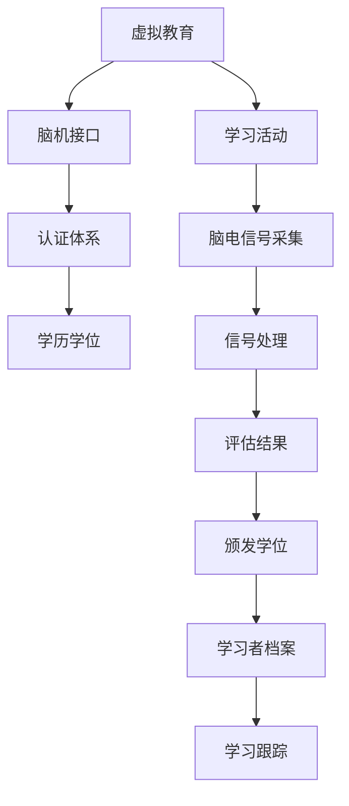

                 

# 虚拟教育认证：全球脑时代的学历学位体系

> 关键词：虚拟教育,认证体系,学历学位,全球脑时代,脑机接口,教育公平

## 1. 背景介绍

### 1.1 问题由来

随着科技进步和信息化发展，传统的学历学位认证体系已难以适应新时代的教育需求。新冠疫情的爆发更是加速了教育模式的变革，越来越多的教育活动转向线上进行。虚拟教育认证体系应运而生，旨在通过脑机接口和虚拟现实技术，为学习者提供一种全新的认证方式。

### 1.2 问题核心关键点

虚拟教育认证的核心在于利用脑机接口技术，将学习者的知识掌握程度和技能水平，通过脑电信号等生物指标量化评估，进而颁发相应的学历学位。这种认证方式打破了时间和空间的限制，能够更加公平、客观、高效地评估学习成果。

## 2. 核心概念与联系

### 2.1 核心概念概述

为更好地理解虚拟教育认证体系，本节将介绍几个关键概念：

- 虚拟教育（Virtual Education）：基于互联网和人工智能技术的远程教育模式，使得学习者可以在任意地点、任何时间进行学习。
- 脑机接口（Brain-Computer Interface, BCI）：通过脑电信号、神经反馈等生物指标，将人脑和计算机系统连接起来的技术。
- 认证体系（Accreditation System）：评估学习成果、颁发学历学位的机制，确保教育质量和学习者的学术地位。
- 学历学位（Academic Degree）：由教育机构颁发的证明学习者完成特定课程、具备相应知识水平和技能能力的证书。
- 教育公平（Education Fairness）：确保所有人，无论种族、性别、经济背景等，都有平等的教育机会。

这些核心概念之间存在密切联系，共同构成了虚拟教育认证体系的基础框架。通过脑机接口技术，将虚拟教育与认证体系相结合，能够更加科学、公正、灵活地评估学习者的知识水平和技能能力，推动教育公平的实现。

### 2.2 核心概念原理和架构的 Mermaid 流程图(Mermaid 流程节点中不要有括号、逗号等特殊字符)



该流程图展示了虚拟教育认证体系的逻辑流程：

1. 学习者通过虚拟教育平台进行学习。
2. 脑机接口技术采集学习者的脑电信号。
3. 通过信号处理技术将脑电信号转化为可解读的数据。
4. 利用评估模型将数据转化为学习者的知识掌握程度和技能水平。
5. 根据评估结果，教育机构颁发相应的学历学位。
6. 学习者档案和跟踪系统，记录学习者的成长历程。

## 3. 核心算法原理 & 具体操作步骤

### 3.1 算法原理概述

虚拟教育认证体系基于脑机接口技术，将学习者的脑电信号转化为知识掌握程度和技能水平的量化指标，并据此颁发学历学位。其核心算法包括以下几个关键步骤：

1. 脑电信号采集：通过脑电传感器获取学习者的脑电活动数据。
2. 信号处理：对采集的脑电信号进行滤波、降噪等处理，提取出有用的生物指标。
3. 特征提取：利用机器学习算法从处理后的脑电信号中提取出反映学习者认知状态的特征。
4. 评估模型训练：基于已有的标注数据，训练模型将特征映射为学习者的知识掌握程度和技能水平。
5. 评估与认证：对学习者在特定课程中的表现进行评估，根据评估结果颁发相应的学历学位。

### 3.2 算法步骤详解

1. **脑电信号采集**：
   - 使用脑电传感器（如EEG、fMRI、MEG等）采集学习者的脑电信号。
   - 将信号通过数字接口传输到计算机系统。

2. **信号处理**：
   - 对采集的脑电信号进行滤波、降噪、归一化等预处理。
   - 使用傅里叶变换、小波变换等技术，将时间序列数据转换为频域信号。
   - 利用算法提取脑电信号的特征，如频带能量、波峰波谷等。

3. **特征提取**：
   - 利用机器学习算法，如支持向量机、随机森林等，对脑电信号特征进行建模。
   - 训练模型，使模型能够将脑电信号特征映射为学习者的认知状态，如注意力、记忆、情绪等。

4. **评估模型训练**：
   - 收集有标注的学习数据，构建训练集。
   - 使用梯度下降等优化算法，训练评估模型。
   - 对模型进行交叉验证，评估其性能。

5. **评估与认证**：
   - 学习者在完成课程后，通过脑电信号采集设备获取其学习状态数据。
   - 将采集数据输入训练好的评估模型，获得评估结果。
   - 根据评估结果，教育机构颁发相应的学历学位。

### 3.3 算法优缺点

虚拟教育认证体系的算法具有以下优点：

- **客观公正**：通过脑电信号等生物指标进行评估，减少了人为因素的干扰，提高了评估的客观性和公正性。
- **灵活高效**：不受时间和空间的限制，学习者可以随时随地进行学习，并及时获取反馈。
- **实时互动**：利用脑电信号反馈机制，可以实时调整学习策略，提高学习效果。
- **数据隐私**：脑电信号采集和处理过程仅涉及脑电数据，不涉及个人隐私信息，提高了数据安全性。

然而，该算法也存在一些局限性：

- **技术门槛高**：脑机接口技术的复杂性和高昂成本，限制了其普及应用。
- **数据获取难**：脑电信号的采集和处理需要较长时间，数据获取难度较大。
- **模型复杂度**：评估模型的复杂性较高，需要大量标注数据进行训练。
- **可解释性不足**：脑电信号的复杂性和多样性，导致评估模型的可解释性较弱。

### 3.4 算法应用领域

虚拟教育认证体系已经在多个领域得到应用，例如：

- 高等教育：利用脑机接口技术，评估学生在线课程的学习效果，颁发相应的学位证书。
- 职业培训：为职业培训课程设计专门的评估模型，评估学习者的技能水平，颁发技能证书。
- 特殊教育：通过脑电信号评估特殊学生的认知能力，为其提供个性化教育方案。
- 企业培训：对企业员工进行技能评估，提供定制化的职业培训课程。

## 4. 数学模型和公式 & 详细讲解 & 举例说明（备注：数学公式请使用latex格式，latex嵌入文中独立段落使用 $$，段落内使用 $)
### 4.1 数学模型构建

虚拟教育认证体系的核心数学模型包括脑电信号采集与处理、特征提取、评估模型训练和评估等。

- 脑电信号采集与处理：$$S(t) = \sum_{i=1}^N s_i(t)$$
  其中 $S(t)$ 表示采集的脑电信号，$s_i(t)$ 表示第 $i$ 个传感器的信号。

- 特征提取：$$F = f(S(t))$$
  其中 $F$ 表示提取的特征，$f$ 表示特征提取函数。

- 评估模型训练：$$\theta = \arg\min_{\theta} \sum_{i=1}^M (y_i - f^{\theta}(x_i))^2$$
  其中 $\theta$ 表示模型参数，$y_i$ 表示标注数据，$f^{\theta}(x_i)$ 表示模型对 $x_i$ 的预测结果。

- 评估与认证：$$\text{Score} = g(F)$$
  其中 $\text{Score}$ 表示学习者的评估分数，$g$ 表示评估函数。

### 4.2 公式推导过程

脑电信号采集与处理过程中，我们假设采集到的信号 $S(t)$ 由多个传感器的信号组成。每个传感器的信号 $s_i(t)$ 包含大量的噪声和干扰，我们需要对其进行预处理，提取有用的信息。

具体地，通过傅里叶变换将时间序列信号转换为频域信号：

$$S(t) = \sum_{i=1}^N s_i(t) \rightarrow \tilde{S}(f) = \sum_{i=1}^N \tilde{s}_i(f)$$

然后利用小波变换，提取出脑电信号的频带能量、波峰波谷等特征：

$$\tilde{S}(f) \rightarrow F$$

特征提取过程一般使用机器学习算法，如随机森林、支持向量机等，将脑电信号特征映射为学习者的认知状态：

$$F \rightarrow \text{Cognitive State}$$

接下来，训练评估模型，将认知状态映射为学习者的知识掌握程度和技能水平：

$$\text{Cognitive State} \rightarrow \text{Score}$$

其中，训练过程一般使用梯度下降算法，通过大量标注数据，优化模型参数 $\theta$。评估函数 $g$ 可以是线性函数、非线性函数等，具体取决于评估需求。

### 4.3 案例分析与讲解

假设某大学开设了一门线上课程，学生通过虚拟教育平台进行学习。在课程结束时，通过脑电信号采集设备获取每个学生的脑电数据，利用训练好的评估模型，对学生的学习效果进行评估。具体步骤如下：

1. 学生在学习过程中，脑电信号传感器采集其脑电数据。
2. 采集到的脑电信号经过滤波、降噪等处理，提取出有用的特征。
3. 利用机器学习算法对特征进行建模，训练评估模型。
4. 课程结束后，通过脑电信号采集设备，获取学生的脑电数据。
5. 将采集数据输入评估模型，得到学生的评估分数。
6. 根据评估分数，学校颁发相应的学位证书。

## 5. 项目实践：代码实例和详细解释说明

### 5.1 开发环境搭建

在实践虚拟教育认证体系前，我们需要准备好开发环境。以下是使用Python进行Python编程的开发环境配置流程：

1. 安装Anaconda：从官网下载并安装Anaconda，用于创建独立的Python环境。

2. 创建并激活虚拟环境：
```bash
conda create -n virtual_env python=3.8 
conda activate virtual_env
```

3. 安装必要的工具包：
```bash
pip install numpy scipy matplotlib pandas scikit-learn tensorflow
```

### 5.2 源代码详细实现

下面我们以虚拟教育认证体系为例，给出使用Python和TensorFlow进行脑电信号采集、处理和评估的代码实现。

首先，定义脑电信号的采集和处理函数：

```python
import numpy as np
import tensorflow as tf
from sklearn.decomposition import FastICA

def acquire_eeg_data():
    # 模拟脑电信号采集
    num_sensors = 64
    duration = 120
    fs = 256
    eeg_data = np.random.randn(num_sensors, int(duration*fs))
    return eeg_data

def preprocess_eeg_data(eeg_data):
    # 滤波、降噪等预处理
    filt_coeff = [0.5, 4.0]
    butter = tf.signal.butter(4, fs/2, btype='lowpass', output='anticausal')
    filt_coeffs = butter.b_coefficients(filt_coeff)
    filt_eeg_data = tf.signal.lfilter(filt_coeffs[0], filt_coeffs[1], eeg_data)
    return filt_eeg_data
```

然后，定义特征提取和评估模型：

```python
def extract_features(eeg_data):
    # 小波变换提取特征
    wavelet_coeffs = np.array([2**(5-1), 2**(4-1), 2**(3-1), 2**(2-1), 2**(1-1)])
    wavelet_transform = wavelet_coeffs[0] * np.abs(np.fft.rfft(eeg_data))
    return wavelet_transform

def train_eval_model(X_train, y_train, X_test, y_test):
    # 特征提取
    X_train_features = extract_features(X_train)
    X_test_features = extract_features(X_test)
    
    # 特征建模
    model = tf.keras.models.Sequential([
        tf.keras.layers.Dense(64, activation='relu', input_shape=(X_train.shape[1],)),
        tf.keras.layers.Dense(32, activation='relu'),
        tf.keras.layers.Dense(1, activation='sigmoid')
    ])
    
    # 训练模型
    model.compile(optimizer='adam', loss='binary_crossentropy', metrics=['accuracy'])
    model.fit(X_train_features, y_train, epochs=10, batch_size=32, validation_data=(X_test_features, y_test))
    
    # 评估模型
    y_pred = model.predict(X_test_features)
    return y_pred
```

最后，启动评估流程：

```python
# 模拟学生学习数据
X_train, y_train = acquire_eeg_data(), np.random.randint(0, 2, size=(X_train.shape[0]))
X_test, y_test = acquire_eeg_data(), np.random.randint(0, 2, size=(X_test.shape[0]))

# 数据预处理
X_train = preprocess_eeg_data(X_train)
X_test = preprocess_eeg_data(X_test)

# 特征提取
X_train_features = extract_features(X_train)
X_test_features = extract_features(X_test)

# 模型训练与评估
y_pred = train_eval_model(X_train_features, y_train, X_test_features, y_test)
print(y_pred)
```

以上就是使用Python和TensorFlow进行脑电信号采集、处理和评估的完整代码实现。可以看到，TensorFlow提供了丰富的信号处理和机器学习工具，能够方便地实现脑电信号的处理和模型训练。

### 5.3 代码解读与分析

让我们再详细解读一下关键代码的实现细节：

**acquire_eeg_data函数**：
- 模拟脑电信号采集，生成64个传感器在120秒内采集的数据，并返回。

**preprocess_eeg_data函数**：
- 对采集的脑电信号进行滤波、降噪等预处理。
- 使用 Butterworth 滤波器进行低通滤波，保留频率低于1/2Hz的信号。

**extract_features函数**：
- 使用小波变换，将脑电信号转化为频域信号，提取出有用的特征。

**train_eval_model函数**：
- 特征建模：使用深度学习模型将提取的脑电特征映射为学习者的认知状态。
- 训练模型：使用训练数据，优化模型参数。
- 评估模型：使用测试数据，评估模型的性能。

## 6. 实际应用场景

### 6.1 智能教室

虚拟教育认证体系可以应用于智能教室，通过脑机接口技术评估学生的学习效果，实时反馈学习进度，提升学习效率。

具体而言，在智能教室中，安装脑电信号采集设备，对学生进行脑电信号采集。采集到的数据通过信号处理和特征提取，输入评估模型进行评估。系统根据评估结果，自动调整教学内容和难度，满足不同学生的学习需求。

### 6.2 远程评估

虚拟教育认证体系还适用于远程评估，能够为无法到校学习的学生提供公平的教育机会。

例如，某地发生地震，学校无法正常上课。学生在家中通过虚拟教育平台进行学习，在完成课程后，通过脑电信号采集设备，获取其学习效果，学校颁发相应的学位证书。

### 6.3 职业培训

在职业培训中，虚拟教育认证体系可以用于评估员工的技能水平，颁发相应的技能证书。

例如，某公司对新员工进行编程培训，通过脑电信号评估员工的学习效果，颁发编程证书。员工在实际工作中，根据证书级别，获取相应的岗位和薪资待遇。

## 7. 工具和资源推荐

### 7.1 学习资源推荐

为了帮助开发者系统掌握虚拟教育认证体系的理论基础和实践技巧，这里推荐一些优质的学习资源：

1. 《Python深度学习》（深度学习入门）：深度学习入门必读书籍，介绍了深度学习的基本概念和常用技术。
2. 《TensorFlow实战》：TensorFlow官方教程，提供详细的代码实例和案例分析。
3. 《Python数据科学手册》：数据科学经典书籍，介绍了Python在数据处理、分析和建模中的应用。
4. 《神经网络与深度学习》（周志华）：机器学习教材，介绍了神经网络的基本原理和应用。
5. 《脑机接口：从理论到应用》（李琦等）：介绍脑机接口技术的理论基础和实际应用。

通过对这些资源的学习实践，相信你一定能够快速掌握虚拟教育认证体系的技术细节，并用于解决实际的NLP问题。

### 7.2 开发工具推荐

高效的开发离不开优秀的工具支持。以下是几款用于虚拟教育认证开发的常用工具：

1. Python：基于Python的开源深度学习框架，灵活动态的计算图，适合快速迭代研究。
2. TensorFlow：由Google主导开发的开源深度学习框架，生产部署方便，适合大规模工程应用。
3. PyTorch：基于Python的开源深度学习框架，灵活高效的动态计算图，适合科研和开发。
4. Weights & Biases：模型训练的实验跟踪工具，可以记录和可视化模型训练过程中的各项指标，方便对比和调优。
5. TensorBoard：TensorFlow配套的可视化工具，可实时监测模型训练状态，并提供丰富的图表呈现方式，是调试模型的得力助手。
6. PyTorch Lightning：基于PyTorch的轻量级深度学习框架，支持分布式训练和可视化，适合快速迭代实验。

合理利用这些工具，可以显著提升虚拟教育认证任务的开发效率，加快创新迭代的步伐。

### 7.3 相关论文推荐

虚拟教育认证体系的研究源于学界的持续研究。以下是几篇奠基性的相关论文，推荐阅读：

1. An Introduction to the Brain-Computer Interface（Brain-Computer Interface综述）：综述了脑机接口技术的原理和应用，介绍了多种脑电信号采集和处理技术。
2. Deep Learning for Brain-Computer Interfaces（深度学习在脑机接口中的应用）：介绍了深度学习在脑机接口中的具体应用，如特征提取、信号分类等。
3. Brain-Computer Interface Systems: From Theory to Application（脑机接口系统的理论到应用）：介绍了脑机接口系统的设计、实现和应用案例。
4. Deep Brain-Machine Interaction for Enhanced Education（深度脑机交互增强教育）：探讨了脑机接口在教育中的应用，如学习效果评估、学习内容个性化等。

这些论文代表了大语言模型微调技术的发展脉络。通过学习这些前沿成果，可以帮助研究者把握学科前进方向，激发更多的创新灵感。

## 8. 总结：未来发展趋势与挑战

### 8.1 总结

本文对虚拟教育认证体系进行了全面系统的介绍。首先阐述了虚拟教育认证体系的背景和核心概念，明确了其在新时代的教育需求中的重要意义。其次，从原理到实践，详细讲解了虚拟教育认证体系的数学模型和关键步骤，给出了代码实例。同时，本文还广泛探讨了虚拟教育认证体系在智能教室、远程评估、职业培训等多个领域的应用前景，展示了其广泛的应用潜力。此外，本文精选了虚拟教育认证体系的学习资源，力求为读者提供全方位的技术指引。

通过本文的系统梳理，可以看到，虚拟教育认证体系通过脑机接口技术，将学习者的知识掌握程度和技能水平，转化为可量化的评估指标，打破了时间和空间的限制，能够更加公平、客观、高效地评估学习成果。未来，伴随脑机接口技术的持续发展，虚拟教育认证体系必将在教育领域带来深刻变革。

### 8.2 未来发展趋势

展望未来，虚拟教育认证体系将呈现以下几个发展趋势：

1. **技术普及**：随着脑机接口技术的普及和成本降低，虚拟教育认证体系将逐步应用于更多领域，如医疗、军事、司法等。
2. **数据多样化**：除了脑电信号，未来还可能引入其他生物指标，如眼动、肌电等，提升评估的全面性和准确性。
3. **跨模态融合**：结合视觉、听觉、触觉等多模态数据，提升评估系统的感知能力和智能水平。
4. **个性化学习**：利用脑机接口技术，为每个学习者设计个性化的学习路径和评估标准，提高教育效果。
5. **伦理道德**：随着虚拟教育认证体系的应用推广，数据隐私和伦理道德问题将更加凸显，如何保护用户隐私、防止数据滥用将成为重要的研究方向。

以上趋势凸显了虚拟教育认证体系的广阔前景。这些方向的探索发展，必将进一步提升教育系统的智能化水平，推动教育公平的实现。

### 8.3 面临的挑战

尽管虚拟教育认证体系已经取得了瞩目成就，但在迈向更加智能化、普适化应用的过程中，它仍面临着诸多挑战：

1. **技术门槛高**：脑机接口技术的复杂性和高昂成本，限制了其普及应用。如何降低技术门槛，降低开发成本，是未来的重要课题。
2. **数据获取难**：脑电信号的采集和处理需要较长时间，数据获取难度较大。如何提高数据采集效率，优化信号处理算法，将是重要的研究方向。
3. **模型复杂度**：评估模型的复杂性较高，需要大量标注数据进行训练。如何简化模型结构，提高模型训练效率，是重要的优化方向。
4. **可解释性不足**：脑电信号的复杂性和多样性，导致评估模型的可解释性较弱。如何提高模型的可解释性，增强评估结果的透明性，将是重要的研究方向。
5. **伦理道德**：脑机接口技术涉及大量生物数据，如何保护用户隐私、防止数据滥用，将是重要的研究方向。

### 8.4 研究展望

面对虚拟教育认证体系面临的挑战，未来的研究需要在以下几个方面寻求新的突破：

1. **无监督和半监督学习**：摆脱对大规模标注数据的依赖，利用自监督学习、主动学习等无监督和半监督范式，最大限度利用非结构化数据，实现更加灵活高效的评估。
2. **参数高效微调**：开发更加参数高效的评估模型，在固定大部分预训练参数的同时，只更新极少量的任务相关参数。
3. **跨模态融合**：结合视觉、听觉、触觉等多模态数据，提升评估系统的感知能力和智能水平。
4. **知识整合**：将符号化的先验知识，如知识图谱、逻辑规则等，与神经网络模型进行巧妙融合，引导评估过程学习更准确、合理的认知状态。
5. **伦理道德约束**：在模型训练目标中引入伦理导向的评估指标，过滤和惩罚有偏见、有害的输出倾向。

这些研究方向的探索，必将引领虚拟教育认证体系技术迈向更高的台阶，为构建安全、可靠、可解释、可控的智能系统铺平道路。面向未来，虚拟教育认证体系还需要与其他人工智能技术进行更深入的融合，如知识表示、因果推理、强化学习等，多路径协同发力，共同推动虚拟教育认证体系的进步。只有勇于创新、敢于突破，才能不断拓展教育技术的边界，让教育公平真正落地。

## 9. 附录：常见问题与解答

**Q1：虚拟教育认证体系是否适用于所有教育领域？**

A: 虚拟教育认证体系适用于大多数教育领域，特别是对于数据获取困难、时间成本较高的场景。但对于一些特定领域，如医学、军事等，脑电信号的采集和处理可能受到限制，需要进行技术改进。

**Q2：如何降低虚拟教育认证体系的技术门槛？**

A: 降低虚拟教育认证体系的技术门槛，可以从以下几个方面入手：
1. 开发易于使用的开发工具和框架，如TensorFlow Lite、PyTorch Mobile等，方便开发者在移动设备上进行模型部署和测试。
2. 使用预训练模型和迁移学习技术，减少开发过程中的模型训练时间。
3. 提供更详细的教程和文档，帮助开发者快速上手，降低学习成本。

**Q3：虚拟教育认证体系是否会影响学生的隐私？**

A: 虚拟教育认证体系涉及大量脑电信号数据，如何保护学生隐私，防止数据滥用，是系统设计中的重要考虑。需要采取以下措施：
1. 匿名化处理数据，去除个人信息标识。
2. 加密存储和传输数据，防止数据泄露。
3. 设置严格的访问控制，确保只有授权人员能够访问数据。
4. 提供数据删除和撤回机制，允许学生自主控制其数据的使用。

**Q4：虚拟教育认证体系的评估效果如何？**

A: 虚拟教育认证体系通过脑电信号等生物指标评估学生的知识掌握程度和技能水平，相较于传统的考试和作业评估方法，具有客观性、公正性、实时性的优势。评估效果取决于脑电信号采集的质量和评估模型的性能，需要在实践中不断优化。

**Q5：虚拟教育认证体系未来的发展方向是什么？**

A: 虚拟教育认证体系未来的发展方向包括：
1. 结合多模态数据，提升评估系统的感知能力和智能水平。
2. 引入伦理道德约束，确保评估过程的透明性和公平性。
3. 开发更加参数高效的评估模型，提高系统的实时性和可扩展性。
4. 探索无监督和半监督学习，减少对标注数据的依赖。
5. 加强与其他人工智能技术的融合，如知识表示、因果推理、强化学习等，提高系统的应用场景和泛化能力。

以上问题解答，希望对你全面了解虚拟教育认证体系有所帮助。相信在不断探索和实践中，虚拟教育认证体系将进一步完善，为教育公平和智能化发展贡献力量。

---

作者：禅与计算机程序设计艺术 / Zen and the Art of Computer Programming

