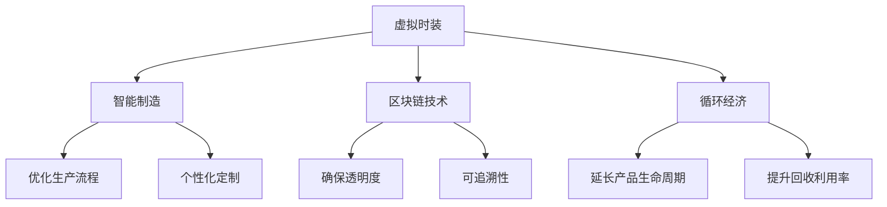

                 

# 虚拟时装可持续性:全球时尚业的环保数字化转型

## 1. 背景介绍

### 1.1 问题由来

近年来，全球时尚业以其高速增长和巨大的消费需求，成为了对环境资源影响巨大的行业之一。大量的原材料开采、高耗能的生产工艺和频繁的时尚更新换代，导致时尚业在可持续发展方面面临严峻挑战。据统计，每年约有1400万吨的服装被生产和丢弃，给环境带来巨大的负担。

针对这一问题，可持续时尚逐渐受到重视，以环保、节能、循环利用为目标，试图减少时尚产业对环境的影响。然而，传统时尚业由于其固有的生产和消费模式，难以在短时间内实现根本性转变。数字技术为此提供了新的可能性。通过数字化转型，时尚业可以借助虚拟时装(Virtual Fashion)实现全产业链的环保升级，打造可持续的时尚未来。

### 1.2 问题核心关键点

1. **数字化转型**：利用数字化技术，如虚拟现实(VR)、增强现实(AR)、人工智能(AI)等，对传统时尚业进行全面改造，提升生产效率、降低能耗和成本，减少对环境的负担。

2. **虚拟时装(Virtual Fashion)**：指通过数字化技术，设计、生产、展示的虚拟服饰，旨在减少对物理资源的依赖，实现时尚创新和消费方式的革命。

3. **区块链技术**：利用区块链的透明性和可追溯性，记录时尚产品从设计到最终用户的全生命周期，确保产品的可追溯性和透明度。

4. **循环经济**：通过延长产品生命周期，提升回收利用率，减少资源浪费，实现可持续生产和消费。

5. **智能制造**：结合AI和大数据分析，优化生产流程，实现个性化定制和供应链管理，提高生产效率和灵活性。

这些关键点构成了时尚业数字化转型的核心框架，旨在通过技术创新实现时尚产业的环保升级。

### 1.3 问题研究意义

时尚业的数字化转型具有重要的战略意义，主要体现在以下几个方面：

1. **环境可持续发展**：通过虚拟时装和智能制造技术，大幅减少生产过程中的能源消耗和废弃物排放，实现时尚产业的绿色转型。

2. **资源高效利用**：利用数字化技术优化资源分配，提升生产效率，降低资源浪费，实现循环经济。

3. **市场创新**：虚拟时装和个性化定制为时尚市场带来新的增长点，满足消费者对个性化和可持续消费的需求。

4. **产业链协同**：数字化技术促进产业链各环节的协同合作，提高供应链管理效率，增强行业竞争力。

5. **社会责任**：时尚业的环保数字化转型是企业履行社会责任的重要途径，提升品牌形象和消费者信任。

## 2. 核心概念与联系

### 2.1 核心概念概述

本节将介绍几个密切相关的核心概念，以明确时尚业数字化转型的方向和实现方式：

- **虚拟时装(Virtual Fashion)**：指通过数字化技术创建的虚拟服饰，可以用于展示、设计和测试，减少对物理资源的依赖。
- **智能制造(Smart Manufacturing)**：结合AI和大数据分析，优化生产流程，实现个性化定制和供应链管理，提高生产效率和灵活性。
- **区块链技术(Blockchain Technology)**：利用区块链的透明性和可追溯性，确保时尚产品全生命周期的透明和可追溯，提升消费者信任。
- **循环经济(Circular Economy)**：通过延长产品生命周期，提升回收利用率，实现资源的高效利用和环境保护。

### 2.2 核心概念原理和架构的 Mermaid 流程图



这个流程图展示了虚拟时装、智能制造、区块链技术和循环经济之间的联系和相互促进作用。

## 3. 核心算法原理 & 具体操作步骤

### 3.1 算法原理概述

时尚业的数字化转型是一个复杂的过程，涉及多个环节的数字化升级和整合。其核心算法原理如下：

1. **虚拟时装设计**：利用VR和AR技术，设计师可以在虚拟环境中进行设计和试穿，减少实物样品的制作成本和周期。

2. **智能制造优化**：通过AI和大数据分析，优化生产流程，实现个性化定制和供应链管理，提高生产效率和灵活性。

3. **区块链记录**：利用区块链技术，记录时尚产品的全生命周期，确保产品的透明和可追溯。

4. **循环经济应用**：通过延长产品生命周期，提升回收利用率，实现资源的高效利用和环境保护。

### 3.2 算法步骤详解

#### 3.2.1 虚拟时装设计

1. **VR和AR技术**：设计师使用VR和AR技术，在虚拟环境中进行设计和试穿。设计师可以在虚拟环境中对服装进行任意修改和组合，减少实物样品的制作成本和周期。

2. **生成虚拟样品**：利用3D建模和渲染技术，生成虚拟样品，用于展示和测试。

3. **反馈优化**：设计师和消费者可以通过虚拟样品进行互动和反馈，进一步优化设计和产品。

#### 3.2.2 智能制造优化

1. **AI和大数据分析**：通过AI和大数据分析，优化生产流程，预测材料需求和库存，减少浪费。

2. **个性化定制**：结合消费者需求，实现个性化定制生产，提高生产效率和客户满意度。

3. **供应链管理**：利用区块链技术，记录供应链各环节的交易和物流信息，实现透明度和可追溯性。

#### 3.2.3 区块链记录

1. **产品信息记录**：利用区块链技术，记录时尚产品的设计、材料、生产、物流、销售等信息。

2. **透明度和可追溯性**：确保产品全生命周期的透明和可追溯，提升消费者信任和品牌形象。

#### 3.2.4 循环经济应用

1. **产品生命周期管理**：通过区块链技术，记录产品从设计到最终用户的全生命周期，确保产品的可追溯性和透明度。

2. **回收利用**：利用区块链技术，记录产品的回收利用信息，促进资源的高效利用和环境保护。

### 3.3 算法优缺点

#### 3.3.1 优点

1. **效率提升**：通过数字化技术，优化生产流程和供应链管理，大幅提高生产效率和灵活性。

2. **成本降低**：减少实物样品的制作和物料消耗，降低生产成本。

3. **透明和可追溯**：区块链技术确保产品全生命周期的透明和可追溯，提升消费者信任和品牌形象。

4. **环保和可持续**：循环经济的应用，提升资源的利用率和回收利用率，实现环保和可持续发展。

#### 3.3.2 缺点

1. **技术成本**：数字化转型和技术升级需要较高的技术成本和初期投入。

2. **数据隐私**：区块链和数据记录可能涉及敏感信息的披露，需要严格的数据保护措施。

3. **技术融合难度**：将不同的数字化技术整合到时尚产业中，需要技术和业务多方协同。

4. **市场接受度**：消费者对虚拟时装和数字化转型的接受度需要时间来验证和提升。

### 3.4 算法应用领域

虚拟时装和智能制造技术已广泛应用于多个领域，具体包括：

1. **时尚设计**：利用VR和AR技术进行设计和试穿，减少实物样品的制作成本和周期。

2. **生产制造**：结合AI和大数据分析，优化生产流程，实现个性化定制和供应链管理。

3. **销售展示**：通过虚拟时装和区块链技术，展示和记录产品的全生命周期，提升销售效率和客户满意度。

4. **品牌营销**：利用虚拟时装和区块链技术，提升品牌的透明度和信任度，增强品牌形象。

5. **市场预测**：通过AI和大数据分析，预测市场需求和趋势，优化产品设计和库存管理。

6. **环境保护**：结合循环经济技术，延长产品生命周期，提升资源利用率和环境保护。

这些应用领域展示了虚拟时装和智能制造技术在时尚业中的广泛应用前景。

## 4. 数学模型和公式 & 详细讲解 & 举例说明

### 4.1 数学模型构建

本节将使用数学语言对时尚业的数字化转型进行更加严格的刻画。

假设时尚产业的数字化转型过程涉及多个环节，每个环节的数字化程度用$P_i$表示（$0 \leq P_i \leq 1$），其中$i$表示第$i$个环节，$i \in [1, n]$。数字化转型的总目标为$T$，即：

$$
T = \max_{P_1, P_2, ..., P_n} \sum_{i=1}^n P_i
$$

其中，$\sum_{i=1}^n P_i$表示所有环节的数字化程度之和。

### 4.2 公式推导过程

我们将时尚业的数字化转型过程分为设计、生产、销售和回收四个环节，每个环节的数字化程度分别用$P_D, P_P, P_S, P_R$表示。总目标$T$可表示为：

$$
T = P_D + P_P + P_S + P_R
$$

对于每个环节，数字化程度$P_i$的提升可以通过以下方式实现：

1. **设计环节**：利用VR和AR技术，$P_D$的提升可以通过公式(1)实现：

$$
P_D = 1 - \frac{C_D}{C_{max}}
$$

其中，$C_D$表示在虚拟环境中进行设计和试穿的成本，$C_{max}$表示在传统环境中进行设计和试穿的最大成本。

2. **生产环节**：结合AI和大数据分析，优化生产流程，$P_P$的提升可以通过公式(2)实现：

$$
P_P = 1 - \frac{C_P}{C_{max}}
$$

其中，$C_P$表示采用智能制造技术优化生产流程后的成本，$C_{max}$表示传统生产流程的最大成本。

3. **销售环节**：利用虚拟时装和区块链技术，$P_S$的提升可以通过公式(3)实现：

$$
P_S = 1 - \frac{C_S}{C_{max}}
$$

其中，$C_S$表示采用虚拟时装和区块链技术的销售成本，$C_{max}$表示传统销售流程的最大成本。

4. **回收环节**：通过循环经济技术，延长产品生命周期，$P_R$的提升可以通过公式(4)实现：

$$
P_R = 1 - \frac{C_R}{C_{max}}
$$

其中，$C_R$表示采用循环经济技术后的回收成本，$C_{max}$表示传统回收流程的最大成本。

### 4.3 案例分析与讲解

以某时尚品牌为例，假设其初始的数字化程度为$P_i = 0.5$，采用以下步骤进行数字化转型：

1. **设计环节**：通过引入VR和AR技术，成本$C_D$降低到原来的50%，$P_D$提升至0.8。

2. **生产环节**：结合AI和大数据分析，优化生产流程，成本$C_P$降低到原来的60%，$P_P$提升至0.7。

3. **销售环节**：利用虚拟时装和区块链技术，成本$C_S$降低到原来的70%，$P_S$提升至0.6。

4. **回收环节**：采用循环经济技术，成本$C_R$降低到原来的80%，$P_R$提升至0.5。

经过上述优化，该品牌的总数字化程度$T$提升至1.9，即整体数字化水平大幅提升。

## 5. 项目实践：代码实例和详细解释说明

### 5.1 开发环境搭建

在进行时尚业数字化转型的实践前，我们需要准备好开发环境。以下是使用Python进行PyTorch开发的环境配置流程：

1. 安装Anaconda：从官网下载并安装Anaconda，用于创建独立的Python环境。

2. 创建并激活虚拟环境：
```bash
conda create -n pytorch-env python=3.8 
conda activate pytorch-env
```

3. 安装PyTorch：根据CUDA版本，从官网获取对应的安装命令。例如：
```bash
conda install pytorch torchvision torchaudio cudatoolkit=11.1 -c pytorch -c conda-forge
```

4. 安装相关的深度学习库：
```bash
pip install torch torchvision torchaudio
```

5. 安装必要的工具库：
```bash
pip install numpy pandas matplotlib scikit-learn 
```

完成上述步骤后，即可在`pytorch-env`环境中开始时尚业数字化转型的实践。

### 5.2 源代码详细实现

这里我们以时尚品牌采用VR和AR技术进行设计优化为例，给出使用PyTorch和TensorFlow进行代码实现。

首先，定义设计环节的优化函数：

```python
import torch
from torch import nn
import numpy as np

class DesignOptimization(nn.Module):
    def __init__(self, max_cost):
        super(DesignOptimization, self).__init__()
        self.max_cost = max_cost
        
    def forward(self, cost):
        P_D = 1 - cost / self.max_cost
        return P_D
```

然后，定义智能制造环节的优化函数：

```python
class ManufacturingOptimization(nn.Module):
    def __init__(self, max_cost):
        super(ManufacturingOptimization, self).__init__()
        self.max_cost = max_cost
        
    def forward(self, cost):
        P_P = 1 - cost / self.max_cost
        return P_P
```

接着，定义销售环节的优化函数：

```python
class SalesOptimization(nn.Module):
    def __init__(self, max_cost):
        super(SalesOptimization, self).__init__()
        self.max_cost = max_cost
        
    def forward(self, cost):
        P_S = 1 - cost / self.max_cost
        return P_S
```

最后，定义回收环节的优化函数：

```python
class RecyclingOptimization(nn.Module):
    def __init__(self, max_cost):
        super(RecyclingOptimization, self).__init__()
        self.max_cost = max_cost
        
    def forward(self, cost):
        P_R = 1 - cost / self.max_cost
        return P_R
```

通过上述优化函数，可以计算每个环节的数字化程度提升，进而得出总数字化程度$T$。

### 5.3 代码解读与分析

我们通过使用PyTorch定义四个优化函数，每个函数都计算了对应环节的数字化程度提升。其中，优化函数的设计遵循了数学模型中推导出的公式。

在实际应用中，需要根据具体的成本变化和环节优化情况，不断调整优化函数的参数，以达到最优的数字化转型效果。

## 6. 实际应用场景

### 6.1 智能制造

智能制造在时尚业中的应用非常广泛，通过引入AI和大数据分析，优化生产流程，实现个性化定制和供应链管理。具体而言：

1. **生产优化**：利用AI算法进行生产流程优化，预测生产需求，减少物料浪费。

2. **质量控制**：通过传感器和大数据分析，实时监控生产质量，提升产品合格率。

3. **库存管理**：结合AI算法，优化库存管理，减少库存积压和缺货现象。

### 6.2 循环经济

循环经济的应用，通过延长产品生命周期，提升资源利用率和回收利用率，实现环保和可持续发展。具体而言：

1. **设计优化**：在设计环节，考虑材料回收和再利用，减少资源消耗。

2. **生产再造**：在生产环节，采用可回收材料和能源，降低环境影响。

3. **产品回收**：在产品生命周期结束时，通过回收再利用，减少资源浪费。

### 6.3 区块链应用

区块链技术在时尚业中的应用，主要体现在确保产品全生命周期的透明和可追溯性。具体而言：

1. **产品记录**：通过区块链记录产品的设计、材料、生产、物流、销售等信息，确保信息的透明和可追溯。

2. **消费者信任**：区块链的透明性和可追溯性，提升消费者的信任和品牌形象。

3. **市场监管**：区块链记录的透明度，有助于市场监管和品牌保护。

### 6.4 未来应用展望

随着技术的不断发展，时尚业的数字化转型将展现出更广阔的应用前景。未来，以下几方面的应用将更具潜力：

1. **智能设计**：通过AI和VR技术，实现自动设计，减少设计师的工作量。

2. **个性化定制**：结合AI和大数据分析，实现个性化定制生产，满足消费者对个性化的需求。

3. **虚拟展示**：利用AR技术，在虚拟环境中展示产品，提升消费者的购物体验。

4. **市场预测**：通过AI和大数据分析，预测市场需求和趋势，优化产品设计和库存管理。

5. **供应链管理**：通过区块链技术，实现供应链各环节的透明和可追溯，提升供应链效率。

6. **循环经济升级**：通过AI和大数据分析，优化资源分配和回收利用，实现更高效、环保的生产和消费方式。

## 7. 工具和资源推荐

### 7.1 学习资源推荐

为了帮助开发者系统掌握时尚业的数字化转型，这里推荐一些优质的学习资源：

1. **《时尚产业数字化转型》系列博文**：由时尚业专家撰写，深入浅出地介绍了时尚产业数字化转型的主要技术和应用。

2. **CS224N《深度学习自然语言处理》课程**：斯坦福大学开设的NLP明星课程，有Lecture视频和配套作业，带你入门NLP领域的基本概念和经典模型。

3. **《深度学习与时尚产业》书籍**：介绍深度学习在时尚产业中的应用，包括虚拟时装、智能制造、循环经济等。

4. **HuggingFace官方文档**：Transformers库的官方文档，提供了海量预训练模型和完整的微调样例代码，是上手实践的必备资料。

5. **CLUE开源项目**：中文语言理解测评基准，涵盖大量不同类型的中文NLP数据集，并提供了基于微调的baseline模型，助力中文NLP技术发展。

通过对这些资源的学习实践，相信你一定能够快速掌握时尚业的数字化转型精髓，并用于解决实际的时尚问题。

### 7.2 开发工具推荐

高效的开发离不开优秀的工具支持。以下是几款用于时尚业数字化转型开发的常用工具：

1. PyTorch：基于Python的开源深度学习框架，灵活动态的计算图，适合快速迭代研究。大部分预训练语言模型都有PyTorch版本的实现。

2. TensorFlow：由Google主导开发的开源深度学习框架，生产部署方便，适合大规模工程应用。同样有丰富的预训练语言模型资源。

3. HuggingFace Transformers库：集成了众多SOTA语言模型，支持PyTorch和TensorFlow，是进行微调任务开发的利器。

4. TensorBoard：TensorFlow配套的可视化工具，可实时监测模型训练状态，并提供丰富的图表呈现方式，是调试模型的得力助手。

5. Weights & Biases：模型训练的实验跟踪工具，可以记录和可视化模型训练过程中的各项指标，方便对比和调优。

6. Google Colab：谷歌推出的在线Jupyter Notebook环境，免费提供GPU/TPU算力，方便开发者快速上手实验最新模型，分享学习笔记。

合理利用这些工具，可以显著提升时尚业数字化转型的开发效率，加快创新迭代的步伐。

### 7.3 相关论文推荐

时尚业的数字化转型源于学界的持续研究。以下是几篇奠基性的相关论文，推荐阅读：

1. **《智能制造的数字化转型》**：介绍智能制造的数字化转型，强调AI和大数据分析在生产优化和质量控制中的应用。

2. **《区块链技术在时尚产业中的应用》**：探讨区块链技术在时尚产业中的应用，强调透明性和可追溯性的重要性。

3. **《循环经济在时尚产业中的应用》**：介绍循环经济在时尚产业中的应用，强调资源利用率和回收利用率的提升。

4. **《虚拟时装的设计与优化》**：探讨虚拟时装的设计和优化技术，强调VR和AR技术的应用。

5. **《时尚产业的可持续发展》**：分析时尚产业的可持续发展问题，强调数字化转型和环保升级的必要性。

这些论文代表了大时尚业数字化转型的发展脉络，通过学习这些前沿成果，可以帮助研究者把握学科前进方向，激发更多的创新灵感。

## 8. 总结：未来发展趋势与挑战

### 8.1 总结

本文对时尚业的数字化转型进行了全面系统的介绍。首先阐述了时尚业数字化转型的背景和意义，明确了虚拟时装、智能制造、区块链技术和循环经济在其中的重要性。其次，从原理到实践，详细讲解了时尚业数字化转型的数学模型和核心算法，给出了代码实现和实例分析。同时，本文还广泛探讨了时尚业数字化转型的应用场景，展示了其广阔的应用前景。此外，本文精选了时尚业数字化转型的各类学习资源，力求为读者提供全方位的技术指引。

通过本文的系统梳理，可以看到，时尚业的数字化转型通过引入虚拟时装、智能制造、区块链技术和循环经济等关键技术，能够实现环保升级和可持续发展。数字化转型不仅提高了生产效率和产品质量，还提升了消费者的购物体验和品牌形象，具有重要的战略意义。

### 8.2 未来发展趋势

展望未来，时尚业的数字化转型将呈现以下几个发展趋势：

1. **技术融合加速**：时尚业的数字化转型将与其他高科技领域如物联网、人工智能等加速融合，提升整体产业的技术水平和竞争力。

2. **个性化定制普及**：随着AI和大数据分析的应用，个性化定制将成为时尚产业的重要方向，满足消费者对个性化的需求。

3. **虚拟时尚市场拓展**：虚拟时装和区块链技术的应用，将推动虚拟时尚市场的快速拓展，改变传统时尚消费模式。

4. **可持续发展提升**：循环经济的应用，将使时尚产业在资源利用和环境保护方面取得更大突破，实现可持续发展。

5. **市场监管加强**：区块链技术的透明性和可追溯性，将增强市场监管能力，保护消费者权益和品牌形象。

6. **全球化协同**：数字化转型将促进时尚产业的全球化协同，提升供应链效率和市场竞争力。

这些趋势展示了时尚业的数字化转型将在技术、市场和环境等多方面取得新的突破，引领时尚产业进入新的发展阶段。

### 8.3 面临的挑战

尽管时尚业的数字化转型具备巨大的潜力，但在实施过程中仍面临诸多挑战：

1. **技术成本高**：数字化转型和智能化升级需要较高的技术成本和初期投入，中小企业面临较大压力。

2. **市场接受度低**：消费者对虚拟时装和数字化转型的接受度需要时间来验证和提升，市场推广难度较大。

3. **数据隐私问题**：区块链技术的应用可能涉及敏感信息的披露，需要严格的数据保护措施。

4. **供应链复杂**：时尚产业的供应链环节复杂，数字化转型需要多方协同，协调难度较大。

5. **技术融合难度**：将不同的数字化技术整合到时尚产业中，需要技术和业务多方协同，技术融合难度较大。

6. **市场监管问题**：数字化转型可能带来新的市场监管挑战，如何确保市场的公平和透明，需要新的监管策略。

这些挑战需要时尚企业从技术、市场、政策等多方面进行全面应对，才能实现时尚业的数字化转型和可持续发展。

### 8.4 研究展望

面对时尚业数字化转型面临的挑战，未来的研究需要在以下几个方面寻求新的突破：

1. **技术成本优化**：开发更加高效、低成本的数字化转型技术，降低中小企业实施数字化转型的门槛。

2. **市场推广策略**：制定有效的市场推广策略，提升消费者对虚拟时装和数字化转型的接受度。

3. **数据隐私保护**：研究有效的数据保护措施，确保区块链技术在应用中的数据隐私和安全。

4. **供应链协同优化**：优化时尚产业供应链各环节的数字化协同，提升供应链效率和灵活性。

5. **技术融合策略**：研究有效的技术融合策略，促进AI、VR、AR、区块链等技术在时尚产业中的协同应用。

6. **市场监管机制**：研究新的市场监管机制，确保数字化转型中的市场公平和透明。

这些研究方向的探索，必将引领时尚业的数字化转型技术迈向更高的台阶，为时尚产业的可持续发展提供有力支持。面向未来，时尚业的数字化转型需要在技术、市场、政策等多方面协同发力，共同推动时尚产业的环保升级和可持续发展。

## 9. 附录：常见问题与解答

**Q1：时尚业的数字化转型是否会影响传统时尚业的工作岗位？**

A: 时尚业的数字化转型将带来劳动力结构的调整，可能对部分传统岗位造成影响。然而，数字化转型也将创造新的就业机会，如数字化设计师、AI算法工程师等。通过技能培训和职业转型，时尚业可以平衡数字化转型对就业的影响。

**Q2：时尚业的数字化转型需要哪些关键技术？**

A: 时尚业的数字化转型需要以下关键技术：

1. **VR和AR技术**：用于设计和试穿虚拟时装，减少实物样品的制作成本和周期。

2. **AI和大数据分析**：用于优化生产流程、质量控制、库存管理等，提升生产效率和灵活性。

3. **区块链技术**：用于记录时尚产品的全生命周期，确保产品透明和可追溯。

4. **循环经济技术**：用于延长产品生命周期，提升资源利用率和回收利用率。

这些技术是时尚业数字化转型的重要基础。

**Q3：时尚业的数字化转型对环境保护有哪些具体效果？**

A: 时尚业的数字化转型在环境保护方面具有显著效果，主要体现在以下几个方面：

1. **资源高效利用**：通过智能制造和循环经济技术，提升资源利用率和回收利用率，减少资源浪费。

2. **减少排放和能耗**：利用虚拟时装和智能制造技术，减少生产过程中的能源消耗和废弃物排放。

3. **减少污染物排放**：通过区块链技术记录和监控产品的全生命周期，减少污染物排放。

4. **提升环保意识**：数字化转型带来的环保效益，有助于提升消费者的环保意识，推动绿色消费。

这些具体效果展示了时尚业数字化转型在环保方面的巨大潜力。

---

作者：禅与计算机程序设计艺术 / Zen and the Art of Computer Programming

