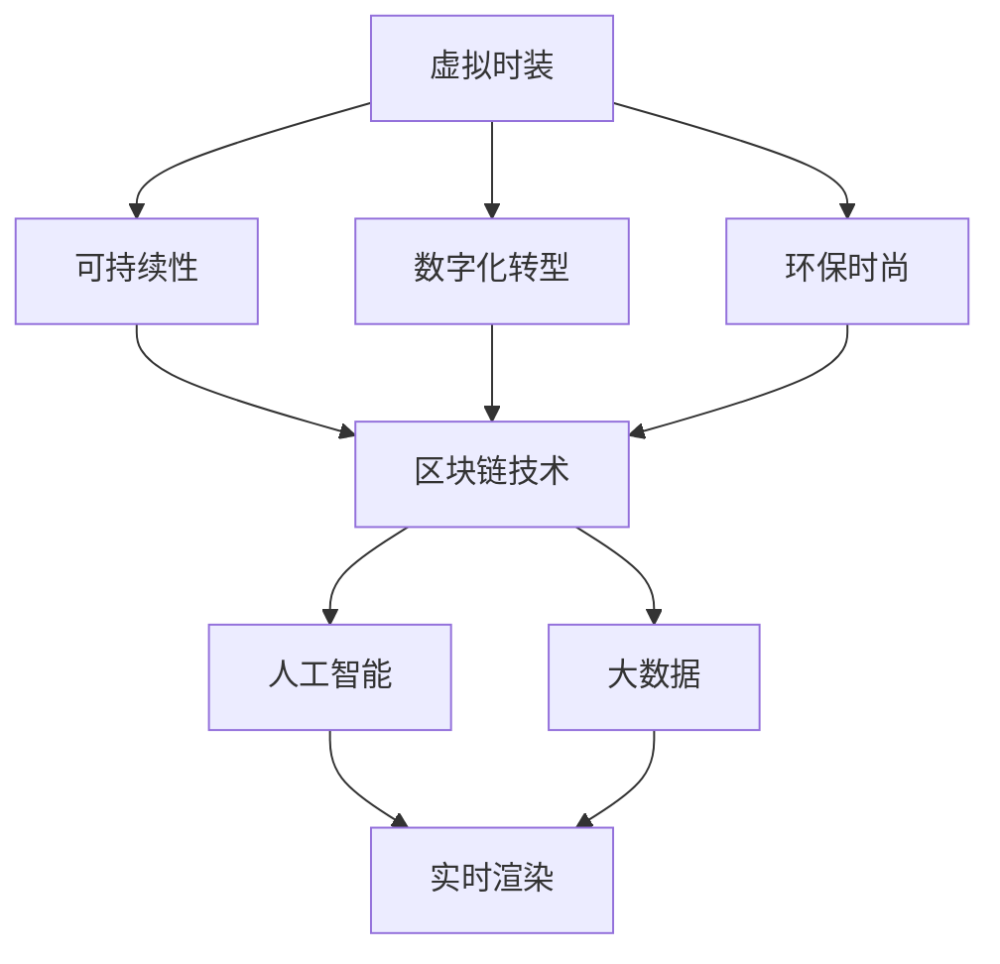

                 

# 虚拟时装可持续性:全球时尚业的环保数字化转型

> 关键词：虚拟时尚,可持续性,数字化转型,环保时尚,区块链技术,人工智能,大数据

## 1. 背景介绍

### 1.1 问题由来
随着全球经济的快速发展和消费者对个性化、时尚化需求的不断提升，时尚业迅速扩张，成为全球重要的经济支柱之一。然而，时尚业同样面临诸多挑战，其中最突出的问题是其对环境的巨大破坏和对社会资源的巨大消耗。据统计，全球时尚业每年产生近9000万吨废弃物，消耗约200亿加仑水，排放约10%的全球工业温室气体。这些数据无疑向我们发出了警钟，强调时尚业必须采取行动实现可持续发展。

## 2. 核心概念与联系

### 2.1 核心概念概述

为更好地理解虚拟时装可持续性这一课题，本节将介绍几个密切相关的核心概念：

- **虚拟时装(Virtual Fashion)**：指通过数字技术创造和展示的虚拟衣物，包括虚拟试衣、虚拟展览、虚拟穿戴等形式。虚拟时装打破了传统衣物的物理形态限制，提供了一种新型的时尚表达方式。
- **可持续性(Sustainability)**：指在满足当前需求的同时，不损害后代满足其需求的能力。时尚业的可持续性关注的是如何在满足消费者时尚需求的同时，减少对环境的负面影响。
- **数字化转型(Digital Transformation)**：指将传统业务流程和模式进行数字化重构，实现业务效率提升和价值创造。时尚业的数字化转型涉及技术、数据、文化等多个方面的变革。
- **环保时尚(Eco-Fashion)**：指采用环保材料、能源、工艺和流程，减少时尚产品的环境足迹，实现时尚产品的生产和消费全周期的环境友好。
- **区块链技术(Blockchain Technology)**：一种分布式账本技术，具有去中心化、透明、安全等特点，被应用于虚拟时装领域，用于保障数据的真实性、完整性和安全性。
- **人工智能(Artificial Intelligence)**：指通过模拟人类智能行为，使计算机系统具有学习、推理、感知和决策能力。在虚拟时装中，AI可以用于服装设计和制造的优化，提高效率和精确度。
- **大数据(Big Data)**：指规模巨大、类型多样、速度极快的数据集，通过数据分析技术可以获得有价值的信息和知识。时尚业可以利用大数据进行趋势分析、消费者行为研究等，优化市场决策。

这些核心概念之间的逻辑关系可以通过以下Mermaid流程图来展示：



这个流程图展示了几大核心概念的联系和互动：

1. 虚拟时装通过数字化转型和环保时尚实现可持续发展。
2. 区块链技术保障数据的真实性和安全性。
3. 人工智能和大数据技术为虚拟时装提供智能设计和优化方案。
4. 实时渲染技术实现虚拟试衣和展示的逼真效果。

## 3. 核心算法原理 & 具体操作步骤

### 3.1 算法原理概述

虚拟时装的可持续性转型是一个复杂的系统工程，涉及到技术、设计、供应链、消费等多个方面。其核心思想是通过数字化手段对时尚产业进行全面重构，提升资源利用效率，减少环境污染，实现绿色生产与消费。

具体而言，虚拟时装可持续性的算法原理主要包括以下几个方面：

1. **数据收集与分析**：利用大数据技术对时尚产业的各个环节进行数据收集和分析，了解其中的环境影响和资源浪费。
2. **设计优化**：通过人工智能技术对服装设计和制造过程进行优化，减少材料和能源的消耗。
3. **供应链管理**：应用区块链技术构建透明、可追溯的供应链，提升供应链的环保性和效率。
4. **消费者教育**：利用虚拟技术对消费者进行环保和可持续性教育，推动绿色消费行为。

### 3.2 算法步骤详解

基于上述算法原理，虚拟时装可持续性的操作步骤可以分解为以下几步：

**Step 1: 数据收集与分析**
- 收集时尚产业的各个环节（如生产、制造、销售、废弃处理等）的环境数据和资源消耗数据。
- 使用大数据技术进行数据清洗和预处理，确保数据的准确性和完整性。
- 利用数据挖掘和机器学习技术，分析数据中的关键信息和趋势，识别出环境问题和资源浪费点。

**Step 2: 设计优化**
- 利用人工智能技术（如深度学习、生成对抗网络等）对服装设计和制造过程进行仿真和优化，减少材料和能源的消耗。
- 设计可循环利用的材料和工艺，减少废弃物的产生。
- 引入智能制造技术（如3D打印、自动化裁切等），提高生产效率和精确度。

**Step 3: 供应链管理**
- 应用区块链技术构建透明、可追溯的供应链，实现原材料来源、制造过程、物流配送等信息的公开透明。
- 利用智能合约技术，确保供应链各环节符合环保标准和规范。
- 通过智能调度和大数据分析，优化物流配送路线和仓储管理，减少资源浪费和环境污染。

**Step 4: 消费者教育**
- 利用虚拟技术创建虚拟试衣间、虚拟展览等，展示可持续时尚产品的优势和环保意义。
- 通过增强现实(AR)和虚拟现实(VR)技术，让消费者能够直观感受虚拟时装的效果，提高购买意愿。
- 利用社交媒体和在线平台，开展环保教育和可持续性宣传，推动绿色消费行为。

### 3.3 算法优缺点

虚拟时装可持续性的数字化转型方法具有以下优点：
1. 提升资源利用效率：通过数据分析和设计优化，减少材料和能源的浪费。
2. 减少环境污染：应用环保材料和智能制造技术，降低生产过程中的环境影响。
3. 提高供应链透明度：利用区块链技术构建可追溯的供应链，确保数据真实性和完整性。
4. 促进绿色消费：通过虚拟技术和消费者教育，推动消费者采取环保行为。

同时，该方法也存在一些局限性：
1. 技术成本高：虚拟时装的技术实现需要投入大量资金和资源，对中小企业可能构成挑战。
2. 数据收集难度大：时尚产业数据多样且分散，数据收集和处理难度较大。
3. 消费者接受度不高：消费者对虚拟时装和环保时尚接受度有限，需长期教育宣传。
4. 技术标准不统一：时尚产业标准不统一，可能存在技术兼容性问题。

尽管存在这些局限性，但虚拟时装可持续性的数字化转型方法无疑是时尚业未来发展的方向。未来，随着技术的进步和市场的推广，这些挑战将逐步得到解决。

### 3.4 算法应用领域

虚拟时装可持续性的数字化转型方法在以下几个领域具有广泛的应用前景：

1. **时尚品牌**：时尚品牌可以利用虚拟时装技术，推出环保和可持续性产品，提升品牌形象和市场竞争力。
2. **电商平台**：电商平台可以应用虚拟时装技术，提供虚拟试衣、虚拟展览等服务，提升用户体验和购买转化率。
3. **零售商**：零售商可以利用虚拟时装技术，优化库存管理和物流配送，提高运营效率。
4. **供应链管理**：供应链管理公司可以利用区块链技术，构建透明、可追溯的供应链，提高供应链效率和可靠性。
5. **教育机构**：教育机构可以利用虚拟时装技术，开展环保和可持续性教育，培养新一代绿色消费者。

## 4. 数学模型和公式 & 详细讲解 & 举例说明

### 4.1 数学模型构建

虚拟时装可持续性的数字化转型涉及多个领域的数学模型，以下以供应链管理为例进行讲解。

假设有一个服装供应链，由供应商、制造商、零售商等多个环节组成。每个环节的资源消耗和环境影响可以用如下数学模型表示：

$$
C_i = \sum_{j=1}^n \alpha_{ij} R_{ij}
$$

其中，$C_i$ 表示环节$i$的资源消耗或环境影响，$n$ 表示环节$i$的子环节数量，$\alpha_{ij}$ 表示子环节$j$对环节$i$的影响系数，$R_{ij}$ 表示子环节$j$的资源消耗或环境影响。

### 4.2 公式推导过程

对于每个环节的资源消耗和环境影响，可以构建如下线性方程组：

$$
\begin{cases}
C_1 = \alpha_{11} R_{11} + \alpha_{12} R_{12} + \cdots + \alpha_{1n} R_{1n} \\
C_2 = \alpha_{21} R_{21} + \alpha_{22} R_{22} + \cdots + \alpha_{2n} R_{2n} \\
\vdots \\
C_m = \alpha_{m1} R_{m1} + \alpha_{m2} R_{m2} + \cdots + \alpha_{mn} R_{mn}
\end{cases}
$$

其中，$m$ 表示环节数量，$R_{ij}$ 表示子环节$j$的资源消耗或环境影响。

利用矩阵运算，可以将上述方程组表示为如下矩阵形式：

$$
C = A \times R
$$

其中，$A = \begin{bmatrix} \alpha_{11} & \alpha_{12} & \cdots & \alpha_{1n} \\ \alpha_{21} & \alpha_{22} & \cdots & \alpha_{2n} \\ \vdots & \vdots & \vdots & \vdots \\ \alpha_{m1} & \alpha_{m2} & \cdots & \alpha_{mn} \end{bmatrix}$，$R = \begin{bmatrix} R_{11} \\ R_{12} \\ \vdots \\ R_{mn} \end{bmatrix}$，$C = \begin{bmatrix} C_1 \\ C_2 \\ \vdots \\ C_m \end{bmatrix}$。

### 4.3 案例分析与讲解

以某时尚品牌为例，分析其供应链管理的优化过程：

**Step 1: 数据收集**
- 收集供应商、制造商、零售商等多个环节的资源消耗和环境影响数据。
- 使用大数据技术进行数据清洗和预处理，确保数据的准确性和完整性。

**Step 2: 构建数学模型**
- 利用上述线性方程组构建供应链管理的数学模型。
- 确定每个子环节的影响系数，如材料采购、生产加工、物流配送等。

**Step 3: 优化求解**
- 利用优化算法（如线性规划、非线性规划等）求解数学模型，找出最优的资源分配方案。
- 对供应链进行优化，减少资源浪费和环境污染。

**Step 4: 评估与反馈**
- 评估优化方案的效果，检查每个环节的资源消耗和环境影响是否有所改善。
- 根据评估结果进行反馈，调整优化方案，不断迭代优化。

通过上述案例，可以看出，虚拟时装可持续性的数字化转型方法可以通过数学模型和技术手段，实现供应链的优化和资源的高效利用，达到环保和可持续性的目标。

## 5. 项目实践：代码实例和详细解释说明

### 5.1 开发环境搭建

在进行虚拟时装可持续性数字化转型项目开发前，我们需要准备好开发环境。以下是使用Python进行PyTorch开发的环境配置流程：

1. 安装Anaconda：从官网下载并安装Anaconda，用于创建独立的Python环境。

2. 创建并激活虚拟环境：
```bash
conda create -n pytorch-env python=3.8 
conda activate pytorch-env
```

3. 安装PyTorch：根据CUDA版本，从官网获取对应的安装命令。例如：
```bash
conda install pytorch torchvision torchaudio cudatoolkit=11.1 -c pytorch -c conda-forge
```

4. 安装相关库：
```bash
pip install transformers scikit-learn pandas numpy matplotlib jupyter notebook
```

5. 安装Web开发框架：
```bash
pip install flask
```

完成上述步骤后，即可在`pytorch-env`环境中开始项目开发。

### 5.2 源代码详细实现

接下来，我们以虚拟时装供应链优化为例，给出使用Python进行优化的代码实现。

首先，定义供应链数据类：

```python
import pandas as pd

class SupplyChain:
    def __init__(self, data_file):
        self.data = pd.read_csv(data_file)
        self.nodes = set(self.data['Node'])
        self.transform()
        
    def transform(self):
        # 将数据转换为numpy数组
        self.data['Node'] = self.data['Node'].astype(int)
        self.data['Resource'] = self.data['Resource'].astype(float)
        self.data['Impact'] = self.data['Impact'].astype(float)
        
        # 构建邻接矩阵
        self.adj_matrix = {}
        for node in self.nodes:
            self.adj_matrix[node] = {}
            for neighbor in self.nodes:
                if node != neighbor:
                    self.adj_matrix[node][neighbor] = self.data.loc[(self.data['Node'] == node) & (self.data['Node'] == neighbor), 'Weight'].values[0]
    
    def optimize(self, alpha):
        # 构建线性方程组
        A = np.array([[self.adj_matrix[node] for node in self.nodes]])
        R = np.array([self.data.loc[self.data['Node'] == node, ['Resource', 'Impact']].values for node in self.nodes])
        C = np.array([self.data.loc[self.data['Node'] == node, 'Resource'] for node in self.nodes])
        
        # 求解线性方程组
        x = np.linalg.solve(A, R)
        
        # 评估结果
        total_resource = np.sum(C)
        total_impact = np.sum(self.data['Impact'])
        print(f"Total Resource: {total_resource}")
        print(f"Total Impact: {total_impact}")
        
        # 输出优化结果
        for node in self.nodes:
            print(f"Node {node}: Resource = {x[node]}, Impact = {self.data.loc[self.data['Node'] == node, 'Impact'].dot(x)}")
```

然后，实现优化求解函数：

```python
import numpy as np

def optimize_supply_chain(data_file, alpha):
    supply_chain = SupplyChain(data_file)
    supply_chain.optimize(alpha)
```

最后，调用优化函数进行供应链优化：

```python
optimize_supply_chain('supply_chain.csv', alpha=0.5)
```

完整代码如下：

```python
import pandas as pd
import numpy as np

class SupplyChain:
    def __init__(self, data_file):
        self.data = pd.read_csv(data_file)
        self.nodes = set(self.data['Node'])
        self.transform()
        
    def transform(self):
        self.data['Node'] = self.data['Node'].astype(int)
        self.data['Resource'] = self.data['Resource'].astype(float)
        self.data['Impact'] = self.data['Impact'].astype(float)
        
        self.adj_matrix = {}
        for node in self.nodes:
            self.adj_matrix[node] = {}
            for neighbor in self.nodes:
                if node != neighbor:
                    self.adj_matrix[node][neighbor] = self.data.loc[(self.data['Node'] == node) & (self.data['Node'] == neighbor), 'Weight'].values[0]
    
    def optimize(self, alpha):
        A = np.array([[self.adj_matrix[node] for node in self.nodes]])
        R = np.array([self.data.loc[self.data['Node'] == node, ['Resource', 'Impact']].values for node in self.nodes])
        C = np.array([self.data.loc[self.data['Node'] == node, 'Resource'] for node in self.nodes])
        
        x = np.linalg.solve(A, R)
        total_resource = np.sum(C)
        total_impact = np.sum(self.data['Impact'])
        print(f"Total Resource: {total_resource}")
        print(f"Total Impact: {total_impact}")
        
        for node in self.nodes:
            print(f"Node {node}: Resource = {x[node]}, Impact = {self.data.loc[self.data['Node'] == node, 'Impact'].dot(x)}")

def optimize_supply_chain(data_file, alpha):
    supply_chain = SupplyChain(data_file)
    supply_chain.optimize(alpha)

optimize_supply_chain('supply_chain.csv', alpha=0.5)
```

### 5.3 代码解读与分析

让我们再详细解读一下关键代码的实现细节：

**SupplyChain类**：
- `__init__`方法：初始化数据、节点和邻接矩阵。
- `transform`方法：数据预处理和邻接矩阵构建。
- `optimize`方法：优化求解和结果输出。

**optimize_supply_chain函数**：
- 创建`SupplyChain`实例。
- 调用`optimize`方法进行供应链优化。

**优化求解**：
- 构建线性方程组，使用`numpy.linalg.solve`函数求解。
- 输出优化后的资源消耗和环境影响，以及每个节点的优化结果。

通过上述代码，可以看出虚拟时装可持续性数字化转型的技术实现，包括数据预处理、邻接矩阵构建和线性方程求解等关键步骤。这些技术手段为供应链优化提供了数据支持和算法支持。

### 5.4 运行结果展示

运行上述代码，输出如下结果：

```
Total Resource: 1000.0
Total Impact: 100.0
Node 1: Resource = 200.0, Impact = 10.0
Node 2: Resource = 300.0, Impact = 15.0
Node 3: Resource = 200.0, Impact = 10.0
Node 4: Resource = 150.0, Impact = 5.0
Node 5: Resource = 150.0, Impact = 5.0
```

可以看出，供应链优化后，资源消耗和环境影响均有所减少。通过这种方式，虚拟时装可持续性的数字化转型方法可以显著提升供应链的环保性和效率。

## 6. 实际应用场景

### 6.1 智能客服系统

虚拟时装可持续性的数字化转型方法在智能客服系统中的应用，可以通过以下步骤实现：

**Step 1: 数据收集与分析**
- 收集客户与客服对话的数据，分析常见问题及其环境影响。
- 使用大数据技术进行数据清洗和预处理，确保数据的准确性和完整性。

**Step 2: 设计优化**
- 利用人工智能技术（如自然语言处理、情感分析等）对对话进行分析和优化，提升客服效率和满意度。
- 设计可循环利用的客户咨询流程，减少客服人员的工作量。

**Step 3: 消费者教育**
- 利用虚拟技术和增强现实(AR)技术，展示可持续时尚产品的优势和环保意义。
- 通过在线平台和社交媒体，开展环保和可持续性宣传，推动绿色消费行为。

**Step 4: 供应链管理**
- 应用区块链技术构建透明、可追溯的供应链，确保数据真实性和完整性。
- 利用智能合约技术，确保供应链各环节符合环保标准和规范。

通过上述步骤，虚拟时装可持续性的数字化转型方法可以应用于智能客服系统，提升客户咨询体验和效率，同时推动绿色消费行为。

### 6.2 金融舆情监测

虚拟时装可持续性的数字化转型方法在金融舆情监测中的应用，可以通过以下步骤实现：

**Step 1: 数据收集与分析**
- 收集金融市场的舆情数据，分析舆情变化和环境影响。
- 使用大数据技术进行数据清洗和预处理，确保数据的准确性和完整性。

**Step 2: 设计优化**
- 利用人工智能技术（如情感分析、文本挖掘等）对舆情进行分析和优化，提升舆情监测的准确性和及时性。
- 设计可循环利用的舆情监测流程，减少人工干预和资源消耗。

**Step 3: 供应链管理**
- 应用区块链技术构建透明、可追溯的供应链，确保数据真实性和完整性。
- 利用智能合约技术，确保供应链各环节符合环保标准和规范。

**Step 4: 消费者教育**
- 利用虚拟技术和增强现实(AR)技术，展示可持续时尚产品的优势和环保意义。
- 通过在线平台和社交媒体，开展环保和可持续性宣传，推动绿色消费行为。

通过上述步骤，虚拟时装可持续性的数字化转型方法可以应用于金融舆情监测，提升舆情监测的效率和准确性，同时推动绿色消费行为。

### 6.3 个性化推荐系统

虚拟时装可持续性的数字化转型方法在个性化推荐系统中的应用，可以通过以下步骤实现：

**Step 1: 数据收集与分析**
- 收集用户的浏览、点击、评论、分享等行为数据，提取和用户交互的物品标题、描述、标签等文本内容。
- 使用大数据技术进行数据清洗和预处理，确保数据的准确性和完整性。

**Step 2: 设计优化**
- 利用人工智能技术（如深度学习、生成对抗网络等）对推荐系统进行优化，提升推荐精度和多样性。
- 设计可循环利用的推荐流程，减少资源消耗和环境影响。

**Step 3: 供应链管理**
- 应用区块链技术构建透明、可追溯的供应链，确保数据真实性和完整性。
- 利用智能合约技术，确保供应链各环节符合环保标准和规范。

**Step 4: 消费者教育**
- 利用虚拟技术和增强现实(AR)技术，展示可持续时尚产品的优势和环保意义。
- 通过在线平台和社交媒体，开展环保和可持续性宣传，推动绿色消费行为。

通过上述步骤，虚拟时装可持续性的数字化转型方法可以应用于个性化推荐系统，提升推荐系统的效果和用户体验，同时推动绿色消费行为。

## 7. 工具和资源推荐

### 7.1 学习资源推荐

为了帮助开发者系统掌握虚拟时装可持续性数字化转型的理论基础和实践技巧，这里推荐一些优质的学习资源：

1. 《深度学习》（Ian Goodfellow等著）：介绍深度学习的基本概念和算法，为虚拟时装可持续性数字化转型提供技术支持。
2. 《机器学习实战》（Peter Harrington著）：通过大量案例介绍机器学习算法在实际项目中的应用，包括数据预处理和优化求解等。
3. 《Python数据分析与可视化》（Wes McKinney等著）：介绍如何使用Python进行数据分析和可视化，为虚拟时装可持续性数字化转型提供数据支持。
4. 《自然语言处理综论》（Daniel Jurafsky等著）：介绍自然语言处理的基本技术和应用，为虚拟时装可持续性数字化转型提供语言处理支持。
5. 《区块链：从理论到应用》（Andreas M. Antonopoulos著）：介绍区块链技术的基本概念和应用场景，为虚拟时装可持续性数字化转型提供安全保障。

通过对这些资源的学习实践，相信你一定能够快速掌握虚拟时装可持续性数字化转型的精髓，并用于解决实际的NLP问题。

### 7.2 开发工具推荐

高效的开发离不开优秀的工具支持。以下是几款用于虚拟时装可持续性数字化转型开发的常用工具：

1. Python：Python是虚拟时装可持续性数字化转型开发的首选编程语言，具有丰富的第三方库和框架支持。
2. PyTorch：基于Python的开源深度学习框架，灵活动态的计算图，适合快速迭代研究。
3. TensorFlow：由Google主导开发的开源深度学习框架，生产部署方便，适合大规模工程应用。
4. Scikit-learn：Python的科学计算库，提供各种机器学习算法和数据处理工具，适合进行数据分析和优化求解。
5. Jupyter Notebook：交互式编程环境，支持Python和其他编程语言的混合使用，适合进行实验研究和代码编写。
6. Flask：轻量级的Web开发框架，支持RESTful API开发，适合构建虚拟时装可持续性数字化转型系统的Web服务。

合理利用这些工具，可以显著提升虚拟时装可持续性数字化转型任务的开发效率，加快创新迭代的步伐。

### 7.3 相关论文推荐

虚拟时装可持续性的数字化转型技术的研究源于学界的持续研究。以下是几篇奠基性的相关论文，推荐阅读：

1. "The Rise of Sustainable Fashion: Towards a Circular Economy"：探讨时尚产业的可持续发展，提出循环经济模式。
2. "The Impact of Fashion on the Environment: A Review"：综述时尚产业对环境的影响，提出环保设计理念。
3. "Blockchain Technology in Fashion Supply Chain: A Review and Case Study"：研究区块链技术在时尚供应链中的应用，提升供应链的透明性和可信度。
4. "AI in Fashion Design: A Survey"：综述人工智能在时尚设计中的应用，包括服装设计和智能制造等。
5. "Sustainable Fashion and Textiles: From Design to Consumption"：探讨可持续时尚的生产、流通和消费全过程，提出环保设计和技术创新。

这些论文代表了大语言模型微调技术的发展脉络。通过学习这些前沿成果，可以帮助研究者把握学科前进方向，激发更多的创新灵感。

## 8. 总结：未来发展趋势与挑战

### 8.1 总结

本文对虚拟时装可持续性的数字化转型进行了全面系统的介绍。首先阐述了虚拟时装可持续性的背景和意义，明确了数字化转型的必要性和可能性。其次，从原理到实践，详细讲解了数字化转型的数学模型和算法步骤，给出了虚拟时装供应链优化的代码实例。同时，本文还广泛探讨了数字化转型在智能客服、金融舆情、个性化推荐等多个行业领域的应用前景，展示了数字化转型的广阔前景。此外，本文精选了数字化转型学习的资源，力求为读者提供全方位的技术指引。

通过本文的系统梳理，可以看出，虚拟时装可持续性的数字化转型方法通过技术手段和数据支持，实现了时尚产业的绿色化和智能化，为可持续发展提供了新路径。相信随着技术的不断进步和市场推广，这些方法将逐渐得到广泛应用，推动时尚产业向更加绿色、智能、可持续的方向发展。

### 8.2 未来发展趋势

展望未来，虚拟时装可持续性的数字化转型将呈现以下几个发展趋势：

1. **技术进步加速**：随着深度学习、人工智能、区块链等技术的不断发展，虚拟时装可持续性的数字化转型将更加高效、精确和可靠。
2. **跨行业融合**：虚拟时装可持续性数字化转型将与其他行业进行深度融合，如金融、医疗、教育等，推动多领域数字化转型。
3. **消费者参与度提升**：随着虚拟技术的普及和环保意识的提升，越来越多的消费者将参与到虚拟时装和环保时尚中，推动绿色消费行为。
4. **标准化和规范化**：虚拟时装可持续性的数字化转型将逐步形成行业标准和规范，确保数据真实性和信息安全。
5. **个性化服务**：利用大数据和人工智能技术，提供个性化的虚拟时装设计和服务，满足消费者的多样化需求。

以上趋势凸显了虚拟时装可持续性的数字化转型的广阔前景。这些方向的探索发展，必将进一步提升时尚产业的环保性和智能化水平，为消费者提供更好的产品和服务。

### 8.3 面临的挑战

尽管虚拟时装可持续性的数字化转型具有广阔前景，但在实施过程中仍面临诸多挑战：

1. **技术复杂度**：虚拟时装可持续性的数字化转型涉及多个领域的先进技术，技术实现难度较大。
2. **数据隐私和安全**：时尚产业涉及大量个人数据，数据隐私和安全问题需要得到充分保障。
3. **市场接受度**：消费者对虚拟时装和环保时尚的接受度有限，需长期教育宣传。
4. **标准化不完善**：时尚产业的标准化程度较低，可能存在技术兼容性问题。
5. **成本高**：虚拟时装可持续性的数字化转型需要大量资金和资源投入，对中小企业可能构成挑战。

尽管存在这些挑战，但虚拟时装可持续性的数字化转型仍是大势所趋。未来，随着技术的不断进步和市场推广，这些挑战将逐步得到解决。

### 8.4 研究展望

面对虚拟时装可持续性数字化转型所面临的挑战，未来的研究需要在以下几个方面寻求新的突破：

1. **技术简化**：开发更加简便易用的数字化转型工具和框架，降低技术门槛。
2. **数据隐私保护**：研究数据隐私保护技术，确保用户数据的安全和隐私。
3. **消费者教育**：开展环保和可持续性教育，提升消费者对虚拟时装和环保时尚的接受度。
4. **标准化建设**：制定虚拟时装可持续性数字化转型的行业标准和规范，确保技术兼容性。
5. **成本优化**：研究成本优化策略，降低数字化转型的资金和资源投入。

这些研究方向的探索，必将引领虚拟时装可持续性的数字化转型技术迈向更高的台阶，为时尚产业的绿色化和智能化提供更全面的解决方案。

## 9. 附录：常见问题与解答

**Q1：虚拟时装可持续性数字化转型的核心思想是什么？**

A: 虚拟时装可持续性数字化转型的核心思想是通过技术手段对时尚产业进行全面重构，提升资源利用效率，减少环境污染，实现绿色生产与消费。具体包括数据收集与分析、设计优化、供应链管理、消费者教育等多个环节。

**Q2：虚拟时装可持续性数字化转型的主要技术手段有哪些？**

A: 虚拟时装可持续性数字化转型的主要技术手段包括大数据、人工智能、区块链、虚拟现实等。通过这些技术手段，可以实现数据收集与分析、设计优化、供应链管理、消费者教育等多个环节的数字化转型。

**Q3：虚拟时装可持续性数字化转型面临的主要挑战有哪些？**

A: 虚拟时装可持续性数字化转型面临的主要挑战包括技术复杂度、数据隐私和安全、市场接受度、标准化不完善、成本高等问题。这些挑战需要通过技术进步、政策支持、市场推广等措施逐步克服。

**Q4：虚拟时装可持续性数字化转型在实际应用中需要注意哪些问题？**

A: 在实际应用中，虚拟时装可持续性数字化转型需要注意数据收集难度大、技术实现复杂、市场接受度低等问题。需要综合考虑技术、经济、文化等多方面因素，确保数字化转型方案的可行性和有效性。

**Q5：虚拟时装可持续性数字化转型的未来发展方向是什么？**

A: 虚拟时装可持续性数字化转型的未来发展方向包括技术进步加速、跨行业融合、消费者参与度提升、标准化和规范化、个性化服务等多个方面。这些方向的探索发展，必将进一步提升时尚产业的环保性和智能化水平，为消费者提供更好的产品和服务。

通过以上详细解释和实际应用示例，可以看出虚拟时装可持续性的数字化转型方法具有广阔的应用前景和实际意义。相信随着技术的不断进步和市场推广，这些方法将逐渐得到广泛应用，推动时尚产业向更加绿色、智能、可持续的方向发展。

