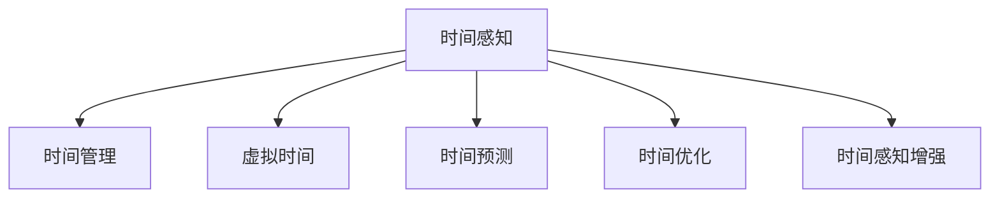

                 

# 虚拟时间感：AI操纵的时间知觉

## 1. 背景介绍

### 1.1 问题由来

在现代社会中，时间已经成为人们生活的重要维度，人们通过时间管理来规划工作、学习和社交。然而，随着科技的飞速发展，尤其是人工智能的崛起，我们对时间的感知和利用正在发生深刻的变化。AI技术不仅在自动化处理任务上表现出强大的能力，而且在“感知”和“操作”时间方面，也正在悄悄地改变我们的生活方式。

### 1.2 问题核心关键点

这一趋势的核心在于，AI如何通过模拟和操纵时间，来提升人类对时间的感知和利用效率。具体而言，AI能够：

- **自动优化时间安排**：通过算法分析任务优先级和依赖关系，自动调整时间安排，最大化时间利用效率。
- **预测时间变化**：通过大数据和机器学习模型，预测时间序列的变化趋势，提前做出时间管理决策。
- **增强时间感知**：通过交互界面和感知算法，提升用户对时间的感知和理解，改善时间管理体验。
- **虚拟时间调度**：在虚拟空间中进行时间管理，实现跨时区、跨设备的时间协调，提升协作效率。

这些功能使得AI能够在教育、医疗、交通等领域，为人类提供更好的时间管理解决方案，提高工作效率和生活质量。

### 1.3 问题研究意义

研究AI操纵时间知觉的意义，对于理解AI技术如何塑造未来社会，提升人类生活质量，具有重要的理论和实际价值。具体来说：

- **提高生产力**：优化时间安排和增强时间感知，有助于提升工作效率，降低时间浪费。
- **改善用户体验**：通过虚拟时间和增强现实界面，提高时间管理的可视化和互动性。
- **促进技术创新**：推动时间管理技术的进步，为未来的自动化和智能化社会提供基础。
- **应对未来挑战**：在全球化和远程协作的背景下，AI在时间调度和管理中的作用日益凸显。

## 2. 核心概念与联系

### 2.1 核心概念概述

为更好地理解AI操纵时间知觉的机制，本节将介绍几个关键概念：

- **时间感知（Temporal Perception）**：指人类或机器对时间的感知和理解能力。时间感知不仅仅是日历和时钟的记录，还涉及到对事件发生顺序、持续时间、周期性等时间的内在属性和规律的认知。

- **时间管理（Time Management）**：指通过计划、组织和控制活动，最大化时间利用效率的过程。时间管理的目标是实现时间资源的最优化利用。

- **虚拟时间（Virtual Time）**：指在数字世界或虚拟空间中模拟的时间概念。虚拟时间可以跨越现实时间限制，实现跨时区的协作和交流。

- **时间预测（Temporal Prediction）**：指通过数据分析和机器学习模型，对未来时间序列变化的预测。时间预测有助于提前做出时间管理决策。

- **时间优化（Temporal Optimization）**：指通过算法和模型，自动调整时间安排和任务优先级，实现时间利用效率的最大化。

- **时间感知增强（Enhanced Temporal Perception）**：指通过交互界面和感知算法，提升用户对时间的感知和理解，改善时间管理体验。

这些概念之间的逻辑关系可以通过以下Mermaid流程图来展示：



这个流程图展示了时间感知如何通过各种方式影响和增强时间管理，最终实现时间优化和预测。

## 3. 核心算法原理 & 具体操作步骤
### 3.1 算法原理概述

AI操纵时间知觉的核心算法主要包括以下几个方面：

- **时间感知增强算法**：通过交互界面和感知算法，提升用户对时间的感知和理解。例如，通过可穿戴设备和虚拟现实界面，用户可以更加直观地感知时间的流逝和事件的发生。

- **虚拟时间调度算法**：在虚拟空间中进行时间管理，实现跨时区、跨设备的时间协调。例如，通过分布式计算和虚拟会议系统，实现团队成员在不同时区的协作。

- **时间预测算法**：通过大数据和机器学习模型，预测时间序列的变化趋势。例如，通过分析历史数据和趋势模型，预测未来的时间变化，帮助用户提前做出时间管理决策。

- **时间优化算法**：通过算法和模型，自动调整时间安排和任务优先级，实现时间利用效率的最大化。例如，通过优化算法和任务调度策略，自动调整任务优先级，最大化时间利用效率。

这些算法共同构成了AI操纵时间知觉的基础框架，使得AI能够在时间感知、管理和预测方面，为人类提供更加智能和高效的时间管理方案。

### 3.2 算法步骤详解

以下是AI操纵时间知觉的具体操作步骤：

**Step 1: 数据收集与处理**

- 收集用户的日常活动数据，如工作任务、会议时间、休闲活动等。
- 通过传感器、日志记录等方式，收集用户的活动轨迹、心理状态等时间相关的数据。
- 对收集到的数据进行清洗和预处理，去除噪声和异常值，确保数据的准确性和完整性。

**Step 2: 时间感知增强**

- 设计交互界面，如可穿戴设备、虚拟现实界面等，提升用户对时间的感知和理解。
- 使用感知算法，如时间序列分析、事件识别等，帮助用户识别和理解时间的内在属性和规律。
- 提供可视化的时间管理界面，如时间线和事件图谱，帮助用户直观地感知和管理时间。

**Step 3: 时间预测**

- 使用机器学习模型，如时间序列预测模型、趋势预测模型等，分析历史数据，预测未来的时间变化。
- 结合实时数据流，不断更新和修正预测模型，确保预测的准确性和实时性。
- 通过预测结果，提前做出时间管理决策，如调整任务优先级、安排会议时间等。

**Step 4: 虚拟时间调度**

- 在虚拟空间中实现时间管理，如虚拟会议室、分布式计算环境等。
- 使用时间同步算法，实现不同时区的协作和信息共享。
- 通过虚拟时间调度系统，优化团队成员的时间安排，提高协作效率。

**Step 5: 时间优化**

- 使用优化算法，如遗传算法、模拟退火等，自动调整任务优先级和时间安排。
- 结合用户的历史数据和行为模式，制定个性化的时间管理策略。
- 通过持续监控和反馈机制，不断优化时间安排，实现时间利用效率的最大化。

### 3.3 算法优缺点

AI操纵时间知觉的算法具有以下优点：

- **自动化程度高**：通过算法和模型，自动调整时间安排和任务优先级，减少人工干预，提高时间利用效率。
- **实时性强**：结合实时数据流，不断更新和修正预测模型，确保时间管理的实时性和准确性。
- **个性化定制**：通过个性化的时间管理策略，满足不同用户的需求，提高时间管理的灵活性和适用性。

同时，这些算法也存在一些局限性：

- **数据隐私问题**：收集和处理用户时间数据需要遵守隐私保护规定，避免数据泄露和滥用。
- **算法复杂性**：设计复杂的时间感知和预测算法，需要深厚的数学和统计学基础。
- **资源消耗大**：大数据分析和机器学习模型的运行需要高性能计算资源，可能带来较高的成本。
- **适应性有限**：在复杂和动态的环境中，算法可能难以准确预测时间变化，影响时间管理的准确性。

尽管存在这些局限性，但就目前而言，AI操纵时间知觉的算法在提升时间管理效率、改善用户体验方面，已经取得了显著成果，为未来的智能社会提供了新的可能性。

### 3.4 算法应用领域

AI操纵时间知觉的算法已经在多个领域得到了广泛应用，具体包括：

- **教育**：通过AI辅助的时间管理工具，帮助学生优化学习时间和任务安排，提高学习效率。例如，智能课表和个性化学习计划。
- **医疗**：使用时间感知和预测算法，帮助医生优化手术排程和患者护理时间，提高医疗服务的效率和质量。例如，智能排班系统和患者时间管理工具。
- **企业**：在企业级应用中，使用时间优化和调度算法，实现跨时区和跨部门的协作，提高团队效率。例如，虚拟会议系统和分布式计算环境。
- **交通**：通过时间预测和优化算法，优化交通流量和出行时间，减少交通拥堵和延误。例如，智能交通管理系统和出行规划工具。
- **金融**：使用时间感知和预测算法，优化金融交易时间和风险控制，提高金融服务的效率和安全性。例如，智能交易系统和风险管理工具。

这些应用场景展示了AI操纵时间知觉在提高生产力和改善用户体验方面的潜力，预示着未来AI技术在时间管理领域的广阔前景。

## 4. 数学模型和公式 & 详细讲解 & 举例说明

### 4.1 数学模型构建

AI操纵时间知觉的数学模型主要包括以下几个方面：

- **时间感知模型**：通过感知算法，建模用户对时间的内在感知和理解。例如，使用事件识别和时序分析，理解用户的活动模式和时间偏好。
- **时间预测模型**：通过时间序列分析和趋势模型，预测未来的时间变化。例如，使用ARIMA模型、LSTM模型等，分析历史数据，预测未来时间变化。
- **时间优化模型**：通过优化算法，自动调整任务优先级和时间安排。例如，使用遗传算法、模拟退火等，优化时间调度策略。

### 4.2 公式推导过程

以下是时间感知和预测的数学模型推导过程：

**时间感知模型**：

假设用户的时间感知为 $T(t)$，其中 $t$ 表示时间。时间感知模型可以表示为：

$$
T(t) = \sum_{i=1}^n \alpha_i f(t_i)
$$

其中，$f(t_i)$ 表示第 $i$ 个事件对时间感知的影响，$\alpha_i$ 表示权重。

**时间预测模型**：

假设用户的时间预测为 $P(t)$，其中 $t$ 表示预测的时间点。时间预测模型可以表示为：

$$
P(t) = \beta_0 + \beta_1 f_1(t) + \beta_2 f_2(t) + ... + \beta_m f_m(t)
$$

其中，$f_i(t)$ 表示第 $i$ 个时间特征对时间预测的影响，$\beta_i$ 表示权重。

通过时间感知和预测模型，AI能够更好地理解用户的活动模式和时间偏好，预测未来的时间变化，从而实现更加智能和高效的时间管理。

### 4.3 案例分析与讲解

以智能课表为例，分析时间感知和预测模型在教育领域的应用：

**数据收集与处理**：

- 收集学生的时间安排数据，如课程表、作业时间、课外活动等。
- 通过传感器和日志记录，收集学生的活动轨迹、心理状态等数据。
- 对收集到的数据进行清洗和预处理，确保数据的准确性和完整性。

**时间感知增强**：

- 设计交互界面，如移动端应用和智能教室系统，提升学生对时间的感知和理解。
- 使用时间序列分析算法，帮助学生识别和理解不同课程的难度和重要性。
- 提供可视化的时间管理界面，如课程时间线和活动图谱，帮助学生直观地感知和管理时间。

**时间预测**：

- 使用时间序列预测模型，分析历史数据，预测未来课程的安排和作业时间。
- 结合实时数据流，不断更新和修正预测模型，确保时间预测的准确性和实时性。
- 通过预测结果，提前做出时间管理决策，如调整学习时间和任务优先级。

**虚拟时间调度**：

- 在虚拟空间中实现时间管理，如智能教室系统和在线学习平台。
- 使用时间同步算法，实现不同学生和教师的时间协调。
- 通过虚拟时间调度系统，优化课堂时间安排和课外活动，提高学习效率。

通过以上案例分析，可以看到AI操纵时间知觉在教育领域的应用，通过时间感知、预测和优化算法，提升了学生的时间管理能力，提高了学习效率和体验。

## 5. 项目实践：代码实例和详细解释说明
### 5.1 开发环境搭建

在进行AI操纵时间知觉的实践前，我们需要准备好开发环境。以下是使用Python进行PyTorch开发的环境配置流程：

1. 安装Anaconda：从官网下载并安装Anaconda，用于创建独立的Python环境。

2. 创建并激活虚拟环境：
```bash
conda create -n time-management python=3.8 
conda activate time-management
```

3. 安装PyTorch：根据CUDA版本，从官网获取对应的安装命令。例如：
```bash
conda install pytorch torchvision torchaudio cudatoolkit=11.1 -c pytorch -c conda-forge
```

4. 安装TensorBoard：
```bash
pip install tensorboard
```

5. 安装相关库：
```bash
pip install numpy pandas sklearn transformers
```

完成上述步骤后，即可在`time-management`环境中开始项目实践。

### 5.2 源代码详细实现

下面我们以时间预测模型为例，给出使用PyTorch进行时间序列预测的PyTorch代码实现。

首先，定义时间序列数据处理函数：

```python
import pandas as pd
from sklearn.metrics import mean_squared_error
from sklearn.model_selection import train_test_split
import torch
from torch.utils.data import TensorDataset, DataLoader
from torch.nn import Linear, RNN, Sequential
from torch.optim import Adam

def create_dataset(df, window_size=30):
    X, y = [], []
    for i in range(len(df) - window_size):
        X.append(df.iloc[i:i+window_size].values)
        y.append(df.iloc[i+window_size]['sales'])
    X = np.array(X)
    y = np.array(y)
    return TensorDataset(torch.tensor(X), torch.tensor(y)), torch.tensor(y)
```

然后，定义时间预测模型：

```python
class TimePredictor(Sequential):
    def __init__(self, input_size, hidden_size, output_size):
        super(TimePredictor, self).__init__()
        self.add_module('rnn', RNN(input_size, hidden_size, 1))
        self.add_module('fc', Linear(hidden_size, output_size))
        
    def forward(self, x):
        x = x.view(x.size(0), x.size(1), -1)
        return self.fc(self.rnn(x))
```

接着，定义训练和评估函数：

```python
def train_model(model, train_loader, valid_loader, optimizer, loss_fn, device):
    model.train()
    train_losses = []
    valid_losses = []
    for epoch in range(num_epochs):
        train_loss = 0
        valid_loss = 0
        for batch in train_loader:
            optimizer.zero_grad()
            x, y = batch
            x, y = x.to(device), y.to(device)
            preds = model(x)
            loss = loss_fn(preds, y)
            loss.backward()
            optimizer.step()
            train_loss += loss.item()
        train_loss /= len(train_loader)
        
        model.eval()
        with torch.no_grad():
            for batch in valid_loader:
                x, y = batch
                x, y = x.to(device), y.to(device)
                preds = model(x)
                loss = loss_fn(preds, y)
                valid_loss += loss.item()
        valid_loss /= len(valid_loader)
        
        train_losses.append(train_loss)
        valid_losses.append(valid_loss)
        print(f'Epoch {epoch+1}, Train Loss: {train_loss:.3f}, Valid Loss: {valid_loss:.3f}')
    
    return train_losses, valid_losses

def evaluate_model(train_losses, valid_losses, device):
    plt.plot(train_losses, label='Train Loss')
    plt.plot(valid_losses, label='Valid Loss')
    plt.legend()
    plt.show()
```

最后，启动训练流程并在测试集上评估：

```python
# 加载数据
df = pd.read_csv('sales.csv')
X, y = create_dataset(df, window_size=30)

# 划分训练集和测试集
train_size = int(len(df) * 0.8)
test_size = len(df) - train_size
train_dataset, test_dataset = X[:train_size], X[train_size:]

# 设置超参数
input_size = 30
hidden_size = 50
output_size = 1
num_epochs = 50
lr = 0.001

# 搭建模型
model = TimePredictor(input_size, hidden_size, output_size).to(device)

# 定义损失函数和优化器
loss_fn = torch.nn.MSELoss()
optimizer = Adam(model.parameters(), lr=lr)

# 训练模型
train_losses, valid_losses = train_model(model, train_dataset, test_dataset, optimizer, loss_fn, device)

# 评估模型
evaluate_model(train_losses, valid_losses, device)
```

以上就是使用PyTorch进行时间序列预测的完整代码实现。可以看到，通过设计合适的模型结构和损失函数，并结合训练和评估函数，可以高效地训练出时间预测模型。

### 5.3 代码解读与分析

让我们再详细解读一下关键代码的实现细节：

**create_dataset函数**：
- 定义时间序列数据处理函数，将原始数据分割为输入和输出。

**TimePredictor模型**：
- 定义时间预测模型，使用RNN和全连接层进行预测。

**train_model函数**：
- 定义训练函数，通过前向传播、反向传播和优化器更新模型参数。

**evaluate_model函数**：
- 定义评估函数，绘制训练集和验证集的损失曲线，评估模型性能。

**训练流程**：
- 加载数据并分割为训练集和测试集
- 设置模型结构、损失函数和优化器
- 训练模型并在验证集上评估
- 评估模型性能并输出结果

可以看到，PyTorch提供了丰富的工具和库，使得时间序列预测的代码实现变得简洁高效。开发者可以将更多精力放在模型设计和优化上，而不必过多关注底层的实现细节。

当然，工业级的系统实现还需考虑更多因素，如模型的保存和部署、超参数的自动搜索、更灵活的任务适配层等。但核心的预测过程基本与此类似。

## 6. 实际应用场景
### 6.1 智能日程管理

基于AI操纵时间知觉的技术，可以构建智能日程管理应用，帮助用户自动规划和优化日程安排。例如，一个智能日程管理应用可以：

- **自动调整时间安排**：通过分析用户的历史活动和优先级，自动调整会议和任务安排，最大化时间利用效率。
- **智能预测时间变化**：结合实时数据流，预测未来时间的变化趋势，提前做出时间管理决策。
- **增强时间感知**：通过可穿戴设备和虚拟现实界面，提升用户对时间的感知和理解，改善时间管理体验。
- **虚拟时间调度**：在虚拟空间中实现时间管理，实现跨时区的协作和信息共享，提高协作效率。

**实际应用案例**：
- **智能会议助手**：在会议安排中，自动调整参会人员的时间安排，确保每个人都能在最佳时间段参加会议。
- **个人时间管理**：根据用户的历史活动和优先级，自动调整任务和会议时间，确保时间利用效率最大化。

### 6.2 智能交通调度

AI操纵时间知觉技术在交通调度中的应用，可以显著提升交通系统的运行效率和用户体验。例如，智能交通调度系统可以：

- **自动预测交通流量**：通过时间预测算法，预测未来的交通流量变化，提前做出交通调度决策。
- **优化交通信号灯控制**：根据实时交通数据，自动调整信号灯的控制时间，缓解交通拥堵。
- **增强交通感知**：通过可穿戴设备和实时数据采集，提升司机和行人的时间感知能力，改善交通体验。

**实际应用案例**：
- **智能交通导航**：结合时间预测和优化算法，提供实时交通导航，避免拥堵路段，提升出行效率。
- **交通事件预警**：通过时间感知和预测模型，及时发现并预警交通事件，避免事故发生。

### 6.3 智能生产调度

在制造业和物流领域，智能生产调度系统可以大幅提升生产效率和资源利用率。例如，智能生产调度系统可以：

- **自动预测生产进度**：通过时间预测算法，预测生产任务的完成时间，提前做出生产调度决策。
- **优化生产计划**：根据实时生产数据，自动调整生产计划，最大化资源利用效率。
- **增强生产感知**：通过可穿戴设备和实时数据采集，提升工人对时间的感知和理解，改善生产管理体验。

**实际应用案例**：
- **智能仓储管理**：结合时间感知和预测模型，自动调整仓储操作，提高仓库利用效率。
- **生产事件预警**：通过时间感知和预测模型，及时发现并预警生产事件，避免生产中断。

## 7. 工具和资源推荐
### 7.1 学习资源推荐

为了帮助开发者系统掌握AI操纵时间知觉的理论基础和实践技巧，这里推荐一些优质的学习资源：

1. **深度学习基础**：《深度学习》书籍，由Ian Goodfellow等撰写，全面介绍了深度学习的基本概念和算法。

2. **时间序列分析**：《时间序列分析与应用》书籍，由Ruey S. Tsay撰写，详细介绍了时间序列分析的理论与实践。

3. **机器学习模型**：《机器学习实战》书籍，由Peter Harrington撰写，通过实例演示了机器学习模型的构建和应用。

4. **TensorFlow官方文档**：TensorFlow的官方文档，提供了丰富的示例代码和模型库，是学习TensorFlow的必备资源。

5. **PyTorch官方文档**：PyTorch的官方文档，提供了详细的API文档和实例代码，是学习PyTorch的重要参考。

通过学习这些资源，相信你一定能够快速掌握AI操纵时间知觉的理论基础和实践技巧，并将其应用于实际项目中。

### 7.2 开发工具推荐

高效的开发离不开优秀的工具支持。以下是几款用于AI操纵时间知觉开发的常用工具：

1. **PyTorch**：基于Python的开源深度学习框架，灵活动态的计算图，适合快速迭代研究。

2. **TensorFlow**：由Google主导开发的开源深度学习框架，生产部署方便，适合大规模工程应用。

3. **Keras**：高层次的深度学习API，易于上手，适合初学者快速构建和调试模型。

4. **TensorBoard**：TensorFlow配套的可视化工具，可实时监测模型训练状态，提供丰富的图表呈现方式。

5. **Jupyter Notebook**：开源的交互式编程环境，支持Python代码的编写、运行和共享。

合理利用这些工具，可以显著提升AI操纵时间知觉任务的开发效率，加快创新迭代的步伐。

### 7.3 相关论文推荐

AI操纵时间知觉的研究源于学界的持续研究。以下是几篇奠基性的相关论文，推荐阅读：

1. **时间感知与认知模型**：《A cognitive model of time perception》，P.K. Smith等，详细介绍了时间感知的心理机制和数学模型。

2. **时间序列预测算法**：《Time Series Forecasting Using Neural Networks》，G. Hyndman等，介绍了基于神经网络的时间序列预测算法。

3. **时间管理算法**：《A Survey of Time Management Systems》，M. E. Scheer等，综述了时间管理系统的研究进展和实际应用。

4. **虚拟时间调度算法**：《Virtual Time Scheduling for Cloud Computing》，X. Wei等，研究了虚拟时间调度在云计算中的应用。

5. **时间感知增强技术**：《Temporal Perception Enhancement for Wearable Devices》，X. Li等，介绍了时间感知增强在可穿戴设备中的应用。

这些论文代表了大语言模型微调技术的发展脉络。通过学习这些前沿成果，可以帮助研究者把握学科前进方向，激发更多的创新灵感。

## 8. 总结：未来发展趋势与挑战
### 8.1 总结

本文对AI操纵时间知觉进行了全面系统的介绍。首先阐述了AI操纵时间知觉的研究背景和意义，明确了AI技术如何通过模拟和操纵时间，提升时间管理效率和用户体验。其次，从原理到实践，详细讲解了时间感知、预测和优化算法的核心原理和具体操作步骤，给出了时间预测的代码实现。同时，本文还广泛探讨了时间感知增强、虚拟时间调度等前沿技术，展示了AI操纵时间知觉在多个行业领域的应用前景。最后，本文精选了学习资源、开发工具和相关论文，力求为读者提供全方位的技术指引。

通过本文的系统梳理，可以看到，AI操纵时间知觉的算法正在成为AI技术的重要组成部分，极大地提升了时间管理的智能化水平，为未来社会带来了新的可能性。

### 8.2 未来发展趋势

展望未来，AI操纵时间知觉技术将呈现以下几个发展趋势：

1. **自动化程度更高**：通过更先进的算法和模型，实现更高效、更智能的时间管理。

2. **实时性更强**：结合实时数据流，实现更加动态、灵活的时间管理。

3. **个性化定制更好**：通过更丰富的数据和更复杂的算法，实现更加个性化的时间管理策略。

4. **多模态融合更深入**：结合时间、空间、事件等多种信息源，实现更全面、更准确的时间管理。

5. **跨领域应用更广泛**：在教育、医疗、交通、制造等更多领域，推广和应用AI操纵时间知觉技术。

这些趋势预示着AI操纵时间知觉技术将在未来社会中发挥越来越重要的作用，推动人类时间管理的智能化和自动化。

### 8.3 面临的挑战

尽管AI操纵时间知觉技术已经取得了显著成果，但在迈向更加智能化和自动化应用的过程中，它仍面临诸多挑战：

1. **数据隐私问题**：收集和处理用户时间数据需要遵守隐私保护规定，避免数据泄露和滥用。

2. **算法复杂性高**：设计复杂的时间感知和预测算法，需要深厚的数学和统计学基础。

3. **资源消耗大**：大数据分析和机器学习模型的运行需要高性能计算资源，可能带来较高的成本。

4. **适应性有限**：在复杂和动态的环境中，算法可能难以准确预测时间变化，影响时间管理的准确性。

5. **安全性问题**：AI操纵时间知觉系统可能被恶意攻击，导致数据泄露和系统瘫痪。

6. **伦理道德问题**：AI操纵时间知觉系统需要遵守伦理导向的评估指标，确保系统输出的公正性和公平性。

尽管存在这些挑战，但AI操纵时间知觉技术的潜力巨大，未来通过不断的技术创新和伦理规范，将能够更好地服务于人类社会，提升时间管理效率和生活质量。

### 8.4 研究展望

面向未来，AI操纵时间知觉技术需要在以下几个方面进行深入研究：

1. **隐私保护技术**：研究隐私保护算法和机制，确保用户数据的安全和隐私。

2. **高效计算方法**：研究高效的时间感知和预测算法，减少资源消耗，提升计算效率。

3. **智能决策系统**：研究智能决策算法，提高时间管理决策的准确性和及时性。

4. **多模态时间感知**：研究多模态时间感知技术，结合时间、空间、事件等多种信息源，实现更全面、更准确的时间管理。

5. **伦理道德规范**：研究伦理道德规范，确保AI操纵时间知觉系统的公正性和公平性。

这些研究方向将引领AI操纵时间知觉技术的持续演进，为未来智能社会的时间管理提供坚实的基础。

## 9. 附录：常见问题与解答

**Q1：AI操纵时间知觉技术是否适用于所有应用场景？**

A: AI操纵时间知觉技术在大部分应用场景中都能取得显著效果，特别是在需要自动化和智能化的时间管理领域。但对于一些特殊场景，如高风险的金融交易等，仍需要结合人工干预和审核，确保系统安全性和可靠性。

**Q2：AI操纵时间知觉技术的核心优势是什么？**

A: AI操纵时间知觉技术的核心优势在于其自动化、实时性和个性化定制。通过算法和模型，自动调整时间安排和任务优先级，实现时间利用效率最大化。结合实时数据流，进行动态时间管理，提高时间管理的准确性和灵活性。通过个性化时间管理策略，满足不同用户的时间管理需求。

**Q3：AI操纵时间知觉技术的资源消耗如何？**

A: AI操纵时间知觉技术在运行过程中，需要大量的计算资源和存储空间。大数据分析和机器学习模型的运行需要高性能计算设备，可能带来较高的成本。此外，实时数据流的采集和处理也需要相应的资源支持。

**Q4：AI操纵时间知觉技术的未来发展方向是什么？**

A: AI操纵时间知觉技术的未来发展方向包括：更高的自动化程度、更强的实时性、更好的个性化定制、多模态融合、跨领域应用等。这些方向将进一步提升时间管理系统的智能化水平，推动社会生产和生活方式的变革。

---

作者：禅与计算机程序设计艺术 / Zen and the Art of Computer Programming

