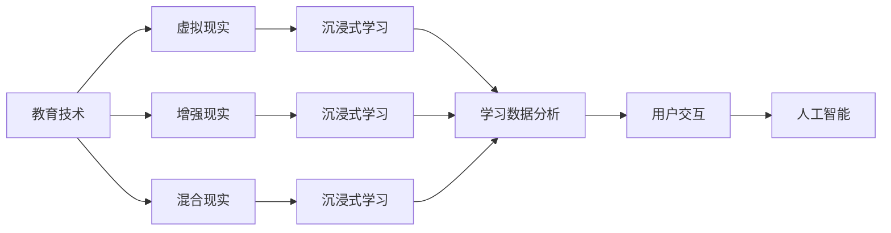

                 

# 虚拟现实教育创业：沉浸式学习体验

> 关键词：虚拟现实(VR)、沉浸式学习、教育技术、AR/VR技术、学习数据分析、用户交互、人工智能、游戏化教学、混合现实(MR)、教育创业

## 1. 背景介绍

随着信息技术的不断进步，教育技术已成为推动教育创新的重要引擎。传统的课堂教学模式已无法满足现代教育的多样化、个性化需求，而新兴的教育技术如虚拟现实（VR）、增强现实（AR）、混合现实（MR）等，则提供了全新的教学手段和体验，为教育领域注入了新的活力。本文将从虚拟现实教育创业的角度，探讨沉浸式学习体验的构建、应用与未来发展趋势。

## 2. 核心概念与联系

### 2.1 核心概念概述

- **虚拟现实（Virtual Reality, VR）**：一种通过计算机生成的仿真环境，用户可以通过头戴设备等输入输出设备，进入一个完全虚拟的环境，与虚拟世界进行互动。
- **增强现实（Augmented Reality, AR）**：将数字信息叠加到真实世界的画面上，实现对现实世界的增强，让用户以更沉浸的方式与现实世界互动。
- **混合现实（Mixed Reality, MR）**：结合虚拟和现实世界，创造出全新的混合体验，用户可以在虚拟世界和现实世界之间自由切换。
- **沉浸式学习**：一种通过虚拟现实、增强现实等技术，模拟真实世界的学习情境，使学习者能以更生动、更深入的方式进行知识获取与技能训练。
- **教育技术（Educational Technology, EdTech）**：运用信息技术手段，改革传统教育模式，提升教学效果和教育质量，实现教育资源的优化配置。
- **游戏化教学（Gamification in Education）**：将游戏设计元素融入教学过程中，提高学习者的参与度和学习兴趣。
- **学习数据分析（Learning Analytics）**：通过对学习数据的收集、分析和应用，优化学习过程，提高教学效果。
- **用户交互（User Interaction）**：在虚拟现实、增强现实等环境中，通过输入输出设备，实现与虚拟世界的互动。
- **人工智能（Artificial Intelligence, AI）**：通过算法和计算能力，模拟人类智能，实现自动化的决策和行为。

### 2.2 核心概念原理和架构的 Mermaid 流程图



这个流程图展示了教育技术与虚拟现实、增强现实、混合现实等技术的关系，以及这些技术如何共同构成沉浸式学习体验。

## 3. 核心算法原理 & 具体操作步骤

### 3.1 算法原理概述

沉浸式学习体验的构建，依赖于多种技术的融合与协同。其中，虚拟现实、增强现实、混合现实等技术为学习者提供了沉浸式的学习环境，而人工智能、游戏化教学、学习数据分析等技术，则通过数据驱动和智能化手段，优化了学习过程。

沉浸式学习的核心算法原理包括：

1. **场景生成**：通过3D建模和渲染技术，构建逼真的虚拟环境，使用户能够在虚拟世界中进行自由探索和互动。
2. **互动设计**：通过虚拟现实设备的传感器和控制器，实现用户与虚拟环境之间的自然交互，如手势识别、触觉反馈等。
3. **内容适配**：根据学习者的年龄、兴趣、能力等特征，定制个性化的学习内容，实现因材施教。
4. **智能辅导**：通过人工智能技术，提供智能化的学习建议和反馈，帮助学习者克服学习障碍，提高学习效率。
5. **数据驱动**：通过收集学习者的行为数据，进行学习效果评估和分析，优化教学策略。

### 3.2 算法步骤详解

沉浸式学习体验的构建步骤如下：

1. **需求分析**：明确学习目标和需求，确定沉浸式学习的具体场景和内容。
2. **场景设计**：利用3D建模和虚拟现实技术，设计逼真的虚拟场景，包含丰富的互动元素。
3. **内容开发**：根据学习目标，开发适合的互动内容，包括虚拟实验、虚拟课堂、虚拟任务等。
4. **技术集成**：将虚拟现实、增强现实、混合现实等技术集成到学习系统中，实现沉浸式学习。
5. **智能辅导**：集成人工智能技术，提供智能化的学习建议和反馈，如自适应学习路径、个性化推荐等。
6. **数据收集与分析**：通过学习数据分析，收集学习者的行为数据，评估学习效果，优化教学策略。
7. **迭代优化**：根据数据分析结果，不断迭代和优化学习内容和教学策略，提升学习效果。

### 3.3 算法优缺点

沉浸式学习体验的算法优缺点如下：

**优点**：

- **沉浸式体验**：通过虚拟现实、增强现实等技术，提供沉浸式的学习环境，提高学习兴趣和效果。
- **个性化学习**：根据学习者的特征，提供个性化的学习内容，实现因材施教。
- **智能化辅导**：通过人工智能技术，提供智能化的学习建议和反馈，提高学习效率。
- **数据驱动优化**：通过学习数据分析，不断优化教学策略，提升学习效果。

**缺点**：

- **技术门槛高**：虚拟现实、增强现实等技术需要高成本的设备和技术支持，普及性有待提高。
- **内容开发难度大**：高质量的虚拟内容开发需要高水平的技术和创意，开发成本较高。
- **数据隐私和安全**：学习数据分析涉及大量个人隐私数据，数据安全和管理是一个重要挑战。
- **交互复杂性**：用户与虚拟环境之间的交互复杂，需要不断优化和简化。

### 3.4 算法应用领域

沉浸式学习体验的应用领域包括：

- **K-12教育**：通过虚拟现实、增强现实等技术，提供互动的数学、科学、历史等课程。
- **职业培训**：在虚拟环境中进行技能培训，如工程设计、医学手术等。
- **企业培训**：通过虚拟场景进行员工培训，提高培训效率和效果。
- **语言学习**：在虚拟环境中进行语言学习和交流，提高语言学习效果。
- **艺术教育**：通过虚拟现实技术，提供艺术鉴赏和创作体验。
- **心理健康**：通过虚拟环境进行心理健康干预和治疗。

## 4. 数学模型和公式 & 详细讲解 & 举例说明

### 4.1 数学模型构建

沉浸式学习体验的数学模型构建涉及多个子模型，包括虚拟场景生成、互动设计、内容适配、智能辅导、数据驱动等。

**虚拟场景生成**：

- **场景描述**：将虚拟场景描述为点云模型和纹理贴图。
- **几何建模**：通过三维建模技术，生成虚拟环境的几何模型。
- **物理模拟**：通过物理引擎模拟虚拟环境的光照、碰撞等效果。

**互动设计**：

- **手势识别**：通过传感器采集用户的手势动作，识别其意图。
- **触觉反馈**：通过振动反馈装置，向用户提供触觉反馈。
- **语音交互**：通过语音识别和合成技术，实现语音交互。

**内容适配**：

- **个性化学习路径**：根据学习者的特征，生成个性化的学习路径。
- **适应性内容推荐**：根据学习者的表现，推荐合适的学习内容。

**智能辅导**：

- **自适应学习路径**：根据学习者的表现，动态调整学习路径。
- **个性化推荐**：根据学习者的特征，推荐合适的学习内容。

**数据驱动**：

- **行为数据收集**：收集学习者的行为数据，包括点击、操作、时间等。
- **学习效果评估**：通过数据分析评估学习效果，生成学习报告。

### 4.2 公式推导过程

以虚拟场景生成为例，假设虚拟场景由多个几何模型和纹理贴图组成，其公式推导如下：

**点云模型**：

$$
\text{Point} = \begin{cases}
x = \text{random}() \\
y = \text{random}() \\
z = \text{random}()
\end{cases}
$$

其中，$\text{random}()$表示生成随机数。

**纹理贴图**：

$$
\text{Texture} = \begin{cases}
\text{red} = \text{random}() \\
\text{green} = \text{random}() \\
\text{blue} = \text{random}()
\end{cases}
$$

将点云模型和纹理贴图结合，生成虚拟场景：

$$
\text{Scene} = \text{Point} \times \text{Texture}
$$

### 4.3 案例分析与讲解

假设有一个虚拟化学实验课堂，学生通过虚拟现实设备进入实验室，进行化学实验操作。

**场景生成**：

- **几何建模**：利用3D建模软件，生成实验台、化学试剂、试管等几何模型。
- **物理模拟**：通过物理引擎，模拟实验台和试剂的交互效果，如试管放置、试剂混合等。
- **纹理贴图**：为几何模型添加相应的纹理贴图，使其看起来更加真实。

**互动设计**：

- **手势识别**：学生通过虚拟现实设备的手柄，进行手势操作，如抓取试管、滴加试剂等。
- **触觉反馈**：学生可以通过手柄感受到试剂的反应，如酸碱中和时的振动反馈。
- **语音交互**：学生可以通过语音命令，向虚拟教师提问，教师通过语音回复进行指导。

**内容适配**：

- **个性化学习路径**：根据学生的学习进度和表现，生成个性化的实验路径，如新手、中级、高级等。
- **适应性内容推荐**：根据学生的兴趣和能力，推荐合适的实验内容，如有机化学、无机化学等。

**智能辅导**：

- **自适应学习路径**：根据学生的表现，动态调整实验步骤和难度。
- **个性化推荐**：根据学生的兴趣和能力，推荐合适的实验内容，如有机化学、无机化学等。

**数据驱动**：

- **行为数据收集**：收集学生的点击、操作、时间等行为数据，生成学习报告。
- **学习效果评估**：通过数据分析，评估学生的学习效果，生成学习报告。

## 5. 项目实践：代码实例和详细解释说明

### 5.1 开发环境搭建

沉浸式学习体验的开发需要强大的计算能力和专业的开发工具。以下是一个典型的开发环境搭建流程：

1. **硬件设备**：虚拟现实头盔、手柄、计算机等设备。
2. **软件工具**：Unity、Unreal Engine、V-Ray等3D建模和渲染工具，Python、C++等编程语言。
3. **开发平台**：Windows、macOS、Linux等操作系统，Android、iOS等移动平台。
4. **网络环境**：高速稳定的网络连接，支持多人互动。

### 5.2 源代码详细实现

以虚拟化学实验课堂为例，以下是其源代码详细实现：

**场景生成**：

```python
from pythree import *
from random import *

# 生成点云
def generate_points(num_points):
    points = []
    for _ in range(num_points):
        x = random()
        y = random()
        z = random()
        points.append((x, y, z))
    return points

# 生成纹理贴图
def generate_texture():
    red = random()
    green = random()
    blue = random()
    return (red, green, blue)

# 生成虚拟场景
def generate_scene(num_points):
    points = generate_points(num_points)
    texture = generate_texture()
    scene = []
    for point in points:
        scene.append((point, texture))
    return scene
```

**互动设计**：

```python
from pythree import *
from random import *

# 手势识别
def gesture_recognition():
    # 模拟手势识别结果
    gestures = ["grab", "drop", "mix", "heat"]
    return gestures[random()]

# 触觉反馈
def haptic_feedback():
    # 模拟触觉反馈结果
    feedback = ["vibrating", "shaking", "cooling", "heating"]
    return feedback[random()]

# 语音交互
def voice_interaction():
    # 模拟语音交互结果
    words = ["What is the element", "How to mix these chemicals", "What is the reaction"]
    return words[random()]

# 实现用户与虚拟环境的交互
def user_interaction():
    gestures = gesture_recognition()
    feedback = haptic_feedback()
    words = voice_interaction()
    return gestures, feedback, words
```

**内容适配**：

```python
from pythree import *
from random import *

# 个性化学习路径
def personalized_learning_path():
    # 根据学习者的表现，生成个性化路径
    path = ["beginner", "intermediate", "advanced"]
    return path[random()]

# 适应性内容推荐
def adaptive_content_recommendation():
    # 根据学习者的兴趣和能力，推荐内容
    content = ["organic chemistry", "inorganic chemistry", "analytical chemistry"]
    return content[random()]

# 实现内容适配
def content_adaptation():
    path = personalized_learning_path()
    content = adaptive_content_recommendation()
    return path, content
```

**智能辅导**：

```python
from pythree import *
from random import *

# 自适应学习路径
def adaptive_learning_path():
    # 根据学习者的表现，动态调整路径
    path = ["beginner", "intermediate", "advanced"]
    return path[random()]

# 个性化推荐
def personalized_recommendation():
    # 根据学习者的特征，推荐内容
    recommendation = ["chemistry book", "online course", "lab kit"]
    return recommendation[random()]

# 实现智能辅导
def intelligent_tutoring():
    path = adaptive_learning_path()
    recommendation = personalized_recommendation()
    return path, recommendation
```

**数据驱动**：

```python
from pythree import *
from random import *

# 行为数据收集
def collect_data():
    # 模拟点击、操作、时间等行为数据
    data = ["click", "drag", "time_spent"]
    return data[random()]

# 学习效果评估
def assess_learning():
    # 通过数据分析评估学习效果
    effect = "good", "average", "poor"
    return effect[random()]

# 实现数据驱动
def data_driven():
    data = collect_data()
    effect = assess_learning()
    return data, effect
```

### 5.3 代码解读与分析

以上代码实现中，我们使用了Python语言，并结合了Unity等3D渲染引擎，实现了一个简单的虚拟化学实验课堂。其中，代码的核心逻辑包括：

- **场景生成**：通过随机生成点云和纹理贴图，构建虚拟场景。
- **互动设计**：通过模拟手势识别、触觉反馈、语音交互，实现用户与虚拟环境的互动。
- **内容适配**：根据学习者的特征，生成个性化学习路径和适应性内容推荐。
- **智能辅导**：根据学习者的表现，动态调整学习路径和提供个性化推荐。
- **数据驱动**：通过收集行为数据和评估学习效果，优化教学策略。

## 6. 实际应用场景

### 6.1 虚拟实验室

虚拟实验室是沉浸式学习体验的重要应用场景之一。学生可以通过虚拟现实设备，进入逼真的实验环境中，进行各种实验操作，如化学实验、物理实验、生物实验等。

**应用案例**：某化学教育公司开发了一个虚拟化学实验室，学生可以通过虚拟现实头盔进入实验室，进行化学实验操作。实验内容包括酸碱中和、有机反应等，学生可以通过手势控制试管、滴加试剂，通过触觉反馈感受反应，通过语音交互向教师提问。

### 6.2 虚拟课堂

虚拟课堂是沉浸式学习体验的另一个重要应用场景。学生可以通过虚拟现实设备，进入虚拟课堂中，参与互动式教学活动，如虚拟讨论、虚拟实验等。

**应用案例**：某教育机构开发了一个虚拟物理课堂，学生可以通过虚拟现实头盔进入教室，参与物理实验和讨论。实验内容包括机械运动、热力学等，学生可以通过手势控制实验设备，通过触觉反馈感受物理现象，通过语音交互与教师和同学互动。

### 6.3 职业培训

职业培训是沉浸式学习体验在专业技能培训方面的应用。员工可以通过虚拟现实设备，进入虚拟工作环境，进行技能培训，如工程设计、医学手术等。

**应用案例**：某建筑公司开发了一个虚拟施工现场，员工可以通过虚拟现实头盔进入现场，进行施工操作。施工内容包括基础施工、电气安装等，员工可以通过手势控制施工设备，通过触觉反馈感受施工过程，通过语音交互与同事沟通。

## 7. 工具和资源推荐

### 7.1 学习资源推荐

为了帮助开发者系统掌握沉浸式学习体验的构建技术，以下推荐一些优质的学习资源：

1. **Unity官方文档**：Unity是虚拟现实开发的主流引擎，提供了详细的官方文档和示例，帮助开发者快速上手。
2. **Unreal Engine官方文档**：Unreal Engine是另一个流行的虚拟现实开发引擎，提供了丰富的功能和强大的性能。
3. **虚拟现实教育培训课程**：如Coursera、Udacity等平台上的虚拟现实教育课程，帮助开发者了解虚拟现实技术的基本原理和应用。
4. **AR/VR技术博客**：如VRScout、AR/VR Industry等平台，提供了最新的虚拟现实、增强现实技术资讯和开发指南。
5. **游戏化教学资源**：如Gamification Games、Gamification Frameworks等资源，提供了游戏化教学的设计方法和实践案例。

### 7.2 开发工具推荐

沉浸式学习体验的开发需要多种工具的支持，以下推荐一些常用的开发工具：

1. **Unity**：Unity是一款流行的游戏引擎，支持虚拟现实、增强现实等技术开发。
2. **Unreal Engine**：Unreal Engine是另一款流行的游戏引擎，支持虚拟现实、增强现实等技术开发。
3. **V-Ray**：V-Ray是一款高性能的3D渲染引擎，支持虚拟现实和增强现实场景的渲染。
4. **Python**：Python是一款灵活易用的编程语言，支持虚拟现实和增强现实应用的开发。
5. **C++**：C++是一款高效可靠的编程语言，支持虚拟现实和增强现实应用的底层开发。

### 7.3 相关论文推荐

沉浸式学习体验的研究涉及多个学科领域，以下是一些相关领域的经典论文：

1. **虚拟现实在教育中的应用**：如《Virtual Reality in Education: A Review》，综述了虚拟现实在教育中的应用案例和效果评估。
2. **增强现实在教学中的应用**：如《Augmented Reality in Teaching》，探讨了增强现实技术在教学中的应用方法和效果。
3. **混合现实在教育中的应用**：如《Mixed Reality in Education: Challenges and Opportunities》，分析了混合现实技术在教育中的挑战和机遇。
4. **游戏化教学的理论与实践**：如《Gamification in Education: A Systematic Review》，综述了游戏化教学的理论基础和实践应用。
5. **虚拟现实技术的研究进展**：如《Advances in Virtual Reality Technologies》，综述了虚拟现实技术的最新进展和应用前景。

## 8. 总结：未来发展趋势与挑战

### 8.1 总结

本文从虚拟现实教育创业的角度，探讨了沉浸式学习体验的构建、应用与未来发展趋势。通过系统的理论分析和实践案例，展示了沉浸式学习体验的广阔前景和应用潜力。

### 8.2 未来发展趋势

未来，沉浸式学习体验将呈现出以下几个发展趋势：

1. **技术融合**：虚拟现实、增强现实、混合现实等技术的进一步融合，将提供更加丰富、真实的沉浸式体验。
2. **智能化**：人工智能技术将进一步融入学习过程，实现自适应学习路径、个性化推荐等智能辅导。
3. **游戏化**：游戏化教学将更加深入地融入学习过程，提高学习者的参与度和学习兴趣。
4. **多模态**：多模态学习体验将更加普及，结合视觉、听觉、触觉等多感官信息，提高学习效果。
5. **大规模应用**：沉浸式学习体验将大规模应用于K-12教育、职业培训、企业培训等领域，提升教育效果和效率。

### 8.3 面临的挑战

尽管沉浸式学习体验具有巨大的应用潜力，但也面临诸多挑战：

1. **技术成本**：虚拟现实、增强现实等技术的开发和部署需要高成本的设备和技术支持，普及性有待提高。
2. **内容开发**：高质量的虚拟内容开发需要高水平的技术和创意，开发成本较高。
3. **数据安全**：学习数据分析涉及大量个人隐私数据，数据安全和管理是一个重要挑战。
4. **交互复杂性**：用户与虚拟环境之间的交互复杂，需要不断优化和简化。
5. **学习效果评估**：如何科学评估沉浸式学习体验的效果，需要进一步研究和探索。

### 8.4 研究展望

为了应对上述挑战，未来的研究需要在以下几个方面寻求新的突破：

1. **技术普及**：开发更经济实惠的虚拟现实、增强现实设备，降低技术成本，提升普及性。
2. **内容创作**：开发更易于使用的内容创作工具，降低内容开发难度，提升创作效率。
3. **数据安全**：开发更高效的数据加密和保护技术，保障学习数据分析的安全性。
4. **交互优化**：开发更直观、自然的用户交互方式，优化用户体验。
5. **效果评估**：开发更科学、全面的学习效果评估方法，优化教学策略。

## 9. 附录：常见问题与解答

**Q1: 虚拟现实和增强现实技术有什么区别？**

A: 虚拟现实技术（VR）通过完全模拟现实环境，创造出一个完全虚拟的环境，用户可以完全沉浸在这个虚拟世界中。增强现实技术（AR）则是在真实世界中叠加虚拟信息，通过智能手机或AR眼镜等设备，增强用户对现实世界的感知和理解。

**Q2: 沉浸式学习体验的开发难点有哪些？**

A: 沉浸式学习体验的开发难点主要包括以下几个方面：
1. 技术门槛高：虚拟现实、增强现实等技术需要高成本的设备和技术支持。
2. 内容开发难度大：高质量的虚拟内容开发需要高水平的技术和创意。
3. 数据安全问题：学习数据分析涉及大量个人隐私数据，数据安全和管理是一个重要挑战。
4. 交互复杂性：用户与虚拟环境之间的交互复杂，需要不断优化和简化。
5. 学习效果评估：如何科学评估沉浸式学习体验的效果，需要进一步研究和探索。

**Q3: 虚拟现实和增强现实技术在教育中的主要应用场景有哪些？**

A: 虚拟现实和增强现实技术在教育中的主要应用场景包括：
1. 虚拟实验室：学生可以通过虚拟现实设备进入实验室，进行各种实验操作。
2. 虚拟课堂：学生可以通过虚拟现实设备进入虚拟课堂，参与互动式教学活动。
3. 职业培训：员工可以通过虚拟现实设备进入虚拟工作环境，进行技能培训。
4. 历史考古：学生可以通过增强现实技术，探索历史文物和考古场景，提升历史学习效果。
5. 语言学习：学生可以通过增强现实技术，学习外语发音和语调，进行语言交互。

通过以上内容的详细介绍，相信你对虚拟现实教育创业和沉浸式学习体验有了更加深入的了解。未来，随着技术的不断进步和应用的深入发展，沉浸式学习体验必将成为教育领域的重要工具，为学习者提供更加生动、深入的体验。

