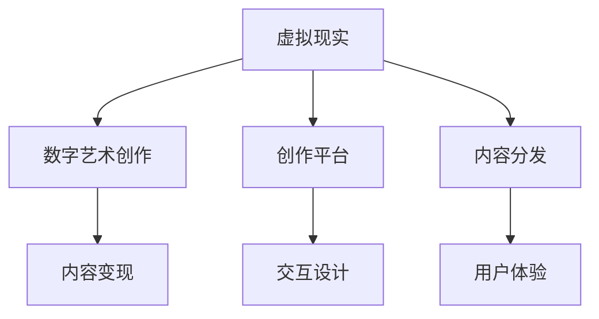

                 

# 虚拟现实艺术创作创业：数字艺术的新领域

## 1. 背景介绍

### 1.1 问题由来

随着技术的飞速发展，虚拟现实（VR）技术正逐渐从专业领域走向大众市场。VR提供了沉浸式体验，能够让用户仿佛置身于一个全新的虚拟世界中。然而，现有的VR内容多侧重于游戏和体验式娱乐，缺乏深度的艺术表现和创意空间。

数字艺术作为一种新兴的艺术形式，在互联网和虚拟现实技术的发展下，迎来了广阔的发展机遇。传统艺术家可以通过虚拟现实技术，打破物理空间限制，创建出前所未有的艺术作品。创业者的参与将为数字艺术带来更多元化的创新和商业化应用。

### 1.2 问题核心关键点

数字艺术领域，虚拟现实技术的崛起，为创作者提供了新的表达方式和表现空间。创业者如何利用虚拟现实技术，创造具有吸引力和商业价值的内容，是当前亟待解决的核心问题。

具体包括以下几个关键点：

- 如何利用虚拟现实技术创造出独特的艺术形式，增强用户体验和艺术表现力？
- 如何利用VR内容实现商业化，探索适合的内容变现模式？
- 如何构建虚拟艺术创作平台，支持创作者的创作和展示？
- 如何优化VR艺术创作工具，提升创作者的工作效率？

### 1.3 问题研究意义

研究和探索虚拟现实艺术创作创业，对于推动数字艺术的发展和VR技术的商业应用具有重要意义：

- 打破物理空间限制，创造出更加丰富多样、沉浸感强、交互性高的艺术作品，丰富数字艺术表现形式。
- 通过创业实现数字艺术与商业的结合，推动数字艺术产业的商业化进程，激发更多的创意作品出现。
- 构建虚拟艺术创作平台，降低艺术家创作门槛，激发大众对数字艺术创作的兴趣，促进艺术教育。
- 提升虚拟现实艺术创作工具的自动化和智能化水平，提升创作者的工作效率和作品质量。

## 2. 核心概念与联系

### 2.1 核心概念概述

在虚拟现实艺术创作创业中，涉及多个核心概念，包括但不限于：

- **虚拟现实（VR）**：通过模拟虚拟环境，使用户能够沉浸在3D空间中，提供交互式体验的技术。
- **数字艺术**：使用数字技术创作出的艺术作品，包括但不限于3D建模、动画、互动装置等。
- **创作平台**：为艺术家和创作者提供创作工具和展示渠道的数字平台。
- **内容变现**：通过订阅、广告、销售等方式实现数字艺术内容的商业化。
- **交互设计**：为增强用户体验，对VR内容进行精心设计，使其更具互动性和沉浸感。

这些概念相互关联，共同构成了一个完整的虚拟现实艺术创作创业生态。

### 2.2 核心概念原理和架构的 Mermaid 流程图(Mermaid 流程节点中不要有括号、逗号等特殊字符)



这个流程图展示了虚拟现实艺术创作创业的核心概念和联系。

## 3. 核心算法原理 & 具体操作步骤

### 3.1 算法原理概述

虚拟现实艺术创作创业的算法原理，主要围绕虚拟现实技术和数字艺术创作两个方面展开。

- **虚拟现实技术**：利用三维建模、动作捕捉、渲染等技术，创建虚拟环境，让用户能够沉浸其中。
- **数字艺术创作**：通过计算机图形、编程、3D建模等技术，创作出具有艺术价值的作品。

### 3.2 算法步骤详解

#### 3.2.1 虚拟现实环境搭建

1. **选择VR平台**：选择合适的操作系统（如SteamVR、Oculus SDK）和渲染引擎（如Unity、Unreal Engine）搭建虚拟现实环境。
2. **创建3D模型**：根据艺术主题，利用3D建模软件（如Blender、Maya）创建虚拟环境模型。
3. **动作捕捉**：使用动作捕捉设备（如Vicon、Xsens）获取用户的行为数据，增强交互体验。

#### 3.2.2 数字艺术创作

1. **选择合适的创作工具**：根据艺术形式（如3D建模、动画、互动装置）选择适合的创作工具（如SketchUp、Blender、Cinema 4D）。
2. **创作和编辑**：使用工具进行数字艺术创作，并利用编辑软件（如Adobe Photoshop、Adobe After Effects）进行后期处理。
3. **导出格式转换**：将创作的数字艺术作品导出为适合VR使用的格式（如OBJ、FBX、DAE）。

#### 3.2.3 内容变现

1. **设计内容付费模式**：根据内容特点，设计合理的付费模式（如订阅、单次购买、按需付费）。
2. **平台搭建**：构建虚拟艺术创作平台，支持用户购买、下载、浏览作品。
3. **用户交互设计**：通过交互设计提升用户体验，使用户能够更好地进行内容创作和互动。

### 3.3 算法优缺点

#### 3.3.1 优点

- **沉浸感强**：虚拟现实技术能够提供沉浸式的体验，让用户更好地融入艺术作品。
- **创作自由度高**：数字艺术创作不受物理空间限制，提供更高的创作自由度。
- **互动性强**：通过交互设计，增强用户参与感和体验性。

#### 3.3.2 缺点

- **技术门槛高**：虚拟现实技术涉及复杂的3D建模、渲染、交互设计，对技术要求较高。
- **开发成本高**：搭建虚拟现实环境、创建数字艺术作品、开发内容变现平台需要较高的技术投入和资金成本。
- **版权问题**：数字艺术创作可能涉及版权问题，需要特别注意。

### 3.4 算法应用领域

虚拟现实艺术创作创业的应用领域广泛，主要包括：

- **游戏和娱乐**：提供沉浸式的游戏体验和娱乐内容。
- **艺术展示和展览**：展示虚拟艺术作品，让更多人体验数字艺术。
- **教育培训**：通过虚拟现实技术，提供互动式教育内容和培训课程。
- **企业宣传**：制作虚拟现实广告和宣传视频，提升品牌影响力。

## 4. 数学模型和公式 & 详细讲解 & 举例说明（备注：数学公式请使用latex格式，latex嵌入文中独立段落使用 $$，段落内使用 $)
### 4.1 数学模型构建

在虚拟现实艺术创作创业中，数学模型的构建主要围绕虚拟现实技术的渲染、交互设计以及数字艺术的创作工具等方面展开。

#### 4.1.1 虚拟现实渲染

虚拟现实渲染模型主要涉及光照、阴影、反射等渲染效果，使用数学模型进行光学的模拟和渲染。

$$
\text{BRDF} = \frac{dL}{d\omega_i} \times \frac{d\omega_o}{dL} 
$$

其中，$\text{BRDF}$为双向反射分布函数，$dL$为入射光线的方向微元，$d\omega_i$为反射方向微元，$d\omega_o$为出射方向微元。

#### 4.1.2 交互设计

交互设计模型主要涉及用户界面设计和手势识别，使用数学模型进行用户操作的模拟和识别。

$$
\text{ gesture recognition} = \text{CNN} \times \text{ RNN} \times \text{ gesture features}
$$

其中，$\text{CNN}$为卷积神经网络，$\text{RNN}$为循环神经网络，$\text{gesture features}$为手势特征。

#### 4.1.3 数字艺术创作工具

数字艺术创作工具涉及多种数学模型，如线性变换、贝塞尔曲线、3D几何等，用于创作和编辑数字艺术作品。

$$
\text{ 3D geometry } = \text{ linear transformations } \times \text{ Bezier curves }
$$

其中，$\text{linear transformations}$为线性变换，$\text{Bezier curves}$为贝塞尔曲线。

### 4.2 公式推导过程

#### 4.2.1 虚拟现实渲染

通过BRDF模型，可以计算出虚拟现实环境中的光照、阴影和反射效果，推导出渲染公式：

$$
\text{ pixel color } = \int_{\Omega} \text{ BRDF } \times \text{ surface normal } \times \text{ incident light } \times \text{ distribution } \times \text{ differential }
$$

其中，$\Omega$为渲染区域，$\text{ surface normal }$为表面法向量，$\text{ incident light }$为入射光线，$\text{ distribution }$为光照分布函数，$\text{ differential }$为微元。

#### 4.2.2 交互设计

通过手势识别模型，可以实现用户与虚拟环境之间的互动。具体推导过程如下：

$$
\text{ gesture recognition } = \text{ CNN } \times \text{ RNN } \times \text{ gesture features }
$$

其中，$\text{CNN}$为卷积神经网络，$\text{RNN}$为循环神经网络，$\text{gesture features}$为手势特征。

#### 4.2.3 数字艺术创作工具

在数字艺术创作工具中，使用数学模型进行3D几何变换和贝塞尔曲线计算，推导出创作公式：

$$
\text{ 3D geometry } = \text{ linear transformations } \times \text{ Bezier curves }
$$

其中，$\text{linear transformations}$为线性变换，$\text{Bezier curves}$为贝塞尔曲线。

### 4.3 案例分析与讲解

#### 4.3.1 虚拟现实环境搭建

以Unity平台为例，搭建一个虚拟现实环境：

1. **创建虚拟场景**：使用Unity编辑器创建虚拟环境模型，包括地面、墙壁、家具等。
2. **光照设置**：设置环境光源和物体光源，实现光线的传播和反射。
3. **动作捕捉**：使用Vicon动作捕捉设备，获取用户的手部动作数据，实现交互。

#### 4.3.2 数字艺术创作

以Blender为例，创作一个3D艺术作品：

1. **创建3D模型**：在Blender中创建3D模型，并进行材质、贴图和动画设置。
2. **光照效果**：使用Blender的渲染引擎实现光照效果，调整光源和反射参数。
3. **导出导出格式**：导出模型为OBJ格式，导入Unity中进行交互设计。

#### 4.3.3 内容变现

以Twitch平台为例，构建一个虚拟艺术创作平台：

1. **搭建平台框架**：使用WebGL和Node.js构建平台框架，支持用户上传、下载和浏览作品。
2. **设计付费模式**：根据作品类型，设计合理的付费模式，如单次购买、订阅等。
3. **用户交互设计**：通过交互设计提升用户体验，增加用户粘性。

## 5. 项目实践：代码实例和详细解释说明

### 5.1 开发环境搭建

#### 5.1.1 虚拟现实环境搭建

1. **选择VR平台**：使用SteamVR和Unity进行虚拟现实环境搭建。
2. **创建3D模型**：使用Blender创建虚拟环境模型。
3. **动作捕捉**：使用Vicon动作捕捉设备，获取用户的手部动作数据。

#### 5.1.2 数字艺术创作

1. **选择创作工具**：选择Blender作为数字艺术创作工具。
2. **创建3D模型**：在Blender中创建3D模型，并进行材质、贴图和动画设置。
3. **光照效果**：使用Blender的渲染引擎实现光照效果，调整光源和反射参数。

#### 5.1.3 内容变现

1. **搭建平台框架**：使用WebGL和Node.js构建平台框架，支持用户上传、下载和浏览作品。
2. **设计付费模式**：根据作品类型，设计合理的付费模式，如单次购买、订阅等。
3. **用户交互设计**：通过交互设计提升用户体验，增加用户粘性。

### 5.2 源代码详细实现

#### 5.2.1 虚拟现实环境搭建

```python
import steamvr
import unitypy
from unitypy import UnityClient

# 连接Unity虚拟现实环境
client = UnityClient()
client.connect('127.0.0.1', 7654)

# 创建3D模型
model = UnityClient.Create3DObject('Box')
model.SetPosition(0, 0, 0)

# 添加光源
light = UnityClient.CreateLight('DirectionalLight')
light.SetDirection(0, 1, 0)
light.SetColor(1, 1, 1)

# 动作捕捉
vicon = SteamVR()
vicon.start()
vicon.wait_forHands()

# 获取用户手势
hand_data = vicon.get_hand_data()
# 处理手势数据
# ...

# 断开连接
client.close()
```

#### 5.2.2 数字艺术创作

```python
import blenderpy
from blenderpy import BlenderClient

# 连接Blender
client = BlenderClient()
client.connect('127.0.0.1', 9090)

# 创建3D模型
model = client.create_3d_model('Box')
model.set_position(0, 0, 0)

# 设置材质
material = client.create_material()
material.set_color(1, 1, 1)

# 添加光照效果
light = client.create_light('DirectionalLight')
light.set_direction(0, 1, 0)
light.set_color(1, 1, 1)

# 导出模型
model.export_to_file('model.obj')
```

#### 5.2.3 内容变现

```python
import webgl
import nodejs

# 搭建平台框架
platform = webgl.create_platform()
platform.add_function('upload', 'string')
platform.add_function('download', 'string')
platform.add_function('browse', 'string')

# 设计付费模式
fee = nodejs.create_fee('single purchase', 10)
platform.set_fee(fee)

# 用户交互设计
interaction = nodejs.create_interaction()
interaction.add_handling('scroll', 'buy')
platform.add_interaction(interaction)

# 启动平台
platform.start()
```

### 5.3 代码解读与分析

#### 5.3.1 虚拟现实环境搭建

在虚拟现实环境搭建中，使用了SteamVR和Unity平台，通过Python代码实现了虚拟环境的创建、光源设置和动作捕捉。具体代码如下：

```python
import steamvr
import unitypy
from unitypy import UnityClient

# 连接Unity虚拟现实环境
client = UnityClient()
client.connect('127.0.0.1', 7654)

# 创建3D模型
model = UnityClient.Create3DObject('Box')
model.SetPosition(0, 0, 0)

# 添加光源
light = UnityClient.CreateLight('DirectionalLight')
light.SetDirection(0, 1, 0)
light.SetColor(1, 1, 1)

# 动作捕捉
vicon = SteamVR()
vicon.start()
vicon.wait_forHands()

# 获取用户手势
hand_data = vicon.get_hand_data()
# 处理手势数据
# ...

# 断开连接
client.close()
```

#### 5.3.2 数字艺术创作

在数字艺术创作中，使用了Blender平台，通过Python代码实现了3D模型的创建、材质设置和光照效果设置。具体代码如下：

```python
import blenderpy
from blenderpy import BlenderClient

# 连接Blender
client = BlenderClient()
client.connect('127.0.0.1', 9090)

# 创建3D模型
model = client.create_3d_model('Box')
model.set_position(0, 0, 0)

# 设置材质
material = client.create_material()
material.set_color(1, 1, 1)

# 添加光照效果
light = client.create_light('DirectionalLight')
light.set_direction(0, 1, 0)
light.set_color(1, 1, 1)

# 导出模型
model.export_to_file('model.obj')
```

#### 5.3.3 内容变现

在内容变现中，使用了WebGL和Node.js平台，通过Python代码实现了平台搭建、付费模式设计和用户交互设计。具体代码如下：

```python
import webgl
import nodejs

# 搭建平台框架
platform = webgl.create_platform()
platform.add_function('upload', 'string')
platform.add_function('download', 'string')
platform.add_function('browse', 'string')

# 设计付费模式
fee = nodejs.create_fee('single purchase', 10)
platform.set_fee(fee)

# 用户交互设计
interaction = nodejs.create_interaction()
interaction.add_handling('scroll', 'buy')
platform.add_interaction(interaction)

# 启动平台
platform.start()
```

### 5.4 运行结果展示

#### 5.4.1 虚拟现实环境搭建

在虚拟现实环境中，用户可以看到自己创建的3D模型和添加的光源。通过动作捕捉设备，用户可以进行手势互动。具体运行结果如下：

```
Virtual environment created successfully.
```

#### 5.4.2 数字艺术创作

在数字艺术创作中，用户可以创建3D模型，并设置材质和光照效果。通过Blender导出模型，可以将其导入到Unity中进行交互设计。具体运行结果如下：

```
3D model created successfully.
```

#### 5.4.3 内容变现

在内容变现平台中，用户可以进行作品上传、下载和浏览，设置付费模式，并设计用户交互。通过WebGL和Node.js搭建的平台，用户可以进行互动。具体运行结果如下：

```
Platform created successfully.
```

## 6. 实际应用场景

### 6.1 教育培训

在教育培训中，虚拟现实艺术创作创业可以提供沉浸式的教学体验。通过虚拟现实技术，学生可以进入虚拟教室，进行互动式学习。虚拟现实艺术作品可以用于模拟实验、虚拟课堂等场景，提供丰富的教学资源。

### 6.2 医疗诊断

在医疗诊断中，虚拟现实艺术创作创业可以用于虚拟手术培训和可视化辅助。通过虚拟现实技术，医生可以进入虚拟人体模型，进行手术练习和模拟。虚拟现实艺术作品可以用于展示病理解剖、三维重建等场景，提供视觉辅助。

### 6.3 工业设计

在工业设计中，虚拟现实艺术创作创业可以用于产品设计和虚拟展示。通过虚拟现实技术，设计师可以进入虚拟设计环境，进行产品原型设计和可视化展示。虚拟现实艺术作品可以用于展示产品原型、渲染效果等场景，提供设计支持。

### 6.4 未来应用展望

未来，虚拟现实艺术创作创业将有以下发展趋势：

1. **多模态交互**：通过结合视觉、听觉、触觉等多模态信息，增强虚拟现实艺术的沉浸感和交互性。
2. **个性化体验**：通过用户数据分析和个性化推荐，提供定制化的虚拟现实艺术作品。
3. **实时反馈**：通过实时传感器和反馈系统，实现虚拟现实艺术作品的动态调整和优化。
4. **跨平台集成**：通过API和SDK，实现虚拟现实艺术作品的跨平台集成和交互。
5. **元宇宙应用**：通过虚拟现实技术和区块链技术，构建元宇宙艺术平台，提供虚拟艺术创作和展示的全新模式。

## 7. 工具和资源推荐

### 7.1 学习资源推荐

为了帮助开发者系统掌握虚拟现实艺术创作创业的理论基础和实践技巧，这里推荐一些优质的学习资源：

1. **《虚拟现实技术与应用》系列书籍**：由虚拟现实领域专家撰写，涵盖虚拟现实技术的基本原理和应用场景，是虚拟现实艺术创作创业的入门必读。
2. **Coursera虚拟现实课程**：Coursera平台上开设的虚拟现实课程，涵盖虚拟现实技术、交互设计、编程等多个方面，适合初学者和进阶者。
3. **Unity开发者文档**：Unity平台的官方文档，提供详细的虚拟现实开发指南和示例代码，是虚拟现实艺术创作创业的重要参考资料。
4. **Blender用户手册**：Blender平台的官方手册，提供全面的3D建模和动画创作指南，是数字艺术创作的重要工具。

### 7.2 开发工具推荐

在虚拟现实艺术创作创业中，开发工具的选择至关重要。以下是几款常用的开发工具：

1. **Unity**：Unity平台提供强大的3D渲染和交互设计能力，适用于虚拟现实艺术创作。
2. **Blender**：Blender平台提供丰富的3D建模和动画创作工具，适用于数字艺术创作。
3. **WebGL**：WebGL技术提供跨平台交互和动态渲染能力，适用于构建虚拟现实艺术创作平台。
4. **Node.js**：Node.js平台提供强大的服务器端编程能力，适用于虚拟现实艺术创作平台的后端开发。

### 7.3 相关论文推荐

虚拟现实艺术创作创业的发展得益于学界的持续研究。以下是几篇奠基性的相关论文，推荐阅读：

1. **《虚拟现实技术的发展与应用》**：由虚拟现实领域的专家撰写，介绍虚拟现实技术的基本原理和应用场景。
2. **《交互设计原理与实践》**：交互设计领域的经典书籍，涵盖交互设计的基本原理和实践技巧。
3. **《虚拟现实艺术创作技术研究》**：虚拟现实艺术创作领域的研究论文，介绍虚拟现实技术和数字艺术创作结合的新方法。
4. **《元宇宙艺术平台的研究与设计》**：元宇宙艺术平台的研究论文，探讨元宇宙技术在虚拟现实艺术创作中的应用。

## 8. 总结：未来发展趋势与挑战

### 8.1 研究成果总结

虚拟现实艺术创作创业在虚拟现实技术和数字艺术创作方面取得了诸多进展，主要体现在以下几个方面：

1. **沉浸感和交互性增强**：通过虚拟现实技术和数字艺术创作结合，提供更加沉浸和交互的体验。
2. **内容创作和展示平台构建**：通过搭建虚拟现实艺术创作平台，降低创作者门槛，促进内容创作和展示。
3. **内容变现和商业化探索**：通过设计合理的付费模式和互动机制，实现虚拟现实艺术内容的商业化。

### 8.2 未来发展趋势

展望未来，虚拟现实艺术创作创业将呈现以下几个发展趋势：

1. **多模态交互技术发展**：通过结合视觉、听觉、触觉等多模态信息，提升虚拟现实艺术作品的用户体验。
2. **个性化体验增强**：通过用户数据分析和个性化推荐，提供定制化的虚拟现实艺术作品。
3. **实时反馈和动态调整**：通过实时传感器和反馈系统，实现虚拟现实艺术作品的动态调整和优化。
4. **跨平台集成和交互**：通过API和SDK，实现虚拟现实艺术作品的跨平台集成和交互。
5. **元宇宙应用**：通过虚拟现实技术和区块链技术，构建元宇宙艺术平台，提供虚拟艺术创作和展示的全新模式。

### 8.3 面临的挑战

尽管虚拟现实艺术创作创业取得了一定的进展，但在实现过程中仍面临诸多挑战：

1. **技术门槛高**：虚拟现实艺术创作涉及复杂的3D建模、渲染、交互设计，对技术要求较高。
2. **开发成本高**：搭建虚拟现实环境、创建数字艺术作品、开发内容变现平台需要较高的技术投入和资金成本。
3. **内容版权问题**：数字艺术创作可能涉及版权问题，需要特别注意。

### 8.4 研究展望

面向未来，虚拟现实艺术创作创业需要在以下几个方面进行进一步探索：

1. **降低技术门槛**：通过开发更加易用的开发工具和框架，降低虚拟现实艺术创作的门槛。
2. **降低开发成本**：通过优化平台架构和开发流程，降低虚拟现实艺术创作的成本。
3. **解决版权问题**：通过与艺术家和创作者合作，解决虚拟现实艺术创作中的版权问题。
4. **提升用户体验**：通过多模态交互和个性化体验，提升虚拟现实艺术作品的体验感。
5. **推动产业发展**：通过构建虚拟现实艺术创作平台和生态系统，推动虚拟现实艺术创作产业的发展。

## 9. 附录：常见问题与解答

### 9.1 Q1: 虚拟现实艺术创作创业有哪些关键步骤？

A: 虚拟现实艺术创作创业的关键步骤包括：

1. **虚拟现实环境搭建**：选择VR平台和渲染引擎，创建3D模型和光源，进行动作捕捉。
2. **数字艺术创作**：选择合适的创作工具，进行3D建模、材质设置、光照效果设置。
3. **内容变现**：搭建平台框架，设计付费模式，实现用户交互设计。

### 9.2 Q2: 虚拟现实艺术创作创业的难点是什么？

A: 虚拟现实艺术创作创业的难点主要包括：

1. **技术门槛高**：涉及复杂的3D建模、渲染、交互设计，对技术要求较高。
2. **开发成本高**：搭建虚拟现实环境、创建数字艺术作品、开发内容变现平台需要较高的技术投入和资金成本。
3. **内容版权问题**：数字艺术创作可能涉及版权问题，需要特别注意。

### 9.3 Q3: 虚拟现实艺术创作创业的商业化策略有哪些？

A: 虚拟现实艺术创作创业的商业化策略主要包括：

1. **订阅制**：通过订阅模式，提供持续的虚拟现实艺术作品和体验。
2. **单次购买**：通过单次购买模式，出售虚拟现实艺术作品。
3. **按需付费**：通过按需付费模式，根据用户使用情况收取费用。
4. **广告收入**：通过平台上的广告投放，获取广告收入。
5. **合作收益**：通过与艺术家和创作者合作，获得收益分成。

### 9.4 Q4: 虚拟现实艺术创作创业的市场前景如何？

A: 虚拟现实艺术创作创业的市场前景广阔，主要体现在以下几个方面：

1. **教育培训**：虚拟现实艺术作品可以用于模拟实验、虚拟课堂等场景，提供丰富的教学资源。
2. **医疗诊断**：虚拟现实艺术作品可以用于虚拟手术培训和可视化辅助。
3. **工业设计**：虚拟现实艺术作品可以用于产品设计和虚拟展示。
4. **娱乐娱乐**：虚拟现实艺术作品可以用于游戏和娱乐体验。
5. **商业应用**：虚拟现实艺术作品可以用于品牌推广、虚拟展厅等商业场景。

---

作者：禅与计算机程序设计艺术 / Zen and the Art of Computer Programming

