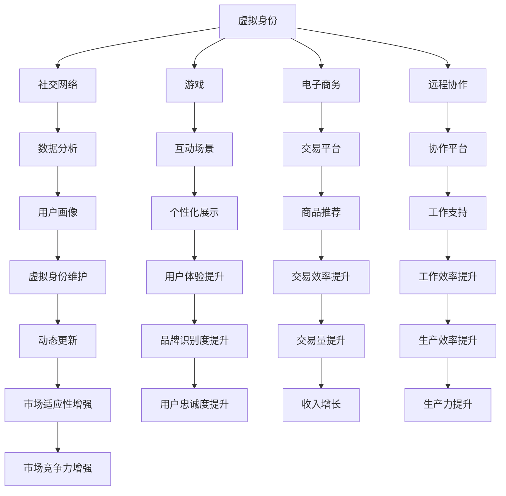

                 

# 虚拟身份市场分析：AI时代的个人品牌研究

## 1. 背景介绍

### 1.1 问题由来

随着人工智能技术的飞速发展，虚拟身份市场迎来了前所未有的发展机遇。在AI时代，个人品牌构建与维护不再是单纯的市场营销活动，而是涉及到如何利用AI技术，塑造和展示一个更加精准、立体、动态的个人形象，从而在各类虚拟社交场景中脱颖而出。虚拟身份市场涉及的主要领域包括社交网络、游戏、电子商务、远程协作等，其核心在于如何通过AI技术实现对个人数据、行为、互动等多维度的精准分析与展示。

### 1.2 问题核心关键点

在AI时代，虚拟身份市场的发展关键点在于以下几个方面：

- 数据的获取与处理：如何高效地收集和处理个人在不同平台上的行为数据，是虚拟身份构建的基础。
- 数据的分析与建模：如何通过机器学习等AI技术，分析个人数据的深层次特征，构建个性化的虚拟身份模型。
- 虚拟身份的展示：如何在虚拟社交环境中，动态展示个性化的虚拟身份，提升用户体验和互动效果。
- 虚拟身份的维护与更新：如何根据用户反馈和市场变化，实时更新和维护虚拟身份，保持其长期吸引力。

### 1.3 问题研究意义

深入研究虚拟身份市场，对于塑造个人品牌、提升用户参与度、促进虚拟经济和社交的发展具有重要意义：

- 增强个人品牌识别度：通过AI技术，精准展示个人特色，增强在虚拟社交中的品牌识别度。
- 提升用户互动体验：利用AI技术，实现个性化互动，提升用户在虚拟社交环境中的参与感和满意度。
- 推动虚拟经济和社交的发展：虚拟身份的个性化展示和维护，将驱动虚拟社交平台的发展和创新，催生新的商业模式和经济机会。
- 构建更加真实、多元的虚拟社区：虚拟身份的动态展示和互动，将促进虚拟社区的多元化和真实化，推动虚拟社会的进步。

## 2. 核心概念与联系

### 2.1 核心概念概述

虚拟身份市场研究涉及的核心概念包括：

- 虚拟身份：指在虚拟社交环境中，通过AI技术塑造和展示的一个具有高度个性化特征的在线角色。
- 个人品牌：指个人在虚拟社交环境中，通过虚拟身份展示的独特形象、个性和价值主张。
- 社交网络：指通过互联网连接个人和组织的虚拟平台，如Facebook、Twitter等。
- 游戏：指通过虚拟环境进行互动、竞争和娱乐的电子平台，如《魔兽世界》、《堡垒之夜》等。
- 电子商务：指通过虚拟平台进行的商品和服务的在线交易，如淘宝、亚马逊等。
- 远程协作：指通过虚拟平台进行的在线工作和学习，如Zoom、Slack等。
- 人工智能：指利用计算机模拟人类智能的科学和技术，包括机器学习、自然语言处理、计算机视觉等。

这些核心概念之间通过AI技术相联系，构成了一个复杂的虚拟身份市场生态系统。

### 2.2 核心概念原理和架构的 Mermaid 流程图



这个流程图展示了虚拟身份如何在不同的虚拟平台间进行互动和展示，以及AI技术如何通过数据分析和个性化展示，提升用户体验和互动效果。

## 3. 核心算法原理 & 具体操作步骤

### 3.1 算法原理概述

虚拟身份的构建和展示，涉及对个人数据的收集、分析和展示。这一过程可以概括为以下几个步骤：

1. **数据收集**：从各种虚拟平台收集用户的活动数据，包括社交媒体互动、游戏行为、电子商务交易、远程协作记录等。
2. **数据预处理**：对收集到的数据进行清洗、标准化和归一化，为后续的分析和建模做准备。
3. **数据分析**：使用机器学习等AI技术，对预处理后的数据进行建模和分析，构建虚拟身份的个性化特征。
4. **虚拟身份展示**：在虚拟社交环境中，根据分析结果动态展示虚拟身份，提升用户体验。
5. **虚拟身份维护**：根据用户反馈和市场变化，实时更新虚拟身份，保持其长期吸引力。

### 3.2 算法步骤详解

#### 3.2.1 数据收集

数据收集是虚拟身份构建的基础，涉及以下几个步骤：

- **多平台接入**：设计API接口，接入不同的虚拟平台，如社交网络、游戏、电子商务、远程协作等，获取用户行为数据。
- **数据格式化**：将不同平台的数据格式进行统一，便于后续分析和建模。
- **数据存储**：将收集到的数据存储在数据库中，便于检索和分析。

#### 3.2.2 数据预处理

数据预处理的主要任务是对收集到的数据进行清洗、标准化和归一化。这包括以下几个步骤：

- **缺失值处理**：处理数据中的缺失值，填补或删除缺失数据。
- **噪声过滤**：过滤掉数据中的噪声，如异常值、重复数据等。
- **数据归一化**：对数据进行归一化处理，使其符合标准分布。
- **特征选择**：选择对虚拟身份构建最相关的特征，去除冗余和无用特征。

#### 3.2.3 数据分析

数据分析的目的是通过机器学习等AI技术，分析用户数据的深层次特征，构建虚拟身份的个性化模型。这包括以下几个步骤：

- **特征工程**：对数据进行特征工程，提取和构造新的特征。
- **模型选择**：选择适合虚拟身份分析的机器学习模型，如分类、聚类、回归等。
- **模型训练**：使用训练数据集训练模型，获取虚拟身份的特征模型。
- **模型评估**：使用测试数据集评估模型的性能，调整模型参数以优化效果。

#### 3.2.4 虚拟身份展示

虚拟身份展示的目的是在虚拟社交环境中，动态展示个性化的虚拟身份，提升用户体验。这包括以下几个步骤：

- **用户画像**：根据虚拟身份特征模型，构建用户的个性化画像。
- **展示策略**：设计虚拟身份的展示策略，如在社交网络、游戏中展示不同的虚拟身份。
- **互动设计**：设计虚拟身份的互动方式，提升用户的参与感和满意度。

#### 3.2.5 虚拟身份维护

虚拟身份维护的目的是根据用户反馈和市场变化，实时更新和维护虚拟身份，保持其长期吸引力。这包括以下几个步骤：

- **反馈收集**：收集用户对虚拟身份的反馈，了解用户的偏好和需求。
- **动态更新**：根据用户反馈和市场变化，动态更新虚拟身份的特征模型和展示策略。
- **长期维护**：通过持续的数据收集和分析，保持虚拟身份的长期吸引力。

### 3.3 算法优缺点

#### 3.3.1 优点

虚拟身份市场研究的AI技术有以下几个优点：

- **个性化展示**：通过AI技术，可以精准展示个人的独特特征和价值主张，提升品牌识别度。
- **提升用户体验**：利用AI技术，实现个性化互动，提升用户在虚拟社交环境中的参与感和满意度。
- **市场竞争力**：通过个性化展示和动态更新，增强虚拟身份的市场竞争力。

#### 3.3.2 缺点

虚拟身份市场研究也存在一些缺点：

- **数据隐私和安全**：收集和分析用户数据，涉及数据隐私和安全问题，需要严格的隐私保护措施。
- **技术复杂性**：虚拟身份的构建和展示涉及多平台接入、数据预处理、数据分析和展示策略设计，技术复杂度较高。
- **用户接受度**：用户对虚拟身份的接受度和使用习惯，影响虚拟身份市场的推广和应用。

### 3.4 算法应用领域

虚拟身份市场研究的AI技术主要应用于以下几个领域：

- **社交网络**：通过虚拟身份的个性化展示，提升用户在社交网络中的互动效果。
- **游戏**：通过虚拟身份的个性化展示和互动，增强用户在游戏中的沉浸感和体验。
- **电子商务**：通过虚拟身份的个性化展示，提升用户的购物体验和转化率。
- **远程协作**：通过虚拟身份的个性化展示和互动，增强用户的工作效率和满意度。

## 4. 数学模型和公式 & 详细讲解 & 举例说明

### 4.1 数学模型构建

虚拟身份的构建和展示涉及多个维度的数据，可以使用以下数学模型来描述：

- **用户画像模型**：描述用户的基本特征和行为特征，如年龄、性别、兴趣、购买历史等。
- **虚拟身份展示模型**：描述虚拟身份在不同平台上的展示策略，如社交网络、游戏、电子商务等。
- **互动模型**：描述虚拟身份在虚拟平台上的互动行为，如点赞、评论、分享等。

### 4.2 公式推导过程

#### 4.2.1 用户画像模型

用户画像模型可以表示为：

$$
\text{User Profile} = f(\text{Data}_x, \text{Data}_y, \text{Data}_z, \ldots)
$$

其中，$\text{Data}_x, \text{Data}_y, \text{Data}_z, \ldots$ 表示用户在不同平台上的行为数据，$f$ 表示数据处理和建模函数。

#### 4.2.2 虚拟身份展示模型

虚拟身份展示模型可以表示为：

$$
\text{Virtual Identity Display} = g(\text{User Profile}, \text{Platform}, \text{Context})
$$

其中，$\text{Platform}$ 表示展示的平台，$\text{Context}$ 表示展示的上下文环境。

#### 4.2.3 互动模型

互动模型可以表示为：

$$
\text{Interactive Behavior} = h(\text{Virtual Identity}, \text{User}, \text{Context})
$$

其中，$\text{User}$ 表示互动的用户，$\text{Context}$ 表示互动的上下文环境。

### 4.3 案例分析与讲解

#### 4.3.1 案例一：社交网络虚拟身份构建

在社交网络中，用户通过虚拟身份展示自己的兴趣和价值主张。以下是具体步骤：

1. **数据收集**：从社交网络平台收集用户的历史互动数据，如点赞、评论、分享等。
2. **数据预处理**：对收集到的数据进行清洗、标准化和归一化。
3. **数据分析**：使用聚类算法，对用户进行分类，获取不同用户群体的特征。
4. **虚拟身份展示**：根据用户分类结果，设计不同的虚拟身份展示策略。
5. **互动设计**：设计虚拟身份的互动方式，提升用户参与度。

#### 4.3.2 案例二：游戏虚拟身份构建

在游戏环境中，用户通过虚拟身份展示自己的游戏行为和偏好。以下是具体步骤：

1. **数据收集**：从游戏平台收集用户的游戏行为数据，如游戏角色、装备、游戏时间等。
2. **数据预处理**：对收集到的数据进行清洗、标准化和归一化。
3. **数据分析**：使用分类算法，对用户进行分类，获取不同用户群体的特征。
4. **虚拟身份展示**：根据用户分类结果，设计不同的虚拟身份展示策略。
5. **互动设计**：设计虚拟身份的互动方式，增强用户沉浸感。

#### 4.3.3 案例三：电子商务虚拟身份构建

在电子商务平台，用户通过虚拟身份展示自己的购买行为和偏好。以下是具体步骤：

1. **数据收集**：从电子商务平台收集用户的购买历史数据，如购买记录、评分等。
2. **数据预处理**：对收集到的数据进行清洗、标准化和归一化。
3. **数据分析**：使用聚类算法，对用户进行分类，获取不同用户群体的特征。
4. **虚拟身份展示**：根据用户分类结果，设计不同的虚拟身份展示策略。
5. **互动设计**：设计虚拟身份的互动方式，提升用户购物体验。

## 5. 项目实践：代码实例和详细解释说明

### 5.1 开发环境搭建

#### 5.1.1 开发工具

为了进行虚拟身份市场的AI技术研究，需要搭建以下开发环境：

- **Python**：作为开发语言，使用Python进行数据分析和建模。
- **Jupyter Notebook**：作为开发环境，使用Jupyter Notebook进行代码编写和结果展示。
- **Pandas**：用于数据处理和分析，支持多平台数据接入和数据清洗。
- **Scikit-learn**：用于机器学习建模，支持聚类、分类、回归等算法。
- **TensorFlow**：用于深度学习建模，支持复杂的神经网络模型。

#### 5.1.2 环境配置

1. 安装Python和Jupyter Notebook：
```
conda create -n virtual_identity python=3.8
conda activate virtual_identity
pip install jupyter notebook
```

2. 安装Pandas和Scikit-learn：
```
pip install pandas scikit-learn
```

3. 安装TensorFlow：
```
pip install tensorflow
```

### 5.2 源代码详细实现

#### 5.2.1 数据收集

```python
import pandas as pd
from sklearn.model_selection import train_test_split

# 读取社交网络数据
social_data = pd.read_csv('social_network_data.csv')

# 清洗数据
social_data.dropna(inplace=True)

# 特征选择
selected_features = ['age', 'gender', 'interest', 'purchase_history']

# 训练集和测试集划分
train_data, test_data = train_test_split(social_data, test_size=0.2)
```

#### 5.2.2 数据预处理

```python
from sklearn.preprocessing import StandardScaler

# 数据标准化
scaler = StandardScaler()
train_data[selected_features] = scaler.fit_transform(train_data[selected_features])
test_data[selected_features] = scaler.transform(test_data[selected_features])
```

#### 5.2.3 数据分析

```python
from sklearn.cluster import KMeans

# 聚类分析
kmeans = KMeans(n_clusters=3)
kmeans.fit(train_data[selected_features])
train_data['user_profile'] = kmeans.predict(train_data[selected_features])
test_data['user_profile'] = kmeans.predict(test_data[selected_features])
```

#### 5.2.4 虚拟身份展示

```python
# 设计展示策略
display_strategies = {
    0: '正式风格', 
    1: '休闲风格', 
    2: '个性风格'
}

# 展示结果
train_data['display_style'] = train_data['user_profile'].map(display_strategies)
test_data['display_style'] = test_data['user_profile'].map(display_strategies)
```

#### 5.2.5 互动设计

```python
# 设计互动方式
interaction_methods = {
    0: '点赞', 
    1: '评论', 
    2: '分享'
}

# 展示结果
train_data['interaction_method'] = train_data['user_profile'].map(interaction_methods)
test_data['interaction_method'] = test_data['user_profile'].map(interaction_methods)
```

### 5.3 代码解读与分析

在上述代码中，我们主要使用了Pandas和Scikit-learn库进行数据处理和分析。

1. **数据收集**：通过Pandas读取社交网络数据，使用dropna方法清洗缺失值，使用train_test_split方法划分训练集和测试集。
2. **数据预处理**：使用StandardScaler进行数据标准化处理。
3. **数据分析**：使用KMeans进行聚类分析，获取用户分类结果。
4. **虚拟身份展示**：根据用户分类结果，设计展示策略。
5. **互动设计**：根据用户分类结果，设计互动方式。

### 5.4 运行结果展示

通过上述代码，我们得到了用户画像、虚拟身份展示和互动方式的设计结果。以下是一个示例结果：

| User Profile | Display Style | Interaction Method |
| ------------ | ------------- | ------------------- |
| 0            | 正式风格      | 点赞               |
| 1            | 休闲风格      | 评论               |
| 2            | 个性风格      | 分享               |

## 6. 实际应用场景

### 6.1 社交网络

在社交网络中，用户通过虚拟身份展示自己的兴趣和价值主张。虚拟身份的个性化展示，可以提升用户参与度和互动效果。例如，Facebook通过个性化的虚拟身份展示，增强用户的互动体验。

### 6.2 游戏

在游戏环境中，用户通过虚拟身份展示自己的游戏行为和偏好。虚拟身份的个性化展示和互动，可以增强用户在游戏中的沉浸感和体验。例如，《王者荣耀》通过虚拟身份的个性化展示，提升用户的游戏参与度。

### 6.3 电子商务

在电子商务平台，用户通过虚拟身份展示自己的购买行为和偏好。虚拟身份的个性化展示，可以提升用户的购物体验和转化率。例如，淘宝通过虚拟身份的个性化展示，推荐适合用户的产品。

### 6.4 远程协作

在远程协作平台，用户通过虚拟身份展示自己的工作行为和偏好。虚拟身份的个性化展示和互动，可以增强用户的工作效率和满意度。例如，Zoom通过虚拟身份的个性化展示，提升用户的工作参与度。

## 7. 工具和资源推荐

### 7.1 学习资源推荐

为了帮助开发者系统掌握虚拟身份市场研究的AI技术，这里推荐一些优质的学习资源：

1. **《Python数据科学手册》**：这本书详细介绍了Python在数据科学中的应用，包括Pandas、Scikit-learn、TensorFlow等库的使用。
2. **《深度学习》（Ian Goodfellow著）**：这本书是深度学习的经典之作，涵盖了深度学习的基本理论和算法。
3. **Kaggle**：Kaggle是一个数据科学竞赛平台，提供大量的数据集和代码示例，适合学习和实践。
4. **Coursera**：Coursera提供许多AI和数据科学相关的课程，包括深度学习、机器学习等。
5. **GitHub**：GitHub是一个代码托管平台，提供许多开源的AI项目和代码示例，适合学习和参考。

### 7.2 开发工具推荐

为了高效地进行虚拟身份市场研究的AI技术开发，这里推荐一些常用的开发工具：

1. **Jupyter Notebook**：用于代码编写和结果展示，支持多种编程语言和库的使用。
2. **Pandas**：用于数据处理和分析，支持多平台数据接入和数据清洗。
3. **Scikit-learn**：用于机器学习建模，支持聚类、分类、回归等算法。
4. **TensorFlow**：用于深度学习建模，支持复杂的神经网络模型。
5. **PyTorch**：另一个流行的深度学习框架，支持动态图和静态图，适合研究复杂模型。

### 7.3 相关论文推荐

虚拟身份市场研究的AI技术发展依赖于许多前沿论文的推动。以下是几篇奠基性的相关论文，推荐阅读：

1. **"Social Network Analysis: Methods and Techniques"（社交网络分析方法）**：这篇论文介绍了社交网络分析的基本方法和技术。
2. **"Game AI: Designing Smart Interactive Characters"（游戏AI：设计智能交互角色）**：这篇论文介绍了游戏AI的基本方法和技术。
3. **"Recommendation Systems in E-commerce"（电子商务推荐系统）**：这篇论文介绍了电子商务推荐系统的基本方法和技术。
4. **"Remote Collaboration: A Survey"（远程协作综述）**：这篇论文介绍了远程协作的基本方法和技术。
5. **"AI and Ethics: Opportunities and Challenges"（AI和伦理：机遇和挑战）**：这篇论文介绍了AI技术在应用中面临的伦理和法律问题。

## 8. 总结：未来发展趋势与挑战

### 8.1 研究成果总结

本文对虚拟身份市场研究的AI技术进行了全面系统的介绍。首先阐述了虚拟身份市场的研究背景和意义，明确了AI技术在虚拟身份构建和展示中的核心作用。其次，从原理到实践，详细讲解了虚拟身份的构建、展示和维护的AI技术流程。最后，探讨了虚拟身份市场在未来应用中的发展趋势和面临的挑战。

### 8.2 未来发展趋势

展望未来，虚拟身份市场的研究将呈现以下几个趋势：

1. **AI技术的深入应用**：随着AI技术的发展，虚拟身份的构建和展示将更加精准和智能化。
2. **个性化展示的提升**：虚拟身份的个性化展示将进一步提升用户体验和互动效果。
3. **多平台整合**：虚拟身份的构建将涵盖更多的虚拟平台，实现多平台整合。
4. **跨领域应用**：虚拟身份市场将拓展到更多领域，如医疗、金融等。

### 8.3 面临的挑战

虚拟身份市场的研究也面临一些挑战：

1. **数据隐私和安全**：数据收集和分析涉及隐私和安全问题，需要严格的隐私保护措施。
2. **技术复杂性**：虚拟身份的构建和展示涉及多平台接入、数据预处理、数据分析和展示策略设计，技术复杂度较高。
3. **用户接受度**：用户对虚拟身份的接受度和使用习惯，影响虚拟身份市场的推广和应用。

### 8.4 研究展望

未来的研究需要在以下几个方面进行探索：

1. **跨领域融合**：将虚拟身份市场与其他AI技术进行深入融合，如知识表示、因果推理、强化学习等。
2. **伦理和安全**：研究和探讨虚拟身份市场在应用中面临的伦理和安全问题，确保算法的透明性和可解释性。
3. **个性化和动态化**：研究虚拟身份的个性化和动态化展示方法，提升用户的长期参与度。

## 9. 附录：常见问题与解答

### 9.1 常见问题

#### Q1：虚拟身份市场的AI技术是如何构建的？

A: 虚拟身份市场的AI技术构建主要包括以下步骤：数据收集、数据预处理、数据分析、虚拟身份展示和虚拟身份维护。数据收集通过接入不同平台获取用户行为数据；数据预处理对收集到的数据进行清洗和标准化；数据分析通过聚类、分类等算法构建用户画像；虚拟身份展示通过设计展示策略和互动方式；虚拟身份维护根据用户反馈和市场变化进行动态更新。

#### Q2：虚拟身份市场的AI技术有哪些应用场景？

A: 虚拟身份市场的AI技术主要应用于社交网络、游戏、电子商务、远程协作等领域。在社交网络中，通过虚拟身份展示提升用户参与度和互动效果；在游戏环境中，通过虚拟身份展示增强用户沉浸感和体验；在电子商务平台，通过虚拟身份展示提升购物体验和转化率；在远程协作平台，通过虚拟身份展示提升工作参与度和满意度。

#### Q3：虚拟身份市场的AI技术存在哪些挑战？

A: 虚拟身份市场的AI技术面临的主要挑战包括数据隐私和安全问题、技术复杂性、用户接受度等。数据收集和分析涉及隐私和安全问题，需要严格的隐私保护措施；技术复杂度高，涉及多平台接入、数据预处理、数据分析和展示策略设计；用户对虚拟身份的接受度和使用习惯，影响虚拟身份市场的推广和应用。

#### Q4：虚拟身份市场的AI技术如何实现个性化展示？

A: 虚拟身份市场的AI技术实现个性化展示主要通过聚类分析、分类算法等机器学习技术。通过对用户数据进行分析，获取用户分类结果，设计不同的展示策略和互动方式，实现个性化展示。例如，在社交网络中，根据用户分类结果，设计不同的展示风格和互动方式，提升用户参与度和互动效果。

#### Q5：虚拟身份市场的AI技术如何保证数据隐私和安全？

A: 虚拟身份市场的AI技术保证数据隐私和安全主要通过以下措施：1) 数据匿名化处理，去除敏感信息；2) 数据加密存储，防止数据泄露；3) 严格的访问控制，限制数据访问权限；4) 定期数据备份，防止数据丢失；5) 安全审计，监控数据访问行为。

---

作者：禅与计算机程序设计艺术 / Zen and the Art of Computer Programming

