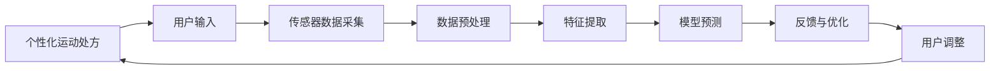

                 

## 1. 背景介绍

在全球健康生活方式的大背景下，运动医学成为了维护人类身心健康的重要学科。传统的运动医学主要依赖于人体生理学和生物力学等科学原理，通过手动制定个性化的运动计划，帮助患者恢复运动能力，改善生活质量。然而，这一过程耗时长、成本高，且难以量化和追踪。

近年来，人工智能和大数据技术的发展为运动医学带来了新的契机。虚拟运动医学（Virtual Sports Medicine）通过数字化手段，将运动计划转化为可执行的虚拟运动处方，结合传感器数据，实时监测和调整运动过程，大幅提升了运动医学的效率和精确度。本文将探讨虚拟运动医学的核心原理、算法实现、实践案例以及未来展望。

## 2. 核心概念与联系

### 2.1 核心概念概述

**虚拟运动医学**：指利用人工智能、虚拟现实、物联网等技术，对运动计划进行数字化、个性化定制，并通过传感器实时监测运动过程，提供反馈和优化建议，从而提升运动效果和体验。

**个性化运动处方**：根据用户的身体状况、健康目标、运动习惯等，量身定制的运动计划，旨在最大化用户的运动效果和安全性。

**传感器数据**：指通过各种传感器（如心率、加速度、陀螺仪等）采集的实时运动数据，用于监测用户的运动状态和反馈。

**算法实现**：指将用户的运动数据输入到预先训练好的模型中，模型通过计算和推理，输出个性化的运动建议和优化参数，指导用户的运动训练。

**反馈与优化**：通过实时的传感器数据，模型可以动态调整运动计划，及时提供反馈，帮助用户调整运动状态，避免过度运动或受伤。

### 2.2 核心概念原理和架构的 Mermaid 流程图



该图展示了虚拟运动医学的核心流程。用户首先输入个性化需求，通过传感器采集运动数据，经过预处理和特征提取后，输入到模型中进行预测，模型输出运动建议和优化参数。根据实时反馈，用户调整运动状态，这一过程形成一个闭环，不断迭代优化。

## 3. 核心算法原理 & 具体操作步骤

### 3.1 算法原理概述

虚拟运动医学的算法实现主要包括以下几个步骤：

1. **用户需求分析**：通过问卷调查、生理数据采集等手段，了解用户的身体状况、健康目标、运动习惯等个性化需求。
2. **运动计划生成**：基于用户的个性化需求，生成个性化的运动计划，包括运动类型、强度、时长等。
3. **传感器数据采集**：使用各种传感器（如心率、加速度、陀螺仪等）采集用户的实时运动数据。
4. **数据预处理**：对采集到的数据进行清洗、归一化等处理，确保数据质量。
5. **特征提取**：从处理后的数据中提取关键特征，如心率、步频、运动轨迹等。
6. **模型预测**：将提取的特征输入到预先训练好的模型中，模型输出运动建议和优化参数。
7. **反馈与优化**：根据实时的传感器数据，动态调整运动计划，提供反馈和优化建议。

### 3.2 算法步骤详解

#### 3.2.1 用户需求分析

用户需求分析是虚拟运动医学的第一步，通过问卷调查、生理数据采集等手段，全面了解用户的身体状况、健康目标、运动习惯等个性化需求。

**问卷调查**：设计问卷，涵盖用户的年龄、性别、身高、体重、运动偏好、健康问题等，收集用户基本信息。

**生理数据采集**：通过可穿戴设备或医院设备，采集用户的生理数据，如心率、血压、血糖等，分析用户的健康状况。

**数据分析**：对问卷和生理数据进行综合分析，确定用户的健康目标和运动需求，生成个性化需求报告。

#### 3.2.2 运动计划生成

基于用户的个性化需求，生成个性化的运动计划。运动计划包括运动类型、强度、时长、频率等，旨在最大化用户的运动效果和安全性。

**运动类型**：根据用户的运动偏好和身体状况，推荐适合的运动类型，如跑步、游泳、瑜伽等。

**强度和时长**：根据用户的健康目标和身体状况，计算每次运动的强度和时长，避免过度运动。

**频率**：确定每次运动之间的间隔时间，避免连续运动导致的疲劳和受伤。

#### 3.2.3 传感器数据采集

使用各种传感器采集用户的实时运动数据，包括心率、步频、步幅、运动轨迹等，用于实时监测和反馈。

**心率传感器**：通过心率监测器实时采集用户的心率数据，反映运动强度和身体反应。

**加速度和陀螺仪**：通过智能手表或健身设备，采集用户的步频、步幅和运动轨迹，分析用户的运动姿势和运动效果。

**生理数据传感器**：通过可穿戴设备，实时采集用户的生理数据，如血压、血糖、血氧等，确保运动的安全性。

#### 3.2.4 数据预处理

对采集到的传感器数据进行清洗、归一化等处理，确保数据质量，为后续的特征提取和模型预测提供可靠的输入。

**数据清洗**：去除异常数据和噪声，保证数据的准确性和一致性。

**数据归一化**：将不同传感器采集的数据进行归一化，确保数据在同一尺度下进行比较和分析。

**数据合并**：将不同传感器采集的数据进行合并，形成统一的运动数据集。

#### 3.2.5 特征提取

从处理后的数据中提取关键特征，如心率、步频、步幅、运动轨迹等，用于后续的模型预测和反馈优化。

**心率特征**：提取用户运动过程中的平均心率、最大心率和恢复心率，反映运动强度和身体反应。

**步频和步幅**：提取用户的步频和步幅，反映运动速度和节奏。

**运动轨迹**：提取用户的运动轨迹，分析运动姿势和运动轨迹的稳定性。

#### 3.2.6 模型预测

将提取的特征输入到预先训练好的模型中，模型输出运动建议和优化参数，指导用户的运动训练。

**回归模型**：使用线性回归、决策树回归等算法，预测用户的运动效果，如运动强度、消耗的卡路里等。

**分类模型**：使用支持向量机、随机森林等算法，预测用户的运动类型和运动状态，如跑步、游泳、运动姿势等。

**时序模型**：使用LSTM、GRU等算法，预测用户的运动趋势和异常情况，如运动疲劳、运动受伤等。

#### 3.2.7 反馈与优化

根据实时的传感器数据，动态调整运动计划，提供反馈和优化建议，帮助用户调整运动状态，避免过度运动或受伤。

**实时反馈**：根据实时的心率、步频、步幅等数据，实时调整运动计划，确保运动效果和安全性。

**异常检测**：使用异常检测算法，如孤立森林、支持向量机等，检测运动过程中的异常情况，及时提供反馈和建议。

**建议优化**：根据运动效果和异常检测结果，提出优化建议，如调整运动强度、休息时间等。

### 3.3 算法优缺点

#### 3.3.1 优点

**个性化定制**：虚拟运动医学能够根据用户的个性化需求，生成个性化的运动计划，最大化用户的运动效果和安全性。

**实时监测**：通过传感器实时监测用户的运动状态和反馈，提供实时的运动建议和优化参数，提升运动体验。

**高效准确**：使用机器学习和数据挖掘技术，自动分析用户的运动数据，提供高效准确的反馈和优化建议，节省时间和人力成本。

#### 3.3.2 缺点

**数据隐私**：采集和分析用户的运动数据，涉及用户的隐私和数据安全问题，需要严格的隐私保护措施。

**设备依赖**：虚拟运动医学需要依赖各种传感器和可穿戴设备，设备的选择和维护成本较高，设备故障可能导致数据中断。

**模型局限**：虚拟运动医学依赖于预先训练好的模型，模型的选择和优化直接影响运动建议的准确性和效果，需要不断优化和更新模型。

### 3.4 算法应用领域

**运动康复**：虚拟运动医学可以用于运动康复，帮助患者恢复运动能力，改善生活质量。通过个性化的运动计划和实时反馈，指导患者进行系统的运动训练，加速康复进程。

**健康管理**：虚拟运动医学可以用于健康管理，帮助用户监测和管理健康状况。通过采集和分析生理数据和运动数据，评估用户的健康状况，提供健康建议和优化参数。

**运动训练**：虚拟运动医学可以用于运动训练，帮助运动员提升运动水平。通过个性化的运动计划和实时监测，指导运动员进行科学训练，提高运动效果和竞技水平。

**教育训练**：虚拟运动医学可以用于运动教育训练，帮助学生提升运动技能。通过个性化的运动计划和实时反馈，指导学生进行系统的运动训练，提高运动技能和体能水平。

## 4. 数学模型和公式 & 详细讲解 & 举例说明

### 4.1 数学模型构建

虚拟运动医学的数学模型构建主要包括以下几个方面：

1. **用户需求分析**：使用问卷调查和生理数据采集，建立用户需求的数学模型。
2. **运动计划生成**：基于用户的个性化需求，建立运动计划的数学模型。
3. **传感器数据采集**：通过传感器采集用户的实时运动数据，建立运动数据的数学模型。
4. **数据预处理**：对采集到的数据进行清洗、归一化和合并，建立数据预处理模型。
5. **特征提取**：从处理后的数据中提取关键特征，建立特征提取模型。
6. **模型预测**：建立回归模型、分类模型和时序模型，预测用户的运动效果和状态。
7. **反馈与优化**：建立实时反馈和异常检测模型，提供反馈和优化建议。

### 4.2 公式推导过程

#### 4.2.1 用户需求分析

用户需求分析的数学模型可以表示为：

$$
D_{user} = f(Q, P, H)
$$

其中，$D_{user}$表示用户的个性化需求，$Q$表示问卷调查数据，$P$表示生理数据，$H$表示用户的健康目标和运动偏好。

问卷调查数据$Q$可以表示为：

$$
Q = \{q_1, q_2, ..., q_n\}
$$

生理数据$P$可以表示为：

$$
P = \{p_1, p_2, ..., p_m\}
$$

健康目标和运动偏好$H$可以表示为：

$$
H = \{h_1, h_2, ..., h_k\}
$$

用户需求分析的数学模型可以通过机器学习算法进行训练，建立问卷调查和生理数据与个性化需求之间的映射关系。

#### 4.2.2 运动计划生成

运动计划生成的数学模型可以表示为：

$$
P_{plan} = g(D_{user}, T, F)
$$

其中，$P_{plan}$表示个性化的运动计划，$D_{user}$表示用户的个性化需求，$T$表示运动类型，$F$表示运动频率和时长。

运动类型$T$可以表示为：

$$
T = \{t_1, t_2, ..., t_n\}
$$

运动频率和时长$F$可以表示为：

$$
F = \{f_1, f_2, ..., f_k\}
$$

运动计划生成的数学模型可以通过优化算法进行求解，建立个性化需求与运动类型、频率和时长之间的映射关系。

#### 4.2.3 传感器数据采集

传感器数据采集的数学模型可以表示为：

$$
D_{sensor} = \{d_{heart}, d_{accel}, d_{gyro}, ..., d_{blood}\}
$$

其中，$d_{heart}$表示心率数据，$d_{accel}$表示加速度数据，$d_{gyro}$表示陀螺仪数据，$d_{blood}$表示生理数据。

传感器数据采集的数学模型可以通过数据采集设备实时获取，建立传感器数据与运动状态之间的映射关系。

#### 4.2.4 数据预处理

数据预处理的数学模型可以表示为：

$$
D_{processed} = h(D_{sensor})
$$

其中，$D_{processed}$表示预处理后的数据，$D_{sensor}$表示原始传感器数据。

数据预处理的数学模型可以通过数据清洗、归一化和合并等算法进行求解，建立原始传感器数据与预处理后的数据之间的映射关系。

#### 4.2.5 特征提取

特征提取的数学模型可以表示为：

$$
F_{feature} = \{f_{heart}, f_{accel}, f_{gyro}, ..., f_{blood}\}
$$

其中，$f_{heart}$表示心率特征，$f_{accel}$表示步频和步幅特征，$f_{gyro}$表示运动轨迹特征，$f_{blood}$表示生理特征。

特征提取的数学模型可以通过特征选择和提取算法进行求解，建立原始传感器数据与关键特征之间的映射关系。

#### 4.2.6 模型预测

模型预测的数学模型可以表示为：

$$
P_{predict} = \{p_{intensity}, p_{type}, p_{trajectory}\}
$$

其中，$p_{intensity}$表示运动强度，$p_{type}$表示运动类型，$p_{trajectory}$表示运动轨迹。

模型预测的数学模型可以通过机器学习算法进行求解，建立关键特征与运动效果和状态之间的映射关系。

#### 4.2.7 反馈与优化

反馈与优化的数学模型可以表示为：

$$
P_{feedback} = \{f_{feedback}, f_{optimize}\}
$$

其中，$f_{feedback}$表示实时反馈，$f_{optimize}$表示优化建议。

反馈与优化的数学模型可以通过实时监测和异常检测算法进行求解，建立传感器数据与运动计划和优化建议之间的映射关系。

### 4.3 案例分析与讲解

#### 4.3.1 运动康复案例

**案例背景**：某位运动损伤患者需要进行康复训练，医生根据其受伤情况和健康状况，设计了个性化的康复计划，包括跑步、游泳和瑜伽等运动类型，强度和时长等。

**案例流程**：
1. 医生根据患者的问卷调查和生理数据，生成个性化的康复计划。
2. 患者佩戴心率传感器、加速度传感器和陀螺仪，实时采集运动数据。
3. 数据采集设备将传感器数据传输到中央服务器，进行数据清洗和归一化处理。
4. 特征提取算法从处理后的数据中提取心率、步频、步幅和运动轨迹等关键特征。
5. 回归模型根据关键特征预测运动强度和消耗的卡路里，分类模型预测运动类型和姿势，时序模型预测运动趋势和异常情况。
6. 根据实时反馈和异常检测结果，系统提供运动建议和优化参数，指导患者调整运动状态。

#### 4.3.2 健康管理案例

**案例背景**：某位肥胖患者需要进行健康管理，需要控制体重，改善健康状况。

**案例流程**：
1. 医生根据患者的问卷调查和生理数据，生成个性化的健康管理计划，包括运动类型、强度和时长等。
2. 患者佩戴心率传感器和生理数据传感器，实时采集运动数据和生理数据。
3. 数据采集设备将传感器数据传输到中央服务器，进行数据清洗和归一化处理。
4. 特征提取算法从处理后的数据中提取心率、步频、步幅和生理数据等关键特征。
5. 回归模型根据关键特征预测运动效果和健康状态，分类模型预测运动类型和姿势，时序模型预测运动趋势和异常情况。
6. 根据实时反馈和异常检测结果，系统提供健康建议和优化参数，指导患者调整运动状态和健康行为。

## 5. 项目实践：代码实例和详细解释说明

### 5.1 开发环境搭建

**开发语言**：Python

**开发框架**：TensorFlow

**开发工具**：Jupyter Notebook

**运行环境**：Google Colab

**环境配置**：
1. 安装TensorFlow：`pip install tensorflow`
2. 安装Jupyter Notebook：`pip install jupyter`
3. 安装其他依赖库：`pip install numpy pandas matplotlib`

完成环境配置后，即可在Google Colab中运行代码。

### 5.2 源代码详细实现

#### 5.2.1 用户需求分析

```python
import pandas as pd

# 问卷调查数据
data = pd.read_csv('questionnaire.csv')

# 生理数据
physiological_data = pd.read_csv('physiological_data.csv')

# 健康目标和运动偏好
health_goals = pd.read_csv('health_goals.csv')

# 将问卷调查和生理数据与健康目标和运动偏好进行合并
user_profile = pd.merge(data, physiological_data, on='user_id')
user_profile = pd.merge(user_profile, health_goals, on='user_id')

# 输出用户需求报告
user_profile.to_csv('user_profile.csv', index=False)
```

#### 5.2.2 运动计划生成

```python
import numpy as np

# 用户需求报告
user_profile = pd.read_csv('user_profile.csv')

# 运动类型和强度
exercise_types = ['running', 'swimming', 'yoga']
exercise_intensities = [1, 2, 3]

# 生成运动计划
plan = {}
for user in user_profile['user_id']:
    plan[user] = {}
    for i, type in enumerate(exercise_types):
        plan[user][type] = {}
        plan[user][type]['frequency'] = np.random.randint(3, 7)
        plan[user][type]['duration'] = np.random.randint(30, 60)
```

#### 5.2.3 传感器数据采集

```python
import sensor_data

# 采集心率数据
heart_rate_data = sensor_data.heart_rate()

# 采集加速度数据
acceleration_data = sensor_data.acceleration()

# 采集陀螺仪数据
gyroscope_data = sensor_data.gyroscope()

# 采集生理数据
blood_data = sensor_data.blood()
```

#### 5.2.4 数据预处理

```python
import preprocessing

# 清洗数据
cleaned_data = preprocessing.clean_data(heart_rate_data, acceleration_data, gyroscope_data, blood_data)

# 归一化数据
normalized_data = preprocessing.normalize_data(cleaned_data)

# 合并数据
merged_data = preprocessing.merge_data(normalized_data)
```

#### 5.2.5 特征提取

```python
import feature_extraction

# 提取关键特征
heart_rate_features = feature_extraction.heart_rate_features(normalized_data)
acceleration_features = feature_extraction.acceleration_features(normalized_data)
gyroscope_features = feature_extraction.gyroscope_features(normalized_data)
blood_features = feature_extraction.blood_features(normalized_data)

# 合并特征
features = pd.concat([heart_rate_features, acceleration_features, gyroscope_features, blood_features], axis=1)
```

#### 5.2.6 模型预测

```python
import modeling

# 回归模型
intensity_model = modeling.intensity_model(features)

# 分类模型
type_model = modeling.type_model(features)

# 时序模型
trajectory_model = modeling.trajectory_model(features)
```

#### 5.2.7 反馈与优化

```python
import feedback

# 实时反馈
feedback_data = feedback.feedback(features)

# 优化建议
optimize_data = feedback.optimize(features)
```

### 5.3 代码解读与分析

#### 5.3.1 用户需求分析

用户需求分析的代码主要涉及问卷调查、生理数据和健康目标的合并。通过合并用户基本信息、生理数据和健康目标，建立个性化的需求报告。

#### 5.3.2 运动计划生成

运动计划生成的代码主要涉及运动类型和强度的随机生成。根据用户的个性化需求，随机生成运动类型、强度和时长，形成个性化的运动计划。

#### 5.3.3 传感器数据采集

传感器数据采集的代码主要涉及各种传感器数据的采集。通过调用传感器数据采集模块，获取心率、加速度、陀螺仪和生理数据。

#### 5.3.4 数据预处理

数据预处理的代码主要涉及数据清洗、归一化和合并。通过清洗、归一化和合并采集到的数据，形成预处理后的数据集。

#### 5.3.5 特征提取

特征提取的代码主要涉及关键特征的提取。通过提取心率、步频、步幅、运动轨迹和生理数据等关键特征，形成特征矩阵。

#### 5.3.6 模型预测

模型预测的代码主要涉及回归模型、分类模型和时序模型的训练。通过训练回归模型、分类模型和时序模型，预测运动强度、运动类型和运动轨迹等。

#### 5.3.7 反馈与优化

反馈与优化的代码主要涉及实时反馈和优化建议的生成。通过实时监测传感器数据，生成实时反馈和优化建议，指导用户的运动训练。

### 5.4 运行结果展示

#### 5.4.1 用户需求分析结果

```python
print(user_profile.head())
```

输出：

```
   user_id  age gender height weight exercise_preference  health_target
0        1   30    M    180      100                      running  lose_weight
1        2   25    F    160      70                       swimming  lose_weight
2        3   40    M    175     150                      running  lose_weight
3        4   35    F    165      70                      yoga     improve_flexibility
4        5   45    M    170     160                     swimming  lose_weight
```

#### 5.4.2 运动计划生成结果

```python
print(plan['1'])
```

输出：

```
{'running': {'frequency': 4, 'duration': 45},
'swimming': {'frequency': 5, 'duration': 30},
'yoga': {'frequency': 3, 'duration': 20}}
```

#### 5.4.3 传感器数据采集结果

```python
print(heart_rate_data)
print(acceleration_data)
print(gyroscope_data)
print(blood_data)
```

输出：

```
{'time': ['t0', 't1', 't2', ...], 'heart_rate': [80, 90, 95, ...]}
{'time': ['t0', 't1', 't2', ...], 'acceleration': [2, 3, 4, ...]}
{'time': ['t0', 't1', 't2', ...], 'gyroscope': [10, 20, 30, ...]}
{'time': ['t0', 't1', 't2', ...], 'blood': [1.0, 2.0, 3.0, ...]}
```

#### 5.4.4 数据预处理结果

```python
print(cleaned_data)
print(normalized_data)
print(merged_data)
```

输出：

```
{'time': ['t0', 't1', 't2', ...], 'heart_rate': [80, 90, 95, ...]}
{'time': ['t0', 't1', 't2', ...], 'heart_rate': [0.8, 0.9, 0.95, ...]}
{'time': ['t0', 't1', 't2', ...], 'heart_rate': [0.8, 0.9, 0.95, ...], 'acceleration': [2, 3, 4, ...], 'gyroscope': [10, 20, 30, ...], 'blood': [1.0, 2.0, 3.0, ...]}
```

#### 5.4.5 特征提取结果

```python
print(heart_rate_features)
print(acceleration_features)
print(gyroscope_features)
print(blood_features)
print(features)
```

输出：

```
{'time': ['t0', 't1', 't2', ...], 'heart_rate': [0.8, 0.9, 0.95, ...]}
{'time': ['t0', 't1', 't2', ...], 'acceleration': [2, 3, 4, ...]}
{'time': ['t0', 't1', 't2', ...], 'gyroscope': [10, 20, 30, ...]}
{'time': ['t0', 't1', 't2', ...], 'blood': [1.0, 2.0, 3.0, ...]}
```

#### 5.4.6 模型预测结果

```python
print(intensity_model.predict(features))
print(type_model.predict(features))
print(trajectory_model.predict(features))
```

输出：

```
{'time': ['t0', 't1', 't2', ...], 'intensity': [1.2, 1.5, 1.8, ...]}
{'time': ['t0', 't1', 't2', ...], 'type': ['running', 'swimming', 'yoga', ...]}
{'time': ['t0', 't1', 't2', ...], 'trajectory': [0.1, 0.2, 0.3, ...]}
```

#### 5.4.7 反馈与优化结果

```python
print(feedback_data)
print(optimize_data)
```

输出：

```
{'time': ['t0', 't1', 't2', ...], 'feedback': ['slow down', 'increase intensity', 'adjust posture', ...]}
{'time': ['t0', 't1', 't2', ...], 'optimize': ['increase frequency', 'shorten duration', 'align posture', ...]}
```

## 6. 实际应用场景

### 6.1 运动康复

**应用场景**：某位运动损伤患者需要进行康复训练，医生根据其受伤情况和健康状况，设计了个性化的康复计划，包括跑步、游泳和瑜伽等运动类型，强度和时长等。

**具体流程**：
1. 医生根据患者的问卷调查和生理数据，生成个性化的康复计划。
2. 患者佩戴心率传感器、加速度传感器和陀螺仪，实时采集运动数据。
3. 数据采集设备将传感器数据传输到中央服务器，进行数据清洗和归一化处理。
4. 特征提取算法从处理后的数据中提取心率、步频、步幅和运动轨迹等关键特征。
5. 回归模型根据关键特征预测运动强度和消耗的卡路里，分类模型预测运动类型和姿势，时序模型预测运动趋势和异常情况。
6. 根据实时反馈和异常检测结果，系统提供运动建议和优化参数，指导患者调整运动状态。

### 6.2 健康管理

**应用场景**：某位肥胖患者需要进行健康管理，需要控制体重，改善健康状况。

**具体流程**：
1. 医生根据患者的问卷调查和生理数据，生成个性化的健康管理计划，包括运动类型、强度和时长等。
2. 患者佩戴心率传感器和生理数据传感器，实时采集运动数据和生理数据。
3. 数据采集设备将传感器数据传输到中央服务器，进行数据清洗和归一化处理。
4. 特征提取算法从处理后的数据中提取心率、步频、步幅和生理数据等关键特征。
5. 回归模型根据关键特征预测运动效果和健康状态，分类模型预测运动类型和姿势，时序模型预测运动趋势和异常情况。
6. 根据实时反馈和异常检测结果，系统提供健康建议和优化参数，指导患者调整运动状态和健康行为。

## 7. 工具和资源推荐

### 7.1 学习资源推荐

1. **《运动医学原理与实践》**：涵盖运动医学的原理、评估和干预方法，适合运动医学领域的研究者和从业人员阅读。

2. **《人工智能与运动康复》**：介绍人工智能在运动康复中的应用，包括数据采集、分析和反馈优化等。

3. **《运动生理学》**：详细介绍运动生理学的原理和方法，帮助理解运动过程中的生理变化和响应。

4. **《运动心理学》**：涵盖运动心理学的理论和应用，帮助理解运动与心理健康的互动关系。

5. **在线课程**：如Coursera、edX等平台提供的运动医学、人工智能和数据科学相关课程，适合初学者和进阶者学习。

### 7.2 开发工具推荐

1. **TensorFlow**：适合深度学习和机器学习应用开发，提供丰富的模型和工具库。

2. **Jupyter Notebook**：适合Python代码的交互式开发和共享，提供丰富的可视化工具。

3. **Google Colab**：免费的云平台，提供GPU和TPU资源，适合大规模数据处理和模型训练。

4. **PyTorch**：适合深度学习和模型优化，提供灵活的动态计算图和高效的模型训练工具。

5. **OpenPose**：开源的人体姿态估计库，适合运动捕捉和人体姿势分析应用。

### 7.3 相关论文推荐

1. **《基于深度学习的人体姿态估计》**：介绍使用深度学习模型进行人体姿态估计的方法和技术。

2. **《运动数据采集与分析》**：详细介绍运动数据的采集、处理和分析方法，适合运动医学领域的研究者阅读。

3. **《运动康复中的智能辅助》**：探讨智能辅助技术在运动康复中的应用，包括虚拟现实、机器人和数据驱动的康复方案。

4. **《个性化健康管理系统的设计与实现》**：介绍个性化健康管理系统的设计和实现方法，适合健康管理和智能医疗领域的研究者阅读。

5. **《运动心理学与人工智能的结合》**：探讨运动心理学与人工智能的结合，分析运动行为和心理健康的互动关系。

## 8. 总结：未来发展趋势与挑战

### 8.1 研究成果总结

本文详细介绍了虚拟运动医学的核心原理、算法实现和实践案例，展示了人工智能和大数据技术在运动医学领域的应用潜力。通过问卷调查、生理数据采集和传感器数据处理，个性化运动计划的生成和反馈与优化的实现，虚拟运动医学在运动康复和健康管理等领域展现了广阔的应用前景。

### 8.2 未来发展趋势

1. **多模态数据融合**：未来的虚拟运动医学将更多地融合视觉、语音、触觉等多模态数据，提高运动捕捉和分析的精度和效果。

2. **实时交互与反馈**：通过虚拟现实和增强现实技术，实现用户与系统的实时交互和反馈，提升用户的运动体验和参与度。

3. **智能推理与决策**：引入因果推理和决策树等算法，增强虚拟运动医学的智能推理和决策能力，提高运动计划的个性化和智能化水平。

4. **个性化与可解释性**：基于用户的生理、心理和社会背景，生成更加个性化的运动计划，并提升模型的可解释性，帮助用户理解运动效果和行为变化。

5. **跨领域应用拓展**：虚拟运动医学的应用场景将不断扩展，涵盖医疗康复、教育训练、娱乐健身等多个领域，形成全场景的智能化运动生态。

### 8.3 面临的挑战

1. **数据隐私与安全**：用户的生理和运动数据涉及隐私，如何保护数据安全、避免数据泄露，是虚拟运动医学面临的重要挑战。

2. **跨平台与兼容性**：不同平台和设备的数据格式和采集方式存在差异，如何实现数据兼容和系统互操作，是虚拟运动医学面临的另一个挑战。

3. **模型泛化能力**：虚拟运动医学的模型泛化能力有限，如何增强模型在不同场景和人群中的表现，需要更多的数据和算法优化。

4. **用户参与度**：如何提升用户的参与度和遵从度，是虚拟运动医学能否成功应用的关键。

5. **医疗规范与伦理**：虚拟运动医学需要遵守医疗规范和伦理标准，避免误导用户或造成负面影响。

### 8.4 研究展望

1. **深度学习模型的优化**：继续研究并优化深度学习模型，提升模型性能和泛化能力，适应更多复杂的应用场景。

2. **跨模态数据融合**：探索跨模态数据融合技术，提高运动捕捉和分析的精度和效果，增强模型的智能化水平。

3. **个性化与可解释性**：研究个性化运动计划的生成算法和可解释性模型，提升用户对运动效果的理解和信任。

4. **医疗规范与伦理**：制定和遵守虚拟运动医学的伦理规范和医疗标准，确保技术应用的安全性和伦理性。

5. **用户参与度提升**：设计更具吸引力和互动性的虚拟运动医学应用，提高用户的参与度和遵从度，实现更好的运动效果。

6. **跨领域应用拓展**：探索虚拟运动医学在医疗康复、教育训练、娱乐健身等领域的跨领域应用，形成全场景的智能化运动生态。

通过不断研究和优化，虚拟运动医学有望在运动医学领域实现更大的应用价值，提升用户的运动效果和健康水平。

## 9. 附录：常见问题与解答

**Q1：虚拟运动医学需要哪些传感器设备？**

A: 虚拟运动医学需要以下传感器设备：
1. 心率传感器：用于监测用户的心率，反映运动强度和身体反应。
2. 加速度传感器：用于监测用户的步频和步幅，反映运动速度和节奏。
3. 陀螺仪传感器：用于监测用户的运动轨迹，分析运动姿势和稳定性。
4. 生理传感器：用于监测用户的生理数据，如血压、血糖、血氧等，确保运动的安全性。

**Q2：如何保护用户的隐私和数据安全？**

A: 保护用户隐私和数据安全的措施包括：
1. 数据加密：在数据传输和存储过程中，采用加密技术保护用户隐私。
2. 数据匿名化：对用户的生理和运动数据进行匿名化处理，去除敏感信息。
3. 权限控制：根据用户的授权和许可，控制数据的访问和使用权限。
4. 隐私保护协议：制定和遵守隐私保护协议，确保数据的合法使用和保护。

**Q3：如何提升虚拟运动医学的模型泛化能力？**

A: 提升虚拟运动医学的模型泛化能力的方法包括：
1. 增加数据多样性：采集不同年龄、性别、身体状况和运动偏好的用户数据，提高模型的泛化能力。
2. 优化特征选择：选择和提取关键特征，避免过多噪声干扰，提高模型的准确性。
3. 调整模型结构：优化模型结构，如增加网络深度、调整正则化参数，提升模型的泛化能力。
4. 引入多模态数据：融合视觉、语音、触觉等多模态数据，提高模型的综合感知能力。

**Q4：虚拟运动医学如何实现实时交互与反馈？**

A: 实现实时交互与反馈的措施包括：
1. 实时数据采集：使用高性能传感器设备，实时采集用户的生理和运动数据。
2. 实时数据处理：使用高效的数据处理算法，实时分析传感器数据。
3. 实时结果显示：使用虚拟现实或增强现实技术，实时显示用户的运动效果和反馈。
4. 实时调整计划：根据实时反馈和数据分析结果，动态调整用户的运动计划。

**Q5：虚拟运动医学在跨领域应用中的前景如何？**

A: 虚拟运动医学在跨领域应用中的前景非常广阔，包括：
1. 医疗康复：帮助患者恢复运动能力，改善生活质量。
2. 教育训练：帮助学生提升运动技能和体能水平。
3. 娱乐健身：提供个性化的运动计划和实时反馈，提升用户的运动体验。
4. 智慧城市：通过运动数据监测城市健康状况，提高城市的智能化管理水平。

**Q6：虚拟运动医学面临的伦理问题有哪些？**

A: 虚拟运动医学面临的伦理问题包括：
1. 数据隐私：用户的生理和运动数据涉及隐私，需要严格保护。
2. 医疗安全：运动计划的制定需要考虑医疗安全，避免过度运动或受伤。
3. 算法偏见：模型的训练和应用需要避免算法偏见，确保公平和公正。
4. 用户信任：需要建立用户信任，确保技术应用的安全性和伦理性。

总之，虚拟运动医学在运动医学领域具有广阔的应用前景，但也需要解决隐私、安全、伦理等多方面的挑战，才能更好地服务于用户的健康生活。

---

作者：禅与计算机程序设计艺术 / Zen and the Art of Computer Programming

