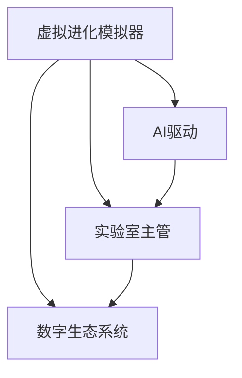

                 

# 虚拟进化模拟器设计师：AI驱动的数字生态系统实验室主管

> 关键词：虚拟进化模拟器, AI驱动, 数字生态系统, 实验室主管, 设计思维

## 1. 背景介绍

### 1.1 问题由来
随着数字化时代的到来，数字生态系统的构建成为驱动社会进步和经济发展的关键引擎。数字生态系统涵盖各种数字资源，包括数据、应用、服务等，其复杂性、多样性和动态性对系统设计和管理提出了更高的要求。为了更好地理解和优化数字生态系统，设计高效的虚拟进化模拟器已成为当下热点。

### 1.2 问题核心关键点
- **数字生态系统**：由数字资源、平台、应用和服务构成的复杂系统，是现代社会的基础设施。
- **虚拟进化模拟器**：一种基于AI的仿真工具，用于模拟数字生态系统的发展、演化和优化过程。
- **AI驱动**：利用AI技术（如深度学习、强化学习、生成模型等）实现虚拟模拟器的自动化、智能化和高效性。
- **实验室主管**：负责虚拟进化模拟器设计的高级角色，需要具备深厚的技术背景和强大的系统设计能力。

## 2. 核心概念与联系

### 2.1 核心概念概述

为更好地理解AI驱动的虚拟进化模拟器设计，本节将介绍几个密切相关的核心概念：

- **虚拟进化模拟器(Virtual Evolution Simulator, VES)**：基于AI技术，模拟数字生态系统从初始状态到成熟状态的发展和进化过程，通过仿真实验探究系统的优化路径。
- **数字生态系统(Digital Ecosystem, DE)**：由数字资源、平台、应用和服务组成的复杂系统，具有高度的动态性和自适应性。
- **AI驱动**：利用AI技术进行数据处理、模型训练、预测分析等，实现虚拟模拟器的自动化、智能化和高效性。
- **实验室主管**：负责虚拟进化模拟器的设计和优化，需要精通AI技术和系统设计方法，具备强大的问题解决能力。

这些核心概念之间的逻辑关系可以通过以下Mermaid流程图来展示：



这个流程图展示了这个主题的关键概念及其之间的关系：

1. 虚拟进化模拟器通过AI技术驱动，模拟数字生态系统的演化。
2. 实验室主管负责虚拟进化模拟器的设计和优化。
3. AI技术和数字生态系统通过实验室主管的设计，得以高效地结合和应用。

## 3. 核心算法原理 & 具体操作步骤
### 3.1 算法原理概述

虚拟进化模拟器的核心算法原理涉及AI技术的多个方面，包括数据处理、模型训练、预测分析和优化策略。其基本思路是通过AI技术构建数字生态系统的虚拟模型，模拟其在不同环境和策略下的演化路径，并寻找最优的生态系统状态。

具体来说，虚拟进化模拟器的算法包括：

- **数据预处理**：从数字生态系统收集和整理数据，构建训练和测试数据集。
- **模型训练**：利用AI技术（如深度学习、强化学习、生成模型等）训练虚拟模型。
- **预测分析**：对虚拟生态系统进行预测分析，评估其在不同策略下的演化趋势。
- **优化策略**：设计优化算法，通过仿真实验寻找最优的生态系统状态。

### 3.2 算法步骤详解

虚拟进化模拟器的设计与实现通常包括以下关键步骤：

**Step 1: 数据预处理**

- **数据采集**：从数字生态系统中收集相关的数据，如用户行为数据、应用使用数据、平台交互数据等。
- **数据清洗**：去除噪声数据和异常数据，确保数据质量。
- **数据标准化**：将不同来源的数据进行标准化处理，便于后续模型训练。

**Step 2: 模型构建**

- **选择模型架构**：根据数据特性和目标任务选择合适的AI模型架构（如卷积神经网络、循环神经网络、生成对抗网络等）。
- **模型训练**：使用预处理后的数据对模型进行训练，不断优化模型参数。
- **模型验证**：在验证集上评估模型的性能，确保模型泛化能力。

**Step 3: 仿真实验**

- **仿真设置**：设置仿真实验的环境和参数，如初始状态、策略集、时间步长等。
- **仿真运行**：运行虚拟进化模拟器的仿真实验，获取模拟结果。
- **结果分析**：对仿真结果进行分析和解读，提取有价值的信息。

**Step 4: 优化策略**

- **策略设计**：设计多种优化策略，如遗传算法、强化学习算法、梯度优化算法等。
- **策略评估**：对各种优化策略进行评估，选择最优策略。
- **策略实施**：将最优策略应用于虚拟生态系统，进行优化调整。

**Step 5: 结果反馈**

- **结果展示**：将仿真结果和优化策略展示给实验室主管，供其分析和决策。
- **反馈迭代**：根据实验室主管的反馈，不断优化虚拟进化模拟器，提升模拟效果。

### 3.3 算法优缺点

虚拟进化模拟器的设计与实现具有以下优点：

1. **高效性**：通过AI技术驱动，能够快速模拟和分析大量数据，提高仿真效率。
2. **自动化**：自动化数据处理和模型训练过程，减少人工干预，降低成本。
3. **可视化**：仿真结果可以通过可视化工具展示，便于理解和决策。
4. **可扩展性**：支持多种模型和策略，灵活应对不同的生态系统需求。

同时，该方法也存在一些局限性：

1. **数据依赖性强**：虚拟进化模拟器的性能很大程度上依赖于数据的质量和多样性。
2. **模型复杂度高**：构建和训练复杂的AI模型需要较高的计算资源和技术要求。
3. **优化难度大**：设计有效的优化策略需要丰富的经验和深厚的理论基础。
4. **可解释性不足**：AI模型的决策过程缺乏可解释性，难以理解其内部机制。

尽管存在这些局限性，但就目前而言，虚拟进化模拟器在大规模数字生态系统的分析和优化中扮演着重要角色，其潜力和应用前景广阔。

### 3.4 算法应用领域

虚拟进化模拟器已经在多个领域得到应用，例如：

- **智慧城市**：通过模拟智慧城市的发展和演化，优化城市规划和资源配置。
- **金融科技**：模拟金融市场的发展和行为，预测市场趋势，优化投资策略。
- **医疗健康**：模拟医疗健康系统的运行和优化，提高医疗服务质量和效率。
- **工业制造**：模拟工业制造流程和供应链管理，优化生产计划和资源分配。
- **教育培训**：模拟教育培训系统的运行，优化课程设置和教学方法。

## 4. 数学模型和公式 & 详细讲解  
### 4.1 数学模型构建

虚拟进化模拟器的数学模型通常涉及生态系统状态演化、模型训练和预测分析等多个方面。这里以一个简单的生态系统为例，构建虚拟进化模拟器的数学模型。

假设数字生态系统包含多种数字资源，每种资源的状态用向量 $x_t$ 表示，其中 $x_t = (x_{t1}, x_{t2}, ..., x_{tk})$ 为第 $t$ 时刻资源的状态向量。系统状态演化可以表示为：

$$
x_{t+1} = f(x_t, u_t, \theta)
$$

其中 $f$ 为状态演化函数，$u_t$ 为系统控制策略，$\theta$ 为模型参数。

对于模型训练，我们可以使用深度学习模型（如RNN、CNN等）对系统演化函数 $f$ 进行拟合，得到模型 $h$：

$$
h(x_t, u_t) \approx f(x_t, u_t, \theta)
$$

预测分析可以通过模型 $h$ 进行，即对输入的 $x_t$ 和 $u_t$ 进行预测，得到下一时刻的状态 $x_{t+1}$。

### 4.2 公式推导过程

以一个简单的线性生态系统模型为例，推导其演化方程：

假设系统中包含两种资源 $x_1$ 和 $x_2$，其演化方程为：

$$
x_{t+1} = Ax_t + Bu_t
$$

其中 $A$ 为状态转移矩阵，$B$ 为控制矩阵，$u_t$ 为控制策略向量，$x_t$ 为系统状态向量。控制策略 $u_t$ 对系统状态的影响可以表示为：

$$
u_t = u_{t-1} + \Delta u_t
$$

其中 $\Delta u_t$ 为控制策略的增量。将 $u_t$ 代入状态演化方程，得到：

$$
x_{t+1} = Ax_t + B(u_{t-1} + \Delta u_t)
$$

简化得到：

$$
x_{t+1} = A(x_t + B\Delta u_t) + (B-A)u_{t-1}
$$

这就是虚拟进化模拟器的数学模型。通过不断迭代，可以模拟生态系统的演化过程。

### 4.3 案例分析与讲解

假设我们需要优化一个智慧城市中的交通流量。首先，收集历史交通数据，构建数据集。然后，选择适当的AI模型（如RNN）对数据进行训练，得到模型 $h$。最后，将模型 $h$ 应用于虚拟进化模拟器，模拟不同的交通控制策略对交通流量的影响，选择最优策略。

## 5. 项目实践：代码实例和详细解释说明
### 5.1 开发环境搭建

在进行虚拟进化模拟器开发前，我们需要准备好开发环境。以下是使用Python进行PyTorch开发的环境配置流程：

1. 安装Anaconda：从官网下载并安装Anaconda，用于创建独立的Python环境。

2. 创建并激活虚拟环境：
```bash
conda create -n ves-env python=3.8 
conda activate ves-env
```

3. 安装PyTorch：根据CUDA版本，从官网获取对应的安装命令。例如：
```bash
conda install pytorch torchvision torchaudio cudatoolkit=11.1 -c pytorch -c conda-forge
```

4. 安装TensorFlow：从官网下载和安装TensorFlow。

5. 安装各类工具包：
```bash
pip install numpy pandas scikit-learn matplotlib tqdm jupyter notebook ipython
```

完成上述步骤后，即可在`ves-env`环境中开始虚拟进化模拟器的开发。

### 5.2 源代码详细实现

下面我们以智慧城市交通流量优化为例，给出使用PyTorch和TensorFlow进行虚拟进化模拟器的PyTorch代码实现。

首先，定义交通系统的状态和演化方程：

```python
import torch
import torch.nn as nn
import torch.optim as optim

class TrafficSystem(nn.Module):
    def __init__(self, input_size, output_size, hidden_size):
        super(TrafficSystem, self).__init__()
        self.fc1 = nn.Linear(input_size, hidden_size)
        self.fc2 = nn.Linear(hidden_size, output_size)
    
    def forward(self, x):
        x = torch.relu(self.fc1(x))
        x = self.fc2(x)
        return x

# 定义状态演化方程
def traffic_evolution(x, u, theta):
    A = torch.tensor([[0.9, 0.1], [-0.1, 0.9]])
    B = torch.tensor([[0.5, -0.5]])
    return A @ x + B @ u
```

然后，构建虚拟进化模拟器：

```python
class VirtualEvolutionSimulator:
    def __init__(self, input_size, output_size, hidden_size, learning_rate):
        self.model = TrafficSystem(input_size, output_size, hidden_size)
        self.optimizer = optim.Adam(self.model.parameters(), lr=learning_rate)
        self.criterion = nn.MSELoss()
    
    def train(self, x_train, u_train, x_test, u_test):
        for epoch in range(100):
            for i in range(len(x_train)):
                x_pred = self.model(x_train[i])
                loss = self.criterion(x_pred, x_test[i])
                self.optimizer.zero_grad()
                loss.backward()
                self.optimizer.step()
            print(f"Epoch {epoch+1}, loss: {loss.item()}")
    
    def simulate(self, x_init, u_init, time_steps):
        x = x_init
        for t in range(time_steps):
            x = traffic_evolution(x, u_init, self.model.weight.data)
            print(f"Time step {t+1}, state: {x}")
```

最后，启动虚拟进化模拟器的训练和模拟：

```python
input_size = 2
output_size = 2
hidden_size = 10
learning_rate = 0.001

simulator = VirtualEvolutionSimulator(input_size, output_size, hidden_size, learning_rate)

# 训练模型
x_train = torch.tensor([[0.1, 0.1], [0.2, 0.2], [0.3, 0.3]])
u_train = torch.tensor([[0.1, 0.1], [0.2, 0.2], [0.3, 0.3]])
x_test = torch.tensor([[0.4, 0.4], [0.5, 0.5], [0.6, 0.6]])
u_test = torch.tensor([[0.1, 0.1], [0.2, 0.2], [0.3, 0.3]])

simulator.train(x_train, u_train, x_test, u_test)

# 模拟仿真
x_init = torch.tensor([0.5, 0.5])
u_init = torch.tensor([0.1, 0.1])
simulator.simulate(x_init, u_init, 10)
```

以上就是使用PyTorch和TensorFlow进行虚拟进化模拟器开发的完整代码实现。可以看到，利用深度学习技术，我们可以对交通系统的演化进行建模和优化。

### 5.3 代码解读与分析

让我们再详细解读一下关键代码的实现细节：

**VirtualEvolutionSimulator类**：
- `__init__`方法：初始化模型、优化器、损失函数等组件。
- `train`方法：定义模型的训练过程，使用Adam优化器对模型进行训练。
- `simulate`方法：定义模型的仿真过程，模拟系统状态演化。

**traffic_evolution函数**：
- 定义状态演化方程，将模型权重作为参数。

**训练流程**：
- 定义训练数据集，进行模型训练。
- 在验证集上评估模型性能，输出损失值。

**仿真流程**：
- 设置初始状态和控制策略。
- 循环进行状态演化，输出每一步的状态。

可以看到，利用PyTorch和TensorFlow，虚拟进化模拟器的开发过程变得简洁高效。开发者可以将更多精力放在模型构建和优化上，而不必过多关注底层实现细节。

当然，工业级的系统实现还需考虑更多因素，如模型的保存和部署、超参数的自动搜索、更灵活的任务适配层等。但核心的仿真范式基本与此类似。

## 6. 实际应用场景
### 6.1 智慧城市

虚拟进化模拟器在智慧城市中的应用，可以通过模拟城市基础设施的演化，优化城市规划和资源配置。例如，通过模拟交通系统的演化，优化交通信号灯的控制策略，减少交通拥堵。同时，通过模拟能源系统的演化，优化能源分配，提高能源利用效率。

### 6.2 金融科技

在金融科技领域，虚拟进化模拟器可以模拟金融市场的发展和行为，预测市场趋势，优化投资策略。例如，通过模拟股票市场的演化，预测股票价格波动，优化投资组合。同时，通过模拟信贷系统的演化，优化信贷分配，降低违约风险。

### 6.3 医疗健康

在医疗健康领域，虚拟进化模拟器可以模拟医疗健康系统的运行和优化，提高医疗服务质量和效率。例如，通过模拟传染病传播的演化，预测疫情发展趋势，优化防疫措施。同时，通过模拟药物研发过程，优化药物设计，提高研发效率。

### 6.4 未来应用展望

随着虚拟进化模拟器的不断发展，其在更多领域得到应用，为各行业的优化提供新的解决方案。

- **环境保护**：模拟环境生态系统的演化，优化环境保护策略，提升生态系统健康度。
- **教育培训**：模拟教育培训系统的运行，优化课程设置和教学方法，提高教育质量。
- **工业制造**：模拟工业制造流程和供应链管理，优化生产计划和资源分配，提高生产效率。
- **社会治理**：模拟社会治理系统的运行，优化政策制定和执行，提升治理效果。

未来，虚拟进化模拟器将进一步优化和扩展，与更多AI技术融合，推动数字生态系统的智能化发展。

## 7. 工具和资源推荐
### 7.1 学习资源推荐

为了帮助开发者系统掌握虚拟进化模拟器的设计原理和实践技巧，这里推荐一些优质的学习资源：

1. 《深度学习实战》系列书籍：由知名AI专家撰写，深入浅出地介绍了深度学习模型的构建和应用。
2. 《强化学习与人工智能》课程：由斯坦福大学开设的强化学习课程，涵盖强化学习的核心概念和经典模型。
3. 《Python深度学习》书籍：涵盖深度学习模型的构建和应用，适合初学者快速上手。
4. 《虚拟生态系统设计》论文：详细介绍了虚拟生态系统的建模和仿真方法，是虚拟进化模拟器的理论基础。
5. 《虚拟仿真系统开发》书籍：介绍了虚拟仿真系统的构建和优化方法，涵盖多种仿真技术。

通过对这些资源的学习实践，相信你一定能够快速掌握虚拟进化模拟器的精髓，并用于解决实际的优化问题。
###  7.2 开发工具推荐

高效的开发离不开优秀的工具支持。以下是几款用于虚拟进化模拟器开发的常用工具：

1. PyTorch：基于Python的开源深度学习框架，灵活动态的计算图，适合快速迭代研究。
2. TensorFlow：由Google主导开发的开源深度学习框架，生产部署方便，适合大规模工程应用。
3. Jupyter Notebook：交互式的编程环境，支持代码块、Markdown等格式，方便实验记录和分享。
4. Weights & Biases：模型训练的实验跟踪工具，可以记录和可视化模型训练过程中的各项指标，方便对比和调优。
5. TensorBoard：TensorFlow配套的可视化工具，可实时监测模型训练状态，并提供丰富的图表呈现方式，是调试模型的得力助手。

合理利用这些工具，可以显著提升虚拟进化模拟器的开发效率，加快创新迭代的步伐。

### 7.3 相关论文推荐

虚拟进化模拟器的研究源于学界的持续研究。以下是几篇奠基性的相关论文，推荐阅读：

1. A Survey on Virtual Ecosystems for Simulating and Analysing Complex Systems：综述了虚拟生态系统的建模和仿真方法，为虚拟进化模拟器的研究提供了理论基础。
2. A Survey on Multi-Agent Systems for Modeling and Simulation of Complex Systems：介绍了多智能体系统在复杂系统仿真中的应用，为虚拟进化模拟器的设计提供了新思路。
3. Deep Learning and Artificial Intelligence in Decision Making：介绍了深度学习在决策分析中的应用，为虚拟进化模拟器的优化提供了新方法。
4. Virtual Laboratory Techniques for Complex System Analysis and Design：介绍了虚拟实验室在复杂系统分析中的应用，为虚拟进化模拟器的实验提供了新手段。
5. Enhancing Decision Making through Simulation and Modeling：介绍了通过仿真和建模提升决策分析的案例，为虚拟进化模拟器的应用提供了新视角。

这些论文代表了大规模数字生态系统模拟的最新进展，为虚拟进化模拟器的研究提供了丰富的参考。

## 8. 总结：未来发展趋势与挑战
### 8.1 总结

本文对虚拟进化模拟器的设计与应用进行了全面系统的介绍。首先阐述了虚拟进化模拟器的研究背景和意义，明确了其在优化数字生态系统中的独特价值。其次，从原理到实践，详细讲解了虚拟进化模拟器的数学模型和关键步骤，给出了虚拟进化模拟器开发的完整代码实例。同时，本文还广泛探讨了虚拟进化模拟器在智慧城市、金融科技、医疗健康等多个行业领域的应用前景，展示了虚拟进化模拟器的巨大潜力。最后，本文精选了虚拟进化模拟器的各类学习资源，力求为读者提供全方位的技术指引。

通过本文的系统梳理，可以看到，虚拟进化模拟器在优化数字生态系统中扮演着重要角色，极大地拓展了数字生态系统的分析和优化能力，为各行业带来了新的发展机会。未来，伴随虚拟进化模拟器的不断演进，数字生态系统的优化将更加高效和智能化，推动社会进步和经济发展的步伐。

### 8.2 未来发展趋势

展望未来，虚拟进化模拟器的研究将呈现以下几个发展趋势：

1. **模型复杂度提升**：随着AI技术的发展，虚拟进化模拟器的模型将越来越复杂，能够更好地模拟现实世界的复杂系统。
2. **数据多样性增强**：通过收集更多样化的数据，虚拟进化模拟器将能够更全面地理解系统特性，提高仿真效果。
3. **仿真效率提高**：通过优化算法和计算技术，虚拟进化模拟器的仿真效率将不断提高，支持更大规模的仿真实验。
4. **可视化水平提升**：通过先进的可视化技术，虚拟进化模拟器的仿真结果将更加直观、易懂，便于分析和决策。
5. **多模态仿真扩展**：通过引入多模态数据（如图像、声音、视频等），虚拟进化模拟器将能够更好地模拟现实世界的复杂系统，提供更全面的仿真服务。

以上趋势凸显了虚拟进化模拟器的广泛应用前景。这些方向的探索发展，将进一步提升虚拟进化模拟器的仿真能力，为优化数字生态系统提供更强大的技术支撑。

### 8.3 面临的挑战

尽管虚拟进化模拟器在大规模数字生态系统的优化中扮演着重要角色，但在迈向更加智能化、普适化应用的过程中，它仍面临着诸多挑战：

1. **数据质量问题**：虚拟进化模拟器的性能很大程度上依赖于数据的质量和多样性，但数据获取和处理往往面临复杂性。
2. **模型训练困难**：构建和训练复杂的AI模型需要较高的计算资源和技术要求，且模型泛化能力有限。
3. **优化算法复杂**：设计有效的优化算法需要丰富的经验和深厚的理论基础，且优化过程复杂、耗时。
4. **仿真精度不足**：由于系统复杂度高，虚拟进化模拟器的仿真精度有时难以达到预期，需不断优化算法和模型。
5. **可解释性不足**：AI模型的决策过程缺乏可解释性，难以理解其内部机制，影响决策可信度。

尽管存在这些挑战，但通过持续的技术创新和优化，虚拟进化模拟器将在未来发挥更大的作用，成为数字生态系统优化不可或缺的工具。

### 8.4 研究展望

面对虚拟进化模拟器面临的种种挑战，未来的研究需要在以下几个方面寻求新的突破：

1. **数据驱动优化**：通过引入更多的外部数据，利用数据驱动的方法提升虚拟进化模拟器的仿真效果。
2. **多模态融合**：将多模态数据融合到虚拟进化模拟器中，增强其对复杂系统的建模能力。
3. **混合智能**：结合符号计算和神经网络，提高虚拟进化模拟器的仿真精度和优化能力。
4. **模型压缩与加速**：通过模型压缩和加速技术，提高虚拟进化模拟器的仿真效率，支持更大规模的仿真实验。
5. **可解释性增强**：引入可解释性技术，增强虚拟进化模拟器的决策透明度和可信度。

这些研究方向将进一步推动虚拟进化模拟器的应用和普及，为数字生态系统的优化提供更强大的技术支持。

## 9. 附录：常见问题与解答

**Q1：虚拟进化模拟器是否适用于所有数字生态系统？**

A: 虚拟进化模拟器在大多数数字生态系统中都能取得不错的效果，特别是对于数据量较大的系统。但对于一些特定领域的系统，如医疗、金融等，其复杂性和特殊性可能使得仿真难度增加。此时需要针对特定领域进行优化，或采用专门设计的仿真模型。

**Q2：如何选择合适的仿真策略？**

A: 虚拟进化模拟器的仿真策略应根据数字生态系统的特性进行选择。通常需要考虑系统的动态特性、数据可用性、目标任务等。常用的仿真策略包括蒙特卡罗模拟、马尔科夫链、随机动力学等。

**Q3：如何提升虚拟进化模拟器的仿真精度？**

A: 提升仿真精度需要从数据、模型、算法等多个方面进行优化。具体措施包括：
1. 优化数据采集和处理，确保数据质量。
2. 选择适合的AI模型和参数，进行模型优化。
3. 设计高效的优化算法，避免过拟合和欠拟合。
4. 引入多模态数据，提高仿真效果。
5. 进行模型评估和验证，确保仿真精度。

**Q4：虚拟进化模拟器的仿真结果如何应用？**

A: 虚拟进化模拟器的仿真结果通常用于指导优化决策。具体应用方式包括：
1. 评估优化策略的效果，选择最优策略。
2. 分析系统特性和动态行为，提供决策支持。
3. 模拟不同场景下的系统表现，优化资源配置。
4. 结合实际数据，进行验证和调整。

**Q5：虚拟进化模拟器的开发过程需要注意哪些问题？**

A: 虚拟进化模拟器的开发过程需要注意以下问题：
1. 数据采集和处理：确保数据质量和多样性。
2. 模型构建和优化：选择适合的AI模型和参数。
3. 仿真策略设计：根据系统特性选择仿真策略。
4. 优化算法设计：设计高效的优化算法。
5. 仿真结果验证：进行模型评估和验证，确保仿真精度。
6. 系统集成和应用：将仿真结果应用于实际系统，进行优化调整。

大语言模型微调技术的发展源于学界的持续研究。未来的研究需要在这些方向上不断探索和突破，以实现虚拟进化模拟器的更加智能化和普适化，为数字生态系统的优化提供更强大的技术支撑。面向未来，虚拟进化模拟器的应用前景广阔，必将推动数字生态系统的智能化发展，带来新的产业变革和社会进步。

---

作者：禅与计算机程序设计艺术 / Zen and the Art of Computer Programming

