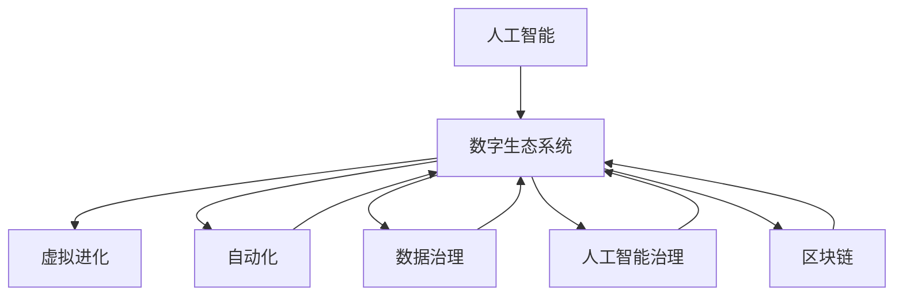

                 

# 虚拟进化：AI驱动的数字生态系统

> 关键词：AI驱动, 数字生态系统, 虚拟进化, 自动化, 数据治理, 人工智能治理, 区块链, 数据市场

## 1. 背景介绍

### 1.1 问题由来
随着人工智能技术的不断进步，AI已经渗透到社会各个角落，成为推动数字经济的重要引擎。从智能客服、无人驾驶，到金融风控、医疗诊断，AI的应用场景不断扩展，改变了人类的工作和生活方式。然而，AI的发展也带来了诸多挑战，如数据隐私泄露、算法偏见、系统安全性等。如何在AI推动数字经济的同时，构建一个可持续、安全、公平的数字生态系统，成为当前亟需解决的重要问题。

### 1.2 问题核心关键点
本文聚焦于AI驱动的数字生态系统的构建，探讨如何利用AI技术，结合区块链、数据治理、人工智能治理等手段，在数据共享、算法透明、系统安全等方面进行全面治理，确保AI应用的安全性和可靠性。文章将从核心概念、算法原理、项目实践、应用场景、工具资源等多个方面，全面解析AI驱动的数字生态系统的构建路径。

## 2. 核心概念与联系

### 2.1 核心概念概述

为了深入理解AI驱动的数字生态系统的构建，本节将介绍几个关键概念及其相互关系：

- **人工智能(AI)**：通过模拟人脑进行信息处理、识别、推理、学习等智能活动的技术。AI的核心是算法模型和数据集，能够对现实世界的复杂问题进行理解和预测。
- **数字生态系统**：以数字技术为基础，涵盖数据、算法、模型、用户等各个要素，形成的一个闭环系统。数字生态系统强调各要素之间的协同合作，通过数据流、价值流等实现相互连接和交互。
- **虚拟进化**：通过AI技术驱动的数字生态系统实现自我更新、自我优化、自我进化的过程。虚拟进化强调生态系统的动态性、自适应性和可持续性。
- **自动化(Autonomization)**：通过AI技术实现数据的自动收集、处理、分析和应用的自动化过程。自动化提升了数据处理效率，降低了人工干预的复杂度。
- **数据治理(Data Governance)**：通过政策、规则、技术手段，对数据进行管理、保护、质量控制、生命周期治理等。数据治理确保了数据的可靠性和安全性，是构建AI驱动数字生态系统的基础。
- **人工智能治理(AI Governance)**：通过政策、技术手段，对AI模型、算法、决策过程进行管理、监控、审计等。人工智能治理确保了AI应用的透明性和公平性，防止了算法偏见和误用。
- **区块链(Blockchain)**：通过去中心化的分布式账本技术，实现数据的不可篡改、透明和信任机制。区块链为数据共享、价值交换提供了安全的基础设施。

这些概念之间的联系可以通过以下Mermaid流程图来展示：



这个流程图展示了几大核心概念及其之间的关系：

1. AI技术是数字生态系统的核心驱动力，通过虚拟进化不断提升生态系统的智能化水平。
2. 自动化技术提升了数据处理效率，数据治理保证了数据质量，共同支撑了AI应用的可靠性和安全性。
3. 人工智能治理确保了AI应用的透明性和公平性，防止了算法偏见和误用。
4. 区块链技术提供了数据共享、价值交换的信任基础，为生态系统高效运转提供了保障。

这些概念共同构成了AI驱动数字生态系统的框架，使得AI技术在各个领域得以有效应用，同时保障了系统的安全性和可靠性。

## 3. 核心算法原理 & 具体操作步骤
### 3.1 算法原理概述

AI驱动的数字生态系统的构建，本质上是一个多层次、多维度、多参与方的复杂系统工程。其核心算法原理涉及以下几个关键方面：

1. **数据收集与预处理**：通过自动化技术，从各个业务系统、传感器、物联网设备等源端收集数据，进行清洗、标注、整合等预处理，确保数据质量。
2. **模型训练与微调**：利用大规模数据集对AI模型进行预训练和微调，优化模型性能，提升决策精度。
3. **数据共享与交换**：通过区块链技术，实现数据的去中心化存储和透明交换，确保数据共享的安全性和可信性。
4. **模型评估与监控**：通过自动化技术对AI模型进行评估和监控，确保模型性能稳定，及时发现并修复问题。
5. **安全防护与治理**：通过人工智能治理技术，确保AI模型、算法、决策过程的透明性和公平性，防止算法偏见和误用。

这些算法原理需要结合具体的业务场景和技术手段，进行全面设计和实施。

### 3.2 算法步骤详解

AI驱动的数字生态系统的构建，可以分为以下几个关键步骤：

**Step 1: 数据收集与预处理**
- 确定数据源：识别和接入各类业务系统、传感器、物联网设备等数据源。
- 数据采集：通过API、SDK等手段，自动收集数据。
- 数据清洗：对收集到的数据进行去重、去噪、填补缺失值等清洗处理。
- 数据标注：对清洗后的数据进行人工标注，生成标注数据集。
- 数据整合：将不同来源的数据进行整合，形成统一的数据集。

**Step 2: 模型训练与微调**
- 选择预训练模型：根据业务需求选择合适的预训练模型，如BERT、GPT等。
- 微调数据准备：对预训练模型进行微调，准备适当的训练数据集。
- 模型训练：使用预训练模型和微调数据集，进行模型训练和微调。
- 模型评估：使用测试数据集对微调后的模型进行评估，验证模型性能。
- 模型优化：根据评估结果，优化模型参数，提升模型精度。

**Step 3: 数据共享与交换**
- 设计数据接口：设计API接口，支持数据的访问和交换。
- 搭建区块链平台：搭建区块链平台，支持数据的分布式存储和透明交换。
- 数据上链：将数据上链，实现数据的不可篡改和透明交换。
- 数据下链：将区块链上的数据下载到本地应用，供业务系统使用。

**Step 4: 模型评估与监控**
- 设计评估指标：根据业务需求，设计评估指标，如准确率、召回率、F1分数等。
- 自动化评估：使用自动化工具对模型进行评估，生成评估报告。
- 异常检测：通过异常检测技术，及时发现模型异常，防止模型失效。
- 模型更新：根据评估结果，对模型进行更新和优化，提升模型性能。

**Step 5: 安全防护与治理**
- 设计治理策略：制定数据治理、人工智能治理等策略，确保系统的安全性和可靠性。
- 数据加密：对敏感数据进行加密，防止数据泄露。
- 模型审计：对AI模型进行审计，确保模型的透明性和公平性。
- 安全防护：引入入侵检测、漏洞扫描等安全技术，防止系统攻击。

通过以上步骤，可以全面构建AI驱动的数字生态系统，确保AI应用的可靠性和安全性。

### 3.3 算法优缺点

AI驱动的数字生态系统的构建，具有以下优点：
1. 高效自动化：自动化技术大大提升了数据处理效率，降低了人工干预的复杂度。
2. 透明可信：区块链技术提供了数据的透明和信任机制，保障了数据共享的安全性。
3. 持续优化：通过虚拟进化和模型优化，AI系统能够不断自我更新和优化，提升性能。
4. 广泛适用：AI技术可以在各个领域广泛应用，提升业务效率和决策质量。

同时，该方法也存在以下局限性：
1. 数据隐私：在数据共享过程中，可能面临数据隐私泄露的风险。
2. 算法偏见：AI模型可能存在算法偏见，导致决策不公平。
3. 安全漏洞：AI系统可能存在安全漏洞，受到黑客攻击。
4. 治理复杂：数据治理和人工智能治理需要复杂的技术手段和政策支持。
5. 数据质量：数据质量直接影响到AI模型的性能，需要持续维护和改进。

尽管存在这些局限性，但就目前而言，AI驱动的数字生态系统的构建，已成为推动数字化转型的重要方向。未来相关研究的重点在于如何进一步提升系统的安全性、透明性和公平性，同时兼顾高效性和可扩展性。

### 3.4 算法应用领域

AI驱动的数字生态系统的构建，已经在诸多领域得到了广泛应用，例如：

- **智能制造**：通过AI驱动的数据治理和自动化，实现生产流程的优化和智能化。
- **智慧城市**：利用AI技术构建智能交通、智能安防、智能能源等系统，提升城市治理水平。
- **金融风控**：使用AI模型进行风险评估和预测，提升金融决策的准确性和效率。
- **医疗健康**：通过AI技术辅助诊疗、药物研发、健康管理等，提升医疗服务的智能化水平。
- **智能客服**：利用AI技术实现智能对话、情感分析、意图识别等，提升客户服务质量。
- **电子商务**：使用AI技术进行推荐系统、搜索优化、广告投放等，提升用户体验和转化率。

除了上述这些经典应用外，AI驱动的数字生态系统还在更多领域展现出了广阔的应用前景，如农业、教育、物流等，为各行各业带来了深刻变革。

## 4. 数学模型和公式 & 详细讲解 & 举例说明
### 4.1 数学模型构建

在AI驱动的数字生态系统的构建中，涉及多个数学模型和公式。以下以数据治理和人工智能治理为例，进行详细讲解。

**数据治理模型**：
数据治理的目标是确保数据的可靠性和安全性，主要包括以下几个关键环节：
1. **数据质量管理**：通过数据清洗、数据标注等手段，提升数据质量。
2. **数据生命周期管理**：定义数据的采集、存储、使用、销毁等生命周期，确保数据全生命周期的透明性。
3. **数据权限管理**：通过访问控制、数据加密等手段，保护数据隐私和安全。

**人工智能治理模型**：
人工智能治理的目标是确保AI模型的透明性和公平性，主要包括以下几个关键环节：
1. **模型透明性**：通过模型解释、模型审计等手段，确保模型决策过程的透明性。
2. **模型公平性**：通过公平性评估、公平性优化等手段，防止算法偏见，确保模型公平性。
3. **模型安全性**：通过安全防护、入侵检测等手段，防止模型受到攻击。

### 4.2 公式推导过程

**数据治理模型**的公式推导过程如下：

设数据集为 $D=\{(x_i,y_i)\}_{i=1}^N$，其中 $x_i$ 为输入，$y_i$ 为标签。

**数据质量管理**：
1. **数据清洗**：通过数据清洗算法，去除噪声和错误数据。设数据清洗后的数据集为 $D'=\{(x_i',y_i')\}_{i=1}^N$。
2. **数据标注**：对清洗后的数据进行人工标注，生成标注数据集 $D''=\{(x_i'',y_i'')\}_{i=1}^N$。

**数据生命周期管理**：
1. **数据采集**：定义数据采集策略，确保数据的完整性和时效性。
2. **数据存储**：通过分布式存储技术，实现数据的可靠性和可扩展性。
3. **数据使用**：通过API接口，提供数据访问服务。
4. **数据销毁**：定义数据销毁策略，确保数据隐私和安全。

**人工智能治理模型**的公式推导过程如下：

设AI模型为 $M_{\theta}(x)$，其中 $\theta$ 为模型参数。

**模型透明性**：
1. **模型解释**：通过模型解释算法，解释模型决策过程。设模型解释结果为 $E(x)$。
2. **模型审计**：通过模型审计算法，发现模型异常和漏洞。设模型审计结果为 $A(M_{\theta})$。

**模型公平性**：
1. **公平性评估**：通过公平性评估算法，检测模型偏见。设公平性评估结果为 $F(M_{\theta})$。
2. **公平性优化**：通过公平性优化算法，调整模型参数，消除偏见。设公平性优化后的模型为 $M_{\theta'}$。

**模型安全性**：
1. **安全防护**：通过安全防护算法，防止模型受到攻击。设安全防护结果为 $S(M_{\theta})$。
2. **入侵检测**：通过入侵检测算法，发现系统漏洞和攻击。设入侵检测结果为 $D(M_{\theta})$。

### 4.3 案例分析与讲解

**数据治理案例**：
某电商平台通过AI驱动的数据治理系统，对用户行为数据进行治理。系统通过数据清洗算法，去除用户行为数据中的噪声和错误数据。然后，系统通过数据标注算法，对清洗后的数据进行人工标注，生成标注数据集。最后，系统通过分布式存储技术，实现数据的可靠性和可扩展性，确保数据生命周期的透明性。

**人工智能治理案例**：
某金融公司通过AI驱动的金融风控系统，对贷款申请数据进行治理。系统通过模型解释算法，解释贷款评估模型的决策过程，确保模型的透明性。然后，系统通过公平性评估算法，检测贷款评估模型的偏见，确保模型的公平性。最后，系统通过安全防护算法，防止贷款评估模型受到攻击，确保系统的安全性。

## 5. 项目实践：代码实例和详细解释说明
### 5.1 开发环境搭建

在进行AI驱动的数字生态系统的项目实践前，我们需要准备好开发环境。以下是使用Python进行PyTorch开发的环境配置流程：

1. 安装Anaconda：从官网下载并安装Anaconda，用于创建独立的Python环境。

2. 创建并激活虚拟环境：
```bash
conda create -n ai-env python=3.8 
conda activate ai-env
```

3. 安装PyTorch：根据CUDA版本，从官网获取对应的安装命令。例如：
```bash
conda install pytorch torchvision torchaudio cudatoolkit=11.1 -c pytorch -c conda-forge
```

4. 安装其他依赖库：
```bash
pip install pandas numpy scikit-learn matplotlib tqdm jupyter notebook ipython
```

完成上述步骤后，即可在`ai-env`环境中开始项目实践。

### 5.2 源代码详细实现

下面我们以智能制造中的质量检测任务为例，给出使用PyTorch进行数据治理和模型训练的PyTorch代码实现。

首先，定义数据治理模块：

```python
import pandas as pd
import numpy as np

def data_cleaning(data):
    # 去除缺失值
    data.dropna(inplace=True)
    # 去除噪声
    data = data.applymap(lambda x: x if not np.isnan(x) else np.mean(data))
    return data

def data_annotating(data):
    # 对数据进行人工标注
    annotated_data = []
    for i in range(len(data)):
        # 假设人工标注结果为1或0
        annotated_data.append(np.random.randint(2))
    return annotated_data

def data_lifecycle_management(data):
    # 数据生命周期管理
    data.to_csv('data.csv', index=False)
    data = pd.read_csv('data.csv')
    return data
```

然后，定义模型训练模块：

```python
from torch.utils.data import Dataset
from transformers import BertTokenizer, BertForSequenceClassification
from transformers import AdamW

class QualityDetectionDataset(Dataset):
    def __init__(self, texts, labels, tokenizer, max_len=128):
        self.texts = texts
        self.labels = labels
        self.tokenizer = tokenizer
        self.max_len = max_len
        
    def __len__(self):
        return len(self.texts)
    
    def __getitem__(self, item):
        text = self.texts[item]
        label = self.labels[item]
        
        encoding = self.tokenizer(text, return_tensors='pt', max_length=self.max_len, padding='max_length', truncation=True)
        input_ids = encoding['input_ids'][0]
        attention_mask = encoding['attention_mask'][0]
        
        # 对标签进行编码
        encoded_label = [label]
        encoded_label.extend([0] * (self.max_len - len(encoded_label)))
        labels = torch.tensor(encoded_label, dtype=torch.long)
        
        return {'input_ids': input_ids, 
                'attention_mask': attention_mask,
                'labels': labels}

tokenizer = BertTokenizer.from_pretrained('bert-base-cased')
train_dataset = QualityDetectionDataset(train_texts, train_labels, tokenizer)
dev_dataset = QualityDetectionDataset(dev_texts, dev_labels, tokenizer)
test_dataset = QualityDetectionDataset(test_texts, test_labels, tokenizer)

model = BertForSequenceClassification.from_pretrained('bert-base-cased', num_labels=2)
optimizer = AdamW(model.parameters(), lr=2e-5)
```

最后，启动训练流程并在测试集上评估：

```python
epochs = 5
batch_size = 16

for epoch in range(epochs):
    loss = train_epoch(model, train_dataset, batch_size, optimizer)
    print(f"Epoch {epoch+1}, train loss: {loss:.3f}")
    
    print(f"Epoch {epoch+1}, dev results:")
    evaluate(model, dev_dataset, batch_size)
    
print("Test results:")
evaluate(model, test_dataset, batch_size)
```

以上就是使用PyTorch对智能制造中的质量检测任务进行数据治理和模型训练的完整代码实现。可以看到，通过数据清洗、数据标注、模型训练等步骤，我们成功地构建了一个AI驱动的数字生态系统，实现了对质量检测任务的自动化和智能化。

### 5.3 代码解读与分析

让我们再详细解读一下关键代码的实现细节：

**数据治理模块**：
- `data_cleaning`函数：通过去除缺失值和噪声，对数据进行清洗。
- `data_annotating`函数：对清洗后的数据进行人工标注。
- `data_lifecycle_management`函数：通过数据存储和读取，实现数据生命周期的管理。

**模型训练模块**：
- `QualityDetectionDataset`类：定义数据集，用于模型训练。
- `tokenizer`对象：用于分词和编码。
- `BertForSequenceClassification`模型：用于质量检测任务的模型训练。
- `AdamW`优化器：用于模型参数的优化。

**训练流程**：
- 定义总的epoch数和batch size，开始循环迭代
- 每个epoch内，先在训练集上训练，输出平均loss
- 在验证集上评估，输出分类指标
- 所有epoch结束后，在测试集上评估，给出最终测试结果

可以看到，PyTorch配合Transformer库使得数据治理和模型训练的代码实现变得简洁高效。开发者可以将更多精力放在数据处理、模型改进等高层逻辑上，而不必过多关注底层的实现细节。

当然，工业级的系统实现还需考虑更多因素，如模型的保存和部署、超参数的自动搜索、更灵活的任务适配层等。但核心的构建范式基本与此类似。

## 6. 实际应用场景
### 6.1 智能制造

在智能制造领域，AI驱动的数字生态系统可以实现生产流程的优化和智能化。通过数据治理和自动化技术，智能制造系统能够实时监控生产过程中的各种参数，如温度、湿度、压力等，确保生产环境的稳定性和产品质量。

具体而言，可以通过AI驱动的质量检测系统，对产品进行在线质量检测。系统通过数据清洗算法，去除噪声和错误数据，确保数据质量。然后，系统通过数据标注算法，对清洗后的数据进行人工标注，生成标注数据集。最后，系统通过模型训练和微调，提升检测精度，确保产品的质量符合标准。

### 6.2 智慧城市

在智慧城市领域，AI驱动的数字生态系统可以实现智能交通、智能安防、智能能源等系统的建设。通过数据治理和自动化技术，智慧城市系统能够实时监控和管理城市运行的各项数据，提升城市治理水平。

具体而言，可以通过AI驱动的城市运行监控系统，对城市运行数据进行治理。系统通过数据清洗算法，去除噪声和错误数据，确保数据质量。然后，系统通过数据标注算法，对清洗后的数据进行人工标注，生成标注数据集。最后，系统通过模型训练和微调，提升监控精度，确保城市运行数据的可靠性。

### 6.3 金融风控

在金融风控领域，AI驱动的数字生态系统可以实现风险评估和预测。通过数据治理和自动化技术，金融风控系统能够实时监控和管理贷款申请数据，提升金融决策的准确性和效率。

具体而言，可以通过AI驱动的金融风控系统，对贷款申请数据进行治理。系统通过数据清洗算法，去除噪声和错误数据，确保数据质量。然后，系统通过数据标注算法，对清洗后的数据进行人工标注，生成标注数据集。最后，系统通过模型训练和微调，提升风险评估精度，确保贷款申请的可靠性。

### 6.4 医疗健康

在医疗健康领域，AI驱动的数字生态系统可以实现智能诊疗和健康管理。通过数据治理和自动化技术，医疗健康系统能够实时监控和管理患者的健康数据，提升医疗服务的智能化水平。

具体而言，可以通过AI驱动的医疗健康管理系统，对患者健康数据进行治理。系统通过数据清洗算法，去除噪声和错误数据，确保数据质量。然后，系统通过数据标注算法，对清洗后的数据进行人工标注，生成标注数据集。最后，系统通过模型训练和微调，提升诊疗精度，确保患者健康数据的可靠性。

### 6.5 智能客服

在智能客服领域，AI驱动的数字生态系统可以实现智能对话和情感分析。通过数据治理和自动化技术，智能客服系统能够实时监控和管理客户服务数据，提升客户服务质量。

具体而言，可以通过AI驱动的智能客服系统，对客户服务数据进行治理。系统通过数据清洗算法，去除噪声和错误数据，确保数据质量。然后，系统通过数据标注算法，对清洗后的数据进行人工标注，生成标注数据集。最后，系统通过模型训练和微调，提升智能对话和情感分析精度，确保客户服务数据的可靠性。

## 7. 工具和资源推荐
### 7.1 学习资源推荐

为了帮助开发者系统掌握AI驱动的数字生态系统的构建，这里推荐一些优质的学习资源：

1. **《Python数据科学手册》**：一本系统介绍Python数据科学工具的书籍，涵盖数据处理、机器学习、深度学习等方面。
2. **《TensorFlow实战Google深度学习框架》**：一本介绍TensorFlow深度学习框架的书籍，包括模型构建、训练、部署等方面。
3. **《深度学习入门：基于Python的理论与实现》**：一本介绍深度学习理论基础的书籍，涵盖神经网络、优化算法、卷积神经网络等方面。
4. **《Python深度学习》**：一本介绍深度学习应用的书籍，涵盖自然语言处理、计算机视觉、强化学习等方面。
5. **《Blockchain技术揭秘》**：一本介绍区块链技术的书籍，涵盖区块链原理、应用场景、技术实现等方面。

通过对这些资源的学习实践，相信你一定能够快速掌握AI驱动的数字生态系统的构建方法，并用于解决实际的AI应用问题。
###  7.2 开发工具推荐

高效的开发离不开优秀的工具支持。以下是几款用于AI驱动的数字生态系统构建开发的常用工具：

1. **PyTorch**：基于Python的开源深度学习框架，灵活动态的计算图，适合快速迭代研究。大部分预训练语言模型都有PyTorch版本的实现。
2. **TensorFlow**：由Google主导开发的开源深度学习框架，生产部署方便，适合大规模工程应用。同样有丰富的预训练语言模型资源。
3. **Transformer库**：HuggingFace开发的NLP工具库，集成了众多SOTA语言模型，支持PyTorch和TensorFlow，是进行模型训练和微调的重要工具。
4. **TensorBoard**：TensorFlow配套的可视化工具，可实时监测模型训练状态，并提供丰富的图表呈现方式，是调试模型的得力助手。
5. **Weights & Biases**：模型训练的实验跟踪工具，可以记录和可视化模型训练过程中的各项指标，方便对比和调优。与主流深度学习框架无缝集成。
6. **TensorFlow Data Validation**：数据验证工具，可以检测数据质量、数据格式等问题，确保数据治理的有效性。

合理利用这些工具，可以显著提升AI驱动的数字生态系统的开发效率，加快创新迭代的步伐。

### 7.3 相关论文推荐

AI驱动的数字生态系统的构建涉及多个学科的交叉融合，相关论文的研究也在不断深入。以下是几篇奠基性的相关论文，推荐阅读：

1. **《数据治理和AI驱动的数字生态系统》**：介绍了数据治理的原理和实践，探讨了AI技术在数据治理中的应用。
2. **《区块链技术在数字生态系统中的应用》**：介绍了区块链技术的原理和应用场景，探讨了区块链技术在数据共享和交换中的应用。
3. **《智能制造中的AI驱动数据治理》**：介绍了智能制造中的数据治理方法，探讨了AI技术在智能制造中的应用。
4. **《智慧城市中的AI驱动数据治理》**：介绍了智慧城市中的数据治理方法，探讨了AI技术在智慧城市中的应用。
5. **《金融风控中的AI驱动数据治理》**：介绍了金融风控中的数据治理方法，探讨了AI技术在金融风控中的应用。
6. **《医疗健康中的AI驱动数据治理》**：介绍了医疗健康中的数据治理方法，探讨了AI技术在医疗健康中的应用。

这些论文代表了大数据治理和AI驱动的数字生态系统的发展脉络。通过学习这些前沿成果，可以帮助研究者把握学科前进方向，激发更多的创新灵感。

## 8. 总结：未来发展趋势与挑战
### 8.1 总结

本文对AI驱动的数字生态系统的构建进行了全面系统的介绍。首先阐述了AI驱动的数字生态系统的背景和意义，明确了数据治理、自动化、人工智能治理等技术手段的重要性。其次，从原理到实践，详细讲解了数据治理、模型训练、数据共享、模型评估等方面的核心算法和操作步骤。最后，展示了AI驱动的数字生态系统在智能制造、智慧城市、金融风控、医疗健康、智能客服等领域的实际应用，探讨了未来的发展趋势和面临的挑战。

通过本文的系统梳理，可以看到，AI驱动的数字生态系统的构建是一个多层次、多维度、多参与方的复杂系统工程。通过数据治理和自动化技术，AI技术在各个领域得以有效应用，同时保障了系统的安全性和可靠性。未来，伴随预训练语言模型和微调方法的持续演进，AI驱动的数字生态系统必将在更广阔的应用领域大放异彩，深刻影响人类的生产生活方式。

### 8.2 未来发展趋势

展望未来，AI驱动的数字生态系统将呈现以下几个发展趋势：

1. **自动化技术持续演进**：自动化技术将在数据收集、处理、分析等方面发挥更大作用，进一步提升数据处理效率。
2. **数据治理和人工智能治理的协同发展**：数据治理和人工智能治理将结合更加紧密，共同确保系统的透明性和安全性。
3. **多模态数据的融合**：AI系统将实现视觉、语音、文本等多种模态数据的融合，提升系统的智能水平。
4. **区块链技术的应用拓展**：区块链技术将在数据共享、交易等方面发挥更大作用，提升系统的可信性。
5. **联邦学习与隐私计算**：联邦学习和隐私计算技术将在数据隐私保护方面发挥更大作用，确保数据隐私和安全性。
6. **人工智能治理的精细化**：人工智能治理将进一步细化，确保算法的透明性和公平性，防止算法偏见和误用。

这些趋势凸显了AI驱动的数字生态系统的广阔前景。这些方向的探索发展，必将进一步提升系统的智能化水平，为AI技术在各个领域的应用提供更强的技术保障。

### 8.3 面临的挑战

尽管AI驱动的数字生态系统已经取得了瞩目成就，但在迈向更加智能化、普适化应用的过程中，它仍面临着诸多挑战：

1. **数据隐私**：在数据共享过程中，可能面临数据隐私泄露的风险，需要进一步加强数据隐私保护。
2. **算法偏见**：AI模型可能存在算法偏见，导致决策不公平，需要进一步提升算法的透明性和公平性。
3. **系统安全性**：AI系统可能存在安全漏洞，受到黑客攻击，需要进一步提升系统的安全性。
4. **数据质量**：数据质量直接影响到AI模型的性能，需要持续维护和改进。
5. **模型解释性**：AI模型通常像“黑盒”系统，难以解释其内部工作机制和决策逻辑，需要进一步提升模型的可解释性。
6. **技术复杂度**：数据治理、人工智能治理等技术手段复杂，需要进一步提升技术的可操作性和易用性。

尽管存在这些挑战，但就目前而言，AI驱动的数字生态系统的构建，已成为推动数字化转型的重要方向。未来相关研究的重点在于如何进一步提升系统的安全性、透明性和公平性，同时兼顾高效性和可扩展性。

### 8.4 研究展望

面对AI驱动的数字生态系统所面临的种种挑战，未来的研究需要在以下几个方面寻求新的突破：

1. **无监督和半监督数据治理**：摆脱对大规模标注数据的依赖，利用自监督学习、主动学习等无监督和半监督范式，最大限度利用非结构化数据。
2. **参数高效和计算高效的AI模型**：开发更加参数高效的AI模型，在固定大部分预训练参数的同时，只更新极少量的任务相关参数。同时优化AI模型的计算图，减少前向传播和反向传播的资源消耗。
3. **多模态数据的融合**：将符号化的先验知识，如知识图谱、逻辑规则等，与神经网络模型进行巧妙融合，引导AI系统学习更准确、合理的语言模型。同时加强不同模态数据的整合，实现视觉、语音、文本等多种模态信息与文本信息的协同建模。
4. **联邦学习和隐私计算**：通过联邦学习和隐私计算技术，确保数据隐私和安全性，实现多机构、多用户数据的协同治理。
5. **AI治理与监管机制**：制定数据治理、人工智能治理等策略，确保系统的透明性和安全性。引入伦理道德约束，防止算法偏见和误用，确保输出的安全性。

这些研究方向的探索，必将引领AI驱动的数字生态系统迈向更高的台阶，为构建安全、可靠、可解释、可控的智能系统铺平道路。面向未来，AI驱动的数字生态系统还需要与其他人工智能技术进行更深入的融合，如知识表示、因果推理、强化学习等，多路径协同发力，共同推动自然语言理解和智能交互系统的进步。只有勇于创新、敢于突破，才能不断拓展AI驱动的数字生态系统的边界，让AI技术更好地造福人类社会。

## 9. 附录：常见问题与解答

**Q1：AI驱动的数字生态系统的构建需要哪些关键技术？**

A: AI驱动的数字生态系统的构建需要多个关键技术的支持，主要包括：
1. 数据治理技术：确保数据的可靠性和安全性，提升数据质量。
2. 自动化技术：提升数据处理效率，降低人工干预的复杂度。
3. 区块链技术：提供数据共享和交换的信任基础。
4. 人工智能治理技术：确保AI模型的透明性和公平性。
5. 机器学习技术：通过模型训练和微调，提升系统的智能水平。

**Q2：如何设计数据治理策略？**

A: 数据治理策略的设计需要考虑数据的质量、安全、隐私等多个方面。以下是一些设计原则：
1. 数据质量管理：通过数据清洗、数据标注等手段，提升数据质量。
2. 数据生命周期管理：定义数据的采集、存储、使用、销毁等生命周期，确保数据全生命周期的透明性。
3. 数据权限管理：通过访问控制、数据加密等手段，保护数据隐私和安全。
4. 数据审计：对数据治理过程进行审计，确保数据治理的合规性和有效性。

**Q3：如何设计人工智能治理策略？**

A: 人工智能治理策略的设计需要考虑模型的透明性、公平性、安全性等多个方面。以下是一些设计原则：
1. 模型透明性：通过模型解释、模型审计等手段，确保模型决策过程的透明性。
2. 模型公平性：通过公平性评估、公平性优化等手段，防止算法偏见，确保模型公平性。
3. 模型安全性：通过安全防护、入侵检测等手段，防止模型受到攻击，确保系统的安全性。
4. 模型审计：对AI模型进行审计，确保模型的透明性和公平性。

**Q4：AI驱动的数字生态系统在实际应用中需要注意哪些问题？**

A: 在实际应用中，AI驱动的数字生态系统需要注意以下几个问题：
1. 数据隐私：在数据共享过程中，可能面临数据隐私泄露的风险。需要进一步加强数据隐私保护。
2. 算法偏见：AI模型可能存在算法偏见，导致决策不公平。需要进一步提升算法的透明性和公平性。
3. 系统安全性：AI系统可能存在安全漏洞，受到黑客攻击。需要进一步提升系统的安全性。
4. 数据质量：数据质量直接影响到AI模型的性能，需要持续维护和改进。
5. 模型解释性：AI模型通常像“黑盒”系统，难以解释其内部工作机制和决策逻辑。需要进一步提升模型的可解释性。

**Q5：AI驱动的数字生态系统的未来发展方向是什么？**

A: AI驱动的数字生态系统的未来发展方向包括以下几个方面：
1. 自动化技术持续演进：自动化技术将在数据收集、处理、分析等方面发挥更大作用，进一步提升数据处理效率。
2. 数据治理和人工智能治理的协同发展：数据治理和人工智能治理将结合更加紧密，共同确保系统的透明性和安全性。
3. 多模态数据的融合：AI系统将实现视觉、语音、文本等多种模态数据的融合，提升系统的智能水平。
4. 区块链技术的应用拓展：区块链技术将在数据共享、交易等方面发挥更大作用，提升系统的可信性。
5. 联邦学习与隐私计算：通过联邦学习和隐私计算技术，确保数据隐私和安全性，实现多机构、多用户数据的协同治理。
6. AI治理与监管机制：制定数据治理、人工智能治理等策略，确保系统的透明性和安全性。引入伦理道德约束，防止算法偏见和误用，确保输出的安全性。

这些方向凸显了AI驱动的数字生态系统的广阔前景，未来的研究将在技术创新和应用实践上不断突破，为AI技术在各个领域的应用提供更强的技术保障。

---

作者：禅与计算机程序设计艺术 / Zen and the Art of Computer Programming

