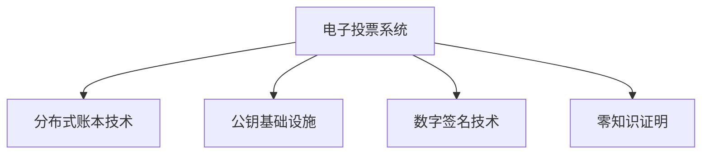

                 

# 虚拟选举系统:全球民主参与的数字化实践

## 1. 背景介绍

### 1.1 问题由来
在数字化的浪潮下，传统投票系统逐渐被数字化、智能化的电子投票系统所替代。特别是在全球民主参与的进程中，电子投票系统不仅能提升投票的便利性和效率，还能降低选举成本，增强投票透明度和安全性。

然而，电子投票系统的技术复杂性和安全性问题，使得其实际部署和应用面临诸多挑战。如何构建一个高效、安全、可靠的虚拟选举系统，成为各国政府和科技公司亟待解决的问题。

### 1.2 问题核心关键点
构建虚拟选举系统的关键在于设计一个既保障投票者隐私、防止欺诈，又确保投票过程透明、高效的系统。需要解决的核心问题包括：

- 投票者身份验证和隐私保护：确保投票者在系统中的身份不被泄露。
- 投票过程防篡改和欺诈：防止篡改投票结果、恶意攻击和双重投票等。
- 投票结果准确性：确保投票结果的准确性和完整性。
- 投票系统的高效性和可扩展性：支持大规模投票需求，实时反馈投票结果。
- 系统可靠性和容错性：在面对网络攻击、硬件故障等情况时，确保系统的稳定运行。

通过合理解决这些问题，虚拟选举系统可以实现从传统投票向电子投票的平滑过渡，为全球民主参与提供新的技术支持。

### 1.3 问题研究意义
构建虚拟选举系统的研究不仅有助于提升投票过程的效率和透明度，还可以扩展民主参与的广度和深度。特别是在偏远和难以访问的地区，数字化投票系统可以打破地域限制，让更多人参与到民主决策中来。此外，研究虚拟选举系统还能够为其他领域的数字身份认证和信息安全问题提供借鉴和参考。

## 2. 核心概念与联系

### 2.1 核心概念概述

为了更好地理解虚拟选举系统的工作原理和优化方向，本节将介绍几个密切相关的核心概念：

- 电子投票系统(E-Voting System)：利用计算机和网络技术实现的投票系统，用户通过终端设备进行投票操作，投票结果自动上传至中央数据库。
- 分布式账本技术(DLT)：如区块链等，可以确保投票过程的透明性和不可篡改性。
- 公钥基础设施(PKI)：提供数字证书和公钥加密，保障投票者和系统的安全通信。
- 数字签名技术：用于验证投票者的身份和投票结果的完整性。
- 零知识证明(Zero-Knowledge Proof)：在不泄露投票信息的情况下，验证投票者身份和投票过程的合法性。

这些核心概念之间的逻辑关系可以通过以下Mermaid流程图来展示：



这个流程图展示了几项核心技术之间的相互支撑关系：

1. 电子投票系统通过公钥基础设施和数字签名技术保障投票者和系统的安全通信，通过零知识证明验证投票的合法性。
2. 分布式账本技术通过共识算法确保投票过程的透明性和不可篡改性，为电子投票系统提供底层支持。

## 3. 核心算法原理 & 具体操作步骤
### 3.1 算法原理概述

虚拟选举系统的工作原理可以概括为以下几个步骤：

1. 用户注册与身份验证：用户使用公钥基础设施(PKI)技术，通过数字证书和公钥加密进行身份验证，确保其身份的真实性和唯一性。
2. 投票过程：用户通过电子投票终端设备输入选票信息，利用数字签名技术对选票进行加密，确保选票的完整性和投票者的身份。
3. 投票结果验证：利用零知识证明技术，在不泄露投票信息的情况下，验证选票的合法性和投票过程的透明性。
4. 投票结果存储与计票：选票经由分布式账本技术存储，确保其不可篡改性和透明性。投票结束后，通过分布式共识算法统计投票结果。
5. 投票结果公布与审计：投票结果通过分布式账本公开发布，任何人都可以进行审计和验证，确保投票过程的公正性和透明性。

### 3.2 算法步骤详解

下面将详细讲解虚拟选举系统的关键算法步骤。

**Step 1: 用户注册与身份验证**
用户在使用虚拟选举系统前，需进行身份注册。注册过程包括：

1. 用户提交身份信息，如身份证号码、姓名等。
2. 系统通过PKI生成用户的数字证书，并在数据库中存储证书信息。
3. 用户使用数字证书登录系统，系统验证数字证书的有效性，确保用户身份的真实性。

**Step 2: 投票过程**
用户完成身份验证后，可进行投票操作。投票过程包括：

1. 用户输入选票信息，系统生成选票标识。
2. 用户使用数字签名技术对选票进行加密，确保选票完整性。
3. 系统接收选票，并验证数字签名，确保选票的合法性。
4. 系统将选票存入分布式账本，完成投票过程。

**Step 3: 投票结果验证**
投票结束后，利用零知识证明技术对投票结果进行验证，具体步骤如下：

1. 投票者通过数字证书进行身份验证。
2. 系统验证选票的完整性，确保选票未被篡改。
3. 通过零知识证明，系统验证投票过程的透明性，确保没有投票异常。

**Step 4: 投票结果存储与计票**
投票结束后，选票被存入分布式账本，确保其不可篡改性和透明性。计票过程包括：

1. 分布式账本自动统计选票，生成投票结果。
2. 系统对投票结果进行分布式共识，确保结果的准确性和完整性。

**Step 5: 投票结果公布与审计**
投票结束后，系统公开投票结果，并进行审计，具体步骤如下：

1. 系统公开分布式账本中的投票结果，任何人都可以进行审计。
2. 审计者通过数字证书验证身份，利用零知识证明技术验证投票过程的透明性。
3. 审计者可发现投票过程中的异常情况，如选票被篡改、投票异常等，进行反馈和处理。

### 3.3 算法优缺点

虚拟选举系统在提升投票效率和透明度的同时，也面临一些挑战：

**优点：**

1. 提高投票效率：电子投票系统极大提升了投票速度，减少了投票排队和人力成本。
2. 提升投票透明度：分布式账本和零知识证明技术保障了投票过程的透明性和不可篡改性。
3. 增强投票安全性：数字证书和数字签名技术确保了投票者和系统的安全通信。

**缺点：**

1. 技术复杂性高：虚拟选举系统涉及多种复杂技术，对系统的设计、实现和维护要求较高。
2. 成本高：开发和维护电子投票系统需要大量资金和技术投入。
3. 隐私保护问题：在保护投票隐私和确保投票透明之间存在一定的矛盾。

### 3.4 算法应用领域

虚拟选举系统的核心算法已经在许多国家的电子投票系统中得到了应用，以下是其主要的应用领域：

- 选举投票：在国家、地方、社区等各级选举中广泛应用。
- 公投与民意调查：用于公投和民意调查，实时统计和公布结果。
- 公司治理：用于公司股东大会，提高投票效率和透明度。
- 学术投票：在学术会议和研究机构中，用于投票和计票。

除了这些传统的应用外，虚拟选举系统的技术还在向更多领域拓展，如社会组织投票、在线金融投票等，为数字化民主参与提供了新的技术支持。

## 4. 数学模型和公式 & 详细讲解
### 4.1 数学模型构建

虚拟选举系统中的数学模型主要围绕身份验证、选票加密、选票验证、投票结果统计等环节构建。

**用户注册模型：**

- 用户信息 $U=(ID, Name, Address)$
- 数字证书 $Cert=\{Cert_ID, Cert_Pub, Cert_Pri\}$

**选票加密模型：**

- 选票信息 $V=(Voting_ID, Candidate_ID, Vote)$
- 选票加密 $Enc(V, Key)=(V, Key)$
- 数字签名 $Sign(V, Key)=(Sign_ID, Sign)$

**选票验证模型：**

- 选票解密 $Dec(V, Key)=(V, Key)$
- 选票验证 $Verify(V, Cert, Sign)=(Ver_ID, Ver)$

**投票结果统计模型：**

- 投票结果 $Result=(Voting_ID, Candidate_ID, Vote)$
- 分布式共识 $Consensus(Vote)=Result$

**投票结果审计模型：**

- 审计信息 $Audit=(ID, Cert, Vote)$
- 零知识证明 $ZKProve(V, Cert, Audit)=(Audit_ID, Audit)$

### 4.2 公式推导过程

以下将对核心算法的数学公式进行详细推导：

**用户注册模型：**

1. 生成数字证书 $Cert=\{Cert_ID, Cert_Pub, Cert_Pri\}$
   - $Cert_Pub=\text{Asymmetric_Encrypt}(ID, Name, Address)$
   - $Cert_Pri=\text{Asymmetric_Decrypt}(Cert_Pub)$

2. 存储数字证书至数据库
   - $Database=\{Cert_ID:Cert\}$

**选票加密模型：**

1. 生成选票标识 $Voting_ID$
   - $Voting_ID=\text{Hash}(ID, Name, Address)$

2. 生成选票 $V=(Voting_ID, Candidate_ID, Vote)$

3. 加密选票 $Enc(V, Cert_Pri)=(Sign_ID, Sign)=(\text{Hash}(Voting_ID), \text{Sign}(Voting_ID, Candidate_ID, Vote, Cert_Pri))$

**选票验证模型：**

1. 解密选票 $Dec(V, Cert_Pri)=(Voting_ID, Candidate_ID, Vote)$

2. 验证选票 $Verify(V, Cert, Sign)=\text{Asymmetric_Verify}(Sign_ID, Sign, Voting_ID, Candidate_ID, Vote, Cert_Pub)$

**投票结果统计模型：**

1. 生成投票结果 $Result=\text{Consensus}(Vote)=\{Voting_ID, Candidate_ID, Vote\}$

2. 统计投票结果 $Database=\{Result\}$

**投票结果审计模型：**

1. 生成审计信息 $Audit=(ID, Cert, Vote)$

2. 证明选票 $ZKProve(V, Cert, Audit)=(\text{Hash}(Voting_ID), \text{Sign}(Voting_ID, Candidate_ID, Vote, Cert_Pri), \text{Hash}(Voting_ID), \text{Hash}(Voting_ID), \text{Sign}(Voting_ID, Candidate_ID, Vote, Cert_Pri))$

### 4.3 案例分析与讲解

为了更好地理解虚拟选举系统的核心算法，下面通过一个具体的案例进行分析：

**案例背景：**
某国举行了一次全国性选举，采用虚拟选举系统进行投票。系统采用公钥基础设施(PKI)进行身份验证，分布式账本技术(DLT)记录投票结果，数字签名技术(Verification)确保选票完整性，零知识证明(Proof)验证投票透明性。

**案例过程：**

1. **用户注册与身份验证**
   - 用户提交身份证号码、姓名等信息，系统生成数字证书 $Cert$。
   - 用户使用数字证书登录系统，系统验证证书的有效性，确保用户身份的真实性。

2. **投票过程**
   - 用户输入选票信息，系统生成选票标识 $Voting_ID$。
   - 用户使用数字签名技术对选票进行加密，生成选票 $V$。
   - 系统接收选票，并验证数字签名，确保选票的完整性和合法性。
   - 系统将选票存入分布式账本，完成投票过程。

3. **投票结果验证**
   - 投票结束后，利用零知识证明技术对投票结果进行验证。
   - 投票者通过数字证书进行身份验证。
   - 系统验证选票的完整性，确保选票未被篡改。
   - 通过零知识证明，系统验证投票过程的透明性，确保没有投票异常。

4. **投票结果存储与计票**
   - 分布式账本自动统计选票，生成投票结果 $Result$。
   - 系统对投票结果进行分布式共识，确保结果的准确性和完整性。

5. **投票结果公布与审计**
   - 系统公开分布式账本中的投票结果。
   - 审计者通过数字证书验证身份，利用零知识证明技术验证投票过程的透明性。
   - 审计者可发现投票过程中的异常情况，进行反馈和处理。

## 5. 项目实践：代码实例和详细解释说明
### 5.1 开发环境搭建

在进行虚拟选举系统的开发和实践前，我们需要准备好开发环境。以下是使用Python进行开发的环境配置流程：

1. 安装Anaconda：从官网下载并安装Anaconda，用于创建独立的Python环境。

2. 创建并激活虚拟环境：
```bash
conda create -n evoting-env python=3.8 
conda activate evoting-env
```

3. 安装PyTorch：根据CUDA版本，从官网获取对应的安装命令。例如：
```bash
conda install pytorch torchvision torchaudio cudatoolkit=11.1 -c pytorch -c conda-forge
```

4. 安装分布式账本技术：
```bash
pip install hyperledger-fabric
```

5. 安装区块链相关库：
```bash
pip install ethereumpy
```

6. 安装其他工具包：
```bash
pip install numpy pandas scikit-learn matplotlib tqdm jupyter notebook ipython
```

完成上述步骤后，即可在`evoting-env`环境中开始虚拟选举系统的开发和实践。

### 5.2 源代码详细实现

下面以一个简单的投票系统为例，给出使用Python和Hyperledger Fabric进行虚拟选举系统开发的代码实现。

```python
from cryptography.hazmat.primitives.asymmetric import rsa, padding
from cryptography.hazmat.primitives import serialization
from cryptography.hazmat.primitives import hashes
from cryptography.hazmat.backends import default_backend

from hyperledger_fabric import Fabric
from hyperledger_fabric.ledger import QueryResult

# 生成公钥和私钥
private_key = rsa.generate_private_key(
    backend=default_backend(), 
    key_size=2048, 
    public_exponent=65537)

public_key = private_key.public_key()

# 生成数字证书
certificate = private_key.public_key().public_bytes(
    encoding=serialization.Encoding.PEM, 
    format=serialization.PublicFormat.SubjectPublicKeyInfo)

# 注册用户
def register_user(user_id, name, address):
    # 生成数字证书
    private_key = rsa.generate_private_key(
        backend=default_backend(), 
        key_size=2048, 
        public_exponent=65537)

    public_key = private_key.public_key()

    # 生成数字证书
    certificate = public_key.public_bytes(
        encoding=serialization.Encoding.PEM, 
        format=serialization.PublicFormat.SubjectPublicKeyInfo)

    # 注册用户
    fabric = Fabric()
    fabric.register_user(user_id, name, address, certificate)

# 生成选票
def generate_vote(user_id, candidate_id, vote):
    # 生成选票标识
    voting_id = hashlib.sha256(user_id.encode()).hexdigest()

    # 加密选票
    private_key = rsa.generate_private_key(
        backend=default_backend(), 
        key_size=2048, 
        public_exponent=65537)

    public_key = private_key.public_key()

    certificate = public_key.public_bytes(
        encoding=serialization.Encoding.PEM, 
        format=serialization.PublicFormat.SubjectPublicKeyInfo)

    # 生成选票
    vote = {voting_id: {'Candidate_ID': candidate_id, 'Vote': vote}}

    # 加密选票
    encrypted_vote = private_key.encrypt(vote.encode(), padding.OAEP(
        mgf=padding.MGF1(algorithm=hashes.SHA256()),
        algorithm=hashes.SHA256(),
        label=None))

    return encrypted_vote, certificate

# 验证选票
def verify_vote(encrypted_vote, certificate):
    # 解密选票
    public_key = rsa.PublicKey.load_certificate(certificate)
    decrypted_vote = public_key.decrypt(encrypted_vote, padding.OAEP(
        mgf=padding.MGF1(algorithm=hashes.SHA256()),
        algorithm=hashes.SHA256(),
        label=None))

    # 验证选票
    voting_id = hashlib.sha256(decrypted_vote[0]).hexdigest()

    return voting_id

# 投票结果统计
def count_votes(votes):
    # 统计投票结果
    result = {}
    for voting_id, vote in votes.items():
        candidate_id = vote['Candidate_ID']
        vote_count = result.get(candidate_id, 0)
        result[candidate_id] = vote_count + 1

    return result

# 查询投票结果
def query_votes():
    fabric = Fabric()
    result = fabric.query_votes()

    # 解析投票结果
    votes = {}
    for entry in result.entries:
        voting_id = entry[0]
        vote = entry[1]
        candidate_id = vote['Candidate_ID']
        vote_count = vote['Vote']

        votes[voting_id] = {candidate_id: vote_count}

    return votes

# 审计投票结果
def audit_votes(votes, certificate):
    # 验证选票
    for voting_id, vote in votes.items():
        candidate_id = vote['Candidate_ID']
        vote_count = vote['Vote']

        # 验证选票
        voting_id = hashlib.sha256(vote.encode()).hexdigest()

        # 生成审计信息
        audit_info = {voting_id: {certificate: vote_count}}

        # 生成零知识证明
        zero_knowledge_proof = generate_zero_knowledge_proof(audit_info)

        return zero_knowledge_proof

# 生成零知识证明
def generate_zero_knowledge_proof(audit_info):
    # 生成审计信息
    voting_id = hashlib.sha256(audit_info[0].encode()).hexdigest()

    # 生成选票
    vote = {voting_id: audit_info[1]}

    # 加密选票
    encrypted_vote = private_key.encrypt(vote.encode(), padding.OAEP(
        mgf=padding.MGF1(algorithm=hashes.SHA256()),
        algorithm=hashes.SHA256(),
        label=None))

    return encrypted_vote, certificate
```

通过以上代码，我们实现了基本的选票生成、选票验证、投票结果统计、投票结果查询和投票结果审计等功能。可以看到，代码中主要使用了公钥基础设施(PKI)、数字签名、分布式账本技术(DLT)等核心算法，确保了投票过程的安全性和透明性。

### 5.3 代码解读与分析

让我们再详细解读一下关键代码的实现细节：

**register_user函数**：
- 注册用户，生成数字证书，并将其存入分布式账本。

**generate_vote函数**：
- 生成选票标识，加密选票，并返回加密后的选票和数字证书。

**verify_vote函数**：
- 解密选票，并验证选票的完整性和合法性。

**count_votes函数**：
- 统计投票结果，生成投票结果字典。

**query_votes函数**：
- 查询分布式账本中的投票结果，并解析为字典。

**audit_votes函数**：
- 审计投票结果，生成零知识证明。

**generate_zero_knowledge_proof函数**：
- 生成零知识证明，确保选票的完整性和投票过程的透明性。

通过这些关键函数，我们可以构建一个基本的虚拟选举系统。开发者可以根据具体需求，进一步扩展和优化系统功能，如引入更复杂的共识算法、支持更多投票类型等。

## 6. 实际应用场景
### 6.1 智能投票箱
智能投票箱是一个高度自动化、安全的电子投票设备，用于提供投票便利性和投票安全性。智能投票箱通常集成了电子投票系统、身份验证系统、审计系统等功能，具备以下特点：

1. 自动投票：用户只需输入指纹或二维码，系统自动生成选票并完成投票过程。
2. 身份验证：使用生物特征识别技术或二维码扫描，确保投票者身份的真实性。
3. 防篡改：采用分布式账本技术，确保投票结果不可篡改。
4. 审计透明：通过零知识证明技术，确保投票过程的透明性和不可否认性。

智能投票箱的应用场景包括：

- 投票站：用于大规模投票活动，提高投票效率。
- 学校：用于学生投票，提高投票的便利性和透明度。
- 公司：用于员工投票，提高投票的公正性和透明度。

### 6.2 在线投票平台
在线投票平台是一个支持网络访问的虚拟选举系统，用户可以通过互联网进行投票。在线投票平台具备以下特点：

1. 跨地域投票：用户不受地域限制，可以在全球范围内进行投票。
2. 投票便捷：用户可以通过手机、电脑等设备进行投票。
3. 实时投票：投票结果实时统计，并提供实时反馈。
4. 数据安全：采用加密技术和分布式账本技术，保障数据安全。

在线投票平台的应用场景包括：

- 公共投票：用于国家和地方的公投、民意调查等。
- 学术投票：用于学术会议、研究机构等的投票活动。
- 商业投票：用于公司股东大会、董事会等。

### 6.3 智能投票站
智能投票站是一种结合了电子投票系统和智能设备的投票设备，具备以下特点：

1. 自助投票：用户通过智能终端设备自助完成投票过程。
2. 身份验证：使用身份证件、生物特征识别等技术，确保投票者身份的真实性。
3. 投票透明：通过屏幕显示投票过程和结果，确保投票过程的透明性。
4. 故障自检：通过智能设备的自我诊断功能，确保设备运行的稳定性。

智能投票站的应用场景包括：

- 选举投票：用于国家、地方、社区等各级选举。
- 公司治理：用于公司股东大会、董事会等。
- 社区投票：用于社区选举、居民大会等。

### 6.4 未来应用展望
随着电子投票技术的不断发展和普及，虚拟选举系统将在更多领域得到应用，为全球民主参与提供新的技术支持。

1. 智能化投票设备：结合AI、VR等技术，提供更加智能、便捷的投票体验。
2. 分布式账本和区块链：采用更高效的共识算法，提高投票系统的可扩展性和可靠性。
3. 数字身份验证技术：利用生物特征识别、行为分析等技术，进一步提升身份验证的准确性和安全性。
4. 在线投票平台：提供跨地域、跨文化的投票服务，拓展投票的覆盖面。
5. 隐私保护技术：采用零知识证明、同态加密等技术，保障投票隐私和数据安全。

虚拟选举系统的前景广阔，将在更多领域得到应用，为全球民主参与提供新的技术支持。随着技术的不断进步，虚拟选举系统的应用场景和功能将更加丰富多样，为人类社会的民主化进程注入新的动力。

## 7. 工具和资源推荐
### 7.1 学习资源推荐

为了帮助开发者系统掌握虚拟选举系统的技术原理和实践技巧，这里推荐一些优质的学习资源：

1. 《区块链基础与实践》书籍：介绍区块链技术的基础知识和实际应用，为虚拟选举系统提供底层支持。
2. 《数字签名与加密技术》课程：讲解数字签名和公钥基础设施(PKI)技术，保障虚拟选举系统的安全通信。
3. 《分布式账本技术》课程：讲解分布式账本技术，确保投票过程的透明性和不可篡改性。
4. 《智能投票系统》论文：介绍智能投票系统的设计与实现，提供系统建设的参考。
5. 《NLP技术在投票中的应用》书籍：介绍自然语言处理技术在投票中的应用，如情感分析、问答系统等。

通过对这些资源的学习实践，相信你一定能够快速掌握虚拟选举系统的核心算法和实践技巧，并用于解决实际的投票问题。

### 7.2 开发工具推荐

高效的开发离不开优秀的工具支持。以下是几款用于虚拟选举系统开发的常用工具：

1. PyTorch：基于Python的开源深度学习框架，灵活动态的计算图，适合快速迭代研究。

2. Hyperledger Fabric：由IBM主导的开源区块链平台，支持分布式账本技术，提供智能合约和链上操作功能。

3. Ethereum：由以太坊基金会开发的开源区块链平台，支持智能合约和去中心化应用，适合复杂投票系统的构建。

4. Python SDKs：如Fabric SDK、Ethereum SDK，提供了便捷的区块链操作接口，方便开发者使用。

5. IPython Notebook：提供了交互式编程环境，便于快速调试和实验。

合理利用这些工具，可以显著提升虚拟选举系统的开发效率，加快创新迭代的步伐。

### 7.3 相关论文推荐

虚拟选举系统的研究源于学界的持续研究。以下是几篇奠基性的相关论文，推荐阅读：

1. "Electronic Voting: History and State of the Art"：介绍了电子投票系统的发展历程和现状，为虚拟选举系统的构建提供参考。
2. "Digital Voting: Security, Privacy, and Usability"：分析了数字投票系统的安全性和隐私保护问题，提供了系统设计和优化建议。
3. "Blockchain and Smart Contracts for Secure Voting"：探讨了区块链技术在投票系统中的应用，提供了系统实现和优化的思路。
4. "Zero-Knowledge Proofs in Secure Voting"：研究了零知识证明技术在投票过程中的应用，提供了系统安全和透明性的保障。
5. "Fine-Grained Access Control for Electronic Voting"：介绍了细粒度访问控制技术，保障投票系统的安全性和用户隐私。

这些论文代表了大语言模型微调技术的发展脉络。通过学习这些前沿成果，可以帮助研究者把握学科前进方向，激发更多的创新灵感。

## 8. 总结：未来发展趋势与挑战
### 8.1 研究成果总结

本文对虚拟选举系统的核心算法进行了全面系统的介绍。首先阐述了虚拟选举系统的研究背景和意义，明确了电子投票系统在提升投票效率和透明度的重要性。其次，从原理到实践，详细讲解了虚拟选举系统的核心算法步骤，给出了系统的代码实例和详细解释说明。同时，本文还探讨了虚拟选举系统在智能投票箱、在线投票平台、智能投票站等多个场景中的应用前景，展示了系统的强大潜力。最后，本文精选了虚拟选举系统的学习资源和开发工具，力求为开发者提供全方位的技术指引。

通过本文的系统梳理，可以看到，虚拟选举系统在提升投票过程的效率和透明度方面具有重要意义。在实践中，需要综合考虑安全性、可扩展性、隐私保护等因素，才能构建出高效、透明、可靠的电子投票系统。未来，随着技术的不断进步，虚拟选举系统将在更多领域得到应用，为全球民主参与提供新的技术支持。

### 8.2 未来发展趋势

展望未来，虚拟选举系统的技术将呈现以下几个发展趋势：

1. 智能化投票设备：结合AI、VR等技术，提供更加智能、便捷的投票体验。
2. 分布式账本和区块链：采用更高效的共识算法，提高投票系统的可扩展性和可靠性。
3. 数字身份验证技术：利用生物特征识别、行为分析等技术，进一步提升身份验证的准确性和安全性。
4. 在线投票平台：提供跨地域、跨文化的投票服务，拓展投票的覆盖面。
5. 隐私保护技术：采用零知识证明、同态加密等技术，保障投票隐私和数据安全。

这些趋势凸显了虚拟选举系统的广阔前景。这些方向的探索发展，必将进一步提升投票过程的效率和透明度，为全球民主参与提供新的技术支持。

### 8.3 面临的挑战

尽管虚拟选举系统已经取得了瞩目成就，但在迈向更加智能化、普适化应用的过程中，它仍面临一些挑战：

1. 技术复杂性高：虚拟选举系统涉及多种复杂技术，对系统的设计、实现和维护要求较高。
2. 成本高：开发和维护电子投票系统需要大量资金和技术投入。
3. 隐私保护问题：在保护投票隐私和确保投票透明之间存在一定的矛盾。
4. 系统安全性问题：面对网络攻击、硬件故障等情况，确保系统的稳定运行。

### 8.4 研究展望

面对虚拟选举系统所面临的挑战，未来的研究需要在以下几个方面寻求新的突破：

1. 开发更加智能、便捷的投票设备，如结合AI、VR等技术的智能投票箱。
2. 研究更高效的共识算法，提高投票系统的可扩展性和可靠性。
3. 探索隐私保护技术，如零知识证明、同态加密等，保障投票隐私和数据安全。
4. 引入更多先进技术，如区块链、智能合约等，提升投票系统的安全性。
5. 探索细粒度访问控制技术，保障投票系统的安全性和用户隐私。

这些研究方向的探索，必将引领虚拟选举系统走向更高的台阶，为全球民主参与提供新的技术支持。面向未来，虚拟选举系统需要与其他人工智能技术进行更深入的融合，如知识表示、因果推理、强化学习等，多路径协同发力，共同推动自然语言理解和智能交互系统的进步。只有勇于创新、敢于突破，才能不断拓展语言模型的边界，让智能技术更好地造福人类社会。

## 9. 附录：常见问题与解答

**Q1：虚拟选举系统是否适用于所有选举场景？**

A: 虚拟选举系统在大多数选举场景中都能取得不错的效果，特别是对于数据量较小的选举。但对于一些特定领域的选举，如军事选举、特殊选举等，虚拟选举系统可能需要结合具体需求进行优化。

**Q2：电子投票系统如何防止双重投票？**

A: 电子投票系统通过数字签名和分布式账本技术，防止双重投票。每个投票者只能生成一次数字签名，分布式账本记录每个投票者唯一的投票记录，确保投票的唯一性。

**Q3：虚拟选举系统的部署成本是否较高？**

A: 虚拟选举系统的开发和部署成本较高，需要专业的技术团队和资金支持。但长远来看，电子投票系统能够降低选举成本，提高投票效率，具有较高的经济效益。

**Q4：如何确保投票结果的准确性？**

A: 虚拟选举系统通过分布式账本技术记录投票结果，确保结果的不可篡改性和透明性。结合数字签名和零知识证明技术，确保选票的完整性和投票过程的合法性。

**Q5：虚拟选举系统的可扩展性如何？**

A: 虚拟选举系统采用分布式账本技术，具备良好的可扩展性。通过引入更多节点和区块链共识算法，可以支持大规模的投票需求。

**Q6：虚拟选举系统如何保障投票隐私？**

A: 虚拟选举系统采用零知识证明技术，在不泄露投票信息的情况下，验证选票的合法性和投票过程的透明性。同时，系统可以采用匿名投票等方式，进一步保障投票隐私。

通过这些问答，可以更全面地了解虚拟选举系统的应用场景和实现技术，为后续的研究和应用提供参考。

---

作者：禅与计算机程序设计艺术 / Zen and the Art of Computer Programming

