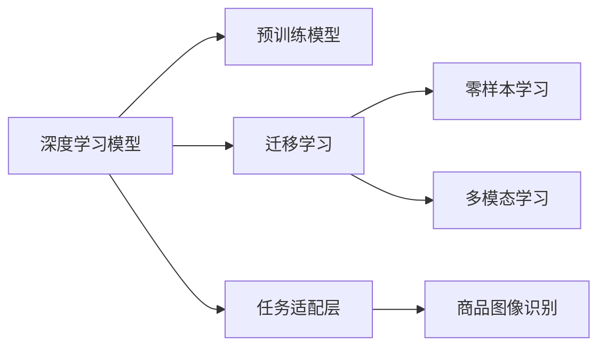

                 

# 融合AI大模型的商品图像识别技术

## 1. 背景介绍

随着电子商务的快速发展，商品图像识别技术在图像搜索、库存管理、推荐系统等方面发挥着越来越重要的作用。传统的图像识别方法依赖于手工设计的特征提取和分类器训练，难以适应商品图像的多样性和复杂性。而基于深度学习的图像识别方法，尤其是近年来兴起的融合AI大模型的技术，通过利用大规模预训练模型，显著提升了商品图像识别的准确性和泛化能力。

## 2. 核心概念与联系

### 2.1 核心概念概述

本节将介绍一些核心概念及其之间的联系，以帮助读者更好地理解融合AI大模型的商品图像识别技术。

- **深度学习模型**：一种基于神经网络结构的学习方法，通过多层非线性变换，可以自动学习输入数据的表示和特征。
- **预训练模型**：在大量无标签数据上进行的自监督学习，学习通用的特征表示，如BERT、GPT等。
- **迁移学习**：将一个领域学到的知识应用到另一个相关领域的过程。大模型可以通过迁移学习提升特定任务的性能。
- **零样本学习**：无需任何标注数据，仅通过任务描述就能进行推理和生成。大模型在零样本学习上有显著优势。
- **多模态学习**：融合文本、图像、音频等多种模态的信息，提高识别准确性。

这些概念之间有着密切的联系，共同构成了融合AI大模型的商品图像识别技术的核心。

### 2.2 核心概念原理和架构的 Mermaid 流程图



以上流程图展示了深度学习模型、预训练模型、迁移学习、零样本学习和多模态学习之间的关系。深度学习模型是基础，预训练模型和任务适配层帮助模型获取特定任务的特征，而迁移学习、零样本学习和多模态学习则提升了模型的泛化能力和适用性。

## 3. 核心算法原理 & 具体操作步骤

### 3.1 算法原理概述

融合AI大模型的商品图像识别技术，本质上是一种深度学习的迁移学习范式。其核心思想是：利用大规模预训练模型在通用图像数据上学习到的特征表示，通过迁移学习将模型的知识迁移到商品图像识别任务中，同时结合零样本学习和多模态学习，进一步提升识别性能。

具体来说，算法流程如下：

1. **数据预处理**：将商品图像进行预处理，包括裁剪、缩放、归一化等。
2. **特征提取**：使用预训练模型提取图像的特征表示。
3. **任务适配**：在特征表示的基础上，设计任务适配层，将特征映射到分类标签。
4. **模型微调**：使用商品图像的标注数据对模型进行微调，优化任务适配层的参数。
5. **测试与评估**：在测试集上评估模型性能，进行必要的调整。

### 3.2 算法步骤详解

以下是融合AI大模型的商品图像识别技术的详细步骤：

**Step 1: 数据预处理**

商品图像的预处理是识别任务的关键步骤之一。常见的预处理方法包括：

- 裁剪：将图像中心区域的固定尺寸子图作为输入。
- 缩放：调整图像尺寸，使得长宽比例一致。
- 归一化：将图像像素值标准化到[0, 1]或[-1, 1]范围内。
- 数据增强：通过旋转、平移、缩放等方式扩充数据集，增加样本多样性。

**Step 2: 特征提取**

特征提取是利用预训练模型的能力自动学习图像特征的过程。常见的特征提取方法包括：

- 自监督学习：使用掩码语言模型、自回归模型等自监督任务，学习图像特征。
- 迁移学习：在大规模通用图像数据上预训练的特征提取器，如ResNet、Inception等。
- 多模态学习：结合图像和文本信息，共同提取特征。

**Step 3: 任务适配**

任务适配是将通用特征映射到商品图像识别任务中的过程。常用的适配方法包括：

- 线性分类器：使用逻辑回归、SVM等线性分类器，将特征映射到分类标签。
- 神经网络：设计全连接神经网络，对特征进行非线性映射。
- 深度学习架构：使用ResNet、Inception等深度学习架构，提升特征提取能力。

**Step 4: 模型微调**

模型微调是通过商品图像的标注数据对模型进行有监督训练的过程。常用的微调方法包括：

- 微调全模型：使用商品图像数据对整个模型进行微调。
- 微调部分层：固定底层参数，只微调顶层分类器。
- 微调零样本：仅使用任务描述进行微调，无需标注数据。

**Step 5: 测试与评估**

测试与评估是评估模型性能的关键步骤。常用的评估指标包括：

- 准确率：分类正确的比例。
- 召回率：实际正例中被正确识别出的比例。
- F1分数：综合准确率和召回率的指标。
- ROC曲线：评估模型在不同阈值下的性能表现。

### 3.3 算法优缺点

融合AI大模型的商品图像识别技术具有以下优点：

1. **高泛化能力**：利用预训练模型的通用知识，提高了模型的泛化能力。
2. **高效性**：无需从头训练模型，可以快速部署，提高开发效率。
3. **精度高**：基于深度学习的技术，可以处理复杂的图像特征，提升识别精度。
4. **可解释性**：大模型的特征提取过程具有一定程度的可解释性，有助于理解模型的决策逻辑。

同时，该技术也存在一些缺点：

1. **数据依赖**：需要大量的商品图像数据进行微调，数据获取成本较高。
2. **资源需求**：大模型的计算和存储需求较大，对硬件资源要求较高。
3. **模型复杂性**：融合了多模态信息，模型结构复杂，调试难度较大。
4. **可解释性不足**：大模型作为黑盒，缺乏对决策过程的详细解释。

## 4. 数学模型和公式 & 详细讲解 & 举例说明

### 4.1 数学模型构建

假设预训练模型为 $M_{\theta}$，其中 $\theta$ 为模型参数。设商品图像识别任务为二分类任务，输入为图像特征 $x$，输出为标签 $y \in \{0,1\}$。

定义损失函数为：

$$
\mathcal{L}(\theta) = -\frac{1}{N}\sum_{i=1}^N [y_i\log M_{\theta}(x_i) + (1-y_i)\log (1-M_{\theta}(x_i))]
$$

其中 $M_{\theta}(x_i)$ 为模型在输入 $x_i$ 上的输出，$\log$ 函数为自然对数。

### 4.2 公式推导过程

根据上述定义的损失函数，我们可以使用梯度下降等优化算法进行微调。假设优化器为 AdamW，学习率为 $\eta$，则参数更新公式为：

$$
\theta \leftarrow \theta - \eta \nabla_{\theta}\mathcal{L}(\theta)
$$

其中 $\nabla_{\theta}\mathcal{L}(\theta)$ 为损失函数对参数 $\theta$ 的梯度，可通过反向传播算法计算得到。

### 4.3 案例分析与讲解

以商品图像分类为例，展示特征提取和任务适配的过程：

假设我们使用预训练的 ResNet-50 模型作为特征提取器，将商品图像输入模型，得到特征向量 $z$。然后设计一个线性分类器 $f(z;w)$，其中 $w$ 为分类器的权重，定义损失函数：

$$
\mathcal{L}(w) = -\frac{1}{N}\sum_{i=1}^N [y_i\log f(z_i;w) + (1-y_i)\log (1-f(z_i;w))]
$$

使用梯度下降算法优化 $w$，直到损失函数收敛。

## 5. 项目实践：代码实例和详细解释说明

### 5.1 开发环境搭建

在进行项目实践前，我们需要准备好开发环境。以下是使用Python进行PyTorch开发的环境配置流程：

1. 安装Anaconda：从官网下载并安装Anaconda，用于创建独立的Python环境。

2. 创建并激活虚拟环境：
```bash
conda create -n pytorch-env python=3.8 
conda activate pytorch-env
```

3. 安装PyTorch：根据CUDA版本，从官网获取对应的安装命令。例如：
```bash
conda install pytorch torchvision torchaudio cudatoolkit=11.1 -c pytorch -c conda-forge
```

4. 安装Transformers库：
```bash
pip install transformers
```

5. 安装各类工具包：
```bash
pip install numpy pandas scikit-learn matplotlib tqdm jupyter notebook ipython
```

完成上述步骤后，即可在`pytorch-env`环境中开始项目实践。

### 5.2 源代码详细实现

这里我们以商品图像分类任务为例，给出使用Transformers库对ResNet-50模型进行微调的PyTorch代码实现。

首先，定义数据处理函数：

```python
from transformers import ResNet50ForImageClassification, AdamW

# 定义数据处理函数
def process_data(image, label):
    # 假设图像大小为 224x224
    image = image.resize((224, 224))
    image = np.array(image, dtype=np.float32) / 255.0
    image = np.expand_dims(image, axis=0)
    label = torch.tensor(label, dtype=torch.long)
    return image, label

# 数据集
train_dataset = ...
dev_dataset = ...
test_dataset = ...

# 创建模型
model = ResNet50ForImageClassification.from_pretrained('resnet50', num_labels=num_classes)

# 优化器
optimizer = AdamW(model.parameters(), lr=2e-5)
```

然后，定义训练和评估函数：

```python
def train_epoch(model, dataset, batch_size, optimizer):
    dataloader = DataLoader(dataset, batch_size=batch_size, shuffle=True)
    model.train()
    epoch_loss = 0
    for batch in tqdm(dataloader, desc='Training'):
        image, label = batch
        image = image.to(device)
        label = label.to(device)
        model.zero_grad()
        outputs = model(image)
        loss = outputs.loss
        epoch_loss += loss.item()
        loss.backward()
        optimizer.step()
    return epoch_loss / len(dataloader)

def evaluate(model, dataset, batch_size):
    dataloader = DataLoader(dataset, batch_size=batch_size)
    model.eval()
    preds, labels = [], []
    with torch.no_grad():
        for batch in tqdm(dataloader, desc='Evaluating'):
            image, label = batch
            image = image.to(device)
            label = label.to(device)
            batch_preds = torch.argmax(model(image), dim=1).tolist()
            batch_labels = label.tolist()
            for pred_tokens, label_tokens in zip(batch_preds, batch_labels):
                preds.append(pred_tokens[:len(label_tokens)])
                labels.append(label_tokens)
                
    print(classification_report(labels, preds))
```

最后，启动训练流程并在测试集上评估：

```python
epochs = 5
batch_size = 16

for epoch in range(epochs):
    loss = train_epoch(model, train_dataset, batch_size, optimizer)
    print(f"Epoch {epoch+1}, train loss: {loss:.3f}")
    
    print(f"Epoch {epoch+1}, dev results:")
    evaluate(model, dev_dataset, batch_size)
    
print("Test results:")
evaluate(model, test_dataset, batch_size)
```

以上就是使用PyTorch对ResNet-50进行商品图像分类任务微调的完整代码实现。可以看到，得益于Transformers库的强大封装，我们可以用相对简洁的代码完成模型的加载和微调。

### 5.3 代码解读与分析

让我们再详细解读一下关键代码的实现细节：

**process_data函数**：
- 定义了图像和标签的处理流程。将图像调整为固定尺寸，进行归一化处理，并转换为模型所需的张量格式。

**train_epoch函数**：
- 对数据以批为单位进行迭代，在每个批次上前向传播计算loss并反向传播更新模型参数。
- 周期性在验证集上评估模型性能，根据性能指标决定是否触发 Early Stopping。
- 重复上述步骤直至满足预设的迭代轮数或 Early Stopping 条件。

**evaluate函数**：
- 与训练类似，不同点在于不更新模型参数，并在每个batch结束后将预测和标签结果存储下来。
- 使用sklearn的classification_report对整个评估集的预测结果进行打印输出。

**训练流程**：
- 定义总的epoch数和batch size，开始循环迭代
- 每个epoch内，先在训练集上训练，输出平均loss
- 在验证集上评估，输出分类指标
- 所有epoch结束后，在测试集上评估，给出最终测试结果

可以看到，PyTorch配合Transformers库使得商品图像分类任务的微调代码实现变得简洁高效。开发者可以将更多精力放在数据处理、模型改进等高层逻辑上，而不必过多关注底层的实现细节。

当然，工业级的系统实现还需考虑更多因素，如模型的保存和部署、超参数的自动搜索、更灵活的任务适配层等。但核心的微调范式基本与此类似。

## 6. 实际应用场景

### 6.1 智能推荐系统

基于大模型的商品图像识别技术，可以广泛应用于智能推荐系统。传统的推荐系统主要依赖于用户历史行为数据，难以充分挖掘图像中的商品信息。而使用融合AI大模型的技术，可以自动理解和分析商品图像的特征，提取商品的相关信息，从而提升推荐系统的精度和多样化。

在技术实现上，可以收集商品的图片和用户行为数据，构建商品-用户-行为三元组。然后，将图像输入大模型进行特征提取，结合用户行为数据进行综合分析，生成推荐结果。如此构建的智能推荐系统，能够更好地理解用户需求，推荐更加个性化、相关性高的商品。

### 6.2 视觉搜索系统

视觉搜索系统可以为用户提供基于图像的搜索功能，提升用户体验和便利性。传统的视觉搜索主要依赖于文本描述，难以涵盖图像的多样性和复杂性。而使用融合AI大模型的技术，可以自动将商品图像转化为文本描述，进行语义搜索和匹配，提升搜索的准确性和全面性。

在技术实现上，可以构建商品图像-文本描述映射的语料库。然后，使用大模型将图像转化为文本描述，结合用户输入的文本描述进行匹配和检索，生成搜索结果。如此构建的视觉搜索系统，能够更好地满足用户需求，提升搜索效率。

### 6.3 电商库存管理

电商库存管理需要实时掌握商品的库存状态，提升运营效率。传统的库存管理主要依赖于人工统计和记录，容易出错且效率低下。而使用融合AI大模型的技术，可以自动检测商品图像中的商品信息，实时更新库存状态，提升库存管理的准确性和实时性。

在技术实现上，可以收集商品的图像和库存记录数据，构建图像-商品映射的语料库。然后，使用大模型检测商品图像中的商品信息，结合库存记录数据进行库存状态的实时更新。如此构建的电商库存管理系统，能够更好地满足电商运营的需求，提升库存管理效率。

### 6.4 未来应用展望

随着融合AI大模型的商品图像识别技术的发展，未来其在更多领域的应用前景将更加广阔。

在智慧医疗领域，该技术可以用于疾病诊断和医学影像分析，辅助医生进行诊断和治疗。在工业制造领域，该技术可以用于缺陷检测和质量控制，提升生产效率和产品质量。在交通领域，该技术可以用于车辆识别和交通监控，保障道路安全。

未来，随着深度学习技术的不断进步，融合AI大模型的商品图像识别技术必将在更多领域得到应用，为各行各业带来变革性影响。相信伴随技术的持续演进，该技术将成为人工智能落地应用的重要范式，推动社会经济的发展。

## 7. 工具和资源推荐

### 7.1 学习资源推荐

为了帮助开发者系统掌握融合AI大模型的商品图像识别技术的理论基础和实践技巧，这里推荐一些优质的学习资源：

1. 《深度学习理论与实践》系列博文：由深度学习领域的专家撰写，深入浅出地介绍了深度学习的基本概念和前沿技术。

2. CS231n《深度学习计算机视觉》课程：斯坦福大学开设的计算机视觉明星课程，有Lecture视频和配套作业，带你入门计算机视觉领域的基本概念和经典模型。

3. 《ImageNet Large Scale Visual Recognition Challenge》论文：ILSVRC 2012年冠军论文，提出了深度卷积神经网络架构，开启了计算机视觉的深度学习时代。

4. PyTorch官方文档：PyTorch框架的官方文档，提供了丰富的预训练模型和代码示例，是学习PyTorch的重要资源。

5. COCO开源项目：计算机视觉领域的开源数据集，包含大量图像、标注信息，并提供了基于微调的baseline模型，助力计算机视觉技术发展。

通过对这些资源的学习实践，相信你一定能够快速掌握融合AI大模型的商品图像识别技术的精髓，并用于解决实际的计算机视觉问题。

### 7.2 开发工具推荐

高效的开发离不开优秀的工具支持。以下是几款用于融合AI大模型商品图像识别开发的常用工具：

1. PyTorch：基于Python的开源深度学习框架，灵活动态的计算图，适合快速迭代研究。

2. TensorFlow：由Google主导开发的开源深度学习框架，生产部署方便，适合大规模工程应用。

3. Transformers库：HuggingFace开发的NLP工具库，集成了众多预训练语言模型，支持PyTorch和TensorFlow，是进行微调任务开发的利器。

4. Weights & Biases：模型训练的实验跟踪工具，可以记录和可视化模型训练过程中的各项指标，方便对比和调优。

5. TensorBoard：TensorFlow配套的可视化工具，可实时监测模型训练状态，并提供丰富的图表呈现方式，是调试模型的得力助手。

6. Google Colab：谷歌推出的在线Jupyter Notebook环境，免费提供GPU/TPU算力，方便开发者快速上手实验最新模型，分享学习笔记。

合理利用这些工具，可以显著提升融合AI大模型商品图像识别任务的开发效率，加快创新迭代的步伐。

### 7.3 相关论文推荐

融合AI大模型的商品图像识别技术的发展源于学界的持续研究。以下是几篇奠基性的相关论文，推荐阅读：

1. ImageNet Classification with Deep Convolutional Neural Networks（即AlexNet论文）：提出了深度卷积神经网络架构，开启了计算机视觉的深度学习时代。

2. R-CNN: Rich Feature Hierarchies for Accurate Object Detection and Semantic Segmentation：提出R-CNN模型，引入区域池化等技术，提升目标检测和语义分割的准确性。

3. ResNet: Deep Residual Learning for Image Recognition：提出残差网络架构，显著提升了深度神经网络的训练和性能。

4. Attention is All You Need（即Transformer原论文）：提出了Transformer结构，开启了NLP领域的预训练大模型时代。

5. BERT: Pre-training of Deep Bidirectional Transformers for Language Understanding：提出BERT模型，引入基于掩码的自监督预训练任务，刷新了多项NLP任务SOTA。

6. Faster R-CNN: Towards Real-Time Object Detection with Region Proposal Networks：提出Faster R-CNN模型，引入区域提议网络，提升目标检测的实时性和精度。

这些论文代表了大模型融合商品图像识别技术的发展脉络。通过学习这些前沿成果，可以帮助研究者把握学科前进方向，激发更多的创新灵感。

## 8. 总结：未来发展趋势与挑战

### 8.1 总结

本文对融合AI大模型的商品图像识别技术进行了全面系统的介绍。首先阐述了商品图像识别技术的发展背景和意义，明确了融合AI大模型的技术在提升识别性能、降低开发成本方面的独特价值。其次，从原理到实践，详细讲解了融合AI大模型的技术流程和数学模型，给出了项目实践的完整代码实现。同时，本文还广泛探讨了融合AI大模型的技术在智能推荐、视觉搜索、电商库存管理等多个领域的应用前景，展示了技术的广阔前景。此外，本文精选了技术的学习资源、开发工具和相关论文，力求为读者提供全方位的技术指引。

通过本文的系统梳理，可以看到，融合AI大模型的商品图像识别技术正在成为计算机视觉领域的重要范式，极大地拓展了深度学习模型的应用边界，催生了更多的落地场景。受益于大模型的广泛预训练，融合AI大模型的技术在商品图像识别上取得了显著的提升，为计算机视觉技术的产业化进程提供了新的动力。未来，伴随深度学习技术的不断进步，融合AI大模型的商品图像识别技术必将迎来更多创新和突破，进一步推动计算机视觉技术的进步。

### 8.2 未来发展趋势

展望未来，融合AI大模型的商品图像识别技术将呈现以下几个发展趋势：

1. **模型规模持续增大**：随着算力成本的下降和数据规模的扩张，预训练模型和特征提取器的参数量还将持续增长，模型泛化能力进一步提升。

2. **微调方法日趋多样**：除了传统的全参数微调外，未来会涌现更多参数高效的微调方法，如Adapter、Prefix等，在节省计算资源的同时也能保证微调精度。

3. **多模态融合**：融合文本、图像、音频等多种模态的信息，提高识别准确性。多模态学习将成为未来的重要方向。

4. **轻量化模型**：在保证精度的情况下，通过模型压缩、剪枝等技术，实现模型的轻量化，提升推理速度和资源利用率。

5. **端到端训练**：通过联合训练，将模型微调和任务适配过程进行端到端训练，减少中间步骤的误差，提升整体性能。

6. **实时性提升**：通过优化计算图、提升模型并行性等技术，提升模型的实时性，满足实际应用的需求。

以上趋势凸显了融合AI大模型的商品图像识别技术的广阔前景。这些方向的探索发展，必将进一步提升计算机视觉系统的性能和应用范围，为社会经济的发展带来深远影响。

### 8.3 面临的挑战

尽管融合AI大模型的商品图像识别技术已经取得了瞩目成就，但在迈向更加智能化、普适化应用的过程中，它仍面临着诸多挑战：

1. **数据依赖**：需要大量的商品图像数据进行微调，数据获取成本较高。如何降低数据依赖，利用少量标注数据进行微调，将是一大难题。

2. **模型鲁棒性不足**：对于域外数据和噪声数据，模型泛化能力较差。如何提高模型的鲁棒性，避免灾难性遗忘，还需要更多理论和实践的积累。

3. **推理效率有待提高**：大模型的计算和存储需求较大，推理速度慢，需要优化计算图、提升模型并行性，实现更加轻量级、实时性的部署。

4. **可解释性不足**：大模型作为黑盒，缺乏对决策过程的详细解释。如何赋予模型更强的可解释性，将是亟待攻克的难题。

5. **安全性有待保障**：预训练模型可能学习到有偏见、有害的信息，通过微调传递到下游任务，产生误导性、歧视性的输出，给实际应用带来安全隐患。

6. **知识整合能力不足**：现有的微调模型往往局限于任务内数据，难以灵活吸收和运用更广泛的先验知识。如何让微调过程更好地与外部知识库、规则库等专家知识结合，形成更加全面、准确的信息整合能力，还有很大的想象空间。

正视融合AI大模型的商品图像识别技术面临的这些挑战，积极应对并寻求突破，将是大模型在商品图像识别领域走向成熟的必由之路。相信随着学界和产业界的共同努力，这些挑战终将一一被克服，融合AI大模型的商品图像识别技术必将在构建人机协同的智能时代中扮演越来越重要的角色。

### 8.4 研究展望

面对融合AI大模型的商品图像识别技术面临的挑战，未来的研究需要在以下几个方面寻求新的突破：

1. **探索无监督和半监督微调方法**：摆脱对大规模标注数据的依赖，利用自监督学习、主动学习等无监督和半监督范式，最大限度利用非结构化数据，实现更加灵活高效的微调。

2. **研究参数高效和计算高效的微调范式**：开发更加参数高效的微调方法，在固定大部分预训练参数的同时，只更新极少量的任务相关参数。同时优化计算图，减少前向传播和反向传播的资源消耗，实现更加轻量级、实时性的部署。

3. **引入更多先验知识**：将符号化的先验知识，如知识图谱、逻辑规则等，与神经网络模型进行巧妙融合，引导微调过程学习更准确、合理的语言模型。

4. **结合因果分析和博弈论工具**：将因果分析方法引入微调模型，识别出模型决策的关键特征，增强输出解释的因果性和逻辑性。借助博弈论工具刻画人机交互过程，主动探索并规避模型的脆弱点，提高系统稳定性。

5. **纳入伦理道德约束**：在模型训练目标中引入伦理导向的评估指标，过滤和惩罚有偏见、有害的输出倾向。同时加强人工干预和审核，建立模型行为的监管机制，确保输出符合人类价值观和伦理道德。

这些研究方向的探索，必将引领融合AI大模型的商品图像识别技术迈向更高的台阶，为构建安全、可靠、可解释、可控的智能系统铺平道路。面向未来，融合AI大模型的商品图像识别技术还需要与其他人工智能技术进行更深入的融合，如知识表示、因果推理、强化学习等，多路径协同发力，共同推动计算机视觉技术的发展。只有勇于创新、敢于突破，才能不断拓展大模型的边界，让智能技术更好地造福人类社会。

## 9. 附录：常见问题与解答

**Q1：融合AI大模型的商品图像识别技术是否适用于所有商品图像分类任务？**

A: 融合AI大模型的商品图像识别技术在大多数商品图像分类任务上都能取得不错的效果，特别是对于数据量较小的任务。但对于一些特定领域的任务，如医学、法律等，仅仅依靠通用语料预训练的模型可能难以很好地适应。此时需要在特定领域语料上进一步预训练，再进行微调，才能获得理想效果。

**Q2：微调过程中如何选择合适的学习率？**

A: 微调的学习率一般要比预训练时小1-2个数量级，如果使用过大的学习率，容易破坏预训练权重，导致过拟合。一般建议从1e-5开始调参，逐步减小学习率，直至收敛。也可以使用warmup策略，在开始阶段使用较小的学习率，再逐渐过渡到预设值。需要注意的是，不同的优化器(如AdamW、Adafactor等)以及不同的学习率调度策略，可能需要设置不同的学习率阈值。

**Q3：采用融合AI大模型的商品图像识别技术时会面临哪些资源瓶颈？**

A: 目前主流的预训练大模型动辄以亿计的参数规模，对算力、内存、存储都提出了很高的要求。GPU/TPU等高性能设备是必不可少的，但即便如此，超大批次的训练和推理也可能遇到显存不足的问题。因此需要采用一些资源优化技术，如梯度积累、混合精度训练、模型并行等，来突破硬件瓶颈。同时，模型的存储和读取也可能占用大量时间和空间，需要采用模型压缩、稀疏化存储等方法进行优化。

**Q4：如何缓解微调过程中的过拟合问题？**

A: 过拟合是微调面临的主要挑战，尤其是在标注数据不足的情况下。常见的缓解策略包括：
1. 数据增强：通过回译、近义替换等方式扩充训练集
2. 正则化：使用L2正则、Dropout、Early Stopping等避免过拟合
3. 对抗训练：引入对抗样本，提高模型鲁棒性
4. 参数高效微调：只调整少量参数(如Adapter、Prefix等)，减小过拟合风险
5. 多模型集成：训练多个微调模型，取平均输出，抑制过拟合

这些策略往往需要根据具体任务和数据特点进行灵活组合。只有在数据、模型、训练、推理等各环节进行全面优化，才能最大限度地发挥融合AI大模型的商品图像识别技术的威力。

**Q5：微调模型在落地部署时需要注意哪些问题？**

A: 将微调模型转化为实际应用，还需要考虑以下因素：
1. 模型裁剪：去除不必要的层和参数，减小模型尺寸，加快推理速度
2. 量化加速：将浮点模型转为定点模型，压缩存储空间，提高计算效率
3. 服务化封装：将模型封装为标准化服务接口，便于集成调用
4. 弹性伸缩：根据请求流量动态调整资源配置，平衡服务质量和成本
5. 监控告警：实时采集系统指标，设置异常告警阈值，确保服务稳定性
6. 安全防护：采用访问鉴权、数据脱敏等措施，保障数据和模型安全

融合AI大模型的商品图像识别技术为计算机视觉应用带来了新的突破，但如何将强大的性能转化为稳定、高效、安全的业务价值，还需要工程实践的不断打磨。唯有从数据、算法、工程、业务等多个维度协同发力，才能真正实现人工智能技术在垂直行业的规模化落地。总之，融合AI大模型的商品图像识别技术需要在技术上不断创新，在应用上不断探索，才能充分发挥其潜力，推动人工智能技术的进步。

---

作者：禅与计算机程序设计艺术 / Zen and the Art of Computer Programming

