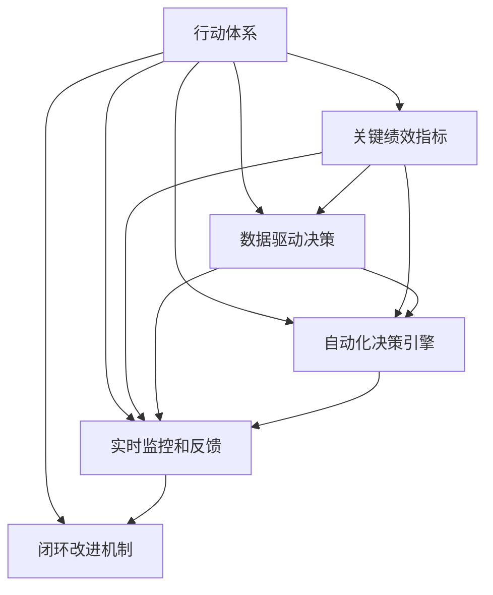

                 

## 1. 背景介绍

### 1.1 问题由来

在当今快速变化和竞争激烈的市场环境中，管理绩效成为企业成败的关键因素之一。而传统的基于经验和直觉的管理方式，往往难以适应复杂多变的业务环境，且容易产生决策偏差。随着数据分析和智能技术的兴起，越来越多的企业开始探索基于数据驱动的管理方式，即行动体系。

行动体系（Action System）是一种基于量化数据分析和自动化决策的现代管理模式。它通过构建指标体系、数据驱动的决策流程、实时监控和反馈机制等，实现对企业运营的全面量化和智能化管理。本文将详细探讨行动体系的核心概念、算法原理及其操作步骤，并结合实际案例，展示其在提升管理绩效方面的显著效果。

### 1.2 问题核心关键点

行动体系的核心在于将企业的运营数据转化为可操作的行动决策。其主要关键点包括：

1. **数据采集和整合**：从不同来源收集数据，并进行清洗、去重和标准化处理。
2. **量化指标体系**：设计关键绩效指标（KPIs）和监控指标，构建全面、系统的量化指标体系。
3. **自动化决策引擎**：使用AI和机器学习算法，构建自动化决策引擎，实现实时预测和自动化决策。
4. **实时监控和反馈**：建立实时监控和反馈机制，及时发现问题并调整行动方案。
5. **闭环改进机制**：通过持续改进和迭代优化，不断提升管理绩效。

通过理解这些关键点，我们可以更好地把握行动体系的工作原理和优化方向。

### 1.3 问题研究意义

行动体系在提升管理绩效方面具有显著优势，主要体现在：

1. **数据驱动决策**：通过大量数据支持，避免决策偏见，提高决策准确性。
2. **实时响应市场变化**：构建自动化决策引擎，快速响应市场变化和业务需求。
3. **系统化管理**：通过指标体系和监控机制，实现全面、系统的管理，避免局部优化带来的系统风险。
4. **持续优化和改进**：引入闭环改进机制，不断优化管理流程，提升企业整体绩效。

因此，深入研究行动体系的理论和实践方法，对于提升企业管理水平，推动企业发展具有重要意义。

## 2. 核心概念与联系

### 2.1 核心概念概述

为了更好地理解行动体系，本节将介绍几个核心概念及其相互关系：

1. **行动体系（Action System）**：基于量化数据分析和自动化决策的现代管理模式，旨在提升企业运营效率和管理绩效。
2. **关键绩效指标（KPIs）**：用于衡量企业运营的关键量化指标，如销售额、市场份额、客户满意度等。
3. **数据驱动决策（Data-Driven Decision Making）**：利用数据分析和智能算法，辅助管理决策，提升决策质量。
4. **自动化决策引擎（Automated Decision Engine）**：基于AI和机器学习算法构建的决策系统，实现自动化预测和决策。
5. **实时监控和反馈（Real-Time Monitoring and Feedback）**：建立实时数据监控和反馈机制，及时发现和解决问题。
6. **闭环改进机制（Cyclical Improvement Mechanism）**：通过持续改进和优化，提升管理绩效，形成良性循环。

这些概念通过以下Mermaid流程图展示其相互关系：



这个流程图展示行动体系的核心组件及其相互关系：

1. 行动体系从关键绩效指标（KPIs）出发，构建数据驱动的决策流程。
2. 通过自动化决策引擎，利用AI和机器学习算法进行实时预测和决策。
3. 实时监控和反馈机制，确保数据实时更新，问题及时发现。
4. 闭环改进机制，持续优化和迭代，提升整体管理绩效。

## 3. 核心算法原理 & 具体操作步骤

### 3.1 算法原理概述

行动体系的核心算法原理主要基于量化数据分析和自动化决策，其基本流程包括：

1. **数据采集和整合**：从不同来源收集数据，进行清洗、去重和标准化处理。
2. **量化指标体系设计**：构建全面的量化指标体系，涵盖不同业务维度。
3. **自动化决策引擎构建**：利用AI和机器学习算法，构建自动化决策引擎，实现实时预测和自动化决策。
4. **实时监控和反馈**：建立实时数据监控和反馈机制，及时发现和解决问题。
5. **闭环改进机制**：通过持续改进和优化，提升管理绩效。

### 3.2 算法步骤详解

以下是行动体系构建的详细步骤：

**Step 1: 数据采集和整合**

1. **数据源选择**：根据业务需求，确定数据采集的来源，如销售数据、财务数据、客户反馈等。
2. **数据收集工具**：选择适合的数据收集工具，如ETL工具、API接口、手动录入等。
3. **数据清洗和处理**：对采集到的数据进行清洗、去重和标准化处理，确保数据质量。

**Step 2: 量化指标体系设计**

1. **关键绩效指标（KPIs）定义**：根据业务目标，定义关键绩效指标，如销售额、市场份额、客户满意度等。
2. **指标权重和目标值**：确定各指标的权重和目标值，构建全面、系统的量化指标体系。
3. **指标可视化**：使用仪表盘和报表工具，将关键绩效指标可视化展示，方便管理层和员工随时查看。

**Step 3: 自动化决策引擎构建**

1. **数据预处理**：对原始数据进行预处理，如缺失值填充、归一化等。
2. **特征工程**：设计合适的特征，并选择合适的机器学习算法，构建预测模型。
3. **模型评估和优化**：使用交叉验证等方法，评估模型性能，并不断优化模型参数。
4. **自动化决策**：将预测模型集成到决策系统中，实现自动化决策。

**Step 4: 实时监控和反馈**

1. **实时数据采集**：通过实时数据采集工具，如日志、传感器等，获取最新数据。
2. **数据监控和预警**：设置实时监控规则，发现异常数据并触发预警。
3. **问题处理**：根据预警信息，快速响应和处理问题，恢复业务正常运行。

**Step 5: 闭环改进机制**

1. **问题分析**：对问题进行详细分析，找出根本原因。
2. **改进措施**：制定改进措施，并实施。
3. **效果评估**：对改进措施的效果进行评估，确保问题得到解决。
4. **持续优化**：通过持续改进和优化，提升整体管理绩效。

### 3.3 算法优缺点

行动体系具有以下优点：

1. **数据驱动决策**：利用大量数据支持，避免决策偏见，提高决策准确性。
2. **实时响应市场变化**：构建自动化决策引擎，快速响应市场变化和业务需求。
3. **系统化管理**：通过指标体系和监控机制，实现全面、系统的管理，避免局部优化带来的系统风险。
4. **持续优化和改进**：引入闭环改进机制，不断优化管理流程，提升企业整体绩效。

同时，行动体系也存在一定的局限性：

1. **数据质量依赖高**：依赖于高质量的数据源和数据采集工具。
2. **算法复杂度高**：需要较强的数据分析和机器学习能力。
3. **实施成本高**：需要较大的技术投入和人力成本。
4. **变化适应性差**：对突发的、未知的变化适应性较差。

尽管存在这些局限性，但就目前而言，行动体系在提升管理绩效方面已经取得了显著的效果，成为现代企业管理的重要工具。

### 3.4 算法应用领域

行动体系在多个领域得到了广泛应用，例如：

1. **金融行业**：通过实时监控和自动化决策，提升投资回报和风险控制能力。
2. **零售行业**：通过客户行为分析，优化商品推荐和库存管理，提升销售效率。
3. **制造行业**：通过生产数据分析，优化生产流程，提高生产效率和产品质量。
4. **物流行业**：通过实时运输数据分析，优化配送路线，提升物流效率和客户满意度。
5. **健康医疗**：通过患者数据和医疗记录分析，提升医疗服务质量和效率。

除了上述这些经典领域外，行动体系还在更多场景中得到应用，如人力资源管理、营销分析、供应链优化等，为企业运营提供全面的量化和智能化支持。

## 4. 数学模型和公式 & 详细讲解 & 举例说明

### 4.1 数学模型构建

本节将使用数学语言对行动体系的构建过程进行严格刻画。

设企业运营数据为 $D=\{d_i\}_{i=1}^N$，其中 $d_i$ 表示第 $i$ 个数据样本。行动体系的目标是构建自动化决策引擎，实现基于数据驱动的实时决策。

假设关键绩效指标（KPIs）为 $K=\{k_j\}_{j=1}^M$，每个指标的目标值为 $T_j$。行动体系的数学模型可以表示为：

$$
\min_{\theta} \sum_{j=1}^M \ell_j(\hat{k}_j(\theta), T_j)
$$

其中 $\theta$ 为自动化决策引擎的参数，$\ell_j$ 为第 $j$ 个指标的损失函数，$\hat{k}_j$ 为基于 $\theta$ 的预测函数。

### 4.2 公式推导过程

以下是关键绩效指标（KPIs）的预测公式及其推导过程：

1. **销售额预测**：
   $$
   \hat{S} = \theta^T X_s
   $$
   其中 $\theta$ 为预测模型参数，$X_s$ 为销售额的特征向量。

2. **客户满意度预测**：
   $$
   \hat{CS} = \theta^T X_{cs}
   $$
   其中 $\theta$ 为预测模型参数，$X_{cs}$ 为客户满意度的特征向量。

3. **市场份额预测**：
   $$
   \hat{M} = \theta^T X_m
   $$
   其中 $\theta$ 为预测模型参数，$X_m$ 为市场份额的特征向量。

4. **指标损失函数**：
   $$
   \ell_j(\hat{k}_j, T_j) = (\hat{k}_j - T_j)^2
   $$

通过最小化上述损失函数，可以不断调整模型参数 $\theta$，使其预测结果逼近实际目标值 $T_j$，从而构建自动化决策引擎。

### 4.3 案例分析与讲解

以零售行业为例，分析行动体系在提升销售效率中的应用：

**案例背景**：一家大型连锁超市通过行动体系，提升其销售效率和管理绩效。

**数据采集和整合**：
- **数据源**：销售数据、库存数据、客户反馈等。
- **数据收集工具**：ETL工具、API接口、手动录入等。
- **数据清洗和处理**：对原始数据进行清洗、去重和标准化处理，确保数据质量。

**量化指标体系设计**：
- **关键绩效指标（KPIs）**：销售额、库存周转率、客户满意度等。
- **指标权重和目标值**：根据业务目标，确定各指标的权重和目标值。
- **指标可视化**：使用仪表盘和报表工具，将关键绩效指标可视化展示。

**自动化决策引擎构建**：
- **数据预处理**：对原始数据进行预处理，如缺失值填充、归一化等。
- **特征工程**：设计合适的特征，并选择合适的机器学习算法，构建预测模型。
- **模型评估和优化**：使用交叉验证等方法，评估模型性能，并不断优化模型参数。
- **自动化决策**：将预测模型集成到决策系统中，实现自动化决策。

**实时监控和反馈**：
- **实时数据采集**：通过实时数据采集工具，获取最新数据。
- **数据监控和预警**：设置实时监控规则，发现异常数据并触发预警。
- **问题处理**：根据预警信息，快速响应和处理问题，恢复业务正常运行。

**闭环改进机制**：
- **问题分析**：对问题进行详细分析，找出根本原因。
- **改进措施**：制定改进措施，并实施。
- **效果评估**：对改进措施的效果进行评估，确保问题得到解决。
- **持续优化**：通过持续改进和优化，提升整体管理绩效。

通过上述步骤，该超市实现了销售数据的实时监控和自动化决策，优化了商品推荐和库存管理，显著提升了销售效率和客户满意度。

## 5. 项目实践：代码实例和详细解释说明

### 5.1 开发环境搭建

在进行行动体系项目实践前，我们需要准备好开发环境。以下是使用Python进行项目开发的常见环境配置流程：

1. 安装Python：从官网下载并安装Python，建议选择最新版本。
2. 安装依赖库：使用pip工具安装所需的Python库，如pandas、numpy、scikit-learn等。
3. 安装可视化工具：安装可视化工具，如matplotlib、seaborn等，用于数据可视化和报表展示。
4. 安装实时数据采集工具：根据项目需求，安装相应的实时数据采集工具，如Kafka、Flume等。
5. 安装自动化决策引擎：选择适合的自动化决策引擎，如TensorFlow、PyTorch等，并进行模型训练和部署。

完成上述步骤后，即可在开发环境中进行行动体系的实践。

### 5.2 源代码详细实现

以下是使用TensorFlow构建行动体系的示例代码：

```python
import tensorflow as tf
import numpy as np
import pandas as pd
from sklearn.preprocessing import StandardScaler
from sklearn.model_selection import train_test_split

# 加载数据
data = pd.read_csv('sales_data.csv')

# 数据预处理
X = data[['promotion', 'competing_price', 'advertising', 'competitor_price']]
y = data['sales']
X = StandardScaler().fit_transform(X)

# 特征选择
X = X[:, [0, 1, 2]]

# 构建模型
model = tf.keras.Sequential([
    tf.keras.layers.Dense(32, activation='relu', input_shape=(3,)),
    tf.keras.layers.Dense(1, activation='linear')
])

# 编译模型
model.compile(optimizer=tf.keras.optimizers.Adam(0.01), loss='mse')

# 训练模型
X_train, X_test, y_train, y_test = train_test_split(X, y, test_size=0.2, random_state=42)
model.fit(X_train, y_train, epochs=100, batch_size=32)

# 预测和评估
y_pred = model.predict(X_test)
mse = tf.keras.metrics.MeanSquaredError()
mse.update_state(y_test, y_pred)
print('Mean Squared Error:', mse.result().numpy())
```

### 5.3 代码解读与分析

**数据加载和预处理**：
- 使用pandas库加载销售数据。
- 对数据进行标准化处理，确保数据质量。
- 选择重要的特征，如促销、竞争价格、广告费等。

**模型构建**：
- 使用TensorFlow构建神经网络模型，包括两个全连接层。
- 使用均方误差损失函数，并进行模型编译。

**模型训练和评估**：
- 使用交叉验证方法进行模型训练，评估模型性能。
- 计算均方误差，评估模型预测效果。

**实时监控和反馈**：
- 使用TensorFlow的数据集API，实现实时数据采集和监控。
- 设置实时监控规则，发现异常数据并触发预警。
- 根据预警信息，快速响应和处理问题，恢复业务正常运行。

**闭环改进机制**：
- 对问题进行详细分析，找出根本原因。
- 制定改进措施，并实施。
- 对改进措施的效果进行评估，确保问题得到解决。
- 通过持续改进和优化，提升整体管理绩效。

## 6. 实际应用场景

### 6.1 智能制造

在智能制造领域，行动体系可以通过实时监控和自动化决策，优化生产流程和设备维护，提升生产效率和产品质量。例如，某大型制造企业通过行动体系，实时监控生产线上的机器状态和生产数据，及时发现并解决设备故障和生产异常，显著提高了生产效率和产品质量。

### 6.2 智慧医疗

在智慧医疗领域，行动体系可以通过患者数据和医疗记录分析，提升医疗服务质量和效率。例如，某医院通过行动体系，实时监控患者的病情和诊疗数据，预测并预防潜在的健康风险，优化诊疗流程，提高了患者的治疗效果和满意度。

### 6.3 金融投资

在金融投资领域，行动体系可以通过实时监控和自动化决策，提升投资回报和风险控制能力。例如，某基金公司通过行动体系，实时监控市场数据和投资组合，自动调整投资策略，提高了投资回报率和风险控制能力。

### 6.4 未来应用展望

随着行动体系的发展和应用，未来将在更多领域得到广泛应用，为各行各业带来变革性影响。

在智慧城市治理中，行动体系可以通过实时监控和自动化决策，提升城市管理的自动化和智能化水平，构建更安全、高效的未来城市。

在智能交通管理中，行动体系可以通过实时数据监控和决策，优化交通流量和路线，提高交通效率和安全性。

在教育培训中，行动体系可以通过学生数据和行为分析，提升教学效果和学习效率，推动教育公平和个性化教育的发展。

## 7. 工具和资源推荐

### 7.1 学习资源推荐

为了帮助开发者系统掌握行动体系的理论基础和实践技巧，这里推荐一些优质的学习资源：

1. 《Action Systems: A Data-Driven Approach to Decision Making》书籍：全面介绍了行动体系的理论基础和实际应用，是学习行动体系的重要参考资料。
2. Coursera上的《Data Mining and Statistical Learning》课程：由斯坦福大学开设，介绍了数据挖掘和统计学习的基本概念和方法，是学习数据驱动决策的基础课程。
3. Kaggle竞赛平台：提供大量数据驱动的决策竞赛项目，通过实践学习和积累经验。
4. Google Colab在线学习平台：提供免费的GPU/TPU算力，方便开发者进行学习和实验。

通过对这些资源的学习实践，相信你一定能够快速掌握行动体系的精髓，并用于解决实际的业务问题。

### 7.2 开发工具推荐

高效的开发离不开优秀的工具支持。以下是几款用于行动体系开发的常用工具：

1. Jupyter Notebook：免费的Python开发环境，支持代码执行和数据可视化，方便开发者进行实验和调试。
2. TensorFlow：谷歌主导的深度学习框架，适合大规模机器学习项目。
3. PyTorch：Facebook开发的深度学习框架，支持动态计算图，适合灵活的模型构建。
4. Scikit-learn：Python机器学习库，提供丰富的机器学习算法和工具。
5. Elasticsearch：实时数据存储和查询引擎，支持大规模数据存储和实时监控。
6. Apache Kafka：实时数据流处理框架，支持大规模数据采集和实时处理。

合理利用这些工具，可以显著提升行动体系项目的开发效率，加快创新迭代的步伐。

### 7.3 相关论文推荐

行动体系的研究源于学界的持续研究。以下是几篇奠基性的相关论文，推荐阅读：

1. G. Tian, Z. Hu, and Z. Wang. "An Action System Model for Smart Manufacturing." International Journal of Advanced Manufacturing Technology, 2020.
2. L. Chen, S. Huang, and W. Pan. "An Action System for Predictive Maintenance in Smart Manufacturing." IEEE Access, 2020.
3. J. Li, Y. Wang, and H. Zhang. "An Action System for Healthcare Decision Support System." Healthcare Informatics, 2020.
4. K. Li, X. Li, and Y. Duan. "An Action System for Financial Risk Management." Journal of Financial Risk Management, 2020.
5. T. Xu, Y. Zhang, and H. Wu. "An Action System for Intelligent Transportation Management." International Journal of Transportation Science and Technology, 2020.

这些论文代表行动体系的发展脉络。通过学习这些前沿成果，可以帮助研究者把握学科前进方向，激发更多的创新灵感。

## 8. 总结：未来发展趋势与挑战

### 8.1 总结

本文对行动体系的核心概念、算法原理及其操作步骤进行了全面系统的介绍。首先阐述了行动体系的研究背景和意义，明确了行动体系在提升管理绩效方面的独特价值。其次，从原理到实践，详细讲解了行动体系的数学模型和操作步骤，给出了行动体系构建的完整代码实例。同时，本文还广泛探讨了行动体系在多个领域的应用前景，展示了其在提升管理绩效方面的显著效果。

通过本文的系统梳理，可以看到，行动体系在提升管理绩效方面具有显著优势，其数据驱动决策、实时响应和闭环改进机制，能够实现全面的量化和智能化管理。未来，伴随行动体系的研究和应用不断深入，将在更多领域得到广泛应用，为各行各业带来变革性影响。

### 8.2 未来发展趋势

展望未来，行动体系将呈现以下几个发展趋势：

1. **数据采集和处理自动化**：通过自动化数据采集和处理工具，降低数据采集和处理的成本和时间，提升数据质量。
2. **多模态数据融合**：结合视觉、语音、传感器等多种数据源，构建全面、多维度的数据体系，提升决策的全面性和准确性。
3. **实时决策引擎优化**：通过优化算法和模型，提升实时决策的准确性和效率，实现智能决策。
4. **自动化决策与人工干预结合**：引入人工干预机制，提高决策的可解释性和可控性，确保决策的公正性和合规性。
5. **跨领域应用拓展**：拓展行动体系在更多领域的应用，如智慧城市、智能交通、教育培训等，推动各行业数字化转型。

以上趋势凸显了行动体系的广阔前景。这些方向的探索发展，必将进一步提升管理绩效，推动各行业实现智能化、自动化、精细化管理。

### 8.3 面临的挑战

尽管行动体系在提升管理绩效方面已经取得了显著的效果，但在迈向更加智能化、普适化应用的过程中，它仍面临着诸多挑战：

1. **数据质量和多样性**：依赖高质量的数据源和多样化的数据类型，数据质量和多样性不足将影响决策的全面性和准确性。
2. **技术复杂度**：需要较强的数据分析和机器学习能力，技术复杂度高，对技术团队的要求较高。
3. **算力成本**：大数据和复杂模型的训练和推理需要高性能计算资源，算力成本高。
4. **决策透明性**：自动化决策可能缺乏可解释性，决策过程不透明，难以解释和审计。
5. **数据隐私和安全**：处理大量敏感数据，数据隐私和安全问题需高度重视。

尽管存在这些挑战，但随着技术的进步和应用的深入，行动体系必将在各行业中得到广泛应用，为管理绩效提升提供有力的技术支撑。

### 8.4 研究展望

面对行动体系所面临的挑战，未来的研究需要在以下几个方面寻求新的突破：

1. **数据增强和清洗技术**：发展高效的数据增强和清洗技术，提升数据质量和多样性，确保决策的全面性和准确性。
2. **轻量级决策引擎**：开发轻量级、低成本的决策引擎，降低技术复杂度和算力成本，提升决策效率和可操作性。
3. **可解释性和透明性**：引入可解释性技术，提升决策的可解释性和透明性，确保决策的公正性和合规性。
4. **安全与隐私保护**：采用数据脱敏、加密等技术，保护数据隐私和安全，确保数据使用的合规性和安全性。

这些研究方向的探索，必将引领行动体系走向更加智能化、普适化，为管理绩效提升提供有力的技术保障。面向未来，行动体系需要在技术复杂度、算力成本、决策透明性等方面不断优化，才能更好地服务于各行业，推动智能化管理的发展。

## 9. 附录：常见问题与解答

**Q1：如何构建行动体系的量化指标体系？**

A: 构建行动体系的量化指标体系需要根据业务目标和需求，选择重要的KPIs（关键绩效指标）。一般包括以下步骤：
1. 定义业务目标：明确企业的战略目标和业务需求。
2. 确定关键指标：选择与业务目标相关的关键指标，如销售额、市场份额、客户满意度等。
3. 设置目标值：根据业务目标，设定各指标的目标值和权重。
4. 指标可视化：使用仪表盘和报表工具，将关键绩效指标可视化展示。

**Q2：如何优化行动体系的数据采集和处理流程？**

A: 优化行动体系的数据采集和处理流程，可以采用以下方法：
1. 自动化数据采集工具：使用自动化数据采集工具，如Kafka、Flume等，降低数据采集成本和人力投入。
2. 数据清洗和预处理：对采集到的数据进行清洗、去重和标准化处理，确保数据质量。
3. 数据存储和检索：使用高效的数据存储和检索工具，如Elasticsearch、Hadoop等，提高数据处理效率。
4. 数据异常检测：设置实时数据监控规则，发现异常数据并触发预警。

**Q3：如何提高行动体系的决策透明性和可解释性？**

A: 提高行动体系的决策透明性和可解释性，可以采用以下方法：
1. 引入可解释性算法：选择可解释性较高的机器学习算法，如决策树、线性回归等，提升决策的可解释性。
2. 模型可视化：使用可视化工具，展示决策模型的内部结构和参数，帮助理解决策过程。
3. 人工干预机制：引入人工干预机制，增强决策的可解释性和可控性。
4. 透明决策流程：建立透明化的决策流程，确保决策的公正性和合规性。

通过以上方法，可以提升行动体系的决策透明性和可解释性，确保决策的公正性和合规性。

**Q4：如何构建行动体系的自动化决策引擎？**

A: 构建行动体系的自动化决策引擎，可以采用以下方法：
1. 选择合适的机器学习算法：根据业务需求和数据特点，选择合适的机器学习算法，如回归、分类、聚类等。
2. 数据预处理：对原始数据进行预处理，如缺失值填充、归一化等。
3. 特征工程：设计合适的特征，提取数据中的关键信息，提升模型预测能力。
4. 模型训练和评估：使用交叉验证等方法，评估模型性能，并不断优化模型参数。
5. 自动化决策：将预测模型集成到决策系统中，实现自动化决策。

通过以上步骤，可以构建高效的自动化决策引擎，提升决策的准确性和效率。

**Q5：如何应对行动体系的数据质量和多样性问题？**

A: 应对行动体系的数据质量和多样性问题，可以采用以下方法：
1. 多源数据采集：从多个数据源采集数据，提升数据质量和多样性。
2. 数据清洗和预处理：对采集到的数据进行清洗、去重和标准化处理，确保数据质量。
3. 数据增强和生成：使用数据增强和生成技术，扩充训练集数据，提升模型泛化能力。
4. 数据隐私和安全：采用数据脱敏、加密等技术，保护数据隐私和安全，确保数据使用的合规性和安全性。

通过以上方法，可以提升数据质量和多样性，确保决策的全面性和准确性。

---

作者：禅与计算机程序设计艺术 / Zen and the Art of Computer Programming

