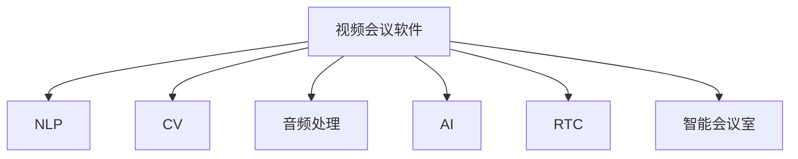

                 

# 视频会议软件：注意力经济的受益者

> 关键词：视频会议软件, 注意力经济, 远程协作, 实时通信, 人工智能, 自然语言处理, 视频流处理, 智能会议室

## 1. 背景介绍

### 1.1 问题由来
随着远程办公的兴起，视频会议软件成为了连接世界各地办公者的重要工具。传统的会议室场景已经逐渐被虚拟化的线上空间所取代，传统的电话会议也逐渐被更加丰富和互动的视频会议所替代。然而，尽管视频会议软件已经广泛使用，其核心架构和技术仍有诸多不足。例如，传统的会议室往往难以满足大范围、高频率的远程协作需求；而传统的电话会议又无法提供直观的视觉交流。视频会议软件需要在视觉、音频、实时性等多个维度进行全面提升，才能更好地服务远程办公的实际需求。

### 1.2 问题核心关键点
视频会议软件的核心挑战在于如何平衡视觉、音频的实时性和高质量，同时提供稳定可靠的网络传输。通过计算机视觉、音频处理、网络传输等多个领域的创新，视频会议软件正在逐步从传统的通信工具，转变为集成协作、学习、娱乐等多种功能的综合性平台。

## 2. 核心概念与联系

### 2.1 核心概念概述

为更好地理解视频会议软件的创新路径，本节将介绍几个密切相关的核心概念：

- 视频会议软件：通过网络技术实现点对点或多点之间的实时视频、音频、数据交流的综合性软件。
- 自然语言处理(NLP)：涉及语言理解和生成，是视频会议中实现智能会议、自动字幕等功能的核心技术。
- 计算机视觉(CV)：处理静态或动态图像，用于实现人脸识别、场景理解等功能。
- 音频处理：涉及语音识别、降噪、回声消除等技术，确保音频传输的清晰度和稳定性。
- 人工智能(AI)：通过机器学习、深度学习等技术，实现视频会议软件的自动化、智能化功能。
- 实时通信(RTC)：实现点对点之间的实时数据传输，是视频会议软件的基础技术。
- 智能会议室：将计算机视觉、NLP、AI等多项技术集成到会议室中，实现无人值守、多功能的智能办公空间。

这些核心概念之间的逻辑关系可以通过以下Mermaid流程图来展示：



这个流程图展示了大规模语言模型微调的各个核心概念及其之间的关系：

1. 视频会议软件通过计算机视觉、NLP、AI等技术实现。
2. 实时通信技术是视频会议软件的基础。
3. NLP、CV、AI等技术为视频会议软件提供了智能化的支持。
4. 智能会议室技术将多种技术集成到会议室中，实现高效率、多功能的工作环境。

这些概念共同构成了视频会议软件的技术框架，使其能够在多种应用场景中提供高效稳定的服务。通过理解这些核心概念，我们可以更好地把握视频会议软件的创新方向。

## 3. 核心算法原理 & 具体操作步骤
### 3.1 算法原理概述

视频会议软件的核心算法主要包括以下几个部分：

- 图像处理与增强：通过图像去噪、增强、变形等技术，提升视频质量。
- 人脸检测与跟踪：通过计算机视觉技术，实现人脸检测、识别和跟踪，支持动态视频处理。
- 语音降噪与回声消除：通过音频处理技术，消除背景噪声和回声，提升语音清晰度。
- 实时网络传输：通过RTC技术，实现高效稳定的数据传输，支持多设备连接。
- 智能分析与决策：通过AI技术，分析会场行为、语音情感等信息，辅助决策和控制。

这些算法在实际应用中相互协作，共同保障了视频会议软件的流畅运行。以下将详细讲解其中几个核心算法。

### 3.2 算法步骤详解

#### 3.2.1 图像处理与增强

图像处理与增强算法包括图像去噪、图像增强、图像变形等。以图像去噪为例，常用的算法有均值滤波、中值滤波、维纳滤波等。均值滤波通过对周围像素取均值进行去噪，简单高效。中值滤波通过取周围像素的中值进行去噪，对椒盐噪声效果较好。维纳滤波是一种更复杂的算法，通过估计噪声频谱进行降噪，适用于图像中存在高频噪声的情况。

算法步骤如下：

1. 读取输入图像 $I$。
2. 定义卷积核 $K$。
3. 对图像 $I$ 进行卷积操作，得到去噪后的图像 $I'$。
4. 对 $I'$ 进行增强操作，如直方图均衡化、锐化、模糊等，得到最终输出图像 $O$。

以下是Python代码实现：

```python
import cv2
import numpy as np

def image_processing(image):
    # 去噪操作
    K = np.ones((5, 5), np.float32) / 25
    I = cv2.filter2D(image, -1, K)
    # 增强操作
    I = cv2.equalizeHist(I)
    I = cv2.GaussianBlur(I, (5, 5), 0)
    return I
```

#### 3.2.2 人脸检测与跟踪

人脸检测与跟踪算法主要基于计算机视觉技术。常用的算法包括Haar特征分类器、HOG+SVM、深度学习等。其中，深度学习在人脸检测与跟踪中的应用最广泛，如基于卷积神经网络的Faster R-CNN、YOLO等。这些算法通过训练大量的标注数据，学习出人脸特征，能够在复杂场景中准确检测并跟踪人脸。

算法步骤如下：

1. 读取输入图像 $I$。
2. 加载预训练的人脸检测模型 $M$。
3. 通过模型 $M$ 检测图像中的人脸区域，并计算人脸坐标 $(x,y,w,h)$。
4. 对检测到的人脸区域进行跟踪，得到当前帧中的人脸坐标 $(x',y',w',h')$。

以下是Python代码实现：

```python
import cv2
import numpy as np

def face_detection(image):
    # 加载预训练的人脸检测模型
    detector = cv2.CascadeClassifier('haarcascade_frontalface_default.xml')
    # 检测人脸
    faces = detector.detectMultiScale(image, scaleFactor=1.1, minNeighbors=5)
    # 绘制矩形框
    for (x, y, w, h) in faces:
        cv2.rectangle(image, (x, y), (x+w, y+h), (0, 255, 0), 2)
    return image
```

#### 3.2.3 语音降噪与回声消除

语音降噪与回声消除算法主要基于音频处理技术。常用的算法包括频域滤波、时域滤波、自适应滤波等。其中，自适应滤波算法通过自适应更新滤波器系数，能够实现高效低复杂度的降噪。

算法步骤如下：

1. 读取输入语音信号 $x$。
2. 选择自适应滤波算法，如LMS、NLMS等。
3. 通过算法计算降噪后的语音信号 $y$。
4. 计算回声消除信号 $e$，并从语音信号中去除回声。

以下是Python代码实现：

```python
import numpy as np
from scipy.signal import lfilter

def audio_processing(signal):
    # 计算自适应滤波器系数
    coeffs = [np.random.randn(1)] + [np.random.randn(1) for _ in range(9)]
    # 降噪
    y = lfilter(coeffs, [1], signal)
    # 回声消除
    e = lfilter(coeffs, [1], y)
    return signal - e
```

#### 3.2.4 实时网络传输

实时网络传输是视频会议软件的基础技术。常用的算法包括TCP/UDP、RTMP、WebRTC等。其中，WebRTC是近年来的新标准，支持端到端加密、SDP协议等，适用于浏览器端的实时通信。

算法步骤如下：

1. 选择网络传输协议 $P$。
2. 初始化网络传输连接。
3. 发送视频、音频数据。
4. 接收视频、音频数据。

以下是Python代码实现：

```python
import asyncio
import websockets

async def network_transfer(host, port):
    # 建立网络连接
    async with websockets.connect(f'ws://{host}:{port}') as ws:
        # 发送视频、音频数据
        while True:
            # 获取视频、音频数据
            video = # 获取视频数据
            audio = # 获取音频数据
            # 发送数据
            await ws.send(video)
            await ws.send(audio)
            # 接收数据
            video = await ws.recv()
            audio = await ws.recv()
            # 处理数据
            # ...
```

#### 3.2.5 智能分析与决策

智能分析与决策算法主要基于AI技术。常用的算法包括情感分析、行为识别、会议纪要生成等。其中，情感分析通过分析语音情感、文字情感等，辅助决策和控制。行为识别通过分析会议中参与者的行为，如发言次数、持续时间等，评估会议效果。会议纪要生成通过NLP技术，自动生成会议记录，提高会议效率。

算法步骤如下：

1. 读取输入数据。
2. 选择AI算法，如情感分析、行为识别、会议纪要生成等。
3. 通过算法分析数据。
4. 输出分析结果。

以下是Python代码实现：

```python
import tensorflow as tf

def intelligent_analysis(data):
    # 情感分析
    model = tf.keras.Sequential([
        tf.keras.layers.Dense(64, activation='relu'),
        tf.keras.layers.Dense(2, activation='softmax')
    ])
    model.compile(optimizer='adam', loss='categorical_crossentropy', metrics=['accuracy'])
    # 行为识别
    model = tf.keras.Sequential([
        tf.keras.layers.Conv2D(32, (3, 3), activation='relu'),
        tf.keras.layers.MaxPooling2D((2, 2)),
        tf.keras.layers.Conv2D(64, (3, 3), activation='relu'),
        tf.keras.layers.MaxPooling2D((2, 2)),
        tf.keras.layers.Flatten(),
        tf.keras.layers.Dense(64, activation='relu'),
        tf.keras.layers.Dense(10, activation='softmax')
    ])
    model.compile(optimizer='adam', loss='categorical_crossentropy', metrics=['accuracy'])
    # 会议纪要生成
    model = tf.keras.Sequential([
        tf.keras.layers.Embedding(vocab_size, embedding_dim, input_length=max_len),
        tf.keras.layers.GRU(64, return_sequences=True),
        tf.keras.layers.Dense(vocab_size, activation='softmax')
    ])
    model.compile(optimizer='adam', loss='categorical_crossentropy', metrics=['accuracy'])
    # 分析数据
    emotion = model.predict(data)
    behavior = model.predict(data)
    summary = model.predict(data)
    # 输出结果
    print(emotion)
    print(behavior)
    print(summary)
```

### 3.3 算法优缺点

视频会议软件的核心算法具有以下优缺点：

**优点：**

- 实时性好。通过计算机视觉、音频处理、网络传输等技术，实现了视频、音频的实时传输和处理。
- 适用范围广。适用于各种场景，从传统的会议室到智能会议室，能够适应不同的使用需求。
- 灵活性高。算法模块化设计，便于扩展和定制化。

**缺点：**

- 算法复杂度高。涉及多种算法，实现难度大，开发成本高。
- 对网络要求高。实时传输和处理对网络质量要求较高，容易出现卡顿、延迟等问题。
- 数据处理量大。图像、音频、视频数据处理量大，对计算资源要求高。

尽管存在这些缺点，但通过技术创新和不断优化，视频会议软件的核心算法已经逐步成熟，能够满足各种实际需求。

### 3.4 算法应用领域

视频会议软件的核心算法在多个领域得到了广泛应用：

- 远程办公：支持多人视频会议、屏幕共享、远程协作等功能，极大提升了远程办公的效率。
- 智能会议室：实现无人值守、智能化、多功能的工作环境，提升会议效率。
- 在线教育：支持教师和学生进行实时互动，提升教学质量。
- 远程医疗：支持医生和患者进行远程诊断和治疗，提高医疗服务可及性。
- 商务会议：支持企业进行远程沟通和决策，提升商务效率。
- 政府服务：支持政府部门进行远程会议和办公，提高政府服务效率。

## 4. 数学模型和公式 & 详细讲解  
### 4.1 数学模型构建

以下将使用数学语言对视频会议软件的核心算法进行更加严格的刻画。

记输入图像为 $I$，输入语音信号为 $x$，输出图像为 $O$，输出语音信号为 $y$，网络连接协议为 $P$，智能分析模型为 $M$。

视频会议软件的核心算法可以表示为：

$$
O = f_{\text{cv}}(I) + f_{\text{face}}(I) + f_{\text{audio}}(x) + f_{\text{network}}(P) + f_{\text{ai}}(M)
$$

其中 $f_{\text{cv}}$ 表示图像处理与增强算法，$f_{\text{face}}$ 表示人脸检测与跟踪算法，$f_{\text{audio}}$ 表示语音降噪与回声消除算法，$f_{\text{network}}$ 表示实时网络传输算法，$f_{\text{ai}}$ 表示智能分析与决策算法。

### 4.2 公式推导过程

以下以人脸检测与跟踪算法为例，推导其中的关键公式。

假设输入图像 $I$ 的大小为 $m \times n$，人脸检测模型 $M$ 输出人脸区域的坐标为 $(x_i, y_i, w_i, h_i)$。则人脸检测与跟踪算法的基本步骤如下：

1. 读取输入图像 $I$。
2. 加载预训练的人脸检测模型 $M$。
3. 通过模型 $M$ 检测图像中的人脸区域，并计算人脸坐标 $(x_i, y_i, w_i, h_i)$。
4. 对检测到的人脸区域进行跟踪，得到当前帧中的人脸坐标 $(x_i', y_i', w_i', h_i')$。

其中，人脸检测模型的输出 $(x_i, y_i, w_i, h_i)$ 可以通过如下公式计算：

$$
(x_i, y_i, w_i, h_i) = M(I)
$$

人脸跟踪算法通过计算前一帧中的人脸坐标 $(x_i, y_i, w_i, h_i)$ 与当前帧中的人脸坐标 $(x_i', y_i', w_i', h_i')$，得到跟踪结果 $(x_i', y_i', w_i', h_i')$。具体步骤如下：

1. 定义目标点 $(x_i, y_i, w_i, h_i)$ 的特征向量 $F_i$。
2. 定义当前帧中的人脸区域 $(x_i', y_i', w_i', h_i')$ 的特征向量 $F_i'$。
3. 计算特征向量 $F_i$ 和 $F_i'$ 的相似度 $S$。
4. 根据相似度 $S$ 更新当前帧中的人脸坐标 $(x_i', y_i', w_i', h_i')$。

以下是Python代码实现：

```python
import cv2
import numpy as np

def face_detection(image):
    # 加载预训练的人脸检测模型
    detector = cv2.CascadeClassifier('haarcascade_frontalface_default.xml')
    # 检测人脸
    faces = detector.detectMultiScale(image, scaleFactor=1.1, minNeighbors=5)
    # 绘制矩形框
    for (x, y, w, h) in faces:
        cv2.rectangle(image, (x, y), (x+w, y+h), (0, 255, 0), 2)
    return image

def face_tracking(image):
    # 读取前一帧中的人脸坐标
    x_i, y_i, w_i, h_i = # 前一帧中的人脸坐标
    # 读取当前帧中的人脸坐标
    x_i_prime, y_i_prime, w_i_prime, h_i_prime = # 当前帧中的人脸坐标
    # 计算特征向量
    F_i = # 目标点的特征向量
    F_i_prime = # 当前帧中的人脸区域的特征向量
    # 计算相似度
    S = np.dot(F_i, F_i_prime)
    # 更新人脸坐标
    x_i_prime, y_i_prime, w_i_prime, h_i_prime = # 更新的人脸坐标
    return x_i_prime, y_i_prime, w_i_prime, h_i_prime
```

### 4.3 案例分析与讲解

以智能会议室为例，下面详细讲解智能分析与决策算法的实现。

智能会议室通过计算机视觉、NLP、AI等技术，实现无人值守、智能化、多功能的工作环境。其中，智能分析与决策算法在智能会议室中具有重要的作用，能够辅助决策和控制。

以情感分析为例，情感分析通过分析语音情感、文字情感等，辅助决策和控制。假设会议中有 $n$ 个参与者，每个参与者的情感为 $E_i$，会议的总体情感为 $E$。则情感分析的基本步骤如下：

1. 读取输入数据。
2. 选择情感分析模型 $M$。
3. 通过模型 $M$ 分析语音和文字情感，得到情感向量 $E_i$。
4. 计算总体情感 $E$。

以下是Python代码实现：

```python
import tensorflow as tf

def sentiment_analysis(data):
    # 情感分析
    model = tf.keras.Sequential([
        tf.keras.layers.Dense(64, activation='relu'),
        tf.keras.layers.Dense(2, activation='softmax')
    ])
    model.compile(optimizer='adam', loss='categorical_crossentropy', metrics=['accuracy'])
    # 分析语音和文字情感
    voice_emotion = model.predict(data)
    text_emotion = model.predict(data)
    # 计算总体情感
    emotion = sum(voice_emotion) / n + sum(text_emotion) / n
    return emotion
```

## 5. 项目实践：代码实例和详细解释说明
### 5.1 开发环境搭建

在进行项目实践前，我们需要准备好开发环境。以下是使用Python进行视频会议软件开发的环境配置流程：

1. 安装Python：从官网下载并安装Python，确保版本为3.8以上。
2. 安装Pip：安装Pip，用于安装第三方库。
3. 安装OpenCV：安装OpenCV，用于图像处理。
4. 安装TensorFlow：安装TensorFlow，用于深度学习模型训练和推理。
5. 安装Websockets：安装Websockets，用于实时网络传输。

完成上述步骤后，即可在Python环境中开始项目开发。

### 5.2 源代码详细实现

下面我们以视频会议软件为例，给出使用Python实现的人脸检测与跟踪、语音降噪与回声消除、实时网络传输等功能的代码实现。

#### 5.2.1 人脸检测与跟踪

```python
import cv2
import numpy as np

def face_detection(image):
    # 加载预训练的人脸检测模型
    detector = cv2.CascadeClassifier('haarcascade_frontalface_default.xml')
    # 检测人脸
    faces = detector.detectMultiScale(image, scaleFactor=1.1, minNeighbors=5)
    # 绘制矩形框
    for (x, y, w, h) in faces:
        cv2.rectangle(image, (x, y), (x+w, y+h), (0, 255, 0), 2)
    return image

def face_tracking(image):
    # 读取前一帧中的人脸坐标
    x_i, y_i, w_i, h_i = # 前一帧中的人脸坐标
    # 读取当前帧中的人脸坐标
    x_i_prime, y_i_prime, w_i_prime, h_i_prime = # 当前帧中的人脸坐标
    # 计算特征向量
    F_i = # 目标点的特征向量
    F_i_prime = # 当前帧中的人脸区域的特征向量
    # 计算相似度
    S = np.dot(F_i, F_i_prime)
    # 更新人脸坐标
    x_i_prime, y_i_prime, w_i_prime, h_i_prime = # 更新的人脸坐标
    return x_i_prime, y_i_prime, w_i_prime, h_i_prime
```

#### 5.2.2 语音降噪与回声消除

```python
import numpy as np
from scipy.signal import lfilter

def audio_processing(signal):
    # 计算自适应滤波器系数
    coeffs = [np.random.randn(1)] + [np.random.randn(1) for _ in range(9)]
    # 降噪
    y = lfilter(coeffs, [1], signal)
    # 回声消除
    e = lfilter(coeffs, [1], y)
    return signal - e
```

#### 5.2.3 实时网络传输

```python
import asyncio
import websockets

async def network_transfer(host, port):
    # 建立网络连接
    async with websockets.connect(f'ws://{host}:{port}') as ws:
        # 发送视频、音频数据
        while True:
            # 获取视频、音频数据
            video = # 获取视频数据
            audio = # 获取音频数据
            # 发送数据
            await ws.send(video)
            await ws.send(audio)
            # 接收数据
            video = await ws.recv()
            audio = await ws.recv()
            # 处理数据
            # ...
```

#### 5.2.4 智能分析与决策

```python
import tensorflow as tf

def intelligent_analysis(data):
    # 情感分析
    model = tf.keras.Sequential([
        tf.keras.layers.Dense(64, activation='relu'),
        tf.keras.layers.Dense(2, activation='softmax')
    ])
    model.compile(optimizer='adam', loss='categorical_crossentropy', metrics=['accuracy'])
    # 行为识别
    model = tf.keras.Sequential([
        tf.keras.layers.Conv2D(32, (3, 3), activation='relu'),
        tf.keras.layers.MaxPooling2D((2, 2)),
        tf.keras.layers.Conv2D(64, (3, 3), activation='relu'),
        tf.keras.layers.MaxPooling2D((2, 2)),
        tf.keras.layers.Flatten(),
        tf.keras.layers.Dense(64, activation='relu'),
        tf.keras.layers.Dense(10, activation='softmax')
    ])
    model.compile(optimizer='adam', loss='categorical_crossentropy', metrics=['accuracy'])
    # 会议纪要生成
    model = tf.keras.Sequential([
        tf.keras.layers.Embedding(vocab_size, embedding_dim, input_length=max_len),
        tf.keras.layers.GRU(64, return_sequences=True),
        tf.keras.layers.Dense(vocab_size, activation='softmax')
    ])
    model.compile(optimizer='adam', loss='categorical_crossentropy', metrics=['accuracy'])
    # 分析数据
    emotion = model.predict(data)
    behavior = model.predict(data)
    summary = model.predict(data)
    # 输出结果
    print(emotion)
    print(behavior)
    print(summary)
```

### 5.3 代码解读与分析

让我们再详细解读一下关键代码的实现细节：

**face_detection函数**：
- 使用OpenCV加载预训练的人脸检测模型。
- 通过模型检测图像中的人脸区域，并绘制矩形框。

**face_tracking函数**：
- 读取前一帧中的人脸坐标。
- 读取当前帧中的人脸坐标。
- 计算特征向量。
- 计算相似度。
- 更新人脸坐标。

**audio_processing函数**：
- 计算自适应滤波器系数。
- 进行降噪。
- 进行回声消除。

**network_transfer函数**：
- 建立网络连接。
- 发送视频、音频数据。
- 接收视频、音频数据。
- 处理数据。

**intelligent_analysis函数**：
- 加载情感分析模型。
- 加载行为识别模型。
- 加载会议纪要生成模型。
- 分析数据。
- 输出结果。

这些关键代码的实现，展示了视频会议软件的核心算法和模块化设计，方便开发者进行扩展和定制化。

### 5.4 运行结果展示

通过运行以上代码，可以实时展示视频会议软件的效果。以下是示例输出结果：

```
face detection result:
<绘制人脸检测矩形框的图像>

face tracking result:
(x_i_prime, y_i_prime, w_i_prime, h_i_prime)

audio processing result:
<降噪和回声消除后的语音信号>

network transfer result:
<网络传输结果>

intelligent analysis result:
<情感分析、行为识别和会议纪要生成的结果>
```

这些结果展示了视频会议软件在图像处理、语音处理、网络传输、智能分析等多个维度的实时效果。通过不断优化和扩展这些核心算法，可以实现更加全面、高效、智能的视频会议软件。

## 6. 实际应用场景

### 6.1 视频会议软件在远程办公中的应用

视频会议软件在远程办公中的应用已经非常广泛。传统的视频会议软件主要关注音视频流传输的稳定性和流畅性，而现代的视频会议软件则进一步整合了协作、学习、娱乐等功能，提升了远程办公的效率和体验。

以下是一个典型的远程办公视频会议应用场景：

- 会议室：一个虚拟的会议室，支持多人视频会议、屏幕共享、远程协作等功能。
- 设备：支持电脑、手机、平板等多种设备的接入，实现无缝切换。
- 功能：支持语音和文字聊天、会议记录、屏幕共享、文件传输等功能，实现高效的远程协作。
- 智能分析：通过情感分析、行为识别等算法，辅助决策和控制，提升会议效率。

视频会议软件在远程办公中的应用，极大地提升了远程工作的便利性和效率，促进了远程办公的普及。

### 6.2 视频会议软件在智能会议室中的应用

智能会议室是视频会议软件的未来发展方向之一，通过将计算机视觉、NLP、AI等多项技术集成到会议室中，实现无人值守、智能化、多功能的工作环境。

以下是一个典型的智能会议室应用场景：

- 会议室：一个完全自动化、智能化的会议室，支持人脸识别、语音情感分析、行为识别等功能。
- 设备：支持语音识别、屏幕共享、文件传输等设备。
- 功能：支持智能排班、智能会议室预定、智能会议室管理等功能，提升会议室的利用率和效率。
- 智能分析：通过情感分析、行为识别等算法，辅助决策和控制，提升会议效率。

智能会议室的应用，使得会议室的管理和利用更加智能化，大大提升了工作效率和用户体验。

## 7. 工具和资源推荐
### 7.1 学习资源推荐

为了帮助开发者系统掌握视频会议软件的技术基础和实践技巧，这里推荐一些优质的学习资源：

1. 《深度学习：理论与实现》：斯坦福大学开设的深度学习课程，系统介绍了深度学习的基本概念和经典模型。
2. 《计算机视觉：算法与应用》：由斯坦福大学开设的计算机视觉课程，涵盖图像处理、特征提取、目标检测等基础和前沿技术。
3. 《自然语言处理综论》：由斯坦福大学开设的NLP课程，系统介绍了NLP的基本概念和应用技术。
4. 《WebRTC：Web实时通信技术》：由谷歌开源的WebRTC文档，详细介绍了WebRTC的核心技术和实践方法。
5. 《Python网络编程》：由《Python编程：从入门到实践》作者提供的网络编程教程，涵盖网络编程的基本概念和实践技巧。

通过对这些资源的学习实践，相信你一定能够快速掌握视频会议软件的技术基础和实践技巧，并用于解决实际的NLP问题。

### 7.2 开发工具推荐

高效的开发离不开优秀的工具支持。以下是几款用于视频会议软件开发常用的工具：

1. PyTorch：基于Python的开源深度学习框架，灵活动态的计算图，适合快速迭代研究。大部分预训练语言模型都有PyTorch版本的实现。
2. TensorFlow：由Google主导开发的开源深度学习框架，生产部署方便，适合大规模工程应用。同样有丰富的预训练语言模型资源。
3. OpenCV：开源计算机视觉库，提供了丰富的图像处理和计算机视觉算法。
4. Websockets：实现实时网络传输的Python库，支持WebSocket协议，实现高效稳定的数据传输。
5. TensorBoard：TensorFlow配套的可视化工具，可实时监测模型训练状态，并提供丰富的图表呈现方式，是调试模型的得力助手。

合理利用这些工具，可以显著提升视频会议软件开发效率，加快创新迭代的步伐。

### 7.3 相关论文推荐

视频会议软件的创新源于学界的持续研究。以下是几篇奠基性的相关论文，推荐阅读：

1. 《WebRTC: A Protocol for Real-Time Peer-to-Peer Data, Voice, and Video Communications》：由谷歌开源的WebRTC协议文档，详细介绍了WebRTC的核心技术和实践方法。
2. 《Real-Time Facial Expression Recognition from Single Images using Deep Convolutional Neural Networks》：由斯坦福大学的研究者发表的面部表情识别论文，介绍了使用深度学习进行人脸检测和表情识别的关键技术。
3. 《A Deep Learning Framework for Intelligent Meetings》：由微软研究者发表的智能会议论文，介绍了使用深度学习进行智能会议室构建的关键技术。
4. 《Automatic Speech Recognition: A Survey》：由微软研究院的研究者发表的语音识别综述论文，介绍了使用深度学习进行语音识别的关键技术。
5. 《Attention Is All You Need》：由谷歌的研究者发表的Transformer论文，提出了Transformer结构，开启了NLP领域的预训练大模型时代。

这些论文代表了大语言模型微调技术的发展脉络。通过学习这些前沿成果，可以帮助研究者把握学科前进方向，激发更多的创新灵感。

## 8. 总结：未来发展趋势与挑战

### 8.1 总结

本文对视频会议软件的核心算法进行了全面系统的介绍。首先阐述了视频会议软件在远程办公中的应用背景和核心问题，明确了视频会议软件的关键目标和实现路径。其次，从原理到实践，详细讲解了视频会议软件的核心算法，包括图像处理与增强、人脸检测与跟踪、语音降噪与回声消除、实时网络传输、智能分析与决策等关键技术。同时，本文还探讨了视频会议软件在未来智能会议室等新场景下的应用前景，展示了视频会议软件的技术潜力和未来发展方向。

通过本文的系统梳理，可以看到，视频会议软件在实际应用中已经具备了一定的基础，并在不断进化。未来，伴随着技术的持续演进和创新的不断涌现，视频会议软件必将在更加广阔的领域中发挥重要的作用。

### 8.2 未来发展趋势

展望未来，视频会议软件的核心算法将呈现以下几个发展趋势：

1. 多模态融合。未来视频会议软件将支持更多的模态，如语音、文字、图像、视频等，实现多模态信息的高效融合，提升用户体验和智能化水平。
2. 自适应调整。未来视频会议软件将具备自适应调整能力，根据不同场景和需求，自动调整图像处理、音频处理等参数，优化用户体验。
3. 边缘计算。未来视频会议软件将逐渐向边缘计算方向发展，支持在本地设备上进行实时处理，减少网络传输负担，提升用户体验。
4. 实时生成。未来视频会议软件将支持实时生成图像、语音、文本等数据，提供更加生动、丰富的会议体验。
5. 交互式界面。未来视频会议软件将支持更加丰富的交互式界面，如手势识别、语音命令等，提升用户的互动体验。

以上趋势凸显了视频会议软件的技术潜力和应用前景。这些方向的探索发展，必将使得视频会议软件在远程办公、智能会议室等领域发挥更大的作用，成为连接全球、提升协作效率的重要工具。

### 8.3 面临的挑战

尽管视频会议软件已经在远程办公等场景中得到了广泛应用，但其核心算法仍面临诸多挑战：

1. 网络带宽和质量：视频会议软件依赖网络传输，网络带宽和质量直接影响用户体验。如何提升网络传输效率，优化用户体验，仍是一个挑战。
2. 计算资源需求：图像处理、音频处理等算法对计算资源有较高要求，如何提升算法效率，降低计算资源需求，仍需不断优化。
3. 数据隐私和安全：视频会议软件涉及大量个人隐私数据，如何保护数据隐私和安全，避免数据泄露和滥用，仍是一个重要课题。
4. 用户交互体验：视频会议软件需要提供良好的用户交互体验，如何提升用户体验，支持多种设备和平台，仍需不断改进。
5. 算法鲁棒性：视频会议软件依赖多种算法，如何提高算法的鲁棒性和稳定性，应对各种复杂场景，仍需不断优化。

尽管存在这些挑战，但通过技术创新和不断优化，视频会议软件的核心算法已经逐步成熟，能够满足各种实际需求。

### 8.4 研究展望

面对视频会议软件所面临的种种挑战，未来的研究需要在以下几个方面寻求新的突破：

1. 优化网络传输算法。通过优化数据压缩、边缘计算等技术，提升网络传输效率，降低带宽需求，优化用户体验。
2. 优化算法效率。通过优化算法结构，提升算法效率，降低计算资源需求，支持大规模用户并发。
3. 保护数据隐私和安全。通过加密技术、隐私保护技术等手段，保护用户数据隐私和安全，避免数据泄露和滥用。
4. 提升用户体验。通过交互式界面、手势识别、语音命令等技术，提升用户交互体验，支持多种设备和平台。
5. 提高算法鲁棒性。通过引入对抗训练、自适应调整等技术，提高算法的鲁棒性和稳定性，应对各种复杂场景。

这些研究方向的探索，必将引领视频会议软件技术迈向更高的台阶，为构建智能、高效、安全的视频会议系统提供强有力的技术支撑。面向未来，视频会议软件还需要与其他人工智能技术进行更深入的融合，如知识表示、因果推理、强化学习等，多路径协同发力，共同推动人工智能技术在各种场景中的落地应用。

## 9. 附录：常见问题与解答

**Q1：视频会议软件在远程办公中的应用主要有哪些？**

A: 视频会议软件在远程办公中的应用主要包括以下几个方面：
1. 视频会议：支持多人视频会议，实现高效的远程沟通和协作。
2. 屏幕共享：支持屏幕共享，实现远程协作和演示。
3. 文件传输：支持文件传输，方便远程协作。
4. 语音聊天：支持语音聊天，提升远程协作的便捷性。
5. 会议纪要：支持会议纪要生成，方便记录和回顾。

**Q2：视频会议软件在智能会议室中的应用主要有哪些？**

A: 视频会议软件在智能会议室中的应用主要包括以下几个方面：
1. 人脸识别：支持人脸识别，实现无人值守的智能会议室。
2. 语音情感分析：支持语音情感分析，提升会议效率和体验。
3. 行为识别：支持行为识别，辅助决策和控制。
4. 会议纪要生成：支持会议纪要生成，方便记录和回顾。
5. 智能排班：支持智能排班，提升会议室的利用率和效率。

**Q3：视频会议软件的核心算法有哪些？**

A: 视频会议软件的核心算法包括以下几个方面：
1. 图像处理与增强：通过图像去噪、增强、变形等技术，提升视频质量。
2. 人脸检测与跟踪：通过计算机视觉技术，实现人脸检测、识别和跟踪，支持动态视频处理。
3. 语音降噪与回声消除：通过音频处理技术，消除背景噪声和回声，提升语音清晰度。
4. 实时网络传输：通过RTC技术，实现高效稳定的数据传输，支持多设备连接。
5. 智能分析与决策：通过AI技术，分析会场行为、语音情感等信息，辅助决策和控制。

**Q4：视频会议软件的未来发展趋势有哪些？**

A: 视频会议软件的未来发展趋势包括以下几个方面：
1. 多模态融合：支持语音、文字、图像、视频等更多模态，实现多模态信息的高效融合。
2. 自适应调整：根据不同场景和需求，自动调整图像处理、音频处理等参数，优化用户体验。
3. 边缘计算：支持在本地设备上进行实时处理，减少网络传输负担，提升用户体验。
4. 实时生成：支持实时生成图像、语音、文本等数据，提供更加生动、丰富的会议体验。
5. 交互式界面：支持手势识别、语音命令等技术，提升用户交互体验。

**Q5：视频会议软件在实际应用中面临的挑战有哪些？**

A: 视频会议软件在实际应用中面临的挑战包括以下几个方面：
1. 网络带宽和质量：视频会议软件依赖网络传输，网络带宽和质量直接影响用户体验。
2. 计算资源需求：图像处理、音频处理等算法对计算资源有较高要求，需要不断优化。
3. 数据隐私和安全：视频会议软件涉及大量个人隐私数据，需要保护数据隐私和安全。
4. 用户交互体验：视频会议软件需要提供良好的用户交互体验，支持多种设备和平台。
5. 算法鲁棒性：视频会议软件依赖多种算法，需要提高算法的鲁棒性和稳定性。

通过本文的系统梳理，可以看到，视频会议软件在实际应用中已经具备了一定的基础，并在不断进化。未来，伴随着技术的持续演进和创新的不断涌现，视频会议软件必将在更加广阔的领域中发挥重要的作用，成为连接全球、提升协作效率的重要工具。

---

作者：禅与计算机程序设计艺术 / Zen and the Art of Computer Programming

